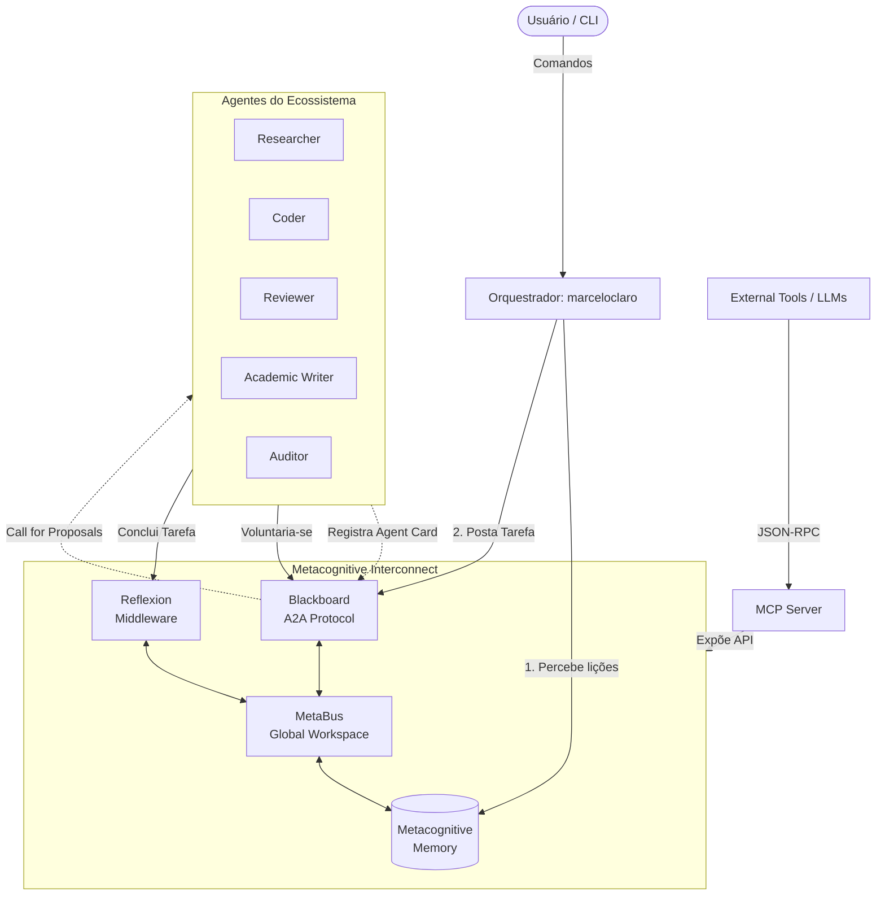

# Arquitetura: OpenCode Ecosystem Core

Este documento detalha a arquitetura do núcleo do OpenCode Ecosystem, centrada no orquestrador `marceloclaro` e na camada **Metacognitive Interconnect (MCI)**.

## Diagrama de Arquitetura

## Fluxo de Vida de uma Tarefa

1. **Registro (Agent Loader):** Na inicialização, o sistema lê os arquivos `agents/*.md` e extrai o *frontmatter* YAML. Cada agente é registrado no Blackboard com um **Agent Card** (Padrão A2A), declarando suas capacidades (`search`, `python`, `audit`, etc.).
2. **Percepção (Orchestrator):** Antes de delegar qualquer tarefa, o orquestrador `marceloclaro` consulta o Global Workspace (Memória Metacognitiva) para herdar o contexto recente e as lições aprendidas em falhas anteriores.
3. **Delegação (Blackboard):** O orquestrador posta a tarefa no Blackboard, especificando as capacidades requeridas.
4. **Voluntariado:** O Blackboard emite um *Call for Proposals (CFP)* para os agentes elegíveis. Se houver múltiplos candidatos, o Blackboard os ordena pelo *Confidence Ledger* (um score mantido via Média Móvel Exponencial baseado no histórico de sucesso).
5. **Execução e Reflexão:** O agente selecionado executa a tarefa. Ao reportar a conclusão, o *Reflexion Middleware* intercepta o evento, gera uma auto-reflexão sobre a abordagem utilizada, atualiza o *Confidence Ledger* do agente e persiste as lições na memória semântica.
