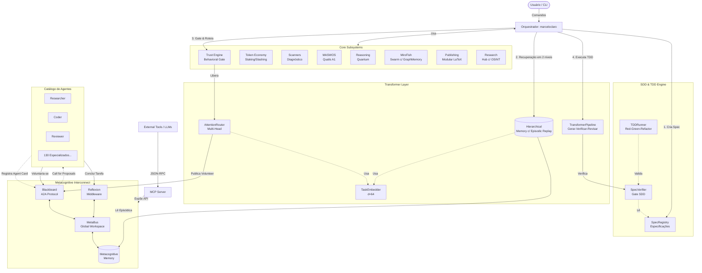

# Arquitetura: OpenCode Ecosystem Core

Este documento detalha a arquitetura do núcleo do OpenCode Ecosystem, centrada no orquestrador `marceloclaro` e na camada **Metacognitive Interconnect (MCI)**.

## Diagrama de Arquitetura

## Fluxo de Vida de uma Tarefa (Arquitetura Transformer + MCI + SDD)

1. **Registro (Agent Loader):** Na inicialização, o sistema lê os arquivos `agents/*.md` e extrai o *frontmatter* YAML. Cada agente é registrado no Blackboard com um **Agent Card** (Padrão A2A).
2. **Especificação (SDD):** Antes de delegar, o orquestrador cria uma Especificação (TSPEC) contendo o objetivo e critérios de aceitação verificáveis. A tarefa nasce na fase **RED**.
3. **Percepção Hierárquica (HTM):** O orquestrador consulta a memória global usando a `HierarchicalMemory`. O `TaskEmbedder` vetoriza a consulta e a atenção é feita em dois níveis: atenção grossa sobre sumários de chunks, seguida de atenção fina sobre os eventos dos melhores chunks.
3. **Delegação via Atenção (Multi-Head Attention):** A tarefa é postada no Blackboard. Quando o *Call for Proposals (CFP)* retorna os agentes elegíveis, o `AttentionRouter` calcula scores softmax baseados em 4 cabeças: semântica (vetores d=64), cobertura de capacidade, *confidence ledger* e carga atual. O agente com maior score recebe a atribuição.
5. **Execução (TDD + Transformer):** A tarefa entra no *encoder stack*. O agente selecionado executa o ciclo TDD (**RED → GREEN → REFACTOR**). O `SpecVerifier` atua como *gate*: a entrega só avança se satisfizer 100% dos critérios da especificação. Se aprovada, o `GradingHead` avalia a qualidade da implementação.
6. **Reflexão (MCI):** Ao reportar a conclusão, o *Reflexion Middleware* intercepta o evento, gera uma auto-reflexão, atualiza o *Confidence Ledger* do agente e persiste a experiência na memória semântica para futuras recuperações.
