# Arquitetura: OpenCode Ecosystem Core v3.0

Este documento detalha a arquitetura atual do ecossistema, incluindo o **Pipeline Acadêmico Agentivo (R101–R105)**, **Evolutionary Memory (R97)**, **Scientific RAG Evolved (R99)**, **MCP Security (R100)**, **CI/CD Quality Gates (R106)**, e os subsistemas legados de governança científica e jurídica.

---

## Diagrama de Arquitetura Completo

```mermaid
graph TD
    %% Atores e Orquestrador
    User([Usuário / CLI]) -->|Comandos| Orchestrator[Orquestrador: marceloclaro]
    WebUI([Webapp Streamlit<br>Dashboard + Jurídico]) -->|Painel visual| Orchestrator
    
    %% Camada SDD/TDD
    subgraph SDD [SDD & TDD Engine]
        Spec[SpecRegistry<br>Especificações]
        Ver[SpecVerifier<br>Gate SDD]
        TDD[TDDRunner<br>Red-Green-Refactor]
        
        TDD -.->|Valida| Ver
        Ver -.->|Lê| Spec
    end

    %% Camada Transformer
    subgraph TF [Transformer Layer]
        Attn[AttentionRouter<br>Multi-Head]
        Pipe[TransformerPipeline<br>Gerar-Verificar-Revisar]
        HTM[(Hierarchical<br>Memory HTM)]
        Emb[TaskEmbedder<br>d=64]
        
        Attn -.->|Usa| Emb
        HTM -.->|Usa| Emb
    end
    
    %% Pipeline Academico Agentivo (R101-R105)
    subgraph Acad ["Pipeline Academico Agentivo (R101-R105)"]
        EvoSci["R101: EvoSci<br>MentorAgent<br>PrimeResearcherAgent<br>ReviewerAgent<br>EvolutionManagerAgent<br>EvoEngine (Selection/Crossover/Mutation/Inheritance)"]
        DeepRes["R102: Deep Research<br>KnowledgeBaseRegistry<br>BFRSAgent<br>DFRSAgent<br>ExecutionSandbox<br>OrchestratorAgent"]
        PReview["R103: Peer Review<br>RubricEngine (8 dim)<br>ReviewLedger<br>AuditGraph<br>MultiCriticReviewer<br>OrchestratorReviewer"]
        Revision["R104d: Revision<br>ReviewAnalyzer<br>SectionMapper<br>ProposalGenerator<br>DiffEngine (rollback)<br>OrchestratorRevision"]
        Composer["R105: Paper Composer<br>StructurePlanner<br>SectionWriter (6 secoes)<br>CitationFormatter (3 estilos)<br>CrossConsistencyVerifier<br>OrchestratorComposer"]
        
        EvoSci --> DeepRes
        DeepRes --> PReview
        PReview --> Revision
        Revision --> Composer
    end
    
    %% Camada Core
    subgraph Core [Core Subsystems]
        Trust[Trust Engine<br>Behavioral Gate]
        Eco[Token Economy<br>Staking/Slashing]
        Scan[Scanners & Deep Diagnose<br>M1-M5/Prioritizer]
        Acad[MASWOS<br>Qualis A1]
        Reason[Reasoning<br>12 Engines + Quantum]
        Legal[Legal Reasoning + AuxJuris<br>SPEC-921/922/923/924/925/926/927/928]
        LegalBench[Legal Benchmarks<br>SPEC-928]
        RAG[Scientific RAG<br>Grounding + Citations]
        RAGEvolved["Scientific RAG Evolved (R99)<br>AdaptiveRetriever<br>CitationGraph<br>OutlineSynthesizer"]
        Bench[Superhuman Readiness<br>Benchmarks + Tiers]
        MetaEval[Metacognitive Eval<br>SPEC-920]
        MiroFish[MiroFish<br>Swarm c/ GraphMemory]
        SynthUniv["Synthetic University<br>SPEC-935 · 11 Faculdades"]
        Publishing[Publishing<br>LaTeX & Cover Designer]
        Research[Research<br>Hub c/ OSINT]
        Illus[Illustrations<br>Mermaid/MIRA/Graph]
        EvoMem["Evolutionary Memory (R97)<br>IdeationMemory<br>ExperimentationMemory<br>HeartbeatReflection<br>StagnationDetector"]
        NoveltyV2["Novelty V2 (R98)<br>ContributionPointExtractor<br>PointwiseLiteratureRetriever<br>PointwiseNoveltyScorer<br>HierarchicalTaxonomyBuilder"]
    end

    %% Seguranca e Qualidade
    subgraph Security ["Seguranca & Qualidade"]
        MCPSec["MCP Security (R100)<br>MCPGuard<br>AuditLogger<br>ToolVetter<br>RateLimiter"]
        CICD["CI/CD Pipeline (R106)<br>GitHub Actions: Lint+Test+Package<br>scripts/quality_report.py<br>scripts/check_coverage.py<br>scripts/run_full_suite.sh"]
        Skills["Skills Exportaveis (R104a)<br>evo-science<br>deep-research<br>peer-review-v2<br>mcp-security"]
        PipPkg["Pip Packages (R104b)<br>opencode-evosci<br>opencode-deep-research<br>opencode-peer-review"]
    end

    %% Camada Scientific Governance (legado)
    subgraph SGP [Scientific Governance Pipeline v2.x]
        OQS[OQS<br>Optimal Question Scanner]
        SCI[MCI Scientific Core<br>Hipótese·Experimento·Estatística]
        VSEE[VSEE<br>Vector Shortcut Engine]
        EGS[EGS<br>Ethical Governance Scanner]
        EvidenceGraph[EvidenceGraph<br>Memória Epistemológica]
        
        OQS --> SCI
        SCI --> VSEE
        VSEE --> EGS
        EGS -.->|Registra| EvidenceGraph
    end

    %% Camada MCI
    subgraph MCI [Metacognitive Interconnect]
        MB[MetaBus<br>Global Workspace]
        BB[Blackboard<br>A2A Protocol]
        Mem[(Metacognitive<br>Memory)]
        Ref[Reflexion<br>Middleware]
        
        MB <--> Mem
        BB <--> MB
        Ref <--> MB
    end
    
    %% Orquestrador integra as camadas
    Orchestrator -->|1. Cria Spec| Spec
    Orchestrator -->|2. Recuperação em 2 níveis| HTM
    HTM -->|Lê Episódica| Mem
    Orchestrator -->|3. Gate & Roteia| Trust
    Trust -->|Libera| Attn
    Attn -->|Publica Volunteer| BB
    Orchestrator -->|4. Executa TDD| Pipe
    Pipe -->|Verifica| Ver
    Orchestrator <-->|Usa| Core
    
    %% Conexões do pipeline academico
    Orchestrator -->|5. Pipeline Academico| EvoSci
    EvoSci -->|Alimenta| DeepRes
    DeepRes -->|Produz evidencia| PReview
    PReview -->|Gera revisao| Revision
    Revision -->|Manuscrito revisado| Composer
    Composer -->|Artigo final| Orchestrator
    
    %% Conexões de suporte
    Acad -->|Consulta evidências| RAG
    Reason -->|Grounding científico| RAG
    RAG -->|Métricas| Bench
    RAGEvolved -->|Citacoes em grafo| DeepRes
    EvoMem -->|Memoria de direcoes| EvoSci
    NoveltyV2 -->|Analise de novidade| EvoSci
    
    MB -->|Traços e reflexões| MetaEval
    Trust -->|Confiança e outcomes| MetaEval
    Orchestrator -->|6. Raciocínio Jurídico| Legal
    
    Legal -->|Subsunção + Ponderação| Reason
    Legal -->|Interpretação Constitucional| MetaEval
    Legal -->|RAG jurídico + Datajud| RAG
    Legal -->|Agentes jurídicos A2A| BB
    Legal -->|Especialização por 7 ramos| LegalBench
    LegalBench -->|tiers conservadores| MetaEval
    
    %% Seguranca
    MCPSec -.->|Protege| MB
    CICD -.->|Valida qualidade| Pipe
    Skills -.->|Exporta| BB
    PipPkg -.->|Distribui| External
    
    SynthUniv -->|10k+ combinações via MiroFish| MiroFish
    SynthUniv -->|Publica descobertas| MB
    EGS -->|Reflete Resultado| MB
    
    %% Agentes
    subgraph Agents [Catálogo de Agentes 160+]
        A1[Researcher]
        A2[Coder]
        A3[Reviewer]
        A4[32 MASWOS Agents]
        A5[Academic Writer]
        A6[Deep Research]
        A7[Peer Review]
        A8[Paper Composer]
        A9[Revision Agent]
        A10[EvoSci Agent]
    end
    
    %% Fluxo de Agentes
    Agents -.->|Registra Agent Card| BB
    BB -.->|Call for Proposals| Agents
    Agents -->|Voluntaria-se| BB
    Agents -->|Conclui Tarefa| Ref
    
    %% MCP
    MCP[MCP Server 14 Tools] -->|Expõe API| MCI
    External[External Tools / LLMs] -->|JSON-RPC| MCP
```

---

## Fluxo de Vida de uma Tarefa no Pipeline Acadêmico

### 1. Descoberta (R101 — EvoSci)
O **MentorAgent** constrói o espaço do problema e gera direções de pesquisa. O **PrimeResearcherAgent** decompõe e gera soluções candidatas. O **ReviewerAgent** avalia com scores dimensionais. O **EvolutionManagerAgent** mantém memórias de ideação e experimentação. O **EvoEngine** executa o ciclo evolutivo: Selection → Crossover → Mutation → Inheritance, com detecção de estagnação.

### 2. Pesquisa Profunda (R102 — Deep Research)
O **KnowledgeBaseRegistry** gerencia fontes simuladas. O **BFRSAgent** explora conexões imediatas em largura. O **DFRSAgent** constrói cadeias multi-hop. O **EvidenceGraph** acumula entidades, relações e evidências com proveniência. O **OrchestratorAgent** planeja, roteia BF/DF, aplica gate de suficiência e sintetiza.

### 3. Revisão por Pares (R103 — Agentic Peer Review)
O **RubricEngine** instancia 8 meta-dimensões de avaliação. O **ReviewLedger** rastreia claims, evidências e riscos. O **AuditGraph** (integrado ao R102) ancora evidências. O **MultiCriticReviewer** executa 4 críticos em paralelo. O **OrchestratorReviewer** executa o pipeline: drafting → ledger → grounding → audit → gate → synthesis.

### 4. Revisão de Manuscrito (R104d — Agentic Revision)
O **ReviewAnalyzer** extrai claims, riscos e ações do pacote de revisão R103. O **SectionMapper** mapeia claims para seções. O **ProposalGenerator** gera propostas de correção com alternativas. O **DiffEngine** aplica diffs controlados com rollback. O **OrchestratorRevision** executa: analyze → map → propose → apply → verify → report.

### 5. Composição Final (R105 — Paper Composer)
O **StructurePlanner** gera outline por venue (ABNT, APA, IEEE). O **SectionWriter** escreve 6 seções com fallbacks para inputs vazios. O **CitationFormatter** formata em 3 estilos. O **CrossConsistencyVerifier** executa 5 verificações de consistência interna. O **OrchestratorComposer** executa: plan → write → format → verify → export.

---

## Subsistemas de Suporte

### Evolutionary Memory (R97)
Memória persistente que registra direções de pesquisa, estratégias, outcomes de experimentos e detecta estagnação. Usada pelo EvoSci para evitar re-exploração de direções falhadas e sugerir pivots.

### Scientific RAG Evolved (R99)
O `rag/evolved.py` fornece:
- **AdaptiveRetriever:** analisa complexidade da query (simple/moderate/complex) com 3 estratégias
- **CitationGraph:** grafo direcionado com BFS até max_depth
- **OutlineSynthesizer:** gera outlines com templates temáticos
- **RAGEvolved:** roteia automaticamente entre answer_simple e answer_structured

### MCP Security (R100)
Camada que envolve o servidor MCP com:
- **MCPGuard:** valida argumentos contra JSON Schema
- **AuditLogger:** registro estruturado de todas as chamadas
- **ToolVetter:** detecta prompt injection, command injection, path traversal, SQLi
- **RateLimiter:** token bucket por caller

### CI/CD Pipeline (R106)
Infraestrutura de qualidade com:
- **GitHub Actions:** 3 jobs (lint → test matrix → package build)
- **quality_report.py:** score 0-10 com análise de testes, cobertura e lint
- **check_coverage.py:** gate que bloqueia se cobertura < 80% ou testes falham

---

## Especificações Formais (SDD)

Cada ciclo possui uma especificação formal em `specs/SPEC-935-R*.md`:

| Spec | Ciclo | Critérios |
|---|---|---|
| SPEC-935-R97 | Evolutionary Memory | 9 CA |
| SPEC-935-R98 | Novelty V2 | 10 CA |
| SPEC-935-R99 | RAG Evolved | 8 CA |
| SPEC-935-R100 | MCP Security | 9 CA |
| SPEC-935-R101 | Agentic Science V2 | 10 CA |
| SPEC-935-R102 | Deep Research | 10 CA |
| SPEC-935-R103 | Peer Review | 10 CA |
| SPEC-935-R104a | Integration Skills | 7 CA |
| SPEC-935-R104b | Pip Packages | 6 CA |
| SPEC-935-R104c | Compatibility Doc | 4 CA |
| SPEC-935-R104d | Manuscript Revision | 8 CA |
| SPEC-935-R105 | Paper Composer | 8 CA |
| SPEC-935-R106 | CI/CD Pipeline | 7 CA |
| SPEC-935-R107 | Auditoria Sistêmica + Hardening | 9 CA |

---

## Métricas de Maturidade

| Métrica | v2.5.0 | v3.0.0 (atual) |
|---|---|---|
| Testes | 617 | **1062** |
| Ciclos de evolução | 49 | **65** |
| MCP Tools | 8 | **14** |
| Agentes | 156 | **160+** |
| Score médio | — | **9.4/10** |
| Skills exportáveis | 0 | **4** |
| Pip packages | 0 | **3** |
| Cobertura estimada | — | **84%** |
| CI/CD | ❌ | **GitHub Actions** |
