# Arquitetura: OpenCode Ecosystem Core

Este documento detalha a arquitetura do núcleo do OpenCode Ecosystem, centrada no orquestrador `marceloclaro`, na camada **Metacognitive Interconnect (MCI)**, nos subsistemas científicos de governança, RAG e avaliação superhuman-candidate, e na nova **camada jurídica integrada** (Datajud + AuxJuris + especialização por ramo + benchmarks jurídicos).

## Diagrama de Arquitetura

```mermaid
graph TD
    %% Atores e Orquestrador
    User([Usuário / CLI]) -->|Comandos| Orchestrator[Orquestrador: marceloclaro]
    WebUI([Webapp Streamlit<br>Dashboard + Jurídico]) -->|Painel visual| Orchestrator
    
    %% Camada SDD/TDD
    subgraph SDD [SDD & TDD Engine]
        Spec[SpecRegistry<br>Especificações]
        Ver[SpecVerifier<br>Gate SDD]
        TDD[TDDRunner<br>Red-Green-Refactor]
        
        TDD -.->|Valida| Ver
        Ver -.->|Lê| Spec
    end

    %% Camada Transformer
    subgraph TF [Transformer Layer]
        Attn[AttentionRouter<br>Multi-Head]
        Pipe[TransformerPipeline<br>Gerar-Verificar-Revisar]
        HTM[(Hierarchical<br>Memory c/ Episodic Replay)]
        Emb[TaskEmbedder<br>d=64]
        
        Attn -.->|Usa| Emb
        HTM -.->|Usa| Emb
    end
    
    %% Camada Core (Novos Subsistemas)
    subgraph Core [Core Subsystems]
        Trust[Trust Engine<br>Behavioral Gate]
        Eco[Token Economy<br>Staking/Slashing]
        Scan[Scanners & Deep Diagnose<br>M1-M5/Prioritizer]
        Acad[MASWOS<br>Qualis A1]
        Reason[Reasoning<br>12 Engines + Quantum]
        Legal[Legal Reasoning + AuxJuris<br>SPEC-921/922/923/924/925/926/927/928]
        LegalBench[Legal Benchmarks<br>SPEC-928]
        RAG[Scientific RAG<br>Grounding + Citations]
        Bench[Superhuman Readiness<br>Benchmarks + Tiers]
        MetaEval[Metacognitive Eval<br>SPEC-920]
        MiroFish[MiroFish<br>Swarm c/ GraphMemory]
        Publishing[Publishing<br>LaTeX & Cover Designer]
        Research[Research<br>Hub c/ OSINT]
        Illus[Illustrations<br>Mermaid/MIRA/Graph]
    end

    %% Camada MCI
    subgraph MCI [Metacognitive Interconnect]
        MB[MetaBus<br>Global Workspace]
        BB[Blackboard<br>A2A Protocol]
        Mem[(Metacognitive<br>Memory)]
        Ref[Reflexion<br>Middleware]
        
        MB <--> Mem
        BB <--> MB
        Ref <--> MB
    end
    
    %% Orquestrador integra as camadas
    Orchestrator -->|1. Cria Spec| Spec
    Orchestrator -->|2. Recuperação em 2 níveis| HTM
    HTM -->|Lê Episódica| Mem
    Orchestrator -->|3. Gate & Roteia| Trust
    Trust -->|Libera| Attn
    Attn -->|Publica Volunteer| BB
    Orchestrator -->|4. Executa TDD| Pipe
    Pipe -->|Verifica| Ver
    Orchestrator <-->|Usa| Core
    Acad -->|Consulta evidências| RAG
    Reason -->|Grounding científico| RAG
    RAG -->|Métricas| Bench
    MB -->|Traços e reflexões| MetaEval
    Trust -->|Confiança e outcomes| MetaEval
    Orchestrator -->|6. Raciocínio Jurídico| Legal
    Legal -->|Subsunção + Ponderação| Reason
    Legal -->|Interpretação Constitucional| MetaEval
    Legal -->|RAG jurídico + Datajud| RAG
    Legal -->|Agentes jurídicos A2A| BB
    Legal -->|Especialização por 7 ramos| LegalBench
    LegalBench -->|tiers conservadores| MetaEval
    
    %% Agentes
    subgraph Agents [Catálogo de Agentes]
        A1[Researcher]
        A2[Coder]
        A3[Reviewer]
        A4[156 Especializados...]
    end
    
    %% Fluxo de Agentes
    Agents -.->|Registra Agent Card| BB
    BB -.->|Call for Proposals| Agents
    Agents -->|Voluntaria-se| BB
    Agents -->|Conclui Tarefa| Ref
    
    %% MCP
    MCP[MCP Server] -->|Expõe API| MCI
    External[External Tools / LLMs] -->|JSON-RPC| MCP
```

## Fluxo de Vida de uma Tarefa (Arquitetura Transformer + MCI + SDD)

1. **Registro (Agent Loader):** Na inicialização, o sistema lê os arquivos `agents/*.md` e extrai o *frontmatter* YAML. Cada agente é registrado no Blackboard com um **Agent Card** (Padrão A2A).
2. **Especificação (SDD):** Antes de delegar, o orquestrador cria uma Especificação (TSPEC) contendo o objetivo e critérios de aceitação verificáveis. A tarefa nasce na fase **RED**.
3. **Percepção Hierárquica (HTM):** O orquestrador consulta a memória global usando a `HierarchicalMemory`. O `TaskEmbedder` vetoriza a consulta e a atenção é feita em dois níveis: atenção grossa sobre sumários de chunks, seguida de atenção fina sobre os eventos dos melhores chunks.
4. **Delegação via Atenção (Multi-Head Attention):** A tarefa é postada no Blackboard. Quando o *Call for Proposals (CFP)* retorna os agentes elegíveis, o `AttentionRouter` calcula scores softmax baseados em 4 cabeças: semântica (vetores d=64), cobertura de capacidade, *confidence ledger* e carga atual. O agente com maior score recebe a atribuição.
5. **Execução (TDD + Transformer):** A tarefa entra no *encoder stack*. O agente selecionado executa o ciclo TDD (**RED → GREEN → REFACTOR**). O `SpecVerifier` atua como *gate*: a entrega só avança se satisfizer 100% dos critérios da especificação. Se aprovada, o `GradingHead` avalia a qualidade da implementação.
6. **Grounding científico (RAG):** Quando a tarefa envolve ciência, o `ScientificRAG` indexa documentos, recupera chunks citáveis, aplica reranking científico e abstém quando não há evidência suficiente.
7. **Camada jurídica especializada:** Quando a tarefa envolve direito, o subsistema `legal/` combina raciocínio jurídico brasileiro, base de conhecimento com RAG por keywords, dados reais do Datajud, agentes jurídicos A2A, scanner jurídico de impacto e roteamento por 7 ramos especializados.
8. **Readiness e benchmarks:** A suíte `superhuman_suite.py` consolida benchmarks científicos, grounding, robustez, calibração e reprodutibilidade. Em paralelo, `legal/benchmarks.py` mede acurácia de roteamento, cobertura e qualidade de resposta por ramo jurídico com política anti-overclaim (`phd_candidate` vs. `phd_validated`).
9. **Reflexão (MCI):** Ao reportar a conclusão, o *Reflexion Middleware* intercepta o evento, gera uma auto-reflexão, atualiza o *Confidence Ledger* do agente e persiste a experiência na memória semântica para futuras recuperações.

## Scientific RAG + Superhuman Readiness

### Scientific RAG (`rag/`, SPEC-919)

O módulo `rag/` fornece uma camada leve e determinística de recuperação científica:

- `ScientificDocument`: documento com metadados auditáveis;
- `ScientificRAG`: chunking citável, busca híbrida lexical + semantic-lite e reranking científico;
- `RetrievedEvidence`: evidência com `doc_id`, `chunk_id`, score e citação;
- `GroundingEvaluator`: calcula `groundedness`, `citation_coverage`, `evidence_count` e `abstention`.

Política epistêmica: **abster é preferível a inventar evidência**. Respostas sem score mínimo retornam `abstained=True`.

### Superhuman Readiness Suite (`benchmarks/scientific_reasoning/superhuman_suite.py`, SPEC-918)

A suíte avalia o ecossistema em cinco eixos:

| Eixo | Peso |
|---|---:|
| Benchmarks científicos | 35% |
| Grounding/RAG | 20% |
| Robustez adversarial | 15% |
| Calibração | 15% |
| Reprodutibilidade | 15% |

Tiers:

- `base`
- `research_grade`
- `superhuman_candidate`
- `superhuman_verified` — somente com `external_validation=True`

### Metacognitive Superhuman Suite (`mci/metacognitive_evaluator.py`, SPEC-920)

A suíte metacognitiva mede se o ecossistema está apenas executando tarefas ou se está melhorando sua própria forma de decidir. Ela avalia:

- awareness/contexto;
- reflexão pós-tarefa;
- adaptação de confiança após feedback;
- qualidade de memória;
- causalidade de erro;
- humildade epistêmica/anti-overclaim.

Tiers conservadores:

- `reactive`
- `reflective`
- `research_grade`
- `metacognitive_superhuman_candidate`
- `metacognitive_superhuman_verified` — somente com `external_validation=True`

## Legal Intelligence Layer (`legal/`, SPEC-921 → SPEC-928)

O ecossistema agora possui uma camada jurídica integrada composta por:

- **Raciocínio jurídico brasileiro**: subsunção, ponderação, precedentes, interpretação constitucional e scoring;
- **Integração Datajud**: ingestão de dados processuais reais dos 27 tribunais estaduais;
- **AUXJURIS**: agentes jurídicos A2A, knowledge base com RAG por keywords e sumarização jurídica;
- **Legal Impact Scanner**: avaliação de LGPD, propriedade intelectual, compliance, grounding jurisprudencial, responsabilidade contratual e ganho metacognitivo jurídico;
- **Especialização por ramo**: penal, trabalhista, tributário, empresarial, administrativo, ambiental e digital/LGPD;
- **Benchmarks jurídicos por domínio**: classificação conservadora em `base`, `specialist`, `specialist_advanced`, `phd_candidate` e `phd_validated` (somente com validação externa).

Isso não transforma automaticamente o ecossistema em “advogado PhD universal”; transforma-o em uma plataforma **juridicamente mais especializada, auditável e epistemicamente prudente**.
