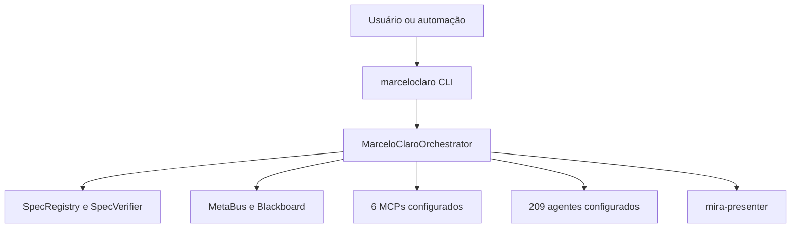

# Arquitetura do OpenCode Ecosystem Core

Este documento descreve a organização técnica observável no checkout. Não é um
relatório de desempenho, cobertura ou validação externa. Para ressalvas sobre
alegações históricas, consulte [CORRIGENDUM.md](CORRIGENDUM.md).

> Hashes, testes e diagnósticos são controles internos de artefatos e
> configurações específicas; não constituem certificação externa de segurança,
> qualidade ou adequação para um domínio de uso.

## Configuração estrutural

Em **2026-08-23**, o diagnóstico local listava **19 checks**. A configuração
`opencode.json` declarava **6 MCPs** e **209 agentes**. As fontes autoritativas
para uma nova conferência são o comando `python3 -m marceloclaro.cli doctor` e
as chaves `mcp` e `agent` de `opencode.json`:

```bash
python3 -m marceloclaro.cli doctor
python3 -c "import json; c=json.load(open('opencode.json', encoding='utf-8')); print({'mcps': len(c.get('mcp', {})), 'agentes': len(c.get('agent', {}))})"
```

Specs, ciclos, testes e cobertura mudam com o checkout. Consulte,
respectivamente, `specs/`, `evolution/cycles.json`, `tests/` e a configuração
de CI em vez de tratar números de documentos antigos como estado atual.

## Visão das camadas


```mermaid
graph TD
    Usuario[Usuário ou automação] --> CLI[marceloclaro CLI]
    CLI --> Orquestrador[MarceloClaroOrchestrator]
    Orquestrador --> SDD[SpecRegistry e SpecVerifier]
    Orquestrador --> MCI[MetaBus e Blackboard]
    Orquestrador --> MCP[6 MCPs configurados]
    Orquestrador --> Agentes[209 agentes configurados]
    Orquestrador --> MIRA[mira-presenter]
```

| Camada | Responsabilidade | Referências principais |
|---|---|---|
| Entrada | CLI interativo e comandos diretos. | `marceloclaro/cli.py`, `MANUAL.md` |
| Orquestração | Coordenação de tarefas e roteamento. | `marceloclaro/orchestrator.py` |
| SDD/TDD | Registro de specs, critérios e evidência por teste. | `sdd/spec_engine.py`, `specs/`, `tests/` |
| Memória | Eventos, tarefas e reflexões compartilhadas. | `mci/` |
| Integrações | Servidores MCP e definição de agentes. | `opencode.json`, `integrations/` |
| Apresentação | Geração de deck a partir de pasta de produção. | `illustrations/mira_deck.py` |
| Integridade | Cálculo local de raiz de arquivos selecionados. | `benchmarks/merkle_integrity_guard.py` |

## Servidores MCP Interoperáveis

Os **6 MCPs** configurados em `opencode.json` são:

1. `litert-lm`;
2. `metacognitive-interconnect`;
3. `antigravity-bridge`;
4. `pypi-search`;
5. `colibri-mcp`;
6. `scanners-mcp`.

A presença dessas entradas de configuração não implica disponibilidade de toda
dependência externa em cada máquina. O `doctor` expõe a situação encontrada
localmente entre os seus 19 checks.

## Agentes e orquestração

O arquivo `opencode.json` é a fonte da contagem de **209 agentes** configurados
para a integração OpenCode. O Blackboard pode apresentar registros em momentos
diferentes do processo de inicialização; por isso, não se deve misturar uma
contagem de runtime com a contagem declarada no arquivo de configuração.

O fluxo básico é:

1. uma tarefa chega pelo CLI ou por integração;
2. o orquestrador recupera contexto e publica ou encaminha a tarefa;
3. um agente produz um resultado e o estado é registrado;
4. a entrega é avaliada contra os critérios disponíveis para aquela tarefa.

Esse fluxo descreve mecanismos de software, não mérito externo do resultado.

## SDD e TDD

Uma spec formal pode declarar objetivo, critérios de aceitação, invariantes e
arquivo de teste. O `SpecVerifier` avalia a evidência estruturada disponível
para esses critérios. A ausência de evidência deve permanecer identificável,
em vez de ser apresentada como êxito.

O ciclo de desenvolvimento recomendado é:

1. definir ou ler a spec aplicável;
2. escrever o teste dirigido;
3. implementar a menor mudança que atende ao contrato;
4. executar os testes relevantes;
5. registrar limitações e resultados observados.

O resultado de um teste é restrito ao ambiente, versão e dados utilizados na
execução. Não transforme uma passagem local em certificação externa.

## MIRA e documentação em dupla leitura

O subsistema de apresentações inclui:

| Elemento | Papel |
|---|---|
| `MiraEngine` | Produz componentes visuais de apresentação. |
| `MiraDeckPipeline` | Executa os estágios `extract`, `plan`, `copywrite`, `build`, `animate` e `validate`. |
| `mira-presenter` | Agente usado na execução delegada da apresentação. |

`SPEC-935-R126` registra o agente delegável e `SPEC-935-R127` registra a
documentação em dupla leitura. A interface de uso é documentada no manual;
a arquitetura aponta os arquivos e as responsabilidades.

## Integridade e procedência

`MerkleIntegrityGuard` e os mecanismos SHA-256 permitem comparar os bytes de
artefatos definidos. Eles ajudam a detectar divergência do material conferido,
mas não são uma prova geral de comportamento, segurança ou correção.

A instalação deve começar por uma versão identificada, um commit Git completo
e uma soma SHA-256 publicada para o artefato que será conferido. O procedimento
reprodutível e as limitações por plataforma estão em
[installer/README.md](installer/README.md).
