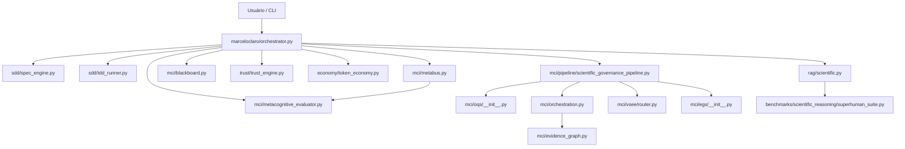

# Mapa Completo do Ecossistema — Nós e Vetores

- Nós: **371**
- Vetores: **575**

## Taxonomia de Nós

| kind | quantidade |
|---|---:|
| actor | 1 |
| agent | 152 |
| benchmark | 8 |
| diagram | 1 |
| doc | 5 |
| layer | 19 |
| module | 111 |
| schema | 4 |
| spec | 45 |
| test | 25 |

## Taxonomia de Vetores

| kind | quantidade |
|---|---:|
| contains | 339 |
| control_flow | 25 |
| data_flow | 8 |
| depends_on | 29 |
| documents | 9 |
| imports | 165 |

## Diagrama de Alto Nível

## Inventário de Nós

| id | kind | layer | path/logical_group |
|---|---|---|---|
| actor_user_cli | actor | external | entrypoint |
| agents_catalog_00_editor_chefe_phd_md | agent | agents_catalog | agents/catalog/00_editor_chefe_phd.md |
| agents_catalog_01_agente_diagnostico_escopo_md | agent | agents_catalog | agents/catalog/01_agente_diagnostico_escopo.md |
| agents_catalog_02_agente_busca_curadoria_md | agent | agents_catalog | agents/catalog/02_agente_busca_curadoria.md |
| agents_catalog_03_agente_evidencias_citacoes_md | agent | agents_catalog | agents/catalog/03_agente_evidencias_citacoes.md |
| agents_catalog_04_agente_estrutura_argumentativa_md | agent | agents_catalog | agents/catalog/04_agente_estrutura_argumentativa.md |
| agents_catalog_05_agente_revisao_literatura_teoria_md | agent | agents_catalog | agents/catalog/05_agente_revisao_literatura_teoria.md |
| agents_catalog_06_agente_metodologia_reprodutibilidade_md | agent | agents_catalog | agents/catalog/06_agente_metodologia_reprodutibilidade.md |
| agents_catalog_07_agente_estatistica_analise_md | agent | agents_catalog | agents/catalog/07_agente_estatistica_analise.md |
| agents_catalog_08_agente_visualizacao_evidencia_grafica_md | agent | agents_catalog | agents/catalog/08_agente_visualizacao_evidencia_grafica.md |
| agents_catalog_09_agente_resultados_md | agent | agents_catalog | agents/catalog/09_agente_resultados.md |
| agents_catalog_10_agente_discussao_contribuicao_md | agent | agents_catalog | agents/catalog/10_agente_discussao_contribuicao.md |
| agents_catalog_11_agente_conclusao_coerencia_final_md | agent | agents_catalog | agents/catalog/11_agente_conclusao_coerencia_final.md |
| agents_catalog_12_agente_auditoria_bibliografica_abnt_md | agent | agents_catalog | agents/catalog/12_agente_auditoria_bibliografica_abnt.md |
| agents_catalog_13_agente_qa_qualis_a1_md | agent | agents_catalog | agents/catalog/13_agente_qa_qualis_a1.md |
| agents_catalog_14_agente_consistencia_interna_md | agent | agents_catalog | agents/catalog/14_agente_consistencia_interna.md |
| agents_catalog_15_agente_resumo_abstract_palavras_chave_md | agent | agents_catalog | agents/catalog/15_agente_resumo_abstract_palavras_chave.md |
| agents_catalog_16_agente_integracao_editorial_docx_md | agent | agents_catalog | agents/catalog/16_agente_integracao_editorial_docx.md |
| agents_catalog_17_agente_framework_reprodutivel_ambientes_md | agent | agents_catalog | agents/catalog/17_agente_framework_reprodutivel_ambientes.md |
| agents_catalog_18_agente_engenharia_dados_datasets_proveniencia_md | agent | agents_catalog | agents/catalog/18_agente_engenharia_dados_datasets_proveniencia.md |
| agents_catalog_19_agente_auditoria_codigo_documentacao_tecnica_md | agent | agents_catalog | agents/catalog/19_agente_auditoria_codigo_documentacao_tecnica.md |
| agents_catalog_20_agente_estatistica_avancada_inferencia_md | agent | agents_catalog | agents/catalog/20_agente_estatistica_avancada_inferencia.md |
| agents_catalog_21_agente_matematica_aplicada_modelagem_formal_md | agent | agents_catalog | agents/catalog/21_agente_matematica_aplicada_modelagem_formal.md |
| agents_catalog_22_agente_ml_dl_datamining_md | agent | agents_catalog | agents/catalog/22_agente_ml_dl_datamining.md |
| agents_catalog_23_agente_bioinformatica_omicas_md | agent | agents_catalog | agents/catalog/23_agente_bioinformatica_omicas.md |
| agents_catalog_24_agente_quimioinformatica_modelagem_molecular_md | agent | agents_catalog | agents/catalog/24_agente_quimioinformatica_modelagem_molecular.md |
| agents_catalog_25_agente_ciencias_sociais_linguistica_computacional_md | agent | agents_catalog | agents/catalog/25_agente_ciencias_sociais_linguistica_computacional.md |
| agents_catalog_26_agente_visao_computacional_multimodal_md | agent | agents_catalog | agents/catalog/26_agente_visao_computacional_multimodal.md |
| agents_catalog_27_agente_computacao_quantica_aplicada_md | agent | agents_catalog | agents/catalog/27_agente_computacao_quantica_aplicada.md |
| agents_catalog_28_agente_benchmarking_ablacao_robustez_md | agent | agents_catalog | agents/catalog/28_agente_benchmarking_ablacao_robustez.md |
| agents_catalog_29_agente_conformidade_internacional_md | agent | agents_catalog | agents/catalog/29_agente_conformidade_internacional.md |
| agents_catalog_30_agente_traducao_nativa_proofreading_md | agent | agents_catalog | agents/catalog/30_agente_traducao_nativa_proofreading.md |
| agents_catalog_31_agente_blind_peer_review_emulado_md | agent | agents_catalog | agents/catalog/31_agente_blind_peer_review_emulado.md |
| agents_catalog_32_agente_etica_open_science_md | agent | agents_catalog | agents/catalog/32_agente_etica_open_science.md |
| agents_catalog_33_agente_automacao_multi_norma_md | agent | agents_catalog | agents/catalog/33_agente_automacao_multi_norma.md |
| agents_catalog_34_agente_identificacao_conflitos_similaridade_md | agent | agents_catalog | agents/catalog/34_agente_identificacao_conflitos_similaridade.md |
| agents_catalog_35_agente_coleta_datasets_reais_md | agent | agents_catalog | agents/catalog/35_agente_coleta_datasets_reais.md |
| agents_catalog_36_agente_exportacao_latex_pdf_md | agent | agents_catalog | agents/catalog/36_agente_exportacao_latex_pdf.md |
| agents_catalog_37_agente_apresentacao_slides_banca_md | agent | agents_catalog | agents/catalog/37_agente_apresentacao_slides_banca.md |
| agents_catalog_38_agente_montagem_entrega_final_md | agent | agents_catalog | agents/catalog/38_agente_montagem_entrega_final.md |
| agents_catalog_39_agente_metodologia_multi_paradigma_md | agent | agents_catalog | agents/catalog/39_agente_metodologia_multi_paradigma.md |
| agents_catalog_40_agente_marcos_teoricos_interpretacao_md | agent | agents_catalog | agents/catalog/40_agente_marcos_teoricos_interpretacao.md |
| agents_catalog_41_agente_gis_geoprocessamento_cartografia_md | agent | agents_catalog | agents/catalog/41_agente_gis_geoprocessamento_cartografia.md |
| agents_catalog_42_agente_desenvolvedor_cientista_computacao_md | agent | agents_catalog | agents/catalog/42_agente_desenvolvedor_cientista_computacao.md |
| agents_catalog_43_agente_satelite_bioinformatica_omics_md | agent | agents_catalog | agents/catalog/43_agente_satelite_bioinformatica_omics.md |
| agents_catalog_44_agente_correcao_textual_qualis_md | agent | agents_catalog | agents/catalog/44_agente_correcao_textual_qualis.md |
| agents_catalog_45_agente_refinamento_argumentacao_md | agent | agents_catalog | agents/catalog/45_agente_refinamento_argumentacao.md |
| agents_catalog_DISPATCHER_ATIVACAO_md | agent | agents_catalog | agents/catalog/DISPATCHER_ATIVACAO.md |
| agents_catalog_README_md | agent | agents_catalog | agents/catalog/README.md |
| agents_catalog_TEMPLATE_HANDOFF_md | agent | agents_catalog | agents/catalog/TEMPLATE_HANDOFF.md |
| agents_catalog_adr_manager_md | agent | agents_catalog | agents/catalog/adr-manager.md |
| agents_catalog_antigravity_orchestrator_md | agent | agents_catalog | agents/catalog/antigravity-orchestrator.md |
| agents_catalog_architect_md | agent | agents_catalog | agents/catalog/architect.md |
| agents_catalog_architecture_analyzer_md | agent | agents_catalog | agents/catalog/architecture-analyzer.md |
| agents_catalog_autoevolve_md | agent | agents_catalog | agents/catalog/autoevolve.md |
| agents_catalog_batch_executor_md | agent | agents_catalog | agents/catalog/batch-executor.md |
| agents_catalog_bernstein_orchestrator_md | agent | agents_catalog | agents/catalog/bernstein-orchestrator.md |
| agents_catalog_build_agent_md | agent | agents_catalog | agents/catalog/build-agent.md |
| agents_catalog_code_reviewer_md | agent | agents_catalog | agents/catalog/code-reviewer.md |
| agents_catalog_codebase_analyzer_md | agent | agents_catalog | agents/catalog/codebase-analyzer.md |
| agents_catalog_codebase_locator_md | agent | agents_catalog | agents/catalog/codebase-locator.md |
| agents_catalog_codebase_pattern_finder_md | agent | agents_catalog | agents/catalog/codebase-pattern-finder.md |
| agents_catalog_coder_agent_md | agent | agents_catalog | agents/catalog/coder-agent.md |
| agents_catalog_context_manager_md | agent | agents_catalog | agents/catalog/context-manager.md |
| agents_catalog_context_retriever_md | agent | agents_catalog | agents/catalog/context-retriever.md |
| agents_catalog_contextscout_md | agent | agents_catalog | agents/catalog/contextscout.md |
| agents_catalog_contract_manager_md | agent | agents_catalog | agents/catalog/contract-manager.md |
| agents_catalog_copywriter_md | agent | agents_catalog | agents/catalog/copywriter.md |
| agents_catalog_debugger_md | agent | agents_catalog | agents/catalog/debugger.md |
| agents_catalog_devops_specialist_md | agent | agents_catalog | agents/catalog/devops-specialist.md |
| agents_catalog_docs_writer_md | agent | agents_catalog | agents/catalog/docs-writer.md |
| agents_catalog_documentation_md | agent | agents_catalog | agents/catalog/documentation.md |
| agents_catalog_eval_runner_md | agent | agents_catalog | agents/catalog/eval-runner.md |
| agents_catalog_externalscout_md | agent | agents_catalog | agents/catalog/externalscout.md |
| agents_catalog_frontend_specialist_md | agent | agents_catalog | agents/catalog/frontend-specialist.md |
| agents_catalog_git_manager_md | agent | agents_catalog | agents/catalog/git-manager.md |
| agents_catalog_image_specialist_md | agent | agents_catalog | agents/catalog/image-specialist.md |
| agents_catalog_linguistic_corrector_md | agent | agents_catalog | agents/catalog/linguistic-corrector.md |
| agents_catalog_marceloclaro_md | agent | agents_catalog | agents/catalog/marceloclaro.md |
| agents_catalog_master_orchestrator_md | agent | agents_catalog | agents/catalog/master-orchestrator.md |
| agents_catalog_mira_3d_md | agent | agents_catalog | agents/catalog/mira-3d.md |
| agents_catalog_mira_animated_metaphor_md | agent | agents_catalog | agents/catalog/mira-animated-metaphor.md |
| agents_catalog_mira_animator_md | agent | agents_catalog | agents/catalog/mira-animator.md |
| agents_catalog_mira_builder_md | agent | agents_catalog | agents/catalog/mira-builder.md |
| agents_catalog_mira_chart_race_md | agent | agents_catalog | agents/catalog/mira-chart-race.md |
| agents_catalog_mira_chart_md | agent | agents_catalog | agents/catalog/mira-chart.md |
| agents_catalog_mira_copywriter_md | agent | agents_catalog | agents/catalog/mira-copywriter.md |
| agents_catalog_mira_extract_md | agent | agents_catalog | agents/catalog/mira-extract.md |
| agents_catalog_mira_get_videos_md | agent | agents_catalog | agents/catalog/mira-get-videos.md |
| agents_catalog_mira_image_template_md | agent | agents_catalog | agents/catalog/mira-image-template.md |
| agents_catalog_mira_image_md | agent | agents_catalog | agents/catalog/mira-image.md |
| agents_catalog_mira_new_md | agent | agents_catalog | agents/catalog/mira-new.md |
| agents_catalog_mira_planner_md | agent | agents_catalog | agents/catalog/mira-planner.md |
| agents_catalog_mira_qrcode_md | agent | agents_catalog | agents/catalog/mira-qrcode.md |
| agents_catalog_mira_references_md | agent | agents_catalog | agents/catalog/mira-references.md |
| agents_catalog_mira_size_animator_md | agent | agents_catalog | agents/catalog/mira-size-animator.md |
| agents_catalog_mira_squared_md | agent | agents_catalog | agents/catalog/mira-squared.md |
| agents_catalog_mira_survey_md | agent | agents_catalog | agents/catalog/mira-survey.md |
| agents_catalog_mira_thirds_md | agent | agents_catalog | agents/catalog/mira-thirds.md |
| agents_catalog_mira_validator_md | agent | agents_catalog | agents/catalog/mira-validator.md |
| agents_catalog_mira_vertical_md | agent | agents_catalog | agents/catalog/mira-vertical.md |
| agents_catalog_mira_visuals_md | agent | agents_catalog | agents/catalog/mira-visuals.md |
| agents_catalog_openagent_md | agent | agents_catalog | agents/catalog/openagent.md |
| agents_catalog_opencoder_md | agent | agents_catalog | agents/catalog/opencoder.md |
| agents_catalog_optimizer_md | agent | agents_catalog | agents/catalog/optimizer.md |
| agents_catalog_prioritization_engine_md | agent | agents_catalog | agents/catalog/prioritization-engine.md |
| agents_catalog_pypi_searcher_md | agent | agents_catalog | agents/catalog/pypi-searcher.md |
| agents_catalog_quantum_nexus_phd_md | agent | agents_catalog | agents/catalog/quantum-nexus-phd.md |
| agents_catalog_reversa_agent_forum_md | agent | agents_catalog | agents/catalog/reversa-agent-forum.md |
| agents_catalog_reversa_anp_md | agent | agents_catalog | agents/catalog/reversa-anp.md |
| agents_catalog_reversa_archaeologist_md | agent | agents_catalog | agents/catalog/reversa-archaeologist.md |
| agents_catalog_reversa_architect_md | agent | agents_catalog | agents/catalog/reversa-architect.md |
| agents_catalog_reversa_config_generator_md | agent | agents_catalog | agents/catalog/reversa-config-generator.md |
| agents_catalog_reversa_data_master_md | agent | agents_catalog | agents/catalog/reversa-data-master.md |
| agents_catalog_reversa_design_system_md | agent | agents_catalog | agents/catalog/reversa-design-system.md |
| agents_catalog_reversa_detective_md | agent | agents_catalog | agents/catalog/reversa-detective.md |
| agents_catalog_reversa_document_ir_md | agent | agents_catalog | agents/catalog/reversa-document-ir.md |
| agents_catalog_reversa_entity_ner_md | agent | agents_catalog | agents/catalog/reversa-entity-ner.md |
| agents_catalog_reversa_fileipc_md | agent | agents_catalog | agents/catalog/reversa-fileipc.md |
| agents_catalog_reversa_graph_builder_md | agent | agents_catalog | agents/catalog/reversa-graph-builder.md |
| agents_catalog_reversa_graphrag_md | agent | agents_catalog | agents/catalog/reversa-graphrag.md |
| agents_catalog_reversa_hybrid_graph_md | agent | agents_catalog | agents/catalog/reversa-hybrid-graph.md |
| agents_catalog_reversa_memory_updater_md | agent | agents_catalog | agents/catalog/reversa-memory-updater.md |
| agents_catalog_reversa_oasis_profile_md | agent | agents_catalog | agents/catalog/reversa-oasis-profile.md |
| agents_catalog_reversa_ontology_gen_md | agent | agents_catalog | agents/catalog/reversa-ontology-gen.md |
| agents_catalog_reversa_planner_md | agent | agents_catalog | agents/catalog/reversa-planner.md |
| agents_catalog_reversa_process_lifecycle_md | agent | agents_catalog | agents/catalog/reversa-process-lifecycle.md |
| agents_catalog_reversa_report_agent_md | agent | agents_catalog | agents/catalog/reversa-report-agent.md |
| agents_catalog_reversa_reviewer_md | agent | agents_catalog | agents/catalog/reversa-reviewer.md |
| agents_catalog_reversa_scout_md | agent | agents_catalog | agents/catalog/reversa-scout.md |
| agents_catalog_reversa_statemachine_md | agent | agents_catalog | agents/catalog/reversa-statemachine.md |
| agents_catalog_reversa_swarm_review_md | agent | agents_catalog | agents/catalog/reversa-swarm-review.md |
| agents_catalog_reversa_synthesis_md | agent | agents_catalog | agents/catalog/reversa-synthesis.md |
| agents_catalog_reversa_visor_md | agent | agents_catalog | agents/catalog/reversa-visor.md |
| agents_catalog_reversa_writer_md | agent | agents_catalog | agents/catalog/reversa-writer.md |
| agents_catalog_reversa_md | agent | agents_catalog | agents/catalog/reversa.md |
| agents_catalog_reviewer_md | agent | agents_catalog | agents/catalog/reviewer.md |
| agents_catalog_security_auditor_md | agent | agents_catalog | agents/catalog/security-auditor.md |
| agents_catalog_simple_responder_md | agent | agents_catalog | agents/catalog/simple-responder.md |
| agents_catalog_stage_orchestrator_md | agent | agents_catalog | agents/catalog/stage-orchestrator.md |
| agents_catalog_story_mapper_md | agent | agents_catalog | agents/catalog/story-mapper.md |
| agents_catalog_task_manager_md | agent | agents_catalog | agents/catalog/task-manager.md |
| agents_catalog_technical_writer_md | agent | agents_catalog | agents/catalog/technical-writer.md |
| agents_catalog_test_engineer_md | agent | agents_catalog | agents/catalog/test-engineer.md |
| agents_catalog_thoughts_analyzer_md | agent | agents_catalog | agents/catalog/thoughts-analyzer.md |
| agents_catalog_thoughts_locator_md | agent | agents_catalog | agents/catalog/thoughts-locator.md |
| agents_catalog_web_developer_md | agent | agents_catalog | agents/catalog/web-developer.md |
| agents_catalog_web_search_researcher_md | agent | agents_catalog | agents/catalog/web-search-researcher.md |
| agents_catalog_ws_academic_pipeline_md | agent | agents_catalog | agents/catalog/ws-academic-pipeline.md |
| agents_catalog_ws_coder_md | agent | agents_catalog | agents/catalog/ws-coder.md |
| agents_catalog_ws_researcher_md | agent | agents_catalog | agents/catalog/ws-researcher.md |
| agents_catalog_ws_reviewer_md | agent | agents_catalog | agents/catalog/ws-reviewer.md |
| agents_catalog_ws_scribe_md | agent | agents_catalog | agents/catalog/ws-scribe.md |
| benchmarks_scientific_reasoning_init_py | benchmark | benchmarks | benchmarks/scientific_reasoning/__init__.py |
| benchmarks_scientific_reasoning_bias_detection_benchmark_py | benchmark | benchmarks | benchmarks/scientific_reasoning/bias_detection_benchmark.py |
| benchmarks_scientific_reasoning_causal_benchmark_py | benchmark | benchmarks | benchmarks/scientific_reasoning/causal_benchmark.py |
| benchmarks_scientific_reasoning_experimental_design_benchmark_py | benchmark | benchmarks | benchmarks/scientific_reasoning/experimental_design_benchmark.py |
| benchmarks_scientific_reasoning_power_analysis_benchmark_py | benchmark | benchmarks | benchmarks/scientific_reasoning/power_analysis_benchmark.py |
| benchmarks_scientific_reasoning_runner_py | benchmark | benchmarks | benchmarks/scientific_reasoning/runner.py |
| benchmarks_scientific_reasoning_statistical_benchmark_py | benchmark | benchmarks | benchmarks/scientific_reasoning/statistical_benchmark.py |
| benchmarks_scientific_reasoning_superhuman_suite_py | benchmark | benchmarks | benchmarks/scientific_reasoning/superhuman_suite.py |
| diagram_mmd | diagram | docs | diagram.mmd |
| ARCHITECTURE_md | doc | docs | ARCHITECTURE.md |
| CHANGELOG_md | doc | docs | CHANGELOG.md |
| CHANGELOG_EXECUTIVO_2026_07_06_md | doc | docs | CHANGELOG_EXECUTIVO_2026-07-06.md |
| README_md | doc | docs | README.md |
| RELEASE_NOTES_md | doc | docs | RELEASE_NOTES.md |
| layer_agents_catalog | layer | agents_catalog | agents |
| layer_benchmarks | layer | benchmarks | evaluation |
| layer_diagnostics | layer | diagnostics | analysis |
| layer_docs | layer | docs | documentation |
| layer_illustrations | layer | illustrations | visualization |
| layer_legal | layer | legal | legal_reasoning |
| layer_mci | layer | mci | memory |
| layer_orchestration | layer | orchestration | control |
| layer_publishing | layer | publishing | publishing |
| layer_rag | layer | rag | grounding |
| layer_reasoning | layer | reasoning | formal_reasoning |
| layer_research | layer | research | research |
| layer_schemas | layer | schemas | contracts |
| layer_scientific_governance | layer | scientific_governance | science |
| layer_sdd_tdd | layer | sdd_tdd | quality |
| layer_specs | layer | specs | documentation |
| layer_tests | layer | tests | verification |
| layer_transformer | layer | transformer | routing |
| layer_trust_economy | layer | trust_economy | governance |
| academic_init_py | module | academic | academic/__init__.py |
| academic_auto_score_qualis_py | module | academic | academic/auto_score_qualis.py |
| academic_maswos_py | module | academic | academic/maswos.py |
| academic_seeker_py | module | academic | academic/seeker.py |
| economy_init_py | module | trust_economy | economy/__init__.py |
| economy_token_economy_py | module | trust_economy | economy/token_economy.py |
| gametheory_init_py | module | gametheory | gametheory/__init__.py |
| gametheory_debate_strategies_py | module | gametheory | gametheory/debate_strategies.py |
| gametheory_moderator_py | module | gametheory | gametheory/moderator.py |
| gametheory_phd_auditor_py | module | gametheory | gametheory/phd_auditor.py |
| illustrations_init_py | module | illustrations | illustrations/__init__.py |
| illustrations_graphify_engine_py | module | illustrations | illustrations/graphify_engine.py |
| illustrations_mermaid_engine_py | module | illustrations | illustrations/mermaid_engine.py |
| illustrations_mira_engine_py | module | illustrations | illustrations/mira_engine.py |
| legal_init_py | module | legal | legal/__init__.py |
| legal_argumentation_py | module | legal | legal/argumentation.py |
| legal_balancing_py | module | legal | legal/balancing.py |
| legal_constitutional_py | module | legal | legal/constitutional.py |
| legal_precedents_py | module | legal | legal/precedents.py |
| legal_syllogism_py | module | legal | legal/syllogism.py |
| marceloclaro_init_py | module | orchestration | marceloclaro/__init__.py |
| marceloclaro_agent_loader_py | module | orchestration | marceloclaro/agent_loader.py |
| marceloclaro_catalog_loader_py | module | orchestration | marceloclaro/catalog_loader.py |
| marceloclaro_cli_py | module | orchestration | marceloclaro/cli.py |
| marceloclaro_ecosystem_map_py | module | orchestration | marceloclaro/ecosystem_map.py |
| marceloclaro_inspiration_audit_py | module | orchestration | marceloclaro/inspiration_audit.py |
| marceloclaro_orchestrator_py | module | orchestration | marceloclaro/orchestrator.py |
| mci_init_py | module | mci | mci/__init__.py |
| mci_adversarial_reviewer_py | module | mci | mci/adversarial_reviewer.py |
| mci_blackboard_py | module | mci | mci/blackboard.py |
| mci_confidence_calibrator_py | module | mci | mci/confidence_calibrator.py |
| mci_egs_init_py | module | scientific_governance | mci/egs/__init__.py |
| mci_egs_alignment_py | module | scientific_governance | mci/egs/alignment.py |
| mci_egs_explainability_py | module | scientific_governance | mci/egs/explainability.py |
| mci_egs_governance_analyzer_py | module | scientific_governance | mci/egs/governance_analyzer.py |
| mci_egs_principle_engine_py | module | scientific_governance | mci/egs/principle_engine.py |
| mci_egs_stress_test_py | module | scientific_governance | mci/egs/stress_test.py |
| mci_evidence_graph_py | module | mci | mci/evidence_graph.py |
| mci_experiment_designer_py | module | mci | mci/experiment_designer.py |
| mci_hypothesis_engine_py | module | mci | mci/hypothesis_engine.py |
| mci_mcp_server_py | module | mci | mci/mcp_server.py |
| mci_metabus_py | module | mci | mci/metabus.py |
| mci_metacognitive_evaluator_py | module | mci | mci/metacognitive_evaluator.py |
| mci_oqs_init_py | module | scientific_governance | mci/oqs/__init__.py |
| mci_oqs_candidate_generator_py | module | scientific_governance | mci/oqs/candidate_generator.py |
| mci_oqs_intake_py | module | scientific_governance | mci/oqs/intake.py |
| mci_oqs_scoring_py | module | scientific_governance | mci/oqs/scoring.py |
| mci_oqs_selector_py | module | scientific_governance | mci/oqs/selector.py |
| mci_oqs_uncertainty_scanner_py | module | scientific_governance | mci/oqs/uncertainty_scanner.py |
| mci_orchestration_py | module | mci | mci/orchestration.py |
| mci_pipeline_init_py | module | scientific_governance | mci/pipeline/__init__.py |
| mci_pipeline_scientific_governance_pipeline_py | module | scientific_governance | mci/pipeline/scientific_governance_pipeline.py |
| mci_reflexion_py | module | mci | mci/reflexion.py |
| mci_scientific_reporter_py | module | mci | mci/scientific_reporter.py |
| mci_statistical_validator_py | module | mci | mci/statistical_validator.py |
| mci_vsee_init_py | module | scientific_governance | mci/vsee/__init__.py |
| mci_vsee_executor_py | module | scientific_governance | mci/vsee/executor.py |
| mci_vsee_fallback_py | module | scientific_governance | mci/vsee/fallback.py |
| mci_vsee_policy_py | module | scientific_governance | mci/vsee/policy.py |
| mci_vsee_router_py | module | scientific_governance | mci/vsee/router.py |
| mci_vsee_telemetry_py | module | scientific_governance | mci/vsee/telemetry.py |
| mirofish_init_py | module | mirofish | mirofish/__init__.py |
| mirofish_graph_memory_py | module | mirofish | mirofish/graph_memory.py |
| mirofish_swarm_py | module | mirofish | mirofish/swarm.py |
| mirofish_validator_py | module | mirofish | mirofish/validator.py |
| publishing_init_py | module | publishing | publishing/__init__.py |
| publishing_cover_designer_py | module | publishing | publishing/cover_designer.py |
| publishing_production_py | module | publishing | publishing/production.py |
| rag_init_py | module | rag | rag/__init__.py |
| rag_scientific_py | module | rag | rag/scientific.py |
| reasoning_init_py | module | reasoning | reasoning/__init__.py |
| reasoning_cache_py | module | reasoning | reasoning/cache.py |
| reasoning_engines_py | module | reasoning | reasoning/engines.py |
| reasoning_evaluator_py | module | reasoning | reasoning/evaluator.py |
| reasoning_parallel_py | module | reasoning | reasoning/parallel.py |
| reasoning_quantum_py | module | reasoning | reasoning/quantum.py |
| reasoning_visualizer_py | module | reasoning | reasoning/visualizer.py |
| research_init_py | module | research | research/__init__.py |
| research_downloader_py | module | research | research/downloader.py |
| research_fichamento_py | module | research | research/fichamento.py |
| research_figure_hunter_py | module | research | research/figure_hunter.py |
| research_hub_py | module | research | research/hub.py |
| research_llm_client_py | module | research | research/llm_client.py |
| research_osint_py | module | research | research/osint.py |
| research_pdf2md_py | module | research | research/pdf2md.py |
| research_pipelines_analyze_research_batch_py | module | research | research/pipelines/analyze_research_batch.py |
| research_pipelines_run_research_batch_py | module | research | research/pipelines/run_research_batch.py |
| research_searchers_py | module | research | research/searchers.py |
| scanners_init_py | module | diagnostics | scanners/__init__.py |
| scanners_capability_composer_py | module | diagnostics | scanners/capability_composer.py |
| scanners_cross_validation_engine_py | module | diagnostics | scanners/cross_validation_engine.py |
| scanners_epistemic_prioritizer_py | module | diagnostics | scanners/epistemic_prioritizer.py |
| scanners_evolutionary_pipeline_py | module | diagnostics | scanners/evolutionary_pipeline.py |
| scanners_noological_scanner_py | module | diagnostics | scanners/noological_scanner.py |
| scanners_optimal_question_scanner_py | module | diagnostics | scanners/optimal_question_scanner.py |
| scanners_pipeline_py | module | diagnostics | scanners/pipeline.py |
| scanners_potentiality_scanner_py | module | diagnostics | scanners/potentiality_scanner.py |
| scanners_reversa_scanner_py | module | diagnostics | scanners/reversa_scanner.py |
| scanners_social_impact_scanner_py | module | diagnostics | scanners/social_impact_scanner.py |
| scanners_successor_generator_py | module | diagnostics | scanners/successor_generator.py |
| scanners_teleological_scanner_py | module | diagnostics | scanners/teleological_scanner.py |
| sdd_init_py | module | sdd_tdd | sdd/__init__.py |
| sdd_spec_engine_py | module | sdd_tdd | sdd/spec_engine.py |
| sdd_tdd_runner_py | module | sdd_tdd | sdd/tdd_runner.py |
| transformer_init_py | module | transformer | transformer/__init__.py |
| transformer_attention_py | module | transformer | transformer/attention.py |
| transformer_embedder_py | module | transformer | transformer/embedder.py |
| transformer_memory_py | module | transformer | transformer/memory.py |
| transformer_pipeline_py | module | transformer | transformer/pipeline.py |
| trust_init_py | module | trust_economy | trust/__init__.py |
| trust_trust_engine_py | module | trust_economy | trust/trust_engine.py |
| schemas_ethical_assessment_schema_json | schema | schemas | schemas/ethical_assessment.schema.json |
| schemas_optimal_question_schema_json | schema | schemas | schemas/optimal_question.schema.json |
| schemas_scientific_claim_schema_json | schema | schemas | schemas/scientific_claim.schema.json |
| schemas_vector_execution_decision_schema_json | schema | schemas | schemas/vector_execution_decision.schema.json |
| specs_SPEC_001_metabus_md | spec | specs | specs/SPEC-001-metabus.md |
| specs_SPEC_002_blackboard_md | spec | specs | specs/SPEC-002-blackboard.md |
| specs_SPEC_003_reflexion_md | spec | specs | specs/SPEC-003-reflexion.md |
| specs_SPEC_004_transformer_md | spec | specs | specs/SPEC-004-transformer.md |
| specs_SPEC_005_orchestrator_md | spec | specs | specs/SPEC-005-orchestrator.md |
| specs_SPEC_006_agents_md | spec | specs | specs/SPEC-006-agents.md |
| specs_SPEC_007_trust_engine_md | spec | specs | specs/SPEC-007-trust-engine.md |
| specs_SPEC_008_token_economy_md | spec | specs | specs/SPEC-008-token-economy.md |
| specs_SPEC_009_scanners_md | spec | specs | specs/SPEC-009-scanners.md |
| specs_SPEC_010_maswos_academic_md | spec | specs | specs/SPEC-010-maswos-academic.md |
| specs_SPEC_011_reasoning_quantum_md | spec | specs | specs/SPEC-011-reasoning-quantum.md |
| specs_SPEC_012_evolution_cycles_md | spec | specs | specs/SPEC-012-evolution-cycles.md |
| specs_SPEC_013_cli_integrations_md | spec | specs | specs/SPEC-013-cli-integrations.md |
| specs_SPEC_014_gametheory_md | spec | specs | specs/SPEC-014-gametheory.md |
| specs_SPEC_014_livro_ecosystem_core_md | spec | specs | specs/SPEC-014-livro-ecosystem-core.md |
| specs_SPEC_015_mirofish_md | spec | specs | specs/SPEC-015-mirofish.md |
| specs_SPEC_016_publishing_md | spec | specs | specs/SPEC-016-publishing.md |
| specs_SPEC_017_research_md | spec | specs | specs/SPEC-017-research.md |
| specs_SPEC_018_illustrations_md | spec | specs | specs/SPEC-018-illustrations.md |
| specs_SPEC_019_cover_designer_md | spec | specs | specs/SPEC-019-cover-designer.md |
| specs_SPEC_020_deep_diagnose_md | spec | specs | specs/SPEC-020-deep-diagnose.md |
| specs_SPEC_021_superhuman_pipeline_md | spec | specs | specs/SPEC-021-superhuman-pipeline.md |
| specs_SPEC_022_diagnostic_pipeline_refined_md | spec | specs | specs/SPEC-022-diagnostic-pipeline-refined.md |
| specs_SPEC_023_inspiration_audit_md | spec | specs | specs/SPEC-023-inspiration-audit.md |
| specs_SPEC_024_research_batch_analysis_md | spec | specs | specs/SPEC-024-research-batch-analysis.md |
| specs_SPEC_025_scientific_governance_tdd_hardening_md | spec | specs | specs/SPEC-025-scientific-governance-tdd-hardening.md |
| specs_SPEC_026_mira_command_surface_md | spec | specs | specs/SPEC-026-mira-command-surface.md |
| specs_SPEC_027_scientific_reporter_hardening_md | spec | specs | specs/SPEC-027-scientific-reporter-hardening.md |
| specs_SPEC_028_executive_changelog_artifact_md | spec | specs | specs/SPEC-028-executive-changelog-artifact.md |
| specs_SPEC_029_ecosystem_full_map_md | spec | specs | specs/SPEC-029-ecosystem-full-map.md |
| specs_SPEC_900_livro_tritemo_md | spec | specs | specs/SPEC-900-livro-tritemo.md |
| specs_SPEC_901_romance_nevoa_e_pergaminhos_md | spec | specs | specs/SPEC-901-romance-nevoa-e-pergaminhos.md |
| specs_SPEC_902_molambudos_1260_apocalipse_md | spec | specs | specs/SPEC-902-molambudos-1260-apocalipse.md |
| specs_SPEC_903_molambudos_fonte_igual_cabecalho_md | spec | specs | specs/SPEC-903-molambudos-fonte-igual-cabecalho.md |
| specs_SPEC_904_molambudos_residuos_markdown_md | spec | specs | specs/SPEC-904-molambudos-residuos-markdown.md |
| specs_SPEC_905_molambudos_tabela_paginacao_md | spec | specs | specs/SPEC-905-molambudos-tabela-paginacao.md |
| specs_SPEC_906_molambudos_titulos_indice_lista_md | spec | specs | specs/SPEC-906-molambudos-titulos-indice-lista.md |
| specs_SPEC_907_molambudos_titulos_fragmentos_expandidos_md | spec | specs | specs/SPEC-907-molambudos-titulos-fragmentos-expandidos.md |
| specs_SPEC_910_polimento_literario_md | spec | specs | specs/SPEC-910-polimento-literario.md |
| specs_SPEC_916_oferta_templates_latex_md | spec | specs | specs/SPEC-916-oferta-templates-latex.md |
| specs_SPEC_917_evolucao_racicinios_md | spec | specs | specs/SPEC-917-evolucao-racicinios.md |
| specs_SPEC_918_scientific_superhuman_benchmark_suite_md | spec | specs | specs/SPEC-918-scientific-superhuman-benchmark-suite.md |
| specs_SPEC_919_scientific_rag_grounding_md | spec | specs | specs/SPEC-919-scientific-rag-grounding.md |
| specs_SPEC_920_metacognitive_superhuman_refinement_md | spec | specs | specs/SPEC-920-metacognitive-superhuman-refinement.md |
| specs_SPEC_921_brazilian_legal_reasoning_md | spec | specs | specs/SPEC-921-brazilian-legal-reasoning.md |
| tests_test_advanced_subsystems_py | test | tests | tests/test_advanced_subsystems.py |
| tests_test_analyze_research_batch_py | test | tests | tests/test_analyze_research_batch.py |
| tests_test_brazilian_legal_reasoning_py | test | tests | tests/test_brazilian_legal_reasoning.py |
| tests_test_cover_designer_py | test | tests | tests/test_cover_designer.py |
| tests_test_deep_diagnose_py | test | tests | tests/test_deep_diagnose.py |
| tests_test_ecosystem_py | test | tests | tests/test_ecosystem.py |
| tests_test_ecosystem_diagnose_py | test | tests | tests/test_ecosystem_diagnose.py |
| tests_test_ecosystem_full_map_py | test | tests | tests/test_ecosystem_full_map.py |
| tests_test_executive_changelog_artifact_py | test | tests | tests/test_executive_changelog_artifact.py |
| tests_test_illustrations_py | test | tests | tests/test_illustrations.py |
| tests_test_inspiration_audit_py | test | tests | tests/test_inspiration_audit.py |
| tests_test_llm_client_py | test | tests | tests/test_llm_client.py |
| tests_test_metacognitive_superhuman_py | test | tests | tests/test_metacognitive_superhuman.py |
| tests_test_mira_catalog_py | test | tests | tests/test_mira_catalog.py |
| tests_test_mirofish_gametheory_publishing_py | test | tests | tests/test_mirofish_gametheory_publishing.py |
| tests_test_reasoning_evolution_py | test | tests | tests/test_reasoning_evolution.py |
| tests_test_research_py | test | tests | tests/test_research.py |
| tests_test_run_research_batch_py | test | tests | tests/test_run_research_batch.py |
| tests_test_scientific_governance_contracts_py | test | tests | tests/test_scientific_governance_contracts.py |
| tests_test_scientific_governance_pipeline_py | test | tests | tests/test_scientific_governance_pipeline.py |
| tests_test_scientific_rag_superhuman_py | test | tests | tests/test_scientific_rag_superhuman.py |
| tests_test_scientific_reporter_hardening_py | test | tests | tests/test_scientific_reporter_hardening.py |
| tests_test_scientific_superhuman_py | test | tests | tests/test_scientific_superhuman.py |
| tests_test_sdd_tdd_py | test | tests | tests/test_sdd_tdd.py |
| tests_test_transformer_py | test | tests | tests/test_transformer.py |

## Inventário de Vetores

| source | target | kind | note |
|---|---|---|---|
| layer_agents_catalog | agents_catalog_00_editor_chefe_phd_md | contains | agents_catalog contém agents/catalog/00_editor_chefe_phd.md |
| layer_agents_catalog | agents_catalog_01_agente_diagnostico_escopo_md | contains | agents_catalog contém agents/catalog/01_agente_diagnostico_escopo.md |
| layer_agents_catalog | agents_catalog_02_agente_busca_curadoria_md | contains | agents_catalog contém agents/catalog/02_agente_busca_curadoria.md |
| layer_agents_catalog | agents_catalog_03_agente_evidencias_citacoes_md | contains | agents_catalog contém agents/catalog/03_agente_evidencias_citacoes.md |
| layer_agents_catalog | agents_catalog_04_agente_estrutura_argumentativa_md | contains | agents_catalog contém agents/catalog/04_agente_estrutura_argumentativa.md |
| layer_agents_catalog | agents_catalog_05_agente_revisao_literatura_teoria_md | contains | agents_catalog contém agents/catalog/05_agente_revisao_literatura_teoria.md |
| layer_agents_catalog | agents_catalog_06_agente_metodologia_reprodutibilidade_md | contains | agents_catalog contém agents/catalog/06_agente_metodologia_reprodutibilidade.md |
| layer_agents_catalog | agents_catalog_07_agente_estatistica_analise_md | contains | agents_catalog contém agents/catalog/07_agente_estatistica_analise.md |
| layer_agents_catalog | agents_catalog_08_agente_visualizacao_evidencia_grafica_md | contains | agents_catalog contém agents/catalog/08_agente_visualizacao_evidencia_grafica.md |
| layer_agents_catalog | agents_catalog_09_agente_resultados_md | contains | agents_catalog contém agents/catalog/09_agente_resultados.md |
| layer_agents_catalog | agents_catalog_10_agente_discussao_contribuicao_md | contains | agents_catalog contém agents/catalog/10_agente_discussao_contribuicao.md |
| layer_agents_catalog | agents_catalog_11_agente_conclusao_coerencia_final_md | contains | agents_catalog contém agents/catalog/11_agente_conclusao_coerencia_final.md |
| layer_agents_catalog | agents_catalog_12_agente_auditoria_bibliografica_abnt_md | contains | agents_catalog contém agents/catalog/12_agente_auditoria_bibliografica_abnt.md |
| layer_agents_catalog | agents_catalog_13_agente_qa_qualis_a1_md | contains | agents_catalog contém agents/catalog/13_agente_qa_qualis_a1.md |
| layer_agents_catalog | agents_catalog_14_agente_consistencia_interna_md | contains | agents_catalog contém agents/catalog/14_agente_consistencia_interna.md |
| layer_agents_catalog | agents_catalog_15_agente_resumo_abstract_palavras_chave_md | contains | agents_catalog contém agents/catalog/15_agente_resumo_abstract_palavras_chave.md |
| layer_agents_catalog | agents_catalog_16_agente_integracao_editorial_docx_md | contains | agents_catalog contém agents/catalog/16_agente_integracao_editorial_docx.md |
| layer_agents_catalog | agents_catalog_17_agente_framework_reprodutivel_ambientes_md | contains | agents_catalog contém agents/catalog/17_agente_framework_reprodutivel_ambientes.md |
| layer_agents_catalog | agents_catalog_18_agente_engenharia_dados_datasets_proveniencia_md | contains | agents_catalog contém agents/catalog/18_agente_engenharia_dados_datasets_proveniencia.md |
| layer_agents_catalog | agents_catalog_19_agente_auditoria_codigo_documentacao_tecnica_md | contains | agents_catalog contém agents/catalog/19_agente_auditoria_codigo_documentacao_tecnica.md |
| layer_agents_catalog | agents_catalog_20_agente_estatistica_avancada_inferencia_md | contains | agents_catalog contém agents/catalog/20_agente_estatistica_avancada_inferencia.md |
| layer_agents_catalog | agents_catalog_21_agente_matematica_aplicada_modelagem_formal_md | contains | agents_catalog contém agents/catalog/21_agente_matematica_aplicada_modelagem_formal.md |
| layer_agents_catalog | agents_catalog_22_agente_ml_dl_datamining_md | contains | agents_catalog contém agents/catalog/22_agente_ml_dl_datamining.md |
| layer_agents_catalog | agents_catalog_23_agente_bioinformatica_omicas_md | contains | agents_catalog contém agents/catalog/23_agente_bioinformatica_omicas.md |
| layer_agents_catalog | agents_catalog_24_agente_quimioinformatica_modelagem_molecular_md | contains | agents_catalog contém agents/catalog/24_agente_quimioinformatica_modelagem_molecular.md |
| layer_agents_catalog | agents_catalog_25_agente_ciencias_sociais_linguistica_computacional_md | contains | agents_catalog contém agents/catalog/25_agente_ciencias_sociais_linguistica_computacional.md |
| layer_agents_catalog | agents_catalog_26_agente_visao_computacional_multimodal_md | contains | agents_catalog contém agents/catalog/26_agente_visao_computacional_multimodal.md |
| layer_agents_catalog | agents_catalog_27_agente_computacao_quantica_aplicada_md | contains | agents_catalog contém agents/catalog/27_agente_computacao_quantica_aplicada.md |
| layer_agents_catalog | agents_catalog_28_agente_benchmarking_ablacao_robustez_md | contains | agents_catalog contém agents/catalog/28_agente_benchmarking_ablacao_robustez.md |
| layer_agents_catalog | agents_catalog_29_agente_conformidade_internacional_md | contains | agents_catalog contém agents/catalog/29_agente_conformidade_internacional.md |
| layer_agents_catalog | agents_catalog_30_agente_traducao_nativa_proofreading_md | contains | agents_catalog contém agents/catalog/30_agente_traducao_nativa_proofreading.md |
| layer_agents_catalog | agents_catalog_31_agente_blind_peer_review_emulado_md | contains | agents_catalog contém agents/catalog/31_agente_blind_peer_review_emulado.md |
| layer_agents_catalog | agents_catalog_32_agente_etica_open_science_md | contains | agents_catalog contém agents/catalog/32_agente_etica_open_science.md |
| layer_agents_catalog | agents_catalog_33_agente_automacao_multi_norma_md | contains | agents_catalog contém agents/catalog/33_agente_automacao_multi_norma.md |
| layer_agents_catalog | agents_catalog_34_agente_identificacao_conflitos_similaridade_md | contains | agents_catalog contém agents/catalog/34_agente_identificacao_conflitos_similaridade.md |
| layer_agents_catalog | agents_catalog_35_agente_coleta_datasets_reais_md | contains | agents_catalog contém agents/catalog/35_agente_coleta_datasets_reais.md |
| layer_agents_catalog | agents_catalog_36_agente_exportacao_latex_pdf_md | contains | agents_catalog contém agents/catalog/36_agente_exportacao_latex_pdf.md |
| layer_agents_catalog | agents_catalog_37_agente_apresentacao_slides_banca_md | contains | agents_catalog contém agents/catalog/37_agente_apresentacao_slides_banca.md |
| layer_agents_catalog | agents_catalog_38_agente_montagem_entrega_final_md | contains | agents_catalog contém agents/catalog/38_agente_montagem_entrega_final.md |
| layer_agents_catalog | agents_catalog_39_agente_metodologia_multi_paradigma_md | contains | agents_catalog contém agents/catalog/39_agente_metodologia_multi_paradigma.md |
| layer_agents_catalog | agents_catalog_40_agente_marcos_teoricos_interpretacao_md | contains | agents_catalog contém agents/catalog/40_agente_marcos_teoricos_interpretacao.md |
| layer_agents_catalog | agents_catalog_41_agente_gis_geoprocessamento_cartografia_md | contains | agents_catalog contém agents/catalog/41_agente_gis_geoprocessamento_cartografia.md |
| layer_agents_catalog | agents_catalog_42_agente_desenvolvedor_cientista_computacao_md | contains | agents_catalog contém agents/catalog/42_agente_desenvolvedor_cientista_computacao.md |
| layer_agents_catalog | agents_catalog_43_agente_satelite_bioinformatica_omics_md | contains | agents_catalog contém agents/catalog/43_agente_satelite_bioinformatica_omics.md |
| layer_agents_catalog | agents_catalog_44_agente_correcao_textual_qualis_md | contains | agents_catalog contém agents/catalog/44_agente_correcao_textual_qualis.md |
| layer_agents_catalog | agents_catalog_45_agente_refinamento_argumentacao_md | contains | agents_catalog contém agents/catalog/45_agente_refinamento_argumentacao.md |
| layer_agents_catalog | agents_catalog_DISPATCHER_ATIVACAO_md | contains | agents_catalog contém agents/catalog/DISPATCHER_ATIVACAO.md |
| layer_agents_catalog | agents_catalog_README_md | contains | agents_catalog contém agents/catalog/README.md |
| layer_agents_catalog | agents_catalog_TEMPLATE_HANDOFF_md | contains | agents_catalog contém agents/catalog/TEMPLATE_HANDOFF.md |
| layer_agents_catalog | agents_catalog_adr_manager_md | contains | agents_catalog contém agents/catalog/adr-manager.md |
| layer_agents_catalog | agents_catalog_antigravity_orchestrator_md | contains | agents_catalog contém agents/catalog/antigravity-orchestrator.md |
| layer_agents_catalog | agents_catalog_architect_md | contains | agents_catalog contém agents/catalog/architect.md |
| layer_agents_catalog | agents_catalog_architecture_analyzer_md | contains | agents_catalog contém agents/catalog/architecture-analyzer.md |
| layer_agents_catalog | agents_catalog_autoevolve_md | contains | agents_catalog contém agents/catalog/autoevolve.md |
| layer_agents_catalog | agents_catalog_batch_executor_md | contains | agents_catalog contém agents/catalog/batch-executor.md |
| layer_agents_catalog | agents_catalog_bernstein_orchestrator_md | contains | agents_catalog contém agents/catalog/bernstein-orchestrator.md |
| layer_agents_catalog | agents_catalog_build_agent_md | contains | agents_catalog contém agents/catalog/build-agent.md |
| layer_agents_catalog | agents_catalog_code_reviewer_md | contains | agents_catalog contém agents/catalog/code-reviewer.md |
| layer_agents_catalog | agents_catalog_codebase_analyzer_md | contains | agents_catalog contém agents/catalog/codebase-analyzer.md |
| layer_agents_catalog | agents_catalog_codebase_locator_md | contains | agents_catalog contém agents/catalog/codebase-locator.md |
| layer_agents_catalog | agents_catalog_codebase_pattern_finder_md | contains | agents_catalog contém agents/catalog/codebase-pattern-finder.md |
| layer_agents_catalog | agents_catalog_coder_agent_md | contains | agents_catalog contém agents/catalog/coder-agent.md |
| layer_agents_catalog | agents_catalog_context_manager_md | contains | agents_catalog contém agents/catalog/context-manager.md |
| layer_agents_catalog | agents_catalog_context_retriever_md | contains | agents_catalog contém agents/catalog/context-retriever.md |
| layer_agents_catalog | agents_catalog_contextscout_md | contains | agents_catalog contém agents/catalog/contextscout.md |
| layer_agents_catalog | agents_catalog_contract_manager_md | contains | agents_catalog contém agents/catalog/contract-manager.md |
| layer_agents_catalog | agents_catalog_copywriter_md | contains | agents_catalog contém agents/catalog/copywriter.md |
| layer_agents_catalog | agents_catalog_debugger_md | contains | agents_catalog contém agents/catalog/debugger.md |
| layer_agents_catalog | agents_catalog_devops_specialist_md | contains | agents_catalog contém agents/catalog/devops-specialist.md |
| layer_agents_catalog | agents_catalog_docs_writer_md | contains | agents_catalog contém agents/catalog/docs-writer.md |
| layer_agents_catalog | agents_catalog_documentation_md | contains | agents_catalog contém agents/catalog/documentation.md |
| layer_agents_catalog | agents_catalog_eval_runner_md | contains | agents_catalog contém agents/catalog/eval-runner.md |
| layer_agents_catalog | agents_catalog_externalscout_md | contains | agents_catalog contém agents/catalog/externalscout.md |
| layer_agents_catalog | agents_catalog_frontend_specialist_md | contains | agents_catalog contém agents/catalog/frontend-specialist.md |
| layer_agents_catalog | agents_catalog_git_manager_md | contains | agents_catalog contém agents/catalog/git-manager.md |
| layer_agents_catalog | agents_catalog_image_specialist_md | contains | agents_catalog contém agents/catalog/image-specialist.md |
| layer_agents_catalog | agents_catalog_linguistic_corrector_md | contains | agents_catalog contém agents/catalog/linguistic-corrector.md |
| layer_agents_catalog | agents_catalog_marceloclaro_md | contains | agents_catalog contém agents/catalog/marceloclaro.md |
| layer_agents_catalog | agents_catalog_master_orchestrator_md | contains | agents_catalog contém agents/catalog/master-orchestrator.md |
| layer_agents_catalog | agents_catalog_mira_3d_md | contains | agents_catalog contém agents/catalog/mira-3d.md |
| layer_agents_catalog | agents_catalog_mira_animated_metaphor_md | contains | agents_catalog contém agents/catalog/mira-animated-metaphor.md |
| layer_agents_catalog | agents_catalog_mira_animator_md | contains | agents_catalog contém agents/catalog/mira-animator.md |
| layer_agents_catalog | agents_catalog_mira_builder_md | contains | agents_catalog contém agents/catalog/mira-builder.md |
| layer_agents_catalog | agents_catalog_mira_chart_md | contains | agents_catalog contém agents/catalog/mira-chart.md |
| layer_agents_catalog | agents_catalog_mira_chart_race_md | contains | agents_catalog contém agents/catalog/mira-chart-race.md |
| layer_agents_catalog | agents_catalog_mira_copywriter_md | contains | agents_catalog contém agents/catalog/mira-copywriter.md |
| layer_agents_catalog | agents_catalog_mira_extract_md | contains | agents_catalog contém agents/catalog/mira-extract.md |
| layer_agents_catalog | agents_catalog_mira_get_videos_md | contains | agents_catalog contém agents/catalog/mira-get-videos.md |
| layer_agents_catalog | agents_catalog_mira_image_md | contains | agents_catalog contém agents/catalog/mira-image.md |
| layer_agents_catalog | agents_catalog_mira_image_template_md | contains | agents_catalog contém agents/catalog/mira-image-template.md |
| layer_agents_catalog | agents_catalog_mira_new_md | contains | agents_catalog contém agents/catalog/mira-new.md |
| layer_agents_catalog | agents_catalog_mira_planner_md | contains | agents_catalog contém agents/catalog/mira-planner.md |
| layer_agents_catalog | agents_catalog_mira_qrcode_md | contains | agents_catalog contém agents/catalog/mira-qrcode.md |
| layer_agents_catalog | agents_catalog_mira_references_md | contains | agents_catalog contém agents/catalog/mira-references.md |
| layer_agents_catalog | agents_catalog_mira_size_animator_md | contains | agents_catalog contém agents/catalog/mira-size-animator.md |
| layer_agents_catalog | agents_catalog_mira_squared_md | contains | agents_catalog contém agents/catalog/mira-squared.md |
| layer_agents_catalog | agents_catalog_mira_survey_md | contains | agents_catalog contém agents/catalog/mira-survey.md |
| layer_agents_catalog | agents_catalog_mira_thirds_md | contains | agents_catalog contém agents/catalog/mira-thirds.md |
| layer_agents_catalog | agents_catalog_mira_validator_md | contains | agents_catalog contém agents/catalog/mira-validator.md |
| layer_agents_catalog | agents_catalog_mira_vertical_md | contains | agents_catalog contém agents/catalog/mira-vertical.md |
| layer_agents_catalog | agents_catalog_mira_visuals_md | contains | agents_catalog contém agents/catalog/mira-visuals.md |
| layer_agents_catalog | agents_catalog_openagent_md | contains | agents_catalog contém agents/catalog/openagent.md |
| layer_agents_catalog | agents_catalog_opencoder_md | contains | agents_catalog contém agents/catalog/opencoder.md |
| layer_agents_catalog | agents_catalog_optimizer_md | contains | agents_catalog contém agents/catalog/optimizer.md |
| layer_agents_catalog | agents_catalog_prioritization_engine_md | contains | agents_catalog contém agents/catalog/prioritization-engine.md |
| layer_agents_catalog | agents_catalog_pypi_searcher_md | contains | agents_catalog contém agents/catalog/pypi-searcher.md |
| layer_agents_catalog | agents_catalog_quantum_nexus_phd_md | contains | agents_catalog contém agents/catalog/quantum-nexus-phd.md |
| layer_agents_catalog | agents_catalog_reversa_agent_forum_md | contains | agents_catalog contém agents/catalog/reversa-agent-forum.md |
| layer_agents_catalog | agents_catalog_reversa_anp_md | contains | agents_catalog contém agents/catalog/reversa-anp.md |
| layer_agents_catalog | agents_catalog_reversa_archaeologist_md | contains | agents_catalog contém agents/catalog/reversa-archaeologist.md |
| layer_agents_catalog | agents_catalog_reversa_architect_md | contains | agents_catalog contém agents/catalog/reversa-architect.md |
| layer_agents_catalog | agents_catalog_reversa_config_generator_md | contains | agents_catalog contém agents/catalog/reversa-config-generator.md |
| layer_agents_catalog | agents_catalog_reversa_data_master_md | contains | agents_catalog contém agents/catalog/reversa-data-master.md |
| layer_agents_catalog | agents_catalog_reversa_design_system_md | contains | agents_catalog contém agents/catalog/reversa-design-system.md |
| layer_agents_catalog | agents_catalog_reversa_detective_md | contains | agents_catalog contém agents/catalog/reversa-detective.md |
| layer_agents_catalog | agents_catalog_reversa_document_ir_md | contains | agents_catalog contém agents/catalog/reversa-document-ir.md |
| layer_agents_catalog | agents_catalog_reversa_entity_ner_md | contains | agents_catalog contém agents/catalog/reversa-entity-ner.md |
| layer_agents_catalog | agents_catalog_reversa_fileipc_md | contains | agents_catalog contém agents/catalog/reversa-fileipc.md |
| layer_agents_catalog | agents_catalog_reversa_graph_builder_md | contains | agents_catalog contém agents/catalog/reversa-graph-builder.md |
| layer_agents_catalog | agents_catalog_reversa_graphrag_md | contains | agents_catalog contém agents/catalog/reversa-graphrag.md |
| layer_agents_catalog | agents_catalog_reversa_hybrid_graph_md | contains | agents_catalog contém agents/catalog/reversa-hybrid-graph.md |
| layer_agents_catalog | agents_catalog_reversa_md | contains | agents_catalog contém agents/catalog/reversa.md |
| layer_agents_catalog | agents_catalog_reversa_memory_updater_md | contains | agents_catalog contém agents/catalog/reversa-memory-updater.md |
| layer_agents_catalog | agents_catalog_reversa_oasis_profile_md | contains | agents_catalog contém agents/catalog/reversa-oasis-profile.md |
| layer_agents_catalog | agents_catalog_reversa_ontology_gen_md | contains | agents_catalog contém agents/catalog/reversa-ontology-gen.md |
| layer_agents_catalog | agents_catalog_reversa_planner_md | contains | agents_catalog contém agents/catalog/reversa-planner.md |
| layer_agents_catalog | agents_catalog_reversa_process_lifecycle_md | contains | agents_catalog contém agents/catalog/reversa-process-lifecycle.md |
| layer_agents_catalog | agents_catalog_reversa_report_agent_md | contains | agents_catalog contém agents/catalog/reversa-report-agent.md |
| layer_agents_catalog | agents_catalog_reversa_reviewer_md | contains | agents_catalog contém agents/catalog/reversa-reviewer.md |
| layer_agents_catalog | agents_catalog_reversa_scout_md | contains | agents_catalog contém agents/catalog/reversa-scout.md |
| layer_agents_catalog | agents_catalog_reversa_statemachine_md | contains | agents_catalog contém agents/catalog/reversa-statemachine.md |
| layer_agents_catalog | agents_catalog_reversa_swarm_review_md | contains | agents_catalog contém agents/catalog/reversa-swarm-review.md |
| layer_agents_catalog | agents_catalog_reversa_synthesis_md | contains | agents_catalog contém agents/catalog/reversa-synthesis.md |
| layer_agents_catalog | agents_catalog_reversa_visor_md | contains | agents_catalog contém agents/catalog/reversa-visor.md |
| layer_agents_catalog | agents_catalog_reversa_writer_md | contains | agents_catalog contém agents/catalog/reversa-writer.md |
| layer_agents_catalog | agents_catalog_reviewer_md | contains | agents_catalog contém agents/catalog/reviewer.md |
| layer_agents_catalog | agents_catalog_security_auditor_md | contains | agents_catalog contém agents/catalog/security-auditor.md |
| layer_agents_catalog | agents_catalog_simple_responder_md | contains | agents_catalog contém agents/catalog/simple-responder.md |
| layer_agents_catalog | agents_catalog_stage_orchestrator_md | contains | agents_catalog contém agents/catalog/stage-orchestrator.md |
| layer_agents_catalog | agents_catalog_story_mapper_md | contains | agents_catalog contém agents/catalog/story-mapper.md |
| layer_agents_catalog | agents_catalog_task_manager_md | contains | agents_catalog contém agents/catalog/task-manager.md |
| layer_agents_catalog | agents_catalog_technical_writer_md | contains | agents_catalog contém agents/catalog/technical-writer.md |
| layer_agents_catalog | agents_catalog_test_engineer_md | contains | agents_catalog contém agents/catalog/test-engineer.md |
| layer_agents_catalog | agents_catalog_thoughts_analyzer_md | contains | agents_catalog contém agents/catalog/thoughts-analyzer.md |
| layer_agents_catalog | agents_catalog_thoughts_locator_md | contains | agents_catalog contém agents/catalog/thoughts-locator.md |
| layer_agents_catalog | agents_catalog_web_developer_md | contains | agents_catalog contém agents/catalog/web-developer.md |
| layer_agents_catalog | agents_catalog_web_search_researcher_md | contains | agents_catalog contém agents/catalog/web-search-researcher.md |
| layer_agents_catalog | agents_catalog_ws_academic_pipeline_md | contains | agents_catalog contém agents/catalog/ws-academic-pipeline.md |
| layer_agents_catalog | agents_catalog_ws_coder_md | contains | agents_catalog contém agents/catalog/ws-coder.md |
| layer_agents_catalog | agents_catalog_ws_researcher_md | contains | agents_catalog contém agents/catalog/ws-researcher.md |
| layer_agents_catalog | agents_catalog_ws_reviewer_md | contains | agents_catalog contém agents/catalog/ws-reviewer.md |
| layer_agents_catalog | agents_catalog_ws_scribe_md | contains | agents_catalog contém agents/catalog/ws-scribe.md |
| layer_benchmarks | benchmarks_scientific_reasoning_bias_detection_benchmark_py | contains | benchmarks contém benchmarks/scientific_reasoning/bias_detection_benchmark.py |
| layer_benchmarks | benchmarks_scientific_reasoning_causal_benchmark_py | contains | benchmarks contém benchmarks/scientific_reasoning/causal_benchmark.py |
| layer_benchmarks | benchmarks_scientific_reasoning_experimental_design_benchmark_py | contains | benchmarks contém benchmarks/scientific_reasoning/experimental_design_benchmark.py |
| layer_benchmarks | benchmarks_scientific_reasoning_init_py | contains | benchmarks contém benchmarks/scientific_reasoning/__init__.py |
| layer_benchmarks | benchmarks_scientific_reasoning_power_analysis_benchmark_py | contains | benchmarks contém benchmarks/scientific_reasoning/power_analysis_benchmark.py |
| layer_benchmarks | benchmarks_scientific_reasoning_runner_py | contains | benchmarks contém benchmarks/scientific_reasoning/runner.py |
| layer_benchmarks | benchmarks_scientific_reasoning_statistical_benchmark_py | contains | benchmarks contém benchmarks/scientific_reasoning/statistical_benchmark.py |
| layer_benchmarks | benchmarks_scientific_reasoning_superhuman_suite_py | contains | benchmarks contém benchmarks/scientific_reasoning/superhuman_suite.py |
| layer_diagnostics | scanners_capability_composer_py | contains | diagnostics contém scanners/capability_composer.py |
| layer_diagnostics | scanners_cross_validation_engine_py | contains | diagnostics contém scanners/cross_validation_engine.py |
| layer_diagnostics | scanners_epistemic_prioritizer_py | contains | diagnostics contém scanners/epistemic_prioritizer.py |
| layer_diagnostics | scanners_evolutionary_pipeline_py | contains | diagnostics contém scanners/evolutionary_pipeline.py |
| layer_diagnostics | scanners_init_py | contains | diagnostics contém scanners/__init__.py |
| layer_diagnostics | scanners_noological_scanner_py | contains | diagnostics contém scanners/noological_scanner.py |
| layer_diagnostics | scanners_optimal_question_scanner_py | contains | diagnostics contém scanners/optimal_question_scanner.py |
| layer_diagnostics | scanners_pipeline_py | contains | diagnostics contém scanners/pipeline.py |
| layer_diagnostics | scanners_potentiality_scanner_py | contains | diagnostics contém scanners/potentiality_scanner.py |
| layer_diagnostics | scanners_reversa_scanner_py | contains | diagnostics contém scanners/reversa_scanner.py |
| layer_diagnostics | scanners_social_impact_scanner_py | contains | diagnostics contém scanners/social_impact_scanner.py |
| layer_diagnostics | scanners_successor_generator_py | contains | diagnostics contém scanners/successor_generator.py |
| layer_diagnostics | scanners_teleological_scanner_py | contains | diagnostics contém scanners/teleological_scanner.py |
| layer_docs | ARCHITECTURE_md | contains | docs contém ARCHITECTURE.md |
| layer_docs | CHANGELOG_EXECUTIVO_2026_07_06_md | contains | docs contém CHANGELOG_EXECUTIVO_2026-07-06.md |
| layer_docs | CHANGELOG_md | contains | docs contém CHANGELOG.md |
| layer_docs | README_md | contains | docs contém README.md |
| layer_docs | RELEASE_NOTES_md | contains | docs contém RELEASE_NOTES.md |
| layer_docs | diagram_mmd | contains | docs contém diagram.mmd |
| layer_illustrations | illustrations_graphify_engine_py | contains | illustrations contém illustrations/graphify_engine.py |
| layer_illustrations | illustrations_init_py | contains | illustrations contém illustrations/__init__.py |
| layer_illustrations | illustrations_mermaid_engine_py | contains | illustrations contém illustrations/mermaid_engine.py |
| layer_illustrations | illustrations_mira_engine_py | contains | illustrations contém illustrations/mira_engine.py |
| layer_legal | legal_argumentation_py | contains | legal contém legal/argumentation.py |
| layer_legal | legal_balancing_py | contains | legal contém legal/balancing.py |
| layer_legal | legal_constitutional_py | contains | legal contém legal/constitutional.py |
| layer_legal | legal_init_py | contains | legal contém legal/__init__.py |
| layer_legal | legal_precedents_py | contains | legal contém legal/precedents.py |
| layer_legal | legal_syllogism_py | contains | legal contém legal/syllogism.py |
| layer_mci | mci_adversarial_reviewer_py | contains | mci contém mci/adversarial_reviewer.py |
| layer_mci | mci_blackboard_py | contains | mci contém mci/blackboard.py |
| layer_mci | mci_confidence_calibrator_py | contains | mci contém mci/confidence_calibrator.py |
| layer_mci | mci_evidence_graph_py | contains | mci contém mci/evidence_graph.py |
| layer_mci | mci_experiment_designer_py | contains | mci contém mci/experiment_designer.py |
| layer_mci | mci_hypothesis_engine_py | contains | mci contém mci/hypothesis_engine.py |
| layer_mci | mci_init_py | contains | mci contém mci/__init__.py |
| layer_mci | mci_mcp_server_py | contains | mci contém mci/mcp_server.py |
| layer_mci | mci_metabus_py | contains | mci contém mci/metabus.py |
| layer_mci | mci_metacognitive_evaluator_py | contains | mci contém mci/metacognitive_evaluator.py |
| layer_mci | mci_orchestration_py | contains | mci contém mci/orchestration.py |
| layer_mci | mci_reflexion_py | contains | mci contém mci/reflexion.py |
| layer_mci | mci_scientific_reporter_py | contains | mci contém mci/scientific_reporter.py |
| layer_mci | mci_statistical_validator_py | contains | mci contém mci/statistical_validator.py |
| layer_orchestration | marceloclaro_agent_loader_py | contains | orchestration contém marceloclaro/agent_loader.py |
| layer_orchestration | marceloclaro_catalog_loader_py | contains | orchestration contém marceloclaro/catalog_loader.py |
| layer_orchestration | marceloclaro_cli_py | contains | orchestration contém marceloclaro/cli.py |
| layer_orchestration | marceloclaro_ecosystem_map_py | contains | orchestration contém marceloclaro/ecosystem_map.py |
| layer_orchestration | marceloclaro_init_py | contains | orchestration contém marceloclaro/__init__.py |
| layer_orchestration | marceloclaro_inspiration_audit_py | contains | orchestration contém marceloclaro/inspiration_audit.py |
| layer_orchestration | marceloclaro_orchestrator_py | contains | orchestration contém marceloclaro/orchestrator.py |
| layer_publishing | publishing_cover_designer_py | contains | publishing contém publishing/cover_designer.py |
| layer_publishing | publishing_init_py | contains | publishing contém publishing/__init__.py |
| layer_publishing | publishing_production_py | contains | publishing contém publishing/production.py |
| layer_rag | rag_init_py | contains | rag contém rag/__init__.py |
| layer_rag | rag_scientific_py | contains | rag contém rag/scientific.py |
| layer_reasoning | reasoning_cache_py | contains | reasoning contém reasoning/cache.py |
| layer_reasoning | reasoning_engines_py | contains | reasoning contém reasoning/engines.py |
| layer_reasoning | reasoning_evaluator_py | contains | reasoning contém reasoning/evaluator.py |
| layer_reasoning | reasoning_init_py | contains | reasoning contém reasoning/__init__.py |
| layer_reasoning | reasoning_parallel_py | contains | reasoning contém reasoning/parallel.py |
| layer_reasoning | reasoning_quantum_py | contains | reasoning contém reasoning/quantum.py |
| layer_reasoning | reasoning_visualizer_py | contains | reasoning contém reasoning/visualizer.py |
| layer_research | research_downloader_py | contains | research contém research/downloader.py |
| layer_research | research_fichamento_py | contains | research contém research/fichamento.py |
| layer_research | research_figure_hunter_py | contains | research contém research/figure_hunter.py |
| layer_research | research_hub_py | contains | research contém research/hub.py |
| layer_research | research_init_py | contains | research contém research/__init__.py |
| layer_research | research_llm_client_py | contains | research contém research/llm_client.py |
| layer_research | research_osint_py | contains | research contém research/osint.py |
| layer_research | research_pdf2md_py | contains | research contém research/pdf2md.py |
| layer_research | research_pipelines_analyze_research_batch_py | contains | research contém research/pipelines/analyze_research_batch.py |
| layer_research | research_pipelines_run_research_batch_py | contains | research contém research/pipelines/run_research_batch.py |
| layer_research | research_searchers_py | contains | research contém research/searchers.py |
| layer_schemas | schemas_ethical_assessment_schema_json | contains | schemas contém schemas/ethical_assessment.schema.json |
| layer_schemas | schemas_optimal_question_schema_json | contains | schemas contém schemas/optimal_question.schema.json |
| layer_schemas | schemas_scientific_claim_schema_json | contains | schemas contém schemas/scientific_claim.schema.json |
| layer_schemas | schemas_vector_execution_decision_schema_json | contains | schemas contém schemas/vector_execution_decision.schema.json |
| layer_scientific_governance | mci_egs_alignment_py | contains | scientific_governance contém mci/egs/alignment.py |
| layer_scientific_governance | mci_egs_explainability_py | contains | scientific_governance contém mci/egs/explainability.py |
| layer_scientific_governance | mci_egs_governance_analyzer_py | contains | scientific_governance contém mci/egs/governance_analyzer.py |
| layer_scientific_governance | mci_egs_init_py | contains | scientific_governance contém mci/egs/__init__.py |
| layer_scientific_governance | mci_egs_principle_engine_py | contains | scientific_governance contém mci/egs/principle_engine.py |
| layer_scientific_governance | mci_egs_stress_test_py | contains | scientific_governance contém mci/egs/stress_test.py |
| layer_scientific_governance | mci_oqs_candidate_generator_py | contains | scientific_governance contém mci/oqs/candidate_generator.py |
| layer_scientific_governance | mci_oqs_init_py | contains | scientific_governance contém mci/oqs/__init__.py |
| layer_scientific_governance | mci_oqs_intake_py | contains | scientific_governance contém mci/oqs/intake.py |
| layer_scientific_governance | mci_oqs_scoring_py | contains | scientific_governance contém mci/oqs/scoring.py |
| layer_scientific_governance | mci_oqs_selector_py | contains | scientific_governance contém mci/oqs/selector.py |
| layer_scientific_governance | mci_oqs_uncertainty_scanner_py | contains | scientific_governance contém mci/oqs/uncertainty_scanner.py |
| layer_scientific_governance | mci_pipeline_init_py | contains | scientific_governance contém mci/pipeline/__init__.py |
| layer_scientific_governance | mci_pipeline_scientific_governance_pipeline_py | contains | scientific_governance contém mci/pipeline/scientific_governance_pipeline.py |
| layer_scientific_governance | mci_vsee_executor_py | contains | scientific_governance contém mci/vsee/executor.py |
| layer_scientific_governance | mci_vsee_fallback_py | contains | scientific_governance contém mci/vsee/fallback.py |
| layer_scientific_governance | mci_vsee_init_py | contains | scientific_governance contém mci/vsee/__init__.py |
| layer_scientific_governance | mci_vsee_policy_py | contains | scientific_governance contém mci/vsee/policy.py |
| layer_scientific_governance | mci_vsee_router_py | contains | scientific_governance contém mci/vsee/router.py |
| layer_scientific_governance | mci_vsee_telemetry_py | contains | scientific_governance contém mci/vsee/telemetry.py |
| layer_sdd_tdd | sdd_init_py | contains | sdd_tdd contém sdd/__init__.py |
| layer_sdd_tdd | sdd_spec_engine_py | contains | sdd_tdd contém sdd/spec_engine.py |
| layer_sdd_tdd | sdd_tdd_runner_py | contains | sdd_tdd contém sdd/tdd_runner.py |
| layer_specs | specs_SPEC_001_metabus_md | contains | specs contém specs/SPEC-001-metabus.md |
| layer_specs | specs_SPEC_002_blackboard_md | contains | specs contém specs/SPEC-002-blackboard.md |
| layer_specs | specs_SPEC_003_reflexion_md | contains | specs contém specs/SPEC-003-reflexion.md |
| layer_specs | specs_SPEC_004_transformer_md | contains | specs contém specs/SPEC-004-transformer.md |
| layer_specs | specs_SPEC_005_orchestrator_md | contains | specs contém specs/SPEC-005-orchestrator.md |
| layer_specs | specs_SPEC_006_agents_md | contains | specs contém specs/SPEC-006-agents.md |
| layer_specs | specs_SPEC_007_trust_engine_md | contains | specs contém specs/SPEC-007-trust-engine.md |
| layer_specs | specs_SPEC_008_token_economy_md | contains | specs contém specs/SPEC-008-token-economy.md |
| layer_specs | specs_SPEC_009_scanners_md | contains | specs contém specs/SPEC-009-scanners.md |
| layer_specs | specs_SPEC_010_maswos_academic_md | contains | specs contém specs/SPEC-010-maswos-academic.md |
| layer_specs | specs_SPEC_011_reasoning_quantum_md | contains | specs contém specs/SPEC-011-reasoning-quantum.md |
| layer_specs | specs_SPEC_012_evolution_cycles_md | contains | specs contém specs/SPEC-012-evolution-cycles.md |
| layer_specs | specs_SPEC_013_cli_integrations_md | contains | specs contém specs/SPEC-013-cli-integrations.md |
| layer_specs | specs_SPEC_014_gametheory_md | contains | specs contém specs/SPEC-014-gametheory.md |
| layer_specs | specs_SPEC_014_livro_ecosystem_core_md | contains | specs contém specs/SPEC-014-livro-ecosystem-core.md |
| layer_specs | specs_SPEC_015_mirofish_md | contains | specs contém specs/SPEC-015-mirofish.md |
| layer_specs | specs_SPEC_016_publishing_md | contains | specs contém specs/SPEC-016-publishing.md |
| layer_specs | specs_SPEC_017_research_md | contains | specs contém specs/SPEC-017-research.md |
| layer_specs | specs_SPEC_018_illustrations_md | contains | specs contém specs/SPEC-018-illustrations.md |
| layer_specs | specs_SPEC_019_cover_designer_md | contains | specs contém specs/SPEC-019-cover-designer.md |
| layer_specs | specs_SPEC_020_deep_diagnose_md | contains | specs contém specs/SPEC-020-deep-diagnose.md |
| layer_specs | specs_SPEC_021_superhuman_pipeline_md | contains | specs contém specs/SPEC-021-superhuman-pipeline.md |
| layer_specs | specs_SPEC_022_diagnostic_pipeline_refined_md | contains | specs contém specs/SPEC-022-diagnostic-pipeline-refined.md |
| layer_specs | specs_SPEC_023_inspiration_audit_md | contains | specs contém specs/SPEC-023-inspiration-audit.md |
| layer_specs | specs_SPEC_024_research_batch_analysis_md | contains | specs contém specs/SPEC-024-research-batch-analysis.md |
| layer_specs | specs_SPEC_025_scientific_governance_tdd_hardening_md | contains | specs contém specs/SPEC-025-scientific-governance-tdd-hardening.md |
| layer_specs | specs_SPEC_026_mira_command_surface_md | contains | specs contém specs/SPEC-026-mira-command-surface.md |
| layer_specs | specs_SPEC_027_scientific_reporter_hardening_md | contains | specs contém specs/SPEC-027-scientific-reporter-hardening.md |
| layer_specs | specs_SPEC_028_executive_changelog_artifact_md | contains | specs contém specs/SPEC-028-executive-changelog-artifact.md |
| layer_specs | specs_SPEC_029_ecosystem_full_map_md | contains | specs contém specs/SPEC-029-ecosystem-full-map.md |
| layer_specs | specs_SPEC_900_livro_tritemo_md | contains | specs contém specs/SPEC-900-livro-tritemo.md |
| layer_specs | specs_SPEC_901_romance_nevoa_e_pergaminhos_md | contains | specs contém specs/SPEC-901-romance-nevoa-e-pergaminhos.md |
| layer_specs | specs_SPEC_902_molambudos_1260_apocalipse_md | contains | specs contém specs/SPEC-902-molambudos-1260-apocalipse.md |
| layer_specs | specs_SPEC_903_molambudos_fonte_igual_cabecalho_md | contains | specs contém specs/SPEC-903-molambudos-fonte-igual-cabecalho.md |
| layer_specs | specs_SPEC_904_molambudos_residuos_markdown_md | contains | specs contém specs/SPEC-904-molambudos-residuos-markdown.md |
| layer_specs | specs_SPEC_905_molambudos_tabela_paginacao_md | contains | specs contém specs/SPEC-905-molambudos-tabela-paginacao.md |
| layer_specs | specs_SPEC_906_molambudos_titulos_indice_lista_md | contains | specs contém specs/SPEC-906-molambudos-titulos-indice-lista.md |
| layer_specs | specs_SPEC_907_molambudos_titulos_fragmentos_expandidos_md | contains | specs contém specs/SPEC-907-molambudos-titulos-fragmentos-expandidos.md |
| layer_specs | specs_SPEC_910_polimento_literario_md | contains | specs contém specs/SPEC-910-polimento-literario.md |
| layer_specs | specs_SPEC_916_oferta_templates_latex_md | contains | specs contém specs/SPEC-916-oferta-templates-latex.md |
| layer_specs | specs_SPEC_917_evolucao_racicinios_md | contains | specs contém specs/SPEC-917-evolucao-racicinios.md |
| layer_specs | specs_SPEC_918_scientific_superhuman_benchmark_suite_md | contains | specs contém specs/SPEC-918-scientific-superhuman-benchmark-suite.md |
| layer_specs | specs_SPEC_919_scientific_rag_grounding_md | contains | specs contém specs/SPEC-919-scientific-rag-grounding.md |
| layer_specs | specs_SPEC_920_metacognitive_superhuman_refinement_md | contains | specs contém specs/SPEC-920-metacognitive-superhuman-refinement.md |
| layer_specs | specs_SPEC_921_brazilian_legal_reasoning_md | contains | specs contém specs/SPEC-921-brazilian-legal-reasoning.md |
| layer_tests | tests_test_advanced_subsystems_py | contains | tests contém tests/test_advanced_subsystems.py |
| layer_tests | tests_test_analyze_research_batch_py | contains | tests contém tests/test_analyze_research_batch.py |
| layer_tests | tests_test_brazilian_legal_reasoning_py | contains | tests contém tests/test_brazilian_legal_reasoning.py |
| layer_tests | tests_test_cover_designer_py | contains | tests contém tests/test_cover_designer.py |
| layer_tests | tests_test_deep_diagnose_py | contains | tests contém tests/test_deep_diagnose.py |
| layer_tests | tests_test_ecosystem_diagnose_py | contains | tests contém tests/test_ecosystem_diagnose.py |
| layer_tests | tests_test_ecosystem_full_map_py | contains | tests contém tests/test_ecosystem_full_map.py |
| layer_tests | tests_test_ecosystem_py | contains | tests contém tests/test_ecosystem.py |
| layer_tests | tests_test_executive_changelog_artifact_py | contains | tests contém tests/test_executive_changelog_artifact.py |
| layer_tests | tests_test_illustrations_py | contains | tests contém tests/test_illustrations.py |
| layer_tests | tests_test_inspiration_audit_py | contains | tests contém tests/test_inspiration_audit.py |
| layer_tests | tests_test_llm_client_py | contains | tests contém tests/test_llm_client.py |
| layer_tests | tests_test_metacognitive_superhuman_py | contains | tests contém tests/test_metacognitive_superhuman.py |
| layer_tests | tests_test_mira_catalog_py | contains | tests contém tests/test_mira_catalog.py |
| layer_tests | tests_test_mirofish_gametheory_publishing_py | contains | tests contém tests/test_mirofish_gametheory_publishing.py |
| layer_tests | tests_test_reasoning_evolution_py | contains | tests contém tests/test_reasoning_evolution.py |
| layer_tests | tests_test_research_py | contains | tests contém tests/test_research.py |
| layer_tests | tests_test_run_research_batch_py | contains | tests contém tests/test_run_research_batch.py |
| layer_tests | tests_test_scientific_governance_contracts_py | contains | tests contém tests/test_scientific_governance_contracts.py |
| layer_tests | tests_test_scientific_governance_pipeline_py | contains | tests contém tests/test_scientific_governance_pipeline.py |
| layer_tests | tests_test_scientific_rag_superhuman_py | contains | tests contém tests/test_scientific_rag_superhuman.py |
| layer_tests | tests_test_scientific_reporter_hardening_py | contains | tests contém tests/test_scientific_reporter_hardening.py |
| layer_tests | tests_test_scientific_superhuman_py | contains | tests contém tests/test_scientific_superhuman.py |
| layer_tests | tests_test_sdd_tdd_py | contains | tests contém tests/test_sdd_tdd.py |
| layer_tests | tests_test_transformer_py | contains | tests contém tests/test_transformer.py |
| layer_transformer | transformer_attention_py | contains | transformer contém transformer/attention.py |
| layer_transformer | transformer_embedder_py | contains | transformer contém transformer/embedder.py |
| layer_transformer | transformer_init_py | contains | transformer contém transformer/__init__.py |
| layer_transformer | transformer_memory_py | contains | transformer contém transformer/memory.py |
| layer_transformer | transformer_pipeline_py | contains | transformer contém transformer/pipeline.py |
| layer_trust_economy | economy_init_py | contains | trust_economy contém economy/__init__.py |
| layer_trust_economy | economy_token_economy_py | contains | trust_economy contém economy/token_economy.py |
| layer_trust_economy | trust_init_py | contains | trust_economy contém trust/__init__.py |
| layer_trust_economy | trust_trust_engine_py | contains | trust_economy contém trust/trust_engine.py |
| actor_user_cli | marceloclaro_orchestrator_py | control_flow | comandos chegam ao orquestrador |
| marceloclaro_orchestrator_py | academic_maswos_py | control_flow | pipeline acadêmico |
| marceloclaro_orchestrator_py | economy_token_economy_py | control_flow | staking/slashing |
| marceloclaro_orchestrator_py | illustrations_mira_engine_py | control_flow | ilustrações/metáforas |
| marceloclaro_orchestrator_py | legal_init_py | control_flow | raciocínio jurídico brasileiro SPEC-921 |
| marceloclaro_orchestrator_py | mci_blackboard_py | control_flow | delegação A2A via Blackboard |
| marceloclaro_orchestrator_py | mci_metabus_py | control_flow | registra reflexões e eventos |
| marceloclaro_orchestrator_py | mci_metacognitive_evaluator_py | control_flow | benchmark metacognitivo SPEC-920 |
| marceloclaro_orchestrator_py | mci_pipeline_scientific_governance_pipeline_py | control_flow | pipeline científico com governança |
| marceloclaro_orchestrator_py | publishing_production_py | control_flow | produção científica |
| marceloclaro_orchestrator_py | rag_scientific_py | control_flow | grounding científico via RAG |
| marceloclaro_orchestrator_py | reasoning_engines_py | control_flow | raciocínio formal |
| marceloclaro_orchestrator_py | research_hub_py | control_flow | pipeline de pesquisa |
| marceloclaro_orchestrator_py | scanners_pipeline_py | control_flow | diagnóstico do ecossistema |
| marceloclaro_orchestrator_py | sdd_spec_engine_py | control_flow | cria/consulta specs |
| marceloclaro_orchestrator_py | sdd_tdd_runner_py | control_flow | executa ciclo TDD |
| marceloclaro_orchestrator_py | trust_trust_engine_py | control_flow | gate comportamental |
| mci_pipeline_scientific_governance_pipeline_py | mci_egs_init_py | control_flow | etapa EGS |
| mci_pipeline_scientific_governance_pipeline_py | mci_oqs_init_py | control_flow | etapa OQS |
| mci_pipeline_scientific_governance_pipeline_py | mci_orchestration_py | control_flow | núcleo científico |
| mci_pipeline_scientific_governance_pipeline_py | mci_vsee_router_py | control_flow | etapa VSEE |
| research_pipelines_run_research_batch_py | mci_egs_init_py | control_flow | runner invoca EGS |
| research_pipelines_run_research_batch_py | mci_oqs_init_py | control_flow | runner invoca OQS |
| research_pipelines_run_research_batch_py | mci_orchestration_py | control_flow | runner invoca núcleo científico |
| research_pipelines_run_research_batch_py | mci_vsee_router_py | control_flow | runner invoca VSEE |
| legal_argumentation_py | legal_syllogism_py | data_flow | scoring valida consistência da subsunção |
| legal_precedents_py | legal_syllogism_py | data_flow | ratio decidendi informa subsunção |
| legal_syllogism_py | legal_balancing_py | data_flow | subsunção alimenta ponderação |
| legal_syllogism_py | legal_constitutional_py | data_flow | controle de constitucionalidade via interpretação |
| mci_metabus_py | mci_metacognitive_evaluator_py | data_flow | traços e reflexões para avaliação metacognitiva |
| mci_orchestration_py | mci_evidence_graph_py | data_flow | persistência epistemológica |
| rag_scientific_py | benchmarks_scientific_reasoning_superhuman_suite_py | data_flow | grounding alimenta readiness científico |
| research_pipelines_analyze_research_batch_py | research_pipelines_run_research_batch_py | data_flow | análise do raw/summary do runner |
| specs_SPEC_017_research_md | specs_SPEC_010_maswos_academic_md | depends_on | SPEC-010 |
| specs_SPEC_017_research_md | specs_SPEC_016_publishing_md | depends_on | SPEC-016 |
| specs_SPEC_018_illustrations_md | specs_SPEC_016_publishing_md | depends_on | SPEC-016 |
| specs_SPEC_018_illustrations_md | specs_SPEC_017_research_md | depends_on | SPEC-017 |
| specs_SPEC_019_cover_designer_md | specs_SPEC_016_publishing_md | depends_on | SPEC-016 |
| specs_SPEC_020_deep_diagnose_md | specs_SPEC_009_scanners_md | depends_on | SPEC-009 |
| specs_SPEC_020_deep_diagnose_md | specs_SPEC_012_evolution_cycles_md | depends_on | SPEC-012 |
| specs_SPEC_022_diagnostic_pipeline_refined_md | specs_SPEC_009_scanners_md | depends_on | SPEC-009 |
| specs_SPEC_022_diagnostic_pipeline_refined_md | specs_SPEC_020_deep_diagnose_md | depends_on | SPEC-020 |
| specs_SPEC_023_inspiration_audit_md | specs_SPEC_022_diagnostic_pipeline_refined_md | depends_on | SPEC-022 |
| specs_SPEC_023_inspiration_audit_md | specs_SPEC_024_research_batch_analysis_md | depends_on | SPEC-024 |
| specs_SPEC_024_research_batch_analysis_md | specs_SPEC_017_research_md | depends_on | SPEC-017 |
| specs_SPEC_024_research_batch_analysis_md | specs_SPEC_023_inspiration_audit_md | depends_on | SPEC-023 |
| specs_SPEC_025_scientific_governance_tdd_hardening_md | specs_SPEC_023_inspiration_audit_md | depends_on | SPEC-023 |
| specs_SPEC_026_mira_command_surface_md | specs_SPEC_018_illustrations_md | depends_on | SPEC-018 |
| specs_SPEC_026_mira_command_surface_md | specs_SPEC_023_inspiration_audit_md | depends_on | SPEC-023 |
| specs_SPEC_028_executive_changelog_artifact_md | specs_SPEC_022_diagnostic_pipeline_refined_md | depends_on | SPEC-022 |
| specs_SPEC_028_executive_changelog_artifact_md | specs_SPEC_023_inspiration_audit_md | depends_on | SPEC-023 |
| specs_SPEC_028_executive_changelog_artifact_md | specs_SPEC_024_research_batch_analysis_md | depends_on | SPEC-024 |
| specs_SPEC_028_executive_changelog_artifact_md | specs_SPEC_025_scientific_governance_tdd_hardening_md | depends_on | SPEC-025 |
| specs_SPEC_028_executive_changelog_artifact_md | specs_SPEC_026_mira_command_surface_md | depends_on | SPEC-026 |
| specs_SPEC_028_executive_changelog_artifact_md | specs_SPEC_027_scientific_reporter_hardening_md | depends_on | SPEC-027 |
| specs_SPEC_029_ecosystem_full_map_md | specs_SPEC_023_inspiration_audit_md | depends_on | SPEC-023 |
| specs_SPEC_029_ecosystem_full_map_md | specs_SPEC_028_executive_changelog_artifact_md | depends_on | SPEC-028 |
| specs_SPEC_900_livro_tritemo_md | specs_SPEC_018_illustrations_md | depends_on | SPEC-018 |
| specs_SPEC_900_livro_tritemo_md | specs_SPEC_019_cover_designer_md | depends_on | SPEC-019 |
| specs_SPEC_900_livro_tritemo_md | specs_SPEC_026_mira_command_surface_md | depends_on | SPEC-026 |
| specs_SPEC_901_romance_nevoa_e_pergaminhos_md | specs_SPEC_018_illustrations_md | depends_on | SPEC-018 |
| specs_SPEC_901_romance_nevoa_e_pergaminhos_md | specs_SPEC_019_cover_designer_md | depends_on | SPEC-019 |
| specs_SPEC_007_trust_engine_md | trust_trust_engine_py | documents | trust/trust_engine.py |
| specs_SPEC_008_token_economy_md | economy_token_economy_py | documents | economy/token_economy.py |
| specs_SPEC_009_scanners_md | scanners_pipeline_py | documents | scanners/pipeline.py |
| specs_SPEC_010_maswos_academic_md | academic_maswos_py | documents | academic/maswos.py |
| specs_SPEC_018_illustrations_md | illustrations_graphify_engine_py | documents | illustrations/graphify_engine.py |
| specs_SPEC_018_illustrations_md | illustrations_mermaid_engine_py | documents | illustrations/mermaid_engine.py |
| specs_SPEC_018_illustrations_md | illustrations_mira_engine_py | documents | illustrations/mira_engine.py |
| specs_SPEC_018_illustrations_md | research_figure_hunter_py | documents | research/figure_hunter.py |
| specs_SPEC_019_cover_designer_md | publishing_cover_designer_py | documents | publishing/cover_designer.py |
| academic_init_py | academic_maswos_py | imports | academic.maswos |
| academic_maswos_py | academic_auto_score_qualis_py | imports | academic.auto_score_qualis |
| benchmarks_scientific_reasoning_causal_benchmark_py | benchmarks_scientific_reasoning_runner_py | imports | benchmarks.scientific_reasoning.runner |
| benchmarks_scientific_reasoning_init_py | benchmarks_scientific_reasoning_runner_py | imports | benchmarks.scientific_reasoning.runner |
| benchmarks_scientific_reasoning_init_py | benchmarks_scientific_reasoning_superhuman_suite_py | imports | benchmarks.scientific_reasoning.superhuman_suite |
| benchmarks_scientific_reasoning_superhuman_suite_py | benchmarks_scientific_reasoning_runner_py | imports | benchmarks.scientific_reasoning.runner |
| economy_init_py | economy_token_economy_py | imports | economy.token_economy |
| legal_init_py | legal_argumentation_py | imports | legal.argumentation |
| legal_init_py | legal_balancing_py | imports | legal.balancing |
| legal_init_py | legal_constitutional_py | imports | legal.constitutional |
| legal_init_py | legal_precedents_py | imports | legal.precedents |
| legal_init_py | legal_syllogism_py | imports | legal.syllogism |
| marceloclaro_cli_py | marceloclaro_orchestrator_py | imports | marceloclaro.orchestrator |
| marceloclaro_orchestrator_py | academic_init_py | imports | academic |
| marceloclaro_orchestrator_py | economy_init_py | imports | economy |
| marceloclaro_orchestrator_py | gametheory_init_py | imports | gametheory |
| marceloclaro_orchestrator_py | illustrations_init_py | imports | illustrations |
| marceloclaro_orchestrator_py | marceloclaro_agent_loader_py | imports | marceloclaro.agent_loader |
| marceloclaro_orchestrator_py | marceloclaro_catalog_loader_py | imports | marceloclaro.catalog_loader |
| marceloclaro_orchestrator_py | marceloclaro_inspiration_audit_py | imports | marceloclaro.inspiration_audit |
| marceloclaro_orchestrator_py | mci_blackboard_py | imports | mci.blackboard |
| marceloclaro_orchestrator_py | mci_init_py | imports | mci |
| marceloclaro_orchestrator_py | mci_metabus_py | imports | mci.metabus |
| marceloclaro_orchestrator_py | mci_reflexion_py | imports | mci.reflexion |
| marceloclaro_orchestrator_py | mirofish_init_py | imports | mirofish |
| marceloclaro_orchestrator_py | publishing_init_py | imports | publishing |
| marceloclaro_orchestrator_py | reasoning_init_py | imports | reasoning |
| marceloclaro_orchestrator_py | research_figure_hunter_py | imports | research.figure_hunter |
| marceloclaro_orchestrator_py | research_init_py | imports | research |
| marceloclaro_orchestrator_py | scanners_init_py | imports | scanners |
| marceloclaro_orchestrator_py | sdd_spec_engine_py | imports | sdd.spec_engine |
| marceloclaro_orchestrator_py | sdd_tdd_runner_py | imports | sdd.tdd_runner |
| marceloclaro_orchestrator_py | transformer_attention_py | imports | transformer.attention |
| marceloclaro_orchestrator_py | transformer_memory_py | imports | transformer.memory |
| marceloclaro_orchestrator_py | transformer_pipeline_py | imports | transformer.pipeline |
| marceloclaro_orchestrator_py | trust_init_py | imports | trust |
| mci_mcp_server_py | mci_blackboard_py | imports | mci.blackboard |
| mci_mcp_server_py | mci_metabus_py | imports | mci.metabus |
| mci_pipeline_scientific_governance_pipeline_py | mci_egs_init_py | imports | mci.egs |
| mci_pipeline_scientific_governance_pipeline_py | mci_oqs_init_py | imports | mci.oqs |
| mci_pipeline_scientific_governance_pipeline_py | mci_orchestration_py | imports | mci.orchestration |
| mci_pipeline_scientific_governance_pipeline_py | mci_vsee_init_py | imports | mci.vsee |
| mirofish_init_py | mirofish_swarm_py | imports | mirofish.swarm |
| mirofish_init_py | mirofish_validator_py | imports | mirofish.validator |
| mirofish_swarm_py | mirofish_graph_memory_py | imports | mirofish.graph_memory |
| mirofish_validator_py | gametheory_init_py | imports | gametheory |
| mirofish_validator_py | mirofish_swarm_py | imports | mirofish.swarm |
| publishing_init_py | publishing_production_py | imports | publishing.production |
| rag_init_py | rag_scientific_py | imports | rag.scientific |
| reasoning_engines_py | reasoning_quantum_py | imports | reasoning.quantum |
| reasoning_evaluator_py | reasoning_engines_py | imports | reasoning.engines |
| reasoning_init_py | reasoning_cache_py | imports | reasoning.cache |
| reasoning_init_py | reasoning_engines_py | imports | reasoning.engines |
| reasoning_init_py | reasoning_evaluator_py | imports | reasoning.evaluator |
| reasoning_init_py | reasoning_parallel_py | imports | reasoning.parallel |
| reasoning_init_py | reasoning_quantum_py | imports | reasoning.quantum |
| reasoning_init_py | reasoning_visualizer_py | imports | reasoning.visualizer |
| reasoning_visualizer_py | reasoning_engines_py | imports | reasoning.engines |
| research_pipelines_run_research_batch_py | mci_egs_init_py | imports | mci.egs |
| research_pipelines_run_research_batch_py | mci_oqs_init_py | imports | mci.oqs |
| research_pipelines_run_research_batch_py | mci_orchestration_py | imports | mci.orchestration |
| research_pipelines_run_research_batch_py | mci_vsee_init_py | imports | mci.vsee |
| scanners_evolutionary_pipeline_py | scanners_capability_composer_py | imports | scanners.capability_composer |
| scanners_evolutionary_pipeline_py | scanners_cross_validation_engine_py | imports | scanners.cross_validation_engine |
| scanners_evolutionary_pipeline_py | scanners_noological_scanner_py | imports | scanners.noological_scanner |
| scanners_evolutionary_pipeline_py | scanners_optimal_question_scanner_py | imports | scanners.optimal_question_scanner |
| scanners_evolutionary_pipeline_py | scanners_teleological_scanner_py | imports | scanners.teleological_scanner |
| scanners_init_py | scanners_pipeline_py | imports | scanners.pipeline |
| scanners_pipeline_py | scanners_epistemic_prioritizer_py | imports | scanners.epistemic_prioritizer |
| scanners_pipeline_py | scanners_evolutionary_pipeline_py | imports | scanners.evolutionary_pipeline |
| scanners_pipeline_py | scanners_noological_scanner_py | imports | scanners.noological_scanner |
| scanners_pipeline_py | scanners_potentiality_scanner_py | imports | scanners.potentiality_scanner |
| scanners_pipeline_py | scanners_reversa_scanner_py | imports | scanners.reversa_scanner |
| scanners_pipeline_py | scanners_social_impact_scanner_py | imports | scanners.social_impact_scanner |
| scanners_pipeline_py | scanners_successor_generator_py | imports | scanners.successor_generator |
| scanners_pipeline_py | scanners_teleological_scanner_py | imports | scanners.teleological_scanner |
| sdd_init_py | sdd_spec_engine_py | imports | sdd.spec_engine |
| sdd_init_py | sdd_tdd_runner_py | imports | sdd.tdd_runner |
| sdd_tdd_runner_py | sdd_spec_engine_py | imports | sdd.spec_engine |
| tests_test_advanced_subsystems_py | academic_init_py | imports | academic |
| tests_test_advanced_subsystems_py | economy_init_py | imports | economy |
| tests_test_advanced_subsystems_py | marceloclaro_orchestrator_py | imports | marceloclaro.orchestrator |
| tests_test_advanced_subsystems_py | mci_blackboard_py | imports | mci.blackboard |
| tests_test_advanced_subsystems_py | mci_metabus_py | imports | mci.metabus |
| tests_test_advanced_subsystems_py | reasoning_init_py | imports | reasoning |
| tests_test_advanced_subsystems_py | scanners_init_py | imports | scanners |
| tests_test_advanced_subsystems_py | trust_init_py | imports | trust |
| tests_test_analyze_research_batch_py | research_pipelines_analyze_research_batch_py | imports | research.pipelines.analyze_research_batch |
| tests_test_brazilian_legal_reasoning_py | legal_init_py | imports | legal |
| tests_test_cover_designer_py | publishing_cover_designer_py | imports | publishing.cover_designer |
| tests_test_cover_designer_py | publishing_production_py | imports | publishing.production |
| tests_test_deep_diagnose_py | marceloclaro_orchestrator_py | imports | marceloclaro.orchestrator |
| tests_test_deep_diagnose_py | mci_metabus_py | imports | mci.metabus |
| tests_test_deep_diagnose_py | scanners_epistemic_prioritizer_py | imports | scanners.epistemic_prioritizer |
| tests_test_deep_diagnose_py | scanners_pipeline_py | imports | scanners.pipeline |
| tests_test_deep_diagnose_py | scanners_successor_generator_py | imports | scanners.successor_generator |
| tests_test_ecosystem_diagnose_py | scanners_init_py | imports | scanners |
| tests_test_ecosystem_full_map_py | marceloclaro_ecosystem_map_py | imports | marceloclaro.ecosystem_map |
| tests_test_ecosystem_py | marceloclaro_agent_loader_py | imports | marceloclaro.agent_loader |
| tests_test_ecosystem_py | marceloclaro_orchestrator_py | imports | marceloclaro.orchestrator |
| tests_test_ecosystem_py | mci_blackboard_py | imports | mci.blackboard |
| tests_test_ecosystem_py | mci_metabus_py | imports | mci.metabus |
| tests_test_ecosystem_py | mci_reflexion_py | imports | mci.reflexion |
| tests_test_illustrations_py | illustrations_init_py | imports | illustrations |
| tests_test_illustrations_py | illustrations_mermaid_engine_py | imports | illustrations.mermaid_engine |
| tests_test_illustrations_py | marceloclaro_orchestrator_py | imports | marceloclaro.orchestrator |
| tests_test_illustrations_py | research_figure_hunter_py | imports | research.figure_hunter |
| tests_test_inspiration_audit_py | marceloclaro_inspiration_audit_py | imports | marceloclaro.inspiration_audit |
| tests_test_inspiration_audit_py | marceloclaro_orchestrator_py | imports | marceloclaro.orchestrator |
| tests_test_inspiration_audit_py | mci_metabus_py | imports | mci.metabus |
| tests_test_llm_client_py | research_fichamento_py | imports | research.fichamento |
| tests_test_llm_client_py | research_llm_client_py | imports | research.llm_client |
| tests_test_llm_client_py | research_searchers_py | imports | research.searchers |
| tests_test_metacognitive_superhuman_py | mci_metacognitive_evaluator_py | imports | mci.metacognitive_evaluator |
| tests_test_mira_catalog_py | marceloclaro_catalog_loader_py | imports | marceloclaro.catalog_loader |
| tests_test_mirofish_gametheory_publishing_py | gametheory_init_py | imports | gametheory |
| tests_test_mirofish_gametheory_publishing_py | marceloclaro_orchestrator_py | imports | marceloclaro.orchestrator |
| tests_test_mirofish_gametheory_publishing_py | mirofish_init_py | imports | mirofish |
| tests_test_mirofish_gametheory_publishing_py | publishing_init_py | imports | publishing |
| tests_test_reasoning_evolution_py | reasoning_cache_py | imports | reasoning.cache |
| tests_test_reasoning_evolution_py | reasoning_evaluator_py | imports | reasoning.evaluator |
| tests_test_reasoning_evolution_py | reasoning_init_py | imports | reasoning |
| tests_test_reasoning_evolution_py | reasoning_parallel_py | imports | reasoning.parallel |
| tests_test_reasoning_evolution_py | reasoning_visualizer_py | imports | reasoning.visualizer |
| tests_test_research_py | marceloclaro_orchestrator_py | imports | marceloclaro.orchestrator |
| tests_test_research_py | research_downloader_py | imports | research.downloader |
| tests_test_research_py | research_fichamento_py | imports | research.fichamento |
| tests_test_research_py | research_hub_py | imports | research.hub |
| tests_test_research_py | research_pdf2md_py | imports | research.pdf2md |
| tests_test_research_py | research_searchers_py | imports | research.searchers |
| tests_test_run_research_batch_py | research_pipelines_run_research_batch_py | imports | research.pipelines.run_research_batch |
| tests_test_scientific_governance_pipeline_py | marceloclaro_orchestrator_py | imports | marceloclaro.orchestrator |
| tests_test_scientific_rag_superhuman_py | benchmarks_scientific_reasoning_runner_py | imports | benchmarks.scientific_reasoning.runner |
| tests_test_scientific_rag_superhuman_py | benchmarks_scientific_reasoning_superhuman_suite_py | imports | benchmarks.scientific_reasoning.superhuman_suite |
| tests_test_scientific_rag_superhuman_py | rag_init_py | imports | rag |
| tests_test_scientific_superhuman_py | benchmarks_scientific_reasoning_bias_detection_benchmark_py | imports | benchmarks.scientific_reasoning.bias_detection_benchmark |
| tests_test_scientific_superhuman_py | benchmarks_scientific_reasoning_causal_benchmark_py | imports | benchmarks.scientific_reasoning.causal_benchmark |
| tests_test_scientific_superhuman_py | benchmarks_scientific_reasoning_experimental_design_benchmark_py | imports | benchmarks.scientific_reasoning.experimental_design_benchmark |
| tests_test_scientific_superhuman_py | benchmarks_scientific_reasoning_power_analysis_benchmark_py | imports | benchmarks.scientific_reasoning.power_analysis_benchmark |
| tests_test_scientific_superhuman_py | benchmarks_scientific_reasoning_runner_py | imports | benchmarks.scientific_reasoning.runner |
| tests_test_scientific_superhuman_py | benchmarks_scientific_reasoning_statistical_benchmark_py | imports | benchmarks.scientific_reasoning.statistical_benchmark |
| tests_test_scientific_superhuman_py | mci_adversarial_reviewer_py | imports | mci.adversarial_reviewer |
| tests_test_scientific_superhuman_py | mci_confidence_calibrator_py | imports | mci.confidence_calibrator |
| tests_test_scientific_superhuman_py | mci_egs_init_py | imports | mci.egs |
| tests_test_scientific_superhuman_py | mci_evidence_graph_py | imports | mci.evidence_graph |
| tests_test_scientific_superhuman_py | mci_experiment_designer_py | imports | mci.experiment_designer |
| tests_test_scientific_superhuman_py | mci_hypothesis_engine_py | imports | mci.hypothesis_engine |
| tests_test_scientific_superhuman_py | mci_oqs_init_py | imports | mci.oqs |
| tests_test_scientific_superhuman_py | mci_orchestration_py | imports | mci.orchestration |
| tests_test_scientific_superhuman_py | mci_pipeline_scientific_governance_pipeline_py | imports | mci.pipeline.scientific_governance_pipeline |
| tests_test_scientific_superhuman_py | mci_scientific_reporter_py | imports | mci.scientific_reporter |
| tests_test_scientific_superhuman_py | mci_statistical_validator_py | imports | mci.statistical_validator |
| tests_test_sdd_tdd_py | marceloclaro_agent_loader_py | imports | marceloclaro.agent_loader |
| tests_test_sdd_tdd_py | marceloclaro_orchestrator_py | imports | marceloclaro.orchestrator |
| tests_test_sdd_tdd_py | mci_blackboard_py | imports | mci.blackboard |
| tests_test_sdd_tdd_py | sdd_spec_engine_py | imports | sdd.spec_engine |
| tests_test_sdd_tdd_py | sdd_tdd_runner_py | imports | sdd.tdd_runner |
| tests_test_transformer_py | marceloclaro_orchestrator_py | imports | marceloclaro.orchestrator |
| tests_test_transformer_py | mci_blackboard_py | imports | mci.blackboard |
| tests_test_transformer_py | mci_metabus_py | imports | mci.metabus |
| tests_test_transformer_py | transformer_attention_py | imports | transformer.attention |
| tests_test_transformer_py | transformer_embedder_py | imports | transformer.embedder |
| tests_test_transformer_py | transformer_memory_py | imports | transformer.memory |
| tests_test_transformer_py | transformer_pipeline_py | imports | transformer.pipeline |
| trust_init_py | trust_trust_engine_py | imports | trust.trust_engine |