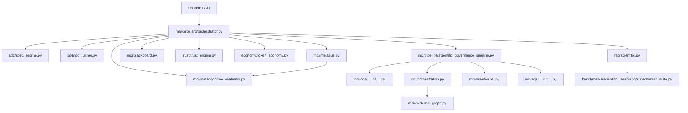

# Mapa Completo do Ecossistema — Nós e Vetores

- Nós: **1402**
- Vetores: **2217**

## Taxonomia de Nós

| kind | quantidade |
|---|---:|
| actor | 1 |
| agent | 248 |
| benchmark | 8 |
| diagram | 1 |
| doc | 5 |
| layer | 21 |
| module | 282 |
| schema | 4 |
| spec | 454 |
| test | 378 |

## Taxonomia de Vetores

| kind | quantidade |
|---|---:|
| contains | 1334 |
| control_flow | 38 |
| data_flow | 16 |
| depends_on | 55 |
| documents | 14 |
| imports | 760 |

## Diagrama de Alto Nível

```mermaid
graph TD
  actor_user_cli[Usuário / CLI] --> orchestrator_py[marceloclaro/orchestrator.py]
  orchestrator_py --> spec_engine_py[sdd/spec_engine.py]
  orchestrator_py --> tdd_runner_py[sdd/tdd_runner.py]
  orchestrator_py --> metabus_py[mci/metabus.py]
  orchestrator_py --> blackboard_py[mci/blackboard.py]
  orchestrator_py --> trust_engine_py[trust/trust_engine.py]
  orchestrator_py --> token_economy_py[economy/token_economy.py]
  orchestrator_py --> metaeval_py[mci/metacognitive_evaluator.py]
  orchestrator_py --> rag_py[rag/scientific.py]
  orchestrator_py --> sgp_py[mci/pipeline/scientific_governance_pipeline.py]
  sgp_py --> oqs_init_py[mci/oqs/__init__.py]
  sgp_py --> orchestration_py[mci/orchestration.py]
  sgp_py --> vsee_router_py[mci/vsee/router.py]
  sgp_py --> egs_init_py[mci/egs/__init__.py]
  orchestration_py --> evidence_graph_py[mci/evidence_graph.py]
  metabus_py --> metaeval_py
  rag_py --> superhuman_suite_py[benchmarks/scientific_reasoning/superhuman_suite.py]
```

## Inventário de Nós

| id | kind | layer | path/logical_group |
|---|---|---|---|
| actor_user_cli | actor | external | entrypoint |
| agents_catalog_00_editor_chefe_phd_md | agent | agents_catalog | agents/catalog/00_editor_chefe_phd.md |
| agents_catalog_01_agente_diagnostico_escopo_md | agent | agents_catalog | agents/catalog/01_agente_diagnostico_escopo.md |
| agents_catalog_02_agente_busca_curadoria_md | agent | agents_catalog | agents/catalog/02_agente_busca_curadoria.md |
| agents_catalog_03_agente_evidencias_citacoes_md | agent | agents_catalog | agents/catalog/03_agente_evidencias_citacoes.md |
| agents_catalog_04_agente_estrutura_argumentativa_md | agent | agents_catalog | agents/catalog/04_agente_estrutura_argumentativa.md |
| agents_catalog_05_agente_revisao_literatura_teoria_md | agent | agents_catalog | agents/catalog/05_agente_revisao_literatura_teoria.md |
| agents_catalog_06_agente_metodologia_reprodutibilidade_md | agent | agents_catalog | agents/catalog/06_agente_metodologia_reprodutibilidade.md |
| agents_catalog_07_agente_estatistica_analise_md | agent | agents_catalog | agents/catalog/07_agente_estatistica_analise.md |
| agents_catalog_08_agente_visualizacao_evidencia_grafica_md | agent | agents_catalog | agents/catalog/08_agente_visualizacao_evidencia_grafica.md |
| agents_catalog_09_agente_resultados_md | agent | agents_catalog | agents/catalog/09_agente_resultados.md |
| agents_catalog_10_agente_discussao_contribuicao_md | agent | agents_catalog | agents/catalog/10_agente_discussao_contribuicao.md |
| agents_catalog_11_agente_conclusao_coerencia_final_md | agent | agents_catalog | agents/catalog/11_agente_conclusao_coerencia_final.md |
| agents_catalog_12_agente_auditoria_bibliografica_abnt_md | agent | agents_catalog | agents/catalog/12_agente_auditoria_bibliografica_abnt.md |
| agents_catalog_13_agente_qa_qualis_a1_md | agent | agents_catalog | agents/catalog/13_agente_qa_qualis_a1.md |
| agents_catalog_14_agente_consistencia_interna_md | agent | agents_catalog | agents/catalog/14_agente_consistencia_interna.md |
| agents_catalog_15_agente_resumo_abstract_palavras_chave_md | agent | agents_catalog | agents/catalog/15_agente_resumo_abstract_palavras_chave.md |
| agents_catalog_16_agente_integracao_editorial_docx_md | agent | agents_catalog | agents/catalog/16_agente_integracao_editorial_docx.md |
| agents_catalog_17_agente_framework_reprodutivel_ambientes_md | agent | agents_catalog | agents/catalog/17_agente_framework_reprodutivel_ambientes.md |
| agents_catalog_18_agente_engenharia_dados_datasets_proveniencia_md | agent | agents_catalog | agents/catalog/18_agente_engenharia_dados_datasets_proveniencia.md |
| agents_catalog_19_agente_auditoria_codigo_documentacao_tecnica_md | agent | agents_catalog | agents/catalog/19_agente_auditoria_codigo_documentacao_tecnica.md |
| agents_catalog_20_agente_estatistica_avancada_inferencia_md | agent | agents_catalog | agents/catalog/20_agente_estatistica_avancada_inferencia.md |
| agents_catalog_21_agente_matematica_aplicada_modelagem_formal_md | agent | agents_catalog | agents/catalog/21_agente_matematica_aplicada_modelagem_formal.md |
| agents_catalog_22_agente_ml_dl_datamining_md | agent | agents_catalog | agents/catalog/22_agente_ml_dl_datamining.md |
| agents_catalog_23_agente_bioinformatica_omicas_md | agent | agents_catalog | agents/catalog/23_agente_bioinformatica_omicas.md |
| agents_catalog_24_agente_quimioinformatica_modelagem_molecular_md | agent | agents_catalog | agents/catalog/24_agente_quimioinformatica_modelagem_molecular.md |
| agents_catalog_25_agente_ciencias_sociais_linguistica_computacional_md | agent | agents_catalog | agents/catalog/25_agente_ciencias_sociais_linguistica_computacional.md |
| agents_catalog_26_agente_visao_computacional_multimodal_md | agent | agents_catalog | agents/catalog/26_agente_visao_computacional_multimodal.md |
| agents_catalog_27_agente_computacao_quantica_aplicada_md | agent | agents_catalog | agents/catalog/27_agente_computacao_quantica_aplicada.md |
| agents_catalog_28_agente_benchmarking_ablacao_robustez_md | agent | agents_catalog | agents/catalog/28_agente_benchmarking_ablacao_robustez.md |
| agents_catalog_29_agente_conformidade_internacional_md | agent | agents_catalog | agents/catalog/29_agente_conformidade_internacional.md |
| agents_catalog_30_agente_traducao_nativa_proofreading_md | agent | agents_catalog | agents/catalog/30_agente_traducao_nativa_proofreading.md |
| agents_catalog_31_agente_blind_peer_review_emulado_md | agent | agents_catalog | agents/catalog/31_agente_blind_peer_review_emulado.md |
| agents_catalog_32_agente_etica_open_science_md | agent | agents_catalog | agents/catalog/32_agente_etica_open_science.md |
| agents_catalog_33_agente_automacao_multi_norma_md | agent | agents_catalog | agents/catalog/33_agente_automacao_multi_norma.md |
| agents_catalog_34_agente_identificacao_conflitos_similaridade_md | agent | agents_catalog | agents/catalog/34_agente_identificacao_conflitos_similaridade.md |
| agents_catalog_35_agente_coleta_datasets_reais_md | agent | agents_catalog | agents/catalog/35_agente_coleta_datasets_reais.md |
| agents_catalog_36_agente_exportacao_latex_pdf_md | agent | agents_catalog | agents/catalog/36_agente_exportacao_latex_pdf.md |
| agents_catalog_37_agente_apresentacao_slides_banca_md | agent | agents_catalog | agents/catalog/37_agente_apresentacao_slides_banca.md |
| agents_catalog_38_agente_montagem_entrega_final_md | agent | agents_catalog | agents/catalog/38_agente_montagem_entrega_final.md |
| agents_catalog_39_agente_metodologia_multi_paradigma_md | agent | agents_catalog | agents/catalog/39_agente_metodologia_multi_paradigma.md |
| agents_catalog_40_agente_marcos_teoricos_interpretacao_md | agent | agents_catalog | agents/catalog/40_agente_marcos_teoricos_interpretacao.md |
| agents_catalog_41_agente_gis_geoprocessamento_cartografia_md | agent | agents_catalog | agents/catalog/41_agente_gis_geoprocessamento_cartografia.md |
| agents_catalog_42_agente_desenvolvedor_cientista_computacao_md | agent | agents_catalog | agents/catalog/42_agente_desenvolvedor_cientista_computacao.md |
| agents_catalog_43_agente_satelite_bioinformatica_omics_md | agent | agents_catalog | agents/catalog/43_agente_satelite_bioinformatica_omics.md |
| agents_catalog_44_agente_correcao_textual_qualis_md | agent | agents_catalog | agents/catalog/44_agente_correcao_textual_qualis.md |
| agents_catalog_45_agente_refinamento_argumentacao_md | agent | agents_catalog | agents/catalog/45_agente_refinamento_argumentacao.md |
| agents_catalog_46_agente_pesquisador_polimata_md | agent | agents_catalog | agents/catalog/46_agente_pesquisador_polimata.md |
| agents_catalog_47_agente_laboratorio_reproduzivel_md | agent | agents_catalog | agents/catalog/47_agente_laboratorio_reproduzivel.md |
| agents_catalog_48_agente_auditoria_reprodutibilidade_md | agent | agents_catalog | agents/catalog/48_agente_auditoria_reprodutibilidade.md |
| agents_catalog_DISPATCHER_ATIVACAO_md | agent | agents_catalog | agents/catalog/DISPATCHER_ATIVACAO.md |
| agents_catalog_README_md | agent | agents_catalog | agents/catalog/README.md |
| agents_catalog_TEMPLATE_HANDOFF_md | agent | agents_catalog | agents/catalog/TEMPLATE_HANDOFF.md |
| agents_catalog_abnt_latex_modular_md | agent | agents_catalog | agents/catalog/abnt-latex-modular.md |
| agents_catalog_academic_writer_md | agent | agents_catalog | agents/catalog/academic_writer.md |
| agents_catalog_adr_manager_md | agent | agents_catalog | agents/catalog/adr-manager.md |
| agents_catalog_antigravity_cli_md | agent | agents_catalog | agents/catalog/antigravity-cli.md |
| agents_catalog_antigravity_orchestrator_md | agent | agents_catalog | agents/catalog/antigravity-orchestrator.md |
| agents_catalog_architect_md | agent | agents_catalog | agents/catalog/architect.md |
| agents_catalog_architecture_analyzer_md | agent | agents_catalog | agents/catalog/architecture-analyzer.md |
| agents_catalog_auditor_md | agent | agents_catalog | agents/catalog/auditor.md |
| agents_catalog_author_voice_guardian_md | agent | agents_catalog | agents/catalog/author-voice-guardian.md |
| agents_catalog_autoevolve_md | agent | agents_catalog | agents/catalog/autoevolve.md |
| agents_catalog_auxjuris_document_summarizer_md | agent | agents_catalog | agents/catalog/auxjuris_document_summarizer.md |
| agents_catalog_auxjuris_email_drafter_md | agent | agents_catalog | agents/catalog/auxjuris_email_drafter.md |
| agents_catalog_auxjuris_legal_assistant_md | agent | agents_catalog | agents/catalog/auxjuris_legal_assistant.md |
| agents_catalog_auxjuris_legal_research_md | agent | agents_catalog | agents/catalog/auxjuris_legal_research.md |
| agents_catalog_awesome_mcp_servers_md | agent | agents_catalog | agents/catalog/awesome-mcp-servers.md |
| agents_catalog_back_translation_verifier_md | agent | agents_catalog | agents/catalog/back-translation-verifier.md |
| agents_catalog_batch_executor_md | agent | agents_catalog | agents/catalog/batch-executor.md |
| agents_catalog_bernstein_orchestrator_md | agent | agents_catalog | agents/catalog/bernstein-orchestrator.md |
| agents_catalog_bibtex_crossref_auditor_md | agent | agents_catalog | agents/catalog/bibtex-crossref-auditor.md |
| agents_catalog_book_finetuning_md | agent | agents_catalog | agents/catalog/book-finetuning.md |
| agents_catalog_book_mcp_md | agent | agents_catalog | agents/catalog/book-mcp.md |
| agents_catalog_build_agent_md | agent | agents_catalog | agents/catalog/build-agent.md |
| agents_catalog_claude_agent_sdk_python_md | agent | agents_catalog | agents/catalog/claude-agent-sdk-python.md |
| agents_catalog_claude_code_harness_md | agent | agents_catalog | agents/catalog/claude-code-harness.md |
| agents_catalog_claude_plugins_official_md | agent | agents_catalog | agents/catalog/claude-plugins-official.md |
| agents_catalog_cloud_alloydb_specialist_md | agent | agents_catalog | agents/catalog/cloud-alloydb-specialist.md |
| agents_catalog_cloud_bigquery_specialist_md | agent | agents_catalog | agents/catalog/cloud-bigquery-specialist.md |
| agents_catalog_cloud_data_infra_generalist_md | agent | agents_catalog | agents/catalog/cloud-data-infra-generalist.md |
| agents_catalog_cloud_data_pipelines_specialist_md | agent | agents_catalog | agents/catalog/cloud-data-pipelines-specialist.md |
| agents_catalog_cloud_security_specialist_md | agent | agents_catalog | agents/catalog/cloud-security-specialist.md |
| agents_catalog_cloud_sql_mysql_specialist_md | agent | agents_catalog | agents/catalog/cloud-sql-mysql-specialist.md |
| agents_catalog_cloud_sql_postgres_specialist_md | agent | agents_catalog | agents/catalog/cloud-sql-postgres-specialist.md |
| agents_catalog_cloud_sql_sqlserver_specialist_md | agent | agents_catalog | agents/catalog/cloud-sql-sqlserver-specialist.md |
| agents_catalog_code_reviewer_md | agent | agents_catalog | agents/catalog/code-reviewer.md |
| agents_catalog_codebase_analyzer_md | agent | agents_catalog | agents/catalog/codebase-analyzer.md |
| agents_catalog_codebase_locator_md | agent | agents_catalog | agents/catalog/codebase-locator.md |
| agents_catalog_codebase_pattern_finder_md | agent | agents_catalog | agents/catalog/codebase-pattern-finder.md |
| agents_catalog_coder_agent_md | agent | agents_catalog | agents/catalog/coder-agent.md |
| agents_catalog_coder_md | agent | agents_catalog | agents/catalog/coder.md |
| agents_catalog_colab_cli_md | agent | agents_catalog | agents/catalog/colab-cli.md |
| agents_catalog_colab_mcp_md | agent | agents_catalog | agents/catalog/colab-mcp.md |
| agents_catalog_colibri_agent_md | agent | agents_catalog | agents/catalog/colibri-agent.md |
| agents_catalog_context_manager_md | agent | agents_catalog | agents/catalog/context-manager.md |
| agents_catalog_context_retriever_md | agent | agents_catalog | agents/catalog/context-retriever.md |
| agents_catalog_contextscout_md | agent | agents_catalog | agents/catalog/contextscout.md |
| agents_catalog_contract_manager_md | agent | agents_catalog | agents/catalog/contract-manager.md |
| agents_catalog_copywriter_md | agent | agents_catalog | agents/catalog/copywriter.md |
| agents_catalog_core_hooks_md | agent | agents_catalog | agents/catalog/core-hooks.md |
| agents_catalog_cultural_episteme_agent_md | agent | agents_catalog | agents/catalog/cultural-episteme-agent.md |
| agents_catalog_data_knowledge_hub_md | agent | agents_catalog | agents/catalog/data-knowledge-hub.md |
| agents_catalog_debugger_md | agent | agents_catalog | agents/catalog/debugger.md |
| agents_catalog_devops_specialist_md | agent | agents_catalog | agents/catalog/devops-specialist.md |
| agents_catalog_docs_writer_md | agent | agents_catalog | agents/catalog/docs-writer.md |
| agents_catalog_documentation_md | agent | agents_catalog | agents/catalog/documentation.md |
| agents_catalog_docx_abnt_converter_md | agent | agents_catalog | agents/catalog/docx-abnt-converter.md |
| agents_catalog_eval_runner_md | agent | agents_catalog | agents/catalog/eval-runner.md |
| agents_catalog_externalscout_md | agent | agents_catalog | agents/catalog/externalscout.md |
| agents_catalog_frontend_specialist_md | agent | agents_catalog | agents/catalog/frontend-specialist.md |
| agents_catalog_gametheory_local_md | agent | agents_catalog | agents/catalog/gametheory-local.md |
| agents_catalog_gemini_cli_md | agent | agents_catalog | agents/catalog/gemini-cli.md |
| agents_catalog_gemini_notebook_audit_md | agent | agents_catalog | agents/catalog/gemini-notebook-audit.md |
| agents_catalog_gemini_notebook_transport_md | agent | agents_catalog | agents/catalog/gemini-notebook-transport.md |
| agents_catalog_gemini_notebook_upstream_md | agent | agents_catalog | agents/catalog/gemini-notebook-upstream.md |
| agents_catalog_gemini_notebooklm_bridge_md | agent | agents_catalog | agents/catalog/gemini-notebooklm-bridge.md |
| agents_catalog_git_manager_md | agent | agents_catalog | agents/catalog/git-manager.md |
| agents_catalog_goose_cli_md | agent | agents_catalog | agents/catalog/goose-cli.md |
| agents_catalog_haystack_rag_md | agent | agents_catalog | agents/catalog/haystack-rag.md |
| agents_catalog_honest_critic_agent_md | agent | agents_catalog | agents/catalog/honest-critic-agent.md |
| agents_catalog_hooks_integration_md | agent | agents_catalog | agents/catalog/hooks-integration.md |
| agents_catalog_image_specialist_md | agent | agents_catalog | agents/catalog/image-specialist.md |
| agents_catalog_inferencia_causal_did_iv_rdd_md | agent | agents_catalog | agents/catalog/inferencia-causal-did-iv-rdd.md |
| agents_catalog_jinja2_templates_md | agent | agents_catalog | agents/catalog/jinja2-templates.md |
| agents_catalog_kaggle_cli_md | agent | agents_catalog | agents/catalog/kaggle-cli.md |
| agents_catalog_kdp_cover_engineer_phd_md | agent | agents_catalog | agents/catalog/kdp-cover-engineer-phd.md |
| agents_catalog_kdp_ebook_epub_phd_md | agent | agents_catalog | agents/catalog/kdp-ebook-epub-phd.md |
| agents_catalog_kdp_final_qa_phd_md | agent | agents_catalog | agents/catalog/kdp-final-qa-phd.md |
| agents_catalog_kdp_interior_layout_phd_md | agent | agents_catalog | agents/catalog/kdp-interior-layout-phd.md |
| agents_catalog_kdp_metadata_isbn_phd_md | agent | agents_catalog | agents/catalog/kdp-metadata-isbn-phd.md |
| agents_catalog_kdp_orchestrator_phd_md | agent | agents_catalog | agents/catalog/kdp-orchestrator-phd.md |
| agents_catalog_kdp_preflight_auditor_phd_md | agent | agents_catalog | agents/catalog/kdp-preflight-auditor-phd.md |
| agents_catalog_landscape_curator_md | agent | agents_catalog | agents/catalog/landscape-curator.md |
| agents_catalog_library_architecture_md | agent | agents_catalog | agents/catalog/library-architecture.md |
| agents_catalog_linguistic_corrector_md | agent | agents_catalog | agents/catalog/linguistic-corrector.md |
| agents_catalog_literary_character_psychology_phd_md | agent | agents_catalog | agents/catalog/literary-character-psychology-phd.md |
| agents_catalog_literary_ethics_trauma_phd_md | agent | agents_catalog | agents/catalog/literary-ethics-trauma-phd.md |
| agents_catalog_literary_image_sepia_md | agent | agents_catalog | agents/catalog/literary-image-sepia.md |
| agents_catalog_literary_innovation_editorial_phd_md | agent | agents_catalog | agents/catalog/literary-innovation-editorial-phd.md |
| agents_catalog_literary_narratology_architect_phd_md | agent | agents_catalog | agents/catalog/literary-narratology-architect-phd.md |
| agents_catalog_literary_neurolinguistic_engineering_phd_md | agent | agents_catalog | agents/catalog/literary-neurolinguistic-engineering-phd.md |
| agents_catalog_literary_orchestrator_phd_md | agent | agents_catalog | agents/catalog/literary-orchestrator-phd.md |
| agents_catalog_literary_research_scholar_phd_md | agent | agents_catalog | agents/catalog/literary-research-scholar-phd.md |
| agents_catalog_literary_smoke_minimal_md | agent | agents_catalog | agents/catalog/literary-smoke-minimal.md |
| agents_catalog_literary_style_voice_phd_md | agent | agents_catalog | agents/catalog/literary-style-voice-phd.md |
| agents_catalog_literary_symbolic_imagery_phd_md | agent | agents_catalog | agents/catalog/literary-symbolic-imagery-phd.md |
| agents_catalog_litert_lm_agent_md | agent | agents_catalog | agents/catalog/litert-lm-agent.md |
| agents_catalog_live_mirofish_hermes_md | agent | agents_catalog | agents/catalog/live-mirofish-hermes.md |
| agents_catalog_llm_reduction_md | agent | agents_catalog | agents/catalog/llm-reduction.md |
| agents_catalog_marceloclaro_md | agent | agents_catalog | agents/catalog/marceloclaro.md |
| agents_catalog_master_orchestrator_md | agent | agents_catalog | agents/catalog/master-orchestrator.md |
| agents_catalog_mcp_cli_integration_md | agent | agents_catalog | agents/catalog/mcp-cli-integration.md |
| agents_catalog_medico_cardiologista_md | agent | agents_catalog | agents/catalog/medico-cardiologista.md |
| agents_catalog_medico_clinico_geral_md | agent | agents_catalog | agents/catalog/medico-clinico-geral.md |
| agents_catalog_medico_infectologista_md | agent | agents_catalog | agents/catalog/medico-infectologista.md |
| agents_catalog_medico_neurologista_md | agent | agents_catalog | agents/catalog/medico-neurologista.md |
| agents_catalog_medico_radiologista_md | agent | agents_catalog | agents/catalog/medico-radiologista.md |
| agents_catalog_medico_virtual_supremo_md | agent | agents_catalog | agents/catalog/medico-virtual-supremo.md |
| agents_catalog_minizinc_mcp_md | agent | agents_catalog | agents/catalog/minizinc-mcp.md |
| agents_catalog_mira_3d_md | agent | agents_catalog | agents/catalog/mira-3d.md |
| agents_catalog_mira_animated_metaphor_md | agent | agents_catalog | agents/catalog/mira-animated-metaphor.md |
| agents_catalog_mira_animator_md | agent | agents_catalog | agents/catalog/mira-animator.md |
| agents_catalog_mira_builder_md | agent | agents_catalog | agents/catalog/mira-builder.md |
| agents_catalog_mira_chart_race_md | agent | agents_catalog | agents/catalog/mira-chart-race.md |
| agents_catalog_mira_chart_md | agent | agents_catalog | agents/catalog/mira-chart.md |
| agents_catalog_mira_copywriter_md | agent | agents_catalog | agents/catalog/mira-copywriter.md |
| agents_catalog_mira_deck_academico_md | agent | agents_catalog | agents/catalog/mira-deck-academico.md |
| agents_catalog_mira_extract_md | agent | agents_catalog | agents/catalog/mira-extract.md |
| agents_catalog_mira_get_videos_md | agent | agents_catalog | agents/catalog/mira-get-videos.md |
| agents_catalog_mira_image_template_md | agent | agents_catalog | agents/catalog/mira-image-template.md |
| agents_catalog_mira_image_md | agent | agents_catalog | agents/catalog/mira-image.md |
| agents_catalog_mira_new_md | agent | agents_catalog | agents/catalog/mira-new.md |
| agents_catalog_mira_planner_md | agent | agents_catalog | agents/catalog/mira-planner.md |
| agents_catalog_mira_qrcode_md | agent | agents_catalog | agents/catalog/mira-qrcode.md |
| agents_catalog_mira_references_md | agent | agents_catalog | agents/catalog/mira-references.md |
| agents_catalog_mira_size_animator_md | agent | agents_catalog | agents/catalog/mira-size-animator.md |
| agents_catalog_mira_squared_md | agent | agents_catalog | agents/catalog/mira-squared.md |
| agents_catalog_mira_survey_md | agent | agents_catalog | agents/catalog/mira-survey.md |
| agents_catalog_mira_thirds_md | agent | agents_catalog | agents/catalog/mira-thirds.md |
| agents_catalog_mira_validator_md | agent | agents_catalog | agents/catalog/mira-validator.md |
| agents_catalog_mira_vertical_md | agent | agents_catalog | agents/catalog/mira-vertical.md |
| agents_catalog_mira_visuals_md | agent | agents_catalog | agents/catalog/mira-visuals.md |
| agents_catalog_modelagem_bayesiana_mista_md | agent | agents_catalog | agents/catalog/modelagem-bayesiana-mista.md |
| agents_catalog_nano_orchestrator_md | agent | agents_catalog | agents/catalog/nano-orchestrator.md |
| agents_catalog_openagent_md | agent | agents_catalog | agents/catalog/openagent.md |
| agents_catalog_opencode_agent_sdk_md | agent | agents_catalog | agents/catalog/opencode-agent-sdk.md |
| agents_catalog_opencode_go_agent_md | agent | agents_catalog | agents/catalog/opencode-go-agent.md |
| agents_catalog_opencode_zen_agent_md | agent | agents_catalog | agents/catalog/opencode-zen-agent.md |
| agents_catalog_opencoder_md | agent | agents_catalog | agents/catalog/opencoder.md |
| agents_catalog_optimizer_md | agent | agents_catalog | agents/catalog/optimizer.md |
| agents_catalog_pdf2latex_agent_md | agent | agents_catalog | agents/catalog/pdf2latex-agent.md |
| agents_catalog_plandex_cli_md | agent | agents_catalog | agents/catalog/plandex-cli.md |
| agents_catalog_prioritization_engine_md | agent | agents_catalog | agents/catalog/prioritization-engine.md |
| agents_catalog_pypi_searcher_md | agent | agents_catalog | agents/catalog/pypi-searcher.md |
| agents_catalog_quantum_nexus_phd_md | agent | agents_catalog | agents/catalog/quantum-nexus-phd.md |
| agents_catalog_reasonix_cli_md | agent | agents_catalog | agents/catalog/reasonix-cli.md |
| agents_catalog_researcher_md | agent | agents_catalog | agents/catalog/researcher.md |
| agents_catalog_reversa_agent_forum_md | agent | agents_catalog | agents/catalog/reversa-agent-forum.md |
| agents_catalog_reversa_anp_md | agent | agents_catalog | agents/catalog/reversa-anp.md |
| agents_catalog_reversa_archaeologist_md | agent | agents_catalog | agents/catalog/reversa-archaeologist.md |
| agents_catalog_reversa_architect_md | agent | agents_catalog | agents/catalog/reversa-architect.md |
| agents_catalog_reversa_config_generator_md | agent | agents_catalog | agents/catalog/reversa-config-generator.md |
| agents_catalog_reversa_data_master_md | agent | agents_catalog | agents/catalog/reversa-data-master.md |
| agents_catalog_reversa_design_system_md | agent | agents_catalog | agents/catalog/reversa-design-system.md |
| agents_catalog_reversa_detective_md | agent | agents_catalog | agents/catalog/reversa-detective.md |
| agents_catalog_reversa_document_ir_md | agent | agents_catalog | agents/catalog/reversa-document-ir.md |
| agents_catalog_reversa_entity_ner_md | agent | agents_catalog | agents/catalog/reversa-entity-ner.md |
| agents_catalog_reversa_fileipc_md | agent | agents_catalog | agents/catalog/reversa-fileipc.md |
| agents_catalog_reversa_graph_builder_md | agent | agents_catalog | agents/catalog/reversa-graph-builder.md |
| agents_catalog_reversa_graphrag_md | agent | agents_catalog | agents/catalog/reversa-graphrag.md |
| agents_catalog_reversa_hybrid_graph_md | agent | agents_catalog | agents/catalog/reversa-hybrid-graph.md |
| agents_catalog_reversa_memory_updater_md | agent | agents_catalog | agents/catalog/reversa-memory-updater.md |
| agents_catalog_reversa_oasis_profile_md | agent | agents_catalog | agents/catalog/reversa-oasis-profile.md |
| agents_catalog_reversa_ontology_gen_md | agent | agents_catalog | agents/catalog/reversa-ontology-gen.md |
| agents_catalog_reversa_planner_md | agent | agents_catalog | agents/catalog/reversa-planner.md |
| agents_catalog_reversa_process_lifecycle_md | agent | agents_catalog | agents/catalog/reversa-process-lifecycle.md |
| agents_catalog_reversa_report_agent_md | agent | agents_catalog | agents/catalog/reversa-report-agent.md |
| agents_catalog_reversa_reviewer_md | agent | agents_catalog | agents/catalog/reversa-reviewer.md |
| agents_catalog_reversa_scout_md | agent | agents_catalog | agents/catalog/reversa-scout.md |
| agents_catalog_reversa_statemachine_md | agent | agents_catalog | agents/catalog/reversa-statemachine.md |
| agents_catalog_reversa_swarm_review_md | agent | agents_catalog | agents/catalog/reversa-swarm-review.md |
| agents_catalog_reversa_synthesis_md | agent | agents_catalog | agents/catalog/reversa-synthesis.md |
| agents_catalog_reversa_visor_md | agent | agents_catalog | agents/catalog/reversa-visor.md |
| agents_catalog_reversa_writer_md | agent | agents_catalog | agents/catalog/reversa-writer.md |
| agents_catalog_reversa_md | agent | agents_catalog | agents/catalog/reversa.md |
| agents_catalog_reviewer_md | agent | agents_catalog | agents/catalog/reviewer.md |
| agents_catalog_scientific_capabilities_audit_md | agent | agents_catalog | agents/catalog/scientific-capabilities-audit.md |
| agents_catalog_security_auditor_md | agent | agents_catalog | agents/catalog/security-auditor.md |
| agents_catalog_simple_responder_md | agent | agents_catalog | agents/catalog/simple-responder.md |
| agents_catalog_simulation_game_audit_md | agent | agents_catalog | agents/catalog/simulation-game-audit.md |
| agents_catalog_skills_cloud_antigravity_md | agent | agents_catalog | agents/catalog/skills-cloud-antigravity.md |
| agents_catalog_stage_orchestrator_md | agent | agents_catalog | agents/catalog/stage-orchestrator.md |
| agents_catalog_story_mapper_md | agent | agents_catalog | agents/catalog/story-mapper.md |
| agents_catalog_task_manager_md | agent | agents_catalog | agents/catalog/task-manager.md |
| agents_catalog_tdah_gap_hunter_md | agent | agents_catalog | agents/catalog/tdah-gap-hunter.md |
| agents_catalog_technical_writer_md | agent | agents_catalog | agents/catalog/technical-writer.md |
| agents_catalog_terminology_graph_agent_md | agent | agents_catalog | agents/catalog/terminology-graph-agent.md |
| agents_catalog_test_engineer_md | agent | agents_catalog | agents/catalog/test-engineer.md |
| agents_catalog_thoughts_analyzer_md | agent | agents_catalog | agents/catalog/thoughts-analyzer.md |
| agents_catalog_thoughts_locator_md | agent | agents_catalog | agents/catalog/thoughts-locator.md |
| agents_catalog_university_synthetic_md | agent | agents_catalog | agents/catalog/university_synthetic.md |
| agents_catalog_web_developer_md | agent | agents_catalog | agents/catalog/web-developer.md |
| agents_catalog_web_search_researcher_md | agent | agents_catalog | agents/catalog/web-search-researcher.md |
| agents_catalog_ws_academic_pipeline_md | agent | agents_catalog | agents/catalog/ws-academic-pipeline.md |
| agents_catalog_ws_coder_md | agent | agents_catalog | agents/catalog/ws-coder.md |
| agents_catalog_ws_researcher_md | agent | agents_catalog | agents/catalog/ws-researcher.md |
| agents_catalog_ws_reviewer_md | agent | agents_catalog | agents/catalog/ws-reviewer.md |
| agents_catalog_ws_scribe_md | agent | agents_catalog | agents/catalog/ws-scribe.md |
| benchmarks_scientific_reasoning_init_py | benchmark | benchmarks | benchmarks/scientific_reasoning/__init__.py |
| benchmarks_scientific_reasoning_bias_detection_benchmark_py | benchmark | benchmarks | benchmarks/scientific_reasoning/bias_detection_benchmark.py |
| benchmarks_scientific_reasoning_causal_benchmark_py | benchmark | benchmarks | benchmarks/scientific_reasoning/causal_benchmark.py |
| benchmarks_scientific_reasoning_experimental_design_benchmark_py | benchmark | benchmarks | benchmarks/scientific_reasoning/experimental_design_benchmark.py |
| benchmarks_scientific_reasoning_power_analysis_benchmark_py | benchmark | benchmarks | benchmarks/scientific_reasoning/power_analysis_benchmark.py |
| benchmarks_scientific_reasoning_runner_py | benchmark | benchmarks | benchmarks/scientific_reasoning/runner.py |
| benchmarks_scientific_reasoning_statistical_benchmark_py | benchmark | benchmarks | benchmarks/scientific_reasoning/statistical_benchmark.py |
| benchmarks_scientific_reasoning_superhuman_suite_py | benchmark | benchmarks | benchmarks/scientific_reasoning/superhuman_suite.py |
| diagram_mmd | diagram | docs | diagram.mmd |
| ARCHITECTURE_md | doc | docs | ARCHITECTURE.md |
| CHANGELOG_md | doc | docs | CHANGELOG.md |
| CHANGELOG_EXECUTIVO_2026_07_06_md | doc | docs | CHANGELOG_EXECUTIVO_2026-07-06.md |
| README_md | doc | docs | README.md |
| RELEASE_NOTES_md | doc | docs | RELEASE_NOTES.md |
| layer_agents_catalog | layer | agents_catalog | agents |
| layer_benchmarks | layer | benchmarks | evaluation |
| layer_diagnostics | layer | diagnostics | analysis |
| layer_docs | layer | docs | documentation |
| layer_illustrations | layer | illustrations | visualization |
| layer_legal | layer | legal | legal_reasoning |
| layer_mci | layer | mci | memory |
| layer_orchestration | layer | orchestration | control |
| layer_publishing | layer | publishing | publishing |
| layer_rag | layer | rag | grounding |
| layer_reasoning | layer | reasoning | formal_reasoning |
| layer_research | layer | research | research |
| layer_schemas | layer | schemas | contracts |
| layer_scientific_governance | layer | scientific_governance | science |
| layer_sdd_tdd | layer | sdd_tdd | quality |
| layer_specs | layer | specs | documentation |
| layer_synthetic_university | layer | synthetic_university | academic_discovery |
| layer_tests | layer | tests | verification |
| layer_transformer | layer | transformer | routing |
| layer_trust_economy | layer | trust_economy | governance |
| layer_webapp | layer | webapp | interaction |
| academic_init_py | module | academic | academic/__init__.py |
| academic_auto_score_qualis_py | module | academic | academic/auto_score_qualis.py |
| academic_maswos_py | module | academic | academic/maswos.py |
| academic_maswos_llm_delegate_py | module | academic | academic/maswos_llm_delegate.py |
| academic_papers_arm_education_audit_scripts_analyze_arm_education_py | module | academic | academic/papers/arm_education_audit/scripts/analyze_arm_education.py |
| academic_papers_arm_education_audit_scripts_analyze_brasil_comparativo_py | module | academic | academic/papers/arm_education_audit/scripts/analyze_brasil_comparativo.py |
| academic_papers_arm_education_audit_scripts_analyze_channels_py | module | academic | academic/papers/arm_education_audit/scripts/analyze_channels.py |
| academic_papers_arm_education_audit_scripts_analyze_expanded_py | module | academic | academic/papers/arm_education_audit/scripts/analyze_expanded.py |
| academic_papers_arm_education_audit_scripts_analyze_hipotese_confiabilidade_py | module | academic | academic/papers/arm_education_audit/scripts/analyze_hipotese_confiabilidade.py |
| academic_papers_arm_education_audit_scripts_analyze_metodologia_suplementar_py | module | academic | academic/papers/arm_education_audit/scripts/analyze_metodologia_suplementar.py |
| academic_papers_arm_education_audit_scripts_analyze_publishable_py | module | academic | academic/papers/arm_education_audit/scripts/analyze_publishable.py |
| academic_papers_arm_education_audit_scripts_audit_provenance_py | module | academic | academic/papers/arm_education_audit/scripts/audit_provenance.py |
| academic_papers_arm_education_audit_scripts_build_citation_audit_py | module | academic | academic/papers/arm_education_audit/scripts/build_citation_audit.py |
| academic_papers_arm_education_audit_scripts_build_source_manifest_py | module | academic | academic/papers/arm_education_audit/scripts/build_source_manifest.py |
| academic_papers_arm_education_audit_scripts_collect_wdi_py | module | academic | academic/papers/arm_education_audit/scripts/collect_wdi.py |
| academic_papers_arm_education_audit_scripts_download_expanded_data_py | module | academic | academic/papers/arm_education_audit/scripts/download_expanded_data.py |
| academic_papers_arm_education_audit_scripts_empacotar_submissao_py | module | academic | academic/papers/arm_education_audit/scripts/empacotar_submissao.py |
| academic_papers_arm_education_audit_scripts_export_docx_rbep_py | module | academic | academic/papers/arm_education_audit/scripts/export_docx_rbep.py |
| academic_papers_crateus_ideb_scripts_analise_crateus_py | module | academic | academic/papers/crateus_ideb/scripts/analise_crateus.py |
| academic_papers_crateus_ideb_scripts_analise_crateus_r428_py | module | academic | academic/papers/crateus_ideb/scripts/analise_crateus_r428.py |
| academic_papers_crateus_ideb_scripts_analise_indicadores_crateus_py | module | academic | academic/papers/crateus_ideb/scripts/analise_indicadores_crateus.py |
| academic_papers_crateus_ideb_scripts_analise_r430_marcadores_py | module | academic | academic/papers/crateus_ideb/scripts/analise_r430_marcadores.py |
| academic_papers_crateus_ideb_scripts_baixar_dados_py | module | academic | academic/papers/crateus_ideb/scripts/baixar_dados.py |
| academic_papers_crateus_ideb_scripts_baixar_indicadores_py | module | academic | academic/papers/crateus_ideb/scripts/baixar_indicadores.py |
| academic_papers_crateus_ideb_scripts_baixar_indicadores_r430_py | module | academic | academic/papers/crateus_ideb/scripts/baixar_indicadores_r430.py |
| academic_papers_crateus_ideb_scripts_export_docx_rbep_py | module | academic | academic/papers/crateus_ideb/scripts/export_docx_rbep.py |
| academic_papers_crateus_ideb_scripts_graficos_crateus_py | module | academic | academic/papers/crateus_ideb/scripts/graficos_crateus.py |
| academic_papers_crateus_ideb_scripts_mapa_crateus_py | module | academic | academic/papers/crateus_ideb/scripts/mapa_crateus.py |
| academic_papers_crateus_ideb_scripts_verificar_consistencia_manuscrito_r428_py | module | academic | academic/papers/crateus_ideb/scripts/verificar_consistencia_manuscrito_r428.py |
| academic_rigorous_board_py | module | academic | academic/rigorous_board.py |
| academic_seeker_py | module | academic | academic/seeker.py |
| economy_init_py | module | trust_economy | economy/__init__.py |
| economy_token_economy_py | module | trust_economy | economy/token_economy.py |
| gametheory_init_py | module | gametheory | gametheory/__init__.py |
| gametheory_debate_strategies_py | module | gametheory | gametheory/debate_strategies.py |
| gametheory_moderator_py | module | gametheory | gametheory/moderator.py |
| gametheory_phd_auditor_py | module | gametheory | gametheory/phd_auditor.py |
| illustrations_init_py | module | illustrations | illustrations/__init__.py |
| illustrations_graphify_engine_py | module | illustrations | illustrations/graphify_engine.py |
| illustrations_mermaid_engine_py | module | illustrations | illustrations/mermaid_engine.py |
| illustrations_mira_agent_py | module | illustrations | illustrations/mira_agent.py |
| illustrations_mira_deck_py | module | illustrations | illustrations/mira_deck.py |
| illustrations_mira_engine_py | module | illustrations | illustrations/mira_engine.py |
| legal_init_py | module | legal | legal/__init__.py |
| legal_agents_py | module | legal | legal/agents.py |
| legal_argumentation_py | module | legal | legal/argumentation.py |
| legal_balancing_py | module | legal | legal/balancing.py |
| legal_benchmarks_py | module | legal | legal/benchmarks.py |
| legal_constitutional_py | module | legal | legal/constitutional.py |
| legal_datajud_client_py | module | legal | legal/datajud_client.py |
| legal_integration_py | module | legal | legal/integration.py |
| legal_knowledge_base_py | module | legal | legal/knowledge_base.py |
| legal_precedents_py | module | legal | legal/precedents.py |
| legal_specializations_py | module | legal | legal/specializations.py |
| legal_summarizer_py | module | legal | legal/summarizer.py |
| legal_syllogism_py | module | legal | legal/syllogism.py |
| marceloclaro_init_py | module | orchestration | marceloclaro/__init__.py |
| marceloclaro_agent_loader_py | module | orchestration | marceloclaro/agent_loader.py |
| marceloclaro_autonomous_py | module | orchestration | marceloclaro/autonomous.py |
| marceloclaro_catalog_loader_py | module | orchestration | marceloclaro/catalog_loader.py |
| marceloclaro_cli_py | module | orchestration | marceloclaro/cli.py |
| marceloclaro_core_check_py | module | orchestration | marceloclaro/core_check.py |
| marceloclaro_doctor_py | module | orchestration | marceloclaro/doctor.py |
| marceloclaro_ecosystem_map_py | module | orchestration | marceloclaro/ecosystem_map.py |
| marceloclaro_env_loader_py | module | orchestration | marceloclaro/env_loader.py |
| marceloclaro_helpdesk_py | module | orchestration | marceloclaro/helpdesk.py |
| marceloclaro_inspiration_audit_py | module | orchestration | marceloclaro/inspiration_audit.py |
| marceloclaro_integration_cli_py | module | orchestration | marceloclaro/integration_cli.py |
| marceloclaro_integration_service_py | module | orchestration | marceloclaro/integration_service.py |
| marceloclaro_knowledge_evolution_py | module | orchestration | marceloclaro/knowledge_evolution.py |
| marceloclaro_library_cli_py | module | orchestration | marceloclaro/library_cli.py |
| marceloclaro_metrics_py | module | orchestration | marceloclaro/metrics.py |
| marceloclaro_orchestrator_py | module | orchestration | marceloclaro/orchestrator.py |
| marceloclaro_runtime_actions_py | module | orchestration | marceloclaro/runtime_actions.py |
| marceloclaro_science_cli_py | module | orchestration | marceloclaro/science_cli.py |
| marceloclaro_scientific_lab_py | module | orchestration | marceloclaro/scientific_lab.py |
| marceloclaro_workflow_py | module | orchestration | marceloclaro/workflow.py |
| marceloclaro_workflow_store_py | module | orchestration | marceloclaro/workflow_store.py |
| mci_init_py | module | mci | mci/__init__.py |
| mci_adversarial_reviewer_py | module | mci | mci/adversarial_reviewer.py |
| mci_agent_registry_bootstrap_py | module | mci | mci/agent_registry_bootstrap.py |
| mci_blackboard_py | module | mci | mci/blackboard.py |
| mci_confidence_calibrator_py | module | mci | mci/confidence_calibrator.py |
| mci_egs_init_py | module | scientific_governance | mci/egs/__init__.py |
| mci_egs_alignment_py | module | scientific_governance | mci/egs/alignment.py |
| mci_egs_explainability_py | module | scientific_governance | mci/egs/explainability.py |
| mci_egs_governance_analyzer_py | module | scientific_governance | mci/egs/governance_analyzer.py |
| mci_egs_principle_engine_py | module | scientific_governance | mci/egs/principle_engine.py |
| mci_egs_stress_test_py | module | scientific_governance | mci/egs/stress_test.py |
| mci_evidence_graph_py | module | mci | mci/evidence_graph.py |
| mci_experiment_designer_py | module | mci | mci/experiment_designer.py |
| mci_hypothesis_engine_py | module | mci | mci/hypothesis_engine.py |
| mci_mcp_server_py | module | mci | mci/mcp_server.py |
| mci_metabus_py | module | mci | mci/metabus.py |
| mci_metacognitive_evaluator_py | module | mci | mci/metacognitive_evaluator.py |
| mci_multidisciplinary_triangulation_py | module | mci | mci/multidisciplinary_triangulation.py |
| mci_oqs_init_py | module | scientific_governance | mci/oqs/__init__.py |
| mci_oqs_candidate_generator_py | module | scientific_governance | mci/oqs/candidate_generator.py |
| mci_oqs_intake_py | module | scientific_governance | mci/oqs/intake.py |
| mci_oqs_scoring_py | module | scientific_governance | mci/oqs/scoring.py |
| mci_oqs_selector_py | module | scientific_governance | mci/oqs/selector.py |
| mci_oqs_uncertainty_scanner_py | module | scientific_governance | mci/oqs/uncertainty_scanner.py |
| mci_orchestration_py | module | mci | mci/orchestration.py |
| mci_pipeline_init_py | module | scientific_governance | mci/pipeline/__init__.py |
| mci_pipeline_scientific_governance_pipeline_py | module | scientific_governance | mci/pipeline/scientific_governance_pipeline.py |
| mci_preregistration_protocol_py | module | mci | mci/preregistration_protocol.py |
| mci_reflexion_py | module | mci | mci/reflexion.py |
| mci_rigorous_validation_py | module | mci | mci/rigorous_validation.py |
| mci_scientific_reporter_py | module | mci | mci/scientific_reporter.py |
| mci_self_correction_py | module | mci | mci/self_correction.py |
| mci_statistical_validator_py | module | mci | mci/statistical_validator.py |
| mci_task_runtime_py | module | mci | mci/task_runtime.py |
| mci_vsee_init_py | module | scientific_governance | mci/vsee/__init__.py |
| mci_vsee_executor_py | module | scientific_governance | mci/vsee/executor.py |
| mci_vsee_fallback_py | module | scientific_governance | mci/vsee/fallback.py |
| mci_vsee_policy_py | module | scientific_governance | mci/vsee/policy.py |
| mci_vsee_router_py | module | scientific_governance | mci/vsee/router.py |
| mci_vsee_telemetry_py | module | scientific_governance | mci/vsee/telemetry.py |
| mirofish_init_py | module | mirofish | mirofish/__init__.py |
| mirofish_graph_memory_py | module | mirofish | mirofish/graph_memory.py |
| mirofish_social_init_py | module | mirofish | mirofish/social/__init__.py |
| mirofish_social_banca_py | module | mirofish | mirofish/social/banca.py |
| mirofish_social_contracts_py | module | mirofish | mirofish/social/contracts.py |
| mirofish_social_editorial_profiles_py | module | mirofish | mirofish/social/editorial_profiles.py |
| mirofish_social_engine_py | module | mirofish | mirofish/social/engine.py |
| mirofish_social_profiles_py | module | mirofish | mirofish/social/profiles.py |
| mirofish_social_report_py | module | mirofish | mirofish/social/report.py |
| mirofish_swarm_py | module | mirofish | mirofish/swarm.py |
| mirofish_validator_py | module | mirofish | mirofish/validator.py |
| publishing_init_py | module | publishing | publishing/__init__.py |
| publishing_cover_designer_py | module | publishing | publishing/cover_designer.py |
| publishing_production_py | module | publishing | publishing/production.py |
| rag_init_py | module | rag | rag/__init__.py |
| rag_book_library_py | module | rag | rag/book_library.py |
| rag_enhanced_search_rag_py | module | rag | rag/enhanced_search_rag.py |
| rag_evolved_py | module | rag | rag/evolved.py |
| rag_habd_py | module | rag | rag/habd.py |
| rag_recaman_py | module | rag | rag/recaman.py |
| rag_scientific_py | module | rag | rag/scientific.py |
| reasoning_init_py | module | reasoning | reasoning/__init__.py |
| reasoning_arche_rlt_py | module | reasoning | reasoning/arche_rlt.py |
| reasoning_cache_py | module | reasoning | reasoning/cache.py |
| reasoning_engines_py | module | reasoning | reasoning/engines.py |
| reasoning_evaluator_py | module | reasoning | reasoning/evaluator.py |
| reasoning_fallacies_py | module | reasoning | reasoning/fallacies.py |
| reasoning_parallel_py | module | reasoning | reasoning/parallel.py |
| reasoning_production_scaffolds_py | module | reasoning | reasoning/production_scaffolds.py |
| reasoning_quantum_py | module | reasoning | reasoning/quantum.py |
| reasoning_visualizer_py | module | reasoning | reasoning/visualizer.py |
| research_init_py | module | research | research/__init__.py |
| research_claim_strength_guard_py | module | research | research/claim_strength/guard.py |
| research_diabetes_bias_experiment_py | module | research | research/diabetes_bias_experiment.py |
| research_diabetes_bias_experiment_v2_py | module | research | research/diabetes_bias_experiment_v2.py |
| research_discovery_init_py | module | research | research/discovery/__init__.py |
| research_discovery_analysis_py | module | research | research/discovery/analysis.py |
| research_discovery_bayes_py | module | research | research/discovery/bayes.py |
| research_discovery_causal_py | module | research | research/discovery/causal.py |
| research_discovery_design_py | module | research | research/discovery/design.py |
| research_discovery_mistos_py | module | research | research/discovery/mistos.py |
| research_discovery_report_py | module | research | research/discovery/report.py |
| research_discovery_validate_py | module | research | research/discovery/validate.py |
| research_downloader_py | module | research | research/downloader.py |
| research_experimental_data_py | module | research | research/experimental_data.py |
| research_fichamento_py | module | research | research/fichamento.py |
| research_figure_hunter_py | module | research | research/figure_hunter.py |
| research_hub_py | module | research | research/hub.py |
| research_hub_router_bridge_py | module | research | research/hub_router_bridge.py |
| research_imo_study_artigo_arxiv_pt_gen_figures_py | module | research | research/imo_study/artigo_arxiv_pt/gen_figures.py |
| research_imo_study_llm_free_benchmark_py | module | research | research/imo_study/llm_free_benchmark.py |
| research_imo_study_maswos_local_delegate_py | module | research | research/imo_study/maswos_local_delegate.py |
| research_imo_study_scripts_r503_benchmark_9x3_py | module | research | research/imo_study/scripts_r503_benchmark_9x3.py |
| research_imo_study_scripts_r506_benchmark_code_py | module | research | research/imo_study/scripts_r506_benchmark_code.py |
| research_llm_client_py | module | research | research/llm_client.py |
| research_manuscript_init_py | module | research | research/manuscript/__init__.py |
| research_manuscript_config_py | module | research | research/manuscript/config.py |
| research_manuscript_docx_builder_py | module | research | research/manuscript/docx_builder.py |
| research_manuscript_gates_py | module | research | research/manuscript/gates.py |
| research_manuscript_pipeline_py | module | research | research/manuscript/pipeline.py |
| research_manuscript_pptx_theme_py | module | research | research/manuscript/pptx_theme.py |
| research_manuscript_scaffold_py | module | research | research/manuscript/scaffold.py |
| research_manuscript_texparse_py | module | research | research/manuscript/texparse.py |
| research_orchestrate_py | module | research | research/orchestrate.py |
| research_osint_py | module | research | research/osint.py |
| research_output_generate_figures_py | module | research | research/output/generate_figures.py |
| research_pdf2md_py | module | research | research/pdf2md.py |
| research_pipelines_analyze_research_batch_py | module | research | research/pipelines/analyze_research_batch.py |
| research_pipelines_run_research_batch_py | module | research | research/pipelines/run_research_batch.py |
| research_producao_real_gerar_ep26_py | module | research | research/producao_real/gerar_ep26.py |
| research_producao_real_gerar_episodios_py | module | research | research/producao_real/gerar_episodios.py |
| research_producao_real_pacote_editorial_podcast_molambudos_pipeline_gerar_ep26_py | module | research | research/producao_real/pacote_editorial_podcast_molambudos/pipeline/gerar_ep26.py |
| research_producao_real_pacote_editorial_podcast_molambudos_pipeline_gerar_episodios_py | module | research | research/producao_real/pacote_editorial_podcast_molambudos/pipeline/gerar_episodios.py |
| research_producao_real_pacote_editorial_podcast_molambudos_pipeline_recuperar_downloads_py | module | research | research/producao_real/pacote_editorial_podcast_molambudos/pipeline/recuperar_downloads.py |
| research_producao_real_pacote_editorial_podcast_molambudos_pipeline_retomar_episodios_py | module | research | research/producao_real/pacote_editorial_podcast_molambudos/pipeline/retomar_episodios.py |
| research_producao_real_pacote_editorial_podcast_molambudos_gh_pipeline_gerar_ep26_py | module | research | research/producao_real/pacote_editorial_podcast_molambudos_gh/pipeline/gerar_ep26.py |
| research_producao_real_pacote_editorial_podcast_molambudos_gh_pipeline_gerar_episodios_py | module | research | research/producao_real/pacote_editorial_podcast_molambudos_gh/pipeline/gerar_episodios.py |
| research_producao_real_pacote_editorial_podcast_molambudos_gh_pipeline_recuperar_downloads_py | module | research | research/producao_real/pacote_editorial_podcast_molambudos_gh/pipeline/recuperar_downloads.py |
| research_producao_real_pacote_editorial_podcast_molambudos_gh_pipeline_retomar_episodios_py | module | research | research/producao_real/pacote_editorial_podcast_molambudos_gh/pipeline/retomar_episodios.py |
| research_producao_real_recuperar_downloads_py | module | research | research/producao_real/recuperar_downloads.py |
| research_producao_real_retomar_episodios_py | module | research | research/producao_real/retomar_episodios.py |
| research_provenance_pipeline_py | module | research | research/provenance_pipeline.py |
| research_searchers_py | module | research | research/searchers.py |
| research_simulated_reviews_py | module | research | research/simulated_reviews.py |
| research_simulated_reviews_v2_py | module | research | research/simulated_reviews_v2.py |
| research_statistical_methods_py | module | research | research/statistical_methods.py |
| scanners_init_py | module | diagnostics | scanners/__init__.py |
| scanners_capability_composer_py | module | diagnostics | scanners/capability_composer.py |
| scanners_capability_dna_py | module | diagnostics | scanners/capability_dna.py |
| scanners_cli_py | module | diagnostics | scanners/cli.py |
| scanners_compression_engine_py | module | diagnostics | scanners/compression_engine.py |
| scanners_cross_validation_engine_py | module | diagnostics | scanners/cross_validation_engine.py |
| scanners_epistemic_prioritizer_py | module | diagnostics | scanners/epistemic_prioritizer.py |
| scanners_evolutionary_pipeline_py | module | diagnostics | scanners/evolutionary_pipeline.py |
| scanners_evolutionary_sequencing_py | module | diagnostics | scanners/evolutionary_sequencing.py |
| scanners_inertia_analyzer_py | module | diagnostics | scanners/inertia_analyzer.py |
| scanners_knowledge_composition_py | module | diagnostics | scanners/knowledge_composition.py |
| scanners_legal_impact_scanner_py | module | diagnostics | scanners/legal_impact_scanner.py |
| scanners_literary_research_scanners_py | module | diagnostics | scanners/literary_research_scanners.py |
| scanners_literary_scanners_py | module | diagnostics | scanners/literary_scanners.py |
| scanners_noise_scanner_py | module | diagnostics | scanners/noise_scanner.py |
| scanners_noological_scanner_py | module | diagnostics | scanners/noological_scanner.py |
| scanners_optimal_question_scanner_py | module | diagnostics | scanners/optimal_question_scanner.py |
| scanners_pipeline_py | module | diagnostics | scanners/pipeline.py |
| scanners_polymath_labs_scanner_py | module | diagnostics | scanners/polymath_labs_scanner.py |
| scanners_polymathic_convergence_py | module | diagnostics | scanners/polymathic_convergence.py |
| scanners_potentiality_scanner_py | module | diagnostics | scanners/potentiality_scanner.py |
| scanners_psychological_immersion_scanners_py | module | diagnostics | scanners/psychological_immersion_scanners.py |
| scanners_reversa_scanner_py | module | diagnostics | scanners/reversa_scanner.py |
| scanners_reverse_scanner_py | module | diagnostics | scanners/reverse_scanner.py |
| scanners_scanners_mcp_server_py | module | diagnostics | scanners/scanners_mcp_server.py |
| scanners_scientific_reasoning_scanner_py | module | diagnostics | scanners/scientific_reasoning_scanner.py |
| scanners_social_impact_scanner_py | module | diagnostics | scanners/social_impact_scanner.py |
| scanners_successor_generator_py | module | diagnostics | scanners/successor_generator.py |
| scanners_teleological_scanner_py | module | diagnostics | scanners/teleological_scanner.py |
| scanners_trajectory_mapper_py | module | diagnostics | scanners/trajectory_mapper.py |
| sdd_init_py | module | sdd_tdd | sdd/__init__.py |
| sdd_loop_spec_py | module | sdd_tdd | sdd/loop_spec.py |
| sdd_spec_engine_py | module | sdd_tdd | sdd/spec_engine.py |
| sdd_tdd_runner_py | module | sdd_tdd | sdd/tdd_runner.py |
| synthetic_university_init_py | module | synthetic_university | synthetic_university/__init__.py |
| synthetic_university_academic_integration_py | module | synthetic_university | synthetic_university/academic_integration.py |
| synthetic_university_agents_init_py | module | synthetic_university | synthetic_university/agents/__init__.py |
| synthetic_university_agents_professor_base_py | module | synthetic_university | synthetic_university/agents/professor_base.py |
| synthetic_university_agents_professors_py | module | synthetic_university | synthetic_university/agents/professors.py |
| synthetic_university_api_gateway_py | module | synthetic_university | synthetic_university/api_gateway.py |
| synthetic_university_benchmark_py | module | synthetic_university | synthetic_university/benchmark.py |
| synthetic_university_combinatorial_engine_py | module | synthetic_university | synthetic_university/combinatorial_engine.py |
| synthetic_university_continuous_discovery_py | module | synthetic_university | synthetic_university/continuous_discovery.py |
| synthetic_university_core_py | module | synthetic_university | synthetic_university/core.py |
| synthetic_university_correlator_py | module | synthetic_university | synthetic_university/correlator.py |
| synthetic_university_curriculum_py | module | synthetic_university | synthetic_university/curriculum.py |
| synthetic_university_dashboard_generator_py | module | synthetic_university | synthetic_university/dashboard_generator.py |
| synthetic_university_empirical_validation_py | module | synthetic_university | synthetic_university/empirical_validation.py |
| synthetic_university_evolutionary_memory_py | module | synthetic_university | synthetic_university/evolutionary_memory.py |
| synthetic_university_faculties_py | module | synthetic_university | synthetic_university/faculties.py |
| synthetic_university_i18n_py | module | synthetic_university | synthetic_university/i18n.py |
| synthetic_university_knowledge_graph_py | module | synthetic_university | synthetic_university/knowledge_graph.py |
| synthetic_university_llm_evaluator_py | module | synthetic_university | synthetic_university/llm_evaluator.py |
| synthetic_university_mcp_security_py | module | synthetic_university | synthetic_university/mcp_security.py |
| synthetic_university_mcp_server_py | module | synthetic_university | synthetic_university/mcp_server.py |
| synthetic_university_novelty_analysis_py | module | synthetic_university | synthetic_university/novelty_analysis.py |
| synthetic_university_novelty_v2_py | module | synthetic_university | synthetic_university/novelty_v2.py |
| synthetic_university_peer_review_py | module | synthetic_university | synthetic_university/peer_review.py |
| synthetic_university_semantic_embedder_py | module | synthetic_university | synthetic_university/semantic_embedder.py |
| synthetic_university_submission_package_py | module | synthetic_university | synthetic_university/submission_package.py |
| synthetic_university_thesis_enricher_py | module | synthetic_university | synthetic_university/thesis_enricher.py |
| synthetic_university_thesis_generator_py | module | synthetic_university | synthetic_university/thesis_generator.py |
| synthetic_university_visual_abstract_py | module | synthetic_university | synthetic_university/visual_abstract.py |
| transformer_init_py | module | transformer | transformer/__init__.py |
| transformer_attention_py | module | transformer | transformer/attention.py |
| transformer_embedder_py | module | transformer | transformer/embedder.py |
| transformer_episteme_py | module | transformer | transformer/episteme.py |
| transformer_harness_head_py | module | transformer | transformer/harness_head.py |
| transformer_memory_py | module | transformer | transformer/memory.py |
| transformer_pipeline_py | module | transformer | transformer/pipeline.py |
| transformer_semantic_matcher_py | module | transformer | transformer/semantic_matcher.py |
| trust_init_py | module | trust_economy | trust/__init__.py |
| trust_trust_engine_py | module | trust_economy | trust/trust_engine.py |
| trust_vectorized_drift_py | module | trust_economy | trust/vectorized_drift.py |
| webapp_app_py | module | webapp | webapp/app.py |
| webapp_consultation_helpers_py | module | webapp | webapp/consultation_helpers.py |
| webapp_legal_impact_helpers_py | module | webapp | webapp/legal_impact_helpers.py |
| webapp_pipeline_helpers_py | module | webapp | webapp/pipeline_helpers.py |
| schemas_ethical_assessment_schema_json | schema | schemas | schemas/ethical_assessment.schema.json |
| schemas_optimal_question_schema_json | schema | schemas | schemas/optimal_question.schema.json |
| schemas_scientific_claim_schema_json | schema | schemas | schemas/scientific_claim.schema.json |
| schemas_vector_execution_decision_schema_json | schema | schemas | schemas/vector_execution_decision.schema.json |
| specs_SPEC_001_metabus_md | spec | specs | specs/SPEC-001-metabus.md |
| specs_SPEC_002_blackboard_md | spec | specs | specs/SPEC-002-blackboard.md |
| specs_SPEC_003_reflexion_md | spec | specs | specs/SPEC-003-reflexion.md |
| specs_SPEC_004_transformer_md | spec | specs | specs/SPEC-004-transformer.md |
| specs_SPEC_005_orchestrator_md | spec | specs | specs/SPEC-005-orchestrator.md |
| specs_SPEC_006_agents_md | spec | specs | specs/SPEC-006-agents.md |
| specs_SPEC_007_trust_engine_md | spec | specs | specs/SPEC-007-trust-engine.md |
| specs_SPEC_008_token_economy_md | spec | specs | specs/SPEC-008-token-economy.md |
| specs_SPEC_009_scanners_md | spec | specs | specs/SPEC-009-scanners.md |
| specs_SPEC_010_maswos_academic_md | spec | specs | specs/SPEC-010-maswos-academic.md |
| specs_SPEC_011_reasoning_quantum_md | spec | specs | specs/SPEC-011-reasoning-quantum.md |
| specs_SPEC_012_evolution_cycles_md | spec | specs | specs/SPEC-012-evolution-cycles.md |
| specs_SPEC_013_cli_integrations_md | spec | specs | specs/SPEC-013-cli-integrations.md |
| specs_SPEC_014_gametheory_md | spec | specs | specs/SPEC-014-gametheory.md |
| specs_SPEC_014_livro_ecosystem_core_md | spec | specs | specs/SPEC-014-livro-ecosystem-core.md |
| specs_SPEC_015_mirofish_md | spec | specs | specs/SPEC-015-mirofish.md |
| specs_SPEC_016_publishing_md | spec | specs | specs/SPEC-016-publishing.md |
| specs_SPEC_017_research_md | spec | specs | specs/SPEC-017-research.md |
| specs_SPEC_018_illustrations_md | spec | specs | specs/SPEC-018-illustrations.md |
| specs_SPEC_019_cover_designer_md | spec | specs | specs/SPEC-019-cover-designer.md |
| specs_SPEC_020_deep_diagnose_md | spec | specs | specs/SPEC-020-deep-diagnose.md |
| specs_SPEC_021_superhuman_pipeline_md | spec | specs | specs/SPEC-021-superhuman-pipeline.md |
| specs_SPEC_022_diagnostic_pipeline_refined_md | spec | specs | specs/SPEC-022-diagnostic-pipeline-refined.md |
| specs_SPEC_023_inspiration_audit_md | spec | specs | specs/SPEC-023-inspiration-audit.md |
| specs_SPEC_024_research_batch_analysis_md | spec | specs | specs/SPEC-024-research-batch-analysis.md |
| specs_SPEC_025_scientific_governance_tdd_hardening_md | spec | specs | specs/SPEC-025-scientific-governance-tdd-hardening.md |
| specs_SPEC_026_mira_command_surface_md | spec | specs | specs/SPEC-026-mira-command-surface.md |
| specs_SPEC_027_scientific_reporter_hardening_md | spec | specs | specs/SPEC-027-scientific-reporter-hardening.md |
| specs_SPEC_028_executive_changelog_artifact_md | spec | specs | specs/SPEC-028-executive-changelog-artifact.md |
| specs_SPEC_029_ecosystem_full_map_md | spec | specs | specs/SPEC-029-ecosystem-full-map.md |
| specs_SPEC_1000_pdf2latex_multi_engine_renderer_md | spec | specs | specs/SPEC-1000-pdf2latex-multi-engine-renderer.md |
| specs_SPEC_1001_pdf2latex_ocr_vision_engine_md | spec | specs | specs/SPEC-1001-pdf2latex-ocr-vision-engine.md |
| specs_SPEC_108_opencode_go_zen_integration_md | spec | specs | specs/SPEC-108-opencode-go-zen-integration.md |
| specs_SPEC_900_livro_tritemo_md | spec | specs | specs/SPEC-900-livro-tritemo.md |
| specs_SPEC_901_romance_nevoa_e_pergaminhos_md | spec | specs | specs/SPEC-901-romance-nevoa-e-pergaminhos.md |
| specs_SPEC_902_molambudos_1260_apocalipse_md | spec | specs | specs/SPEC-902-molambudos-1260-apocalipse.md |
| specs_SPEC_903_molambudos_fonte_igual_cabecalho_md | spec | specs | specs/SPEC-903-molambudos-fonte-igual-cabecalho.md |
| specs_SPEC_904_molambudos_residuos_markdown_md | spec | specs | specs/SPEC-904-molambudos-residuos-markdown.md |
| specs_SPEC_905_molambudos_tabela_paginacao_md | spec | specs | specs/SPEC-905-molambudos-tabela-paginacao.md |
| specs_SPEC_906_molambudos_titulos_indice_lista_md | spec | specs | specs/SPEC-906-molambudos-titulos-indice-lista.md |
| specs_SPEC_907_molambudos_titulos_fragmentos_expandidos_md | spec | specs | specs/SPEC-907-molambudos-titulos-fragmentos-expandidos.md |
| specs_SPEC_910_polimento_literario_md | spec | specs | specs/SPEC-910-polimento-literario.md |
| specs_SPEC_911_molambudos_fase0_best_seller_md | spec | specs | specs/SPEC-911-molambudos-fase0-best-seller.md |
| specs_SPEC_912_molambudos_fase1_revisao_literaria_md | spec | specs | specs/SPEC-912-molambudos-fase1-revisao-literaria.md |
| specs_SPEC_913_molambudos_fase1b_voz_documental_md | spec | specs | specs/SPEC-913-molambudos-fase1b-voz-documental.md |
| specs_SPEC_914_molambudos_fase1c_doc08_luc10_overfull_md | spec | specs | specs/SPEC-914-molambudos-fase1c-doc08-luc10-overfull.md |
| specs_SPEC_915_molambudos_fase1d_doc19_eco_vocabular_md | spec | specs | specs/SPEC-915-molambudos-fase1d-doc19-eco-vocabular.md |
| specs_SPEC_916_oferta_templates_latex_md | spec | specs | specs/SPEC-916-oferta-templates-latex.md |
| specs_SPEC_917_evolucao_racicinios_md | spec | specs | specs/SPEC-917-evolucao-racicinios.md |
| specs_SPEC_917_molambudos_fase1e_terror_visceral_eco_md | spec | specs | specs/SPEC-917-molambudos-fase1e-terror-visceral-eco.md |
| specs_SPEC_918_scientific_superhuman_benchmark_suite_md | spec | specs | specs/SPEC-918-scientific-superhuman-benchmark-suite.md |
| specs_SPEC_919_scientific_rag_grounding_md | spec | specs | specs/SPEC-919-scientific-rag-grounding.md |
| specs_SPEC_920_metacognitive_superhuman_refinement_md | spec | specs | specs/SPEC-920-metacognitive-superhuman-refinement.md |
| specs_SPEC_921_brazilian_legal_reasoning_md | spec | specs | specs/SPEC-921-brazilian-legal-reasoning.md |
| specs_SPEC_922_datajud_integration_md | spec | specs | specs/SPEC-922-datajud-integration.md |
| specs_SPEC_923_auxjuris_integration_md | spec | specs | specs/SPEC-923-auxjuris-integration.md |
| specs_SPEC_924_legal_impact_scanner_md | spec | specs | specs/SPEC-924-legal-impact-scanner.md |
| specs_SPEC_925_webapp_legal_impact_interface_md | spec | specs | specs/SPEC-925-webapp-legal-impact-interface.md |
| specs_SPEC_926_webapp_dedicated_legal_tab_md | spec | specs | specs/SPEC-926-webapp-dedicated-legal-tab.md |
| specs_SPEC_927_legal_domain_specialization_md | spec | specs | specs/SPEC-927-legal-domain-specialization.md |
| specs_SPEC_928_legal_domain_benchmarks_md | spec | specs | specs/SPEC-928-legal-domain-benchmarks.md |
| specs_SPEC_929_legal_docs_map_sync_md | spec | specs | specs/SPEC-929-legal-docs-map-sync.md |
| specs_SPEC_931_domain_legal_knowledge_bases_md | spec | specs | specs/SPEC-931-domain-legal-knowledge-bases.md |
| specs_SPEC_932_webapp_domain_kb_integration_md | spec | specs | specs/SPEC-932-webapp-domain-kb-integration.md |
| specs_SPEC_933_metabus_legal_refinement_md | spec | specs | specs/SPEC-933-metabus-legal-refinement.md |
| specs_SPEC_934_metabus_transformer_conscious_orchestration_md | spec | specs | specs/SPEC-934-metabus-transformer-conscious-orchestration.md |
| specs_SPEC_935_R100_md | spec | specs | specs/SPEC-935-R100.md |
| specs_SPEC_935_R101_md | spec | specs | specs/SPEC-935-R101.md |
| specs_SPEC_935_R102_md | spec | specs | specs/SPEC-935-R102.md |
| specs_SPEC_935_R103_md | spec | specs | specs/SPEC-935-R103.md |
| specs_SPEC_935_R104a_md | spec | specs | specs/SPEC-935-R104a.md |
| specs_SPEC_935_R104b_md | spec | specs | specs/SPEC-935-R104b.md |
| specs_SPEC_935_R104c_md | spec | specs | specs/SPEC-935-R104c.md |
| specs_SPEC_935_R104d_md | spec | specs | specs/SPEC-935-R104d.md |
| specs_SPEC_935_R105_md | spec | specs | specs/SPEC-935-R105.md |
| specs_SPEC_935_R106_md | spec | specs | specs/SPEC-935-R106.md |
| specs_SPEC_935_R107_md | spec | specs | specs/SPEC-935-R107.md |
| specs_SPEC_935_R108_md | spec | specs | specs/SPEC-935-R108.md |
| specs_SPEC_935_R109_md | spec | specs | specs/SPEC-935-R109.md |
| specs_SPEC_935_R110_md | spec | specs | specs/SPEC-935-R110.md |
| specs_SPEC_935_R111_md | spec | specs | specs/SPEC-935-R111.md |
| specs_SPEC_935_R112_md | spec | specs | specs/SPEC-935-R112.md |
| specs_SPEC_935_R113_md | spec | specs | specs/SPEC-935-R113.md |
| specs_SPEC_935_R114_md | spec | specs | specs/SPEC-935-R114.md |
| specs_SPEC_935_R115_md | spec | specs | specs/SPEC-935-R115.md |
| specs_SPEC_935_R116_md | spec | specs | specs/SPEC-935-R116.md |
| specs_SPEC_935_R117_md | spec | specs | specs/SPEC-935-R117.md |
| specs_SPEC_935_R118_md | spec | specs | specs/SPEC-935-R118.md |
| specs_SPEC_935_R119_md | spec | specs | specs/SPEC-935-R119.md |
| specs_SPEC_935_R120_md | spec | specs | specs/SPEC-935-R120.md |
| specs_SPEC_935_R121_md | spec | specs | specs/SPEC-935-R121.md |
| specs_SPEC_935_R122_md | spec | specs | specs/SPEC-935-R122.md |
| specs_SPEC_935_R123_md | spec | specs | specs/SPEC-935-R123.md |
| specs_SPEC_935_R124_md | spec | specs | specs/SPEC-935-R124.md |
| specs_SPEC_935_R125_md | spec | specs | specs/SPEC-935-R125.md |
| specs_SPEC_935_R126_md | spec | specs | specs/SPEC-935-R126.md |
| specs_SPEC_935_R127_md | spec | specs | specs/SPEC-935-R127.md |
| specs_SPEC_935_R128_md | spec | specs | specs/SPEC-935-R128.md |
| specs_SPEC_935_R129_md | spec | specs | specs/SPEC-935-R129.md |
| specs_SPEC_935_R130_md | spec | specs | specs/SPEC-935-R130.md |
| specs_SPEC_935_R137_md | spec | specs | specs/SPEC-935-R137.md |
| specs_SPEC_935_R142_md | spec | specs | specs/SPEC-935-R142.md |
| specs_SPEC_935_R143_md | spec | specs | specs/SPEC-935-R143.md |
| specs_SPEC_935_R144_md | spec | specs | specs/SPEC-935-R144.md |
| specs_SPEC_935_R145_md | spec | specs | specs/SPEC-935-R145.md |
| specs_SPEC_935_R146_polana_mode_md | spec | specs | specs/SPEC-935-R146-polana-mode.md |
| specs_SPEC_935_R147_cutting_sheet_gap_md | spec | specs | specs/SPEC-935-R147-cutting-sheet-gap.md |
| specs_SPEC_935_R200_LIVRO_ALFABETIZACAO_md | spec | specs | specs/SPEC-935-R200-LIVRO-ALFABETIZACAO.md |
| specs_SPEC_935_R201_VOLUME1_NEUROINCLUSIVO_md | spec | specs | specs/SPEC-935-R201-VOLUME1-NEUROINCLUSIVO.md |
| specs_SPEC_935_R202_BOQUINHAS_POR_SOM_md | spec | specs | specs/SPEC-935-R202-BOQUINHAS-POR-SOM.md |
| specs_SPEC_935_R202_VOLUME1_RASTREIO_PRANCHETAS_md | spec | specs | specs/SPEC-935-R202-VOLUME1-RASTREIO-PRANCHETAS.md |
| specs_SPEC_935_R203_ATIVIDADES_POR_SOM_md | spec | specs | specs/SPEC-935-R203-ATIVIDADES-POR-SOM.md |
| specs_SPEC_935_R204_ATIVIDADES_SOM_LETRAS_SILABAS_md | spec | specs | specs/SPEC-935-R204-ATIVIDADES-SOM-LETRAS-SILABAS.md |
| specs_SPEC_935_R205_ATIVIDADES_SOM_FOLHAS_AB_md | spec | specs | specs/SPEC-935-R205-ATIVIDADES-SOM-FOLHAS-AB.md |
| specs_SPEC_935_R205_md | spec | specs | specs/SPEC-935-R205.md |
| specs_SPEC_935_R206_REVISAO_AUDITORIA_CORRECOES_Volume1_md | spec | specs | specs/SPEC-935-R206-REVISAO-AUDITORIA-CORRECOES-Volume1.md |
| specs_SPEC_935_R207_REVISAO_AUDITORIA_CORRECOES_Volumes2_5_md | spec | specs | specs/SPEC-935-R207-REVISAO-AUDITORIA-CORRECOES-Volumes2-5.md |
| specs_SPEC_935_R208_FONTES_IRINEU_VOLUMES_md | spec | specs | specs/SPEC-935-R208-FONTES-IRINEU-VOLUMES.md |
| specs_SPEC_935_R209_CADERNO_MOTOR_PONTILHADO_md | spec | specs | specs/SPEC-935-R209-CADERNO-MOTOR-PONTILHADO.md |
| specs_SPEC_935_R209_md | spec | specs | specs/SPEC-935-R209.md |
| specs_SPEC_935_R210_VOLUME_PROFISSIONAL_SONDAGEM_RASTREIO_md | spec | specs | specs/SPEC-935-R210-VOLUME-PROFISSIONAL-SONDAGEM-RASTREIO.md |
| specs_SPEC_935_R210_litertlm_plugin_provider_md | spec | specs | specs/SPEC-935-R210-litertlm-plugin-provider.md |
| specs_SPEC_935_R211_RASTREIO_INTEGRADO_md | spec | specs | specs/SPEC-935-R211-RASTREIO-INTEGRADO.md |
| specs_SPEC_935_R211_mcp_core_litert_reconciliation_md | spec | specs | specs/SPEC-935-R211-mcp-core-litert-reconciliation.md |
| specs_SPEC_935_R212_resilient_litert_nanogranular_orchestration_md | spec | specs | specs/SPEC-935-R212-resilient-litert-nanogranular-orchestration.md |
| specs_SPEC_935_R213_md | spec | specs | specs/SPEC-935-R213.md |
| specs_SPEC_935_R214_colibri_provider_md | spec | specs | specs/SPEC-935-R214-colibri-provider.md |
| specs_SPEC_935_R215_benchmarks_alignment_md | spec | specs | specs/SPEC-935-R215-benchmarks-alignment.md |
| specs_SPEC_935_R216_full_ecosystem_integration_md | spec | specs | specs/SPEC-935-R216-full-ecosystem-integration.md |
| specs_SPEC_935_R217_external_repos_integration_md | spec | specs | specs/SPEC-935-R217-external-repos-integration.md |
| specs_SPEC_935_R218_lazy_agent_catalog_md | spec | specs | specs/SPEC-935-R218-lazy-agent-catalog.md |
| specs_SPEC_935_R219_agent_eval_harness_md | spec | specs | specs/SPEC-935-R219-agent-eval-harness.md |
| specs_SPEC_935_R220_vectorized_drift_detector_md | spec | specs | specs/SPEC-935-R220-vectorized-drift-detector.md |
| specs_SPEC_935_R221_self_correction_engine_md | spec | specs | specs/SPEC-935-R221-self-correction-engine.md |
| specs_SPEC_935_R222_research_hub_integration_md | spec | specs | specs/SPEC-935-R222-research-hub-integration.md |
| specs_SPEC_935_R223_scientific_reasoning_scanner_md | spec | specs | specs/SPEC-935-R223-scientific-reasoning-scanner.md |
| specs_SPEC_935_R224_rigorous_scanners_pipeline_md | spec | specs | specs/SPEC-935-R224-rigorous-scanners-pipeline.md |
| specs_SPEC_935_R225_external_validation_harness_md | spec | specs | specs/SPEC-935-R225-external-validation-harness.md |
| specs_SPEC_935_R226_internal_audit_harness_md | spec | specs | specs/SPEC-935-R226-internal-audit-harness.md |
| specs_SPEC_935_R227_merkle_integrity_guard_md | spec | specs | specs/SPEC-935-R227-merkle-integrity-guard.md |
| specs_SPEC_935_R228_orchestrator_super_rigor_md | spec | specs | specs/SPEC-935-R228-orchestrator-super-rigor.md |
| specs_SPEC_935_R228_md | spec | specs | specs/SPEC-935-R228.md |
| specs_SPEC_935_R229_mcp_expansion_and_hardening_md | spec | specs | specs/SPEC-935-R229-mcp-expansion-and-hardening.md |
| specs_SPEC_935_R230_plugin_vs_mcp_benchmark_md | spec | specs | specs/SPEC-935-R230-plugin-vs-mcp-benchmark.md |
| specs_SPEC_935_R231_docs_and_storytelling_update_md | spec | specs | specs/SPEC-935-R231-docs-and-storytelling-update.md |
| specs_SPEC_935_R232_mcp_server_hardening_md | spec | specs | specs/SPEC-935-R232-mcp-server-hardening.md |
| specs_SPEC_935_R233_cli_ecosystem_unification_md | spec | specs | specs/SPEC-935-R233-cli-ecosystem-unification.md |
| specs_SPEC_935_R234_standalone_readiness_md | spec | specs | specs/SPEC-935-R234-standalone-readiness.md |
| specs_SPEC_935_R235_orchestrator_audit_and_installer_hardening_md | spec | specs | specs/SPEC-935-R235-orchestrator-audit-and-installer-hardening.md |
| specs_SPEC_935_R236_docs_diagrams_and_storytelling_md | spec | specs | specs/SPEC-935-R236-docs-diagrams-and-storytelling.md |
| specs_SPEC_935_R237_diagrams_and_architecture_map_repair_md | spec | specs | specs/SPEC-935-R237-diagrams-and-architecture-map-repair.md |
| specs_SPEC_935_R238_md | spec | specs | specs/SPEC-935-R238.md |
| specs_SPEC_935_R239_md | spec | specs | specs/SPEC-935-R239.md |
| specs_SPEC_935_R240_md | spec | specs | specs/SPEC-935-R240.md |
| specs_SPEC_935_R241_md | spec | specs | specs/SPEC-935-R241.md |
| specs_SPEC_935_R242_md | spec | specs | specs/SPEC-935-R242.md |
| specs_SPEC_935_R252_molambudos_epub_export_md | spec | specs | specs/SPEC-935-R252-molambudos-epub-export.md |
| specs_SPEC_935_R253_molambudos_isbn_update_md | spec | specs | specs/SPEC-935-R253-molambudos-isbn-update.md |
| specs_SPEC_935_R254_molambudos_miolo_pdf_md | spec | specs | specs/SPEC-935-R254-molambudos-miolo-pdf.md |
| specs_SPEC_935_R255_molambudos_amazon_kdp_interior_md | spec | specs | specs/SPEC-935-R255-molambudos-amazon-kdp-interior.md |
| specs_SPEC_935_R256_molambudos_cover_template_371_md | spec | specs | specs/SPEC-935-R256-molambudos-cover-template-371.md |
| specs_SPEC_935_R257_molambudos_cover_final_images_md | spec | specs | specs/SPEC-935-R257-molambudos-cover-final-images.md |
| specs_SPEC_935_R258_molambudos_cover_fullspread_retry_md | spec | specs | specs/SPEC-935-R258-molambudos-cover-fullspread-retry.md |
| specs_SPEC_935_R259_molambudos_interior_kdp_margins_md | spec | specs | specs/SPEC-935-R259-molambudos-interior-kdp-margins.md |
| specs_SPEC_935_R260_molambudos_kdp_bleed_no_text_outside_md | spec | specs | specs/SPEC-935-R260-molambudos-kdp-bleed-no-text-outside.md |
| specs_SPEC_935_R261_molambudos_kdp_remove_hyperlinks_md | spec | specs | specs/SPEC-935-R261-molambudos-kdp-remove-hyperlinks.md |
| specs_SPEC_935_R262_amazon_kdp_phd_agent_suite_md | spec | specs | specs/SPEC-935-R262-amazon-kdp-phd-agent-suite.md |
| specs_SPEC_935_R263_molambudos_miolo_160x230mm_md | spec | specs | specs/SPEC-935-R263-molambudos-miolo-160x230mm.md |
| specs_SPEC_935_R264_molambudos_160x230mm_safe_folios_md | spec | specs | specs/SPEC-935-R264-molambudos-160x230mm-safe-folios.md |
| specs_SPEC_935_R265_molambudos_final_scanner_10_md | spec | specs | specs/SPEC-935-R265-molambudos-final-scanner-10.md |
| specs_SPEC_935_R266_molambudos_ficha_estudo_scanners_md | spec | specs | specs/SPEC-935-R266-molambudos-ficha-estudo-scanners.md |
| specs_SPEC_935_R266_md | spec | specs | specs/SPEC-935-R266.md |
| specs_SPEC_935_R267_literary_scanners_md | spec | specs | specs/SPEC-935-R267-literary-scanners.md |
| specs_SPEC_935_R267_md | spec | specs | specs/SPEC-935-R267.md |
| specs_SPEC_935_R268_literary_agents_research_scanners_md | spec | specs | specs/SPEC-935-R268-literary-agents-research-scanners.md |
| specs_SPEC_935_R270_molambudos_full_literary_scan_md | spec | specs | specs/SPEC-935-R270-molambudos-full-literary-scan.md |
| specs_SPEC_935_R271_molambudos_critical_dossier_md | spec | specs | specs/SPEC-935-R271-molambudos-critical-dossier.md |
| specs_SPEC_935_R272_literary_agents_output_contract_md | spec | specs | specs/SPEC-935-R272-literary-agents-output-contract.md |
| specs_SPEC_935_R273_molambudos_repeat_analysis_post_polish_md | spec | specs | specs/SPEC-935-R273-molambudos-repeat-analysis-post-polish.md |
| specs_SPEC_935_R274_literary_agents_runtime_smoke_after_restart_md | spec | specs | specs/SPEC-935-R274-literary-agents-runtime-smoke-after-restart.md |
| specs_SPEC_935_R275_literary_agent_runtime_isolation_md | spec | specs | specs/SPEC-935-R275-literary-agent-runtime-isolation.md |
| specs_SPEC_935_R276_literary_agents_model_fallback_md | spec | specs | specs/SPEC-935-R276-literary-agents-model-fallback.md |
| specs_SPEC_935_R277_molambudos_multiagent_dossier_md | spec | specs | specs/SPEC-935-R277-molambudos-multiagent-dossier.md |
| specs_SPEC_935_R278_molambudos_review_cont_doc_md | spec | specs | specs/SPEC-935-R278-molambudos-review-cont-doc.md |
| specs_SPEC_935_R279_molambudos_beta_protocol_bibliography_md | spec | specs | specs/SPEC-935-R279-molambudos-beta-protocol-bibliography.md |
| specs_SPEC_935_R351_molambudos_sepia_pipeline_md | spec | specs | specs/SPEC-935-R351-molambudos-sepia-pipeline.md |
| specs_SPEC_935_R355_md | spec | specs | specs/SPEC-935-R355.md |
| specs_SPEC_935_R356_md | spec | specs | specs/SPEC-935-R356.md |
| specs_SPEC_935_R357_md | spec | specs | specs/SPEC-935-R357.md |
| specs_SPEC_935_R358_molambudos_polimento_cultural_trilingue_md | spec | specs | specs/SPEC-935-R358-molambudos-polimento-cultural-trilingue.md |
| specs_SPEC_935_R359_cultural_episteme_agent_md | spec | specs | specs/SPEC-935-R359-cultural-episteme-agent.md |
| specs_SPEC_935_R360_molambudos_cultural_episteme_pilot_md | spec | specs | specs/SPEC-935-R360-molambudos-cultural-episteme-pilot.md |
| specs_SPEC_935_R361_molambudos_cultural_decision_matrix_md | spec | specs | specs/SPEC-935-R361-molambudos-cultural-decision-matrix.md |
| specs_SPEC_935_R362_molambudos_rota_a_paginacao_preflight_md | spec | specs | specs/SPEC-935-R362-molambudos-rota-a-paginacao-preflight.md |
| specs_SPEC_935_R363_episteme_routing_layer_md | spec | specs | specs/SPEC-935-R363-episteme-routing-layer.md |
| specs_SPEC_935_R364_terminology_graph_agent_md | spec | specs | specs/SPEC-935-R364-terminology-graph-agent.md |
| specs_SPEC_935_R365_author_voice_guardian_md | spec | specs | specs/SPEC-935-R365-author-voice-guardian.md |
| specs_SPEC_935_R366_back_translation_verifier_md | spec | specs | specs/SPEC-935-R366-back-translation-verifier.md |
| specs_SPEC_935_R367_cultural_benchmark_suite_md | spec | specs | specs/SPEC-935-R367-cultural-benchmark-suite.md |
| specs_SPEC_935_R368_episteme_coverage_md | spec | specs | specs/SPEC-935-R368-episteme-coverage.md |
| specs_SPEC_935_R369_production_reasoning_scaffolds_md | spec | specs | specs/SPEC-935-R369-production-reasoning-scaffolds.md |
| specs_SPEC_935_R370_rigorous_empirical_validator_md | spec | specs | specs/SPEC-935-R370-rigorous-empirical-validator.md |
| specs_SPEC_935_R371_multidisciplinary_triangulation_md | spec | specs | specs/SPEC-935-R371-multidisciplinary-triangulation.md |
| specs_SPEC_935_R372_preregistration_protocol_md | spec | specs | specs/SPEC-935-R372-preregistration-protocol.md |
| specs_SPEC_935_R373_reported_statistics_crosscheck_md | spec | specs | specs/SPEC-935-R373-reported-statistics-crosscheck.md |
| specs_SPEC_935_R380_maswos_catalog_enrichment_md | spec | specs | specs/SPEC-935-R380-maswos-catalog-enrichment.md |
| specs_SPEC_935_R381_manuscript_rigor_gate_integration_md | spec | specs | specs/SPEC-935-R381-manuscript-rigor-gate-integration.md |
| specs_SPEC_935_R382_nano_orchestration_dry_run_hang_fix_md | spec | specs | specs/SPEC-935-R382-nano-orchestration-dry-run-hang-fix.md |
| specs_SPEC_935_R383_molambudos_build_miolo_links_epilogue_fix_md | spec | specs | specs/SPEC-935-R383-molambudos-build-miolo-links-epilogue-fix.md |
| specs_SPEC_935_R384_molambudos_extend_regen_cont03_mem27_luc_escolha_md | spec | specs | specs/SPEC-935-R384-molambudos-extend-regen-cont03-mem27-luc-escolha.md |
| specs_SPEC_935_R385_psychological_immersion_scanners_md | spec | specs | specs/SPEC-935-R385-psychological-immersion-scanners.md |
| specs_SPEC_935_R386_literary_agents_contract_restore_and_prose_enhancement_md | spec | specs | specs/SPEC-935-R386-literary-agents-contract-restore-and-prose-enhancement.md |
| specs_SPEC_935_R387_prose_enhancement_batch_2_md | spec | specs | specs/SPEC-935-R387-prose-enhancement-batch-2.md |
| specs_SPEC_935_R388_molambudos_md_tex_content_sync_md | spec | specs | specs/SPEC-935-R388-molambudos-md-tex-content-sync.md |
| specs_SPEC_935_R389_molambudos_trilingual_build_readiness_md | spec | specs | specs/SPEC-935-R389-molambudos-trilingual-build-readiness.md |
| specs_SPEC_935_R390_molambudos_scanner_guided_editorial_pass_md | spec | specs | specs/SPEC-935-R390-molambudos-scanner-guided-editorial-pass.md |
| specs_SPEC_935_R391_pre_existing_suite_failures_triage_md | spec | specs | specs/SPEC-935-R391-pre-existing-suite-failures-triage.md |
| specs_SPEC_935_R392_attention_router_real_load_head_md | spec | specs | specs/SPEC-935-R392-attention-router-real-load-head.md |
| specs_SPEC_935_R393_antigravity_bridge_real_cli_syntax_md | spec | specs | specs/SPEC-935-R393-antigravity-bridge-real-cli-syntax.md |
| specs_SPEC_935_R394_opencode_cli_real_audit_md | spec | specs | specs/SPEC-935-R394-opencode-cli-real-audit.md |
| specs_SPEC_935_R395_litert_lm_zombie_daemon_and_diagnostics_md | spec | specs | specs/SPEC-935-R395-litert-lm-zombie-daemon-and-diagnostics.md |
| specs_SPEC_935_R397_molambudos_coerencia_diegetica_md | spec | specs | specs/SPEC-935-R397-molambudos-coerencia-diegetica.md |
| specs_SPEC_935_R398_molambudos_deduplicacao_e_coerencia_factual_md | spec | specs | specs/SPEC-935-R398-molambudos-deduplicacao-e-coerencia-factual.md |
| specs_SPEC_935_R399_molambudos_preparacao_de_impressao_md | spec | specs | specs/SPEC-935-R399-molambudos-preparacao-de-impressao.md |
| specs_SPEC_935_R400_molambudos_convergencia_das_rotas_md | spec | specs | specs/SPEC-935-R400-molambudos-convergencia-das-rotas.md |
| specs_SPEC_935_R401_molambudos_mapas_e_indice_md | spec | specs | specs/SPEC-935-R401-molambudos-mapas-e-indice.md |
| specs_SPEC_935_R402_molambudos_quatro_edicoes_de_impressao_md | spec | specs | specs/SPEC-935-R402-molambudos-quatro-edicoes-de-impressao.md |
| specs_SPEC_935_R403_molambudos_dossie_de_estudo_md | spec | specs | specs/SPEC-935-R403-molambudos-dossie-de-estudo.md |
| specs_SPEC_935_R404_molambudos_notas_fora_do_climax_md | spec | specs | specs/SPEC-935-R404-molambudos-notas-fora-do-climax.md |
| specs_SPEC_935_R405_molambudos_paridade_textual_en_zh_md | spec | specs | specs/SPEC-935-R405-molambudos-paridade-textual-en-zh.md |
| specs_SPEC_935_R406_molambudos_coerencia_factual_md | spec | specs | specs/SPEC-935-R406-molambudos-coerencia-factual.md |
| specs_SPEC_935_R407_molambudos_indice_e_registro_md | spec | specs | specs/SPEC-935-R407-molambudos-indice-e-registro.md |
| specs_SPEC_935_R408_auditoria_reprodutivel_artigo_arm_md | spec | specs | specs/SPEC-935-R408-auditoria-reprodutivel-artigo-arm.md |
| specs_SPEC_935_R409_artigo_publicavel_md | spec | specs | specs/SPEC-935-R409-artigo-publicavel.md |
| specs_SPEC_935_R410_artigo_rbep_md | spec | specs | specs/SPEC-935-R410-artigo-rbep.md |
| specs_SPEC_935_R411_artigo_rbep_latex_md | spec | specs | specs/SPEC-935-R411-artigo-rbep-latex.md |
| specs_SPEC_935_R412_expansao_pesquisa_md | spec | specs | specs/SPEC-935-R412-expansao-pesquisa.md |
| specs_SPEC_935_R413_canais_associativos_md | spec | specs | specs/SPEC-935-R413-canais-associativos.md |
| specs_SPEC_935_R414_auditoria_submissao_md | spec | specs | specs/SPEC-935-R414-auditoria-submissao.md |
| specs_SPEC_935_R418_analise_brasil_comparada_md | spec | specs | specs/SPEC-935-R418-analise-brasil-comparada.md |
| specs_SPEC_935_R420_glossario_apendice_md | spec | specs | specs/SPEC-935-R420-glossario-apendice.md |
| specs_SPEC_935_R422_blind_peer_review_md | spec | specs | specs/SPEC-935-R422-blind-peer-review.md |
| specs_SPEC_935_R423_metodologia_suplementar_md | spec | specs | specs/SPEC-935-R423-metodologia-suplementar.md |
| specs_SPEC_935_R425_pacote_submissao_md | spec | specs | specs/SPEC-935-R425-pacote-submissao.md |
| specs_SPEC_935_R426_crateus_ideb_md | spec | specs | specs/SPEC-935-R426-crateus-ideb.md |
| specs_SPEC_935_R427_crateus_diagnostico_md | spec | specs | specs/SPEC-935-R427-crateus-diagnostico.md |
| specs_SPEC_935_R428_crateus_correcoes_auditoria_md | spec | specs | specs/SPEC-935-R428-crateus-correcoes-auditoria.md |
| specs_SPEC_935_R430_crateus_marcadores_nao_convencionais_md | spec | specs | specs/SPEC-935-R430-crateus-marcadores-nao-convencionais.md |
| specs_SPEC_935_R431_quantum_kernel_evidence_gate_md | spec | specs | specs/SPEC-935-R431-quantum-kernel-evidence-gate.md |
| specs_SPEC_935_R433_deepseek_harness_integration_md | spec | specs | specs/SPEC-935-R433-deepseek-harness-integration.md |
| specs_SPEC_935_R434_deepseek_harness_reasoning_97_md | spec | specs | specs/SPEC-935-R434-deepseek-harness-reasoning-97.md |
| specs_SPEC_935_R435_harness_universal_model_agnostic_md | spec | specs | specs/SPEC-935-R435-harness-universal-model-agnostic.md |
| specs_SPEC_935_R436_enhanced_search_rag_references_md | spec | specs | specs/SPEC-935-R436-enhanced-search-rag-references.md |
| specs_SPEC_935_R437_reversa_universal_md | spec | specs | specs/SPEC-935-R437-reversa-universal.md |
| specs_SPEC_935_R438_caminho_100_md | spec | specs | specs/SPEC-935-R438-caminho-100.md |
| specs_SPEC_935_R439_banca_rigorosa_multivenue_md | spec | specs | specs/SPEC-935-R439-banca-rigorosa-multivenue.md |
| specs_SPEC_935_R440_artigo_armadilha_expansao_26p_md | spec | specs | specs/SPEC-935-R440-artigo-armadilha-expansao-26p.md |
| specs_SPEC_935_R440_microsoft_apm_integration_md | spec | specs | specs/SPEC-935-R440-microsoft-apm-integration.md |
| specs_SPEC_935_R441_deepseek_harness_free_models_amplification_md | spec | specs | specs/SPEC-935-R441-deepseek-harness-free-models-amplification.md |
| specs_SPEC_935_R442_deepmind_superhuman_reasoning_aletheia_md | spec | specs | specs/SPEC-935-R442-deepmind-superhuman-reasoning-aletheia.md |
| specs_SPEC_935_R443_opencode_alphaproof_deepthink_aletheia_md | spec | specs | specs/SPEC-935-R443-opencode-alphaproof-deepthink-aletheia.md |
| specs_SPEC_935_R444_lean4_integration_egraph_saturation_md | spec | specs | specs/SPEC-935-R444-lean4-integration-egraph-saturation.md |
| specs_SPEC_935_R445_alphageometry_autoformalization_cross_validation_md | spec | specs | specs/SPEC-935-R445-alphageometry-autoformalization-cross-validation.md |
| specs_SPEC_935_R446_clinical_game_theory_diagnostic_graphs_md | spec | specs | specs/SPEC-935-R446-clinical-game-theory-diagnostic-graphs.md |
| specs_SPEC_935_R447_auditoria_tecnica_ecossistema_md | spec | specs | specs/SPEC-935-R447-auditoria-tecnica-ecossistema.md |
| specs_SPEC_935_R448_hardening_soundness_reproducibility_md | spec | specs | specs/SPEC-935-R448-hardening-soundness-reproducibility.md |
| specs_SPEC_935_R449_readme_release_md | spec | specs | specs/SPEC-935-R449-readme-release.md |
| specs_SPEC_935_R450_security_boundaries_md | spec | specs | specs/SPEC-935-R450-security-boundaries.md |
| specs_SPEC_935_R451_formal_resource_soundness_md | spec | specs | specs/SPEC-935-R451-formal-resource-soundness.md |
| specs_SPEC_935_R452_domain_soundness_global_budgets_md | spec | specs | specs/SPEC-935-R452-domain-soundness-global-budgets.md |
| specs_SPEC_935_R453_precommit_security_closure_md | spec | specs | specs/SPEC-935-R453-precommit-security-closure.md |
| specs_SPEC_935_R454_criterion_runtime_evidence_md | spec | specs | specs/SPEC-935-R454-criterion-runtime-evidence.md |
| specs_SPEC_935_R455_readme_historico_operacional_md | spec | specs | specs/SPEC-935-R455-readme-historico-operacional.md |
| specs_SPEC_935_R456_manual_tecnico_rag_recaman_md | spec | specs | specs/SPEC-935-R456-manual-tecnico-rag-recaman.md |
| specs_SPEC_935_R457_implementacao_proposta_recaman_md | spec | specs | specs/SPEC-935-R457-implementacao-proposta-recaman.md |
| specs_SPEC_935_R458_experimento_coorte_recaman_md | spec | specs | specs/SPEC-935-R458-experimento-coorte-recaman.md |
| specs_SPEC_935_R459_artigo_publicacao_md | spec | specs | specs/SPEC-935-R459-artigo-publicacao.md |
| specs_SPEC_935_R460_hybrid_anchor_blended_md | spec | specs | specs/SPEC-935-R460-hybrid-anchor-blended.md |
| specs_SPEC_935_R461_md | spec | specs | specs/SPEC-935-R461.md |
| specs_SPEC_935_R462_md | spec | specs | specs/SPEC-935-R462.md |
| specs_SPEC_935_R463_md | spec | specs | specs/SPEC-935-R463.md |
| specs_SPEC_935_R464_runai_provisionamento_local_md | spec | specs | specs/SPEC-935-R464-runai-provisionamento-local.md |
| specs_SPEC_935_R465_runai_hardening_validacao_real_md | spec | specs | specs/SPEC-935-R465-runai-hardening-validacao-real.md |
| specs_SPEC_935_R466_runai_source_fallback_md | spec | specs | specs/SPEC-935-R466-runai-source-fallback.md |
| specs_SPEC_935_R467_runai_inferencia_real_md | spec | specs | specs/SPEC-935-R467-runai-inferencia-real.md |
| specs_SPEC_935_R468_pesquisador_universal_v41_core_integration_md | spec | specs | specs/SPEC-935-R468-pesquisador-universal-v41-core-integration.md |
| specs_SPEC_935_R469_pesquisador_universal_v42_native_runtime_md | spec | specs | specs/SPEC-935-R469-pesquisador-universal-v42-native-runtime.md |
| specs_SPEC_935_R470_resolvedor_acesso_restrito_opcional_md | spec | specs | specs/SPEC-935-R470-resolvedor-acesso-restrito-opcional.md |
| specs_SPEC_935_R471_resiliencia_cientifica_integracao_externa_md | spec | specs | specs/SPEC-935-R471-resiliencia-cientifica-integracao-externa.md |
| specs_SPEC_935_R471_reversa_invocation_dispatch_md | spec | specs | specs/SPEC-935-R471-reversa-invocation-dispatch.md |
| specs_SPEC_935_R473_executor_multiprovider_tig_md | spec | specs | specs/SPEC-935-R473-executor-multiprovider-tig.md |
| specs_SPEC_935_R476_autonomia_raciocinio_pesquisa_md | spec | specs | specs/SPEC-935-R476-autonomia-raciocinio-pesquisa.md |
| specs_SPEC_935_R477_liquidacao_debitos_documentais_md | spec | specs | specs/SPEC-935-R477-liquidacao-debitos-documentais.md |
| specs_SPEC_935_R478_sandbox_pair_md | spec | specs | specs/SPEC-935-R478-sandbox-pair.md |
| specs_SPEC_935_R479_workbench_modelos_md | spec | specs | specs/SPEC-935-R479-workbench-modelos.md |
| specs_SPEC_935_R480_scihubeva_frontend_md | spec | specs | specs/SPEC-935-R480-scihubeva-frontend.md |
| specs_SPEC_935_R482_landscape_curator_md | spec | specs | specs/SPEC-935-R482-landscape-curator.md |
| specs_SPEC_935_R483_reverse_scanner_md | spec | specs | specs/SPEC-935-R483-reverse-scanner.md |
| specs_SPEC_935_R484_cli_reverse_scan_md | spec | specs | specs/SPEC-935-R484-cli-reverse-scan.md |
| specs_SPEC_935_R485_trajectory_mapper_md | spec | specs | specs/SPEC-935-R485-trajectory-mapper.md |
| specs_SPEC_935_R486_polymathic_convergence_md | spec | specs | specs/SPEC-935-R486-polymathic-convergence.md |
| specs_SPEC_935_R488_audit_chain_bernstein_md | spec | specs | specs/SPEC-935-R488-audit-chain-bernstein.md |
| specs_SPEC_935_R489_academic_landscape_md | spec | specs | specs/SPEC-935-R489-academic-landscape.md |
| specs_SPEC_935_R490_knowledge_composition_md | spec | specs | specs/SPEC-935-R490-knowledge-composition.md |
| specs_SPEC_935_R491_potentiality_scanner_md | spec | specs | specs/SPEC-935-R491-potentiality-scanner.md |
| specs_SPEC_935_R492_successor_generator_md | spec | specs | specs/SPEC-935-R492-successor-generator.md |
| specs_SPEC_935_R493_inertia_analyzer_md | spec | specs | specs/SPEC-935-R493-inertia-analyzer.md |
| specs_SPEC_935_R494_noise_scanner_md | spec | specs | specs/SPEC-935-R494-noise-scanner.md |
| specs_SPEC_935_R495_compression_engine_md | spec | specs | specs/SPEC-935-R495-compression-engine.md |
| specs_SPEC_935_R496_pipeline_integration_md | spec | specs | specs/SPEC-935-R496-pipeline-integration.md |
| specs_SPEC_935_R499_imo_pilot_md | spec | specs | specs/SPEC-935-R499-imo-pilot.md |
| specs_SPEC_935_R500_free_route_md | spec | specs | specs/SPEC-935-R500-free-route.md |
| specs_SPEC_935_R503_contraprova_imo_md | spec | specs | specs/SPEC-935-R503-contraprova-imo.md |
| specs_SPEC_935_R504_feynman_governance_md | spec | specs | specs/SPEC-935-R504-feynman-governance.md |
| specs_SPEC_935_R505_hermes_bridge_md | spec | specs | specs/SPEC-935-R505-hermes-bridge.md |
| specs_SPEC_935_R506_executable_code_imo_md | spec | specs | specs/SPEC-935-R506-executable-code-imo.md |
| specs_SPEC_935_R521_awesome_llm_apps_curation_md | spec | specs | specs/SPEC-935-R521-awesome-llm-apps-curation.md |
| specs_SPEC_935_R522_ia_direito_educacao_brasil_comparado_md | spec | specs | specs/SPEC-935-R522-ia-direito-educacao-brasil-comparado.md |
| specs_SPEC_935_R53_nano_orchestration_md | spec | specs | specs/SPEC-935-R53-nano-orchestration.md |
| specs_SPEC_935_R544_r522_final_consensus_editorial_pass_md | spec | specs | specs/SPEC-935-R544-r522-final-consensus-editorial-pass.md |
| specs_SPEC_935_R545_r522_layout_tabelas_fluxograma_md | spec | specs | specs/SPEC-935-R545-r522-layout-tabelas-fluxograma.md |
| specs_SPEC_935_R546_r522_avaliacao_v35_md_md | spec | specs | specs/SPEC-935-R546-r522-avaliacao-v35-md.md |
| specs_SPEC_935_R597_prestacao_contas_nota_dez_md | spec | specs | specs/SPEC-935-R597-prestacao-contas-nota-dez.md |
| specs_SPEC_935_R598_goose_cli_md | spec | specs | specs/SPEC-935-R598-goose-cli.md |
| specs_SPEC_935_R599_plandex_cli_md | spec | specs | specs/SPEC-935-R599-plandex-cli.md |
| specs_SPEC_935_R600_gemini_cli_md | spec | specs | specs/SPEC-935-R600-gemini-cli.md |
| specs_SPEC_935_R601_gemini_notebooklm_bridge_md | spec | specs | specs/SPEC-935-R601-gemini-notebooklm-bridge.md |
| specs_SPEC_935_R602_reasonix_md | spec | specs | specs/SPEC-935-R602-reasonix.md |
| specs_SPEC_935_R603_documentos_e_doctor_perf_md | spec | specs | specs/SPEC-935-R603-documentos-e-doctor-perf.md |
| specs_SPEC_935_R604_haystack_md | spec | specs | specs/SPEC-935-R604-haystack.md |
| specs_SPEC_935_R605_mirofish_opencode_proxy_integration_md | spec | specs | specs/SPEC-935-R605-mirofish-opencode-proxy-integration.md |
| specs_SPEC_935_R607_md | spec | specs | specs/SPEC-935-R607.md |
| specs_SPEC_935_R608_catalog_bootstrap_frontmatter_md | spec | specs | specs/SPEC-935-R608-catalog-bootstrap-frontmatter.md |
| specs_SPEC_935_R611_next_round_id_unicity_md | spec | specs | specs/SPEC-935-R611-next-round-id-unicity.md |
| specs_SPEC_935_R617_integridade_editorial_livro_md | spec | specs | specs/SPEC-935-R617-integridade-editorial-livro.md |
| specs_SPEC_935_R621_federacao_artefatos_multi_harness_md | spec | specs | specs/SPEC-935-R621-federacao-artefatos-multi-harness.md |
| specs_SPEC_935_R622_contrato_canonico_catalogo_modelos_md | spec | specs | specs/SPEC-935-R622-contrato-canonico-catalogo-modelos.md |
| specs_SPEC_935_R638_md | spec | specs | specs/SPEC-935-R638.md |
| specs_SPEC_935_R639_md | spec | specs | specs/SPEC-935-R639.md |
| specs_SPEC_935_R640_rede_autonoma_multi_harness_md | spec | specs | specs/SPEC-935-R640-rede-autonoma-multi-harness.md |
| specs_SPEC_935_R644_workflows_retomada_saude_md | spec | specs | specs/SPEC-935-R644-workflows-retomada-saude.md |
| specs_SPEC_935_R645_colab_cli_mcp_md | spec | specs | specs/SPEC-935-R645-colab-cli-mcp.md |
| specs_SPEC_935_R646_minizinc_mcp_md | spec | specs | specs/SPEC-935-R646-minizinc-mcp.md |
| specs_SPEC_935_R647_ecossistema_claude_md | spec | specs | specs/SPEC-935-R647-ecossistema-claude.md |
| specs_SPEC_935_R648_federacao_roots_optin_md | spec | specs | specs/SPEC-935-R648-federacao-roots-optin.md |
| specs_SPEC_935_R649_opencode_agent_sdk_md | spec | specs | specs/SPEC-935-R649-opencode-agent-sdk.md |
| specs_SPEC_935_R650_kaggle_cli_md | spec | specs | specs/SPEC-935-R650-kaggle-cli.md |
| specs_SPEC_935_R651_antigravity_cli_runner_md | spec | specs | specs/SPEC-935-R651-antigravity-cli-runner.md |
| specs_SPEC_935_R652_awesome_mcp_servers_md | spec | specs | specs/SPEC-935-R652-awesome-mcp-servers.md |
| specs_SPEC_935_R653_core_hooks_md | spec | specs | specs/SPEC-935-R653-core-hooks.md |
| specs_SPEC_935_R657_biblioteca_local_mcp_md | spec | specs | specs/SPEC-935-R657-biblioteca-local-mcp.md |
| specs_SPEC_935_R658_finetuning_data_gate_md | spec | specs | specs/SPEC-935-R658-finetuning-data-gate.md |
| specs_SPEC_935_R659_sdk_hooks_integration_md | spec | specs | specs/SPEC-935-R659-sdk-hooks-integration.md |
| specs_SPEC_935_R660_mcp_schema_integration_md | spec | specs | specs/SPEC-935-R660-mcp-schema-integration.md |
| specs_SPEC_935_R661_artifact_federation_integration_md | spec | specs | specs/SPEC-935-R661-artifact-federation-integration.md |
| specs_SPEC_935_R662_integration_surfaces_md | spec | specs | specs/SPEC-935-R662-integration-surfaces.md |
| specs_SPEC_935_R663_scientific_provenance_pipeline_md | spec | specs | specs/SPEC-935-R663-scientific-provenance-pipeline.md |
| specs_SPEC_935_R664_potentiality_composition_md | spec | specs | specs/SPEC-935-R664-potentiality-composition.md |
| specs_SPEC_935_R665_evolutionary_sequencing_md | spec | specs | specs/SPEC-935-R665-evolutionary-sequencing.md |
| specs_SPEC_935_R666_knowledge_evolution_orchestration_md | spec | specs | specs/SPEC-935-R666-knowledge-evolution-orchestration.md |
| specs_SPEC_935_R667_live_mirofish_hermes_md | spec | specs | specs/SPEC-935-R667-live-mirofish-hermes.md |
| specs_SPEC_935_R668_dataset_cli_provenance_md | spec | specs | specs/SPEC-935-R668-dataset-cli-provenance.md |
| specs_SPEC_935_R669_requested_agent_catalog_md | spec | specs | specs/SPEC-935-R669-requested-agent-catalog.md |
| specs_SPEC_935_R670_scientific_plugin_bridge_md | spec | specs | specs/SPEC-935-R670-scientific-plugin-bridge.md |
| specs_SPEC_935_R671_scientific_runtime_surfaces_md | spec | specs | specs/SPEC-935-R671-scientific-runtime-surfaces.md |
| specs_SPEC_935_R672_gemini_notebook_transport_md | spec | specs | specs/SPEC-935-R672-gemini-notebook-transport.md |
| specs_SPEC_935_R673_gemini_notebook_capability_policy_md | spec | specs | specs/SPEC-935-R673-gemini-notebook-capability-policy.md |
| specs_SPEC_935_R674_gemini_notebook_orchestration_md | spec | specs | specs/SPEC-935-R674-gemini-notebook-orchestration.md |
| specs_SPEC_935_R675_notebook_podcast_truthfulness_md | spec | specs | specs/SPEC-935-R675-notebook-podcast-truthfulness.md |
| specs_SPEC_935_R676_gemini_notebook_specialists_md | spec | specs | specs/SPEC-935-R676-gemini-notebook-specialists.md |
| specs_SPEC_935_R677_empty_library_request_md | spec | specs | specs/SPEC-935-R677-empty-library-request.md |
| specs_SPEC_935_R678_library_empty_input_specialist_md | spec | specs | specs/SPEC-935-R678-library-empty-input-specialist.md |
| specs_SPEC_935_R679_livro_core_didatico_enredo_md | spec | specs | specs/SPEC-935-R679-livro-core-didatico-enredo.md |
| specs_SPEC_935_R680_atlas_visual_didatico_md | spec | specs | specs/SPEC-935-R680-atlas-visual-didatico.md |
| specs_SPEC_935_R681_notebooklm_e1e7_leigos_md | spec | specs | specs/SPEC-935-R681-notebooklm-e1e7-leigos.md |
| specs_SPEC_935_R682_nivel0_universal_md | spec | specs | specs/SPEC-935-R682-nivel0-universal.md |
| specs_SPEC_935_R683_podcast_leigos_md | spec | specs | specs/SPEC-935-R683-podcast-leigos.md |
| specs_SPEC_935_R684_podcast_portugues_consolidado_md | spec | specs | specs/SPEC-935-R684-podcast-portugues-consolidado.md |
| specs_SPEC_935_R686_podcast_por_modulo_md | spec | specs | specs/SPEC-935-R686-podcast-por-modulo.md |
| specs_SPEC_935_R687_infografico_notebooklm_md | spec | specs | specs/SPEC-935-R687-infografico-notebooklm.md |
| specs_SPEC_935_R690_relato_tdah_brincar_vizinhanca_latex_md | spec | specs | specs/SPEC-935-R690-relato-tdah-brincar-vizinhanca-latex.md |
| specs_SPEC_935_R706_producao_escala_artigos_md | spec | specs | specs/SPEC-935-R706-producao-escala-artigos.md |
| specs_SPEC_935_R708_descoberta_cientifica_auditavel_md | spec | specs | specs/SPEC-935-R708-descoberta-cientifica-auditavel.md |
| specs_SPEC_935_R710_fase_b_inferencia_causal_bayesiana_mista_md | spec | specs | specs/SPEC-935-R710-fase-b-inferencia-causal-bayesiana-mista.md |
| specs_SPEC_935_R711_pesquisador_polimata_github_md | spec | specs | specs/SPEC-935-R711-pesquisador-polimata-github.md |
| specs_SPEC_935_R712_polimata_superficies_md | spec | specs | specs/SPEC-935-R712-polimata-superficies.md |
| specs_SPEC_935_R713_pinagem_viva_federacao_md | spec | specs | specs/SPEC-935-R713-pinagem-viva-federacao.md |
| specs_SPEC_935_R714_executor_vivo_pinagem_md | spec | specs | specs/SPEC-935-R714-executor-vivo-pinagem.md |
| specs_SPEC_935_R715_federacao_classes_md | spec | specs | specs/SPEC-935-R715-federacao-classes.md |
| specs_SPEC_935_R716_intencoes_federacao_md | spec | specs | specs/SPEC-935-R716-intencoes-federacao.md |
| specs_SPEC_935_R717_lote_piloto_md | spec | specs | specs/SPEC-935-R717-lote-piloto.md |
| specs_SPEC_935_R718_readiness_md | spec | specs | specs/SPEC-935-R718-readiness.md |
| specs_SPEC_935_R719_aquisicao_md | spec | specs | specs/SPEC-935-R719-aquisicao.md |
| specs_SPEC_935_R720_inventario_autonomo_md | spec | specs | specs/SPEC-935-R720-inventario-autonomo.md |
| specs_SPEC_935_R721_minuta_md | spec | specs | specs/SPEC-935-R721-minuta.md |
| specs_SPEC_935_R722_parecer_md | spec | specs | specs/SPEC-935-R722-parecer.md |
| specs_SPEC_935_R723_dossie_md | spec | specs | specs/SPEC-935-R723-dossie.md |
| specs_SPEC_935_R724_decisao_rede_federacao_md | spec | specs | specs/SPEC-935-R724-decisao-rede-federacao.md |
| specs_SPEC_935_R725_decisao_14_md | spec | specs | specs/SPEC-935-R725-decisao-14.md |
| specs_SPEC_935_R726_cadeia_lote2_md | spec | specs | specs/SPEC-935-R726-cadeia-lote2.md |
| specs_SPEC_935_R727_rede_4_md | spec | specs | specs/SPEC-935-R727-rede-4.md |
| specs_SPEC_935_R728_cadeia_scir_md | spec | specs | specs/SPEC-935-R728-cadeia-scir.md |
| specs_SPEC_935_R729_cadeia_aweai_md | spec | specs | specs/SPEC-935-R729-cadeia-aweai.md |
| specs_SPEC_935_R730_rede_5_md | spec | specs | specs/SPEC-935-R730-rede-5.md |
| specs_SPEC_935_R731_rede_6_scire_md | spec | specs | specs/SPEC-935-R731-rede-6-scire.md |
| specs_SPEC_935_R732_cadeia_z3_md | spec | specs | specs/SPEC-935-R732-cadeia-z3.md |
| specs_SPEC_935_R733_cadeia_evidence_md | spec | specs | specs/SPEC-935-R733-cadeia-evidence.md |
| specs_SPEC_935_R734_rede_8_md | spec | specs | specs/SPEC-935-R734-rede-8.md |
| specs_SPEC_935_R735_cadeias_traice_repro_md | spec | specs | specs/SPEC-935-R735-cadeias-traice-repro.md |
| specs_SPEC_935_R736_rede_10_md | spec | specs | specs/SPEC-935-R736-rede-10.md |
| specs_SPEC_935_R737_restantes_md | spec | specs | specs/SPEC-935-R737-restantes.md |
| specs_SPEC_935_R738_rede_14_md | spec | specs | specs/SPEC-935-R738-rede-14.md |
| specs_SPEC_935_R739_rede_16_md | spec | specs | specs/SPEC-935-R739-rede-16.md |
| specs_SPEC_935_R740_rede_16_real_md | spec | specs | specs/SPEC-935-R740-rede-16-real.md |
| specs_SPEC_935_R741_core_polimata_md | spec | specs | specs/SPEC-935-R741-core-polimata.md |
| specs_SPEC_935_R742_dashboard_md | spec | specs | specs/SPEC-935-R742-dashboard.md |
| specs_SPEC_935_R743_producao_escopos_md | spec | specs | specs/SPEC-935-R743-producao-escopos.md |
| specs_SPEC_935_R744_custodia_cadeias_md | spec | specs | specs/SPEC-935-R744-custodia-cadeias.md |
| specs_SPEC_935_R745_vigia_md | spec | specs | specs/SPEC-935-R745-vigia.md |
| specs_SPEC_935_R746_rodada_1_5_md | spec | specs | specs/SPEC-935-R746-rodada-1-5.md |
| specs_SPEC_935_R85_md | spec | specs | specs/SPEC-935-R85.md |
| specs_SPEC_935_R86_md | spec | specs | specs/SPEC-935-R86.md |
| specs_SPEC_935_R87_md | spec | specs | specs/SPEC-935-R87.md |
| specs_SPEC_935_R88_md | spec | specs | specs/SPEC-935-R88.md |
| specs_SPEC_935_R89_md | spec | specs | specs/SPEC-935-R89.md |
| specs_SPEC_935_R90_md | spec | specs | specs/SPEC-935-R90.md |
| specs_SPEC_935_R91_md | spec | specs | specs/SPEC-935-R91.md |
| specs_SPEC_935_R92_md | spec | specs | specs/SPEC-935-R92.md |
| specs_SPEC_935_R93_md | spec | specs | specs/SPEC-935-R93.md |
| specs_SPEC_935_R94_md | spec | specs | specs/SPEC-935-R94.md |
| specs_SPEC_935_R95_md | spec | specs | specs/SPEC-935-R95.md |
| specs_SPEC_935_R96_md | spec | specs | specs/SPEC-935-R96.md |
| specs_SPEC_935_R97_md | spec | specs | specs/SPEC-935-R97.md |
| specs_SPEC_935_R98_md | spec | specs | specs/SPEC-935-R98.md |
| specs_SPEC_935_R99_md | spec | specs | specs/SPEC-935-R99.md |
| specs_SPEC_935_synthetic_university_md | spec | specs | specs/SPEC-935-synthetic-university.md |
| specs_SPEC_950_R200_md | spec | specs | specs/SPEC-950-R200.md |
| specs_SPEC_950_livro_odontologia_ia_md | spec | specs | specs/SPEC-950-livro-odontologia-ia.md |
| specs_SPEC_951_R200_md | spec | specs | specs/SPEC-951-R200.md |
| specs_SPEC_962_pdf2latex_md | spec | specs | specs/SPEC-962-pdf2latex.md |
| specs_SPEC_963_llm_reduction_md | spec | specs | specs/SPEC-963-llm-reduction.md |
| specs_SPEC_964_jinja2_templates_md | spec | specs | specs/SPEC-964-jinja2-templates.md |
| specs_SPEC_965_data_knowledge_hub_md | spec | specs | specs/SPEC-965-data-knowledge-hub.md |
| specs_SPEC_966_cross_validation_calibration_audit_md | spec | specs | specs/SPEC-966-cross-validation-calibration-audit.md |
| specs_SPEC_967_llm_reduction_orchestrator_integration_md | spec | specs | specs/SPEC-967-llm-reduction-orchestrator-integration.md |
| specs_SPEC_968_data_knowledge_hub_research_integration_md | spec | specs | specs/SPEC-968-data-knowledge-hub-research-integration.md |
| specs_SPEC_969_observability_metrics_md | spec | specs | specs/SPEC-969-observability-metrics.md |
| specs_SPEC_970_copilot_cli_integration_md | spec | specs | specs/SPEC-970-copilot-cli-integration.md |
| specs_SPEC_971_notebooklm_cli_integration_md | spec | specs | specs/SPEC-971-notebooklm-cli-integration.md |
| specs_SPEC_972_nlm_podcast_executor_md | spec | specs | specs/SPEC-972-nlm-podcast-executor.md |
| specs_SPEC_973_nlm_chapter_segmentation_md | spec | specs | specs/SPEC-973-nlm-chapter-segmentation.md |
| specs_SPEC_974_ecossistema_integrado_autonomo_md | spec | specs | specs/SPEC-974-ecossistema-integrado-autonomo.md |
| specs_SPEC_975_eficiencia_por_operacao_md | spec | specs | specs/SPEC-975-eficiencia-por-operacao.md |
| specs_SPEC_976_mirofish_offline_social_simulation_md | spec | specs | specs/SPEC-976-mirofish-offline-social-simulation.md |
| tests_test_academic_integration_py | test | tests | tests/test_academic_integration.py |
| tests_test_advanced_subsystems_py | test | tests | tests/test_advanced_subsystems.py |
| tests_test_analyze_research_batch_py | test | tests | tests/test_analyze_research_batch.py |
| tests_test_api_litertlm_server_py | test | tests | tests/test_api_litertlm_server.py |
| tests_test_auxjuris_integration_py | test | tests | tests/test_auxjuris_integration.py |
| tests_test_benchmark_py | test | tests | tests/test_benchmark.py |
| tests_test_brazilian_legal_reasoning_py | test | tests | tests/test_brazilian_legal_reasoning.py |
| tests_test_cover_designer_py | test | tests | tests/test_cover_designer.py |
| tests_test_dashboard_generator_py | test | tests | tests/test_dashboard_generator.py |
| tests_test_datajud_integration_py | test | tests | tests/test_datajud_integration.py |
| tests_test_deep_diagnose_py | test | tests | tests/test_deep_diagnose.py |
| tests_test_domain_legal_knowledge_bases_py | test | tests | tests/test_domain_legal_knowledge_bases.py |
| tests_test_ecosystem_py | test | tests | tests/test_ecosystem.py |
| tests_test_ecosystem_diagnose_py | test | tests | tests/test_ecosystem_diagnose.py |
| tests_test_ecosystem_full_map_py | test | tests | tests/test_ecosystem_full_map.py |
| tests_test_empirical_validation_py | test | tests | tests/test_empirical_validation.py |
| tests_test_evolution_audit_pipeline_py | test | tests | tests/test_evolution_audit_pipeline.py |
| tests_test_executive_changelog_artifact_py | test | tests | tests/test_executive_changelog_artifact.py |
| tests_test_i18n_py | test | tests | tests/test_i18n.py |
| tests_test_illustrations_py | test | tests | tests/test_illustrations.py |
| tests_test_inspiration_audit_py | test | tests | tests/test_inspiration_audit.py |
| tests_test_legal_domain_benchmarks_py | test | tests | tests/test_legal_domain_benchmarks.py |
| tests_test_legal_domain_specialization_py | test | tests | tests/test_legal_domain_specialization.py |
| tests_test_legal_impact_scanner_py | test | tests | tests/test_legal_impact_scanner.py |
| tests_test_llm_client_py | test | tests | tests/test_llm_client.py |
| tests_test_metabus_legal_refinement_py | test | tests | tests/test_metabus_legal_refinement.py |
| tests_test_metabus_transversal_sync_py | test | tests | tests/test_metabus_transversal_sync.py |
| tests_test_metacognitive_superhuman_py | test | tests | tests/test_metacognitive_superhuman.py |
| tests_test_microsoft_apm_py | test | tests | tests/test_microsoft_apm.py |
| tests_test_mira_catalog_py | test | tests | tests/test_mira_catalog.py |
| tests_test_mirofish_gametheory_publishing_py | test | tests | tests/test_mirofish_gametheory_publishing.py |
| tests_test_nano_orchestration_py | test | tests | tests/test_nano_orchestration.py |
| tests_test_opencode_go_zen_py | test | tests | tests/test_opencode_go_zen.py |
| tests_test_quality_correlator_py | test | tests | tests/test_quality_correlator.py |
| tests_test_r100_mcp_security_py | test | tests | tests/test_r100_mcp_security.py |
| tests_test_r101_agentic_science_v2_py | test | tests | tests/test_r101_agentic_science_v2.py |
| tests_test_r102_deep_research_py | test | tests | tests/test_r102_deep_research.py |
| tests_test_r103_peer_review_py | test | tests | tests/test_r103_peer_review.py |
| tests_test_r104a_integration_skills_py | test | tests | tests/test_r104a_integration_skills.py |
| tests_test_r104b_pip_packages_py | test | tests | tests/test_r104b_pip_packages.py |
| tests_test_r104c_compatibility_py | test | tests | tests/test_r104c_compatibility.py |
| tests_test_r104d_agentic_revision_py | test | tests | tests/test_r104d_agentic_revision.py |
| tests_test_r105_paper_composer_py | test | tests | tests/test_r105_paper_composer.py |
| tests_test_r106_cicd_py | test | tests | tests/test_r106_cicd.py |
| tests_test_r107_ecosystem_audit_py | test | tests | tests/test_r107_ecosystem_audit.py |
| tests_test_r108_marceloclaro_scientific_fusion_py | test | tests | tests/test_r108_marceloclaro_scientific_fusion.py |
| tests_test_r109_loop_engineering_py | test | tests | tests/test_r109_loop_engineering.py |
| tests_test_r110_doctor_corrigendum_py | test | tests | tests/test_r110_doctor_corrigendum.py |
| tests_test_r113_fallacy_detector_py | test | tests | tests/test_r113_fallacy_detector.py |
| tests_test_r114_arche_rlt_py | test | tests | tests/test_r114_arche_rlt.py |
| tests_test_r115_blind_review_py | test | tests | tests/test_r115_blind_review.py |
| tests_test_r116_installer_platform_upgrade_py | test | tests | tests/test_r116_installer_platform_upgrade.py |
| tests_test_r118_mcp_initialize_handshake_py | test | tests | tests/test_r118_mcp_initialize_handshake.py |
| tests_test_r119_templates_literarios_py | test | tests | tests/test_r119_templates_literarios.py |
| tests_test_r120_cli_pesquisa_command_py | test | tests | tests/test_r120_cli_pesquisa_command.py |
| tests_test_r123_mira_deck_pipeline_py | test | tests | tests/test_r123_mira_deck_pipeline.py |
| tests_test_r124_cover_tikz_py | test | tests | tests/test_r124_cover_tikz.py |
| tests_test_r125_mira_cli_integration_py | test | tests | tests/test_r125_mira_cli_integration.py |
| tests_test_r126_mira_agent_runtime_py | test | tests | tests/test_r126_mira_agent_runtime.py |
| tests_test_r127_arch_docs_meticulous_py | test | tests | tests/test_r127_arch_docs_meticulous.py |
| tests_test_r128_openai_provider_py | test | tests | tests/test_r128_openai_provider.py |
| tests_test_r129_resumable_workflow_py | test | tests | tests/test_r129_resumable_workflow.py |
| tests_test_r130_cloud_skills_py | test | tests | tests/test_r130_cloud_skills.py |
| tests_test_r131_cloud_integration_py | test | tests | tests/test_r131_cloud_integration.py |
| tests_test_r137_opencode_config_reproducible_py | test | tests | tests/test_r137_opencode_config_reproducible.py |
| tests_test_r139_pdf2latex_multi_engine_py | test | tests | tests/test_r139_pdf2latex_multi_engine.py |
| tests_test_r141_ocr_vision_engine_py | test | tests | tests/test_r141_ocr_vision_engine.py |
| tests_test_r142_honest_reviewer_py | test | tests | tests/test_r142_honest_reviewer.py |
| tests_test_r143_geomaker_review_py | test | tests | tests/test_r143_geomaker_review.py |
| tests_test_r144_console_error_analyzer_py | test | tests | tests/test_r144_console_error_analyzer.py |
| tests_test_r145_touchterrain_estabilidade_py | test | tests | tests/test_r145_touchterrain_estabilidade.py |
| tests_test_r205_medico_supremo_integration_py | test | tests | tests/test_r205_medico_supremo_integration.py |
| tests_test_r209_litert_lm_py | test | tests | tests/test_r209_litert_lm.py |
| tests_test_r210_litertlm_plugin_py | test | tests | tests/test_r210_litertlm_plugin.py |
| tests_test_r211_litert_py | test | tests | tests/test_r211_litert.py |
| tests_test_r211_litert_mcp_security_py | test | tests | tests/test_r211_litert_mcp_security.py |
| tests_test_r211_mcp_core_py | test | tests | tests/test_r211_mcp_core.py |
| tests_test_r211_review_findings_py | test | tests | tests/test_r211_review_findings.py |
| tests_test_r212_attention_blackboard_py | test | tests | tests/test_r212_attention_blackboard.py |
| tests_test_r212_doctor_litert_py | test | tests | tests/test_r212_doctor_litert.py |
| tests_test_r212_litert_mcp_limits_py | test | tests | tests/test_r212_litert_mcp_limits.py |
| tests_test_r212_litert_model_security_py | test | tests | tests/test_r212_litert_model_security.py |
| tests_test_r212_litert_supervisor_py | test | tests | tests/test_r212_litert_supervisor.py |
| tests_test_r212_nanogranular_runtime_py | test | tests | tests/test_r212_nanogranular_runtime.py |
| tests_test_r212_opencode_permissions_py | test | tests | tests/test_r212_opencode_permissions.py |
| tests_test_r213_notebook_py | test | tests | tests/test_r213_notebook.py |
| tests_test_r214_py | test | tests | tests/test_r214.py |
| tests_test_r215_benchmarks_alignment_py | test | tests | tests/test_r215_benchmarks_alignment.py |
| tests_test_r216_full_ecosystem_integration_py | test | tests | tests/test_r216_full_ecosystem_integration.py |
| tests_test_r217_external_repos_py | test | tests | tests/test_r217_external_repos.py |
| tests_test_r218_lazy_agent_catalog_py | test | tests | tests/test_r218_lazy_agent_catalog.py |
| tests_test_r219_agent_eval_harness_py | test | tests | tests/test_r219_agent_eval_harness.py |
| tests_test_r220_vectorized_drift_detector_py | test | tests | tests/test_r220_vectorized_drift_detector.py |
| tests_test_r221_self_correction_engine_py | test | tests | tests/test_r221_self_correction_engine.py |
| tests_test_r222_research_hub_integration_py | test | tests | tests/test_r222_research_hub_integration.py |
| tests_test_r223_scientific_reasoning_scanner_py | test | tests | tests/test_r223_scientific_reasoning_scanner.py |
| tests_test_r224_rigorous_scanners_pipeline_py | test | tests | tests/test_r224_rigorous_scanners_pipeline.py |
| tests_test_r225_external_validation_harness_py | test | tests | tests/test_r225_external_validation_harness.py |
| tests_test_r226_internal_audit_harness_py | test | tests | tests/test_r226_internal_audit_harness.py |
| tests_test_r227_merkle_integrity_guard_py | test | tests | tests/test_r227_merkle_integrity_guard.py |
| tests_test_r228_orchestrator_super_rigor_py | test | tests | tests/test_r228_orchestrator_super_rigor.py |
| tests_test_r229_mcp_expansion_py | test | tests | tests/test_r229_mcp_expansion.py |
| tests_test_r230_plugin_vs_mcp_eval_py | test | tests | tests/test_r230_plugin_vs_mcp_eval.py |
| tests_test_r231_docs_and_storytelling_update_py | test | tests | tests/test_r231_docs_and_storytelling_update.py |
| tests_test_r232_mcp_server_hardening_py | test | tests | tests/test_r232_mcp_server_hardening.py |
| tests_test_r233_cli_ecosystem_unification_py | test | tests | tests/test_r233_cli_ecosystem_unification.py |
| tests_test_r234_standalone_readiness_py | test | tests | tests/test_r234_standalone_readiness.py |
| tests_test_r235_orchestrator_installer_hardening_py | test | tests | tests/test_r235_orchestrator_installer_hardening.py |
| tests_test_r236_docs_diagrams_and_storytelling_py | test | tests | tests/test_r236_docs_diagrams_and_storytelling.py |
| tests_test_r237_diagrams_repair_py | test | tests | tests/test_r237_diagrams_repair.py |
| tests_test_r238_molambudos_ajustes_py | test | tests | tests/test_r238_molambudos_ajustes.py |
| tests_test_r239_molambudos_editoracao_py | test | tests | tests/test_r239_molambudos_editoracao.py |
| tests_test_r240_molambudos_grafos_py | test | tests | tests/test_r240_molambudos_grafos.py |
| tests_test_r241_capa_completa_py | test | tests | tests/test_r241_capa_completa.py |
| tests_test_r242_capas_individuais_py | test | tests | tests/test_r242_capas_individuais.py |
| tests_test_r262_kdp_agents_py | test | tests | tests/test_r262_kdp_agents.py |
| tests_test_r264_molambudos_safe_folios_py | test | tests | tests/test_r264_molambudos_safe_folios.py |
| tests_test_r265_r279_spec_deliverables_py | test | tests | tests/test_r265_r279_spec_deliverables.py |
| tests_test_r266_ficha_estudo_critico_py | test | tests | tests/test_r266_ficha_estudo_critico.py |
| tests_test_r267_literary_scanners_py | test | tests | tests/test_r267_literary_scanners.py |
| tests_test_r267_tabela_margens_py | test | tests | tests/test_r267_tabela_margens.py |
| tests_test_r268_literary_agents_research_scanners_py | test | tests | tests/test_r268_literary_agents_research_scanners.py |
| tests_test_r270_molambudos_full_literary_scan_py | test | tests | tests/test_r270_molambudos_full_literary_scan.py |
| tests_test_r271_molambudos_critical_dossier_py | test | tests | tests/test_r271_molambudos_critical_dossier.py |
| tests_test_r272_literary_agents_output_contract_py | test | tests | tests/test_r272_literary_agents_output_contract.py |
| tests_test_r273_molambudos_repeat_analysis_py | test | tests | tests/test_r273_molambudos_repeat_analysis.py |
| tests_test_r274_literary_agents_runtime_smoke_py | test | tests | tests/test_r274_literary_agents_runtime_smoke.py |
| tests_test_r275_literary_agent_runtime_isolation_py | test | tests | tests/test_r275_literary_agent_runtime_isolation.py |
| tests_test_r276_literary_agents_model_fallback_py | test | tests | tests/test_r276_literary_agents_model_fallback.py |
| tests_test_r351_molambudos_sepia_pipeline_py | test | tests | tests/test_r351_molambudos_sepia_pipeline.py |
| tests_test_r358_molambudos_polimento_cultural_py | test | tests | tests/test_r358_molambudos_polimento_cultural.py |
| tests_test_r359_cultural_episteme_agent_py | test | tests | tests/test_r359_cultural_episteme_agent.py |
| tests_test_r360_cultural_episteme_pilot_py | test | tests | tests/test_r360_cultural_episteme_pilot.py |
| tests_test_r361_molambudos_cultural_decision_matrix_py | test | tests | tests/test_r361_molambudos_cultural_decision_matrix.py |
| tests_test_r362_molambudos_route_a_pagination_preflight_py | test | tests | tests/test_r362_molambudos_route_a_pagination_preflight.py |
| tests_test_r363_episteme_routing_py | test | tests | tests/test_r363_episteme_routing.py |
| tests_test_r364_terminology_graph_py | test | tests | tests/test_r364_terminology_graph.py |
| tests_test_r365_author_voice_guardian_py | test | tests | tests/test_r365_author_voice_guardian.py |
| tests_test_r366_back_translation_verifier_py | test | tests | tests/test_r366_back_translation_verifier.py |
| tests_test_r367_cultural_benchmark_py | test | tests | tests/test_r367_cultural_benchmark.py |
| tests_test_r368_episteme_coverage_py | test | tests | tests/test_r368_episteme_coverage.py |
| tests_test_r369_production_scaffolds_py | test | tests | tests/test_r369_production_scaffolds.py |
| tests_test_r370_rigorous_validation_py | test | tests | tests/test_r370_rigorous_validation.py |
| tests_test_r371_multidisciplinary_triangulation_py | test | tests | tests/test_r371_multidisciplinary_triangulation.py |
| tests_test_r372_preregistration_protocol_py | test | tests | tests/test_r372_preregistration_protocol.py |
| tests_test_r373_reported_statistics_crosscheck_py | test | tests | tests/test_r373_reported_statistics_crosscheck.py |
| tests_test_r380_maswos_catalog_enrichment_py | test | tests | tests/test_r380_maswos_catalog_enrichment.py |
| tests_test_r381_manuscript_rigor_gate_integration_py | test | tests | tests/test_r381_manuscript_rigor_gate_integration.py |
| tests_test_r383_build_miolo_links_epilogue_fix_py | test | tests | tests/test_r383_build_miolo_links_epilogue_fix.py |
| tests_test_r384_molambudos_extended_regen_editorial_notes_py | test | tests | tests/test_r384_molambudos_extended_regen_editorial_notes.py |
| tests_test_r385_psychological_immersion_scanners_py | test | tests | tests/test_r385_psychological_immersion_scanners.py |
| tests_test_r393_antigravity_bridge_delegate_fix_py | test | tests | tests/test_r393_antigravity_bridge_delegate_fix.py |
| tests_test_r394_opencode_cli_commands_real_execution_py | test | tests | tests/test_r394_opencode_cli_commands_real_execution.py |
| tests_test_r397_molambudos_coerencia_diegetica_py | test | tests | tests/test_r397_molambudos_coerencia_diegetica.py |
| tests_test_r399_molambudos_selo_e_capa_py | test | tests | tests/test_r399_molambudos_selo_e_capa.py |
| tests_test_r406_molambudos_coerencia_factual_py | test | tests | tests/test_r406_molambudos_coerencia_factual.py |
| tests_test_r407_molambudos_indice_e_registro_py | test | tests | tests/test_r407_molambudos_indice_e_registro.py |
| tests_test_r408_arm_article_audit_py | test | tests | tests/test_r408_arm_article_audit.py |
| tests_test_r409_artigo_publicavel_py | test | tests | tests/test_r409_artigo_publicavel.py |
| tests_test_r410_artigo_rbep_py | test | tests | tests/test_r410_artigo_rbep.py |
| tests_test_r411_artigo_rbep_latex_py | test | tests | tests/test_r411_artigo_rbep_latex.py |
| tests_test_r412_expansao_pesquisa_py | test | tests | tests/test_r412_expansao_pesquisa.py |
| tests_test_r413_canais_associativos_py | test | tests | tests/test_r413_canais_associativos.py |
| tests_test_r414_auditoria_submissao_py | test | tests | tests/test_r414_auditoria_submissao.py |
| tests_test_r418_caso_brasil_py | test | tests | tests/test_r418_caso_brasil.py |
| tests_test_r419_hipotese_amostragem_py | test | tests | tests/test_r419_hipotese_amostragem.py |
| tests_test_r420_glossario_py | test | tests | tests/test_r420_glossario.py |
| tests_test_r421_docx_py | test | tests | tests/test_r421_docx.py |
| tests_test_r422_peer_review_py | test | tests | tests/test_r422_peer_review.py |
| tests_test_r423_metodologia_suplementar_py | test | tests | tests/test_r423_metodologia_suplementar.py |
| tests_test_r425_pacote_submissao_py | test | tests | tests/test_r425_pacote_submissao.py |
| tests_test_r426_crateus_ideb_py | test | tests | tests/test_r426_crateus_ideb.py |
| tests_test_r427_crateus_diagnostico_py | test | tests | tests/test_r427_crateus_diagnostico.py |
| tests_test_r428_crateus_correcoes_py | test | tests | tests/test_r428_crateus_correcoes.py |
| tests_test_r430_marcadores_py | test | tests | tests/test_r430_marcadores.py |
| tests_test_r431_quantum_kernel_evidence_gate_py | test | tests | tests/test_r431_quantum_kernel_evidence_gate.py |
| tests_test_r433_deepseek_harness_bridge_py | test | tests | tests/test_r433_deepseek_harness_bridge.py |
| tests_test_r434_deepseek_harness_reasoning_py | test | tests | tests/test_r434_deepseek_harness_reasoning.py |
| tests_test_r435_harness_universal_py | test | tests | tests/test_r435_harness_universal.py |
| tests_test_r436_enhanced_search_rag_py | test | tests | tests/test_r436_enhanced_search_rag.py |
| tests_test_r437_reversa_universal_py | test | tests | tests/test_r437_reversa_universal.py |
| tests_test_r438_caminho_100_py | test | tests | tests/test_r438_caminho_100.py |
| tests_test_r439_rigorous_board_py | test | tests | tests/test_r439_rigorous_board.py |
| tests_test_r441_deepseek_harness_amplification_py | test | tests | tests/test_r441_deepseek_harness_amplification.py |
| tests_test_r442_deepmind_superhuman_reasoning_py | test | tests | tests/test_r442_deepmind_superhuman_reasoning.py |
| tests_test_r443_opencode_alphaproof_deepthink_py | test | tests | tests/test_r443_opencode_alphaproof_deepthink.py |
| tests_test_r444_lean4_egraph_saturation_py | test | tests | tests/test_r444_lean4_egraph_saturation.py |
| tests_test_r445_alphageometry_autoformalization_py | test | tests | tests/test_r445_alphageometry_autoformalization.py |
| tests_test_r446_clinical_game_theory_graphs_py | test | tests | tests/test_r446_clinical_game_theory_graphs.py |
| tests_test_r447_auditoria_tecnica_ecossistema_py | test | tests | tests/test_r447_auditoria_tecnica_ecossistema.py |
| tests_test_r448_documentation_reconciliation_py | test | tests | tests/test_r448_documentation_reconciliation.py |
| tests_test_r448_formal_mutation_py | test | tests | tests/test_r448_formal_mutation.py |
| tests_test_r448_hardening_py | test | tests | tests/test_r448_hardening.py |
| tests_test_r448_installer_security_py | test | tests | tests/test_r448_installer_security.py |
| tests_test_r448_sdd_contracts_py | test | tests | tests/test_r448_sdd_contracts.py |
| tests_test_r449_readme_release_py | test | tests | tests/test_r449_readme_release.py |
| tests_test_r450_security_boundaries_py | test | tests | tests/test_r450_security_boundaries.py |
| tests_test_r451_formal_resource_soundness_py | test | tests | tests/test_r451_formal_resource_soundness.py |
| tests_test_r452_domain_soundness_budgets_py | test | tests | tests/test_r452_domain_soundness_budgets.py |
| tests_test_r453_precommit_security_closure_py | test | tests | tests/test_r453_precommit_security_closure.py |
| tests_test_r454_criterion_runtime_evidence_py | test | tests | tests/test_r454_criterion_runtime_evidence.py |
| tests_test_r455_readme_historico_operacional_py | test | tests | tests/test_r455_readme_historico_operacional.py |
| tests_test_r456_manual_tecnico_rag_py | test | tests | tests/test_r456_manual_tecnico_rag.py |
| tests_test_r457_recaman_diversifier_py | test | tests | tests/test_r457_recaman_diversifier.py |
| tests_test_r458_cohort_experiment_py | test | tests | tests/test_r458_cohort_experiment.py |
| tests_test_r459_article_spec_py | test | tests | tests/test_r459_article_spec.py |
| tests_test_r460_habd_py | test | tests | tests/test_r460_habd.py |
| tests_test_r462_audit_gate_py | test | tests | tests/test_r462_audit_gate.py |
| tests_test_r462_gate_propagation_py | test | tests | tests/test_r462_gate_propagation.py |
| tests_test_r471_research_factory_py | test | tests | tests/test_r471_research_factory.py |
| tests_test_r471_reversa_skill_dispatch_py | test | tests | tests/test_r471_reversa_skill_dispatch.py |
| tests_test_r473_tig_executor_py | test | tests | tests/test_r473_tig_executor.py |
| tests_test_r476_autonomy_reasoning_search_py | test | tests | tests/test_r476_autonomy_reasoning_search.py |
| tests_test_r478_sandbox_pair_py | test | tests | tests/test_r478_sandbox_pair.py |
| tests_test_r479_m4_m5_py | test | tests | tests/test_r479_m4_m5.py |
| tests_test_r480_m6_scihubeva_py | test | tests | tests/test_r480_m6_scihubeva.py |
| tests_test_r481_core_check_py | test | tests | tests/test_r481_core_check.py |
| tests_test_r482_landscape_curator_py | test | tests | tests/test_r482_landscape_curator.py |
| tests_test_r483_reverse_scanner_py | test | tests | tests/test_r483_reverse_scanner.py |
| tests_test_r484_cli_reverse_scan_py | test | tests | tests/test_r484_cli_reverse_scan.py |
| tests_test_r485_trajectory_mapper_py | test | tests | tests/test_r485_trajectory_mapper.py |
| tests_test_r486_polymathic_convergence_py | test | tests | tests/test_r486_polymathic_convergence.py |
| tests_test_r488_audit_chain_py | test | tests | tests/test_r488_audit_chain.py |
| tests_test_r489_academic_landscape_py | test | tests | tests/test_r489_academic_landscape.py |
| tests_test_r490_knowledge_composition_py | test | tests | tests/test_r490_knowledge_composition.py |
| tests_test_r491_potentiality_scanner_py | test | tests | tests/test_r491_potentiality_scanner.py |
| tests_test_r492_successor_generator_py | test | tests | tests/test_r492_successor_generator.py |
| tests_test_r493_inertia_analyzer_py | test | tests | tests/test_r493_inertia_analyzer.py |
| tests_test_r494_noise_scanner_py | test | tests | tests/test_r494_noise_scanner.py |
| tests_test_r495_compression_engine_py | test | tests | tests/test_r495_compression_engine.py |
| tests_test_r496_pipeline_integration_py | test | tests | tests/test_r496_pipeline_integration.py |
| tests_test_r499_imo_real_solver_py | test | tests | tests/test_r499_imo_real_solver.py |
| tests_test_r500_free_route_py | test | tests | tests/test_r500_free_route.py |
| tests_test_r503_contraprova_imo_py | test | tests | tests/test_r503_contraprova_imo.py |
| tests_test_r504_feynman_bridge_py | test | tests | tests/test_r504_feynman_bridge.py |
| tests_test_r505_hermes_bridge_py | test | tests | tests/test_r505_hermes_bridge.py |
| tests_test_r506_executable_code_py | test | tests | tests/test_r506_executable_code.py |
| tests_test_r51_jinja2_templates_py | test | tests | tests/test_r51_jinja2_templates.py |
| tests_test_r521_awesome_llm_apps_curation_py | test | tests | tests/test_r521_awesome_llm_apps_curation.py |
| tests_test_r52_data_knowledge_hub_py | test | tests | tests/test_r52_data_knowledge_hub.py |
| tests_test_r53_cross_validation_calibration_audit_py | test | tests | tests/test_r53_cross_validation_calibration_audit.py |
| tests_test_r547_copilot_cli_py | test | tests | tests/test_r547_copilot_cli.py |
| tests_test_r548_notebooklm_cli_py | test | tests | tests/test_r548_notebooklm_cli.py |
| tests_test_r549_nlm_podcast_py | test | tests | tests/test_r549_nlm_podcast.py |
| tests_test_r54_llm_reduction_integration_py | test | tests | tests/test_r54_llm_reduction_integration.py |
| tests_test_r550_chapter_segmentation_py | test | tests | tests/test_r550_chapter_segmentation.py |
| tests_test_r55_data_knowledge_hub_research_integration_py | test | tests | tests/test_r55_data_knowledge_hub_research_integration.py |
| tests_test_r56_observability_metrics_py | test | tests | tests/test_r56_observability_metrics.py |
| tests_test_r581_evolution_loader_py | test | tests | tests/test_r581_evolution_loader.py |
| tests_test_r581_web_deploy_mcp_py | test | tests | tests/test_r581_web_deploy_mcp.py |
| tests_test_r582_op_timing_py | test | tests | tests/test_r582_op_timing.py |
| tests_test_r583_mirofish_offline_py | test | tests | tests/test_r583_mirofish_offline.py |
| tests_test_r584_banca_ampliada_py | test | tests | tests/test_r584_banca_ampliada.py |
| tests_test_r585_banca_editorial_profiles_py | test | tests | tests/test_r585_banca_editorial_profiles.py |
| tests_test_r586_banca_journal_dentistry_py | test | tests | tests/test_r586_banca_journal_dentistry.py |
| tests_test_r587_banca_periodicos_reais_py | test | tests | tests/test_r587_banca_periodicos_reais.py |
| tests_test_r588_banca_editais_originais_py | test | tests | tests/test_r588_banca_editais_originais.py |
| tests_test_r589_banca_quantum_direito_py | test | tests | tests/test_r589_banca_quantum_direito.py |
| tests_test_r590_mirofish_http_client_py | test | tests | tests/test_r590_mirofish_http_client.py |
| tests_test_r591_alias_normalization_py | test | tests | tests/test_r591_alias_normalization.py |
| tests_test_r594_medico_supremo_v3_py | test | tests | tests/test_r594_medico_supremo_v3.py |
| tests_test_r596_agent_autoregister_py | test | tests | tests/test_r596_agent_autoregister.py |
| tests_test_r598_goose_cli_py | test | tests | tests/test_r598_goose_cli.py |
| tests_test_r598_r599_external_stubs_py | test | tests | tests/test_r598_r599_external_stubs.py |
| tests_test_r599_plandex_cli_py | test | tests | tests/test_r599_plandex_cli.py |
| tests_test_r600_gemini_cli_py | test | tests | tests/test_r600_gemini_cli.py |
| tests_test_r602_reasonix_py | test | tests | tests/test_r602_reasonix.py |
| tests_test_r604_haystack_py | test | tests | tests/test_r604_haystack.py |
| tests_test_r608_catalog_bootstrap_frontmatter_py | test | tests | tests/test_r608_catalog_bootstrap_frontmatter.py |
| tests_test_r611_round_id_unique_py | test | tests | tests/test_r611_round_id_unique.py |
| tests_test_r617_livro_integridade_py | test | tests | tests/test_r617_livro_integridade.py |
| tests_test_r618_catalogo_runtime_reconciliacao_py | test | tests | tests/test_r618_catalogo_runtime_reconciliacao.py |
| tests_test_r619_cobertura_100_por_cento_py | test | tests | tests/test_r619_cobertura_100_por_cento.py |
| tests_test_r620_fluxogramas_justificados_py | test | tests | tests/test_r620_fluxogramas_justificados.py |
| tests_test_r621_harness_federation_py | test | tests | tests/test_r621_harness_federation.py |
| tests_test_r622_model_catalog_contract_py | test | tests | tests/test_r622_model_catalog_contract.py |
| tests_test_r640_autonomous_py | test | tests | tests/test_r640_autonomous.py |
| tests_test_r640_bridge_truthfulness_py | test | tests | tests/test_r640_bridge_truthfulness.py |
| tests_test_r640_ecosystem_surface_py | test | tests | tests/test_r640_ecosystem_surface.py |
| tests_test_r640_harness_runtime_py | test | tests | tests/test_r640_harness_runtime.py |
| tests_test_r644_autonomous_health_py | test | tests | tests/test_r644_autonomous_health.py |
| tests_test_r644_catalog_capabilities_py | test | tests | tests/test_r644_catalog_capabilities.py |
| tests_test_r644_doctor_paths_py | test | tests | tests/test_r644_doctor_paths.py |
| tests_test_r644_harness_health_py | test | tests | tests/test_r644_harness_health.py |
| tests_test_r644_network_surface_py | test | tests | tests/test_r644_network_surface.py |
| tests_test_r644_workflow_py | test | tests | tests/test_r644_workflow.py |
| tests_test_r644_workflow_store_py | test | tests | tests/test_r644_workflow_store.py |
| tests_test_r645_colab_cli_py | test | tests | tests/test_r645_colab_cli.py |
| tests_test_r645_colab_mcp_py | test | tests | tests/test_r645_colab_mcp.py |
| tests_test_r645_scanner_validity_odonto_py | test | tests | tests/test_r645_scanner_validity_odonto.py |
| tests_test_r646_minizinc_mcp_py | test | tests | tests/test_r646_minizinc_mcp.py |
| tests_test_r647_claude_agent_sdk_py | test | tests | tests/test_r647_claude_agent_sdk.py |
| tests_test_r648_fed_extra_roots_py | test | tests | tests/test_r648_fed_extra_roots.py |
| tests_test_r649_opencode_agent_sdk_py | test | tests | tests/test_r649_opencode_agent_sdk.py |
| tests_test_r650_kaggle_cli_py | test | tests | tests/test_r650_kaggle_cli.py |
| tests_test_r651_antigravity_cli_py | test | tests | tests/test_r651_antigravity_cli.py |
| tests_test_r652_awesome_mcp_py | test | tests | tests/test_r652_awesome_mcp.py |
| tests_test_r653_core_hooks_py | test | tests | tests/test_r653_core_hooks.py |
| tests_test_r657_book_library_py | test | tests | tests/test_r657_book_library.py |
| tests_test_r657_book_mcp_py | test | tests | tests/test_r657_book_mcp.py |
| tests_test_r657_evidence_probe_py | test | tests | tests/test_r657_evidence_probe.py |
| tests_test_r657_library_surface_py | test | tests | tests/test_r657_library_surface.py |
| tests_test_r658_finetuning_data_py | test | tests | tests/test_r658_finetuning_data.py |
| tests_test_r659_sdk_hooks_contract_py | test | tests | tests/test_r659_sdk_hooks_contract.py |
| tests_test_r660_mcp_validation_py | test | tests | tests/test_r660_mcp_validation.py |
| tests_test_r661_artifact_integration_py | test | tests | tests/test_r661_artifact_integration.py |
| tests_test_r662_integration_surface_py | test | tests | tests/test_r662_integration_surface.py |
| tests_test_r663_scientific_provenance_py | test | tests | tests/test_r663_scientific_provenance.py |
| tests_test_r664_potentiality_composition_py | test | tests | tests/test_r664_potentiality_composition.py |
| tests_test_r665_evolutionary_sequencing_py | test | tests | tests/test_r665_evolutionary_sequencing.py |
| tests_test_r666_knowledge_orchestration_py | test | tests | tests/test_r666_knowledge_orchestration.py |
| tests_test_r667_live_scientific_runtime_py | test | tests | tests/test_r667_live_scientific_runtime.py |
| tests_test_r668_dataset_cli_py | test | tests | tests/test_r668_dataset_cli.py |
| tests_test_r669_requested_agents_py | test | tests | tests/test_r669_requested_agents.py |
| tests_test_r670_scientific_plugins_py | test | tests | tests/test_r670_scientific_plugins.py |
| tests_test_r671_runtime_surfaces_py | test | tests | tests/test_r671_runtime_surfaces.py |
| tests_test_r672_gemini_notebook_session_py | test | tests | tests/test_r672_gemini_notebook_session.py |
| tests_test_r672_gemini_notebook_transport_py | test | tests | tests/test_r672_gemini_notebook_transport.py |
| tests_test_r673_gemini_notebook_catalog_py | test | tests | tests/test_r673_gemini_notebook_catalog.py |
| tests_test_r674_gemini_notebook_orchestration_py | test | tests | tests/test_r674_gemini_notebook_orchestration.py |
| tests_test_r674_notebook_edge_cases_py | test | tests | tests/test_r674_notebook_edge_cases.py |
| tests_test_r674_notebook_pipeline_py | test | tests | tests/test_r674_notebook_pipeline.py |
| tests_test_r675_notebook_podcast_truthfulness_py | test | tests | tests/test_r675_notebook_podcast_truthfulness.py |
| tests_test_r676_gemini_notebook_specialists_py | test | tests | tests/test_r676_gemini_notebook_specialists.py |
| tests_test_r677_empty_library_request_py | test | tests | tests/test_r677_empty_library_request.py |
| tests_test_r678_library_empty_input_specialist_py | test | tests | tests/test_r678_library_empty_input_specialist.py |
| tests_test_r706_manuscript_scale_py | test | tests | tests/test_r706_manuscript_scale.py |
| tests_test_r708_descoberta_auditavel_py | test | tests | tests/test_r708_descoberta_auditavel.py |
| tests_test_r710_fase_b_py | test | tests | tests/test_r710_fase_b.py |
| tests_test_r711_pesquisador_polimata_github_py | test | tests | tests/test_r711_pesquisador_polimata_github.py |
| tests_test_r712_polimata_superficies_py | test | tests | tests/test_r712_polimata_superficies.py |
| tests_test_r713_pinagem_federacao_py | test | tests | tests/test_r713_pinagem_federacao.py |
| tests_test_r714_pinagem_viva_py | test | tests | tests/test_r714_pinagem_viva.py |
| tests_test_r715_federacao_classes_py | test | tests | tests/test_r715_federacao_classes.py |
| tests_test_r716_intencoes_py | test | tests | tests/test_r716_intencoes.py |
| tests_test_r717_lote_piloto_py | test | tests | tests/test_r717_lote_piloto.py |
| tests_test_r718_readiness_py | test | tests | tests/test_r718_readiness.py |
| tests_test_r719_aquisicao_py | test | tests | tests/test_r719_aquisicao.py |
| tests_test_r720_inventario_py | test | tests | tests/test_r720_inventario.py |
| tests_test_r721_minuta_py | test | tests | tests/test_r721_minuta.py |
| tests_test_r722_parecer_py | test | tests | tests/test_r722_parecer.py |
| tests_test_r723_dossie_py | test | tests | tests/test_r723_dossie.py |
| tests_test_r724_federar_py | test | tests | tests/test_r724_federar.py |
| tests_test_r741_core_polimata_py | test | tests | tests/test_r741_core_polimata.py |
| tests_test_r742_dashboard_py | test | tests | tests/test_r742_dashboard.py |
| tests_test_r744_custodia_py | test | tests | tests/test_r744_custodia.py |
| tests_test_r745_vigia_py | test | tests | tests/test_r745_vigia.py |
| tests_test_r82_calibration_py | test | tests | tests/test_r82_calibration.py |
| tests_test_r83_llm_feedback_py | test | tests | tests/test_r83_llm_feedback.py |
| tests_test_r84_optimization_py | test | tests | tests/test_r84_optimization.py |
| tests_test_r88_llm_evaluator_py | test | tests | tests/test_r88_llm_evaluator.py |
| tests_test_r89_thesis_enricher_py | test | tests | tests/test_r89_thesis_enricher.py |
| tests_test_r90_visual_abstract_py | test | tests | tests/test_r90_visual_abstract.py |
| tests_test_r91_peer_review_py | test | tests | tests/test_r91_peer_review.py |
| tests_test_r92_submission_package_py | test | tests | tests/test_r92_submission_package.py |
| tests_test_r93_novelty_analysis_py | test | tests | tests/test_r93_novelty_analysis.py |
| tests_test_r94_mcp_server_py | test | tests | tests/test_r94_mcp_server.py |
| tests_test_r95_continuous_discovery_py | test | tests | tests/test_r95_continuous_discovery.py |
| tests_test_r96_api_gateway_py | test | tests | tests/test_r96_api_gateway.py |
| tests_test_r97_evolutionary_memory_py | test | tests | tests/test_r97_evolutionary_memory.py |
| tests_test_r98_novelty_v2_py | test | tests | tests/test_r98_novelty_v2.py |
| tests_test_r99_rag_evolved_py | test | tests | tests/test_r99_rag_evolved.py |
| tests_test_reasoning_evolution_py | test | tests | tests/test_reasoning_evolution.py |
| tests_test_research_py | test | tests | tests/test_research.py |
| tests_test_restricted_resolver_optin_py | test | tests | tests/test_restricted_resolver_optin.py |
| tests_test_run_research_batch_py | test | tests | tests/test_run_research_batch.py |
| tests_test_runai_integration_py | test | tests | tests/test_runai_integration.py |
| tests_test_scientific_governance_contracts_py | test | tests | tests/test_scientific_governance_contracts.py |
| tests_test_scientific_governance_pipeline_py | test | tests | tests/test_scientific_governance_pipeline.py |
| tests_test_scientific_lab_v41_core_integration_py | test | tests | tests/test_scientific_lab_v41_core_integration.py |
| tests_test_scientific_lab_v42_native_py | test | tests | tests/test_scientific_lab_v42_native.py |
| tests_test_scientific_rag_superhuman_py | test | tests | tests/test_scientific_rag_superhuman.py |
| tests_test_scientific_reporter_hardening_py | test | tests | tests/test_scientific_reporter_hardening.py |
| tests_test_scientific_superhuman_py | test | tests | tests/test_scientific_superhuman.py |
| tests_test_sdd_tdd_py | test | tests | tests/test_sdd_tdd.py |
| tests_test_synthetic_university_py | test | tests | tests/test_synthetic_university.py |
| tests_test_transformer_py | test | tests | tests/test_transformer.py |
| tests_test_webapp_legal_impact_py | test | tests | tests/test_webapp_legal_impact.py |

## Inventário de Vetores

| source | target | kind | note |
|---|---|---|---|
| layer_agents_catalog | agents_catalog_00_editor_chefe_phd_md | contains | agents_catalog contém agents/catalog/00_editor_chefe_phd.md |
| layer_agents_catalog | agents_catalog_01_agente_diagnostico_escopo_md | contains | agents_catalog contém agents/catalog/01_agente_diagnostico_escopo.md |
| layer_agents_catalog | agents_catalog_02_agente_busca_curadoria_md | contains | agents_catalog contém agents/catalog/02_agente_busca_curadoria.md |
| layer_agents_catalog | agents_catalog_03_agente_evidencias_citacoes_md | contains | agents_catalog contém agents/catalog/03_agente_evidencias_citacoes.md |
| layer_agents_catalog | agents_catalog_04_agente_estrutura_argumentativa_md | contains | agents_catalog contém agents/catalog/04_agente_estrutura_argumentativa.md |
| layer_agents_catalog | agents_catalog_05_agente_revisao_literatura_teoria_md | contains | agents_catalog contém agents/catalog/05_agente_revisao_literatura_teoria.md |
| layer_agents_catalog | agents_catalog_06_agente_metodologia_reprodutibilidade_md | contains | agents_catalog contém agents/catalog/06_agente_metodologia_reprodutibilidade.md |
| layer_agents_catalog | agents_catalog_07_agente_estatistica_analise_md | contains | agents_catalog contém agents/catalog/07_agente_estatistica_analise.md |
| layer_agents_catalog | agents_catalog_08_agente_visualizacao_evidencia_grafica_md | contains | agents_catalog contém agents/catalog/08_agente_visualizacao_evidencia_grafica.md |
| layer_agents_catalog | agents_catalog_09_agente_resultados_md | contains | agents_catalog contém agents/catalog/09_agente_resultados.md |
| layer_agents_catalog | agents_catalog_10_agente_discussao_contribuicao_md | contains | agents_catalog contém agents/catalog/10_agente_discussao_contribuicao.md |
| layer_agents_catalog | agents_catalog_11_agente_conclusao_coerencia_final_md | contains | agents_catalog contém agents/catalog/11_agente_conclusao_coerencia_final.md |
| layer_agents_catalog | agents_catalog_12_agente_auditoria_bibliografica_abnt_md | contains | agents_catalog contém agents/catalog/12_agente_auditoria_bibliografica_abnt.md |
| layer_agents_catalog | agents_catalog_13_agente_qa_qualis_a1_md | contains | agents_catalog contém agents/catalog/13_agente_qa_qualis_a1.md |
| layer_agents_catalog | agents_catalog_14_agente_consistencia_interna_md | contains | agents_catalog contém agents/catalog/14_agente_consistencia_interna.md |
| layer_agents_catalog | agents_catalog_15_agente_resumo_abstract_palavras_chave_md | contains | agents_catalog contém agents/catalog/15_agente_resumo_abstract_palavras_chave.md |
| layer_agents_catalog | agents_catalog_16_agente_integracao_editorial_docx_md | contains | agents_catalog contém agents/catalog/16_agente_integracao_editorial_docx.md |
| layer_agents_catalog | agents_catalog_17_agente_framework_reprodutivel_ambientes_md | contains | agents_catalog contém agents/catalog/17_agente_framework_reprodutivel_ambientes.md |
| layer_agents_catalog | agents_catalog_18_agente_engenharia_dados_datasets_proveniencia_md | contains | agents_catalog contém agents/catalog/18_agente_engenharia_dados_datasets_proveniencia.md |
| layer_agents_catalog | agents_catalog_19_agente_auditoria_codigo_documentacao_tecnica_md | contains | agents_catalog contém agents/catalog/19_agente_auditoria_codigo_documentacao_tecnica.md |
| layer_agents_catalog | agents_catalog_20_agente_estatistica_avancada_inferencia_md | contains | agents_catalog contém agents/catalog/20_agente_estatistica_avancada_inferencia.md |
| layer_agents_catalog | agents_catalog_21_agente_matematica_aplicada_modelagem_formal_md | contains | agents_catalog contém agents/catalog/21_agente_matematica_aplicada_modelagem_formal.md |
| layer_agents_catalog | agents_catalog_22_agente_ml_dl_datamining_md | contains | agents_catalog contém agents/catalog/22_agente_ml_dl_datamining.md |
| layer_agents_catalog | agents_catalog_23_agente_bioinformatica_omicas_md | contains | agents_catalog contém agents/catalog/23_agente_bioinformatica_omicas.md |
| layer_agents_catalog | agents_catalog_24_agente_quimioinformatica_modelagem_molecular_md | contains | agents_catalog contém agents/catalog/24_agente_quimioinformatica_modelagem_molecular.md |
| layer_agents_catalog | agents_catalog_25_agente_ciencias_sociais_linguistica_computacional_md | contains | agents_catalog contém agents/catalog/25_agente_ciencias_sociais_linguistica_computacional.md |
| layer_agents_catalog | agents_catalog_26_agente_visao_computacional_multimodal_md | contains | agents_catalog contém agents/catalog/26_agente_visao_computacional_multimodal.md |
| layer_agents_catalog | agents_catalog_27_agente_computacao_quantica_aplicada_md | contains | agents_catalog contém agents/catalog/27_agente_computacao_quantica_aplicada.md |
| layer_agents_catalog | agents_catalog_28_agente_benchmarking_ablacao_robustez_md | contains | agents_catalog contém agents/catalog/28_agente_benchmarking_ablacao_robustez.md |
| layer_agents_catalog | agents_catalog_29_agente_conformidade_internacional_md | contains | agents_catalog contém agents/catalog/29_agente_conformidade_internacional.md |
| layer_agents_catalog | agents_catalog_30_agente_traducao_nativa_proofreading_md | contains | agents_catalog contém agents/catalog/30_agente_traducao_nativa_proofreading.md |
| layer_agents_catalog | agents_catalog_31_agente_blind_peer_review_emulado_md | contains | agents_catalog contém agents/catalog/31_agente_blind_peer_review_emulado.md |
| layer_agents_catalog | agents_catalog_32_agente_etica_open_science_md | contains | agents_catalog contém agents/catalog/32_agente_etica_open_science.md |
| layer_agents_catalog | agents_catalog_33_agente_automacao_multi_norma_md | contains | agents_catalog contém agents/catalog/33_agente_automacao_multi_norma.md |
| layer_agents_catalog | agents_catalog_34_agente_identificacao_conflitos_similaridade_md | contains | agents_catalog contém agents/catalog/34_agente_identificacao_conflitos_similaridade.md |
| layer_agents_catalog | agents_catalog_35_agente_coleta_datasets_reais_md | contains | agents_catalog contém agents/catalog/35_agente_coleta_datasets_reais.md |
| layer_agents_catalog | agents_catalog_36_agente_exportacao_latex_pdf_md | contains | agents_catalog contém agents/catalog/36_agente_exportacao_latex_pdf.md |
| layer_agents_catalog | agents_catalog_37_agente_apresentacao_slides_banca_md | contains | agents_catalog contém agents/catalog/37_agente_apresentacao_slides_banca.md |
| layer_agents_catalog | agents_catalog_38_agente_montagem_entrega_final_md | contains | agents_catalog contém agents/catalog/38_agente_montagem_entrega_final.md |
| layer_agents_catalog | agents_catalog_39_agente_metodologia_multi_paradigma_md | contains | agents_catalog contém agents/catalog/39_agente_metodologia_multi_paradigma.md |
| layer_agents_catalog | agents_catalog_40_agente_marcos_teoricos_interpretacao_md | contains | agents_catalog contém agents/catalog/40_agente_marcos_teoricos_interpretacao.md |
| layer_agents_catalog | agents_catalog_41_agente_gis_geoprocessamento_cartografia_md | contains | agents_catalog contém agents/catalog/41_agente_gis_geoprocessamento_cartografia.md |
| layer_agents_catalog | agents_catalog_42_agente_desenvolvedor_cientista_computacao_md | contains | agents_catalog contém agents/catalog/42_agente_desenvolvedor_cientista_computacao.md |
| layer_agents_catalog | agents_catalog_43_agente_satelite_bioinformatica_omics_md | contains | agents_catalog contém agents/catalog/43_agente_satelite_bioinformatica_omics.md |
| layer_agents_catalog | agents_catalog_44_agente_correcao_textual_qualis_md | contains | agents_catalog contém agents/catalog/44_agente_correcao_textual_qualis.md |
| layer_agents_catalog | agents_catalog_45_agente_refinamento_argumentacao_md | contains | agents_catalog contém agents/catalog/45_agente_refinamento_argumentacao.md |
| layer_agents_catalog | agents_catalog_46_agente_pesquisador_polimata_md | contains | agents_catalog contém agents/catalog/46_agente_pesquisador_polimata.md |
| layer_agents_catalog | agents_catalog_47_agente_laboratorio_reproduzivel_md | contains | agents_catalog contém agents/catalog/47_agente_laboratorio_reproduzivel.md |
| layer_agents_catalog | agents_catalog_48_agente_auditoria_reprodutibilidade_md | contains | agents_catalog contém agents/catalog/48_agente_auditoria_reprodutibilidade.md |
| layer_agents_catalog | agents_catalog_DISPATCHER_ATIVACAO_md | contains | agents_catalog contém agents/catalog/DISPATCHER_ATIVACAO.md |
| layer_agents_catalog | agents_catalog_README_md | contains | agents_catalog contém agents/catalog/README.md |
| layer_agents_catalog | agents_catalog_TEMPLATE_HANDOFF_md | contains | agents_catalog contém agents/catalog/TEMPLATE_HANDOFF.md |
| layer_agents_catalog | agents_catalog_abnt_latex_modular_md | contains | agents_catalog contém agents/catalog/abnt-latex-modular.md |
| layer_agents_catalog | agents_catalog_academic_writer_md | contains | agents_catalog contém agents/catalog/academic_writer.md |
| layer_agents_catalog | agents_catalog_adr_manager_md | contains | agents_catalog contém agents/catalog/adr-manager.md |
| layer_agents_catalog | agents_catalog_antigravity_cli_md | contains | agents_catalog contém agents/catalog/antigravity-cli.md |
| layer_agents_catalog | agents_catalog_antigravity_orchestrator_md | contains | agents_catalog contém agents/catalog/antigravity-orchestrator.md |
| layer_agents_catalog | agents_catalog_architect_md | contains | agents_catalog contém agents/catalog/architect.md |
| layer_agents_catalog | agents_catalog_architecture_analyzer_md | contains | agents_catalog contém agents/catalog/architecture-analyzer.md |
| layer_agents_catalog | agents_catalog_auditor_md | contains | agents_catalog contém agents/catalog/auditor.md |
| layer_agents_catalog | agents_catalog_author_voice_guardian_md | contains | agents_catalog contém agents/catalog/author-voice-guardian.md |
| layer_agents_catalog | agents_catalog_autoevolve_md | contains | agents_catalog contém agents/catalog/autoevolve.md |
| layer_agents_catalog | agents_catalog_auxjuris_document_summarizer_md | contains | agents_catalog contém agents/catalog/auxjuris_document_summarizer.md |
| layer_agents_catalog | agents_catalog_auxjuris_email_drafter_md | contains | agents_catalog contém agents/catalog/auxjuris_email_drafter.md |
| layer_agents_catalog | agents_catalog_auxjuris_legal_assistant_md | contains | agents_catalog contém agents/catalog/auxjuris_legal_assistant.md |
| layer_agents_catalog | agents_catalog_auxjuris_legal_research_md | contains | agents_catalog contém agents/catalog/auxjuris_legal_research.md |
| layer_agents_catalog | agents_catalog_awesome_mcp_servers_md | contains | agents_catalog contém agents/catalog/awesome-mcp-servers.md |
| layer_agents_catalog | agents_catalog_back_translation_verifier_md | contains | agents_catalog contém agents/catalog/back-translation-verifier.md |
| layer_agents_catalog | agents_catalog_batch_executor_md | contains | agents_catalog contém agents/catalog/batch-executor.md |
| layer_agents_catalog | agents_catalog_bernstein_orchestrator_md | contains | agents_catalog contém agents/catalog/bernstein-orchestrator.md |
| layer_agents_catalog | agents_catalog_bibtex_crossref_auditor_md | contains | agents_catalog contém agents/catalog/bibtex-crossref-auditor.md |
| layer_agents_catalog | agents_catalog_book_finetuning_md | contains | agents_catalog contém agents/catalog/book-finetuning.md |
| layer_agents_catalog | agents_catalog_book_mcp_md | contains | agents_catalog contém agents/catalog/book-mcp.md |
| layer_agents_catalog | agents_catalog_build_agent_md | contains | agents_catalog contém agents/catalog/build-agent.md |
| layer_agents_catalog | agents_catalog_claude_agent_sdk_python_md | contains | agents_catalog contém agents/catalog/claude-agent-sdk-python.md |
| layer_agents_catalog | agents_catalog_claude_code_harness_md | contains | agents_catalog contém agents/catalog/claude-code-harness.md |
| layer_agents_catalog | agents_catalog_claude_plugins_official_md | contains | agents_catalog contém agents/catalog/claude-plugins-official.md |
| layer_agents_catalog | agents_catalog_cloud_alloydb_specialist_md | contains | agents_catalog contém agents/catalog/cloud-alloydb-specialist.md |
| layer_agents_catalog | agents_catalog_cloud_bigquery_specialist_md | contains | agents_catalog contém agents/catalog/cloud-bigquery-specialist.md |
| layer_agents_catalog | agents_catalog_cloud_data_infra_generalist_md | contains | agents_catalog contém agents/catalog/cloud-data-infra-generalist.md |
| layer_agents_catalog | agents_catalog_cloud_data_pipelines_specialist_md | contains | agents_catalog contém agents/catalog/cloud-data-pipelines-specialist.md |
| layer_agents_catalog | agents_catalog_cloud_security_specialist_md | contains | agents_catalog contém agents/catalog/cloud-security-specialist.md |
| layer_agents_catalog | agents_catalog_cloud_sql_mysql_specialist_md | contains | agents_catalog contém agents/catalog/cloud-sql-mysql-specialist.md |
| layer_agents_catalog | agents_catalog_cloud_sql_postgres_specialist_md | contains | agents_catalog contém agents/catalog/cloud-sql-postgres-specialist.md |
| layer_agents_catalog | agents_catalog_cloud_sql_sqlserver_specialist_md | contains | agents_catalog contém agents/catalog/cloud-sql-sqlserver-specialist.md |
| layer_agents_catalog | agents_catalog_code_reviewer_md | contains | agents_catalog contém agents/catalog/code-reviewer.md |
| layer_agents_catalog | agents_catalog_codebase_analyzer_md | contains | agents_catalog contém agents/catalog/codebase-analyzer.md |
| layer_agents_catalog | agents_catalog_codebase_locator_md | contains | agents_catalog contém agents/catalog/codebase-locator.md |
| layer_agents_catalog | agents_catalog_codebase_pattern_finder_md | contains | agents_catalog contém agents/catalog/codebase-pattern-finder.md |
| layer_agents_catalog | agents_catalog_coder_agent_md | contains | agents_catalog contém agents/catalog/coder-agent.md |
| layer_agents_catalog | agents_catalog_coder_md | contains | agents_catalog contém agents/catalog/coder.md |
| layer_agents_catalog | agents_catalog_colab_cli_md | contains | agents_catalog contém agents/catalog/colab-cli.md |
| layer_agents_catalog | agents_catalog_colab_mcp_md | contains | agents_catalog contém agents/catalog/colab-mcp.md |
| layer_agents_catalog | agents_catalog_colibri_agent_md | contains | agents_catalog contém agents/catalog/colibri-agent.md |
| layer_agents_catalog | agents_catalog_context_manager_md | contains | agents_catalog contém agents/catalog/context-manager.md |
| layer_agents_catalog | agents_catalog_context_retriever_md | contains | agents_catalog contém agents/catalog/context-retriever.md |
| layer_agents_catalog | agents_catalog_contextscout_md | contains | agents_catalog contém agents/catalog/contextscout.md |
| layer_agents_catalog | agents_catalog_contract_manager_md | contains | agents_catalog contém agents/catalog/contract-manager.md |
| layer_agents_catalog | agents_catalog_copywriter_md | contains | agents_catalog contém agents/catalog/copywriter.md |
| layer_agents_catalog | agents_catalog_core_hooks_md | contains | agents_catalog contém agents/catalog/core-hooks.md |
| layer_agents_catalog | agents_catalog_cultural_episteme_agent_md | contains | agents_catalog contém agents/catalog/cultural-episteme-agent.md |
| layer_agents_catalog | agents_catalog_data_knowledge_hub_md | contains | agents_catalog contém agents/catalog/data-knowledge-hub.md |
| layer_agents_catalog | agents_catalog_debugger_md | contains | agents_catalog contém agents/catalog/debugger.md |
| layer_agents_catalog | agents_catalog_devops_specialist_md | contains | agents_catalog contém agents/catalog/devops-specialist.md |
| layer_agents_catalog | agents_catalog_docs_writer_md | contains | agents_catalog contém agents/catalog/docs-writer.md |
| layer_agents_catalog | agents_catalog_documentation_md | contains | agents_catalog contém agents/catalog/documentation.md |
| layer_agents_catalog | agents_catalog_docx_abnt_converter_md | contains | agents_catalog contém agents/catalog/docx-abnt-converter.md |
| layer_agents_catalog | agents_catalog_eval_runner_md | contains | agents_catalog contém agents/catalog/eval-runner.md |
| layer_agents_catalog | agents_catalog_externalscout_md | contains | agents_catalog contém agents/catalog/externalscout.md |
| layer_agents_catalog | agents_catalog_frontend_specialist_md | contains | agents_catalog contém agents/catalog/frontend-specialist.md |
| layer_agents_catalog | agents_catalog_gametheory_local_md | contains | agents_catalog contém agents/catalog/gametheory-local.md |
| layer_agents_catalog | agents_catalog_gemini_cli_md | contains | agents_catalog contém agents/catalog/gemini-cli.md |
| layer_agents_catalog | agents_catalog_gemini_notebook_audit_md | contains | agents_catalog contém agents/catalog/gemini-notebook-audit.md |
| layer_agents_catalog | agents_catalog_gemini_notebook_transport_md | contains | agents_catalog contém agents/catalog/gemini-notebook-transport.md |
| layer_agents_catalog | agents_catalog_gemini_notebook_upstream_md | contains | agents_catalog contém agents/catalog/gemini-notebook-upstream.md |
| layer_agents_catalog | agents_catalog_gemini_notebooklm_bridge_md | contains | agents_catalog contém agents/catalog/gemini-notebooklm-bridge.md |
| layer_agents_catalog | agents_catalog_git_manager_md | contains | agents_catalog contém agents/catalog/git-manager.md |
| layer_agents_catalog | agents_catalog_goose_cli_md | contains | agents_catalog contém agents/catalog/goose-cli.md |
| layer_agents_catalog | agents_catalog_haystack_rag_md | contains | agents_catalog contém agents/catalog/haystack-rag.md |
| layer_agents_catalog | agents_catalog_honest_critic_agent_md | contains | agents_catalog contém agents/catalog/honest-critic-agent.md |
| layer_agents_catalog | agents_catalog_hooks_integration_md | contains | agents_catalog contém agents/catalog/hooks-integration.md |
| layer_agents_catalog | agents_catalog_image_specialist_md | contains | agents_catalog contém agents/catalog/image-specialist.md |
| layer_agents_catalog | agents_catalog_inferencia_causal_did_iv_rdd_md | contains | agents_catalog contém agents/catalog/inferencia-causal-did-iv-rdd.md |
| layer_agents_catalog | agents_catalog_jinja2_templates_md | contains | agents_catalog contém agents/catalog/jinja2-templates.md |
| layer_agents_catalog | agents_catalog_kaggle_cli_md | contains | agents_catalog contém agents/catalog/kaggle-cli.md |
| layer_agents_catalog | agents_catalog_kdp_cover_engineer_phd_md | contains | agents_catalog contém agents/catalog/kdp-cover-engineer-phd.md |
| layer_agents_catalog | agents_catalog_kdp_ebook_epub_phd_md | contains | agents_catalog contém agents/catalog/kdp-ebook-epub-phd.md |
| layer_agents_catalog | agents_catalog_kdp_final_qa_phd_md | contains | agents_catalog contém agents/catalog/kdp-final-qa-phd.md |
| layer_agents_catalog | agents_catalog_kdp_interior_layout_phd_md | contains | agents_catalog contém agents/catalog/kdp-interior-layout-phd.md |
| layer_agents_catalog | agents_catalog_kdp_metadata_isbn_phd_md | contains | agents_catalog contém agents/catalog/kdp-metadata-isbn-phd.md |
| layer_agents_catalog | agents_catalog_kdp_orchestrator_phd_md | contains | agents_catalog contém agents/catalog/kdp-orchestrator-phd.md |
| layer_agents_catalog | agents_catalog_kdp_preflight_auditor_phd_md | contains | agents_catalog contém agents/catalog/kdp-preflight-auditor-phd.md |
| layer_agents_catalog | agents_catalog_landscape_curator_md | contains | agents_catalog contém agents/catalog/landscape-curator.md |
| layer_agents_catalog | agents_catalog_library_architecture_md | contains | agents_catalog contém agents/catalog/library-architecture.md |
| layer_agents_catalog | agents_catalog_linguistic_corrector_md | contains | agents_catalog contém agents/catalog/linguistic-corrector.md |
| layer_agents_catalog | agents_catalog_literary_character_psychology_phd_md | contains | agents_catalog contém agents/catalog/literary-character-psychology-phd.md |
| layer_agents_catalog | agents_catalog_literary_ethics_trauma_phd_md | contains | agents_catalog contém agents/catalog/literary-ethics-trauma-phd.md |
| layer_agents_catalog | agents_catalog_literary_image_sepia_md | contains | agents_catalog contém agents/catalog/literary-image-sepia.md |
| layer_agents_catalog | agents_catalog_literary_innovation_editorial_phd_md | contains | agents_catalog contém agents/catalog/literary-innovation-editorial-phd.md |
| layer_agents_catalog | agents_catalog_literary_narratology_architect_phd_md | contains | agents_catalog contém agents/catalog/literary-narratology-architect-phd.md |
| layer_agents_catalog | agents_catalog_literary_neurolinguistic_engineering_phd_md | contains | agents_catalog contém agents/catalog/literary-neurolinguistic-engineering-phd.md |
| layer_agents_catalog | agents_catalog_literary_orchestrator_phd_md | contains | agents_catalog contém agents/catalog/literary-orchestrator-phd.md |
| layer_agents_catalog | agents_catalog_literary_research_scholar_phd_md | contains | agents_catalog contém agents/catalog/literary-research-scholar-phd.md |
| layer_agents_catalog | agents_catalog_literary_smoke_minimal_md | contains | agents_catalog contém agents/catalog/literary-smoke-minimal.md |
| layer_agents_catalog | agents_catalog_literary_style_voice_phd_md | contains | agents_catalog contém agents/catalog/literary-style-voice-phd.md |
| layer_agents_catalog | agents_catalog_literary_symbolic_imagery_phd_md | contains | agents_catalog contém agents/catalog/literary-symbolic-imagery-phd.md |
| layer_agents_catalog | agents_catalog_litert_lm_agent_md | contains | agents_catalog contém agents/catalog/litert-lm-agent.md |
| layer_agents_catalog | agents_catalog_live_mirofish_hermes_md | contains | agents_catalog contém agents/catalog/live-mirofish-hermes.md |
| layer_agents_catalog | agents_catalog_llm_reduction_md | contains | agents_catalog contém agents/catalog/llm-reduction.md |
| layer_agents_catalog | agents_catalog_marceloclaro_md | contains | agents_catalog contém agents/catalog/marceloclaro.md |
| layer_agents_catalog | agents_catalog_master_orchestrator_md | contains | agents_catalog contém agents/catalog/master-orchestrator.md |
| layer_agents_catalog | agents_catalog_mcp_cli_integration_md | contains | agents_catalog contém agents/catalog/mcp-cli-integration.md |
| layer_agents_catalog | agents_catalog_medico_cardiologista_md | contains | agents_catalog contém agents/catalog/medico-cardiologista.md |
| layer_agents_catalog | agents_catalog_medico_clinico_geral_md | contains | agents_catalog contém agents/catalog/medico-clinico-geral.md |
| layer_agents_catalog | agents_catalog_medico_infectologista_md | contains | agents_catalog contém agents/catalog/medico-infectologista.md |
| layer_agents_catalog | agents_catalog_medico_neurologista_md | contains | agents_catalog contém agents/catalog/medico-neurologista.md |
| layer_agents_catalog | agents_catalog_medico_radiologista_md | contains | agents_catalog contém agents/catalog/medico-radiologista.md |
| layer_agents_catalog | agents_catalog_medico_virtual_supremo_md | contains | agents_catalog contém agents/catalog/medico-virtual-supremo.md |
| layer_agents_catalog | agents_catalog_minizinc_mcp_md | contains | agents_catalog contém agents/catalog/minizinc-mcp.md |
| layer_agents_catalog | agents_catalog_mira_3d_md | contains | agents_catalog contém agents/catalog/mira-3d.md |
| layer_agents_catalog | agents_catalog_mira_animated_metaphor_md | contains | agents_catalog contém agents/catalog/mira-animated-metaphor.md |
| layer_agents_catalog | agents_catalog_mira_animator_md | contains | agents_catalog contém agents/catalog/mira-animator.md |
| layer_agents_catalog | agents_catalog_mira_builder_md | contains | agents_catalog contém agents/catalog/mira-builder.md |
| layer_agents_catalog | agents_catalog_mira_chart_md | contains | agents_catalog contém agents/catalog/mira-chart.md |
| layer_agents_catalog | agents_catalog_mira_chart_race_md | contains | agents_catalog contém agents/catalog/mira-chart-race.md |
| layer_agents_catalog | agents_catalog_mira_copywriter_md | contains | agents_catalog contém agents/catalog/mira-copywriter.md |
| layer_agents_catalog | agents_catalog_mira_deck_academico_md | contains | agents_catalog contém agents/catalog/mira-deck-academico.md |
| layer_agents_catalog | agents_catalog_mira_extract_md | contains | agents_catalog contém agents/catalog/mira-extract.md |
| layer_agents_catalog | agents_catalog_mira_get_videos_md | contains | agents_catalog contém agents/catalog/mira-get-videos.md |
| layer_agents_catalog | agents_catalog_mira_image_md | contains | agents_catalog contém agents/catalog/mira-image.md |
| layer_agents_catalog | agents_catalog_mira_image_template_md | contains | agents_catalog contém agents/catalog/mira-image-template.md |
| layer_agents_catalog | agents_catalog_mira_new_md | contains | agents_catalog contém agents/catalog/mira-new.md |
| layer_agents_catalog | agents_catalog_mira_planner_md | contains | agents_catalog contém agents/catalog/mira-planner.md |
| layer_agents_catalog | agents_catalog_mira_qrcode_md | contains | agents_catalog contém agents/catalog/mira-qrcode.md |
| layer_agents_catalog | agents_catalog_mira_references_md | contains | agents_catalog contém agents/catalog/mira-references.md |
| layer_agents_catalog | agents_catalog_mira_size_animator_md | contains | agents_catalog contém agents/catalog/mira-size-animator.md |
| layer_agents_catalog | agents_catalog_mira_squared_md | contains | agents_catalog contém agents/catalog/mira-squared.md |
| layer_agents_catalog | agents_catalog_mira_survey_md | contains | agents_catalog contém agents/catalog/mira-survey.md |
| layer_agents_catalog | agents_catalog_mira_thirds_md | contains | agents_catalog contém agents/catalog/mira-thirds.md |
| layer_agents_catalog | agents_catalog_mira_validator_md | contains | agents_catalog contém agents/catalog/mira-validator.md |
| layer_agents_catalog | agents_catalog_mira_vertical_md | contains | agents_catalog contém agents/catalog/mira-vertical.md |
| layer_agents_catalog | agents_catalog_mira_visuals_md | contains | agents_catalog contém agents/catalog/mira-visuals.md |
| layer_agents_catalog | agents_catalog_modelagem_bayesiana_mista_md | contains | agents_catalog contém agents/catalog/modelagem-bayesiana-mista.md |
| layer_agents_catalog | agents_catalog_nano_orchestrator_md | contains | agents_catalog contém agents/catalog/nano-orchestrator.md |
| layer_agents_catalog | agents_catalog_openagent_md | contains | agents_catalog contém agents/catalog/openagent.md |
| layer_agents_catalog | agents_catalog_opencode_agent_sdk_md | contains | agents_catalog contém agents/catalog/opencode-agent-sdk.md |
| layer_agents_catalog | agents_catalog_opencode_go_agent_md | contains | agents_catalog contém agents/catalog/opencode-go-agent.md |
| layer_agents_catalog | agents_catalog_opencode_zen_agent_md | contains | agents_catalog contém agents/catalog/opencode-zen-agent.md |
| layer_agents_catalog | agents_catalog_opencoder_md | contains | agents_catalog contém agents/catalog/opencoder.md |
| layer_agents_catalog | agents_catalog_optimizer_md | contains | agents_catalog contém agents/catalog/optimizer.md |
| layer_agents_catalog | agents_catalog_pdf2latex_agent_md | contains | agents_catalog contém agents/catalog/pdf2latex-agent.md |
| layer_agents_catalog | agents_catalog_plandex_cli_md | contains | agents_catalog contém agents/catalog/plandex-cli.md |
| layer_agents_catalog | agents_catalog_prioritization_engine_md | contains | agents_catalog contém agents/catalog/prioritization-engine.md |
| layer_agents_catalog | agents_catalog_pypi_searcher_md | contains | agents_catalog contém agents/catalog/pypi-searcher.md |
| layer_agents_catalog | agents_catalog_quantum_nexus_phd_md | contains | agents_catalog contém agents/catalog/quantum-nexus-phd.md |
| layer_agents_catalog | agents_catalog_reasonix_cli_md | contains | agents_catalog contém agents/catalog/reasonix-cli.md |
| layer_agents_catalog | agents_catalog_researcher_md | contains | agents_catalog contém agents/catalog/researcher.md |
| layer_agents_catalog | agents_catalog_reversa_agent_forum_md | contains | agents_catalog contém agents/catalog/reversa-agent-forum.md |
| layer_agents_catalog | agents_catalog_reversa_anp_md | contains | agents_catalog contém agents/catalog/reversa-anp.md |
| layer_agents_catalog | agents_catalog_reversa_archaeologist_md | contains | agents_catalog contém agents/catalog/reversa-archaeologist.md |
| layer_agents_catalog | agents_catalog_reversa_architect_md | contains | agents_catalog contém agents/catalog/reversa-architect.md |
| layer_agents_catalog | agents_catalog_reversa_config_generator_md | contains | agents_catalog contém agents/catalog/reversa-config-generator.md |
| layer_agents_catalog | agents_catalog_reversa_data_master_md | contains | agents_catalog contém agents/catalog/reversa-data-master.md |
| layer_agents_catalog | agents_catalog_reversa_design_system_md | contains | agents_catalog contém agents/catalog/reversa-design-system.md |
| layer_agents_catalog | agents_catalog_reversa_detective_md | contains | agents_catalog contém agents/catalog/reversa-detective.md |
| layer_agents_catalog | agents_catalog_reversa_document_ir_md | contains | agents_catalog contém agents/catalog/reversa-document-ir.md |
| layer_agents_catalog | agents_catalog_reversa_entity_ner_md | contains | agents_catalog contém agents/catalog/reversa-entity-ner.md |
| layer_agents_catalog | agents_catalog_reversa_fileipc_md | contains | agents_catalog contém agents/catalog/reversa-fileipc.md |
| layer_agents_catalog | agents_catalog_reversa_graph_builder_md | contains | agents_catalog contém agents/catalog/reversa-graph-builder.md |
| layer_agents_catalog | agents_catalog_reversa_graphrag_md | contains | agents_catalog contém agents/catalog/reversa-graphrag.md |
| layer_agents_catalog | agents_catalog_reversa_hybrid_graph_md | contains | agents_catalog contém agents/catalog/reversa-hybrid-graph.md |
| layer_agents_catalog | agents_catalog_reversa_md | contains | agents_catalog contém agents/catalog/reversa.md |
| layer_agents_catalog | agents_catalog_reversa_memory_updater_md | contains | agents_catalog contém agents/catalog/reversa-memory-updater.md |
| layer_agents_catalog | agents_catalog_reversa_oasis_profile_md | contains | agents_catalog contém agents/catalog/reversa-oasis-profile.md |
| layer_agents_catalog | agents_catalog_reversa_ontology_gen_md | contains | agents_catalog contém agents/catalog/reversa-ontology-gen.md |
| layer_agents_catalog | agents_catalog_reversa_planner_md | contains | agents_catalog contém agents/catalog/reversa-planner.md |
| layer_agents_catalog | agents_catalog_reversa_process_lifecycle_md | contains | agents_catalog contém agents/catalog/reversa-process-lifecycle.md |
| layer_agents_catalog | agents_catalog_reversa_report_agent_md | contains | agents_catalog contém agents/catalog/reversa-report-agent.md |
| layer_agents_catalog | agents_catalog_reversa_reviewer_md | contains | agents_catalog contém agents/catalog/reversa-reviewer.md |
| layer_agents_catalog | agents_catalog_reversa_scout_md | contains | agents_catalog contém agents/catalog/reversa-scout.md |
| layer_agents_catalog | agents_catalog_reversa_statemachine_md | contains | agents_catalog contém agents/catalog/reversa-statemachine.md |
| layer_agents_catalog | agents_catalog_reversa_swarm_review_md | contains | agents_catalog contém agents/catalog/reversa-swarm-review.md |
| layer_agents_catalog | agents_catalog_reversa_synthesis_md | contains | agents_catalog contém agents/catalog/reversa-synthesis.md |
| layer_agents_catalog | agents_catalog_reversa_visor_md | contains | agents_catalog contém agents/catalog/reversa-visor.md |
| layer_agents_catalog | agents_catalog_reversa_writer_md | contains | agents_catalog contém agents/catalog/reversa-writer.md |
| layer_agents_catalog | agents_catalog_reviewer_md | contains | agents_catalog contém agents/catalog/reviewer.md |
| layer_agents_catalog | agents_catalog_scientific_capabilities_audit_md | contains | agents_catalog contém agents/catalog/scientific-capabilities-audit.md |
| layer_agents_catalog | agents_catalog_security_auditor_md | contains | agents_catalog contém agents/catalog/security-auditor.md |
| layer_agents_catalog | agents_catalog_simple_responder_md | contains | agents_catalog contém agents/catalog/simple-responder.md |
| layer_agents_catalog | agents_catalog_simulation_game_audit_md | contains | agents_catalog contém agents/catalog/simulation-game-audit.md |
| layer_agents_catalog | agents_catalog_skills_cloud_antigravity_md | contains | agents_catalog contém agents/catalog/skills-cloud-antigravity.md |
| layer_agents_catalog | agents_catalog_stage_orchestrator_md | contains | agents_catalog contém agents/catalog/stage-orchestrator.md |
| layer_agents_catalog | agents_catalog_story_mapper_md | contains | agents_catalog contém agents/catalog/story-mapper.md |
| layer_agents_catalog | agents_catalog_task_manager_md | contains | agents_catalog contém agents/catalog/task-manager.md |
| layer_agents_catalog | agents_catalog_tdah_gap_hunter_md | contains | agents_catalog contém agents/catalog/tdah-gap-hunter.md |
| layer_agents_catalog | agents_catalog_technical_writer_md | contains | agents_catalog contém agents/catalog/technical-writer.md |
| layer_agents_catalog | agents_catalog_terminology_graph_agent_md | contains | agents_catalog contém agents/catalog/terminology-graph-agent.md |
| layer_agents_catalog | agents_catalog_test_engineer_md | contains | agents_catalog contém agents/catalog/test-engineer.md |
| layer_agents_catalog | agents_catalog_thoughts_analyzer_md | contains | agents_catalog contém agents/catalog/thoughts-analyzer.md |
| layer_agents_catalog | agents_catalog_thoughts_locator_md | contains | agents_catalog contém agents/catalog/thoughts-locator.md |
| layer_agents_catalog | agents_catalog_university_synthetic_md | contains | agents_catalog contém agents/catalog/university_synthetic.md |
| layer_agents_catalog | agents_catalog_web_developer_md | contains | agents_catalog contém agents/catalog/web-developer.md |
| layer_agents_catalog | agents_catalog_web_search_researcher_md | contains | agents_catalog contém agents/catalog/web-search-researcher.md |
| layer_agents_catalog | agents_catalog_ws_academic_pipeline_md | contains | agents_catalog contém agents/catalog/ws-academic-pipeline.md |
| layer_agents_catalog | agents_catalog_ws_coder_md | contains | agents_catalog contém agents/catalog/ws-coder.md |
| layer_agents_catalog | agents_catalog_ws_researcher_md | contains | agents_catalog contém agents/catalog/ws-researcher.md |
| layer_agents_catalog | agents_catalog_ws_reviewer_md | contains | agents_catalog contém agents/catalog/ws-reviewer.md |
| layer_agents_catalog | agents_catalog_ws_scribe_md | contains | agents_catalog contém agents/catalog/ws-scribe.md |
| layer_benchmarks | benchmarks_scientific_reasoning_bias_detection_benchmark_py | contains | benchmarks contém benchmarks/scientific_reasoning/bias_detection_benchmark.py |
| layer_benchmarks | benchmarks_scientific_reasoning_causal_benchmark_py | contains | benchmarks contém benchmarks/scientific_reasoning/causal_benchmark.py |
| layer_benchmarks | benchmarks_scientific_reasoning_experimental_design_benchmark_py | contains | benchmarks contém benchmarks/scientific_reasoning/experimental_design_benchmark.py |
| layer_benchmarks | benchmarks_scientific_reasoning_init_py | contains | benchmarks contém benchmarks/scientific_reasoning/__init__.py |
| layer_benchmarks | benchmarks_scientific_reasoning_power_analysis_benchmark_py | contains | benchmarks contém benchmarks/scientific_reasoning/power_analysis_benchmark.py |
| layer_benchmarks | benchmarks_scientific_reasoning_runner_py | contains | benchmarks contém benchmarks/scientific_reasoning/runner.py |
| layer_benchmarks | benchmarks_scientific_reasoning_statistical_benchmark_py | contains | benchmarks contém benchmarks/scientific_reasoning/statistical_benchmark.py |
| layer_benchmarks | benchmarks_scientific_reasoning_superhuman_suite_py | contains | benchmarks contém benchmarks/scientific_reasoning/superhuman_suite.py |
| layer_diagnostics | scanners_capability_composer_py | contains | diagnostics contém scanners/capability_composer.py |
| layer_diagnostics | scanners_capability_dna_py | contains | diagnostics contém scanners/capability_dna.py |
| layer_diagnostics | scanners_cli_py | contains | diagnostics contém scanners/cli.py |
| layer_diagnostics | scanners_compression_engine_py | contains | diagnostics contém scanners/compression_engine.py |
| layer_diagnostics | scanners_cross_validation_engine_py | contains | diagnostics contém scanners/cross_validation_engine.py |
| layer_diagnostics | scanners_epistemic_prioritizer_py | contains | diagnostics contém scanners/epistemic_prioritizer.py |
| layer_diagnostics | scanners_evolutionary_pipeline_py | contains | diagnostics contém scanners/evolutionary_pipeline.py |
| layer_diagnostics | scanners_evolutionary_sequencing_py | contains | diagnostics contém scanners/evolutionary_sequencing.py |
| layer_diagnostics | scanners_inertia_analyzer_py | contains | diagnostics contém scanners/inertia_analyzer.py |
| layer_diagnostics | scanners_init_py | contains | diagnostics contém scanners/__init__.py |
| layer_diagnostics | scanners_knowledge_composition_py | contains | diagnostics contém scanners/knowledge_composition.py |
| layer_diagnostics | scanners_legal_impact_scanner_py | contains | diagnostics contém scanners/legal_impact_scanner.py |
| layer_diagnostics | scanners_literary_research_scanners_py | contains | diagnostics contém scanners/literary_research_scanners.py |
| layer_diagnostics | scanners_literary_scanners_py | contains | diagnostics contém scanners/literary_scanners.py |
| layer_diagnostics | scanners_noise_scanner_py | contains | diagnostics contém scanners/noise_scanner.py |
| layer_diagnostics | scanners_noological_scanner_py | contains | diagnostics contém scanners/noological_scanner.py |
| layer_diagnostics | scanners_optimal_question_scanner_py | contains | diagnostics contém scanners/optimal_question_scanner.py |
| layer_diagnostics | scanners_pipeline_py | contains | diagnostics contém scanners/pipeline.py |
| layer_diagnostics | scanners_polymath_labs_scanner_py | contains | diagnostics contém scanners/polymath_labs_scanner.py |
| layer_diagnostics | scanners_polymathic_convergence_py | contains | diagnostics contém scanners/polymathic_convergence.py |
| layer_diagnostics | scanners_potentiality_scanner_py | contains | diagnostics contém scanners/potentiality_scanner.py |
| layer_diagnostics | scanners_psychological_immersion_scanners_py | contains | diagnostics contém scanners/psychological_immersion_scanners.py |
| layer_diagnostics | scanners_reversa_scanner_py | contains | diagnostics contém scanners/reversa_scanner.py |
| layer_diagnostics | scanners_reverse_scanner_py | contains | diagnostics contém scanners/reverse_scanner.py |
| layer_diagnostics | scanners_scanners_mcp_server_py | contains | diagnostics contém scanners/scanners_mcp_server.py |
| layer_diagnostics | scanners_scientific_reasoning_scanner_py | contains | diagnostics contém scanners/scientific_reasoning_scanner.py |
| layer_diagnostics | scanners_social_impact_scanner_py | contains | diagnostics contém scanners/social_impact_scanner.py |
| layer_diagnostics | scanners_successor_generator_py | contains | diagnostics contém scanners/successor_generator.py |
| layer_diagnostics | scanners_teleological_scanner_py | contains | diagnostics contém scanners/teleological_scanner.py |
| layer_diagnostics | scanners_trajectory_mapper_py | contains | diagnostics contém scanners/trajectory_mapper.py |
| layer_docs | ARCHITECTURE_md | contains | docs contém ARCHITECTURE.md |
| layer_docs | CHANGELOG_EXECUTIVO_2026_07_06_md | contains | docs contém CHANGELOG_EXECUTIVO_2026-07-06.md |
| layer_docs | CHANGELOG_md | contains | docs contém CHANGELOG.md |
| layer_docs | README_md | contains | docs contém README.md |
| layer_docs | RELEASE_NOTES_md | contains | docs contém RELEASE_NOTES.md |
| layer_docs | diagram_mmd | contains | docs contém diagram.mmd |
| layer_illustrations | illustrations_graphify_engine_py | contains | illustrations contém illustrations/graphify_engine.py |
| layer_illustrations | illustrations_init_py | contains | illustrations contém illustrations/__init__.py |
| layer_illustrations | illustrations_mermaid_engine_py | contains | illustrations contém illustrations/mermaid_engine.py |
| layer_illustrations | illustrations_mira_agent_py | contains | illustrations contém illustrations/mira_agent.py |
| layer_illustrations | illustrations_mira_deck_py | contains | illustrations contém illustrations/mira_deck.py |
| layer_illustrations | illustrations_mira_engine_py | contains | illustrations contém illustrations/mira_engine.py |
| layer_legal | legal_agents_py | contains | legal contém legal/agents.py |
| layer_legal | legal_argumentation_py | contains | legal contém legal/argumentation.py |
| layer_legal | legal_balancing_py | contains | legal contém legal/balancing.py |
| layer_legal | legal_benchmarks_py | contains | legal contém legal/benchmarks.py |
| layer_legal | legal_constitutional_py | contains | legal contém legal/constitutional.py |
| layer_legal | legal_datajud_client_py | contains | legal contém legal/datajud_client.py |
| layer_legal | legal_init_py | contains | legal contém legal/__init__.py |
| layer_legal | legal_integration_py | contains | legal contém legal/integration.py |
| layer_legal | legal_knowledge_base_py | contains | legal contém legal/knowledge_base.py |
| layer_legal | legal_precedents_py | contains | legal contém legal/precedents.py |
| layer_legal | legal_specializations_py | contains | legal contém legal/specializations.py |
| layer_legal | legal_summarizer_py | contains | legal contém legal/summarizer.py |
| layer_legal | legal_syllogism_py | contains | legal contém legal/syllogism.py |
| layer_mci | mci_adversarial_reviewer_py | contains | mci contém mci/adversarial_reviewer.py |
| layer_mci | mci_agent_registry_bootstrap_py | contains | mci contém mci/agent_registry_bootstrap.py |
| layer_mci | mci_blackboard_py | contains | mci contém mci/blackboard.py |
| layer_mci | mci_confidence_calibrator_py | contains | mci contém mci/confidence_calibrator.py |
| layer_mci | mci_evidence_graph_py | contains | mci contém mci/evidence_graph.py |
| layer_mci | mci_experiment_designer_py | contains | mci contém mci/experiment_designer.py |
| layer_mci | mci_hypothesis_engine_py | contains | mci contém mci/hypothesis_engine.py |
| layer_mci | mci_init_py | contains | mci contém mci/__init__.py |
| layer_mci | mci_mcp_server_py | contains | mci contém mci/mcp_server.py |
| layer_mci | mci_metabus_py | contains | mci contém mci/metabus.py |
| layer_mci | mci_metacognitive_evaluator_py | contains | mci contém mci/metacognitive_evaluator.py |
| layer_mci | mci_multidisciplinary_triangulation_py | contains | mci contém mci/multidisciplinary_triangulation.py |
| layer_mci | mci_orchestration_py | contains | mci contém mci/orchestration.py |
| layer_mci | mci_preregistration_protocol_py | contains | mci contém mci/preregistration_protocol.py |
| layer_mci | mci_reflexion_py | contains | mci contém mci/reflexion.py |
| layer_mci | mci_rigorous_validation_py | contains | mci contém mci/rigorous_validation.py |
| layer_mci | mci_scientific_reporter_py | contains | mci contém mci/scientific_reporter.py |
| layer_mci | mci_self_correction_py | contains | mci contém mci/self_correction.py |
| layer_mci | mci_statistical_validator_py | contains | mci contém mci/statistical_validator.py |
| layer_mci | mci_task_runtime_py | contains | mci contém mci/task_runtime.py |
| layer_orchestration | marceloclaro_agent_loader_py | contains | orchestration contém marceloclaro/agent_loader.py |
| layer_orchestration | marceloclaro_autonomous_py | contains | orchestration contém marceloclaro/autonomous.py |
| layer_orchestration | marceloclaro_catalog_loader_py | contains | orchestration contém marceloclaro/catalog_loader.py |
| layer_orchestration | marceloclaro_cli_py | contains | orchestration contém marceloclaro/cli.py |
| layer_orchestration | marceloclaro_core_check_py | contains | orchestration contém marceloclaro/core_check.py |
| layer_orchestration | marceloclaro_doctor_py | contains | orchestration contém marceloclaro/doctor.py |
| layer_orchestration | marceloclaro_ecosystem_map_py | contains | orchestration contém marceloclaro/ecosystem_map.py |
| layer_orchestration | marceloclaro_env_loader_py | contains | orchestration contém marceloclaro/env_loader.py |
| layer_orchestration | marceloclaro_helpdesk_py | contains | orchestration contém marceloclaro/helpdesk.py |
| layer_orchestration | marceloclaro_init_py | contains | orchestration contém marceloclaro/__init__.py |
| layer_orchestration | marceloclaro_inspiration_audit_py | contains | orchestration contém marceloclaro/inspiration_audit.py |
| layer_orchestration | marceloclaro_integration_cli_py | contains | orchestration contém marceloclaro/integration_cli.py |
| layer_orchestration | marceloclaro_integration_service_py | contains | orchestration contém marceloclaro/integration_service.py |
| layer_orchestration | marceloclaro_knowledge_evolution_py | contains | orchestration contém marceloclaro/knowledge_evolution.py |
| layer_orchestration | marceloclaro_library_cli_py | contains | orchestration contém marceloclaro/library_cli.py |
| layer_orchestration | marceloclaro_metrics_py | contains | orchestration contém marceloclaro/metrics.py |
| layer_orchestration | marceloclaro_orchestrator_py | contains | orchestration contém marceloclaro/orchestrator.py |
| layer_orchestration | marceloclaro_runtime_actions_py | contains | orchestration contém marceloclaro/runtime_actions.py |
| layer_orchestration | marceloclaro_science_cli_py | contains | orchestration contém marceloclaro/science_cli.py |
| layer_orchestration | marceloclaro_scientific_lab_py | contains | orchestration contém marceloclaro/scientific_lab.py |
| layer_orchestration | marceloclaro_workflow_py | contains | orchestration contém marceloclaro/workflow.py |
| layer_orchestration | marceloclaro_workflow_store_py | contains | orchestration contém marceloclaro/workflow_store.py |
| layer_publishing | publishing_cover_designer_py | contains | publishing contém publishing/cover_designer.py |
| layer_publishing | publishing_init_py | contains | publishing contém publishing/__init__.py |
| layer_publishing | publishing_production_py | contains | publishing contém publishing/production.py |
| layer_rag | rag_book_library_py | contains | rag contém rag/book_library.py |
| layer_rag | rag_enhanced_search_rag_py | contains | rag contém rag/enhanced_search_rag.py |
| layer_rag | rag_evolved_py | contains | rag contém rag/evolved.py |
| layer_rag | rag_habd_py | contains | rag contém rag/habd.py |
| layer_rag | rag_init_py | contains | rag contém rag/__init__.py |
| layer_rag | rag_recaman_py | contains | rag contém rag/recaman.py |
| layer_rag | rag_scientific_py | contains | rag contém rag/scientific.py |
| layer_reasoning | reasoning_arche_rlt_py | contains | reasoning contém reasoning/arche_rlt.py |
| layer_reasoning | reasoning_cache_py | contains | reasoning contém reasoning/cache.py |
| layer_reasoning | reasoning_engines_py | contains | reasoning contém reasoning/engines.py |
| layer_reasoning | reasoning_evaluator_py | contains | reasoning contém reasoning/evaluator.py |
| layer_reasoning | reasoning_fallacies_py | contains | reasoning contém reasoning/fallacies.py |
| layer_reasoning | reasoning_init_py | contains | reasoning contém reasoning/__init__.py |
| layer_reasoning | reasoning_parallel_py | contains | reasoning contém reasoning/parallel.py |
| layer_reasoning | reasoning_production_scaffolds_py | contains | reasoning contém reasoning/production_scaffolds.py |
| layer_reasoning | reasoning_quantum_py | contains | reasoning contém reasoning/quantum.py |
| layer_reasoning | reasoning_visualizer_py | contains | reasoning contém reasoning/visualizer.py |
| layer_research | research_claim_strength_guard_py | contains | research contém research/claim_strength/guard.py |
| layer_research | research_diabetes_bias_experiment_py | contains | research contém research/diabetes_bias_experiment.py |
| layer_research | research_diabetes_bias_experiment_v2_py | contains | research contém research/diabetes_bias_experiment_v2.py |
| layer_research | research_discovery_analysis_py | contains | research contém research/discovery/analysis.py |
| layer_research | research_discovery_bayes_py | contains | research contém research/discovery/bayes.py |
| layer_research | research_discovery_causal_py | contains | research contém research/discovery/causal.py |
| layer_research | research_discovery_design_py | contains | research contém research/discovery/design.py |
| layer_research | research_discovery_init_py | contains | research contém research/discovery/__init__.py |
| layer_research | research_discovery_mistos_py | contains | research contém research/discovery/mistos.py |
| layer_research | research_discovery_report_py | contains | research contém research/discovery/report.py |
| layer_research | research_discovery_validate_py | contains | research contém research/discovery/validate.py |
| layer_research | research_downloader_py | contains | research contém research/downloader.py |
| layer_research | research_experimental_data_py | contains | research contém research/experimental_data.py |
| layer_research | research_fichamento_py | contains | research contém research/fichamento.py |
| layer_research | research_figure_hunter_py | contains | research contém research/figure_hunter.py |
| layer_research | research_hub_py | contains | research contém research/hub.py |
| layer_research | research_hub_router_bridge_py | contains | research contém research/hub_router_bridge.py |
| layer_research | research_imo_study_artigo_arxiv_pt_gen_figures_py | contains | research contém research/imo_study/artigo_arxiv_pt/gen_figures.py |
| layer_research | research_imo_study_llm_free_benchmark_py | contains | research contém research/imo_study/llm_free_benchmark.py |
| layer_research | research_imo_study_maswos_local_delegate_py | contains | research contém research/imo_study/maswos_local_delegate.py |
| layer_research | research_imo_study_scripts_r503_benchmark_9x3_py | contains | research contém research/imo_study/scripts_r503_benchmark_9x3.py |
| layer_research | research_imo_study_scripts_r506_benchmark_code_py | contains | research contém research/imo_study/scripts_r506_benchmark_code.py |
| layer_research | research_init_py | contains | research contém research/__init__.py |
| layer_research | research_llm_client_py | contains | research contém research/llm_client.py |
| layer_research | research_manuscript_config_py | contains | research contém research/manuscript/config.py |
| layer_research | research_manuscript_docx_builder_py | contains | research contém research/manuscript/docx_builder.py |
| layer_research | research_manuscript_gates_py | contains | research contém research/manuscript/gates.py |
| layer_research | research_manuscript_init_py | contains | research contém research/manuscript/__init__.py |
| layer_research | research_manuscript_pipeline_py | contains | research contém research/manuscript/pipeline.py |
| layer_research | research_manuscript_pptx_theme_py | contains | research contém research/manuscript/pptx_theme.py |
| layer_research | research_manuscript_scaffold_py | contains | research contém research/manuscript/scaffold.py |
| layer_research | research_manuscript_texparse_py | contains | research contém research/manuscript/texparse.py |
| layer_research | research_orchestrate_py | contains | research contém research/orchestrate.py |
| layer_research | research_osint_py | contains | research contém research/osint.py |
| layer_research | research_output_generate_figures_py | contains | research contém research/output/generate_figures.py |
| layer_research | research_pdf2md_py | contains | research contém research/pdf2md.py |
| layer_research | research_pipelines_analyze_research_batch_py | contains | research contém research/pipelines/analyze_research_batch.py |
| layer_research | research_pipelines_run_research_batch_py | contains | research contém research/pipelines/run_research_batch.py |
| layer_research | research_producao_real_gerar_ep26_py | contains | research contém research/producao_real/gerar_ep26.py |
| layer_research | research_producao_real_gerar_episodios_py | contains | research contém research/producao_real/gerar_episodios.py |
| layer_research | research_producao_real_pacote_editorial_podcast_molambudos_gh_pipeline_gerar_ep26_py | contains | research contém research/producao_real/pacote_editorial_podcast_molambudos_gh/pipeline/gerar_ep26.py |
| layer_research | research_producao_real_pacote_editorial_podcast_molambudos_gh_pipeline_gerar_episodios_py | contains | research contém research/producao_real/pacote_editorial_podcast_molambudos_gh/pipeline/gerar_episodios.py |
| layer_research | research_producao_real_pacote_editorial_podcast_molambudos_gh_pipeline_recuperar_downloads_py | contains | research contém research/producao_real/pacote_editorial_podcast_molambudos_gh/pipeline/recuperar_downloads.py |
| layer_research | research_producao_real_pacote_editorial_podcast_molambudos_gh_pipeline_retomar_episodios_py | contains | research contém research/producao_real/pacote_editorial_podcast_molambudos_gh/pipeline/retomar_episodios.py |
| layer_research | research_producao_real_pacote_editorial_podcast_molambudos_pipeline_gerar_ep26_py | contains | research contém research/producao_real/pacote_editorial_podcast_molambudos/pipeline/gerar_ep26.py |
| layer_research | research_producao_real_pacote_editorial_podcast_molambudos_pipeline_gerar_episodios_py | contains | research contém research/producao_real/pacote_editorial_podcast_molambudos/pipeline/gerar_episodios.py |
| layer_research | research_producao_real_pacote_editorial_podcast_molambudos_pipeline_recuperar_downloads_py | contains | research contém research/producao_real/pacote_editorial_podcast_molambudos/pipeline/recuperar_downloads.py |
| layer_research | research_producao_real_pacote_editorial_podcast_molambudos_pipeline_retomar_episodios_py | contains | research contém research/producao_real/pacote_editorial_podcast_molambudos/pipeline/retomar_episodios.py |
| layer_research | research_producao_real_recuperar_downloads_py | contains | research contém research/producao_real/recuperar_downloads.py |
| layer_research | research_producao_real_retomar_episodios_py | contains | research contém research/producao_real/retomar_episodios.py |
| layer_research | research_provenance_pipeline_py | contains | research contém research/provenance_pipeline.py |
| layer_research | research_searchers_py | contains | research contém research/searchers.py |
| layer_research | research_simulated_reviews_py | contains | research contém research/simulated_reviews.py |
| layer_research | research_simulated_reviews_v2_py | contains | research contém research/simulated_reviews_v2.py |
| layer_research | research_statistical_methods_py | contains | research contém research/statistical_methods.py |
| layer_schemas | schemas_ethical_assessment_schema_json | contains | schemas contém schemas/ethical_assessment.schema.json |
| layer_schemas | schemas_optimal_question_schema_json | contains | schemas contém schemas/optimal_question.schema.json |
| layer_schemas | schemas_scientific_claim_schema_json | contains | schemas contém schemas/scientific_claim.schema.json |
| layer_schemas | schemas_vector_execution_decision_schema_json | contains | schemas contém schemas/vector_execution_decision.schema.json |
| layer_scientific_governance | mci_egs_alignment_py | contains | scientific_governance contém mci/egs/alignment.py |
| layer_scientific_governance | mci_egs_explainability_py | contains | scientific_governance contém mci/egs/explainability.py |
| layer_scientific_governance | mci_egs_governance_analyzer_py | contains | scientific_governance contém mci/egs/governance_analyzer.py |
| layer_scientific_governance | mci_egs_init_py | contains | scientific_governance contém mci/egs/__init__.py |
| layer_scientific_governance | mci_egs_principle_engine_py | contains | scientific_governance contém mci/egs/principle_engine.py |
| layer_scientific_governance | mci_egs_stress_test_py | contains | scientific_governance contém mci/egs/stress_test.py |
| layer_scientific_governance | mci_oqs_candidate_generator_py | contains | scientific_governance contém mci/oqs/candidate_generator.py |
| layer_scientific_governance | mci_oqs_init_py | contains | scientific_governance contém mci/oqs/__init__.py |
| layer_scientific_governance | mci_oqs_intake_py | contains | scientific_governance contém mci/oqs/intake.py |
| layer_scientific_governance | mci_oqs_scoring_py | contains | scientific_governance contém mci/oqs/scoring.py |
| layer_scientific_governance | mci_oqs_selector_py | contains | scientific_governance contém mci/oqs/selector.py |
| layer_scientific_governance | mci_oqs_uncertainty_scanner_py | contains | scientific_governance contém mci/oqs/uncertainty_scanner.py |
| layer_scientific_governance | mci_pipeline_init_py | contains | scientific_governance contém mci/pipeline/__init__.py |
| layer_scientific_governance | mci_pipeline_scientific_governance_pipeline_py | contains | scientific_governance contém mci/pipeline/scientific_governance_pipeline.py |
| layer_scientific_governance | mci_vsee_executor_py | contains | scientific_governance contém mci/vsee/executor.py |
| layer_scientific_governance | mci_vsee_fallback_py | contains | scientific_governance contém mci/vsee/fallback.py |
| layer_scientific_governance | mci_vsee_init_py | contains | scientific_governance contém mci/vsee/__init__.py |
| layer_scientific_governance | mci_vsee_policy_py | contains | scientific_governance contém mci/vsee/policy.py |
| layer_scientific_governance | mci_vsee_router_py | contains | scientific_governance contém mci/vsee/router.py |
| layer_scientific_governance | mci_vsee_telemetry_py | contains | scientific_governance contém mci/vsee/telemetry.py |
| layer_sdd_tdd | sdd_init_py | contains | sdd_tdd contém sdd/__init__.py |
| layer_sdd_tdd | sdd_loop_spec_py | contains | sdd_tdd contém sdd/loop_spec.py |
| layer_sdd_tdd | sdd_spec_engine_py | contains | sdd_tdd contém sdd/spec_engine.py |
| layer_sdd_tdd | sdd_tdd_runner_py | contains | sdd_tdd contém sdd/tdd_runner.py |
| layer_specs | specs_SPEC_001_metabus_md | contains | specs contém specs/SPEC-001-metabus.md |
| layer_specs | specs_SPEC_002_blackboard_md | contains | specs contém specs/SPEC-002-blackboard.md |
| layer_specs | specs_SPEC_003_reflexion_md | contains | specs contém specs/SPEC-003-reflexion.md |
| layer_specs | specs_SPEC_004_transformer_md | contains | specs contém specs/SPEC-004-transformer.md |
| layer_specs | specs_SPEC_005_orchestrator_md | contains | specs contém specs/SPEC-005-orchestrator.md |
| layer_specs | specs_SPEC_006_agents_md | contains | specs contém specs/SPEC-006-agents.md |
| layer_specs | specs_SPEC_007_trust_engine_md | contains | specs contém specs/SPEC-007-trust-engine.md |
| layer_specs | specs_SPEC_008_token_economy_md | contains | specs contém specs/SPEC-008-token-economy.md |
| layer_specs | specs_SPEC_009_scanners_md | contains | specs contém specs/SPEC-009-scanners.md |
| layer_specs | specs_SPEC_010_maswos_academic_md | contains | specs contém specs/SPEC-010-maswos-academic.md |
| layer_specs | specs_SPEC_011_reasoning_quantum_md | contains | specs contém specs/SPEC-011-reasoning-quantum.md |
| layer_specs | specs_SPEC_012_evolution_cycles_md | contains | specs contém specs/SPEC-012-evolution-cycles.md |
| layer_specs | specs_SPEC_013_cli_integrations_md | contains | specs contém specs/SPEC-013-cli-integrations.md |
| layer_specs | specs_SPEC_014_gametheory_md | contains | specs contém specs/SPEC-014-gametheory.md |
| layer_specs | specs_SPEC_014_livro_ecosystem_core_md | contains | specs contém specs/SPEC-014-livro-ecosystem-core.md |
| layer_specs | specs_SPEC_015_mirofish_md | contains | specs contém specs/SPEC-015-mirofish.md |
| layer_specs | specs_SPEC_016_publishing_md | contains | specs contém specs/SPEC-016-publishing.md |
| layer_specs | specs_SPEC_017_research_md | contains | specs contém specs/SPEC-017-research.md |
| layer_specs | specs_SPEC_018_illustrations_md | contains | specs contém specs/SPEC-018-illustrations.md |
| layer_specs | specs_SPEC_019_cover_designer_md | contains | specs contém specs/SPEC-019-cover-designer.md |
| layer_specs | specs_SPEC_020_deep_diagnose_md | contains | specs contém specs/SPEC-020-deep-diagnose.md |
| layer_specs | specs_SPEC_021_superhuman_pipeline_md | contains | specs contém specs/SPEC-021-superhuman-pipeline.md |
| layer_specs | specs_SPEC_022_diagnostic_pipeline_refined_md | contains | specs contém specs/SPEC-022-diagnostic-pipeline-refined.md |
| layer_specs | specs_SPEC_023_inspiration_audit_md | contains | specs contém specs/SPEC-023-inspiration-audit.md |
| layer_specs | specs_SPEC_024_research_batch_analysis_md | contains | specs contém specs/SPEC-024-research-batch-analysis.md |
| layer_specs | specs_SPEC_025_scientific_governance_tdd_hardening_md | contains | specs contém specs/SPEC-025-scientific-governance-tdd-hardening.md |
| layer_specs | specs_SPEC_026_mira_command_surface_md | contains | specs contém specs/SPEC-026-mira-command-surface.md |
| layer_specs | specs_SPEC_027_scientific_reporter_hardening_md | contains | specs contém specs/SPEC-027-scientific-reporter-hardening.md |
| layer_specs | specs_SPEC_028_executive_changelog_artifact_md | contains | specs contém specs/SPEC-028-executive-changelog-artifact.md |
| layer_specs | specs_SPEC_029_ecosystem_full_map_md | contains | specs contém specs/SPEC-029-ecosystem-full-map.md |
| layer_specs | specs_SPEC_1000_pdf2latex_multi_engine_renderer_md | contains | specs contém specs/SPEC-1000-pdf2latex-multi-engine-renderer.md |
| layer_specs | specs_SPEC_1001_pdf2latex_ocr_vision_engine_md | contains | specs contém specs/SPEC-1001-pdf2latex-ocr-vision-engine.md |
| layer_specs | specs_SPEC_108_opencode_go_zen_integration_md | contains | specs contém specs/SPEC-108-opencode-go-zen-integration.md |
| layer_specs | specs_SPEC_900_livro_tritemo_md | contains | specs contém specs/SPEC-900-livro-tritemo.md |
| layer_specs | specs_SPEC_901_romance_nevoa_e_pergaminhos_md | contains | specs contém specs/SPEC-901-romance-nevoa-e-pergaminhos.md |
| layer_specs | specs_SPEC_902_molambudos_1260_apocalipse_md | contains | specs contém specs/SPEC-902-molambudos-1260-apocalipse.md |
| layer_specs | specs_SPEC_903_molambudos_fonte_igual_cabecalho_md | contains | specs contém specs/SPEC-903-molambudos-fonte-igual-cabecalho.md |
| layer_specs | specs_SPEC_904_molambudos_residuos_markdown_md | contains | specs contém specs/SPEC-904-molambudos-residuos-markdown.md |
| layer_specs | specs_SPEC_905_molambudos_tabela_paginacao_md | contains | specs contém specs/SPEC-905-molambudos-tabela-paginacao.md |
| layer_specs | specs_SPEC_906_molambudos_titulos_indice_lista_md | contains | specs contém specs/SPEC-906-molambudos-titulos-indice-lista.md |
| layer_specs | specs_SPEC_907_molambudos_titulos_fragmentos_expandidos_md | contains | specs contém specs/SPEC-907-molambudos-titulos-fragmentos-expandidos.md |
| layer_specs | specs_SPEC_910_polimento_literario_md | contains | specs contém specs/SPEC-910-polimento-literario.md |
| layer_specs | specs_SPEC_911_molambudos_fase0_best_seller_md | contains | specs contém specs/SPEC-911-molambudos-fase0-best-seller.md |
| layer_specs | specs_SPEC_912_molambudos_fase1_revisao_literaria_md | contains | specs contém specs/SPEC-912-molambudos-fase1-revisao-literaria.md |
| layer_specs | specs_SPEC_913_molambudos_fase1b_voz_documental_md | contains | specs contém specs/SPEC-913-molambudos-fase1b-voz-documental.md |
| layer_specs | specs_SPEC_914_molambudos_fase1c_doc08_luc10_overfull_md | contains | specs contém specs/SPEC-914-molambudos-fase1c-doc08-luc10-overfull.md |
| layer_specs | specs_SPEC_915_molambudos_fase1d_doc19_eco_vocabular_md | contains | specs contém specs/SPEC-915-molambudos-fase1d-doc19-eco-vocabular.md |
| layer_specs | specs_SPEC_916_oferta_templates_latex_md | contains | specs contém specs/SPEC-916-oferta-templates-latex.md |
| layer_specs | specs_SPEC_917_evolucao_racicinios_md | contains | specs contém specs/SPEC-917-evolucao-racicinios.md |
| layer_specs | specs_SPEC_917_molambudos_fase1e_terror_visceral_eco_md | contains | specs contém specs/SPEC-917-molambudos-fase1e-terror-visceral-eco.md |
| layer_specs | specs_SPEC_918_scientific_superhuman_benchmark_suite_md | contains | specs contém specs/SPEC-918-scientific-superhuman-benchmark-suite.md |
| layer_specs | specs_SPEC_919_scientific_rag_grounding_md | contains | specs contém specs/SPEC-919-scientific-rag-grounding.md |
| layer_specs | specs_SPEC_920_metacognitive_superhuman_refinement_md | contains | specs contém specs/SPEC-920-metacognitive-superhuman-refinement.md |
| layer_specs | specs_SPEC_921_brazilian_legal_reasoning_md | contains | specs contém specs/SPEC-921-brazilian-legal-reasoning.md |
| layer_specs | specs_SPEC_922_datajud_integration_md | contains | specs contém specs/SPEC-922-datajud-integration.md |
| layer_specs | specs_SPEC_923_auxjuris_integration_md | contains | specs contém specs/SPEC-923-auxjuris-integration.md |
| layer_specs | specs_SPEC_924_legal_impact_scanner_md | contains | specs contém specs/SPEC-924-legal-impact-scanner.md |
| layer_specs | specs_SPEC_925_webapp_legal_impact_interface_md | contains | specs contém specs/SPEC-925-webapp-legal-impact-interface.md |
| layer_specs | specs_SPEC_926_webapp_dedicated_legal_tab_md | contains | specs contém specs/SPEC-926-webapp-dedicated-legal-tab.md |
| layer_specs | specs_SPEC_927_legal_domain_specialization_md | contains | specs contém specs/SPEC-927-legal-domain-specialization.md |
| layer_specs | specs_SPEC_928_legal_domain_benchmarks_md | contains | specs contém specs/SPEC-928-legal-domain-benchmarks.md |
| layer_specs | specs_SPEC_929_legal_docs_map_sync_md | contains | specs contém specs/SPEC-929-legal-docs-map-sync.md |
| layer_specs | specs_SPEC_931_domain_legal_knowledge_bases_md | contains | specs contém specs/SPEC-931-domain-legal-knowledge-bases.md |
| layer_specs | specs_SPEC_932_webapp_domain_kb_integration_md | contains | specs contém specs/SPEC-932-webapp-domain-kb-integration.md |
| layer_specs | specs_SPEC_933_metabus_legal_refinement_md | contains | specs contém specs/SPEC-933-metabus-legal-refinement.md |
| layer_specs | specs_SPEC_934_metabus_transformer_conscious_orchestration_md | contains | specs contém specs/SPEC-934-metabus-transformer-conscious-orchestration.md |
| layer_specs | specs_SPEC_935_R100_md | contains | specs contém specs/SPEC-935-R100.md |
| layer_specs | specs_SPEC_935_R101_md | contains | specs contém specs/SPEC-935-R101.md |
| layer_specs | specs_SPEC_935_R102_md | contains | specs contém specs/SPEC-935-R102.md |
| layer_specs | specs_SPEC_935_R103_md | contains | specs contém specs/SPEC-935-R103.md |
| layer_specs | specs_SPEC_935_R104a_md | contains | specs contém specs/SPEC-935-R104a.md |
| layer_specs | specs_SPEC_935_R104b_md | contains | specs contém specs/SPEC-935-R104b.md |
| layer_specs | specs_SPEC_935_R104c_md | contains | specs contém specs/SPEC-935-R104c.md |
| layer_specs | specs_SPEC_935_R104d_md | contains | specs contém specs/SPEC-935-R104d.md |
| layer_specs | specs_SPEC_935_R105_md | contains | specs contém specs/SPEC-935-R105.md |
| layer_specs | specs_SPEC_935_R106_md | contains | specs contém specs/SPEC-935-R106.md |
| layer_specs | specs_SPEC_935_R107_md | contains | specs contém specs/SPEC-935-R107.md |
| layer_specs | specs_SPEC_935_R108_md | contains | specs contém specs/SPEC-935-R108.md |
| layer_specs | specs_SPEC_935_R109_md | contains | specs contém specs/SPEC-935-R109.md |
| layer_specs | specs_SPEC_935_R110_md | contains | specs contém specs/SPEC-935-R110.md |
| layer_specs | specs_SPEC_935_R111_md | contains | specs contém specs/SPEC-935-R111.md |
| layer_specs | specs_SPEC_935_R112_md | contains | specs contém specs/SPEC-935-R112.md |
| layer_specs | specs_SPEC_935_R113_md | contains | specs contém specs/SPEC-935-R113.md |
| layer_specs | specs_SPEC_935_R114_md | contains | specs contém specs/SPEC-935-R114.md |
| layer_specs | specs_SPEC_935_R115_md | contains | specs contém specs/SPEC-935-R115.md |
| layer_specs | specs_SPEC_935_R116_md | contains | specs contém specs/SPEC-935-R116.md |
| layer_specs | specs_SPEC_935_R117_md | contains | specs contém specs/SPEC-935-R117.md |
| layer_specs | specs_SPEC_935_R118_md | contains | specs contém specs/SPEC-935-R118.md |
| layer_specs | specs_SPEC_935_R119_md | contains | specs contém specs/SPEC-935-R119.md |
| layer_specs | specs_SPEC_935_R120_md | contains | specs contém specs/SPEC-935-R120.md |
| layer_specs | specs_SPEC_935_R121_md | contains | specs contém specs/SPEC-935-R121.md |
| layer_specs | specs_SPEC_935_R122_md | contains | specs contém specs/SPEC-935-R122.md |
| layer_specs | specs_SPEC_935_R123_md | contains | specs contém specs/SPEC-935-R123.md |
| layer_specs | specs_SPEC_935_R124_md | contains | specs contém specs/SPEC-935-R124.md |
| layer_specs | specs_SPEC_935_R125_md | contains | specs contém specs/SPEC-935-R125.md |
| layer_specs | specs_SPEC_935_R126_md | contains | specs contém specs/SPEC-935-R126.md |
| layer_specs | specs_SPEC_935_R127_md | contains | specs contém specs/SPEC-935-R127.md |
| layer_specs | specs_SPEC_935_R128_md | contains | specs contém specs/SPEC-935-R128.md |
| layer_specs | specs_SPEC_935_R129_md | contains | specs contém specs/SPEC-935-R129.md |
| layer_specs | specs_SPEC_935_R130_md | contains | specs contém specs/SPEC-935-R130.md |
| layer_specs | specs_SPEC_935_R137_md | contains | specs contém specs/SPEC-935-R137.md |
| layer_specs | specs_SPEC_935_R142_md | contains | specs contém specs/SPEC-935-R142.md |
| layer_specs | specs_SPEC_935_R143_md | contains | specs contém specs/SPEC-935-R143.md |
| layer_specs | specs_SPEC_935_R144_md | contains | specs contém specs/SPEC-935-R144.md |
| layer_specs | specs_SPEC_935_R145_md | contains | specs contém specs/SPEC-935-R145.md |
| layer_specs | specs_SPEC_935_R146_polana_mode_md | contains | specs contém specs/SPEC-935-R146-polana-mode.md |
| layer_specs | specs_SPEC_935_R147_cutting_sheet_gap_md | contains | specs contém specs/SPEC-935-R147-cutting-sheet-gap.md |
| layer_specs | specs_SPEC_935_R200_LIVRO_ALFABETIZACAO_md | contains | specs contém specs/SPEC-935-R200-LIVRO-ALFABETIZACAO.md |
| layer_specs | specs_SPEC_935_R201_VOLUME1_NEUROINCLUSIVO_md | contains | specs contém specs/SPEC-935-R201-VOLUME1-NEUROINCLUSIVO.md |
| layer_specs | specs_SPEC_935_R202_BOQUINHAS_POR_SOM_md | contains | specs contém specs/SPEC-935-R202-BOQUINHAS-POR-SOM.md |
| layer_specs | specs_SPEC_935_R202_VOLUME1_RASTREIO_PRANCHETAS_md | contains | specs contém specs/SPEC-935-R202-VOLUME1-RASTREIO-PRANCHETAS.md |
| layer_specs | specs_SPEC_935_R203_ATIVIDADES_POR_SOM_md | contains | specs contém specs/SPEC-935-R203-ATIVIDADES-POR-SOM.md |
| layer_specs | specs_SPEC_935_R204_ATIVIDADES_SOM_LETRAS_SILABAS_md | contains | specs contém specs/SPEC-935-R204-ATIVIDADES-SOM-LETRAS-SILABAS.md |
| layer_specs | specs_SPEC_935_R205_ATIVIDADES_SOM_FOLHAS_AB_md | contains | specs contém specs/SPEC-935-R205-ATIVIDADES-SOM-FOLHAS-AB.md |
| layer_specs | specs_SPEC_935_R205_md | contains | specs contém specs/SPEC-935-R205.md |
| layer_specs | specs_SPEC_935_R206_REVISAO_AUDITORIA_CORRECOES_Volume1_md | contains | specs contém specs/SPEC-935-R206-REVISAO-AUDITORIA-CORRECOES-Volume1.md |
| layer_specs | specs_SPEC_935_R207_REVISAO_AUDITORIA_CORRECOES_Volumes2_5_md | contains | specs contém specs/SPEC-935-R207-REVISAO-AUDITORIA-CORRECOES-Volumes2-5.md |
| layer_specs | specs_SPEC_935_R208_FONTES_IRINEU_VOLUMES_md | contains | specs contém specs/SPEC-935-R208-FONTES-IRINEU-VOLUMES.md |
| layer_specs | specs_SPEC_935_R209_CADERNO_MOTOR_PONTILHADO_md | contains | specs contém specs/SPEC-935-R209-CADERNO-MOTOR-PONTILHADO.md |
| layer_specs | specs_SPEC_935_R209_md | contains | specs contém specs/SPEC-935-R209.md |
| layer_specs | specs_SPEC_935_R210_VOLUME_PROFISSIONAL_SONDAGEM_RASTREIO_md | contains | specs contém specs/SPEC-935-R210-VOLUME-PROFISSIONAL-SONDAGEM-RASTREIO.md |
| layer_specs | specs_SPEC_935_R210_litertlm_plugin_provider_md | contains | specs contém specs/SPEC-935-R210-litertlm-plugin-provider.md |
| layer_specs | specs_SPEC_935_R211_RASTREIO_INTEGRADO_md | contains | specs contém specs/SPEC-935-R211-RASTREIO-INTEGRADO.md |
| layer_specs | specs_SPEC_935_R211_mcp_core_litert_reconciliation_md | contains | specs contém specs/SPEC-935-R211-mcp-core-litert-reconciliation.md |
| layer_specs | specs_SPEC_935_R212_resilient_litert_nanogranular_orchestration_md | contains | specs contém specs/SPEC-935-R212-resilient-litert-nanogranular-orchestration.md |
| layer_specs | specs_SPEC_935_R213_md | contains | specs contém specs/SPEC-935-R213.md |
| layer_specs | specs_SPEC_935_R214_colibri_provider_md | contains | specs contém specs/SPEC-935-R214-colibri-provider.md |
| layer_specs | specs_SPEC_935_R215_benchmarks_alignment_md | contains | specs contém specs/SPEC-935-R215-benchmarks-alignment.md |
| layer_specs | specs_SPEC_935_R216_full_ecosystem_integration_md | contains | specs contém specs/SPEC-935-R216-full-ecosystem-integration.md |
| layer_specs | specs_SPEC_935_R217_external_repos_integration_md | contains | specs contém specs/SPEC-935-R217-external-repos-integration.md |
| layer_specs | specs_SPEC_935_R218_lazy_agent_catalog_md | contains | specs contém specs/SPEC-935-R218-lazy-agent-catalog.md |
| layer_specs | specs_SPEC_935_R219_agent_eval_harness_md | contains | specs contém specs/SPEC-935-R219-agent-eval-harness.md |
| layer_specs | specs_SPEC_935_R220_vectorized_drift_detector_md | contains | specs contém specs/SPEC-935-R220-vectorized-drift-detector.md |
| layer_specs | specs_SPEC_935_R221_self_correction_engine_md | contains | specs contém specs/SPEC-935-R221-self-correction-engine.md |
| layer_specs | specs_SPEC_935_R222_research_hub_integration_md | contains | specs contém specs/SPEC-935-R222-research-hub-integration.md |
| layer_specs | specs_SPEC_935_R223_scientific_reasoning_scanner_md | contains | specs contém specs/SPEC-935-R223-scientific-reasoning-scanner.md |
| layer_specs | specs_SPEC_935_R224_rigorous_scanners_pipeline_md | contains | specs contém specs/SPEC-935-R224-rigorous-scanners-pipeline.md |
| layer_specs | specs_SPEC_935_R225_external_validation_harness_md | contains | specs contém specs/SPEC-935-R225-external-validation-harness.md |
| layer_specs | specs_SPEC_935_R226_internal_audit_harness_md | contains | specs contém specs/SPEC-935-R226-internal-audit-harness.md |
| layer_specs | specs_SPEC_935_R227_merkle_integrity_guard_md | contains | specs contém specs/SPEC-935-R227-merkle-integrity-guard.md |
| layer_specs | specs_SPEC_935_R228_md | contains | specs contém specs/SPEC-935-R228.md |
| layer_specs | specs_SPEC_935_R228_orchestrator_super_rigor_md | contains | specs contém specs/SPEC-935-R228-orchestrator-super-rigor.md |
| layer_specs | specs_SPEC_935_R229_mcp_expansion_and_hardening_md | contains | specs contém specs/SPEC-935-R229-mcp-expansion-and-hardening.md |
| layer_specs | specs_SPEC_935_R230_plugin_vs_mcp_benchmark_md | contains | specs contém specs/SPEC-935-R230-plugin-vs-mcp-benchmark.md |
| layer_specs | specs_SPEC_935_R231_docs_and_storytelling_update_md | contains | specs contém specs/SPEC-935-R231-docs-and-storytelling-update.md |
| layer_specs | specs_SPEC_935_R232_mcp_server_hardening_md | contains | specs contém specs/SPEC-935-R232-mcp-server-hardening.md |
| layer_specs | specs_SPEC_935_R233_cli_ecosystem_unification_md | contains | specs contém specs/SPEC-935-R233-cli-ecosystem-unification.md |
| layer_specs | specs_SPEC_935_R234_standalone_readiness_md | contains | specs contém specs/SPEC-935-R234-standalone-readiness.md |
| layer_specs | specs_SPEC_935_R235_orchestrator_audit_and_installer_hardening_md | contains | specs contém specs/SPEC-935-R235-orchestrator-audit-and-installer-hardening.md |
| layer_specs | specs_SPEC_935_R236_docs_diagrams_and_storytelling_md | contains | specs contém specs/SPEC-935-R236-docs-diagrams-and-storytelling.md |
| layer_specs | specs_SPEC_935_R237_diagrams_and_architecture_map_repair_md | contains | specs contém specs/SPEC-935-R237-diagrams-and-architecture-map-repair.md |
| layer_specs | specs_SPEC_935_R238_md | contains | specs contém specs/SPEC-935-R238.md |
| layer_specs | specs_SPEC_935_R239_md | contains | specs contém specs/SPEC-935-R239.md |
| layer_specs | specs_SPEC_935_R240_md | contains | specs contém specs/SPEC-935-R240.md |
| layer_specs | specs_SPEC_935_R241_md | contains | specs contém specs/SPEC-935-R241.md |
| layer_specs | specs_SPEC_935_R242_md | contains | specs contém specs/SPEC-935-R242.md |
| layer_specs | specs_SPEC_935_R252_molambudos_epub_export_md | contains | specs contém specs/SPEC-935-R252-molambudos-epub-export.md |
| layer_specs | specs_SPEC_935_R253_molambudos_isbn_update_md | contains | specs contém specs/SPEC-935-R253-molambudos-isbn-update.md |
| layer_specs | specs_SPEC_935_R254_molambudos_miolo_pdf_md | contains | specs contém specs/SPEC-935-R254-molambudos-miolo-pdf.md |
| layer_specs | specs_SPEC_935_R255_molambudos_amazon_kdp_interior_md | contains | specs contém specs/SPEC-935-R255-molambudos-amazon-kdp-interior.md |
| layer_specs | specs_SPEC_935_R256_molambudos_cover_template_371_md | contains | specs contém specs/SPEC-935-R256-molambudos-cover-template-371.md |
| layer_specs | specs_SPEC_935_R257_molambudos_cover_final_images_md | contains | specs contém specs/SPEC-935-R257-molambudos-cover-final-images.md |
| layer_specs | specs_SPEC_935_R258_molambudos_cover_fullspread_retry_md | contains | specs contém specs/SPEC-935-R258-molambudos-cover-fullspread-retry.md |
| layer_specs | specs_SPEC_935_R259_molambudos_interior_kdp_margins_md | contains | specs contém specs/SPEC-935-R259-molambudos-interior-kdp-margins.md |
| layer_specs | specs_SPEC_935_R260_molambudos_kdp_bleed_no_text_outside_md | contains | specs contém specs/SPEC-935-R260-molambudos-kdp-bleed-no-text-outside.md |
| layer_specs | specs_SPEC_935_R261_molambudos_kdp_remove_hyperlinks_md | contains | specs contém specs/SPEC-935-R261-molambudos-kdp-remove-hyperlinks.md |
| layer_specs | specs_SPEC_935_R262_amazon_kdp_phd_agent_suite_md | contains | specs contém specs/SPEC-935-R262-amazon-kdp-phd-agent-suite.md |
| layer_specs | specs_SPEC_935_R263_molambudos_miolo_160x230mm_md | contains | specs contém specs/SPEC-935-R263-molambudos-miolo-160x230mm.md |
| layer_specs | specs_SPEC_935_R264_molambudos_160x230mm_safe_folios_md | contains | specs contém specs/SPEC-935-R264-molambudos-160x230mm-safe-folios.md |
| layer_specs | specs_SPEC_935_R265_molambudos_final_scanner_10_md | contains | specs contém specs/SPEC-935-R265-molambudos-final-scanner-10.md |
| layer_specs | specs_SPEC_935_R266_md | contains | specs contém specs/SPEC-935-R266.md |
| layer_specs | specs_SPEC_935_R266_molambudos_ficha_estudo_scanners_md | contains | specs contém specs/SPEC-935-R266-molambudos-ficha-estudo-scanners.md |
| layer_specs | specs_SPEC_935_R267_literary_scanners_md | contains | specs contém specs/SPEC-935-R267-literary-scanners.md |
| layer_specs | specs_SPEC_935_R267_md | contains | specs contém specs/SPEC-935-R267.md |
| layer_specs | specs_SPEC_935_R268_literary_agents_research_scanners_md | contains | specs contém specs/SPEC-935-R268-literary-agents-research-scanners.md |
| layer_specs | specs_SPEC_935_R270_molambudos_full_literary_scan_md | contains | specs contém specs/SPEC-935-R270-molambudos-full-literary-scan.md |
| layer_specs | specs_SPEC_935_R271_molambudos_critical_dossier_md | contains | specs contém specs/SPEC-935-R271-molambudos-critical-dossier.md |
| layer_specs | specs_SPEC_935_R272_literary_agents_output_contract_md | contains | specs contém specs/SPEC-935-R272-literary-agents-output-contract.md |
| layer_specs | specs_SPEC_935_R273_molambudos_repeat_analysis_post_polish_md | contains | specs contém specs/SPEC-935-R273-molambudos-repeat-analysis-post-polish.md |
| layer_specs | specs_SPEC_935_R274_literary_agents_runtime_smoke_after_restart_md | contains | specs contém specs/SPEC-935-R274-literary-agents-runtime-smoke-after-restart.md |
| layer_specs | specs_SPEC_935_R275_literary_agent_runtime_isolation_md | contains | specs contém specs/SPEC-935-R275-literary-agent-runtime-isolation.md |
| layer_specs | specs_SPEC_935_R276_literary_agents_model_fallback_md | contains | specs contém specs/SPEC-935-R276-literary-agents-model-fallback.md |
| layer_specs | specs_SPEC_935_R277_molambudos_multiagent_dossier_md | contains | specs contém specs/SPEC-935-R277-molambudos-multiagent-dossier.md |
| layer_specs | specs_SPEC_935_R278_molambudos_review_cont_doc_md | contains | specs contém specs/SPEC-935-R278-molambudos-review-cont-doc.md |
| layer_specs | specs_SPEC_935_R279_molambudos_beta_protocol_bibliography_md | contains | specs contém specs/SPEC-935-R279-molambudos-beta-protocol-bibliography.md |
| layer_specs | specs_SPEC_935_R351_molambudos_sepia_pipeline_md | contains | specs contém specs/SPEC-935-R351-molambudos-sepia-pipeline.md |
| layer_specs | specs_SPEC_935_R355_md | contains | specs contém specs/SPEC-935-R355.md |
| layer_specs | specs_SPEC_935_R356_md | contains | specs contém specs/SPEC-935-R356.md |
| layer_specs | specs_SPEC_935_R357_md | contains | specs contém specs/SPEC-935-R357.md |
| layer_specs | specs_SPEC_935_R358_molambudos_polimento_cultural_trilingue_md | contains | specs contém specs/SPEC-935-R358-molambudos-polimento-cultural-trilingue.md |
| layer_specs | specs_SPEC_935_R359_cultural_episteme_agent_md | contains | specs contém specs/SPEC-935-R359-cultural-episteme-agent.md |
| layer_specs | specs_SPEC_935_R360_molambudos_cultural_episteme_pilot_md | contains | specs contém specs/SPEC-935-R360-molambudos-cultural-episteme-pilot.md |
| layer_specs | specs_SPEC_935_R361_molambudos_cultural_decision_matrix_md | contains | specs contém specs/SPEC-935-R361-molambudos-cultural-decision-matrix.md |
| layer_specs | specs_SPEC_935_R362_molambudos_rota_a_paginacao_preflight_md | contains | specs contém specs/SPEC-935-R362-molambudos-rota-a-paginacao-preflight.md |
| layer_specs | specs_SPEC_935_R363_episteme_routing_layer_md | contains | specs contém specs/SPEC-935-R363-episteme-routing-layer.md |
| layer_specs | specs_SPEC_935_R364_terminology_graph_agent_md | contains | specs contém specs/SPEC-935-R364-terminology-graph-agent.md |
| layer_specs | specs_SPEC_935_R365_author_voice_guardian_md | contains | specs contém specs/SPEC-935-R365-author-voice-guardian.md |
| layer_specs | specs_SPEC_935_R366_back_translation_verifier_md | contains | specs contém specs/SPEC-935-R366-back-translation-verifier.md |
| layer_specs | specs_SPEC_935_R367_cultural_benchmark_suite_md | contains | specs contém specs/SPEC-935-R367-cultural-benchmark-suite.md |
| layer_specs | specs_SPEC_935_R368_episteme_coverage_md | contains | specs contém specs/SPEC-935-R368-episteme-coverage.md |
| layer_specs | specs_SPEC_935_R369_production_reasoning_scaffolds_md | contains | specs contém specs/SPEC-935-R369-production-reasoning-scaffolds.md |
| layer_specs | specs_SPEC_935_R370_rigorous_empirical_validator_md | contains | specs contém specs/SPEC-935-R370-rigorous-empirical-validator.md |
| layer_specs | specs_SPEC_935_R371_multidisciplinary_triangulation_md | contains | specs contém specs/SPEC-935-R371-multidisciplinary-triangulation.md |
| layer_specs | specs_SPEC_935_R372_preregistration_protocol_md | contains | specs contém specs/SPEC-935-R372-preregistration-protocol.md |
| layer_specs | specs_SPEC_935_R373_reported_statistics_crosscheck_md | contains | specs contém specs/SPEC-935-R373-reported-statistics-crosscheck.md |
| layer_specs | specs_SPEC_935_R380_maswos_catalog_enrichment_md | contains | specs contém specs/SPEC-935-R380-maswos-catalog-enrichment.md |
| layer_specs | specs_SPEC_935_R381_manuscript_rigor_gate_integration_md | contains | specs contém specs/SPEC-935-R381-manuscript-rigor-gate-integration.md |
| layer_specs | specs_SPEC_935_R382_nano_orchestration_dry_run_hang_fix_md | contains | specs contém specs/SPEC-935-R382-nano-orchestration-dry-run-hang-fix.md |
| layer_specs | specs_SPEC_935_R383_molambudos_build_miolo_links_epilogue_fix_md | contains | specs contém specs/SPEC-935-R383-molambudos-build-miolo-links-epilogue-fix.md |
| layer_specs | specs_SPEC_935_R384_molambudos_extend_regen_cont03_mem27_luc_escolha_md | contains | specs contém specs/SPEC-935-R384-molambudos-extend-regen-cont03-mem27-luc-escolha.md |
| layer_specs | specs_SPEC_935_R385_psychological_immersion_scanners_md | contains | specs contém specs/SPEC-935-R385-psychological-immersion-scanners.md |
| layer_specs | specs_SPEC_935_R386_literary_agents_contract_restore_and_prose_enhancement_md | contains | specs contém specs/SPEC-935-R386-literary-agents-contract-restore-and-prose-enhancement.md |
| layer_specs | specs_SPEC_935_R387_prose_enhancement_batch_2_md | contains | specs contém specs/SPEC-935-R387-prose-enhancement-batch-2.md |
| layer_specs | specs_SPEC_935_R388_molambudos_md_tex_content_sync_md | contains | specs contém specs/SPEC-935-R388-molambudos-md-tex-content-sync.md |
| layer_specs | specs_SPEC_935_R389_molambudos_trilingual_build_readiness_md | contains | specs contém specs/SPEC-935-R389-molambudos-trilingual-build-readiness.md |
| layer_specs | specs_SPEC_935_R390_molambudos_scanner_guided_editorial_pass_md | contains | specs contém specs/SPEC-935-R390-molambudos-scanner-guided-editorial-pass.md |
| layer_specs | specs_SPEC_935_R391_pre_existing_suite_failures_triage_md | contains | specs contém specs/SPEC-935-R391-pre-existing-suite-failures-triage.md |
| layer_specs | specs_SPEC_935_R392_attention_router_real_load_head_md | contains | specs contém specs/SPEC-935-R392-attention-router-real-load-head.md |
| layer_specs | specs_SPEC_935_R393_antigravity_bridge_real_cli_syntax_md | contains | specs contém specs/SPEC-935-R393-antigravity-bridge-real-cli-syntax.md |
| layer_specs | specs_SPEC_935_R394_opencode_cli_real_audit_md | contains | specs contém specs/SPEC-935-R394-opencode-cli-real-audit.md |
| layer_specs | specs_SPEC_935_R395_litert_lm_zombie_daemon_and_diagnostics_md | contains | specs contém specs/SPEC-935-R395-litert-lm-zombie-daemon-and-diagnostics.md |
| layer_specs | specs_SPEC_935_R397_molambudos_coerencia_diegetica_md | contains | specs contém specs/SPEC-935-R397-molambudos-coerencia-diegetica.md |
| layer_specs | specs_SPEC_935_R398_molambudos_deduplicacao_e_coerencia_factual_md | contains | specs contém specs/SPEC-935-R398-molambudos-deduplicacao-e-coerencia-factual.md |
| layer_specs | specs_SPEC_935_R399_molambudos_preparacao_de_impressao_md | contains | specs contém specs/SPEC-935-R399-molambudos-preparacao-de-impressao.md |
| layer_specs | specs_SPEC_935_R400_molambudos_convergencia_das_rotas_md | contains | specs contém specs/SPEC-935-R400-molambudos-convergencia-das-rotas.md |
| layer_specs | specs_SPEC_935_R401_molambudos_mapas_e_indice_md | contains | specs contém specs/SPEC-935-R401-molambudos-mapas-e-indice.md |
| layer_specs | specs_SPEC_935_R402_molambudos_quatro_edicoes_de_impressao_md | contains | specs contém specs/SPEC-935-R402-molambudos-quatro-edicoes-de-impressao.md |
| layer_specs | specs_SPEC_935_R403_molambudos_dossie_de_estudo_md | contains | specs contém specs/SPEC-935-R403-molambudos-dossie-de-estudo.md |
| layer_specs | specs_SPEC_935_R404_molambudos_notas_fora_do_climax_md | contains | specs contém specs/SPEC-935-R404-molambudos-notas-fora-do-climax.md |
| layer_specs | specs_SPEC_935_R405_molambudos_paridade_textual_en_zh_md | contains | specs contém specs/SPEC-935-R405-molambudos-paridade-textual-en-zh.md |
| layer_specs | specs_SPEC_935_R406_molambudos_coerencia_factual_md | contains | specs contém specs/SPEC-935-R406-molambudos-coerencia-factual.md |
| layer_specs | specs_SPEC_935_R407_molambudos_indice_e_registro_md | contains | specs contém specs/SPEC-935-R407-molambudos-indice-e-registro.md |
| layer_specs | specs_SPEC_935_R408_auditoria_reprodutivel_artigo_arm_md | contains | specs contém specs/SPEC-935-R408-auditoria-reprodutivel-artigo-arm.md |
| layer_specs | specs_SPEC_935_R409_artigo_publicavel_md | contains | specs contém specs/SPEC-935-R409-artigo-publicavel.md |
| layer_specs | specs_SPEC_935_R410_artigo_rbep_md | contains | specs contém specs/SPEC-935-R410-artigo-rbep.md |
| layer_specs | specs_SPEC_935_R411_artigo_rbep_latex_md | contains | specs contém specs/SPEC-935-R411-artigo-rbep-latex.md |
| layer_specs | specs_SPEC_935_R412_expansao_pesquisa_md | contains | specs contém specs/SPEC-935-R412-expansao-pesquisa.md |
| layer_specs | specs_SPEC_935_R413_canais_associativos_md | contains | specs contém specs/SPEC-935-R413-canais-associativos.md |
| layer_specs | specs_SPEC_935_R414_auditoria_submissao_md | contains | specs contém specs/SPEC-935-R414-auditoria-submissao.md |
| layer_specs | specs_SPEC_935_R418_analise_brasil_comparada_md | contains | specs contém specs/SPEC-935-R418-analise-brasil-comparada.md |
| layer_specs | specs_SPEC_935_R420_glossario_apendice_md | contains | specs contém specs/SPEC-935-R420-glossario-apendice.md |
| layer_specs | specs_SPEC_935_R422_blind_peer_review_md | contains | specs contém specs/SPEC-935-R422-blind-peer-review.md |
| layer_specs | specs_SPEC_935_R423_metodologia_suplementar_md | contains | specs contém specs/SPEC-935-R423-metodologia-suplementar.md |
| layer_specs | specs_SPEC_935_R425_pacote_submissao_md | contains | specs contém specs/SPEC-935-R425-pacote-submissao.md |
| layer_specs | specs_SPEC_935_R426_crateus_ideb_md | contains | specs contém specs/SPEC-935-R426-crateus-ideb.md |
| layer_specs | specs_SPEC_935_R427_crateus_diagnostico_md | contains | specs contém specs/SPEC-935-R427-crateus-diagnostico.md |
| layer_specs | specs_SPEC_935_R428_crateus_correcoes_auditoria_md | contains | specs contém specs/SPEC-935-R428-crateus-correcoes-auditoria.md |
| layer_specs | specs_SPEC_935_R430_crateus_marcadores_nao_convencionais_md | contains | specs contém specs/SPEC-935-R430-crateus-marcadores-nao-convencionais.md |
| layer_specs | specs_SPEC_935_R431_quantum_kernel_evidence_gate_md | contains | specs contém specs/SPEC-935-R431-quantum-kernel-evidence-gate.md |
| layer_specs | specs_SPEC_935_R433_deepseek_harness_integration_md | contains | specs contém specs/SPEC-935-R433-deepseek-harness-integration.md |
| layer_specs | specs_SPEC_935_R434_deepseek_harness_reasoning_97_md | contains | specs contém specs/SPEC-935-R434-deepseek-harness-reasoning-97.md |
| layer_specs | specs_SPEC_935_R435_harness_universal_model_agnostic_md | contains | specs contém specs/SPEC-935-R435-harness-universal-model-agnostic.md |
| layer_specs | specs_SPEC_935_R436_enhanced_search_rag_references_md | contains | specs contém specs/SPEC-935-R436-enhanced-search-rag-references.md |
| layer_specs | specs_SPEC_935_R437_reversa_universal_md | contains | specs contém specs/SPEC-935-R437-reversa-universal.md |
| layer_specs | specs_SPEC_935_R438_caminho_100_md | contains | specs contém specs/SPEC-935-R438-caminho-100.md |
| layer_specs | specs_SPEC_935_R439_banca_rigorosa_multivenue_md | contains | specs contém specs/SPEC-935-R439-banca-rigorosa-multivenue.md |
| layer_specs | specs_SPEC_935_R440_artigo_armadilha_expansao_26p_md | contains | specs contém specs/SPEC-935-R440-artigo-armadilha-expansao-26p.md |
| layer_specs | specs_SPEC_935_R440_microsoft_apm_integration_md | contains | specs contém specs/SPEC-935-R440-microsoft-apm-integration.md |
| layer_specs | specs_SPEC_935_R441_deepseek_harness_free_models_amplification_md | contains | specs contém specs/SPEC-935-R441-deepseek-harness-free-models-amplification.md |
| layer_specs | specs_SPEC_935_R442_deepmind_superhuman_reasoning_aletheia_md | contains | specs contém specs/SPEC-935-R442-deepmind-superhuman-reasoning-aletheia.md |
| layer_specs | specs_SPEC_935_R443_opencode_alphaproof_deepthink_aletheia_md | contains | specs contém specs/SPEC-935-R443-opencode-alphaproof-deepthink-aletheia.md |
| layer_specs | specs_SPEC_935_R444_lean4_integration_egraph_saturation_md | contains | specs contém specs/SPEC-935-R444-lean4-integration-egraph-saturation.md |
| layer_specs | specs_SPEC_935_R445_alphageometry_autoformalization_cross_validation_md | contains | specs contém specs/SPEC-935-R445-alphageometry-autoformalization-cross-validation.md |
| layer_specs | specs_SPEC_935_R446_clinical_game_theory_diagnostic_graphs_md | contains | specs contém specs/SPEC-935-R446-clinical-game-theory-diagnostic-graphs.md |
| layer_specs | specs_SPEC_935_R447_auditoria_tecnica_ecossistema_md | contains | specs contém specs/SPEC-935-R447-auditoria-tecnica-ecossistema.md |
| layer_specs | specs_SPEC_935_R448_hardening_soundness_reproducibility_md | contains | specs contém specs/SPEC-935-R448-hardening-soundness-reproducibility.md |
| layer_specs | specs_SPEC_935_R449_readme_release_md | contains | specs contém specs/SPEC-935-R449-readme-release.md |
| layer_specs | specs_SPEC_935_R450_security_boundaries_md | contains | specs contém specs/SPEC-935-R450-security-boundaries.md |
| layer_specs | specs_SPEC_935_R451_formal_resource_soundness_md | contains | specs contém specs/SPEC-935-R451-formal-resource-soundness.md |
| layer_specs | specs_SPEC_935_R452_domain_soundness_global_budgets_md | contains | specs contém specs/SPEC-935-R452-domain-soundness-global-budgets.md |
| layer_specs | specs_SPEC_935_R453_precommit_security_closure_md | contains | specs contém specs/SPEC-935-R453-precommit-security-closure.md |
| layer_specs | specs_SPEC_935_R454_criterion_runtime_evidence_md | contains | specs contém specs/SPEC-935-R454-criterion-runtime-evidence.md |
| layer_specs | specs_SPEC_935_R455_readme_historico_operacional_md | contains | specs contém specs/SPEC-935-R455-readme-historico-operacional.md |
| layer_specs | specs_SPEC_935_R456_manual_tecnico_rag_recaman_md | contains | specs contém specs/SPEC-935-R456-manual-tecnico-rag-recaman.md |
| layer_specs | specs_SPEC_935_R457_implementacao_proposta_recaman_md | contains | specs contém specs/SPEC-935-R457-implementacao-proposta-recaman.md |
| layer_specs | specs_SPEC_935_R458_experimento_coorte_recaman_md | contains | specs contém specs/SPEC-935-R458-experimento-coorte-recaman.md |
| layer_specs | specs_SPEC_935_R459_artigo_publicacao_md | contains | specs contém specs/SPEC-935-R459-artigo-publicacao.md |
| layer_specs | specs_SPEC_935_R460_hybrid_anchor_blended_md | contains | specs contém specs/SPEC-935-R460-hybrid-anchor-blended.md |
| layer_specs | specs_SPEC_935_R461_md | contains | specs contém specs/SPEC-935-R461.md |
| layer_specs | specs_SPEC_935_R462_md | contains | specs contém specs/SPEC-935-R462.md |
| layer_specs | specs_SPEC_935_R463_md | contains | specs contém specs/SPEC-935-R463.md |
| layer_specs | specs_SPEC_935_R464_runai_provisionamento_local_md | contains | specs contém specs/SPEC-935-R464-runai-provisionamento-local.md |
| layer_specs | specs_SPEC_935_R465_runai_hardening_validacao_real_md | contains | specs contém specs/SPEC-935-R465-runai-hardening-validacao-real.md |
| layer_specs | specs_SPEC_935_R466_runai_source_fallback_md | contains | specs contém specs/SPEC-935-R466-runai-source-fallback.md |
| layer_specs | specs_SPEC_935_R467_runai_inferencia_real_md | contains | specs contém specs/SPEC-935-R467-runai-inferencia-real.md |
| layer_specs | specs_SPEC_935_R468_pesquisador_universal_v41_core_integration_md | contains | specs contém specs/SPEC-935-R468-pesquisador-universal-v41-core-integration.md |
| layer_specs | specs_SPEC_935_R469_pesquisador_universal_v42_native_runtime_md | contains | specs contém specs/SPEC-935-R469-pesquisador-universal-v42-native-runtime.md |
| layer_specs | specs_SPEC_935_R470_resolvedor_acesso_restrito_opcional_md | contains | specs contém specs/SPEC-935-R470-resolvedor-acesso-restrito-opcional.md |
| layer_specs | specs_SPEC_935_R471_resiliencia_cientifica_integracao_externa_md | contains | specs contém specs/SPEC-935-R471-resiliencia-cientifica-integracao-externa.md |
| layer_specs | specs_SPEC_935_R471_reversa_invocation_dispatch_md | contains | specs contém specs/SPEC-935-R471-reversa-invocation-dispatch.md |
| layer_specs | specs_SPEC_935_R473_executor_multiprovider_tig_md | contains | specs contém specs/SPEC-935-R473-executor-multiprovider-tig.md |
| layer_specs | specs_SPEC_935_R476_autonomia_raciocinio_pesquisa_md | contains | specs contém specs/SPEC-935-R476-autonomia-raciocinio-pesquisa.md |
| layer_specs | specs_SPEC_935_R477_liquidacao_debitos_documentais_md | contains | specs contém specs/SPEC-935-R477-liquidacao-debitos-documentais.md |
| layer_specs | specs_SPEC_935_R478_sandbox_pair_md | contains | specs contém specs/SPEC-935-R478-sandbox-pair.md |
| layer_specs | specs_SPEC_935_R479_workbench_modelos_md | contains | specs contém specs/SPEC-935-R479-workbench-modelos.md |
| layer_specs | specs_SPEC_935_R480_scihubeva_frontend_md | contains | specs contém specs/SPEC-935-R480-scihubeva-frontend.md |
| layer_specs | specs_SPEC_935_R482_landscape_curator_md | contains | specs contém specs/SPEC-935-R482-landscape-curator.md |
| layer_specs | specs_SPEC_935_R483_reverse_scanner_md | contains | specs contém specs/SPEC-935-R483-reverse-scanner.md |
| layer_specs | specs_SPEC_935_R484_cli_reverse_scan_md | contains | specs contém specs/SPEC-935-R484-cli-reverse-scan.md |
| layer_specs | specs_SPEC_935_R485_trajectory_mapper_md | contains | specs contém specs/SPEC-935-R485-trajectory-mapper.md |
| layer_specs | specs_SPEC_935_R486_polymathic_convergence_md | contains | specs contém specs/SPEC-935-R486-polymathic-convergence.md |
| layer_specs | specs_SPEC_935_R488_audit_chain_bernstein_md | contains | specs contém specs/SPEC-935-R488-audit-chain-bernstein.md |
| layer_specs | specs_SPEC_935_R489_academic_landscape_md | contains | specs contém specs/SPEC-935-R489-academic-landscape.md |
| layer_specs | specs_SPEC_935_R490_knowledge_composition_md | contains | specs contém specs/SPEC-935-R490-knowledge-composition.md |
| layer_specs | specs_SPEC_935_R491_potentiality_scanner_md | contains | specs contém specs/SPEC-935-R491-potentiality-scanner.md |
| layer_specs | specs_SPEC_935_R492_successor_generator_md | contains | specs contém specs/SPEC-935-R492-successor-generator.md |
| layer_specs | specs_SPEC_935_R493_inertia_analyzer_md | contains | specs contém specs/SPEC-935-R493-inertia-analyzer.md |
| layer_specs | specs_SPEC_935_R494_noise_scanner_md | contains | specs contém specs/SPEC-935-R494-noise-scanner.md |
| layer_specs | specs_SPEC_935_R495_compression_engine_md | contains | specs contém specs/SPEC-935-R495-compression-engine.md |
| layer_specs | specs_SPEC_935_R496_pipeline_integration_md | contains | specs contém specs/SPEC-935-R496-pipeline-integration.md |
| layer_specs | specs_SPEC_935_R499_imo_pilot_md | contains | specs contém specs/SPEC-935-R499-imo-pilot.md |
| layer_specs | specs_SPEC_935_R500_free_route_md | contains | specs contém specs/SPEC-935-R500-free-route.md |
| layer_specs | specs_SPEC_935_R503_contraprova_imo_md | contains | specs contém specs/SPEC-935-R503-contraprova-imo.md |
| layer_specs | specs_SPEC_935_R504_feynman_governance_md | contains | specs contém specs/SPEC-935-R504-feynman-governance.md |
| layer_specs | specs_SPEC_935_R505_hermes_bridge_md | contains | specs contém specs/SPEC-935-R505-hermes-bridge.md |
| layer_specs | specs_SPEC_935_R506_executable_code_imo_md | contains | specs contém specs/SPEC-935-R506-executable-code-imo.md |
| layer_specs | specs_SPEC_935_R521_awesome_llm_apps_curation_md | contains | specs contém specs/SPEC-935-R521-awesome-llm-apps-curation.md |
| layer_specs | specs_SPEC_935_R522_ia_direito_educacao_brasil_comparado_md | contains | specs contém specs/SPEC-935-R522-ia-direito-educacao-brasil-comparado.md |
| layer_specs | specs_SPEC_935_R53_nano_orchestration_md | contains | specs contém specs/SPEC-935-R53-nano-orchestration.md |
| layer_specs | specs_SPEC_935_R544_r522_final_consensus_editorial_pass_md | contains | specs contém specs/SPEC-935-R544-r522-final-consensus-editorial-pass.md |
| layer_specs | specs_SPEC_935_R545_r522_layout_tabelas_fluxograma_md | contains | specs contém specs/SPEC-935-R545-r522-layout-tabelas-fluxograma.md |
| layer_specs | specs_SPEC_935_R546_r522_avaliacao_v35_md_md | contains | specs contém specs/SPEC-935-R546-r522-avaliacao-v35-md.md |
| layer_specs | specs_SPEC_935_R597_prestacao_contas_nota_dez_md | contains | specs contém specs/SPEC-935-R597-prestacao-contas-nota-dez.md |
| layer_specs | specs_SPEC_935_R598_goose_cli_md | contains | specs contém specs/SPEC-935-R598-goose-cli.md |
| layer_specs | specs_SPEC_935_R599_plandex_cli_md | contains | specs contém specs/SPEC-935-R599-plandex-cli.md |
| layer_specs | specs_SPEC_935_R600_gemini_cli_md | contains | specs contém specs/SPEC-935-R600-gemini-cli.md |
| layer_specs | specs_SPEC_935_R601_gemini_notebooklm_bridge_md | contains | specs contém specs/SPEC-935-R601-gemini-notebooklm-bridge.md |
| layer_specs | specs_SPEC_935_R602_reasonix_md | contains | specs contém specs/SPEC-935-R602-reasonix.md |
| layer_specs | specs_SPEC_935_R603_documentos_e_doctor_perf_md | contains | specs contém specs/SPEC-935-R603-documentos-e-doctor-perf.md |
| layer_specs | specs_SPEC_935_R604_haystack_md | contains | specs contém specs/SPEC-935-R604-haystack.md |
| layer_specs | specs_SPEC_935_R605_mirofish_opencode_proxy_integration_md | contains | specs contém specs/SPEC-935-R605-mirofish-opencode-proxy-integration.md |
| layer_specs | specs_SPEC_935_R607_md | contains | specs contém specs/SPEC-935-R607.md |
| layer_specs | specs_SPEC_935_R608_catalog_bootstrap_frontmatter_md | contains | specs contém specs/SPEC-935-R608-catalog-bootstrap-frontmatter.md |
| layer_specs | specs_SPEC_935_R611_next_round_id_unicity_md | contains | specs contém specs/SPEC-935-R611-next-round-id-unicity.md |
| layer_specs | specs_SPEC_935_R617_integridade_editorial_livro_md | contains | specs contém specs/SPEC-935-R617-integridade-editorial-livro.md |
| layer_specs | specs_SPEC_935_R621_federacao_artefatos_multi_harness_md | contains | specs contém specs/SPEC-935-R621-federacao-artefatos-multi-harness.md |
| layer_specs | specs_SPEC_935_R622_contrato_canonico_catalogo_modelos_md | contains | specs contém specs/SPEC-935-R622-contrato-canonico-catalogo-modelos.md |
| layer_specs | specs_SPEC_935_R638_md | contains | specs contém specs/SPEC-935-R638.md |
| layer_specs | specs_SPEC_935_R639_md | contains | specs contém specs/SPEC-935-R639.md |
| layer_specs | specs_SPEC_935_R640_rede_autonoma_multi_harness_md | contains | specs contém specs/SPEC-935-R640-rede-autonoma-multi-harness.md |
| layer_specs | specs_SPEC_935_R644_workflows_retomada_saude_md | contains | specs contém specs/SPEC-935-R644-workflows-retomada-saude.md |
| layer_specs | specs_SPEC_935_R645_colab_cli_mcp_md | contains | specs contém specs/SPEC-935-R645-colab-cli-mcp.md |
| layer_specs | specs_SPEC_935_R646_minizinc_mcp_md | contains | specs contém specs/SPEC-935-R646-minizinc-mcp.md |
| layer_specs | specs_SPEC_935_R647_ecossistema_claude_md | contains | specs contém specs/SPEC-935-R647-ecossistema-claude.md |
| layer_specs | specs_SPEC_935_R648_federacao_roots_optin_md | contains | specs contém specs/SPEC-935-R648-federacao-roots-optin.md |
| layer_specs | specs_SPEC_935_R649_opencode_agent_sdk_md | contains | specs contém specs/SPEC-935-R649-opencode-agent-sdk.md |
| layer_specs | specs_SPEC_935_R650_kaggle_cli_md | contains | specs contém specs/SPEC-935-R650-kaggle-cli.md |
| layer_specs | specs_SPEC_935_R651_antigravity_cli_runner_md | contains | specs contém specs/SPEC-935-R651-antigravity-cli-runner.md |
| layer_specs | specs_SPEC_935_R652_awesome_mcp_servers_md | contains | specs contém specs/SPEC-935-R652-awesome-mcp-servers.md |
| layer_specs | specs_SPEC_935_R653_core_hooks_md | contains | specs contém specs/SPEC-935-R653-core-hooks.md |
| layer_specs | specs_SPEC_935_R657_biblioteca_local_mcp_md | contains | specs contém specs/SPEC-935-R657-biblioteca-local-mcp.md |
| layer_specs | specs_SPEC_935_R658_finetuning_data_gate_md | contains | specs contém specs/SPEC-935-R658-finetuning-data-gate.md |
| layer_specs | specs_SPEC_935_R659_sdk_hooks_integration_md | contains | specs contém specs/SPEC-935-R659-sdk-hooks-integration.md |
| layer_specs | specs_SPEC_935_R660_mcp_schema_integration_md | contains | specs contém specs/SPEC-935-R660-mcp-schema-integration.md |
| layer_specs | specs_SPEC_935_R661_artifact_federation_integration_md | contains | specs contém specs/SPEC-935-R661-artifact-federation-integration.md |
| layer_specs | specs_SPEC_935_R662_integration_surfaces_md | contains | specs contém specs/SPEC-935-R662-integration-surfaces.md |
| layer_specs | specs_SPEC_935_R663_scientific_provenance_pipeline_md | contains | specs contém specs/SPEC-935-R663-scientific-provenance-pipeline.md |
| layer_specs | specs_SPEC_935_R664_potentiality_composition_md | contains | specs contém specs/SPEC-935-R664-potentiality-composition.md |
| layer_specs | specs_SPEC_935_R665_evolutionary_sequencing_md | contains | specs contém specs/SPEC-935-R665-evolutionary-sequencing.md |
| layer_specs | specs_SPEC_935_R666_knowledge_evolution_orchestration_md | contains | specs contém specs/SPEC-935-R666-knowledge-evolution-orchestration.md |
| layer_specs | specs_SPEC_935_R667_live_mirofish_hermes_md | contains | specs contém specs/SPEC-935-R667-live-mirofish-hermes.md |
| layer_specs | specs_SPEC_935_R668_dataset_cli_provenance_md | contains | specs contém specs/SPEC-935-R668-dataset-cli-provenance.md |
| layer_specs | specs_SPEC_935_R669_requested_agent_catalog_md | contains | specs contém specs/SPEC-935-R669-requested-agent-catalog.md |
| layer_specs | specs_SPEC_935_R670_scientific_plugin_bridge_md | contains | specs contém specs/SPEC-935-R670-scientific-plugin-bridge.md |
| layer_specs | specs_SPEC_935_R671_scientific_runtime_surfaces_md | contains | specs contém specs/SPEC-935-R671-scientific-runtime-surfaces.md |
| layer_specs | specs_SPEC_935_R672_gemini_notebook_transport_md | contains | specs contém specs/SPEC-935-R672-gemini-notebook-transport.md |
| layer_specs | specs_SPEC_935_R673_gemini_notebook_capability_policy_md | contains | specs contém specs/SPEC-935-R673-gemini-notebook-capability-policy.md |
| layer_specs | specs_SPEC_935_R674_gemini_notebook_orchestration_md | contains | specs contém specs/SPEC-935-R674-gemini-notebook-orchestration.md |
| layer_specs | specs_SPEC_935_R675_notebook_podcast_truthfulness_md | contains | specs contém specs/SPEC-935-R675-notebook-podcast-truthfulness.md |
| layer_specs | specs_SPEC_935_R676_gemini_notebook_specialists_md | contains | specs contém specs/SPEC-935-R676-gemini-notebook-specialists.md |
| layer_specs | specs_SPEC_935_R677_empty_library_request_md | contains | specs contém specs/SPEC-935-R677-empty-library-request.md |
| layer_specs | specs_SPEC_935_R678_library_empty_input_specialist_md | contains | specs contém specs/SPEC-935-R678-library-empty-input-specialist.md |
| layer_specs | specs_SPEC_935_R679_livro_core_didatico_enredo_md | contains | specs contém specs/SPEC-935-R679-livro-core-didatico-enredo.md |
| layer_specs | specs_SPEC_935_R680_atlas_visual_didatico_md | contains | specs contém specs/SPEC-935-R680-atlas-visual-didatico.md |
| layer_specs | specs_SPEC_935_R681_notebooklm_e1e7_leigos_md | contains | specs contém specs/SPEC-935-R681-notebooklm-e1e7-leigos.md |
| layer_specs | specs_SPEC_935_R682_nivel0_universal_md | contains | specs contém specs/SPEC-935-R682-nivel0-universal.md |
| layer_specs | specs_SPEC_935_R683_podcast_leigos_md | contains | specs contém specs/SPEC-935-R683-podcast-leigos.md |
| layer_specs | specs_SPEC_935_R684_podcast_portugues_consolidado_md | contains | specs contém specs/SPEC-935-R684-podcast-portugues-consolidado.md |
| layer_specs | specs_SPEC_935_R686_podcast_por_modulo_md | contains | specs contém specs/SPEC-935-R686-podcast-por-modulo.md |
| layer_specs | specs_SPEC_935_R687_infografico_notebooklm_md | contains | specs contém specs/SPEC-935-R687-infografico-notebooklm.md |
| layer_specs | specs_SPEC_935_R690_relato_tdah_brincar_vizinhanca_latex_md | contains | specs contém specs/SPEC-935-R690-relato-tdah-brincar-vizinhanca-latex.md |
| layer_specs | specs_SPEC_935_R706_producao_escala_artigos_md | contains | specs contém specs/SPEC-935-R706-producao-escala-artigos.md |
| layer_specs | specs_SPEC_935_R708_descoberta_cientifica_auditavel_md | contains | specs contém specs/SPEC-935-R708-descoberta-cientifica-auditavel.md |
| layer_specs | specs_SPEC_935_R710_fase_b_inferencia_causal_bayesiana_mista_md | contains | specs contém specs/SPEC-935-R710-fase-b-inferencia-causal-bayesiana-mista.md |
| layer_specs | specs_SPEC_935_R711_pesquisador_polimata_github_md | contains | specs contém specs/SPEC-935-R711-pesquisador-polimata-github.md |
| layer_specs | specs_SPEC_935_R712_polimata_superficies_md | contains | specs contém specs/SPEC-935-R712-polimata-superficies.md |
| layer_specs | specs_SPEC_935_R713_pinagem_viva_federacao_md | contains | specs contém specs/SPEC-935-R713-pinagem-viva-federacao.md |
| layer_specs | specs_SPEC_935_R714_executor_vivo_pinagem_md | contains | specs contém specs/SPEC-935-R714-executor-vivo-pinagem.md |
| layer_specs | specs_SPEC_935_R715_federacao_classes_md | contains | specs contém specs/SPEC-935-R715-federacao-classes.md |
| layer_specs | specs_SPEC_935_R716_intencoes_federacao_md | contains | specs contém specs/SPEC-935-R716-intencoes-federacao.md |
| layer_specs | specs_SPEC_935_R717_lote_piloto_md | contains | specs contém specs/SPEC-935-R717-lote-piloto.md |
| layer_specs | specs_SPEC_935_R718_readiness_md | contains | specs contém specs/SPEC-935-R718-readiness.md |
| layer_specs | specs_SPEC_935_R719_aquisicao_md | contains | specs contém specs/SPEC-935-R719-aquisicao.md |
| layer_specs | specs_SPEC_935_R720_inventario_autonomo_md | contains | specs contém specs/SPEC-935-R720-inventario-autonomo.md |
| layer_specs | specs_SPEC_935_R721_minuta_md | contains | specs contém specs/SPEC-935-R721-minuta.md |
| layer_specs | specs_SPEC_935_R722_parecer_md | contains | specs contém specs/SPEC-935-R722-parecer.md |
| layer_specs | specs_SPEC_935_R723_dossie_md | contains | specs contém specs/SPEC-935-R723-dossie.md |
| layer_specs | specs_SPEC_935_R724_decisao_rede_federacao_md | contains | specs contém specs/SPEC-935-R724-decisao-rede-federacao.md |
| layer_specs | specs_SPEC_935_R725_decisao_14_md | contains | specs contém specs/SPEC-935-R725-decisao-14.md |
| layer_specs | specs_SPEC_935_R726_cadeia_lote2_md | contains | specs contém specs/SPEC-935-R726-cadeia-lote2.md |
| layer_specs | specs_SPEC_935_R727_rede_4_md | contains | specs contém specs/SPEC-935-R727-rede-4.md |
| layer_specs | specs_SPEC_935_R728_cadeia_scir_md | contains | specs contém specs/SPEC-935-R728-cadeia-scir.md |
| layer_specs | specs_SPEC_935_R729_cadeia_aweai_md | contains | specs contém specs/SPEC-935-R729-cadeia-aweai.md |
| layer_specs | specs_SPEC_935_R730_rede_5_md | contains | specs contém specs/SPEC-935-R730-rede-5.md |
| layer_specs | specs_SPEC_935_R731_rede_6_scire_md | contains | specs contém specs/SPEC-935-R731-rede-6-scire.md |
| layer_specs | specs_SPEC_935_R732_cadeia_z3_md | contains | specs contém specs/SPEC-935-R732-cadeia-z3.md |
| layer_specs | specs_SPEC_935_R733_cadeia_evidence_md | contains | specs contém specs/SPEC-935-R733-cadeia-evidence.md |
| layer_specs | specs_SPEC_935_R734_rede_8_md | contains | specs contém specs/SPEC-935-R734-rede-8.md |
| layer_specs | specs_SPEC_935_R735_cadeias_traice_repro_md | contains | specs contém specs/SPEC-935-R735-cadeias-traice-repro.md |
| layer_specs | specs_SPEC_935_R736_rede_10_md | contains | specs contém specs/SPEC-935-R736-rede-10.md |
| layer_specs | specs_SPEC_935_R737_restantes_md | contains | specs contém specs/SPEC-935-R737-restantes.md |
| layer_specs | specs_SPEC_935_R738_rede_14_md | contains | specs contém specs/SPEC-935-R738-rede-14.md |
| layer_specs | specs_SPEC_935_R739_rede_16_md | contains | specs contém specs/SPEC-935-R739-rede-16.md |
| layer_specs | specs_SPEC_935_R740_rede_16_real_md | contains | specs contém specs/SPEC-935-R740-rede-16-real.md |
| layer_specs | specs_SPEC_935_R741_core_polimata_md | contains | specs contém specs/SPEC-935-R741-core-polimata.md |
| layer_specs | specs_SPEC_935_R742_dashboard_md | contains | specs contém specs/SPEC-935-R742-dashboard.md |
| layer_specs | specs_SPEC_935_R743_producao_escopos_md | contains | specs contém specs/SPEC-935-R743-producao-escopos.md |
| layer_specs | specs_SPEC_935_R744_custodia_cadeias_md | contains | specs contém specs/SPEC-935-R744-custodia-cadeias.md |
| layer_specs | specs_SPEC_935_R745_vigia_md | contains | specs contém specs/SPEC-935-R745-vigia.md |
| layer_specs | specs_SPEC_935_R746_rodada_1_5_md | contains | specs contém specs/SPEC-935-R746-rodada-1-5.md |
| layer_specs | specs_SPEC_935_R85_md | contains | specs contém specs/SPEC-935-R85.md |
| layer_specs | specs_SPEC_935_R86_md | contains | specs contém specs/SPEC-935-R86.md |
| layer_specs | specs_SPEC_935_R87_md | contains | specs contém specs/SPEC-935-R87.md |
| layer_specs | specs_SPEC_935_R88_md | contains | specs contém specs/SPEC-935-R88.md |
| layer_specs | specs_SPEC_935_R89_md | contains | specs contém specs/SPEC-935-R89.md |
| layer_specs | specs_SPEC_935_R90_md | contains | specs contém specs/SPEC-935-R90.md |
| layer_specs | specs_SPEC_935_R91_md | contains | specs contém specs/SPEC-935-R91.md |
| layer_specs | specs_SPEC_935_R92_md | contains | specs contém specs/SPEC-935-R92.md |
| layer_specs | specs_SPEC_935_R93_md | contains | specs contém specs/SPEC-935-R93.md |
| layer_specs | specs_SPEC_935_R94_md | contains | specs contém specs/SPEC-935-R94.md |
| layer_specs | specs_SPEC_935_R95_md | contains | specs contém specs/SPEC-935-R95.md |
| layer_specs | specs_SPEC_935_R96_md | contains | specs contém specs/SPEC-935-R96.md |
| layer_specs | specs_SPEC_935_R97_md | contains | specs contém specs/SPEC-935-R97.md |
| layer_specs | specs_SPEC_935_R98_md | contains | specs contém specs/SPEC-935-R98.md |
| layer_specs | specs_SPEC_935_R99_md | contains | specs contém specs/SPEC-935-R99.md |
| layer_specs | specs_SPEC_935_synthetic_university_md | contains | specs contém specs/SPEC-935-synthetic-university.md |
| layer_specs | specs_SPEC_950_R200_md | contains | specs contém specs/SPEC-950-R200.md |
| layer_specs | specs_SPEC_950_livro_odontologia_ia_md | contains | specs contém specs/SPEC-950-livro-odontologia-ia.md |
| layer_specs | specs_SPEC_951_R200_md | contains | specs contém specs/SPEC-951-R200.md |
| layer_specs | specs_SPEC_962_pdf2latex_md | contains | specs contém specs/SPEC-962-pdf2latex.md |
| layer_specs | specs_SPEC_963_llm_reduction_md | contains | specs contém specs/SPEC-963-llm-reduction.md |
| layer_specs | specs_SPEC_964_jinja2_templates_md | contains | specs contém specs/SPEC-964-jinja2-templates.md |
| layer_specs | specs_SPEC_965_data_knowledge_hub_md | contains | specs contém specs/SPEC-965-data-knowledge-hub.md |
| layer_specs | specs_SPEC_966_cross_validation_calibration_audit_md | contains | specs contém specs/SPEC-966-cross-validation-calibration-audit.md |
| layer_specs | specs_SPEC_967_llm_reduction_orchestrator_integration_md | contains | specs contém specs/SPEC-967-llm-reduction-orchestrator-integration.md |
| layer_specs | specs_SPEC_968_data_knowledge_hub_research_integration_md | contains | specs contém specs/SPEC-968-data-knowledge-hub-research-integration.md |
| layer_specs | specs_SPEC_969_observability_metrics_md | contains | specs contém specs/SPEC-969-observability-metrics.md |
| layer_specs | specs_SPEC_970_copilot_cli_integration_md | contains | specs contém specs/SPEC-970-copilot-cli-integration.md |
| layer_specs | specs_SPEC_971_notebooklm_cli_integration_md | contains | specs contém specs/SPEC-971-notebooklm-cli-integration.md |
| layer_specs | specs_SPEC_972_nlm_podcast_executor_md | contains | specs contém specs/SPEC-972-nlm-podcast-executor.md |
| layer_specs | specs_SPEC_973_nlm_chapter_segmentation_md | contains | specs contém specs/SPEC-973-nlm-chapter-segmentation.md |
| layer_specs | specs_SPEC_974_ecossistema_integrado_autonomo_md | contains | specs contém specs/SPEC-974-ecossistema-integrado-autonomo.md |
| layer_specs | specs_SPEC_975_eficiencia_por_operacao_md | contains | specs contém specs/SPEC-975-eficiencia-por-operacao.md |
| layer_specs | specs_SPEC_976_mirofish_offline_social_simulation_md | contains | specs contém specs/SPEC-976-mirofish-offline-social-simulation.md |
| layer_synthetic_university | synthetic_university_academic_integration_py | contains | synthetic_university contém synthetic_university/academic_integration.py |
| layer_synthetic_university | synthetic_university_agents_init_py | contains | synthetic_university contém synthetic_university/agents/__init__.py |
| layer_synthetic_university | synthetic_university_agents_professor_base_py | contains | synthetic_university contém synthetic_university/agents/professor_base.py |
| layer_synthetic_university | synthetic_university_agents_professors_py | contains | synthetic_university contém synthetic_university/agents/professors.py |
| layer_synthetic_university | synthetic_university_api_gateway_py | contains | synthetic_university contém synthetic_university/api_gateway.py |
| layer_synthetic_university | synthetic_university_benchmark_py | contains | synthetic_university contém synthetic_university/benchmark.py |
| layer_synthetic_university | synthetic_university_combinatorial_engine_py | contains | synthetic_university contém synthetic_university/combinatorial_engine.py |
| layer_synthetic_university | synthetic_university_continuous_discovery_py | contains | synthetic_university contém synthetic_university/continuous_discovery.py |
| layer_synthetic_university | synthetic_university_core_py | contains | synthetic_university contém synthetic_university/core.py |
| layer_synthetic_university | synthetic_university_correlator_py | contains | synthetic_university contém synthetic_university/correlator.py |
| layer_synthetic_university | synthetic_university_curriculum_py | contains | synthetic_university contém synthetic_university/curriculum.py |
| layer_synthetic_university | synthetic_university_dashboard_generator_py | contains | synthetic_university contém synthetic_university/dashboard_generator.py |
| layer_synthetic_university | synthetic_university_empirical_validation_py | contains | synthetic_university contém synthetic_university/empirical_validation.py |
| layer_synthetic_university | synthetic_university_evolutionary_memory_py | contains | synthetic_university contém synthetic_university/evolutionary_memory.py |
| layer_synthetic_university | synthetic_university_faculties_py | contains | synthetic_university contém synthetic_university/faculties.py |
| layer_synthetic_university | synthetic_university_i18n_py | contains | synthetic_university contém synthetic_university/i18n.py |
| layer_synthetic_university | synthetic_university_init_py | contains | synthetic_university contém synthetic_university/__init__.py |
| layer_synthetic_university | synthetic_university_knowledge_graph_py | contains | synthetic_university contém synthetic_university/knowledge_graph.py |
| layer_synthetic_university | synthetic_university_llm_evaluator_py | contains | synthetic_university contém synthetic_university/llm_evaluator.py |
| layer_synthetic_university | synthetic_university_mcp_security_py | contains | synthetic_university contém synthetic_university/mcp_security.py |
| layer_synthetic_university | synthetic_university_mcp_server_py | contains | synthetic_university contém synthetic_university/mcp_server.py |
| layer_synthetic_university | synthetic_university_novelty_analysis_py | contains | synthetic_university contém synthetic_university/novelty_analysis.py |
| layer_synthetic_university | synthetic_university_novelty_v2_py | contains | synthetic_university contém synthetic_university/novelty_v2.py |
| layer_synthetic_university | synthetic_university_peer_review_py | contains | synthetic_university contém synthetic_university/peer_review.py |
| layer_synthetic_university | synthetic_university_semantic_embedder_py | contains | synthetic_university contém synthetic_university/semantic_embedder.py |
| layer_synthetic_university | synthetic_university_submission_package_py | contains | synthetic_university contém synthetic_university/submission_package.py |
| layer_synthetic_university | synthetic_university_thesis_enricher_py | contains | synthetic_university contém synthetic_university/thesis_enricher.py |
| layer_synthetic_university | synthetic_university_thesis_generator_py | contains | synthetic_university contém synthetic_university/thesis_generator.py |
| layer_synthetic_university | synthetic_university_visual_abstract_py | contains | synthetic_university contém synthetic_university/visual_abstract.py |
| layer_tests | tests_test_academic_integration_py | contains | tests contém tests/test_academic_integration.py |
| layer_tests | tests_test_advanced_subsystems_py | contains | tests contém tests/test_advanced_subsystems.py |
| layer_tests | tests_test_analyze_research_batch_py | contains | tests contém tests/test_analyze_research_batch.py |
| layer_tests | tests_test_api_litertlm_server_py | contains | tests contém tests/test_api_litertlm_server.py |
| layer_tests | tests_test_auxjuris_integration_py | contains | tests contém tests/test_auxjuris_integration.py |
| layer_tests | tests_test_benchmark_py | contains | tests contém tests/test_benchmark.py |
| layer_tests | tests_test_brazilian_legal_reasoning_py | contains | tests contém tests/test_brazilian_legal_reasoning.py |
| layer_tests | tests_test_cover_designer_py | contains | tests contém tests/test_cover_designer.py |
| layer_tests | tests_test_dashboard_generator_py | contains | tests contém tests/test_dashboard_generator.py |
| layer_tests | tests_test_datajud_integration_py | contains | tests contém tests/test_datajud_integration.py |
| layer_tests | tests_test_deep_diagnose_py | contains | tests contém tests/test_deep_diagnose.py |
| layer_tests | tests_test_domain_legal_knowledge_bases_py | contains | tests contém tests/test_domain_legal_knowledge_bases.py |
| layer_tests | tests_test_ecosystem_diagnose_py | contains | tests contém tests/test_ecosystem_diagnose.py |
| layer_tests | tests_test_ecosystem_full_map_py | contains | tests contém tests/test_ecosystem_full_map.py |
| layer_tests | tests_test_ecosystem_py | contains | tests contém tests/test_ecosystem.py |
| layer_tests | tests_test_empirical_validation_py | contains | tests contém tests/test_empirical_validation.py |
| layer_tests | tests_test_evolution_audit_pipeline_py | contains | tests contém tests/test_evolution_audit_pipeline.py |
| layer_tests | tests_test_executive_changelog_artifact_py | contains | tests contém tests/test_executive_changelog_artifact.py |
| layer_tests | tests_test_i18n_py | contains | tests contém tests/test_i18n.py |
| layer_tests | tests_test_illustrations_py | contains | tests contém tests/test_illustrations.py |
| layer_tests | tests_test_inspiration_audit_py | contains | tests contém tests/test_inspiration_audit.py |
| layer_tests | tests_test_legal_domain_benchmarks_py | contains | tests contém tests/test_legal_domain_benchmarks.py |
| layer_tests | tests_test_legal_domain_specialization_py | contains | tests contém tests/test_legal_domain_specialization.py |
| layer_tests | tests_test_legal_impact_scanner_py | contains | tests contém tests/test_legal_impact_scanner.py |
| layer_tests | tests_test_llm_client_py | contains | tests contém tests/test_llm_client.py |
| layer_tests | tests_test_metabus_legal_refinement_py | contains | tests contém tests/test_metabus_legal_refinement.py |
| layer_tests | tests_test_metabus_transversal_sync_py | contains | tests contém tests/test_metabus_transversal_sync.py |
| layer_tests | tests_test_metacognitive_superhuman_py | contains | tests contém tests/test_metacognitive_superhuman.py |
| layer_tests | tests_test_microsoft_apm_py | contains | tests contém tests/test_microsoft_apm.py |
| layer_tests | tests_test_mira_catalog_py | contains | tests contém tests/test_mira_catalog.py |
| layer_tests | tests_test_mirofish_gametheory_publishing_py | contains | tests contém tests/test_mirofish_gametheory_publishing.py |
| layer_tests | tests_test_nano_orchestration_py | contains | tests contém tests/test_nano_orchestration.py |
| layer_tests | tests_test_opencode_go_zen_py | contains | tests contém tests/test_opencode_go_zen.py |
| layer_tests | tests_test_quality_correlator_py | contains | tests contém tests/test_quality_correlator.py |
| layer_tests | tests_test_r100_mcp_security_py | contains | tests contém tests/test_r100_mcp_security.py |
| layer_tests | tests_test_r101_agentic_science_v2_py | contains | tests contém tests/test_r101_agentic_science_v2.py |
| layer_tests | tests_test_r102_deep_research_py | contains | tests contém tests/test_r102_deep_research.py |
| layer_tests | tests_test_r103_peer_review_py | contains | tests contém tests/test_r103_peer_review.py |
| layer_tests | tests_test_r104a_integration_skills_py | contains | tests contém tests/test_r104a_integration_skills.py |
| layer_tests | tests_test_r104b_pip_packages_py | contains | tests contém tests/test_r104b_pip_packages.py |
| layer_tests | tests_test_r104c_compatibility_py | contains | tests contém tests/test_r104c_compatibility.py |
| layer_tests | tests_test_r104d_agentic_revision_py | contains | tests contém tests/test_r104d_agentic_revision.py |
| layer_tests | tests_test_r105_paper_composer_py | contains | tests contém tests/test_r105_paper_composer.py |
| layer_tests | tests_test_r106_cicd_py | contains | tests contém tests/test_r106_cicd.py |
| layer_tests | tests_test_r107_ecosystem_audit_py | contains | tests contém tests/test_r107_ecosystem_audit.py |
| layer_tests | tests_test_r108_marceloclaro_scientific_fusion_py | contains | tests contém tests/test_r108_marceloclaro_scientific_fusion.py |
| layer_tests | tests_test_r109_loop_engineering_py | contains | tests contém tests/test_r109_loop_engineering.py |
| layer_tests | tests_test_r110_doctor_corrigendum_py | contains | tests contém tests/test_r110_doctor_corrigendum.py |
| layer_tests | tests_test_r113_fallacy_detector_py | contains | tests contém tests/test_r113_fallacy_detector.py |
| layer_tests | tests_test_r114_arche_rlt_py | contains | tests contém tests/test_r114_arche_rlt.py |
| layer_tests | tests_test_r115_blind_review_py | contains | tests contém tests/test_r115_blind_review.py |
| layer_tests | tests_test_r116_installer_platform_upgrade_py | contains | tests contém tests/test_r116_installer_platform_upgrade.py |
| layer_tests | tests_test_r118_mcp_initialize_handshake_py | contains | tests contém tests/test_r118_mcp_initialize_handshake.py |
| layer_tests | tests_test_r119_templates_literarios_py | contains | tests contém tests/test_r119_templates_literarios.py |
| layer_tests | tests_test_r120_cli_pesquisa_command_py | contains | tests contém tests/test_r120_cli_pesquisa_command.py |
| layer_tests | tests_test_r123_mira_deck_pipeline_py | contains | tests contém tests/test_r123_mira_deck_pipeline.py |
| layer_tests | tests_test_r124_cover_tikz_py | contains | tests contém tests/test_r124_cover_tikz.py |
| layer_tests | tests_test_r125_mira_cli_integration_py | contains | tests contém tests/test_r125_mira_cli_integration.py |
| layer_tests | tests_test_r126_mira_agent_runtime_py | contains | tests contém tests/test_r126_mira_agent_runtime.py |
| layer_tests | tests_test_r127_arch_docs_meticulous_py | contains | tests contém tests/test_r127_arch_docs_meticulous.py |
| layer_tests | tests_test_r128_openai_provider_py | contains | tests contém tests/test_r128_openai_provider.py |
| layer_tests | tests_test_r129_resumable_workflow_py | contains | tests contém tests/test_r129_resumable_workflow.py |
| layer_tests | tests_test_r130_cloud_skills_py | contains | tests contém tests/test_r130_cloud_skills.py |
| layer_tests | tests_test_r131_cloud_integration_py | contains | tests contém tests/test_r131_cloud_integration.py |
| layer_tests | tests_test_r137_opencode_config_reproducible_py | contains | tests contém tests/test_r137_opencode_config_reproducible.py |
| layer_tests | tests_test_r139_pdf2latex_multi_engine_py | contains | tests contém tests/test_r139_pdf2latex_multi_engine.py |
| layer_tests | tests_test_r141_ocr_vision_engine_py | contains | tests contém tests/test_r141_ocr_vision_engine.py |
| layer_tests | tests_test_r142_honest_reviewer_py | contains | tests contém tests/test_r142_honest_reviewer.py |
| layer_tests | tests_test_r143_geomaker_review_py | contains | tests contém tests/test_r143_geomaker_review.py |
| layer_tests | tests_test_r144_console_error_analyzer_py | contains | tests contém tests/test_r144_console_error_analyzer.py |
| layer_tests | tests_test_r145_touchterrain_estabilidade_py | contains | tests contém tests/test_r145_touchterrain_estabilidade.py |
| layer_tests | tests_test_r205_medico_supremo_integration_py | contains | tests contém tests/test_r205_medico_supremo_integration.py |
| layer_tests | tests_test_r209_litert_lm_py | contains | tests contém tests/test_r209_litert_lm.py |
| layer_tests | tests_test_r210_litertlm_plugin_py | contains | tests contém tests/test_r210_litertlm_plugin.py |
| layer_tests | tests_test_r211_litert_mcp_security_py | contains | tests contém tests/test_r211_litert_mcp_security.py |
| layer_tests | tests_test_r211_litert_py | contains | tests contém tests/test_r211_litert.py |
| layer_tests | tests_test_r211_mcp_core_py | contains | tests contém tests/test_r211_mcp_core.py |
| layer_tests | tests_test_r211_review_findings_py | contains | tests contém tests/test_r211_review_findings.py |
| layer_tests | tests_test_r212_attention_blackboard_py | contains | tests contém tests/test_r212_attention_blackboard.py |
| layer_tests | tests_test_r212_doctor_litert_py | contains | tests contém tests/test_r212_doctor_litert.py |
| layer_tests | tests_test_r212_litert_mcp_limits_py | contains | tests contém tests/test_r212_litert_mcp_limits.py |
| layer_tests | tests_test_r212_litert_model_security_py | contains | tests contém tests/test_r212_litert_model_security.py |
| layer_tests | tests_test_r212_litert_supervisor_py | contains | tests contém tests/test_r212_litert_supervisor.py |
| layer_tests | tests_test_r212_nanogranular_runtime_py | contains | tests contém tests/test_r212_nanogranular_runtime.py |
| layer_tests | tests_test_r212_opencode_permissions_py | contains | tests contém tests/test_r212_opencode_permissions.py |
| layer_tests | tests_test_r213_notebook_py | contains | tests contém tests/test_r213_notebook.py |
| layer_tests | tests_test_r214_py | contains | tests contém tests/test_r214.py |
| layer_tests | tests_test_r215_benchmarks_alignment_py | contains | tests contém tests/test_r215_benchmarks_alignment.py |
| layer_tests | tests_test_r216_full_ecosystem_integration_py | contains | tests contém tests/test_r216_full_ecosystem_integration.py |
| layer_tests | tests_test_r217_external_repos_py | contains | tests contém tests/test_r217_external_repos.py |
| layer_tests | tests_test_r218_lazy_agent_catalog_py | contains | tests contém tests/test_r218_lazy_agent_catalog.py |
| layer_tests | tests_test_r219_agent_eval_harness_py | contains | tests contém tests/test_r219_agent_eval_harness.py |
| layer_tests | tests_test_r220_vectorized_drift_detector_py | contains | tests contém tests/test_r220_vectorized_drift_detector.py |
| layer_tests | tests_test_r221_self_correction_engine_py | contains | tests contém tests/test_r221_self_correction_engine.py |
| layer_tests | tests_test_r222_research_hub_integration_py | contains | tests contém tests/test_r222_research_hub_integration.py |
| layer_tests | tests_test_r223_scientific_reasoning_scanner_py | contains | tests contém tests/test_r223_scientific_reasoning_scanner.py |
| layer_tests | tests_test_r224_rigorous_scanners_pipeline_py | contains | tests contém tests/test_r224_rigorous_scanners_pipeline.py |
| layer_tests | tests_test_r225_external_validation_harness_py | contains | tests contém tests/test_r225_external_validation_harness.py |
| layer_tests | tests_test_r226_internal_audit_harness_py | contains | tests contém tests/test_r226_internal_audit_harness.py |
| layer_tests | tests_test_r227_merkle_integrity_guard_py | contains | tests contém tests/test_r227_merkle_integrity_guard.py |
| layer_tests | tests_test_r228_orchestrator_super_rigor_py | contains | tests contém tests/test_r228_orchestrator_super_rigor.py |
| layer_tests | tests_test_r229_mcp_expansion_py | contains | tests contém tests/test_r229_mcp_expansion.py |
| layer_tests | tests_test_r230_plugin_vs_mcp_eval_py | contains | tests contém tests/test_r230_plugin_vs_mcp_eval.py |
| layer_tests | tests_test_r231_docs_and_storytelling_update_py | contains | tests contém tests/test_r231_docs_and_storytelling_update.py |
| layer_tests | tests_test_r232_mcp_server_hardening_py | contains | tests contém tests/test_r232_mcp_server_hardening.py |
| layer_tests | tests_test_r233_cli_ecosystem_unification_py | contains | tests contém tests/test_r233_cli_ecosystem_unification.py |
| layer_tests | tests_test_r234_standalone_readiness_py | contains | tests contém tests/test_r234_standalone_readiness.py |
| layer_tests | tests_test_r235_orchestrator_installer_hardening_py | contains | tests contém tests/test_r235_orchestrator_installer_hardening.py |
| layer_tests | tests_test_r236_docs_diagrams_and_storytelling_py | contains | tests contém tests/test_r236_docs_diagrams_and_storytelling.py |
| layer_tests | tests_test_r237_diagrams_repair_py | contains | tests contém tests/test_r237_diagrams_repair.py |
| layer_tests | tests_test_r238_molambudos_ajustes_py | contains | tests contém tests/test_r238_molambudos_ajustes.py |
| layer_tests | tests_test_r239_molambudos_editoracao_py | contains | tests contém tests/test_r239_molambudos_editoracao.py |
| layer_tests | tests_test_r240_molambudos_grafos_py | contains | tests contém tests/test_r240_molambudos_grafos.py |
| layer_tests | tests_test_r241_capa_completa_py | contains | tests contém tests/test_r241_capa_completa.py |
| layer_tests | tests_test_r242_capas_individuais_py | contains | tests contém tests/test_r242_capas_individuais.py |
| layer_tests | tests_test_r262_kdp_agents_py | contains | tests contém tests/test_r262_kdp_agents.py |
| layer_tests | tests_test_r264_molambudos_safe_folios_py | contains | tests contém tests/test_r264_molambudos_safe_folios.py |
| layer_tests | tests_test_r265_r279_spec_deliverables_py | contains | tests contém tests/test_r265_r279_spec_deliverables.py |
| layer_tests | tests_test_r266_ficha_estudo_critico_py | contains | tests contém tests/test_r266_ficha_estudo_critico.py |
| layer_tests | tests_test_r267_literary_scanners_py | contains | tests contém tests/test_r267_literary_scanners.py |
| layer_tests | tests_test_r267_tabela_margens_py | contains | tests contém tests/test_r267_tabela_margens.py |
| layer_tests | tests_test_r268_literary_agents_research_scanners_py | contains | tests contém tests/test_r268_literary_agents_research_scanners.py |
| layer_tests | tests_test_r270_molambudos_full_literary_scan_py | contains | tests contém tests/test_r270_molambudos_full_literary_scan.py |
| layer_tests | tests_test_r271_molambudos_critical_dossier_py | contains | tests contém tests/test_r271_molambudos_critical_dossier.py |
| layer_tests | tests_test_r272_literary_agents_output_contract_py | contains | tests contém tests/test_r272_literary_agents_output_contract.py |
| layer_tests | tests_test_r273_molambudos_repeat_analysis_py | contains | tests contém tests/test_r273_molambudos_repeat_analysis.py |
| layer_tests | tests_test_r274_literary_agents_runtime_smoke_py | contains | tests contém tests/test_r274_literary_agents_runtime_smoke.py |
| layer_tests | tests_test_r275_literary_agent_runtime_isolation_py | contains | tests contém tests/test_r275_literary_agent_runtime_isolation.py |
| layer_tests | tests_test_r276_literary_agents_model_fallback_py | contains | tests contém tests/test_r276_literary_agents_model_fallback.py |
| layer_tests | tests_test_r351_molambudos_sepia_pipeline_py | contains | tests contém tests/test_r351_molambudos_sepia_pipeline.py |
| layer_tests | tests_test_r358_molambudos_polimento_cultural_py | contains | tests contém tests/test_r358_molambudos_polimento_cultural.py |
| layer_tests | tests_test_r359_cultural_episteme_agent_py | contains | tests contém tests/test_r359_cultural_episteme_agent.py |
| layer_tests | tests_test_r360_cultural_episteme_pilot_py | contains | tests contém tests/test_r360_cultural_episteme_pilot.py |
| layer_tests | tests_test_r361_molambudos_cultural_decision_matrix_py | contains | tests contém tests/test_r361_molambudos_cultural_decision_matrix.py |
| layer_tests | tests_test_r362_molambudos_route_a_pagination_preflight_py | contains | tests contém tests/test_r362_molambudos_route_a_pagination_preflight.py |
| layer_tests | tests_test_r363_episteme_routing_py | contains | tests contém tests/test_r363_episteme_routing.py |
| layer_tests | tests_test_r364_terminology_graph_py | contains | tests contém tests/test_r364_terminology_graph.py |
| layer_tests | tests_test_r365_author_voice_guardian_py | contains | tests contém tests/test_r365_author_voice_guardian.py |
| layer_tests | tests_test_r366_back_translation_verifier_py | contains | tests contém tests/test_r366_back_translation_verifier.py |
| layer_tests | tests_test_r367_cultural_benchmark_py | contains | tests contém tests/test_r367_cultural_benchmark.py |
| layer_tests | tests_test_r368_episteme_coverage_py | contains | tests contém tests/test_r368_episteme_coverage.py |
| layer_tests | tests_test_r369_production_scaffolds_py | contains | tests contém tests/test_r369_production_scaffolds.py |
| layer_tests | tests_test_r370_rigorous_validation_py | contains | tests contém tests/test_r370_rigorous_validation.py |
| layer_tests | tests_test_r371_multidisciplinary_triangulation_py | contains | tests contém tests/test_r371_multidisciplinary_triangulation.py |
| layer_tests | tests_test_r372_preregistration_protocol_py | contains | tests contém tests/test_r372_preregistration_protocol.py |
| layer_tests | tests_test_r373_reported_statistics_crosscheck_py | contains | tests contém tests/test_r373_reported_statistics_crosscheck.py |
| layer_tests | tests_test_r380_maswos_catalog_enrichment_py | contains | tests contém tests/test_r380_maswos_catalog_enrichment.py |
| layer_tests | tests_test_r381_manuscript_rigor_gate_integration_py | contains | tests contém tests/test_r381_manuscript_rigor_gate_integration.py |
| layer_tests | tests_test_r383_build_miolo_links_epilogue_fix_py | contains | tests contém tests/test_r383_build_miolo_links_epilogue_fix.py |
| layer_tests | tests_test_r384_molambudos_extended_regen_editorial_notes_py | contains | tests contém tests/test_r384_molambudos_extended_regen_editorial_notes.py |
| layer_tests | tests_test_r385_psychological_immersion_scanners_py | contains | tests contém tests/test_r385_psychological_immersion_scanners.py |
| layer_tests | tests_test_r393_antigravity_bridge_delegate_fix_py | contains | tests contém tests/test_r393_antigravity_bridge_delegate_fix.py |
| layer_tests | tests_test_r394_opencode_cli_commands_real_execution_py | contains | tests contém tests/test_r394_opencode_cli_commands_real_execution.py |
| layer_tests | tests_test_r397_molambudos_coerencia_diegetica_py | contains | tests contém tests/test_r397_molambudos_coerencia_diegetica.py |
| layer_tests | tests_test_r399_molambudos_selo_e_capa_py | contains | tests contém tests/test_r399_molambudos_selo_e_capa.py |
| layer_tests | tests_test_r406_molambudos_coerencia_factual_py | contains | tests contém tests/test_r406_molambudos_coerencia_factual.py |
| layer_tests | tests_test_r407_molambudos_indice_e_registro_py | contains | tests contém tests/test_r407_molambudos_indice_e_registro.py |
| layer_tests | tests_test_r408_arm_article_audit_py | contains | tests contém tests/test_r408_arm_article_audit.py |
| layer_tests | tests_test_r409_artigo_publicavel_py | contains | tests contém tests/test_r409_artigo_publicavel.py |
| layer_tests | tests_test_r410_artigo_rbep_py | contains | tests contém tests/test_r410_artigo_rbep.py |
| layer_tests | tests_test_r411_artigo_rbep_latex_py | contains | tests contém tests/test_r411_artigo_rbep_latex.py |
| layer_tests | tests_test_r412_expansao_pesquisa_py | contains | tests contém tests/test_r412_expansao_pesquisa.py |
| layer_tests | tests_test_r413_canais_associativos_py | contains | tests contém tests/test_r413_canais_associativos.py |
| layer_tests | tests_test_r414_auditoria_submissao_py | contains | tests contém tests/test_r414_auditoria_submissao.py |
| layer_tests | tests_test_r418_caso_brasil_py | contains | tests contém tests/test_r418_caso_brasil.py |
| layer_tests | tests_test_r419_hipotese_amostragem_py | contains | tests contém tests/test_r419_hipotese_amostragem.py |
| layer_tests | tests_test_r420_glossario_py | contains | tests contém tests/test_r420_glossario.py |
| layer_tests | tests_test_r421_docx_py | contains | tests contém tests/test_r421_docx.py |
| layer_tests | tests_test_r422_peer_review_py | contains | tests contém tests/test_r422_peer_review.py |
| layer_tests | tests_test_r423_metodologia_suplementar_py | contains | tests contém tests/test_r423_metodologia_suplementar.py |
| layer_tests | tests_test_r425_pacote_submissao_py | contains | tests contém tests/test_r425_pacote_submissao.py |
| layer_tests | tests_test_r426_crateus_ideb_py | contains | tests contém tests/test_r426_crateus_ideb.py |
| layer_tests | tests_test_r427_crateus_diagnostico_py | contains | tests contém tests/test_r427_crateus_diagnostico.py |
| layer_tests | tests_test_r428_crateus_correcoes_py | contains | tests contém tests/test_r428_crateus_correcoes.py |
| layer_tests | tests_test_r430_marcadores_py | contains | tests contém tests/test_r430_marcadores.py |
| layer_tests | tests_test_r431_quantum_kernel_evidence_gate_py | contains | tests contém tests/test_r431_quantum_kernel_evidence_gate.py |
| layer_tests | tests_test_r433_deepseek_harness_bridge_py | contains | tests contém tests/test_r433_deepseek_harness_bridge.py |
| layer_tests | tests_test_r434_deepseek_harness_reasoning_py | contains | tests contém tests/test_r434_deepseek_harness_reasoning.py |
| layer_tests | tests_test_r435_harness_universal_py | contains | tests contém tests/test_r435_harness_universal.py |
| layer_tests | tests_test_r436_enhanced_search_rag_py | contains | tests contém tests/test_r436_enhanced_search_rag.py |
| layer_tests | tests_test_r437_reversa_universal_py | contains | tests contém tests/test_r437_reversa_universal.py |
| layer_tests | tests_test_r438_caminho_100_py | contains | tests contém tests/test_r438_caminho_100.py |
| layer_tests | tests_test_r439_rigorous_board_py | contains | tests contém tests/test_r439_rigorous_board.py |
| layer_tests | tests_test_r441_deepseek_harness_amplification_py | contains | tests contém tests/test_r441_deepseek_harness_amplification.py |
| layer_tests | tests_test_r442_deepmind_superhuman_reasoning_py | contains | tests contém tests/test_r442_deepmind_superhuman_reasoning.py |
| layer_tests | tests_test_r443_opencode_alphaproof_deepthink_py | contains | tests contém tests/test_r443_opencode_alphaproof_deepthink.py |
| layer_tests | tests_test_r444_lean4_egraph_saturation_py | contains | tests contém tests/test_r444_lean4_egraph_saturation.py |
| layer_tests | tests_test_r445_alphageometry_autoformalization_py | contains | tests contém tests/test_r445_alphageometry_autoformalization.py |
| layer_tests | tests_test_r446_clinical_game_theory_graphs_py | contains | tests contém tests/test_r446_clinical_game_theory_graphs.py |
| layer_tests | tests_test_r447_auditoria_tecnica_ecossistema_py | contains | tests contém tests/test_r447_auditoria_tecnica_ecossistema.py |
| layer_tests | tests_test_r448_documentation_reconciliation_py | contains | tests contém tests/test_r448_documentation_reconciliation.py |
| layer_tests | tests_test_r448_formal_mutation_py | contains | tests contém tests/test_r448_formal_mutation.py |
| layer_tests | tests_test_r448_hardening_py | contains | tests contém tests/test_r448_hardening.py |
| layer_tests | tests_test_r448_installer_security_py | contains | tests contém tests/test_r448_installer_security.py |
| layer_tests | tests_test_r448_sdd_contracts_py | contains | tests contém tests/test_r448_sdd_contracts.py |
| layer_tests | tests_test_r449_readme_release_py | contains | tests contém tests/test_r449_readme_release.py |
| layer_tests | tests_test_r450_security_boundaries_py | contains | tests contém tests/test_r450_security_boundaries.py |
| layer_tests | tests_test_r451_formal_resource_soundness_py | contains | tests contém tests/test_r451_formal_resource_soundness.py |
| layer_tests | tests_test_r452_domain_soundness_budgets_py | contains | tests contém tests/test_r452_domain_soundness_budgets.py |
| layer_tests | tests_test_r453_precommit_security_closure_py | contains | tests contém tests/test_r453_precommit_security_closure.py |
| layer_tests | tests_test_r454_criterion_runtime_evidence_py | contains | tests contém tests/test_r454_criterion_runtime_evidence.py |
| layer_tests | tests_test_r455_readme_historico_operacional_py | contains | tests contém tests/test_r455_readme_historico_operacional.py |
| layer_tests | tests_test_r456_manual_tecnico_rag_py | contains | tests contém tests/test_r456_manual_tecnico_rag.py |
| layer_tests | tests_test_r457_recaman_diversifier_py | contains | tests contém tests/test_r457_recaman_diversifier.py |
| layer_tests | tests_test_r458_cohort_experiment_py | contains | tests contém tests/test_r458_cohort_experiment.py |
| layer_tests | tests_test_r459_article_spec_py | contains | tests contém tests/test_r459_article_spec.py |
| layer_tests | tests_test_r460_habd_py | contains | tests contém tests/test_r460_habd.py |
| layer_tests | tests_test_r462_audit_gate_py | contains | tests contém tests/test_r462_audit_gate.py |
| layer_tests | tests_test_r462_gate_propagation_py | contains | tests contém tests/test_r462_gate_propagation.py |
| layer_tests | tests_test_r471_research_factory_py | contains | tests contém tests/test_r471_research_factory.py |
| layer_tests | tests_test_r471_reversa_skill_dispatch_py | contains | tests contém tests/test_r471_reversa_skill_dispatch.py |
| layer_tests | tests_test_r473_tig_executor_py | contains | tests contém tests/test_r473_tig_executor.py |
| layer_tests | tests_test_r476_autonomy_reasoning_search_py | contains | tests contém tests/test_r476_autonomy_reasoning_search.py |
| layer_tests | tests_test_r478_sandbox_pair_py | contains | tests contém tests/test_r478_sandbox_pair.py |
| layer_tests | tests_test_r479_m4_m5_py | contains | tests contém tests/test_r479_m4_m5.py |
| layer_tests | tests_test_r480_m6_scihubeva_py | contains | tests contém tests/test_r480_m6_scihubeva.py |
| layer_tests | tests_test_r481_core_check_py | contains | tests contém tests/test_r481_core_check.py |
| layer_tests | tests_test_r482_landscape_curator_py | contains | tests contém tests/test_r482_landscape_curator.py |
| layer_tests | tests_test_r483_reverse_scanner_py | contains | tests contém tests/test_r483_reverse_scanner.py |
| layer_tests | tests_test_r484_cli_reverse_scan_py | contains | tests contém tests/test_r484_cli_reverse_scan.py |
| layer_tests | tests_test_r485_trajectory_mapper_py | contains | tests contém tests/test_r485_trajectory_mapper.py |
| layer_tests | tests_test_r486_polymathic_convergence_py | contains | tests contém tests/test_r486_polymathic_convergence.py |
| layer_tests | tests_test_r488_audit_chain_py | contains | tests contém tests/test_r488_audit_chain.py |
| layer_tests | tests_test_r489_academic_landscape_py | contains | tests contém tests/test_r489_academic_landscape.py |
| layer_tests | tests_test_r490_knowledge_composition_py | contains | tests contém tests/test_r490_knowledge_composition.py |
| layer_tests | tests_test_r491_potentiality_scanner_py | contains | tests contém tests/test_r491_potentiality_scanner.py |
| layer_tests | tests_test_r492_successor_generator_py | contains | tests contém tests/test_r492_successor_generator.py |
| layer_tests | tests_test_r493_inertia_analyzer_py | contains | tests contém tests/test_r493_inertia_analyzer.py |
| layer_tests | tests_test_r494_noise_scanner_py | contains | tests contém tests/test_r494_noise_scanner.py |
| layer_tests | tests_test_r495_compression_engine_py | contains | tests contém tests/test_r495_compression_engine.py |
| layer_tests | tests_test_r496_pipeline_integration_py | contains | tests contém tests/test_r496_pipeline_integration.py |
| layer_tests | tests_test_r499_imo_real_solver_py | contains | tests contém tests/test_r499_imo_real_solver.py |
| layer_tests | tests_test_r500_free_route_py | contains | tests contém tests/test_r500_free_route.py |
| layer_tests | tests_test_r503_contraprova_imo_py | contains | tests contém tests/test_r503_contraprova_imo.py |
| layer_tests | tests_test_r504_feynman_bridge_py | contains | tests contém tests/test_r504_feynman_bridge.py |
| layer_tests | tests_test_r505_hermes_bridge_py | contains | tests contém tests/test_r505_hermes_bridge.py |
| layer_tests | tests_test_r506_executable_code_py | contains | tests contém tests/test_r506_executable_code.py |
| layer_tests | tests_test_r51_jinja2_templates_py | contains | tests contém tests/test_r51_jinja2_templates.py |
| layer_tests | tests_test_r521_awesome_llm_apps_curation_py | contains | tests contém tests/test_r521_awesome_llm_apps_curation.py |
| layer_tests | tests_test_r52_data_knowledge_hub_py | contains | tests contém tests/test_r52_data_knowledge_hub.py |
| layer_tests | tests_test_r53_cross_validation_calibration_audit_py | contains | tests contém tests/test_r53_cross_validation_calibration_audit.py |
| layer_tests | tests_test_r547_copilot_cli_py | contains | tests contém tests/test_r547_copilot_cli.py |
| layer_tests | tests_test_r548_notebooklm_cli_py | contains | tests contém tests/test_r548_notebooklm_cli.py |
| layer_tests | tests_test_r549_nlm_podcast_py | contains | tests contém tests/test_r549_nlm_podcast.py |
| layer_tests | tests_test_r54_llm_reduction_integration_py | contains | tests contém tests/test_r54_llm_reduction_integration.py |
| layer_tests | tests_test_r550_chapter_segmentation_py | contains | tests contém tests/test_r550_chapter_segmentation.py |
| layer_tests | tests_test_r55_data_knowledge_hub_research_integration_py | contains | tests contém tests/test_r55_data_knowledge_hub_research_integration.py |
| layer_tests | tests_test_r56_observability_metrics_py | contains | tests contém tests/test_r56_observability_metrics.py |
| layer_tests | tests_test_r581_evolution_loader_py | contains | tests contém tests/test_r581_evolution_loader.py |
| layer_tests | tests_test_r581_web_deploy_mcp_py | contains | tests contém tests/test_r581_web_deploy_mcp.py |
| layer_tests | tests_test_r582_op_timing_py | contains | tests contém tests/test_r582_op_timing.py |
| layer_tests | tests_test_r583_mirofish_offline_py | contains | tests contém tests/test_r583_mirofish_offline.py |
| layer_tests | tests_test_r584_banca_ampliada_py | contains | tests contém tests/test_r584_banca_ampliada.py |
| layer_tests | tests_test_r585_banca_editorial_profiles_py | contains | tests contém tests/test_r585_banca_editorial_profiles.py |
| layer_tests | tests_test_r586_banca_journal_dentistry_py | contains | tests contém tests/test_r586_banca_journal_dentistry.py |
| layer_tests | tests_test_r587_banca_periodicos_reais_py | contains | tests contém tests/test_r587_banca_periodicos_reais.py |
| layer_tests | tests_test_r588_banca_editais_originais_py | contains | tests contém tests/test_r588_banca_editais_originais.py |
| layer_tests | tests_test_r589_banca_quantum_direito_py | contains | tests contém tests/test_r589_banca_quantum_direito.py |
| layer_tests | tests_test_r590_mirofish_http_client_py | contains | tests contém tests/test_r590_mirofish_http_client.py |
| layer_tests | tests_test_r591_alias_normalization_py | contains | tests contém tests/test_r591_alias_normalization.py |
| layer_tests | tests_test_r594_medico_supremo_v3_py | contains | tests contém tests/test_r594_medico_supremo_v3.py |
| layer_tests | tests_test_r596_agent_autoregister_py | contains | tests contém tests/test_r596_agent_autoregister.py |
| layer_tests | tests_test_r598_goose_cli_py | contains | tests contém tests/test_r598_goose_cli.py |
| layer_tests | tests_test_r598_r599_external_stubs_py | contains | tests contém tests/test_r598_r599_external_stubs.py |
| layer_tests | tests_test_r599_plandex_cli_py | contains | tests contém tests/test_r599_plandex_cli.py |
| layer_tests | tests_test_r600_gemini_cli_py | contains | tests contém tests/test_r600_gemini_cli.py |
| layer_tests | tests_test_r602_reasonix_py | contains | tests contém tests/test_r602_reasonix.py |
| layer_tests | tests_test_r604_haystack_py | contains | tests contém tests/test_r604_haystack.py |
| layer_tests | tests_test_r608_catalog_bootstrap_frontmatter_py | contains | tests contém tests/test_r608_catalog_bootstrap_frontmatter.py |
| layer_tests | tests_test_r611_round_id_unique_py | contains | tests contém tests/test_r611_round_id_unique.py |
| layer_tests | tests_test_r617_livro_integridade_py | contains | tests contém tests/test_r617_livro_integridade.py |
| layer_tests | tests_test_r618_catalogo_runtime_reconciliacao_py | contains | tests contém tests/test_r618_catalogo_runtime_reconciliacao.py |
| layer_tests | tests_test_r619_cobertura_100_por_cento_py | contains | tests contém tests/test_r619_cobertura_100_por_cento.py |
| layer_tests | tests_test_r620_fluxogramas_justificados_py | contains | tests contém tests/test_r620_fluxogramas_justificados.py |
| layer_tests | tests_test_r621_harness_federation_py | contains | tests contém tests/test_r621_harness_federation.py |
| layer_tests | tests_test_r622_model_catalog_contract_py | contains | tests contém tests/test_r622_model_catalog_contract.py |
| layer_tests | tests_test_r640_autonomous_py | contains | tests contém tests/test_r640_autonomous.py |
| layer_tests | tests_test_r640_bridge_truthfulness_py | contains | tests contém tests/test_r640_bridge_truthfulness.py |
| layer_tests | tests_test_r640_ecosystem_surface_py | contains | tests contém tests/test_r640_ecosystem_surface.py |
| layer_tests | tests_test_r640_harness_runtime_py | contains | tests contém tests/test_r640_harness_runtime.py |
| layer_tests | tests_test_r644_autonomous_health_py | contains | tests contém tests/test_r644_autonomous_health.py |
| layer_tests | tests_test_r644_catalog_capabilities_py | contains | tests contém tests/test_r644_catalog_capabilities.py |
| layer_tests | tests_test_r644_doctor_paths_py | contains | tests contém tests/test_r644_doctor_paths.py |
| layer_tests | tests_test_r644_harness_health_py | contains | tests contém tests/test_r644_harness_health.py |
| layer_tests | tests_test_r644_network_surface_py | contains | tests contém tests/test_r644_network_surface.py |
| layer_tests | tests_test_r644_workflow_py | contains | tests contém tests/test_r644_workflow.py |
| layer_tests | tests_test_r644_workflow_store_py | contains | tests contém tests/test_r644_workflow_store.py |
| layer_tests | tests_test_r645_colab_cli_py | contains | tests contém tests/test_r645_colab_cli.py |
| layer_tests | tests_test_r645_colab_mcp_py | contains | tests contém tests/test_r645_colab_mcp.py |
| layer_tests | tests_test_r645_scanner_validity_odonto_py | contains | tests contém tests/test_r645_scanner_validity_odonto.py |
| layer_tests | tests_test_r646_minizinc_mcp_py | contains | tests contém tests/test_r646_minizinc_mcp.py |
| layer_tests | tests_test_r647_claude_agent_sdk_py | contains | tests contém tests/test_r647_claude_agent_sdk.py |
| layer_tests | tests_test_r648_fed_extra_roots_py | contains | tests contém tests/test_r648_fed_extra_roots.py |
| layer_tests | tests_test_r649_opencode_agent_sdk_py | contains | tests contém tests/test_r649_opencode_agent_sdk.py |
| layer_tests | tests_test_r650_kaggle_cli_py | contains | tests contém tests/test_r650_kaggle_cli.py |
| layer_tests | tests_test_r651_antigravity_cli_py | contains | tests contém tests/test_r651_antigravity_cli.py |
| layer_tests | tests_test_r652_awesome_mcp_py | contains | tests contém tests/test_r652_awesome_mcp.py |
| layer_tests | tests_test_r653_core_hooks_py | contains | tests contém tests/test_r653_core_hooks.py |
| layer_tests | tests_test_r657_book_library_py | contains | tests contém tests/test_r657_book_library.py |
| layer_tests | tests_test_r657_book_mcp_py | contains | tests contém tests/test_r657_book_mcp.py |
| layer_tests | tests_test_r657_evidence_probe_py | contains | tests contém tests/test_r657_evidence_probe.py |
| layer_tests | tests_test_r657_library_surface_py | contains | tests contém tests/test_r657_library_surface.py |
| layer_tests | tests_test_r658_finetuning_data_py | contains | tests contém tests/test_r658_finetuning_data.py |
| layer_tests | tests_test_r659_sdk_hooks_contract_py | contains | tests contém tests/test_r659_sdk_hooks_contract.py |
| layer_tests | tests_test_r660_mcp_validation_py | contains | tests contém tests/test_r660_mcp_validation.py |
| layer_tests | tests_test_r661_artifact_integration_py | contains | tests contém tests/test_r661_artifact_integration.py |
| layer_tests | tests_test_r662_integration_surface_py | contains | tests contém tests/test_r662_integration_surface.py |
| layer_tests | tests_test_r663_scientific_provenance_py | contains | tests contém tests/test_r663_scientific_provenance.py |
| layer_tests | tests_test_r664_potentiality_composition_py | contains | tests contém tests/test_r664_potentiality_composition.py |
| layer_tests | tests_test_r665_evolutionary_sequencing_py | contains | tests contém tests/test_r665_evolutionary_sequencing.py |
| layer_tests | tests_test_r666_knowledge_orchestration_py | contains | tests contém tests/test_r666_knowledge_orchestration.py |
| layer_tests | tests_test_r667_live_scientific_runtime_py | contains | tests contém tests/test_r667_live_scientific_runtime.py |
| layer_tests | tests_test_r668_dataset_cli_py | contains | tests contém tests/test_r668_dataset_cli.py |
| layer_tests | tests_test_r669_requested_agents_py | contains | tests contém tests/test_r669_requested_agents.py |
| layer_tests | tests_test_r670_scientific_plugins_py | contains | tests contém tests/test_r670_scientific_plugins.py |
| layer_tests | tests_test_r671_runtime_surfaces_py | contains | tests contém tests/test_r671_runtime_surfaces.py |
| layer_tests | tests_test_r672_gemini_notebook_session_py | contains | tests contém tests/test_r672_gemini_notebook_session.py |
| layer_tests | tests_test_r672_gemini_notebook_transport_py | contains | tests contém tests/test_r672_gemini_notebook_transport.py |
| layer_tests | tests_test_r673_gemini_notebook_catalog_py | contains | tests contém tests/test_r673_gemini_notebook_catalog.py |
| layer_tests | tests_test_r674_gemini_notebook_orchestration_py | contains | tests contém tests/test_r674_gemini_notebook_orchestration.py |
| layer_tests | tests_test_r674_notebook_edge_cases_py | contains | tests contém tests/test_r674_notebook_edge_cases.py |
| layer_tests | tests_test_r674_notebook_pipeline_py | contains | tests contém tests/test_r674_notebook_pipeline.py |
| layer_tests | tests_test_r675_notebook_podcast_truthfulness_py | contains | tests contém tests/test_r675_notebook_podcast_truthfulness.py |
| layer_tests | tests_test_r676_gemini_notebook_specialists_py | contains | tests contém tests/test_r676_gemini_notebook_specialists.py |
| layer_tests | tests_test_r677_empty_library_request_py | contains | tests contém tests/test_r677_empty_library_request.py |
| layer_tests | tests_test_r678_library_empty_input_specialist_py | contains | tests contém tests/test_r678_library_empty_input_specialist.py |
| layer_tests | tests_test_r706_manuscript_scale_py | contains | tests contém tests/test_r706_manuscript_scale.py |
| layer_tests | tests_test_r708_descoberta_auditavel_py | contains | tests contém tests/test_r708_descoberta_auditavel.py |
| layer_tests | tests_test_r710_fase_b_py | contains | tests contém tests/test_r710_fase_b.py |
| layer_tests | tests_test_r711_pesquisador_polimata_github_py | contains | tests contém tests/test_r711_pesquisador_polimata_github.py |
| layer_tests | tests_test_r712_polimata_superficies_py | contains | tests contém tests/test_r712_polimata_superficies.py |
| layer_tests | tests_test_r713_pinagem_federacao_py | contains | tests contém tests/test_r713_pinagem_federacao.py |
| layer_tests | tests_test_r714_pinagem_viva_py | contains | tests contém tests/test_r714_pinagem_viva.py |
| layer_tests | tests_test_r715_federacao_classes_py | contains | tests contém tests/test_r715_federacao_classes.py |
| layer_tests | tests_test_r716_intencoes_py | contains | tests contém tests/test_r716_intencoes.py |
| layer_tests | tests_test_r717_lote_piloto_py | contains | tests contém tests/test_r717_lote_piloto.py |
| layer_tests | tests_test_r718_readiness_py | contains | tests contém tests/test_r718_readiness.py |
| layer_tests | tests_test_r719_aquisicao_py | contains | tests contém tests/test_r719_aquisicao.py |
| layer_tests | tests_test_r720_inventario_py | contains | tests contém tests/test_r720_inventario.py |
| layer_tests | tests_test_r721_minuta_py | contains | tests contém tests/test_r721_minuta.py |
| layer_tests | tests_test_r722_parecer_py | contains | tests contém tests/test_r722_parecer.py |
| layer_tests | tests_test_r723_dossie_py | contains | tests contém tests/test_r723_dossie.py |
| layer_tests | tests_test_r724_federar_py | contains | tests contém tests/test_r724_federar.py |
| layer_tests | tests_test_r741_core_polimata_py | contains | tests contém tests/test_r741_core_polimata.py |
| layer_tests | tests_test_r742_dashboard_py | contains | tests contém tests/test_r742_dashboard.py |
| layer_tests | tests_test_r744_custodia_py | contains | tests contém tests/test_r744_custodia.py |
| layer_tests | tests_test_r745_vigia_py | contains | tests contém tests/test_r745_vigia.py |
| layer_tests | tests_test_r82_calibration_py | contains | tests contém tests/test_r82_calibration.py |
| layer_tests | tests_test_r83_llm_feedback_py | contains | tests contém tests/test_r83_llm_feedback.py |
| layer_tests | tests_test_r84_optimization_py | contains | tests contém tests/test_r84_optimization.py |
| layer_tests | tests_test_r88_llm_evaluator_py | contains | tests contém tests/test_r88_llm_evaluator.py |
| layer_tests | tests_test_r89_thesis_enricher_py | contains | tests contém tests/test_r89_thesis_enricher.py |
| layer_tests | tests_test_r90_visual_abstract_py | contains | tests contém tests/test_r90_visual_abstract.py |
| layer_tests | tests_test_r91_peer_review_py | contains | tests contém tests/test_r91_peer_review.py |
| layer_tests | tests_test_r92_submission_package_py | contains | tests contém tests/test_r92_submission_package.py |
| layer_tests | tests_test_r93_novelty_analysis_py | contains | tests contém tests/test_r93_novelty_analysis.py |
| layer_tests | tests_test_r94_mcp_server_py | contains | tests contém tests/test_r94_mcp_server.py |
| layer_tests | tests_test_r95_continuous_discovery_py | contains | tests contém tests/test_r95_continuous_discovery.py |
| layer_tests | tests_test_r96_api_gateway_py | contains | tests contém tests/test_r96_api_gateway.py |
| layer_tests | tests_test_r97_evolutionary_memory_py | contains | tests contém tests/test_r97_evolutionary_memory.py |
| layer_tests | tests_test_r98_novelty_v2_py | contains | tests contém tests/test_r98_novelty_v2.py |
| layer_tests | tests_test_r99_rag_evolved_py | contains | tests contém tests/test_r99_rag_evolved.py |
| layer_tests | tests_test_reasoning_evolution_py | contains | tests contém tests/test_reasoning_evolution.py |
| layer_tests | tests_test_research_py | contains | tests contém tests/test_research.py |
| layer_tests | tests_test_restricted_resolver_optin_py | contains | tests contém tests/test_restricted_resolver_optin.py |
| layer_tests | tests_test_run_research_batch_py | contains | tests contém tests/test_run_research_batch.py |
| layer_tests | tests_test_runai_integration_py | contains | tests contém tests/test_runai_integration.py |
| layer_tests | tests_test_scientific_governance_contracts_py | contains | tests contém tests/test_scientific_governance_contracts.py |
| layer_tests | tests_test_scientific_governance_pipeline_py | contains | tests contém tests/test_scientific_governance_pipeline.py |
| layer_tests | tests_test_scientific_lab_v41_core_integration_py | contains | tests contém tests/test_scientific_lab_v41_core_integration.py |
| layer_tests | tests_test_scientific_lab_v42_native_py | contains | tests contém tests/test_scientific_lab_v42_native.py |
| layer_tests | tests_test_scientific_rag_superhuman_py | contains | tests contém tests/test_scientific_rag_superhuman.py |
| layer_tests | tests_test_scientific_reporter_hardening_py | contains | tests contém tests/test_scientific_reporter_hardening.py |
| layer_tests | tests_test_scientific_superhuman_py | contains | tests contém tests/test_scientific_superhuman.py |
| layer_tests | tests_test_sdd_tdd_py | contains | tests contém tests/test_sdd_tdd.py |
| layer_tests | tests_test_synthetic_university_py | contains | tests contém tests/test_synthetic_university.py |
| layer_tests | tests_test_transformer_py | contains | tests contém tests/test_transformer.py |
| layer_tests | tests_test_webapp_legal_impact_py | contains | tests contém tests/test_webapp_legal_impact.py |
| layer_transformer | transformer_attention_py | contains | transformer contém transformer/attention.py |
| layer_transformer | transformer_embedder_py | contains | transformer contém transformer/embedder.py |
| layer_transformer | transformer_episteme_py | contains | transformer contém transformer/episteme.py |
| layer_transformer | transformer_harness_head_py | contains | transformer contém transformer/harness_head.py |
| layer_transformer | transformer_init_py | contains | transformer contém transformer/__init__.py |
| layer_transformer | transformer_memory_py | contains | transformer contém transformer/memory.py |
| layer_transformer | transformer_pipeline_py | contains | transformer contém transformer/pipeline.py |
| layer_transformer | transformer_semantic_matcher_py | contains | transformer contém transformer/semantic_matcher.py |
| layer_trust_economy | economy_init_py | contains | trust_economy contém economy/__init__.py |
| layer_trust_economy | economy_token_economy_py | contains | trust_economy contém economy/token_economy.py |
| layer_trust_economy | trust_init_py | contains | trust_economy contém trust/__init__.py |
| layer_trust_economy | trust_trust_engine_py | contains | trust_economy contém trust/trust_engine.py |
| layer_trust_economy | trust_vectorized_drift_py | contains | trust_economy contém trust/vectorized_drift.py |
| layer_webapp | webapp_app_py | contains | webapp contém webapp/app.py |
| layer_webapp | webapp_consultation_helpers_py | contains | webapp contém webapp/consultation_helpers.py |
| layer_webapp | webapp_legal_impact_helpers_py | contains | webapp contém webapp/legal_impact_helpers.py |
| layer_webapp | webapp_pipeline_helpers_py | contains | webapp contém webapp/pipeline_helpers.py |
| actor_user_cli | marceloclaro_orchestrator_py | control_flow | comandos chegam ao orquestrador |
| legal_agents_py | mci_blackboard_py | control_flow | registro A2A de agentes jurídicos |
| legal_benchmarks_py | legal_specializations_py | control_flow | benchmarks avaliam roteamento e cobertura por ramo |
| legal_integration_py | legal_datajud_client_py | control_flow | integração consulta API Datajud |
| legal_specializations_py | legal_agents_py | control_flow | especializações constroem agentes por ramo |
| marceloclaro_orchestrator_py | academic_maswos_py | control_flow | pipeline acadêmico |
| marceloclaro_orchestrator_py | economy_token_economy_py | control_flow | staking/slashing |
| marceloclaro_orchestrator_py | illustrations_mira_engine_py | control_flow | ilustrações/metáforas |
| marceloclaro_orchestrator_py | legal_agents_py | control_flow | agentes jurídicos AuxJuris SPEC-923 |
| marceloclaro_orchestrator_py | legal_init_py | control_flow | raciocínio jurídico brasileiro SPEC-921 |
| marceloclaro_orchestrator_py | legal_integration_py | control_flow | pipeline jurídico com Datajud SPEC-922 |
| marceloclaro_orchestrator_py | mci_blackboard_py | control_flow | delegação A2A via Blackboard |
| marceloclaro_orchestrator_py | mci_metabus_py | control_flow | registra reflexões e eventos |
| marceloclaro_orchestrator_py | mci_metacognitive_evaluator_py | control_flow | benchmark metacognitivo SPEC-920 |
| marceloclaro_orchestrator_py | mci_pipeline_scientific_governance_pipeline_py | control_flow | pipeline científico com governança |
| marceloclaro_orchestrator_py | publishing_production_py | control_flow | produção científica |
| marceloclaro_orchestrator_py | rag_scientific_py | control_flow | grounding científico via RAG |
| marceloclaro_orchestrator_py | reasoning_engines_py | control_flow | raciocínio formal |
| marceloclaro_orchestrator_py | research_hub_py | control_flow | pipeline de pesquisa |
| marceloclaro_orchestrator_py | scanners_pipeline_py | control_flow | diagnóstico do ecossistema |
| marceloclaro_orchestrator_py | sdd_spec_engine_py | control_flow | cria/consulta specs |
| marceloclaro_orchestrator_py | sdd_tdd_runner_py | control_flow | executa ciclo TDD |
| marceloclaro_orchestrator_py | synthetic_university_init_py | control_flow | orquestrador invoca universidade sintética SPEC-935 |
| marceloclaro_orchestrator_py | trust_trust_engine_py | control_flow | gate comportamental |
| mci_pipeline_scientific_governance_pipeline_py | mci_egs_init_py | control_flow | etapa EGS |
| mci_pipeline_scientific_governance_pipeline_py | mci_oqs_init_py | control_flow | etapa OQS |
| mci_pipeline_scientific_governance_pipeline_py | mci_orchestration_py | control_flow | núcleo científico |
| mci_pipeline_scientific_governance_pipeline_py | mci_vsee_router_py | control_flow | etapa VSEE |
| research_pipelines_run_research_batch_py | mci_egs_init_py | control_flow | runner invoca EGS |
| research_pipelines_run_research_batch_py | mci_oqs_init_py | control_flow | runner invoca OQS |
| research_pipelines_run_research_batch_py | mci_orchestration_py | control_flow | runner invoca núcleo científico |
| research_pipelines_run_research_batch_py | mci_vsee_router_py | control_flow | runner invoca VSEE |
| scanners_pipeline_py | scanners_legal_impact_scanner_py | control_flow | scanner jurídico de impacto opcional SPEC-924 |
| synthetic_university_init_py | mci_metabus_py | control_flow | publica eventos synthetic_university.* no MetaBus |
| synthetic_university_init_py | mirofish_swarm_py | control_flow | MiroFish debate valida combinações promissoras |
| synthetic_university_init_py | synthetic_university_combinatorial_engine_py | control_flow | motor combinatorial MiroFish 10k+ combinações |
| webapp_app_py | marceloclaro_orchestrator_py | control_flow | interface web aciona orquestrador |
| webapp_app_py | webapp_legal_impact_helpers_py | control_flow | interface web usa helpers jurídicos |
| legal_argumentation_py | legal_syllogism_py | data_flow | scoring valida consistência da subsunção |
| legal_knowledge_base_py | legal_datajud_client_py | data_flow | processos do Datajud alimentam knowledge base jurídica |
| legal_precedents_py | legal_syllogism_py | data_flow | ratio decidendi informa subsunção |
| legal_specializations_py | legal_knowledge_base_py | data_flow | perfis jurídicos orientam coverage por domínio |
| legal_summarizer_py | legal_precedents_py | data_flow | sumarização enriquecida por precedentes |
| legal_syllogism_py | legal_balancing_py | data_flow | subsunção alimenta ponderação |
| legal_syllogism_py | legal_constitutional_py | data_flow | controle de constitucionalidade via interpretação |
| mci_metabus_py | mci_metacognitive_evaluator_py | data_flow | traços e reflexões para avaliação metacognitiva |
| mci_orchestration_py | mci_evidence_graph_py | data_flow | persistência epistemológica |
| rag_scientific_py | benchmarks_scientific_reasoning_superhuman_suite_py | data_flow | grounding alimenta readiness científico |
| research_pipelines_analyze_research_batch_py | research_pipelines_run_research_batch_py | data_flow | análise do raw/summary do runner |
| synthetic_university_init_py | synthetic_university_agents_professors_py | data_flow | corpo docente especializado |
| synthetic_university_init_py | synthetic_university_correlator_py | data_flow | correlator descobre correlações interdisciplinares |
| synthetic_university_init_py | synthetic_university_faculties_py | data_flow | 10 faculdades com conceitos fundamentais |
| synthetic_university_init_py | synthetic_university_knowledge_graph_py | data_flow | grafo de conhecimento da universidade |
| synthetic_university_init_py | synthetic_university_thesis_generator_py | data_flow | geração de teses PhD-level |
| specs_SPEC_017_research_md | specs_SPEC_010_maswos_academic_md | depends_on | SPEC-010 |
| specs_SPEC_017_research_md | specs_SPEC_016_publishing_md | depends_on | SPEC-016 |
| specs_SPEC_018_illustrations_md | specs_SPEC_016_publishing_md | depends_on | SPEC-016 |
| specs_SPEC_018_illustrations_md | specs_SPEC_017_research_md | depends_on | SPEC-017 |
| specs_SPEC_019_cover_designer_md | specs_SPEC_016_publishing_md | depends_on | SPEC-016 |
| specs_SPEC_020_deep_diagnose_md | specs_SPEC_009_scanners_md | depends_on | SPEC-009 |
| specs_SPEC_020_deep_diagnose_md | specs_SPEC_012_evolution_cycles_md | depends_on | SPEC-012 |
| specs_SPEC_022_diagnostic_pipeline_refined_md | specs_SPEC_009_scanners_md | depends_on | SPEC-009 |
| specs_SPEC_022_diagnostic_pipeline_refined_md | specs_SPEC_020_deep_diagnose_md | depends_on | SPEC-020 |
| specs_SPEC_023_inspiration_audit_md | specs_SPEC_022_diagnostic_pipeline_refined_md | depends_on | SPEC-022 |
| specs_SPEC_023_inspiration_audit_md | specs_SPEC_024_research_batch_analysis_md | depends_on | SPEC-024 |
| specs_SPEC_024_research_batch_analysis_md | specs_SPEC_017_research_md | depends_on | SPEC-017 |
| specs_SPEC_024_research_batch_analysis_md | specs_SPEC_023_inspiration_audit_md | depends_on | SPEC-023 |
| specs_SPEC_025_scientific_governance_tdd_hardening_md | specs_SPEC_023_inspiration_audit_md | depends_on | SPEC-023 |
| specs_SPEC_026_mira_command_surface_md | specs_SPEC_018_illustrations_md | depends_on | SPEC-018 |
| specs_SPEC_026_mira_command_surface_md | specs_SPEC_023_inspiration_audit_md | depends_on | SPEC-023 |
| specs_SPEC_028_executive_changelog_artifact_md | specs_SPEC_022_diagnostic_pipeline_refined_md | depends_on | SPEC-022 |
| specs_SPEC_028_executive_changelog_artifact_md | specs_SPEC_023_inspiration_audit_md | depends_on | SPEC-023 |
| specs_SPEC_028_executive_changelog_artifact_md | specs_SPEC_024_research_batch_analysis_md | depends_on | SPEC-024 |
| specs_SPEC_028_executive_changelog_artifact_md | specs_SPEC_025_scientific_governance_tdd_hardening_md | depends_on | SPEC-025 |
| specs_SPEC_028_executive_changelog_artifact_md | specs_SPEC_026_mira_command_surface_md | depends_on | SPEC-026 |
| specs_SPEC_028_executive_changelog_artifact_md | specs_SPEC_027_scientific_reporter_hardening_md | depends_on | SPEC-027 |
| specs_SPEC_029_ecosystem_full_map_md | specs_SPEC_023_inspiration_audit_md | depends_on | SPEC-023 |
| specs_SPEC_029_ecosystem_full_map_md | specs_SPEC_028_executive_changelog_artifact_md | depends_on | SPEC-028 |
| specs_SPEC_900_livro_tritemo_md | specs_SPEC_018_illustrations_md | depends_on | SPEC-018 |
| specs_SPEC_900_livro_tritemo_md | specs_SPEC_019_cover_designer_md | depends_on | SPEC-019 |
| specs_SPEC_900_livro_tritemo_md | specs_SPEC_026_mira_command_surface_md | depends_on | SPEC-026 |
| specs_SPEC_901_romance_nevoa_e_pergaminhos_md | specs_SPEC_018_illustrations_md | depends_on | SPEC-018 |
| specs_SPEC_901_romance_nevoa_e_pergaminhos_md | specs_SPEC_019_cover_designer_md | depends_on | SPEC-019 |
| specs_SPEC_924_legal_impact_scanner_md | specs_SPEC_009_scanners_md | depends_on | SPEC-009 |
| specs_SPEC_924_legal_impact_scanner_md | specs_SPEC_022_diagnostic_pipeline_refined_md | depends_on | SPEC-022 |
| specs_SPEC_925_webapp_legal_impact_interface_md | specs_SPEC_924_legal_impact_scanner_md | depends_on | SPEC-924 |
| specs_SPEC_926_webapp_dedicated_legal_tab_md | specs_SPEC_924_legal_impact_scanner_md | depends_on | SPEC-924 |
| specs_SPEC_926_webapp_dedicated_legal_tab_md | specs_SPEC_925_webapp_legal_impact_interface_md | depends_on | SPEC-925 |
| specs_SPEC_927_legal_domain_specialization_md | specs_SPEC_924_legal_impact_scanner_md | depends_on | SPEC-924 |
| specs_SPEC_927_legal_domain_specialization_md | specs_SPEC_926_webapp_dedicated_legal_tab_md | depends_on | SPEC-926 |
| specs_SPEC_928_legal_domain_benchmarks_md | specs_SPEC_927_legal_domain_specialization_md | depends_on | SPEC-927 |
| specs_SPEC_929_legal_docs_map_sync_md | specs_SPEC_029_ecosystem_full_map_md | depends_on | SPEC-029 |
| specs_SPEC_929_legal_docs_map_sync_md | specs_SPEC_924_legal_impact_scanner_md | depends_on | SPEC-924 |
| specs_SPEC_929_legal_docs_map_sync_md | specs_SPEC_925_webapp_legal_impact_interface_md | depends_on | SPEC-925 |
| specs_SPEC_929_legal_docs_map_sync_md | specs_SPEC_926_webapp_dedicated_legal_tab_md | depends_on | SPEC-926 |
| specs_SPEC_929_legal_docs_map_sync_md | specs_SPEC_927_legal_domain_specialization_md | depends_on | SPEC-927 |
| specs_SPEC_929_legal_docs_map_sync_md | specs_SPEC_928_legal_domain_benchmarks_md | depends_on | SPEC-928 |
| specs_SPEC_931_domain_legal_knowledge_bases_md | specs_SPEC_927_legal_domain_specialization_md | depends_on | SPEC-927 |
| specs_SPEC_931_domain_legal_knowledge_bases_md | specs_SPEC_928_legal_domain_benchmarks_md | depends_on | SPEC-928 |
| specs_SPEC_932_webapp_domain_kb_integration_md | specs_SPEC_925_webapp_legal_impact_interface_md | depends_on | SPEC-925 |
| specs_SPEC_932_webapp_domain_kb_integration_md | specs_SPEC_926_webapp_dedicated_legal_tab_md | depends_on | SPEC-926 |
| specs_SPEC_932_webapp_domain_kb_integration_md | specs_SPEC_927_legal_domain_specialization_md | depends_on | SPEC-927 |
| specs_SPEC_932_webapp_domain_kb_integration_md | specs_SPEC_931_domain_legal_knowledge_bases_md | depends_on | SPEC-931 |
| specs_SPEC_933_metabus_legal_refinement_md | specs_SPEC_924_legal_impact_scanner_md | depends_on | SPEC-924 |
| specs_SPEC_933_metabus_legal_refinement_md | specs_SPEC_927_legal_domain_specialization_md | depends_on | SPEC-927 |
| specs_SPEC_933_metabus_legal_refinement_md | specs_SPEC_932_webapp_domain_kb_integration_md | depends_on | SPEC-932 |
| specs_SPEC_934_metabus_transformer_conscious_orchestration_md | specs_SPEC_009_scanners_md | depends_on | SPEC-009 |
| specs_SPEC_934_metabus_transformer_conscious_orchestration_md | specs_SPEC_924_legal_impact_scanner_md | depends_on | SPEC-924 |
| specs_SPEC_934_metabus_transformer_conscious_orchestration_md | specs_SPEC_933_metabus_legal_refinement_md | depends_on | SPEC-933 |
| specs_SPEC_007_trust_engine_md | trust_trust_engine_py | documents | trust/trust_engine.py |
| specs_SPEC_008_token_economy_md | economy_token_economy_py | documents | economy/token_economy.py |
| specs_SPEC_009_scanners_md | scanners_pipeline_py | documents | scanners/pipeline.py |
| specs_SPEC_010_maswos_academic_md | academic_maswos_py | documents | academic/maswos.py |
| specs_SPEC_017_research_md | research_downloader_py | documents | research/downloader.py |
| specs_SPEC_017_research_md | research_fichamento_py | documents | research/fichamento.py |
| specs_SPEC_017_research_md | research_hub_py | documents | research/hub.py |
| specs_SPEC_017_research_md | research_pdf2md_py | documents | research/pdf2md.py |
| specs_SPEC_017_research_md | research_searchers_py | documents | research/searchers.py |
| specs_SPEC_018_illustrations_md | illustrations_graphify_engine_py | documents | illustrations/graphify_engine.py |
| specs_SPEC_018_illustrations_md | illustrations_mermaid_engine_py | documents | illustrations/mermaid_engine.py |
| specs_SPEC_018_illustrations_md | illustrations_mira_engine_py | documents | illustrations/mira_engine.py |
| specs_SPEC_018_illustrations_md | research_figure_hunter_py | documents | research/figure_hunter.py |
| specs_SPEC_019_cover_designer_md | publishing_cover_designer_py | documents | publishing/cover_designer.py |
| academic_init_py | academic_maswos_py | imports | academic.maswos |
| academic_maswos_py | academic_auto_score_qualis_py | imports | academic.auto_score_qualis |
| academic_maswos_py | academic_rigorous_board_py | imports | academic.rigorous_board |
| academic_maswos_py | mci_metabus_py | imports | mci.metabus |
| academic_rigorous_board_py | academic_auto_score_qualis_py | imports | academic.auto_score_qualis |
| academic_rigorous_board_py | academic_rigorous_board_py | imports | academic.rigorous_board |
| academic_rigorous_board_py | rag_enhanced_search_rag_py | imports | rag.enhanced_search_rag |
| benchmarks_scientific_reasoning_causal_benchmark_py | benchmarks_scientific_reasoning_runner_py | imports | benchmarks.scientific_reasoning.runner |
| benchmarks_scientific_reasoning_init_py | benchmarks_scientific_reasoning_runner_py | imports | benchmarks.scientific_reasoning.runner |
| benchmarks_scientific_reasoning_init_py | benchmarks_scientific_reasoning_superhuman_suite_py | imports | benchmarks.scientific_reasoning.superhuman_suite |
| benchmarks_scientific_reasoning_superhuman_suite_py | benchmarks_scientific_reasoning_runner_py | imports | benchmarks.scientific_reasoning.runner |
| benchmarks_scientific_reasoning_superhuman_suite_py | mci_metabus_py | imports | mci.metabus |
| economy_init_py | economy_token_economy_py | imports | economy.token_economy |
| gametheory_debate_strategies_py | mci_metabus_py | imports | mci.metabus |
| legal_benchmarks_py | legal_specializations_py | imports | legal.specializations |
| legal_init_py | legal_agents_py | imports | legal.agents |
| legal_init_py | legal_argumentation_py | imports | legal.argumentation |
| legal_init_py | legal_balancing_py | imports | legal.balancing |
| legal_init_py | legal_benchmarks_py | imports | legal.benchmarks |
| legal_init_py | legal_constitutional_py | imports | legal.constitutional |
| legal_init_py | legal_datajud_client_py | imports | legal.datajud_client |
| legal_init_py | legal_integration_py | imports | legal.integration |
| legal_init_py | legal_knowledge_base_py | imports | legal.knowledge_base |
| legal_init_py | legal_precedents_py | imports | legal.precedents |
| legal_init_py | legal_specializations_py | imports | legal.specializations |
| legal_init_py | legal_summarizer_py | imports | legal.summarizer |
| legal_init_py | legal_syllogism_py | imports | legal.syllogism |
| legal_integration_py | legal_argumentation_py | imports | legal.argumentation |
| legal_integration_py | legal_balancing_py | imports | legal.balancing |
| legal_integration_py | legal_datajud_client_py | imports | legal.datajud_client |
| legal_integration_py | legal_precedents_py | imports | legal.precedents |
| legal_integration_py | legal_syllogism_py | imports | legal.syllogism |
| legal_knowledge_base_py | legal_specializations_py | imports | legal.specializations |
| legal_specializations_py | legal_agents_py | imports | legal.agents |
| marceloclaro_autonomous_py | marceloclaro_agent_loader_py | imports | marceloclaro.agent_loader |
| marceloclaro_autonomous_py | marceloclaro_catalog_loader_py | imports | marceloclaro.catalog_loader |
| marceloclaro_autonomous_py | marceloclaro_orchestrator_py | imports | marceloclaro.orchestrator |
| marceloclaro_autonomous_py | mci_blackboard_py | imports | mci.blackboard |
| marceloclaro_autonomous_py | mci_metabus_py | imports | mci.metabus |
| marceloclaro_autonomous_py | transformer_harness_head_py | imports | transformer.harness_head |
| marceloclaro_autonomous_py | transformer_pipeline_py | imports | transformer.pipeline |
| marceloclaro_catalog_loader_py | transformer_semantic_matcher_py | imports | transformer.semantic_matcher |
| marceloclaro_cli_py | marceloclaro_core_check_py | imports | marceloclaro.core_check |
| marceloclaro_cli_py | marceloclaro_init_py | imports | marceloclaro |
| marceloclaro_cli_py | marceloclaro_integration_cli_py | imports | marceloclaro.integration_cli |
| marceloclaro_cli_py | marceloclaro_library_cli_py | imports | marceloclaro.library_cli |
| marceloclaro_cli_py | marceloclaro_orchestrator_py | imports | marceloclaro.orchestrator |
| marceloclaro_cli_py | marceloclaro_science_cli_py | imports | marceloclaro.science_cli |
| marceloclaro_cli_py | mci_agent_registry_bootstrap_py | imports | mci.agent_registry_bootstrap |
| marceloclaro_cli_py | research_orchestrate_py | imports | research.orchestrate |
| marceloclaro_cli_py | scanners_noological_scanner_py | imports | scanners.noological_scanner |
| marceloclaro_cli_py | scanners_reverse_scanner_py | imports | scanners.reverse_scanner |
| marceloclaro_cli_py | transformer_harness_head_py | imports | transformer.harness_head |
| marceloclaro_core_check_py | marceloclaro_doctor_py | imports | marceloclaro.doctor |
| marceloclaro_core_check_py | sdd_spec_engine_py | imports | sdd.spec_engine |
| marceloclaro_doctor_py | marceloclaro_catalog_loader_py | imports | marceloclaro.catalog_loader |
| marceloclaro_doctor_py | marceloclaro_metrics_py | imports | marceloclaro.metrics |
| marceloclaro_doctor_py | marceloclaro_orchestrator_py | imports | marceloclaro.orchestrator |
| marceloclaro_doctor_py | mci_metabus_py | imports | mci.metabus |
| marceloclaro_doctor_py | sdd_loop_spec_py | imports | sdd.loop_spec |
| marceloclaro_doctor_py | sdd_spec_engine_py | imports | sdd.spec_engine |
| marceloclaro_doctor_py | transformer_episteme_py | imports | transformer.episteme |
| marceloclaro_helpdesk_py | marceloclaro_doctor_py | imports | marceloclaro.doctor |
| marceloclaro_integration_cli_py | marceloclaro_orchestrator_py | imports | marceloclaro.orchestrator |
| marceloclaro_integration_service_py | transformer_harness_head_py | imports | transformer.harness_head |
| marceloclaro_knowledge_evolution_py | research_statistical_methods_py | imports | research.statistical_methods |
| marceloclaro_knowledge_evolution_py | scanners_capability_dna_py | imports | scanners.capability_dna |
| marceloclaro_knowledge_evolution_py | scanners_evolutionary_sequencing_py | imports | scanners.evolutionary_sequencing |
| marceloclaro_knowledge_evolution_py | scanners_knowledge_composition_py | imports | scanners.knowledge_composition |
| marceloclaro_knowledge_evolution_py | scanners_polymathic_convergence_py | imports | scanners.polymathic_convergence |
| marceloclaro_knowledge_evolution_py | scanners_potentiality_scanner_py | imports | scanners.potentiality_scanner |
| marceloclaro_library_cli_py | marceloclaro_orchestrator_py | imports | marceloclaro.orchestrator |
| marceloclaro_orchestrator_py | academic_init_py | imports | academic |
| marceloclaro_orchestrator_py | economy_init_py | imports | economy |
| marceloclaro_orchestrator_py | gametheory_init_py | imports | gametheory |
| marceloclaro_orchestrator_py | illustrations_init_py | imports | illustrations |
| marceloclaro_orchestrator_py | illustrations_mira_agent_py | imports | illustrations.mira_agent |
| marceloclaro_orchestrator_py | marceloclaro_agent_loader_py | imports | marceloclaro.agent_loader |
| marceloclaro_orchestrator_py | marceloclaro_catalog_loader_py | imports | marceloclaro.catalog_loader |
| marceloclaro_orchestrator_py | marceloclaro_doctor_py | imports | marceloclaro.doctor |
| marceloclaro_orchestrator_py | marceloclaro_helpdesk_py | imports | marceloclaro.helpdesk |
| marceloclaro_orchestrator_py | marceloclaro_inspiration_audit_py | imports | marceloclaro.inspiration_audit |
| marceloclaro_orchestrator_py | marceloclaro_integration_service_py | imports | marceloclaro.integration_service |
| marceloclaro_orchestrator_py | marceloclaro_knowledge_evolution_py | imports | marceloclaro.knowledge_evolution |
| marceloclaro_orchestrator_py | marceloclaro_runtime_actions_py | imports | marceloclaro.runtime_actions |
| marceloclaro_orchestrator_py | mci_blackboard_py | imports | mci.blackboard |
| marceloclaro_orchestrator_py | mci_confidence_calibrator_py | imports | mci.confidence_calibrator |
| marceloclaro_orchestrator_py | mci_init_py | imports | mci |
| marceloclaro_orchestrator_py | mci_metabus_py | imports | mci.metabus |
| marceloclaro_orchestrator_py | mci_metacognitive_evaluator_py | imports | mci.metacognitive_evaluator |
| marceloclaro_orchestrator_py | mci_reflexion_py | imports | mci.reflexion |
| marceloclaro_orchestrator_py | mci_task_runtime_py | imports | mci.task_runtime |
| marceloclaro_orchestrator_py | mirofish_init_py | imports | mirofish |
| marceloclaro_orchestrator_py | mirofish_social_contracts_py | imports | mirofish.social.contracts |
| marceloclaro_orchestrator_py | mirofish_social_init_py | imports | mirofish.social |
| marceloclaro_orchestrator_py | mirofish_social_report_py | imports | mirofish.social.report |
| marceloclaro_orchestrator_py | publishing_init_py | imports | publishing |
| marceloclaro_orchestrator_py | rag_book_library_py | imports | rag.book_library |
| marceloclaro_orchestrator_py | rag_enhanced_search_rag_py | imports | rag.enhanced_search_rag |
| marceloclaro_orchestrator_py | reasoning_init_py | imports | reasoning |
| marceloclaro_orchestrator_py | reasoning_production_scaffolds_py | imports | reasoning.production_scaffolds |
| marceloclaro_orchestrator_py | research_figure_hunter_py | imports | research.figure_hunter |
| marceloclaro_orchestrator_py | research_init_py | imports | research |
| marceloclaro_orchestrator_py | research_provenance_pipeline_py | imports | research.provenance_pipeline |
| marceloclaro_orchestrator_py | scanners_init_py | imports | scanners |
| marceloclaro_orchestrator_py | scanners_pipeline_py | imports | scanners.pipeline |
| marceloclaro_orchestrator_py | sdd_loop_spec_py | imports | sdd.loop_spec |
| marceloclaro_orchestrator_py | sdd_spec_engine_py | imports | sdd.spec_engine |
| marceloclaro_orchestrator_py | sdd_tdd_runner_py | imports | sdd.tdd_runner |
| marceloclaro_orchestrator_py | synthetic_university_init_py | imports | synthetic_university |
| marceloclaro_orchestrator_py | transformer_attention_py | imports | transformer.attention |
| marceloclaro_orchestrator_py | transformer_harness_head_py | imports | transformer.harness_head |
| marceloclaro_orchestrator_py | transformer_memory_py | imports | transformer.memory |
| marceloclaro_orchestrator_py | transformer_pipeline_py | imports | transformer.pipeline |
| marceloclaro_orchestrator_py | trust_init_py | imports | trust |
| marceloclaro_science_cli_py | marceloclaro_knowledge_evolution_py | imports | marceloclaro.knowledge_evolution |
| marceloclaro_science_cli_py | marceloclaro_orchestrator_py | imports | marceloclaro.orchestrator |
| marceloclaro_science_cli_py | marceloclaro_runtime_actions_py | imports | marceloclaro.runtime_actions |
| marceloclaro_workflow_py | marceloclaro_autonomous_py | imports | marceloclaro.autonomous |
| marceloclaro_workflow_py | marceloclaro_workflow_store_py | imports | marceloclaro.workflow_store |
| mci_egs_init_py | mci_metabus_py | imports | mci.metabus |
| mci_experiment_designer_py | mci_preregistration_protocol_py | imports | mci.preregistration_protocol |
| mci_mcp_server_py | mci_agent_registry_bootstrap_py | imports | mci.agent_registry_bootstrap |
| mci_mcp_server_py | mci_blackboard_py | imports | mci.blackboard |
| mci_mcp_server_py | mci_metabus_py | imports | mci.metabus |
| mci_metacognitive_evaluator_py | mci_metabus_py | imports | mci.metabus |
| mci_oqs_init_py | mci_metabus_py | imports | mci.metabus |
| mci_pipeline_scientific_governance_pipeline_py | mci_egs_init_py | imports | mci.egs |
| mci_pipeline_scientific_governance_pipeline_py | mci_oqs_init_py | imports | mci.oqs |
| mci_pipeline_scientific_governance_pipeline_py | mci_orchestration_py | imports | mci.orchestration |
| mci_pipeline_scientific_governance_pipeline_py | mci_vsee_init_py | imports | mci.vsee |
| mci_rigorous_validation_py | mci_statistical_validator_py | imports | mci.statistical_validator |
| mci_self_correction_py | mci_metabus_py | imports | mci.metabus |
| mci_self_correction_py | sdd_spec_engine_py | imports | sdd.spec_engine |
| mci_vsee_router_py | mci_metabus_py | imports | mci.metabus |
| mirofish_init_py | mirofish_swarm_py | imports | mirofish.swarm |
| mirofish_init_py | mirofish_validator_py | imports | mirofish.validator |
| mirofish_swarm_py | mci_metabus_py | imports | mci.metabus |
| mirofish_swarm_py | mirofish_graph_memory_py | imports | mirofish.graph_memory |
| mirofish_validator_py | gametheory_init_py | imports | gametheory |
| mirofish_validator_py | mirofish_swarm_py | imports | mirofish.swarm |
| publishing_init_py | publishing_production_py | imports | publishing.production |
| publishing_production_py | mci_metabus_py | imports | mci.metabus |
| rag_enhanced_search_rag_py | mci_metabus_py | imports | mci.metabus |
| rag_enhanced_search_rag_py | rag_evolved_py | imports | rag.evolved |
| rag_enhanced_search_rag_py | rag_recaman_py | imports | rag.recaman |
| rag_enhanced_search_rag_py | rag_scientific_py | imports | rag.scientific |
| rag_enhanced_search_rag_py | research_searchers_py | imports | research.searchers |
| rag_habd_py | rag_recaman_py | imports | rag.recaman |
| rag_init_py | rag_scientific_py | imports | rag.scientific |
| rag_scientific_py | mci_metabus_py | imports | mci.metabus |
| reasoning_arche_rlt_py | reasoning_engines_py | imports | reasoning.engines |
| reasoning_engines_py | mci_metabus_py | imports | mci.metabus |
| reasoning_engines_py | reasoning_quantum_py | imports | reasoning.quantum |
| reasoning_evaluator_py | reasoning_engines_py | imports | reasoning.engines |
| reasoning_init_py | reasoning_arche_rlt_py | imports | reasoning.arche_rlt |
| reasoning_init_py | reasoning_cache_py | imports | reasoning.cache |
| reasoning_init_py | reasoning_engines_py | imports | reasoning.engines |
| reasoning_init_py | reasoning_evaluator_py | imports | reasoning.evaluator |
| reasoning_init_py | reasoning_fallacies_py | imports | reasoning.fallacies |
| reasoning_init_py | reasoning_parallel_py | imports | reasoning.parallel |
| reasoning_init_py | reasoning_quantum_py | imports | reasoning.quantum |
| reasoning_init_py | reasoning_visualizer_py | imports | reasoning.visualizer |
| reasoning_production_scaffolds_py | transformer_episteme_py | imports | transformer.episteme |
| reasoning_visualizer_py | reasoning_engines_py | imports | reasoning.engines |
| research_discovery_init_py | research_discovery_init_py | imports | research.discovery |
| research_hub_py | mci_metabus_py | imports | mci.metabus |
| research_hub_router_bridge_py | mci_blackboard_py | imports | mci.blackboard |
| research_hub_router_bridge_py | mci_metabus_py | imports | mci.metabus |
| research_hub_router_bridge_py | research_hub_py | imports | research.hub |
| research_imo_study_scripts_r503_benchmark_9x3_py | research_imo_study_llm_free_benchmark_py | imports | research.imo_study.llm_free_benchmark |
| research_manuscript_docx_builder_py | research_manuscript_init_py | imports | research.manuscript |
| research_manuscript_gates_py | research_claim_strength_guard_py | imports | research.claim_strength.guard |
| research_manuscript_init_py | research_manuscript_config_py | imports | research.manuscript.config |
| research_manuscript_init_py | research_manuscript_gates_py | imports | research.manuscript.gates |
| research_manuscript_init_py | research_manuscript_pipeline_py | imports | research.manuscript.pipeline |
| research_manuscript_init_py | research_manuscript_scaffold_py | imports | research.manuscript.scaffold |
| research_manuscript_pipeline_py | research_manuscript_config_py | imports | research.manuscript.config |
| research_manuscript_pipeline_py | research_manuscript_gates_py | imports | research.manuscript.gates |
| research_manuscript_pipeline_py | research_manuscript_scaffold_py | imports | research.manuscript.scaffold |
| research_manuscript_scaffold_py | research_manuscript_config_py | imports | research.manuscript.config |
| research_orchestrate_py | academic_auto_score_qualis_py | imports | academic.auto_score_qualis |
| research_orchestrate_py | academic_maswos_llm_delegate_py | imports | academic.maswos_llm_delegate |
| research_orchestrate_py | academic_maswos_py | imports | academic.maswos |
| research_pipelines_run_research_batch_py | mci_egs_init_py | imports | mci.egs |
| research_pipelines_run_research_batch_py | mci_oqs_init_py | imports | mci.oqs |
| research_pipelines_run_research_batch_py | mci_orchestration_py | imports | mci.orchestration |
| research_pipelines_run_research_batch_py | mci_vsee_init_py | imports | mci.vsee |
| scanners_cli_py | scanners_init_py | imports | scanners |
| scanners_compression_engine_py | scanners_noise_scanner_py | imports | scanners.noise_scanner |
| scanners_evolutionary_pipeline_py | scanners_capability_composer_py | imports | scanners.capability_composer |
| scanners_evolutionary_pipeline_py | scanners_cross_validation_engine_py | imports | scanners.cross_validation_engine |
| scanners_evolutionary_pipeline_py | scanners_noological_scanner_py | imports | scanners.noological_scanner |
| scanners_evolutionary_pipeline_py | scanners_optimal_question_scanner_py | imports | scanners.optimal_question_scanner |
| scanners_evolutionary_pipeline_py | scanners_teleological_scanner_py | imports | scanners.teleological_scanner |
| scanners_inertia_analyzer_py | scanners_potentiality_scanner_py | imports | scanners.potentiality_scanner |
| scanners_init_py | scanners_legal_impact_scanner_py | imports | scanners.legal_impact_scanner |
| scanners_init_py | scanners_literary_research_scanners_py | imports | scanners.literary_research_scanners |
| scanners_init_py | scanners_literary_scanners_py | imports | scanners.literary_scanners |
| scanners_init_py | scanners_pipeline_py | imports | scanners.pipeline |
| scanners_knowledge_composition_py | scanners_capability_dna_py | imports | scanners.capability_dna |
| scanners_knowledge_composition_py | scanners_reverse_scanner_py | imports | scanners.reverse_scanner |
| scanners_noological_scanner_py | scanners_noological_scanner_py | imports | scanners.noological_scanner |
| scanners_pipeline_py | mci_metabus_py | imports | mci.metabus |
| scanners_pipeline_py | scanners_compression_engine_py | imports | scanners.compression_engine |
| scanners_pipeline_py | scanners_epistemic_prioritizer_py | imports | scanners.epistemic_prioritizer |
| scanners_pipeline_py | scanners_evolutionary_pipeline_py | imports | scanners.evolutionary_pipeline |
| scanners_pipeline_py | scanners_inertia_analyzer_py | imports | scanners.inertia_analyzer |
| scanners_pipeline_py | scanners_legal_impact_scanner_py | imports | scanners.legal_impact_scanner |
| scanners_pipeline_py | scanners_literary_research_scanners_py | imports | scanners.literary_research_scanners |
| scanners_pipeline_py | scanners_literary_scanners_py | imports | scanners.literary_scanners |
| scanners_pipeline_py | scanners_noise_scanner_py | imports | scanners.noise_scanner |
| scanners_pipeline_py | scanners_noological_scanner_py | imports | scanners.noological_scanner |
| scanners_pipeline_py | scanners_potentiality_scanner_py | imports | scanners.potentiality_scanner |
| scanners_pipeline_py | scanners_reversa_scanner_py | imports | scanners.reversa_scanner |
| scanners_pipeline_py | scanners_scientific_reasoning_scanner_py | imports | scanners.scientific_reasoning_scanner |
| scanners_pipeline_py | scanners_social_impact_scanner_py | imports | scanners.social_impact_scanner |
| scanners_pipeline_py | scanners_successor_generator_py | imports | scanners.successor_generator |
| scanners_pipeline_py | scanners_teleological_scanner_py | imports | scanners.teleological_scanner |
| scanners_polymathic_convergence_py | scanners_reverse_scanner_py | imports | scanners.reverse_scanner |
| scanners_potentiality_scanner_py | scanners_capability_dna_py | imports | scanners.capability_dna |
| scanners_psychological_immersion_scanners_py | scanners_literary_scanners_py | imports | scanners.literary_scanners |
| scanners_reverse_scanner_py | scanners_cross_validation_engine_py | imports | scanners.cross_validation_engine |
| scanners_scanners_mcp_server_py | scanners_literary_research_scanners_py | imports | scanners.literary_research_scanners |
| scanners_scanners_mcp_server_py | scanners_literary_scanners_py | imports | scanners.literary_scanners |
| scanners_scanners_mcp_server_py | scanners_pipeline_py | imports | scanners.pipeline |
| scanners_scanners_mcp_server_py | scanners_scientific_reasoning_scanner_py | imports | scanners.scientific_reasoning_scanner |
| scanners_trajectory_mapper_py | scanners_cross_validation_engine_py | imports | scanners.cross_validation_engine |
| scanners_trajectory_mapper_py | scanners_evolutionary_sequencing_py | imports | scanners.evolutionary_sequencing |
| scanners_trajectory_mapper_py | scanners_reverse_scanner_py | imports | scanners.reverse_scanner |
| sdd_init_py | sdd_spec_engine_py | imports | sdd.spec_engine |
| sdd_init_py | sdd_tdd_runner_py | imports | sdd.tdd_runner |
| sdd_loop_spec_py | mci_metabus_py | imports | mci.metabus |
| sdd_spec_engine_py | mci_metabus_py | imports | mci.metabus |
| sdd_tdd_runner_py | sdd_spec_engine_py | imports | sdd.spec_engine |
| synthetic_university_agents_init_py | synthetic_university_agents_professor_base_py | imports | synthetic_university.agents.professor_base |
| synthetic_university_agents_init_py | synthetic_university_agents_professors_py | imports | synthetic_university.agents.professors |
| synthetic_university_agents_professors_py | synthetic_university_agents_professor_base_py | imports | synthetic_university.agents.professor_base |
| synthetic_university_api_gateway_py | synthetic_university_mcp_server_py | imports | synthetic_university.mcp_server |
| synthetic_university_benchmark_py | synthetic_university_combinatorial_engine_py | imports | synthetic_university.combinatorial_engine |
| synthetic_university_benchmark_py | synthetic_university_faculties_py | imports | synthetic_university.faculties |
| synthetic_university_benchmark_py | synthetic_university_semantic_embedder_py | imports | synthetic_university.semantic_embedder |
| synthetic_university_combinatorial_engine_py | synthetic_university_semantic_embedder_py | imports | synthetic_university.semantic_embedder |
| synthetic_university_continuous_discovery_py | synthetic_university_evolutionary_memory_py | imports | synthetic_university.evolutionary_memory |
| synthetic_university_core_py | synthetic_university_agents_professors_py | imports | synthetic_university.agents.professors |
| synthetic_university_core_py | synthetic_university_combinatorial_engine_py | imports | synthetic_university.combinatorial_engine |
| synthetic_university_core_py | synthetic_university_correlator_py | imports | synthetic_university.correlator |
| synthetic_university_core_py | synthetic_university_curriculum_py | imports | synthetic_university.curriculum |
| synthetic_university_core_py | synthetic_university_faculties_py | imports | synthetic_university.faculties |
| synthetic_university_core_py | synthetic_university_knowledge_graph_py | imports | synthetic_university.knowledge_graph |
| synthetic_university_core_py | synthetic_university_thesis_generator_py | imports | synthetic_university.thesis_generator |
| synthetic_university_dashboard_generator_py | synthetic_university_agents_professors_py | imports | synthetic_university.agents.professors |
| synthetic_university_dashboard_generator_py | synthetic_university_combinatorial_engine_py | imports | synthetic_university.combinatorial_engine |
| synthetic_university_dashboard_generator_py | synthetic_university_faculties_py | imports | synthetic_university.faculties |
| synthetic_university_empirical_validation_py | synthetic_university_agents_professor_base_py | imports | synthetic_university.agents.professor_base |
| synthetic_university_empirical_validation_py | synthetic_university_agents_professors_py | imports | synthetic_university.agents.professors |
| synthetic_university_empirical_validation_py | synthetic_university_semantic_embedder_py | imports | synthetic_university.semantic_embedder |
| synthetic_university_empirical_validation_py | synthetic_university_thesis_generator_py | imports | synthetic_university.thesis_generator |
| synthetic_university_init_py | synthetic_university_agents_professor_base_py | imports | synthetic_university.agents.professor_base |
| synthetic_university_init_py | synthetic_university_agents_professors_py | imports | synthetic_university.agents.professors |
| synthetic_university_init_py | synthetic_university_combinatorial_engine_py | imports | synthetic_university.combinatorial_engine |
| synthetic_university_init_py | synthetic_university_core_py | imports | synthetic_university.core |
| synthetic_university_init_py | synthetic_university_correlator_py | imports | synthetic_university.correlator |
| synthetic_university_init_py | synthetic_university_curriculum_py | imports | synthetic_university.curriculum |
| synthetic_university_init_py | synthetic_university_faculties_py | imports | synthetic_university.faculties |
| synthetic_university_init_py | synthetic_university_knowledge_graph_py | imports | synthetic_university.knowledge_graph |
| synthetic_university_init_py | synthetic_university_thesis_generator_py | imports | synthetic_university.thesis_generator |
| synthetic_university_mcp_server_py | synthetic_university_agents_professor_base_py | imports | synthetic_university.agents.professor_base |
| synthetic_university_mcp_server_py | synthetic_university_dashboard_generator_py | imports | synthetic_university.dashboard_generator |
| synthetic_university_mcp_server_py | synthetic_university_llm_evaluator_py | imports | synthetic_university.llm_evaluator |
| synthetic_university_mcp_server_py | synthetic_university_mcp_security_py | imports | synthetic_university.mcp_security |
| synthetic_university_mcp_server_py | synthetic_university_novelty_analysis_py | imports | synthetic_university.novelty_analysis |
| synthetic_university_mcp_server_py | synthetic_university_novelty_v2_py | imports | synthetic_university.novelty_v2 |
| synthetic_university_mcp_server_py | synthetic_university_peer_review_py | imports | synthetic_university.peer_review |
| synthetic_university_mcp_server_py | synthetic_university_submission_package_py | imports | synthetic_university.submission_package |
| synthetic_university_mcp_server_py | synthetic_university_thesis_enricher_py | imports | synthetic_university.thesis_enricher |
| synthetic_university_mcp_server_py | synthetic_university_visual_abstract_py | imports | synthetic_university.visual_abstract |
| synthetic_university_peer_review_py | synthetic_university_agents_professor_base_py | imports | synthetic_university.agents.professor_base |
| synthetic_university_peer_review_py | synthetic_university_llm_evaluator_py | imports | synthetic_university.llm_evaluator |
| tests_test_academic_integration_py | synthetic_university_academic_integration_py | imports | synthetic_university.academic_integration |
| tests_test_advanced_subsystems_py | academic_init_py | imports | academic |
| tests_test_advanced_subsystems_py | economy_init_py | imports | economy |
| tests_test_advanced_subsystems_py | marceloclaro_orchestrator_py | imports | marceloclaro.orchestrator |
| tests_test_advanced_subsystems_py | mci_blackboard_py | imports | mci.blackboard |
| tests_test_advanced_subsystems_py | mci_metabus_py | imports | mci.metabus |
| tests_test_advanced_subsystems_py | reasoning_init_py | imports | reasoning |
| tests_test_advanced_subsystems_py | scanners_init_py | imports | scanners |
| tests_test_advanced_subsystems_py | trust_init_py | imports | trust |
| tests_test_analyze_research_batch_py | research_pipelines_analyze_research_batch_py | imports | research.pipelines.analyze_research_batch |
| tests_test_auxjuris_integration_py | legal_init_py | imports | legal |
| tests_test_auxjuris_integration_py | marceloclaro_catalog_loader_py | imports | marceloclaro.catalog_loader |
| tests_test_auxjuris_integration_py | mci_blackboard_py | imports | mci.blackboard |
| tests_test_auxjuris_integration_py | mci_metabus_py | imports | mci.metabus |
| tests_test_benchmark_py | synthetic_university_benchmark_py | imports | synthetic_university.benchmark |
| tests_test_benchmark_py | synthetic_university_faculties_py | imports | synthetic_university.faculties |
| tests_test_benchmark_py | synthetic_university_semantic_embedder_py | imports | synthetic_university.semantic_embedder |
| tests_test_brazilian_legal_reasoning_py | legal_init_py | imports | legal |
| tests_test_cover_designer_py | publishing_cover_designer_py | imports | publishing.cover_designer |
| tests_test_cover_designer_py | publishing_production_py | imports | publishing.production |
| tests_test_dashboard_generator_py | synthetic_university_dashboard_generator_py | imports | synthetic_university.dashboard_generator |
| tests_test_datajud_integration_py | legal_datajud_client_py | imports | legal.datajud_client |
| tests_test_datajud_integration_py | legal_init_py | imports | legal |
| tests_test_datajud_integration_py | legal_integration_py | imports | legal.integration |
| tests_test_deep_diagnose_py | marceloclaro_orchestrator_py | imports | marceloclaro.orchestrator |
| tests_test_deep_diagnose_py | mci_metabus_py | imports | mci.metabus |
| tests_test_deep_diagnose_py | scanners_epistemic_prioritizer_py | imports | scanners.epistemic_prioritizer |
| tests_test_deep_diagnose_py | scanners_pipeline_py | imports | scanners.pipeline |
| tests_test_deep_diagnose_py | scanners_successor_generator_py | imports | scanners.successor_generator |
| tests_test_domain_legal_knowledge_bases_py | legal_init_py | imports | legal |
| tests_test_domain_legal_knowledge_bases_py | legal_knowledge_base_py | imports | legal.knowledge_base |
| tests_test_ecosystem_diagnose_py | scanners_init_py | imports | scanners |
| tests_test_ecosystem_full_map_py | marceloclaro_ecosystem_map_py | imports | marceloclaro.ecosystem_map |
| tests_test_ecosystem_py | marceloclaro_agent_loader_py | imports | marceloclaro.agent_loader |
| tests_test_ecosystem_py | marceloclaro_orchestrator_py | imports | marceloclaro.orchestrator |
| tests_test_ecosystem_py | mci_blackboard_py | imports | mci.blackboard |
| tests_test_ecosystem_py | mci_metabus_py | imports | mci.metabus |
| tests_test_ecosystem_py | mci_reflexion_py | imports | mci.reflexion |
| tests_test_empirical_validation_py | synthetic_university_combinatorial_engine_py | imports | synthetic_university.combinatorial_engine |
| tests_test_empirical_validation_py | synthetic_university_empirical_validation_py | imports | synthetic_university.empirical_validation |
| tests_test_empirical_validation_py | synthetic_university_faculties_py | imports | synthetic_university.faculties |
| tests_test_empirical_validation_py | synthetic_university_thesis_generator_py | imports | synthetic_university.thesis_generator |
| tests_test_i18n_py | synthetic_university_i18n_py | imports | synthetic_university.i18n |
| tests_test_illustrations_py | illustrations_init_py | imports | illustrations |
| tests_test_illustrations_py | illustrations_mermaid_engine_py | imports | illustrations.mermaid_engine |
| tests_test_illustrations_py | marceloclaro_orchestrator_py | imports | marceloclaro.orchestrator |
| tests_test_illustrations_py | research_figure_hunter_py | imports | research.figure_hunter |
| tests_test_inspiration_audit_py | marceloclaro_inspiration_audit_py | imports | marceloclaro.inspiration_audit |
| tests_test_inspiration_audit_py | marceloclaro_orchestrator_py | imports | marceloclaro.orchestrator |
| tests_test_inspiration_audit_py | mci_metabus_py | imports | mci.metabus |
| tests_test_legal_domain_benchmarks_py | legal_benchmarks_py | imports | legal.benchmarks |
| tests_test_legal_domain_specialization_py | legal_specializations_py | imports | legal.specializations |
| tests_test_legal_impact_scanner_py | scanners_init_py | imports | scanners |
| tests_test_llm_client_py | research_fichamento_py | imports | research.fichamento |
| tests_test_llm_client_py | research_llm_client_py | imports | research.llm_client |
| tests_test_llm_client_py | research_searchers_py | imports | research.searchers |
| tests_test_metabus_legal_refinement_py | marceloclaro_orchestrator_py | imports | marceloclaro.orchestrator |
| tests_test_metabus_legal_refinement_py | mci_metabus_py | imports | mci.metabus |
| tests_test_metabus_transversal_sync_py | benchmarks_scientific_reasoning_superhuman_suite_py | imports | benchmarks.scientific_reasoning.superhuman_suite |
| tests_test_metabus_transversal_sync_py | gametheory_init_py | imports | gametheory |
| tests_test_metabus_transversal_sync_py | mci_egs_init_py | imports | mci.egs |
| tests_test_metabus_transversal_sync_py | mci_metabus_py | imports | mci.metabus |
| tests_test_metabus_transversal_sync_py | mci_oqs_init_py | imports | mci.oqs |
| tests_test_metabus_transversal_sync_py | mci_vsee_init_py | imports | mci.vsee |
| tests_test_metabus_transversal_sync_py | mirofish_swarm_py | imports | mirofish.swarm |
| tests_test_metabus_transversal_sync_py | publishing_production_py | imports | publishing.production |
| tests_test_metabus_transversal_sync_py | rag_init_py | imports | rag |
| tests_test_metabus_transversal_sync_py | research_hub_py | imports | research.hub |
| tests_test_metabus_transversal_sync_py | sdd_spec_engine_py | imports | sdd.spec_engine |
| tests_test_metacognitive_superhuman_py | mci_metacognitive_evaluator_py | imports | mci.metacognitive_evaluator |
| tests_test_microsoft_apm_py | marceloclaro_doctor_py | imports | marceloclaro.doctor |
| tests_test_microsoft_apm_py | marceloclaro_orchestrator_py | imports | marceloclaro.orchestrator |
| tests_test_mira_catalog_py | marceloclaro_catalog_loader_py | imports | marceloclaro.catalog_loader |
| tests_test_mirofish_gametheory_publishing_py | gametheory_init_py | imports | gametheory |
| tests_test_mirofish_gametheory_publishing_py | marceloclaro_orchestrator_py | imports | marceloclaro.orchestrator |
| tests_test_mirofish_gametheory_publishing_py | mirofish_init_py | imports | mirofish |
| tests_test_mirofish_gametheory_publishing_py | mirofish_swarm_py | imports | mirofish.swarm |
| tests_test_mirofish_gametheory_publishing_py | publishing_init_py | imports | publishing |
| tests_test_r100_mcp_security_py | synthetic_university_mcp_security_py | imports | synthetic_university.mcp_security |
| tests_test_r104d_agentic_revision_py | synthetic_university_mcp_server_py | imports | synthetic_university.mcp_server |
| tests_test_r105_paper_composer_py | synthetic_university_mcp_server_py | imports | synthetic_university.mcp_server |
| tests_test_r107_ecosystem_audit_py | webapp_consultation_helpers_py | imports | webapp.consultation_helpers |
| tests_test_r107_ecosystem_audit_py | webapp_pipeline_helpers_py | imports | webapp.pipeline_helpers |
| tests_test_r108_marceloclaro_scientific_fusion_py | marceloclaro_orchestrator_py | imports | marceloclaro.orchestrator |
| tests_test_r108_marceloclaro_scientific_fusion_py | mci_metabus_py | imports | mci.metabus |
| tests_test_r108_marceloclaro_scientific_fusion_py | mci_metacognitive_evaluator_py | imports | mci.metacognitive_evaluator |
| tests_test_r109_loop_engineering_py | marceloclaro_orchestrator_py | imports | marceloclaro.orchestrator |
| tests_test_r109_loop_engineering_py | mci_metabus_py | imports | mci.metabus |
| tests_test_r109_loop_engineering_py | sdd_loop_spec_py | imports | sdd.loop_spec |
| tests_test_r110_doctor_corrigendum_py | marceloclaro_doctor_py | imports | marceloclaro.doctor |
| tests_test_r110_doctor_corrigendum_py | marceloclaro_init_py | imports | marceloclaro |
| tests_test_r110_doctor_corrigendum_py | marceloclaro_orchestrator_py | imports | marceloclaro.orchestrator |
| tests_test_r110_doctor_corrigendum_py | mci_metabus_py | imports | mci.metabus |
| tests_test_r110_doctor_corrigendum_py | sdd_loop_spec_py | imports | sdd.loop_spec |
| tests_test_r113_fallacy_detector_py | reasoning_fallacies_py | imports | reasoning.fallacies |
| tests_test_r113_fallacy_detector_py | reasoning_init_py | imports | reasoning |
| tests_test_r114_arche_rlt_py | reasoning_arche_rlt_py | imports | reasoning.arche_rlt |
| tests_test_r114_arche_rlt_py | reasoning_engines_py | imports | reasoning.engines |
| tests_test_r114_arche_rlt_py | reasoning_init_py | imports | reasoning |
| tests_test_r116_installer_platform_upgrade_py | marceloclaro_catalog_loader_py | imports | marceloclaro.catalog_loader |
| tests_test_r116_installer_platform_upgrade_py | marceloclaro_doctor_py | imports | marceloclaro.doctor |
| tests_test_r116_installer_platform_upgrade_py | marceloclaro_init_py | imports | marceloclaro |
| tests_test_r116_installer_platform_upgrade_py | marceloclaro_orchestrator_py | imports | marceloclaro.orchestrator |
| tests_test_r116_installer_platform_upgrade_py | mci_metabus_py | imports | mci.metabus |
| tests_test_r116_installer_platform_upgrade_py | publishing_production_py | imports | publishing.production |
| tests_test_r116_installer_platform_upgrade_py | sdd_loop_spec_py | imports | sdd.loop_spec |
| tests_test_r118_mcp_initialize_handshake_py | mci_mcp_server_py | imports | mci.mcp_server |
| tests_test_r119_templates_literarios_py | publishing_production_py | imports | publishing.production |
| tests_test_r120_cli_pesquisa_command_py | marceloclaro_doctor_py | imports | marceloclaro.doctor |
| tests_test_r120_cli_pesquisa_command_py | marceloclaro_init_py | imports | marceloclaro |
| tests_test_r120_cli_pesquisa_command_py | marceloclaro_orchestrator_py | imports | marceloclaro.orchestrator |
| tests_test_r123_mira_deck_pipeline_py | illustrations_mira_deck_py | imports | illustrations.mira_deck |
| tests_test_r123_mira_deck_pipeline_py | marceloclaro_orchestrator_py | imports | marceloclaro.orchestrator |
| tests_test_r124_cover_tikz_py | publishing_cover_designer_py | imports | publishing.cover_designer |
| tests_test_r125_mira_cli_integration_py | marceloclaro_init_py | imports | marceloclaro |
| tests_test_r125_mira_cli_integration_py | marceloclaro_orchestrator_py | imports | marceloclaro.orchestrator |
| tests_test_r126_mira_agent_runtime_py | illustrations_mira_agent_py | imports | illustrations.mira_agent |
| tests_test_r126_mira_agent_runtime_py | marceloclaro_orchestrator_py | imports | marceloclaro.orchestrator |
| tests_test_r126_mira_agent_runtime_py | mci_blackboard_py | imports | mci.blackboard |
| tests_test_r128_openai_provider_py | marceloclaro_env_loader_py | imports | marceloclaro.env_loader |
| tests_test_r128_openai_provider_py | marceloclaro_init_py | imports | marceloclaro |
| tests_test_r130_cloud_skills_py | marceloclaro_init_py | imports | marceloclaro |
| tests_test_r131_cloud_integration_py | academic_maswos_py | imports | academic.maswos |
| tests_test_r142_honest_reviewer_py | mci_metacognitive_evaluator_py | imports | mci.metacognitive_evaluator |
| tests_test_r143_geomaker_review_py | sdd_spec_engine_py | imports | sdd.spec_engine |
| tests_test_r211_mcp_core_py | mci_mcp_server_py | imports | mci.mcp_server |
| tests_test_r211_mcp_core_py | synthetic_university_mcp_security_py | imports | synthetic_university.mcp_security |
| tests_test_r211_mcp_core_py | synthetic_university_mcp_server_py | imports | synthetic_university.mcp_server |
| tests_test_r212_attention_blackboard_py | marceloclaro_orchestrator_py | imports | marceloclaro.orchestrator |
| tests_test_r212_attention_blackboard_py | mci_blackboard_py | imports | mci.blackboard |
| tests_test_r212_attention_blackboard_py | mci_metabus_py | imports | mci.metabus |
| tests_test_r212_attention_blackboard_py | sdd_loop_spec_py | imports | sdd.loop_spec |
| tests_test_r212_attention_blackboard_py | transformer_attention_py | imports | transformer.attention |
| tests_test_r212_attention_blackboard_py | transformer_embedder_py | imports | transformer.embedder |
| tests_test_r212_doctor_litert_py | marceloclaro_init_py | imports | marceloclaro |
| tests_test_r215_benchmarks_alignment_py | mci_metacognitive_evaluator_py | imports | mci.metacognitive_evaluator |
| tests_test_r215_benchmarks_alignment_py | sdd_spec_engine_py | imports | sdd.spec_engine |
| tests_test_r216_full_ecosystem_integration_py | sdd_spec_engine_py | imports | sdd.spec_engine |
| tests_test_r217_external_repos_py | sdd_spec_engine_py | imports | sdd.spec_engine |
| tests_test_r218_lazy_agent_catalog_py | sdd_spec_engine_py | imports | sdd.spec_engine |
| tests_test_r219_agent_eval_harness_py | sdd_spec_engine_py | imports | sdd.spec_engine |
| tests_test_r220_vectorized_drift_detector_py | sdd_spec_engine_py | imports | sdd.spec_engine |
| tests_test_r220_vectorized_drift_detector_py | trust_vectorized_drift_py | imports | trust.vectorized_drift |
| tests_test_r221_self_correction_engine_py | mci_self_correction_py | imports | mci.self_correction |
| tests_test_r221_self_correction_engine_py | sdd_spec_engine_py | imports | sdd.spec_engine |
| tests_test_r222_research_hub_integration_py | research_hub_router_bridge_py | imports | research.hub_router_bridge |
| tests_test_r222_research_hub_integration_py | sdd_spec_engine_py | imports | sdd.spec_engine |
| tests_test_r223_scientific_reasoning_scanner_py | scanners_scientific_reasoning_scanner_py | imports | scanners.scientific_reasoning_scanner |
| tests_test_r223_scientific_reasoning_scanner_py | sdd_spec_engine_py | imports | sdd.spec_engine |
| tests_test_r224_rigorous_scanners_pipeline_py | scanners_pipeline_py | imports | scanners.pipeline |
| tests_test_r224_rigorous_scanners_pipeline_py | sdd_spec_engine_py | imports | sdd.spec_engine |
| tests_test_r225_external_validation_harness_py | sdd_spec_engine_py | imports | sdd.spec_engine |
| tests_test_r226_internal_audit_harness_py | sdd_spec_engine_py | imports | sdd.spec_engine |
| tests_test_r227_merkle_integrity_guard_py | sdd_spec_engine_py | imports | sdd.spec_engine |
| tests_test_r228_orchestrator_super_rigor_py | marceloclaro_orchestrator_py | imports | marceloclaro.orchestrator |
| tests_test_r228_orchestrator_super_rigor_py | sdd_spec_engine_py | imports | sdd.spec_engine |
| tests_test_r229_mcp_expansion_py | scanners_scanners_mcp_server_py | imports | scanners.scanners_mcp_server |
| tests_test_r229_mcp_expansion_py | sdd_spec_engine_py | imports | sdd.spec_engine |
| tests_test_r230_plugin_vs_mcp_eval_py | sdd_spec_engine_py | imports | sdd.spec_engine |
| tests_test_r231_docs_and_storytelling_update_py | sdd_spec_engine_py | imports | sdd.spec_engine |
| tests_test_r232_mcp_server_hardening_py | scanners_scanners_mcp_server_py | imports | scanners.scanners_mcp_server |
| tests_test_r232_mcp_server_hardening_py | sdd_spec_engine_py | imports | sdd.spec_engine |
| tests_test_r233_cli_ecosystem_unification_py | sdd_spec_engine_py | imports | sdd.spec_engine |
| tests_test_r234_standalone_readiness_py | sdd_spec_engine_py | imports | sdd.spec_engine |
| tests_test_r235_orchestrator_installer_hardening_py | marceloclaro_orchestrator_py | imports | marceloclaro.orchestrator |
| tests_test_r235_orchestrator_installer_hardening_py | sdd_spec_engine_py | imports | sdd.spec_engine |
| tests_test_r236_docs_diagrams_and_storytelling_py | sdd_spec_engine_py | imports | sdd.spec_engine |
| tests_test_r237_diagrams_repair_py | sdd_spec_engine_py | imports | sdd.spec_engine |
| tests_test_r262_kdp_agents_py | marceloclaro_catalog_loader_py | imports | marceloclaro.catalog_loader |
| tests_test_r265_r279_spec_deliverables_py | marceloclaro_catalog_loader_py | imports | marceloclaro.catalog_loader |
| tests_test_r267_literary_scanners_py | scanners_init_py | imports | scanners |
| tests_test_r267_literary_scanners_py | scanners_literary_scanners_py | imports | scanners.literary_scanners |
| tests_test_r267_literary_scanners_py | sdd_spec_engine_py | imports | sdd.spec_engine |
| tests_test_r268_literary_agents_research_scanners_py | scanners_init_py | imports | scanners |
| tests_test_r268_literary_agents_research_scanners_py | scanners_literary_research_scanners_py | imports | scanners.literary_research_scanners |
| tests_test_r268_literary_agents_research_scanners_py | sdd_spec_engine_py | imports | sdd.spec_engine |
| tests_test_r351_molambudos_sepia_pipeline_py | marceloclaro_catalog_loader_py | imports | marceloclaro.catalog_loader |
| tests_test_r358_molambudos_polimento_cultural_py | sdd_spec_engine_py | imports | sdd.spec_engine |
| tests_test_r359_cultural_episteme_agent_py | sdd_spec_engine_py | imports | sdd.spec_engine |
| tests_test_r360_cultural_episteme_pilot_py | sdd_spec_engine_py | imports | sdd.spec_engine |
| tests_test_r361_molambudos_cultural_decision_matrix_py | sdd_spec_engine_py | imports | sdd.spec_engine |
| tests_test_r362_molambudos_route_a_pagination_preflight_py | sdd_spec_engine_py | imports | sdd.spec_engine |
| tests_test_r363_episteme_routing_py | marceloclaro_catalog_loader_py | imports | marceloclaro.catalog_loader |
| tests_test_r363_episteme_routing_py | transformer_episteme_py | imports | transformer.episteme |
| tests_test_r363_episteme_routing_py | transformer_semantic_matcher_py | imports | transformer.semantic_matcher |
| tests_test_r364_terminology_graph_py | marceloclaro_catalog_loader_py | imports | marceloclaro.catalog_loader |
| tests_test_r365_author_voice_guardian_py | marceloclaro_catalog_loader_py | imports | marceloclaro.catalog_loader |
| tests_test_r366_back_translation_verifier_py | marceloclaro_catalog_loader_py | imports | marceloclaro.catalog_loader |
| tests_test_r368_episteme_coverage_py | marceloclaro_catalog_loader_py | imports | marceloclaro.catalog_loader |
| tests_test_r368_episteme_coverage_py | marceloclaro_doctor_py | imports | marceloclaro.doctor |
| tests_test_r368_episteme_coverage_py | transformer_episteme_py | imports | transformer.episteme |
| tests_test_r369_production_scaffolds_py | reasoning_engines_py | imports | reasoning.engines |
| tests_test_r369_production_scaffolds_py | reasoning_production_scaffolds_py | imports | reasoning.production_scaffolds |
| tests_test_r370_rigorous_validation_py | mci_rigorous_validation_py | imports | mci.rigorous_validation |
| tests_test_r371_multidisciplinary_triangulation_py | mci_multidisciplinary_triangulation_py | imports | mci.multidisciplinary_triangulation |
| tests_test_r372_preregistration_protocol_py | mci_experiment_designer_py | imports | mci.experiment_designer |
| tests_test_r372_preregistration_protocol_py | mci_preregistration_protocol_py | imports | mci.preregistration_protocol |
| tests_test_r373_reported_statistics_crosscheck_py | mci_rigorous_validation_py | imports | mci.rigorous_validation |
| tests_test_r373_reported_statistics_crosscheck_py | reasoning_production_scaffolds_py | imports | reasoning.production_scaffolds |
| tests_test_r380_maswos_catalog_enrichment_py | marceloclaro_catalog_loader_py | imports | marceloclaro.catalog_loader |
| tests_test_r381_manuscript_rigor_gate_integration_py | marceloclaro_orchestrator_py | imports | marceloclaro.orchestrator |
| tests_test_r381_manuscript_rigor_gate_integration_py | mci_metabus_py | imports | mci.metabus |
| tests_test_r381_manuscript_rigor_gate_integration_py | reasoning_production_scaffolds_py | imports | reasoning.production_scaffolds |
| tests_test_r385_psychological_immersion_scanners_py | scanners_literary_scanners_py | imports | scanners.literary_scanners |
| tests_test_r385_psychological_immersion_scanners_py | scanners_psychological_immersion_scanners_py | imports | scanners.psychological_immersion_scanners |
| tests_test_r408_arm_article_audit_py | academic_papers_arm_education_audit_scripts_audit_provenance_py | imports | academic.papers.arm_education_audit.scripts.audit_provenance |
| tests_test_r433_deepseek_harness_bridge_py | marceloclaro_orchestrator_py | imports | marceloclaro.orchestrator |
| tests_test_r433_deepseek_harness_bridge_py | mci_metabus_py | imports | mci.metabus |
| tests_test_r433_deepseek_harness_bridge_py | sdd_spec_engine_py | imports | sdd.spec_engine |
| tests_test_r434_deepseek_harness_reasoning_py | marceloclaro_orchestrator_py | imports | marceloclaro.orchestrator |
| tests_test_r434_deepseek_harness_reasoning_py | mci_blackboard_py | imports | mci.blackboard |
| tests_test_r434_deepseek_harness_reasoning_py | sdd_loop_spec_py | imports | sdd.loop_spec |
| tests_test_r434_deepseek_harness_reasoning_py | sdd_spec_engine_py | imports | sdd.spec_engine |
| tests_test_r435_harness_universal_py | marceloclaro_orchestrator_py | imports | marceloclaro.orchestrator |
| tests_test_r435_harness_universal_py | mci_blackboard_py | imports | mci.blackboard |
| tests_test_r435_harness_universal_py | sdd_loop_spec_py | imports | sdd.loop_spec |
| tests_test_r435_harness_universal_py | sdd_spec_engine_py | imports | sdd.spec_engine |
| tests_test_r436_enhanced_search_rag_py | marceloclaro_orchestrator_py | imports | marceloclaro.orchestrator |
| tests_test_r436_enhanced_search_rag_py | rag_enhanced_search_rag_py | imports | rag.enhanced_search_rag |
| tests_test_r436_enhanced_search_rag_py | rag_scientific_py | imports | rag.scientific |
| tests_test_r436_enhanced_search_rag_py | sdd_spec_engine_py | imports | sdd.spec_engine |
| tests_test_r437_reversa_universal_py | marceloclaro_orchestrator_py | imports | marceloclaro.orchestrator |
| tests_test_r437_reversa_universal_py | mci_metabus_py | imports | mci.metabus |
| tests_test_r437_reversa_universal_py | scanners_pipeline_py | imports | scanners.pipeline |
| tests_test_r437_reversa_universal_py | scanners_reversa_scanner_py | imports | scanners.reversa_scanner |
| tests_test_r437_reversa_universal_py | sdd_spec_engine_py | imports | sdd.spec_engine |
| tests_test_r438_caminho_100_py | marceloclaro_doctor_py | imports | marceloclaro.doctor |
| tests_test_r438_caminho_100_py | mci_blackboard_py | imports | mci.blackboard |
| tests_test_r438_caminho_100_py | rag_enhanced_search_rag_py | imports | rag.enhanced_search_rag |
| tests_test_r438_caminho_100_py | sdd_spec_engine_py | imports | sdd.spec_engine |
| tests_test_r439_rigorous_board_py | academic_maswos_py | imports | academic.maswos |
| tests_test_r439_rigorous_board_py | academic_rigorous_board_py | imports | academic.rigorous_board |
| tests_test_r439_rigorous_board_py | marceloclaro_orchestrator_py | imports | marceloclaro.orchestrator |
| tests_test_r439_rigorous_board_py | mci_metabus_py | imports | mci.metabus |
| tests_test_r439_rigorous_board_py | sdd_spec_engine_py | imports | sdd.spec_engine |
| tests_test_r441_deepseek_harness_amplification_py | marceloclaro_doctor_py | imports | marceloclaro.doctor |
| tests_test_r441_deepseek_harness_amplification_py | marceloclaro_orchestrator_py | imports | marceloclaro.orchestrator |
| tests_test_r442_deepmind_superhuman_reasoning_py | marceloclaro_doctor_py | imports | marceloclaro.doctor |
| tests_test_r442_deepmind_superhuman_reasoning_py | marceloclaro_orchestrator_py | imports | marceloclaro.orchestrator |
| tests_test_r442_deepmind_superhuman_reasoning_py | sdd_spec_engine_py | imports | sdd.spec_engine |
| tests_test_r443_opencode_alphaproof_deepthink_py | marceloclaro_doctor_py | imports | marceloclaro.doctor |
| tests_test_r443_opencode_alphaproof_deepthink_py | marceloclaro_orchestrator_py | imports | marceloclaro.orchestrator |
| tests_test_r443_opencode_alphaproof_deepthink_py | sdd_spec_engine_py | imports | sdd.spec_engine |
| tests_test_r444_lean4_egraph_saturation_py | marceloclaro_doctor_py | imports | marceloclaro.doctor |
| tests_test_r444_lean4_egraph_saturation_py | marceloclaro_orchestrator_py | imports | marceloclaro.orchestrator |
| tests_test_r444_lean4_egraph_saturation_py | sdd_spec_engine_py | imports | sdd.spec_engine |
| tests_test_r445_alphageometry_autoformalization_py | marceloclaro_doctor_py | imports | marceloclaro.doctor |
| tests_test_r445_alphageometry_autoformalization_py | marceloclaro_orchestrator_py | imports | marceloclaro.orchestrator |
| tests_test_r445_alphageometry_autoformalization_py | sdd_spec_engine_py | imports | sdd.spec_engine |
| tests_test_r446_clinical_game_theory_graphs_py | marceloclaro_init_py | imports | marceloclaro |
| tests_test_r446_clinical_game_theory_graphs_py | marceloclaro_orchestrator_py | imports | marceloclaro.orchestrator |
| tests_test_r446_clinical_game_theory_graphs_py | sdd_spec_engine_py | imports | sdd.spec_engine |
| tests_test_r448_hardening_py | marceloclaro_orchestrator_py | imports | marceloclaro.orchestrator |
| tests_test_r448_hardening_py | sdd_spec_engine_py | imports | sdd.spec_engine |
| tests_test_r448_sdd_contracts_py | marceloclaro_orchestrator_py | imports | marceloclaro.orchestrator |
| tests_test_r448_sdd_contracts_py | sdd_spec_engine_py | imports | sdd.spec_engine |
| tests_test_r448_sdd_contracts_py | sdd_tdd_runner_py | imports | sdd.tdd_runner |
| tests_test_r453_precommit_security_closure_py | sdd_spec_engine_py | imports | sdd.spec_engine |
| tests_test_r453_precommit_security_closure_py | sdd_tdd_runner_py | imports | sdd.tdd_runner |
| tests_test_r454_criterion_runtime_evidence_py | sdd_spec_engine_py | imports | sdd.spec_engine |
| tests_test_r454_criterion_runtime_evidence_py | sdd_tdd_runner_py | imports | sdd.tdd_runner |
| tests_test_r457_recaman_diversifier_py | rag_enhanced_search_rag_py | imports | rag.enhanced_search_rag |
| tests_test_r457_recaman_diversifier_py | rag_recaman_py | imports | rag.recaman |
| tests_test_r460_habd_py | rag_habd_py | imports | rag.habd |
| tests_test_r460_habd_py | rag_recaman_py | imports | rag.recaman |
| tests_test_r462_gate_propagation_py | marceloclaro_orchestrator_py | imports | marceloclaro.orchestrator |
| tests_test_r471_research_factory_py | research_init_py | imports | research |
| tests_test_r473_tig_executor_py | marceloclaro_doctor_py | imports | marceloclaro.doctor |
| tests_test_r473_tig_executor_py | marceloclaro_init_py | imports | marceloclaro |
| tests_test_r481_core_check_py | marceloclaro_core_check_py | imports | marceloclaro.core_check |
| tests_test_r483_reverse_scanner_py | scanners_reverse_scanner_py | imports | scanners.reverse_scanner |
| tests_test_r485_trajectory_mapper_py | scanners_reverse_scanner_py | imports | scanners.reverse_scanner |
| tests_test_r485_trajectory_mapper_py | scanners_trajectory_mapper_py | imports | scanners.trajectory_mapper |
| tests_test_r486_polymathic_convergence_py | scanners_polymathic_convergence_py | imports | scanners.polymathic_convergence |
| tests_test_r489_academic_landscape_py | scanners_polymathic_convergence_py | imports | scanners.polymathic_convergence |
| tests_test_r490_knowledge_composition_py | scanners_knowledge_composition_py | imports | scanners.knowledge_composition |
| tests_test_r491_potentiality_scanner_py | scanners_potentiality_scanner_py | imports | scanners.potentiality_scanner |
| tests_test_r492_successor_generator_py | scanners_successor_generator_py | imports | scanners.successor_generator |
| tests_test_r493_inertia_analyzer_py | scanners_inertia_analyzer_py | imports | scanners.inertia_analyzer |
| tests_test_r493_inertia_analyzer_py | scanners_potentiality_scanner_py | imports | scanners.potentiality_scanner |
| tests_test_r494_noise_scanner_py | scanners_noise_scanner_py | imports | scanners.noise_scanner |
| tests_test_r495_compression_engine_py | scanners_compression_engine_py | imports | scanners.compression_engine |
| tests_test_r496_pipeline_integration_py | scanners_pipeline_py | imports | scanners.pipeline |
| tests_test_r549_nlm_podcast_py | marceloclaro_init_py | imports | marceloclaro |
| tests_test_r549_nlm_podcast_py | marceloclaro_orchestrator_py | imports | marceloclaro.orchestrator |
| tests_test_r54_llm_reduction_integration_py | marceloclaro_orchestrator_py | imports | marceloclaro.orchestrator |
| tests_test_r55_data_knowledge_hub_research_integration_py | research_hub_py | imports | research.hub |
| tests_test_r56_observability_metrics_py | marceloclaro_doctor_py | imports | marceloclaro.doctor |
| tests_test_r56_observability_metrics_py | marceloclaro_metrics_py | imports | marceloclaro.metrics |
| tests_test_r56_observability_metrics_py | marceloclaro_orchestrator_py | imports | marceloclaro.orchestrator |
| tests_test_r583_mirofish_offline_py | marceloclaro_orchestrator_py | imports | marceloclaro.orchestrator |
| tests_test_r583_mirofish_offline_py | mirofish_social_banca_py | imports | mirofish.social.banca |
| tests_test_r583_mirofish_offline_py | mirofish_social_contracts_py | imports | mirofish.social.contracts |
| tests_test_r583_mirofish_offline_py | mirofish_social_engine_py | imports | mirofish.social.engine |
| tests_test_r583_mirofish_offline_py | mirofish_social_profiles_py | imports | mirofish.social.profiles |
| tests_test_r583_mirofish_offline_py | mirofish_social_report_py | imports | mirofish.social.report |
| tests_test_r584_banca_ampliada_py | marceloclaro_orchestrator_py | imports | marceloclaro.orchestrator |
| tests_test_r584_banca_ampliada_py | mirofish_social_banca_py | imports | mirofish.social.banca |
| tests_test_r584_banca_ampliada_py | mirofish_social_init_py | imports | mirofish.social |
| tests_test_r585_banca_editorial_profiles_py | mirofish_social_init_py | imports | mirofish.social |
| tests_test_r586_banca_journal_dentistry_py | mirofish_social_init_py | imports | mirofish.social |
| tests_test_r587_banca_periodicos_reais_py | mirofish_social_init_py | imports | mirofish.social |
| tests_test_r588_banca_editais_originais_py | mirofish_social_init_py | imports | mirofish.social |
| tests_test_r589_banca_quantum_direito_py | mirofish_social_init_py | imports | mirofish.social |
| tests_test_r591_alias_normalization_py | mirofish_social_init_py | imports | mirofish.social |
| tests_test_r596_agent_autoregister_py | mci_agent_registry_bootstrap_py | imports | mci.agent_registry_bootstrap |
| tests_test_r596_agent_autoregister_py | mci_blackboard_py | imports | mci.blackboard |
| tests_test_r598_goose_cli_py | marceloclaro_doctor_py | imports | marceloclaro.doctor |
| tests_test_r599_plandex_cli_py | marceloclaro_doctor_py | imports | marceloclaro.doctor |
| tests_test_r608_catalog_bootstrap_frontmatter_py | mci_agent_registry_bootstrap_py | imports | mci.agent_registry_bootstrap |
| tests_test_r621_harness_federation_py | marceloclaro_init_py | imports | marceloclaro |
| tests_test_r621_harness_federation_py | transformer_harness_head_py | imports | transformer.harness_head |
| tests_test_r621_harness_federation_py | transformer_init_py | imports | transformer |
| tests_test_r640_autonomous_py | marceloclaro_autonomous_py | imports | marceloclaro.autonomous |
| tests_test_r640_autonomous_py | marceloclaro_orchestrator_py | imports | marceloclaro.orchestrator |
| tests_test_r640_autonomous_py | mci_blackboard_py | imports | mci.blackboard |
| tests_test_r640_autonomous_py | mci_metabus_py | imports | mci.metabus |
| tests_test_r640_autonomous_py | mci_reflexion_py | imports | mci.reflexion |
| tests_test_r640_autonomous_py | sdd_loop_spec_py | imports | sdd.loop_spec |
| tests_test_r640_autonomous_py | transformer_harness_head_py | imports | transformer.harness_head |
| tests_test_r640_ecosystem_surface_py | marceloclaro_init_py | imports | marceloclaro |
| tests_test_r644_autonomous_health_py | marceloclaro_autonomous_py | imports | marceloclaro.autonomous |
| tests_test_r644_catalog_capabilities_py | marceloclaro_agent_loader_py | imports | marceloclaro.agent_loader |
| tests_test_r644_catalog_capabilities_py | marceloclaro_init_py | imports | marceloclaro |
| tests_test_r644_catalog_capabilities_py | mci_blackboard_py | imports | mci.blackboard |
| tests_test_r644_doctor_paths_py | marceloclaro_init_py | imports | marceloclaro |
| tests_test_r644_network_surface_py | marceloclaro_autonomous_py | imports | marceloclaro.autonomous |
| tests_test_r644_network_surface_py | marceloclaro_init_py | imports | marceloclaro |
| tests_test_r644_workflow_py | marceloclaro_autonomous_py | imports | marceloclaro.autonomous |
| tests_test_r644_workflow_py | marceloclaro_orchestrator_py | imports | marceloclaro.orchestrator |
| tests_test_r644_workflow_py | marceloclaro_workflow_py | imports | marceloclaro.workflow |
| tests_test_r644_workflow_py | marceloclaro_workflow_store_py | imports | marceloclaro.workflow_store |
| tests_test_r644_workflow_py | mci_blackboard_py | imports | mci.blackboard |
| tests_test_r644_workflow_py | mci_metabus_py | imports | mci.metabus |
| tests_test_r644_workflow_py | mci_reflexion_py | imports | mci.reflexion |
| tests_test_r644_workflow_py | sdd_loop_spec_py | imports | sdd.loop_spec |
| tests_test_r644_workflow_py | transformer_harness_head_py | imports | transformer.harness_head |
| tests_test_r644_workflow_store_py | marceloclaro_workflow_store_py | imports | marceloclaro.workflow_store |
| tests_test_r645_scanner_validity_odonto_py | scanners_scientific_reasoning_scanner_py | imports | scanners.scientific_reasoning_scanner |
| tests_test_r657_book_library_py | rag_book_library_py | imports | rag.book_library |
| tests_test_r657_library_surface_py | marceloclaro_library_cli_py | imports | marceloclaro.library_cli |
| tests_test_r657_library_surface_py | marceloclaro_orchestrator_py | imports | marceloclaro.orchestrator |
| tests_test_r660_mcp_validation_py | mci_mcp_server_py | imports | mci.mcp_server |
| tests_test_r660_mcp_validation_py | scanners_scanners_mcp_server_py | imports | scanners.scanners_mcp_server |
| tests_test_r660_mcp_validation_py | synthetic_university_mcp_security_py | imports | synthetic_university.mcp_security |
| tests_test_r660_mcp_validation_py | synthetic_university_mcp_server_py | imports | synthetic_university.mcp_server |
| tests_test_r661_artifact_integration_py | transformer_harness_head_py | imports | transformer.harness_head |
| tests_test_r662_integration_surface_py | marceloclaro_integration_cli_py | imports | marceloclaro.integration_cli |
| tests_test_r662_integration_surface_py | marceloclaro_integration_service_py | imports | marceloclaro.integration_service |
| tests_test_r663_scientific_provenance_py | mci_pipeline_scientific_governance_pipeline_py | imports | mci.pipeline.scientific_governance_pipeline |
| tests_test_r663_scientific_provenance_py | research_hub_py | imports | research.hub |
| tests_test_r663_scientific_provenance_py | research_provenance_pipeline_py | imports | research.provenance_pipeline |
| tests_test_r663_scientific_provenance_py | research_statistical_methods_py | imports | research.statistical_methods |
| tests_test_r664_potentiality_composition_py | scanners_knowledge_composition_py | imports | scanners.knowledge_composition |
| tests_test_r664_potentiality_composition_py | scanners_potentiality_scanner_py | imports | scanners.potentiality_scanner |
| tests_test_r665_evolutionary_sequencing_py | gametheory_phd_auditor_py | imports | gametheory.phd_auditor |
| tests_test_r665_evolutionary_sequencing_py | scanners_evolutionary_sequencing_py | imports | scanners.evolutionary_sequencing |
| tests_test_r665_evolutionary_sequencing_py | scanners_trajectory_mapper_py | imports | scanners.trajectory_mapper |
| tests_test_r666_knowledge_orchestration_py | marceloclaro_init_py | imports | marceloclaro |
| tests_test_r666_knowledge_orchestration_py | marceloclaro_knowledge_evolution_py | imports | marceloclaro.knowledge_evolution |
| tests_test_r666_knowledge_orchestration_py | marceloclaro_orchestrator_py | imports | marceloclaro.orchestrator |
| tests_test_r666_knowledge_orchestration_py | marceloclaro_science_cli_py | imports | marceloclaro.science_cli |
| tests_test_r669_requested_agents_py | marceloclaro_init_py | imports | marceloclaro |
| tests_test_r671_runtime_surfaces_py | marceloclaro_orchestrator_py | imports | marceloclaro.orchestrator |
| tests_test_r671_runtime_surfaces_py | marceloclaro_runtime_actions_py | imports | marceloclaro.runtime_actions |
| tests_test_r671_runtime_surfaces_py | marceloclaro_science_cli_py | imports | marceloclaro.science_cli |
| tests_test_r672_gemini_notebook_session_py | tests_test_r672_gemini_notebook_transport_py | imports | tests.test_r672_gemini_notebook_transport |
| tests_test_r674_gemini_notebook_orchestration_py | marceloclaro_orchestrator_py | imports | marceloclaro.orchestrator |
| tests_test_r674_gemini_notebook_orchestration_py | marceloclaro_science_cli_py | imports | marceloclaro.science_cli |
| tests_test_r675_notebook_podcast_truthfulness_py | marceloclaro_orchestrator_py | imports | marceloclaro.orchestrator |
| tests_test_r676_gemini_notebook_specialists_py | marceloclaro_catalog_loader_py | imports | marceloclaro.catalog_loader |
| tests_test_r677_empty_library_request_py | marceloclaro_init_py | imports | marceloclaro |
| tests_test_r677_empty_library_request_py | marceloclaro_orchestrator_py | imports | marceloclaro.orchestrator |
| tests_test_r677_empty_library_request_py | rag_book_library_py | imports | rag.book_library |
| tests_test_r678_library_empty_input_specialist_py | marceloclaro_catalog_loader_py | imports | marceloclaro.catalog_loader |
| tests_test_r706_manuscript_scale_py | research_manuscript_config_py | imports | research.manuscript.config |
| tests_test_r706_manuscript_scale_py | research_manuscript_init_py | imports | research.manuscript |
| tests_test_r708_descoberta_auditavel_py | research_discovery_init_py | imports | research.discovery |
| tests_test_r710_fase_b_py | research_discovery_init_py | imports | research.discovery |
| tests_test_r712_polimata_superficies_py | scanners_polymath_labs_scanner_py | imports | scanners.polymath_labs_scanner |
| tests_test_r82_calibration_py | synthetic_university_agents_professor_base_py | imports | synthetic_university.agents.professor_base |
| tests_test_r82_calibration_py | synthetic_university_agents_professors_py | imports | synthetic_university.agents.professors |
| tests_test_r82_calibration_py | synthetic_university_combinatorial_engine_py | imports | synthetic_university.combinatorial_engine |
| tests_test_r82_calibration_py | synthetic_university_empirical_validation_py | imports | synthetic_university.empirical_validation |
| tests_test_r82_calibration_py | synthetic_university_faculties_py | imports | synthetic_university.faculties |
| tests_test_r82_calibration_py | synthetic_university_thesis_generator_py | imports | synthetic_university.thesis_generator |
| tests_test_r83_llm_feedback_py | synthetic_university_agents_professor_base_py | imports | synthetic_university.agents.professor_base |
| tests_test_r83_llm_feedback_py | synthetic_university_combinatorial_engine_py | imports | synthetic_university.combinatorial_engine |
| tests_test_r83_llm_feedback_py | synthetic_university_empirical_validation_py | imports | synthetic_university.empirical_validation |
| tests_test_r83_llm_feedback_py | synthetic_university_faculties_py | imports | synthetic_university.faculties |
| tests_test_r83_llm_feedback_py | synthetic_university_thesis_generator_py | imports | synthetic_university.thesis_generator |
| tests_test_r84_optimization_py | synthetic_university_combinatorial_engine_py | imports | synthetic_university.combinatorial_engine |
| tests_test_r84_optimization_py | synthetic_university_faculties_py | imports | synthetic_university.faculties |
| tests_test_r88_llm_evaluator_py | synthetic_university_agents_professor_base_py | imports | synthetic_university.agents.professor_base |
| tests_test_r88_llm_evaluator_py | synthetic_university_llm_evaluator_py | imports | synthetic_university.llm_evaluator |
| tests_test_r89_thesis_enricher_py | synthetic_university_thesis_enricher_py | imports | synthetic_university.thesis_enricher |
| tests_test_r90_visual_abstract_py | synthetic_university_visual_abstract_py | imports | synthetic_university.visual_abstract |
| tests_test_r91_peer_review_py | synthetic_university_peer_review_py | imports | synthetic_university.peer_review |
| tests_test_r92_submission_package_py | synthetic_university_submission_package_py | imports | synthetic_university.submission_package |
| tests_test_r93_novelty_analysis_py | synthetic_university_novelty_analysis_py | imports | synthetic_university.novelty_analysis |
| tests_test_r94_mcp_server_py | synthetic_university_mcp_server_py | imports | synthetic_university.mcp_server |
| tests_test_r95_continuous_discovery_py | synthetic_university_continuous_discovery_py | imports | synthetic_university.continuous_discovery |
| tests_test_r96_api_gateway_py | synthetic_university_api_gateway_py | imports | synthetic_university.api_gateway |
| tests_test_r96_api_gateway_py | synthetic_university_init_py | imports | synthetic_university |
| tests_test_r97_evolutionary_memory_py | synthetic_university_continuous_discovery_py | imports | synthetic_university.continuous_discovery |
| tests_test_r97_evolutionary_memory_py | synthetic_university_evolutionary_memory_py | imports | synthetic_university.evolutionary_memory |
| tests_test_r98_novelty_v2_py | synthetic_university_evolutionary_memory_py | imports | synthetic_university.evolutionary_memory |
| tests_test_r98_novelty_v2_py | synthetic_university_novelty_v2_py | imports | synthetic_university.novelty_v2 |
| tests_test_r99_rag_evolved_py | rag_evolved_py | imports | rag.evolved |
| tests_test_r99_rag_evolved_py | rag_scientific_py | imports | rag.scientific |
| tests_test_reasoning_evolution_py | reasoning_cache_py | imports | reasoning.cache |
| tests_test_reasoning_evolution_py | reasoning_evaluator_py | imports | reasoning.evaluator |
| tests_test_reasoning_evolution_py | reasoning_init_py | imports | reasoning |
| tests_test_reasoning_evolution_py | reasoning_parallel_py | imports | reasoning.parallel |
| tests_test_reasoning_evolution_py | reasoning_visualizer_py | imports | reasoning.visualizer |
| tests_test_research_py | marceloclaro_orchestrator_py | imports | marceloclaro.orchestrator |
| tests_test_research_py | research_downloader_py | imports | research.downloader |
| tests_test_research_py | research_fichamento_py | imports | research.fichamento |
| tests_test_research_py | research_hub_py | imports | research.hub |
| tests_test_research_py | research_pdf2md_py | imports | research.pdf2md |
| tests_test_research_py | research_searchers_py | imports | research.searchers |
| tests_test_run_research_batch_py | research_pipelines_run_research_batch_py | imports | research.pipelines.run_research_batch |
| tests_test_runai_integration_py | marceloclaro_init_py | imports | marceloclaro |
| tests_test_runai_integration_py | marceloclaro_orchestrator_py | imports | marceloclaro.orchestrator |
| tests_test_scientific_governance_pipeline_py | marceloclaro_orchestrator_py | imports | marceloclaro.orchestrator |
| tests_test_scientific_lab_v41_core_integration_py | marceloclaro_init_py | imports | marceloclaro |
| tests_test_scientific_lab_v42_native_py | research_downloader_py | imports | research.downloader |
| tests_test_scientific_lab_v42_native_py | research_searchers_py | imports | research.searchers |
| tests_test_scientific_rag_superhuman_py | benchmarks_scientific_reasoning_runner_py | imports | benchmarks.scientific_reasoning.runner |
| tests_test_scientific_rag_superhuman_py | benchmarks_scientific_reasoning_superhuman_suite_py | imports | benchmarks.scientific_reasoning.superhuman_suite |
| tests_test_scientific_rag_superhuman_py | rag_init_py | imports | rag |
| tests_test_scientific_superhuman_py | benchmarks_scientific_reasoning_bias_detection_benchmark_py | imports | benchmarks.scientific_reasoning.bias_detection_benchmark |
| tests_test_scientific_superhuman_py | benchmarks_scientific_reasoning_causal_benchmark_py | imports | benchmarks.scientific_reasoning.causal_benchmark |
| tests_test_scientific_superhuman_py | benchmarks_scientific_reasoning_experimental_design_benchmark_py | imports | benchmarks.scientific_reasoning.experimental_design_benchmark |
| tests_test_scientific_superhuman_py | benchmarks_scientific_reasoning_power_analysis_benchmark_py | imports | benchmarks.scientific_reasoning.power_analysis_benchmark |
| tests_test_scientific_superhuman_py | benchmarks_scientific_reasoning_runner_py | imports | benchmarks.scientific_reasoning.runner |
| tests_test_scientific_superhuman_py | benchmarks_scientific_reasoning_statistical_benchmark_py | imports | benchmarks.scientific_reasoning.statistical_benchmark |
| tests_test_scientific_superhuman_py | mci_adversarial_reviewer_py | imports | mci.adversarial_reviewer |
| tests_test_scientific_superhuman_py | mci_confidence_calibrator_py | imports | mci.confidence_calibrator |
| tests_test_scientific_superhuman_py | mci_egs_init_py | imports | mci.egs |
| tests_test_scientific_superhuman_py | mci_evidence_graph_py | imports | mci.evidence_graph |
| tests_test_scientific_superhuman_py | mci_experiment_designer_py | imports | mci.experiment_designer |
| tests_test_scientific_superhuman_py | mci_hypothesis_engine_py | imports | mci.hypothesis_engine |
| tests_test_scientific_superhuman_py | mci_oqs_init_py | imports | mci.oqs |
| tests_test_scientific_superhuman_py | mci_orchestration_py | imports | mci.orchestration |
| tests_test_scientific_superhuman_py | mci_pipeline_scientific_governance_pipeline_py | imports | mci.pipeline.scientific_governance_pipeline |
| tests_test_scientific_superhuman_py | mci_scientific_reporter_py | imports | mci.scientific_reporter |
| tests_test_scientific_superhuman_py | mci_statistical_validator_py | imports | mci.statistical_validator |
| tests_test_sdd_tdd_py | marceloclaro_agent_loader_py | imports | marceloclaro.agent_loader |
| tests_test_sdd_tdd_py | marceloclaro_orchestrator_py | imports | marceloclaro.orchestrator |
| tests_test_sdd_tdd_py | mci_blackboard_py | imports | mci.blackboard |
| tests_test_sdd_tdd_py | sdd_spec_engine_py | imports | sdd.spec_engine |
| tests_test_sdd_tdd_py | sdd_tdd_runner_py | imports | sdd.tdd_runner |
| tests_test_synthetic_university_py | synthetic_university_agents_professors_py | imports | synthetic_university.agents.professors |
| tests_test_synthetic_university_py | synthetic_university_combinatorial_engine_py | imports | synthetic_university.combinatorial_engine |
| tests_test_synthetic_university_py | synthetic_university_core_py | imports | synthetic_university.core |
| tests_test_synthetic_university_py | synthetic_university_correlator_py | imports | synthetic_university.correlator |
| tests_test_synthetic_university_py | synthetic_university_curriculum_py | imports | synthetic_university.curriculum |
| tests_test_synthetic_university_py | synthetic_university_faculties_py | imports | synthetic_university.faculties |
| tests_test_synthetic_university_py | synthetic_university_knowledge_graph_py | imports | synthetic_university.knowledge_graph |
| tests_test_synthetic_university_py | synthetic_university_thesis_generator_py | imports | synthetic_university.thesis_generator |
| tests_test_transformer_py | marceloclaro_orchestrator_py | imports | marceloclaro.orchestrator |
| tests_test_transformer_py | mci_blackboard_py | imports | mci.blackboard |
| tests_test_transformer_py | mci_metabus_py | imports | mci.metabus |
| tests_test_transformer_py | transformer_attention_py | imports | transformer.attention |
| tests_test_transformer_py | transformer_embedder_py | imports | transformer.embedder |
| tests_test_transformer_py | transformer_memory_py | imports | transformer.memory |
| tests_test_transformer_py | transformer_pipeline_py | imports | transformer.pipeline |
| tests_test_webapp_legal_impact_py | marceloclaro_orchestrator_py | imports | marceloclaro.orchestrator |
| tests_test_webapp_legal_impact_py | webapp_legal_impact_helpers_py | imports | webapp.legal_impact_helpers |
| transformer_attention_py | transformer_semantic_matcher_py | imports | transformer.semantic_matcher |
| transformer_semantic_matcher_py | transformer_episteme_py | imports | transformer.episteme |
| trust_init_py | trust_trust_engine_py | imports | trust.trust_engine |
| webapp_app_py | marceloclaro_orchestrator_py | imports | marceloclaro.orchestrator |
| webapp_app_py | webapp_consultation_helpers_py | imports | webapp.consultation_helpers |
| webapp_app_py | webapp_legal_impact_helpers_py | imports | webapp.legal_impact_helpers |
| webapp_app_py | webapp_pipeline_helpers_py | imports | webapp.pipeline_helpers |
| webapp_consultation_helpers_py | marceloclaro_orchestrator_py | imports | marceloclaro.orchestrator |
| webapp_legal_impact_helpers_py | legal_init_py | imports | legal |
| webapp_legal_impact_helpers_py | legal_specializations_py | imports | legal.specializations |
| webapp_pipeline_helpers_py | marceloclaro_orchestrator_py | imports | marceloclaro.orchestrator |