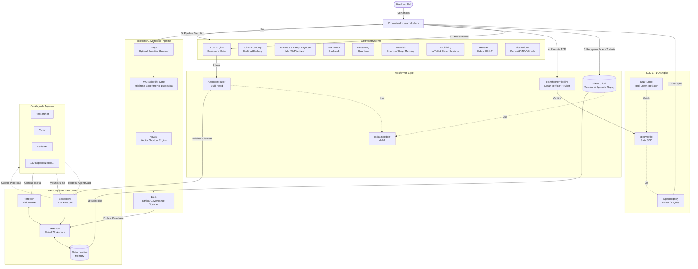

<div align="center">

# 🌌 OpenCode Ecosystem Core
**O "Cérebro" Multiagente que Transforma Ideias em Software, Pesquisa e Arte**

[](LICENSE)
[](https://www.python.org/)
[]()
[](CHANGELOG.md)
[](tests/)

*Uma arquitetura cognitiva completa que une 134 agentes especializados, Pipeline Científico com Governança (OQS + VSEE + EGS), Teoria dos Jogos, Raciocínio Quântico e Publicação Científica Automatizada.*

---

### ☕ Apoie este Projeto!
Se o OpenCode Ecosystem ajudou você a acelerar sua pesquisa, desenvolver software ou automatizar sua vida, considere me pagar um café! Seu apoio mantém o ecossistema evoluindo.

<a href="https://buymeacoffee.com/geomaker" target="_blank">
  
</a>


</div>

---

## 🚀 O que é o OpenCode Ecosystem?

### 👨‍💻 Para Leigos: A Empresa de Especialistas na sua Máquina
Imagine que você tem uma empresa inteira de tecnologia e pesquisa científica trabalhando para você, 24 horas por dia, dentro do seu computador. 
- Você tem um **Pesquisador** que lê milhares de artigos na internet e faz resumos.
- Você tem um **Programador** que escreve código e testa tudo.
- Você tem um **Revisor** (um chefe chato) que não deixa o programador entregar código com erro.
- E você tem um **Diretor de Arte** que desenha capas de livros e cria ilustrações didáticas.

Você só precisa dar a ordem: *"Quero um aplicativo que faça X"* ou *"Quero um livro sobre o tema Y"*. O "Cérebro" (nosso Orquestrador) chama os funcionários certos, dá o orçamento (Token Economy), exige qualidade (Trust Engine) e te entrega o produto final pronto.

### 🔬 Para PhDs e Engenheiros: Arquitetura Cognitiva Multiagente
O OpenCode Ecosystem Core é uma implementação *state-of-the-art* de sistemas multiagentes (MAS) inspirada em arquiteturas de redes neurais (Transformers) e neurociência cognitiva (Global Workspace Theory).
- **Roteamento por Atenção:** Não usamos *if/else* para delegar tarefas. Usamos *Multi-Head Attention* para calcular scores de semântica, capacidade e confiança (Trust Ledger) de 134 agentes.
- **MiroFish & Game Theory:** Agentes debatem soluções usando estratégias iteradas (Tit-for-Tat, Nash Equilibrium) e constroem Grafos de Conhecimento lógicos.
- **Pipeline Científico (MASWOS):** Automação completa de revisão sistemática de literatura. Baixa PDFs (Sci-Hub/OpenAlex), converte para Markdown, extrai figuras reais, gera fichamentos (ABNT/APA) e compila o manuscrito em LaTeX (com PDF, DOCX e ODT para Amazon KDP).
- **🆕 Scientific Governance Pipeline (v1.0.2):** Fluxo científico com governança ética ponta a ponta: `OQS → MCI Scientific Core → VSEE → EGS`. O sistema formula hipóteses falsificáveis, projeta experimentos, valida resultados estatisticamente, executa revisão adversarial e impõe conformidade ética antes de qualquer saída.
- **Metacognição Profunda:** O sistema possui 5 Scanners de diagnóstico (incluindo Engenharia Reversa de código legado) e um Gerador de Sucessores que prevê o próximo salto tecnológico do seu projeto.

---

## ⚡ Instalação: 1-Click no Windows

Se você usa Windows 10/11, nós criamos um instalador mágico que configura **tudo** para você (WSL2, Ubuntu, Ollama, Antigravity CLI e o Ecossistema).

1. Abra o **PowerShell como Administrador**.
2. Cole este comando e aperte Enter:
```powershell
Set-ExecutionPolicy Bypass -Scope Process -Force; irm https://raw.githubusercontent.com/MarceloClaro/opencode-ecosystem-core/main/installer/windows/Install-OpenCodeEcosystem.ps1 | iex
```
3. **Pronto!** Ele criará atalhos na sua Área de Trabalho. Basta clicar em "OpenCode Ecosystem" e começar a usar.

*(Para Linux/macOS, veja o [Guia Manual](ARCHITECTURE.md))*

---

## 🏗️ Arquitetura do Sistema

O ecossistema é dividido em **5 grandes camadas interconectadas**:

1. **Camada Metacognitiva (MCI):** O barramento de eventos (Global Workspace) onde os agentes compartilham memória episódica, confiança calibrada e reflexões pós-execução.
2. **🆕 Scientific Governance Pipeline:** Fluxo obrigatório de rigor científico e governança ética: `OQS → Scientific Core → VSEE → EGS → Final Report`.
3. **Camada Transformer:** O roteador de atenção que delega tarefas e o pipeline iterativo de *Reflexion* (Gerar → Verificar → Revisar).
4. **Módulos Avançados:** Token Economy (Staking/Slashing), Trust Engine (Behavioral Gates), SDD/TDD e Diagnóstico Profundo.
5. **Catálogo de Agentes:** 134 agentes especializados em domínios que vão desde Física Quântica até Design de Capas.

### Comparativo de Maturidade Técnica

O **OpenCode Ecosystem Core** foi projetado para superar as limitações de roteamento estático e a falta de rigor acadêmico presentes nos frameworks multiagentes tradicionais.

| Critério de Maturidade | OpenCode Ecosystem Core | LangGraph | CrewAI | OpenDevin (OpenHands) | Microsoft AutoGen | MetaGPT |
| :--- | :--- | :--- | :--- | :--- | :--- | :--- |
| **Arquitetura de Roteamento** | ⭐⭐⭐⭐⭐<br>**Atenção Multi-Cabeça (Transformer)**. Roteamento dinâmico (Semântica, Capacidade, Confiança). | ⭐⭐⭐⭐<br>Grafos direcionados cíclicos (DAG) e StateMachines. | ⭐⭐⭐<br>Roteamento baseado em papéis (Role-based) e tarefas em série/paralelo. | ⭐⭐⭐<br>Foco em um único agente autônomo controlando sandbox/ferramentas. | ⭐⭐⭐<br>Conversacional / Grafos de transição estáticos. | ⭐⭐<br>Sequencial (SOP). Cascata rígida. |
| **Metacognição e Memória** | ⭐⭐⭐⭐⭐<br>**Hierarchical Memory (HTM)**, *Episodic Replay* e Reflexion via Global Workspace. | ⭐⭐⭐⭐<br>Memória de estado persistente em grafos, checkpointer nativo. | ⭐⭐⭐<br>Memória de curto/longo prazo e memória de entidade via embeddings. | ⭐⭐⭐<br>Memória episódica de comandos de terminal e histórico de arquivos. | ⭐⭐<br>Memória de conversação (Chat History). | ⭐⭐<br>Memória baseada em documentos compartilhados (PRD). |
| **Garantia de Qualidade (QA)** | ⭐⭐⭐⭐⭐<br>**Gate SDD Estrito + TDD Runner**. Ciclo Red-Green-Refactor obrigatório antes da entrega. | ⭐⭐⭐<br>Fluxos condicionais (Human-in-the-loop) para aprovação. | ⭐⭐<br>Delegação entre agentes, mas sem enforcement de TDD. | ⭐⭐⭐⭐<br>Execução em sandbox Docker, valida testes em tempo real. | ⭐⭐<br>Execução de código em sandbox, sem enforcement nativo de TDD. | ⭐⭐<br>Agente QA executa testes gerados em fluxo linear. |
| **Economia e Segurança** | ⭐⭐⭐⭐⭐<br>**Token Economy (Staking/Slashing)** + Trust Engine (Behavioral Gate). | ⭐⭐<br>Inexistente nativamente. | ⭐⭐<br>Inexistente nativamente. | ⭐⭐⭐<br>Controle de permissões Docker, mas sem economia de tokens. | ⭐<br>Inexistente nativamente. | ⭐<br>Inexistente nativamente. |
| **Produção Científica** | ⭐⭐⭐⭐⭐<br>**Pipeline Qualis A1 (MASWOS)**. Fichamentos ABNT, PDF→MD, LaTeX modular. | ⭐⭐<br>Pode ser programado para tal, mas não é nativo. | ⭐⭐<br>Pode ser programado para tal, mas não é nativo. | ⭐<br>Foco exclusivo em Engenharia de Software. | ⭐<br>Não possui ferramentas acadêmicas nativas. | ⭐<br>Foco exclusivo em Engenharia de Software. |
| **🆕 Governança Científica** | ⭐⭐⭐⭐⭐<br>**OQS + VSEE + EGS nativos**. Hipóteses falsificáveis, validação estatística, hard-blocks éticos. | ⭐<br>Inexistente nativamente. | ⭐<br>Inexistente nativamente. | ⭐<br>Inexistente nativamente. | ⭐<br>Inexistente nativamente. | ⭐<br>Inexistente nativamente. |
| **Inteligência de Enxame** | ⭐⭐⭐⭐⭐<br>**MiroFish Swarm** com GraphMemory (consenso via Teoria dos Jogos). | ⭐⭐⭐<br>Suporta Multi-Agent via grafos (Multi-actor). | ⭐⭐⭐⭐<br>Forte em colaboração de equipes (Crews) com delegação de tarefas. | ⭐<br>Agente único ou par programador, não é swarm. | ⭐⭐⭐<br>GroupChat (debate não estruturado matematicamente). | ⭐<br>Inexistente. |
| **Diagnóstico Profundo** | ⭐⭐⭐⭐⭐<br>**Deep Diagnose (M1-M5)**. Engenharia reversa e gerador de sucessores. | ⭐⭐<br>Depende de nós customizados no grafo. | ⭐⭐<br>Inexistente nativamente. | ⭐⭐⭐<br>Analisa logs de erro do terminal para se auto-corrigir. | ⭐<br>Inexistente nativamente. | ⭐<br>Inexistente nativamente. |

> **Fontes para Auditoria:**
> [1] **OpenCode Ecosystem Core**: Arquitetura baseada no artigo *Attention Is All You Need* (Vaswani et al., 2017) e Global Workspace Theory.
> [2] **LangGraph**: [langchain-ai/langgraph](https://github.com/langchain-ai/langgraph) - Framework para agentes com estado, multiatores, construído com grafos.
> [3] **CrewAI**: [joaomdmoura/crewAI](https://github.com/joaomdmoura/crewAI) - Framework para orquestração de agentes autônomos baseados em papéis (Role-playing).
> [4] **OpenDevin (OpenHands)**: [All-Hands-AI/OpenHands](https://github.com/All-Hands-AI/OpenHands) - Agente de engenharia de software autônomo operando em sandbox.
> [5] **Microsoft AutoGen**: [microsoft/autogen](https://github.com/microsoft/autogen) - Foco em conversação multiagente e grafos de transição.
> [6] **MetaGPT**: [geekan/MetaGPT](https://github.com/geekan/MetaGPT) - Foco em Standard Operating Procedures (SOPs) simulando uma empresa de software.

---

### Fluxos de Produção: ResearchHub — Pipeline Unificado de Pesquisa Acadêmica (SPEC-017)

O **ResearchHub** orquestra o fluxo completo de revisão de literatura em uma **pasta única de produção científica**, garantindo rastreabilidade total (manifest com checksums SHA-256) e conformidade com as normas ABNT NBR 6023:2018, NBR 10520:2023 e APA 7ª edição. O fluxo segue a sequência: **buscar (multiplataforma) → ranquear por aderência ao tema → baixar PDFs → converter PDF→MD → fichar → resenhar → consolidar referências**.

```text
producao_cientifica/<tema>-<timestamp>/
└── pesquisa/
    ├── pdfs/               # PDFs baixados (scihub-cli / direct OA)
    ├── md/                 # PDFs convertidos em Markdown legível
    ├── fichamentos/        # Fichamentos ABNT (bibliográfico+citação+crítico)
    ├── resenhas/           # Resenhas críticas vinculadas ao tema
    ├── referencias_abnt.md # Referências ABNT NBR 6023:2018 (alfabética)
    ├── referencias_apa.md  # Referências APA 7ª edição
    ├── referencias.bib     # BibTeX para os templates LaTeX
    ├── repositorios.md     # Repositórios GitHub e datasets Kaggle
    └── RESEARCH_MANIFEST.json
```



```mermaid
flowchart LR
    A[🔍 Busca Multiplataforma<br>arXiv · OpenAlex · Crossref<br>GitHub · Kaggle] --> B[📊 Ranqueamento<br>por aderência ao tema<br>CriticalAnalyzer]
    B --> C[📥 Download de PDFs<br>scihub-cli / OA direto]
    C --> D[📄 Conversão PDF → MD<br>Pdf2Markdown]
    D --> E[🗂️ Fichamento ABNT<br>bibliográfico + citação + crítico]
    E --> F[✍️ Resenha Crítica<br>+ enriquecimento LLM<br>Ollama local / OpenAI]
    F --> G[📚 Referências Consolidadas<br>ABNT · APA 7 · BibTeX]
    G --> H[🖼️ Extração de Figuras<br>FigureHunter c/ fonte]
    H --> I[🕵️ OSINT LinkTree<br>análise das referências]
    I --> J[✅ RESEARCH_MANIFEST.json<br>checksums SHA-256 auditáveis]
```

Cada etapa é auditável: o `RESEARCH_MANIFEST.json` registra plataformas consultadas, relatório de downloads, normas aplicadas, provedor LLM utilizado (incluindo modelos locais via **Ollama**, com privacidade total) e o hash SHA-256 de cada arquivo gerado. Com `use_llm=True`, as resenhas são aprofundadas por LLM com prioridade para modelos locais (`llm_provider='auto'|'ollama'|'openai'`, `llm_model` ex.: `llama3.2`), e o pipeline permanece 100% determinístico quando nenhum provedor está disponível.

```python
from marceloclaro.orchestrator import Orchestrator

orch = Orchestrator()
manifest = orch.research(
    "beneficial quantum noise in variational classifiers",
    max_papers=8,
    use_llm=True,          # enriquecimento por LLM (opcional)
    llm_provider="ollama",  # prioriza modelo local — privacidade e custo zero
    llm_model="llama3.2",
)
print(manifest["folder"])   # pasta única de produção científica
```

---

## 🧬 Scientific Governance Pipeline (v1.0.2)

O pipeline científico com governança é a evolução mais significativa do ecossistema. Transforma o orquestrador de um simples executor de tarefas em um **sistema de raciocínio científico auditável**, capaz de formular hipóteses, validar evidências e bloquear decisões antiéticas de forma automatizada.

### Fluxo Completo

```text
Problema Bruto
    ↓
[OQS] Optimal Question Scanner
  ↳ mapeia lacunas, calcula CS = URS + SVS − DRI − CCI
  ↳ seleciona pergunta ótima de forma determinística
    ↓
[MCI Scientific Core]
  ↳ HypothesisEngine: gera H1 (alternativa) e H0 (nula)
  ↳ ExperimentDesigner: define amostragem, métricas, critérios de parada
  ↳ StatisticalValidator: calcula p-valor, effect size, IC e Bayes Factor
  ↳ AdversarialReviewer: o sistema tenta refutar a própria conclusão
  ↳ ConfidenceCalibrator: score de confiança calibrado (ECE/Brier)
  ↳ ScientificReporter: laudo final em LaTeX auditável
    ↓
[VSEE] Vector Shortcut Execution Engine
  ↳ avalia elegibilidade de atalho vetorial via policy gates
  ↳ executa rota vetorial OU original com fallback automático
  ↳ telemetria: EG, TRR, RI, EFS
    ↓
[EGS] Ethical Governance Scanner
  ↳ PrincipleEngine: carrega princípios (dignidade, transparência, não maleficência...)
  ↳ StressTest: submete saída a tensões éticas (discriminação, assimetria, manipulação)
  ↳ GovernanceAnalyzer: decide approve / approve_with_constraints / block
  ↳ hard-block: sobrescreve qualquer score se houver violação grave
    ↓
[Final Report] — LaTeX + Métricas + Auditoria via MetaBus
```

### Uso via Orquestrador

```python
from marceloclaro.orchestrator import MarceloClaroOrchestrator

orch = MarceloClaroOrchestrator()

# Pipeline científico completo com governança ética
result = orch.run_scientific_governance(
    problem_text="A intervenção X reduz erro médio em classificação?",
    context={
        "validated_shortcut": True,
        "p_value": 0.02,
        "effect_size": 0.45,
        "confidence_interval": [0.20, 0.60],
        "reproducibility_score": 0.92,
        "expected_behavior": {
            "egs_should_decide": "approve"
        }
    }
)

print(result["status"])                             # "success" | "blocked" | "failed"
print(result["oqs"]["selected_question"])           # Pergunta ótima selecionada
print(result["scientific_claim"]["final_verdict"])  # "supported" | "inconclusive" | "refuted"
print(result["scientific_claim"]["calibrated_confidence"])  # score 0.0–1.0
print(result["vsee"]["chosen_path"])                # "vector" | "original"
print(result["egs"]["decision"])                    # "approve" | "approve_with_constraints" | "block"
print(result["report_tex"])                         # Laudo completo em LaTeX
```

### Schemas JSON de Contratos (validados via `jsonschema`)

| Schema | Propósito |
|---|---|
| `schemas/scientific_claim.schema.json` | Laudo científico: hipótese, p-valor, IC, efeito, veredicto |
| `schemas/optimal_question.schema.json` | Pergunta ótima: scores URS, SVS, DRI, CCI, CS |
| `schemas/vector_execution_decision.schema.json` | Decisão de rota vetorial: telemetria EG, TRR, RI, EFS |
| `schemas/ethical_assessment.schema.json` | Avaliação ética: alinhamento, tensões, decisão, hard-block |

### Execução em Lote de Experimentos

```bash
# Executa a matriz de cenários (OQS + MCI + VSEE + EGS) em lote
python3 research/pipelines/run_research_batch.py \
  --matrix research/experiments/scenario_matrix_v1.json \
  --results research/results \
  --max-scenarios 20 \
  --repetitions 2
```

O resultado gera relatórios JSONL (raw), JSON agregado e Markdown auditável em `research/results/`.

---

### Mapa Geral da Arquitetura



### Detalhamento Técnico das Camadas

#### 1. Metacognitive Interconnect (MCI)
A espinha dorsal do ecossistema. Baseada na **Global Workspace Theory**, o `MetaBus` atua como um quadro negro onde todos os agentes publicam e leem eventos. O protocolo **A2A (Agent-to-Agent)** permite que agentes descubram as capacidades uns dos outros dinamicamente, sem *hardcoding*. O *Reflexion Middleware* garante que toda tarefa concluída gere uma lição aprendida e atualize o `confidence_ledger` global.

#### 🆕 2. Scientific Governance Pipeline (v1.0.2)
A nova camada que eleva o ecossistema ao padrão de raciocínio científico.
- **OQS (Optimal Question Scanner):** Mapeia lacunas conceituais, gera candidatos de perguntas e ranqueia pelo Convergence Score ($CS = URS + SVS - DRI - CCI$) para seleção determinística da pergunta que mais reduz incerteza.
- **MCI Scientific Core:** Motor completo de método científico: `HypothesisEngine → ExperimentDesigner → StatisticalValidator → AdversarialReviewer → ConfidenceCalibrator → ScientificReporter`. Cada ciclo termina em um laudo LaTeX auditável.
- **VSEE (Vector Shortcut Execution Engine):** Detecta atalhos vetoriais validados e os executa quando todos os *policy gates* passam (risco, fidelidade, ganho). Fallback automático para execução original. Telemetria: EG, TRR, RI, EFS.
- **EGS (Ethical Governance Scanner):** Integrado ao TDD. Roda *stress tests* éticos nas saídas, calcula *alignment score* e aplica **hard-block** irreversível em casos de violação de dignidade humana, discriminação ou ausência de supervisão em domínio crítico.

#### 3. Transformer Layer
Inspirada na arquitetura de Vaswani (2017) e nos modelos da DeepMind.
- **TaskEmbedder:** Vetoriza tarefas e capacidades usando *feature hashing* determinístico.
- **AttentionRouter:** Substitui o roteamento estático por **Multi-Head Attention**. Calcula scores softmax usando 4 cabeças: Semântica, Capacidade, Confiança e Carga.
- **HierarchicalMemory:** Recuperação de memória em dois níveis (HTM) com *Episodic Replay* para treinamento offline.

#### 4. Core Subsystems (Módulos Avançados)
- **Trust Engine & Token Economy:** Agentes fazem *stake* de tokens para assumir tarefas. Se falharem no TDD, sofrem *slashing*. O *Behavioral Gate* barra agentes com histórico de alucinação.
- **Deep Diagnose:** 5 Scanners (Noológico, Teleológico, Evolutivo, etc.) que fazem engenharia reversa de código, priorização epistemológica e geram "Sucessores Plausíveis" para o seu projeto.
- **MiroFish & Game Theory:** Um enxame preditivo que debate usando o método Delphi e constrói um **Grafo de Conhecimento** em memória para extrair consensos matemáticos.
- **Publishing & Research:** Automação Qualis A1. Busca artigos (Sci-Hub/OpenAlex), converte PDF para Markdown, faz fichamentos ABNT/APA, gera ilustrações didáticas (MIRA) e compila livros inteiros em LaTeX com capas geradas por IA.

---

## ⚖️ Vantagens e Limitações (Transparência)

| ✅ Vantagens (Por que usar?) | ⚠️ Limitações (O que ainda estamos melhorando) |
|---|---|
| **Autonomia Real:** O sistema não apenas gera código, ele testa (TDD), revisa as próprias falhas e tenta de novo. | **Custo Computacional:** Rodar múltiplos agentes debatendo via LLM consome muitos tokens (recomendamos Ollama local para baratear). |
| **Rigor Acadêmico:** Único framework que gera citações ABNT/APA corretas e extrai figuras com metadados reais. | **Velocidade:** A metacognição (pensar sobre o pensar) exige tempo. Um artigo complexo pode levar minutos/horas para ser gerado. |
| **Design Automático:** Estuda paletas de cores e gera capas e ilustrações didáticas (MIRA) sozinho. | **Dependência de APIs:** O download de PDFs depende da estabilidade do Sci-Hub e OpenAlex. |
| **Segurança:** O Trust Engine pune agentes que "alucinam", reduzindo a taxa de erros a longo prazo. | **Setup Inicial Manual:** Fora do Windows, exige familiaridade com terminal e Python. |

---

## 🌍 Potencial de Aplicação e Escalabilidade

O OpenCode Ecosystem não é apenas um script de terminal, é um **Motor de P&D (Pesquisa e Desenvolvimento)** escalável.

- **Fábrica de Software Autônoma:** Pode ser acoplado a um repositório GitHub via CI/CD. Quando um *Issue* é aberto, o ecossistema lê, faz engenharia reversa, cria os testes (TDD), escreve o código e abre um *Pull Request*.
- **Universidade Sintética:** Pesquisadores podem usar o sistema para processar 500 artigos do PubMed em uma noite, extraindo apenas os consensos lógicos (via MiroFish Graph Memory) para acelerar a descoberta de novos medicamentos.
- **Editora Automatizada (KDP):** Escritores podem gerar rascunhos, solicitar ilustrações internas didáticas, diagramação LaTeX e exportação direta para a Amazon Kindle Direct Publishing.
- **Escalabilidade Horizontal:** Como usamos a arquitetura *Blackboard* e o protocolo A2A, você pode plugar este ecossistema em clusters Kubernetes, distribuindo os 134 agentes em diferentes nós de processamento.

---

## 📁 Estrutura do Repositório

```text
opencode-ecosystem-core/
├── marceloclaro/          # Orquestrador supremo MarceloClaroOrchestrator
├── mci/                   # Metacognitive Interconnect — barramento central
│   ├── oqs/               # 🆕 Optimal Question Scanner
│   ├── vsee/              # 🆕 Vector Shortcut Execution Engine
│   ├── egs/               # 🆕 Ethical Governance Scanner
│   ├── pipeline/          # 🆕 Pipeline unificado OQS+MCI+VSEE+EGS
│   ├── orchestration.py   # 🆕 Ciclo científico completo
│   ├── hypothesis_engine.py
│   ├── statistical_validator.py
│   ├── adversarial_reviewer.py
│   ├── confidence_calibrator.py
│   ├── scientific_reporter.py
│   ├── blackboard.py      # Protocolo A2A (Agent Cards)
│   ├── metabus.py         # Global Workspace (pub/sub + persistência)
│   └── reflexion.py       # Reflexion middleware
├── schemas/               # 🆕 Schemas JSON de contratos científicos
├── transformer/           # AttentionRouter, TransformerPipeline, HTM
├── agents/                # 134 agentes especializados (Agent Cards)
├── research/
│   ├── experiments/       # 🆕 Matrizes de cenários de pesquisa
│   └── pipelines/         # 🆕 Executores de lote integrados
├── sdd/                   # SpecRegistry, SpecVerifier, TDDRunner
├── trust/                 # Trust Engine + Behavioral Gate
├── economy/               # Token Economy (Staking, Slashing, Fee Market)
├── scanners/              # Deep Diagnose M1-M5 + Prioritizer
├── academic/              # MASWOS Pipeline Qualis A1
├── publishing/            # LaTeX, PDF, DOCX, ODT, Cover Designer
├── illustrations/         # Mermaid, MIRA, Graphify
├── gametheory/            # 38 estratégias + Nash, Shapley, Tit-for-Tat
├── mirofish/              # CrossValidator Swarm + GraphMemory
├── reasoning/             # Z3, SymPy, Kanren, Critical + Quantum
├── webapp/                # Interface Streamlit (6 abas)
├── tests/                 # 152 testes automatizados (100% passando)
└── CHANGELOG.md
```

---

## 🧪 Executar os Testes

```bash
# Todos os 152 testes do ecossistema
python3 -m pytest tests/ -v

# Apenas o pipeline científico
python3 -m pytest tests/test_scientific_governance_pipeline.py -v

# Apenas o runner de lote
python3 -m pytest tests/test_run_research_batch.py -v
```

---
<div align="center">
  <i>Construído com rigor metodológico, inspirado pela Teoria dos Jogos e desenhado para o futuro.</i><br>
  <b>v1.0.2 — Scientific Governance Pipeline | Apoie o projeto: <a href="https://buymeacoffee.com/geomaker">buymeacoffee.com/geomaker</a></b>
</div>
