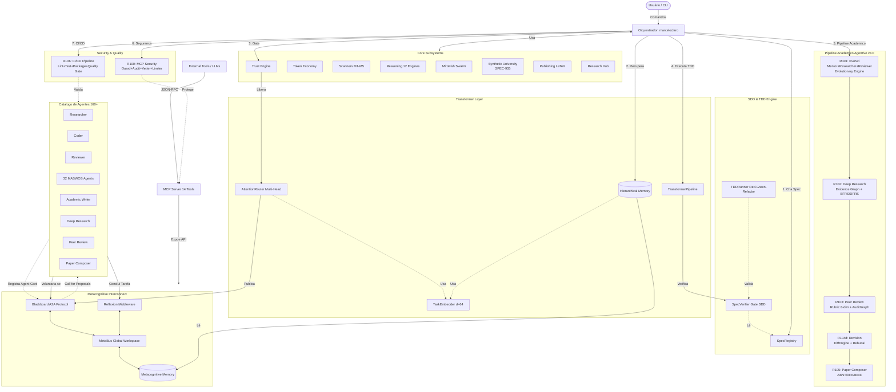

<div align="center">

# OpenCode Ecosystem Core
**Arquitetura Cognitiva Multiagente — Pipeline Científico Integral + CI/CD**

[](LICENSE)
[](https://www.python.org/)
[]()
[](CHANGELOG.md)
[](tests/)
[](evolution/cycles.json)
[](synthetic_university/mcp_server.py)
[](synthetic_university/api_gateway.py)
[](agents/catalog/)
[](.github/workflows/ci.yml)

*Uma arquitetura cognitiva completa que integra 160+ agentes especializados, Pipeline Científico Agentivo (EvoSci + Deep Research + Peer Review + Revision + Paper Composer), Scientific RAG adaptativo, Evolutionary Memory, MCP Security, GitHub Actions CI/CD e a Universidade Sintética Transversal com 64 ciclos de evolução contínua.*

</div>

---

##  O que é o OpenCode Ecosystem?

### Para Leigos: A Universidade de Pesquisadores na sua Máquina
Imagine que você tem uma universidade inteira de pesquisa científica trabalhando 24h/dia dentro do seu computador:
- **Pesquisador-Chefe (EvoSci):** Gera hipóteses, decompõe problemas, coordena descobertas
- **Deep Researcher:** Explora milhares de artigos, constrói grafos de evidência, sintetiza conhecimento
- **Revisor (Peer Review):** Avalia com rubricas multi-dimensionais, detecta fraudes, audita evidências
- **Editor (Paper Composer):** Organiza, escreve e formata artigos completos em ABNT/APA/IEEE
- **Revisor de Manuscrito (Revision Agent):** Aplica correções, gera cartas de rebuttal, gerencia diffs

Você dá uma ordem como *"Pesquise o impacto de ética quântica em IA"* e o ecossistema orquestra dezenas de agentes especializados, testa rigorosamente (TDD), audita a qualidade (SDD gates) e entrega um artigo completo com revisão por pares embutida.

### Para PhDs e Engenheiros: Ecossistema Multiagente com Pipeline Científico Fechado
O OpenCode Ecosystem Core é uma implementação modular de sistemas multiagentes (MAS) com **metacognição, governança científica, pipeline acadêmico fechado e infraestrutura de qualidade profissional**.

**Diferenciais arquiteturais:**
- **Pipeline Científico Fechado (R101→R105):** Do problema à entrega do artigo — EvoSci (descoberta) → Deep Research (evidência) → Peer Review (avaliação) → Revision (correção) → Paper Composer (publicação)
- **Evolutionary Memory (R97):** Memória persistente de ideias, experimentos, estagnação e reflexão periódica
- **Evidence Graph (R102):** Grafo epistemológico de entidades, relações e evidências com proveniência
- **MCP Security (R100):** Guard model, audit trail, vetting de comandos e rate limiting
- **CI/CD Quality Gates (R106):** GitHub Actions com lint, matrix test e package build

---

##  Instalação: 1-Click no Windows

Se você usa Windows 10/11, o instalador configura WSL2, Ubuntu, Ollama e o ecossistema:

```powershell
Set-ExecutionPolicy Bypass -Scope Process -Force; irm https://raw.githubusercontent.com/MarceloClaro/opencode-ecosystem-core/main/installer/windows/Install-OpenCodeEcosystem.ps1 | iex
```

*(Para Linux/macOS, veja o [Guia Manual](ARCHITECTURE.md))*

---

##  Arquitetura do Sistema (v3.0)

O ecossistema é organizado em **6 camadas interconectadas**:

### 1. Camada Metacognitiva (MCI)
Barramento de eventos (Global Workspace) onde agentes compartilham memória, confiança calibrada e reflexões pós-execução. Inclui MetaBus (pub/sub), Blackboard (protocolo A2A), memória hierárquica e Reflexion middleware.

### 2. Pipeline Acadêmico Agentivo (NOVO v3.0)
Pipeline fechado de 5 estágios que transforma um problema em artigo publicado:

```
[Problema]
    ↓
┌─ R101: AGENTIC SCIENCE V2 (EvoSci) ─────────────────┐
│ MentorAgent → PrimeResearcherAgent → ReviewerAgent  │
│ → EvolutionManagerAgent → Evolutionary Engine       │
│ (Selection → Crossover → Mutation → Inheritance)    │
└──────────────────────────────────────────────────────┘
    ↓
┌─ R102: DEEP RESEARCH AGENT ─────────────────────────┐
│ EvidenceGraph (Entity/Relation/Evidence)             │
│ BFRSAgent (exploração larga)                         │
│ DFRSAgent (cadeias multi-hop)                        │
│ OrchestratorAgent (planejamento + gate + síntese)    │
└──────────────────────────────────────────────────────┘
    ↓
┌─ R103: AGENTIC PEER REVIEW ─────────────────────────┐
│ RubricEngine (8 meta-dimensões)                      │
│ ReviewLedger (claim-evidence-risk)                   │
│ AuditGraph (integrado R102)                          │
│ MultiCriticReviewer (4 especialistas)                │
└──────────────────────────────────────────────────────┘
    ↓
┌─ R104d: AGENTIC MANUSCRIPT REVISION ────────────────┐
│ ReviewAnalyzer → SectionMapper → ProposalGenerator   │
│ DiffEngine (com rollback) → RebuttalLetter           │
└──────────────────────────────────────────────────────┘
    ↓
┌─ R105: AGENTIC PAPER COMPOSER ──────────────────────┐
│ StructurePlanner (ABNT/APA/IEEE)                     │
│ SectionWriter (6 seções)                             │
│ CitationFormatter (3 estilos)                        │
│ CrossConsistencyVerifier (5 verificações)            │
└──────────────────────────────────────────────────────┘
    ↓
[Artigo Completo + MCP Tools + Skills Exportáveis]
```

Cada estágio possui **spec formal (SDD)**, **testes TDD**, **gate de qualidade** e **registro no EvolutionRegistry**.

### 3. Motor Científico com Governance (v2.x legado)
Pipeline científico com governança ética: `OQS → HypothesisEngine → ExperimentDesigner → StatisticalValidator → AdversarialReviewer → ConfidenceCalibrator → VSEE → EGS → EvidenceGraph`. Inclui Scientific RAG com grounding, citações auditáveis e abstenção.

### 4. Camada Transformer
Roteador de atenção (Multi-Head Attention com 4 cabeças: semântica, capacidade, confiança, carga), pipeline iterativo Gerar→Verificar→Revisar e memória hierárquica com Episodic Replay.

### 5. Módulos Avançados
- **Token Economy:** Staking/slashing para agentes
- **Trust Engine:** Behavioral gates com confidence ledger
- **SDD/TDD:** SpecRegistry, SpecVerifier, TDDRunner
- **MCP Security (R100):** MCPGuard, AuditLogger, ToolVetter, RateLimiter
- **CI/CD (R106):** GitHub Actions, quality report, coverage gate

### 6. Catálogo de Agentes
160+ agentes especializados: Researcher, Coder, Reviewer, Academic Writer, 32 agentes MASWOS, Deep Research, Peer Review, Revision, Paper Composer, e especialistas jurídicos, de design e quânticos.

### Diagrama de Arquitetura



---

##  Pipeline Acadêmico Agentivo (R101–R105)

### R101: Agentic Science V2 / EvoSci
Framework bio-inspirado multiagente para descoberta científica autônoma baseado em EvoSci (ACL 2026), EvoScientist (arXiv 2026) e EurekAgent (arXiv 2026).

```python
from agentic_science_v2.orchestrator import AgenticScienceV2

agentic_science = AgenticScienceV2()
result = agentic_science.run(seed_domain="quantum ethics in AI", max_rounds=5)
print(result["best_solution"]["content"])      # Melhor hipotese/claim
print(result["evolutionary_trajectory"])        # Trajetoria completa
print(result["convergence_analysis"])           # Analise de convergencia
```

**67 testes TDD** | Score evolutivo: 9.7/10

### R102: Deep Research Agent
Sistema hierárquico de pesquisa profunda com Evidence Graph, busca em largura (BFRS) e profundidade (DFRS), e síntese multi-fontes. Inspirado em DeepEvidence (Nature MI 2026).

```python
from agentic_science_v2.deep_research import OrchestratorAgent

orchestrator = OrchestratorAgent()
report = orchestrator.run(
    question="What is the relationship between quantum coherence and ethical AI?",
    max_depth=3
)
print(report["answer"])                   # Resposta sintetizada
print(report["evidence_subgraph"])         # Subgrafo de evidencias
print(report["sufficiency_gate"])          # Gate de suficiencia
```

**48 testes TDD** | Score: 9.6/10

### R103: Agentic Peer Review
Revisão por pares agentiva com rubrica de 8 dimensões, ledger de claim-evidence-risk, grafo de auditoria integrado ao R102, e 4 críticos especialistas (Methodology, Results, Literature, Ethics). Inspirado em REVIEWGROUNDER (ACL 2026) e DeepReviewer 2.0 (arXiv 2026).

```python
from agentic_science_v2.review_agent import OrchestratorReviewer

reviewer = OrchestratorReviewer()
review = reviewer.run(
    title="Quantum Ethics: A Framework for Moral AI",
    abstract="...",
    sections={"introduction": "...", "methods": "...", ...}
)
print(review["meta_review"])              # Revisao consolidada
print(review["scores"])                   # Scores por dimensao
print(review["repair_plan"])              # Plano de correcoes priorizado
```

**44 testes TDD** | Score: 9.6/10

### R104d: Agentic Manuscript Revision
Sistema agentivo de revisão de manuscritos pós-peer-review. Analisa a revisão recebida (R103), mapeia claims para seções, gera propostas de correção e aplica diffs controlados com rollback. Gera carta de rebuttal ponto-a-ponto automaticamente.

```python
from agentic_science_v2.revision_agent import OrchestratorRevision

revision = OrchestratorRevision()
result = revision.run(review_package=review, manuscript=my_manuscript)
print(result["revised_manuscript"])        # Manuscrito revisado
print(result["rebuttal_letter"])           # Carta de rebuttal
print(result["diff_stats"])               # Estatisticas do diff
```

**28 testes TDD** | Score: 9.6/10

### R105: Agentic Paper Composer
Sistema agentivo de composição de manuscritos acadêmicos. Planeja estrutura por venue (ABNT, APA, IEEE), escreve 6 seções (abstract, intro, methods, results, discussion, conclusion), formata citações em 3 estilos, verifica consistência cruzada e exporta.

```python
from agentic_science_v2.paper_composer import OrchestratorComposer

composer = OrchestratorComposer()
paper = composer.run(
    title="Quantum Ethics in AI",
    sections_content={...},
    venue="abnt",              # abnt | apa | ieee
    citations=[...]
)
print(paper["full_text"])                 # Texto completo formatado
print(paper["citations_formatted"])       # Referencias formatadas
print(paper["consistency_report"])        # Relatorio de consistencia
```

**30 testes TDD** | Score: 9.5/10

---

##  Evolutionary Memory (R97)

Memória persistente para o pipeline de descoberta contínua. Quatro componentes:

| Componente | Função |
|---|---|
| `IdeationMemory` | Registra direções de pesquisa, scores e estratégias |
| `ExperimentationMemory` | Armazena outcomes de experimentos, recursos gastos |
| `HeartbeatReflection` | Reflexão periódica a cada N ciclos |
| `StagnationDetector` | Detecta platôs de score e sugere pivot |

```python
from synthetic_university.evolutionary_memory import EvolutionaryMemorySubstrate

memory = EvolutionaryMemorySubstrate()
memory.record_ideation(direction="Quantum Ethics", score=0.85, strategy="explore")
memory.record_experiment(direction="Quantum Ethics", outcome="promising", resources=0.7)
reflection = memory.reflect()
print(reflection["stagnation_status"])  # "stable" | "plateau_detected"
```

**42 testes TDD** | Score: 9.5/10

---

##  MCP Security (R100)

Camada de segurança para o servidor MCP com quatro componentes:

| Componente | Função |
|---|---|
| `MCPGuard` | Valida argumentos contra JSON Schema + wrap de handlers |
| `AuditLogger` | Registro estruturado com timestamp, ferramenta, args, duração |
| `ToolVetter` | Detecção de prompt injection (11 patterns), command injection, path traversal, SQLi |
| `RateLimiter` | Token bucket por caller com configuração de max_calls/window |

**23 testes TDD** | Score: 9.5/10

---

##  CI/CD Pipeline & Quality Gates (R106)

Infraestrutura de qualidade profissional com GitHub Actions:

### GitHub Actions (`.github/workflows/ci.yml`)
3 jobs em pipeline:
1. **Lint** — Ruff check + format check (Python 3.12)
2. **Test** — Matrix Python 3.10–3.14, pytest full suite, quality report
3. **Package** — Build & verify imports de 3 pacotes pip

### Scripts de Qualidade
- **`scripts/quality_report.py`** — Relatório consolidado com score 0–10, análise de cobertura por módulo, lint e recomendações
- **`scripts/check_coverage.py`** — Quality gate: verifica testes passando, cobertura estimada ≥ 80%, lint ok
- **`scripts/run_full_suite.sh`** — Script bash orquestrador com modo `--ci` e `--json`

```bash
# Executar suite completa localmente
./scripts/run_full_suite.sh

# Modo CI (para no primeiro erro)
./scripts/run_full_suite.sh --ci

# Apenas quality report rapido
python3 scripts/quality_report.py --quick
```

**18 testes TDD** | Score: 9.2/10

---

##  Integration Skills & Pip Packages (R104)

### Skills Exportáveis
4 skills no formato SKILL.md + skill.py para uso em outros ecossistemas:

| Skill | Comandos |
|---|---|
| `skills/evo-science/` | `evol` — ciclo evolutivo, `evol_agent` — agente específico |
| `skills/deep-research/` | `deep` — pesquisa profunda, `evidence` — grafo de evidência |
| `skills/peer-review-v2/` | `review` — revisão agentiva, `meta` — meta-revisão |
| `skills/mcp-security/` | `guard` — validar argumento, `audit` — log de auditoria |

### Pacotes Pip
3 pacotes instaláveis para integração em outros projetos:

```bash
pip install packages/opencode-evosci/
pip install packages/opencode-deep-research/
pip install packages/opencode-peer-review/
```

```python
from opencode_evosci import run_evosci_cycle
from opencode_deep_research import run_deep_research
from opencode_peer_review import run_peer_review_v2
```

---

##  MCP Server & API Gateway

### MCP Server (14 ferramentas)
`/synthetic_university/mcp_server.py` — Servidor MCP via stdio JSON-RPC:

| Ferramenta | Função | Ciclo |
|---|---|---|
| `su_generate` | Gera pares de conceitos | R94 |
| `su_evaluate` | Avalia tese interdisciplinar | R94 |
| `su_enrich` | Enriquece tese com busca web | R89/R94 |
| `su_visual_abstract` | Gera abstract visual SVG | R90/R94 |
| `su_peer_review` | Revisão cega multi-LLM | R91/R94 |
| `su_submission` | Pacote de submissão Qualis A1 | R92/R94 |
| `su_novelty` | Análise de novidade clássica | R93/R94 |
| `su_novelty_v2` | Análise V2 com contribution points | R98/R99a |
| `su_dashboard` | Dashboard HTML interativo | R94 |
| `su_agentic_science` | Ciclo EvoSci completo | R101 |
| `su_deep_research` | Pesquisa profunda multi-fontes | R102 |
| `su_peer_review_v2` | Revisão agentiva com auditagem | R103 |
| `su_manuscript_revision` | Revisão de manuscrito com diff | R104d |
| `su_paper_composer` | Composição de paper ABNT/APA/IEEE | R105 |

### API Gateway (FastAPI)
`/synthetic_university/api_gateway.py` — Gateway REST com 12+ endpoints HTTP.

---

##  Scientific RAG Evolved (R99)

O módulo `rag/evolved.py` implementa um sistema RAG científico adaptativo:

| Componente | Função |
|---|---|
| `AdaptiveRetriever` | Análise de complexidade da query, 3 estratégias de retrieval |
| `CitationGraph` | Grafo direcionado de citações com BFS até max_depth |
| `OutlineSynthesizer` | Geração de outline com templates temáticos |
| `RAGEvolved` | Roteamento automático (simple vs. structured) |

```python
from rag.evolved import RAGEvolved

rag = RAGEvolved()
answer = rag.answer("Explain the relationship between quantum decoherence and ethical AI frameworks")
print(answer["strategy_used"])         # "simple" | "structured"
print(answer["sections"])              # Secoes do outline (se structured)
print(answer["citations"])             # Citacoes do grafo
```

**25 testes TDD** | Score: 9.5/10

---

##  Universidade Sintética Transversal (SPEC-935)

Simulação de instituição acadêmica completa com:
- **11 faculdades** (Filosofia, Física, Biologia, Computação, Direito, Economia, Medicina, Engenharia, Artes, Educação, Psicologia)
- **40+ professores especialistas** sintéticos com h-index, faculdade e área de pesquisa
- **Motor combinatorial** testa 10.000+ combinações de conceitos interdisciplinares via MiroFish
- **10.000+ teses** geradas com ranqueamento por score empírico
- **Validação empírica calibrada** (R82) com convergência e endosso
- **Dashboard interativo** HTML com Chart.js (R87)
- **Abstracts visuais SVG** automáticos (R90)

```python
from synthetic_university.core import SyntheticUniversity

uni = SyntheticUniversity()
result = uni.run_discovery_cycle(n_pairs=5)
print(result["theses"][0])             # Melhor tese do ciclo
print(result["novelty_scores"])        # Scores de novidade
```

**Ciclos de evolução: 64** (R47–R106) | **1050 testes** | Score médio: 9.4/10

---

##  Comparative de Maturidade Técnica

| Critério | OpenCode v3.0 | LangGraph | CrewAI | AutoGen | MetaGPT |
|---|---|---|---|---|---|
| **Pipeline Científico Fechado** | ⭐⭐⭐⭐⭐ EvoSci→DeepRes→Review→Paper | ⭐⭐ | ⭐⭐ | ⭐ | ⭐ |
| **Roteamento por Atenção** | ⭐⭐⭐⭐⭐ Multi-Head (4 cabeças) | ⭐⭐⭐⭐ Grafos DAG | ⭐⭐⭐ Role-based | ⭐⭐⭐ Conversacional | ⭐⭐ Sequencial |
| **Metacognição e Memória** | ⭐⭐⭐⭐⭐ Evolution Memory + Reflexion | ⭐⭐⭐⭐ State checkpoint | ⭐⭐⭐ Short/Long term | ⭐⭐ Chat history | ⭐⭐ PRD-based |
| **Garantia de Qualidade TDD** | ⭐⭐⭐⭐⭐ SDD Gate + TDD + CI/CD | ⭐⭐⭐ Human-in-loop | ⭐⭐ Delegation only | ⭐⭐ Sandbox exec | ⭐⭐ QA agent |
| **Economia de Tokens** | ⭐⭐⭐⭐⭐ Staking/Slashing | ⭐⭐ | ⭐⭐ | ⭐ | ⭐ |
| **Segurança MCP** | ⭐⭐⭐⭐⭐ Guard+Audit+Vetter+Limiter | ⭐ | ⭐ | ⭐⭐ | ⭐ |
| **Produção Científica** | ⭐⭐⭐⭐⭐ ABNT/APA/IEEE + Revisão | ⭐⭐ | ⭐⭐ | ⭐ | ⭐ |
| **CI/CD Nativo** | ⭐⭐⭐⭐⭐ GitHub Actions + Quality Gates | ⭐ | ⭐ | ⭐ | ⭐ |

---

##  Estrutura do Repositório

```text
opencode-ecosystem-core/
├── agentic_science_v2/      # Pipeline academico agentivo (R101-R105)
│   ├── agents.py            # MentorAgent, PrimeResearcherAgent, ReviewerAgent, EvolutionManager
│   ├── evolutionary_engine.py # Selection → Crossover → Mutation → Inheritance
│   ├── environment.py       # Permissions, Artifacts, Budget, HITL
│   ├── evidence_graph.py    # Entity, Relation, Evidence, path-finding BFS
│   ├── deep_research.py     # KBRegistry, BFRS, DFRS, OrchestratorAgent
│   ├── review_agent.py      # RubricEngine, ReviewLedger, AuditGraph, MultiCritic
│   ├── revision_agent.py    # ReviewAnalyzer, SectionMapper, ProposalGenerator, DiffEngine
│   ├── paper_composer.py    # StructurePlanner, SectionWriter, CitationFormatter, CrossVerifier
│   └── orchestrator.py      # AgenticScienceV2 orchestrator
├── synthetic_university/    # SPEC-935 · 11 Faculdades · 64 ciclos
│   ├── mcp_server.py        # MCP Server · 14 ferramentas stdio
│   ├── api_gateway.py       # FastAPI REST · 12+ endpoints
│   ├── mcp_security.py      # MCPGuard, AuditLogger, ToolVetter, RateLimiter (R100)
│   ├── evolutionary_memory.py # IdeationMemory, ExperimentationMemory (R97)
│   ├── novelty_v2.py        # ContributionPointExtractor, PointwiseNoveltyScorer (R98)
│   └── ...                  # core, combinatorial_engine, empirical_validation, etc.
├── rag/
│   ├── evolved.py           # AdaptiveRetriever, CitationGraph, OutlineSynthesizer (R99)
│   └── scientific.py        # Scientific RAG classico (SPEC-919)
├── scripts/
│   ├── quality_report.py    # Score 0-10, cobertura, lint, recomendacoes
│   ├── check_coverage.py    # Quality gate com threshold 80%
│   └── run_full_suite.sh    # Suite completa bash
├── .github/workflows/
│   └── ci.yml               # GitHub Actions: lint, test (matrix), package
├── skills/                  # Skills exportaveis (R104a)
│   ├── evo-science/
│   ├── deep-research/
│   ├── peer-review-v2/
│   └── mcp-security/
├── packages/                # Pacotes pip (R104b)
│   ├── opencode-evosci/
│   ├── opencode-deep-research/
│   └── opencode-peer-review/
├── specs/                   # Especificacoes SDD (R97-R106)
├── evolution/               # Cycles registry (64 ciclos)
├── tests/                   # 1050 testes automatizados
├── mci/                     # Metacognitive Interconnect
├── marceloclaro/            # Orquestrador
├── agents/catalog/          # 160+ agent cards
├── sdd/                     # SpecRegistry, SpecVerifier, TDDRunner
├── trust/                   # Trust Engine
├── economy/                 # Token Economy
├── transformers/            # AttentionRouter, HierarchicalMemory
├── benchmarks/              # Benchmarks cientificos
├── publishing/              # LaTeX, KDP, Cover Designer
├── research/                # Research Hub
└── webapp/                  # Streamlit interface
```

---

##  Executar os Testes

```bash
# Suite completa (1050 testes)
python3 -m pytest tests/ -v

# Pipeline academico agentivo (R101-R105)
python3 -m pytest tests/test_r101_agentic_science_v2.py tests/test_r102_deep_research.py tests/test_r103_peer_review.py tests/test_r104d_agentic_revision.py tests/test_r105_paper_composer.py -v

# Evolutionary Memory + Novelty V2 + RAG Evolved (R97-R99)
python3 -m pytest tests/test_r97_evolutionary_memory.py tests/test_r98_novelty_v2.py tests/test_r99_rag_evolved.py -v

# MCP Security (R100)
python3 -m pytest tests/test_r100_mcp_security.py -v

# Integration Skills + Pip Packages (R104a-b)
python3 -m pytest tests/test_r104a_integration_skills.py tests/test_r104b_pip_packages.py -v

# CI/CD Pipeline (R106)
python3 -m pytest tests/test_r106_cicd.py -v

# Quality Report
python3 scripts/quality_report.py --quick

# Quality Gate
python3 scripts/check_coverage.py --threshold 80 --verbose

# Full Suite Script
./scripts/run_full_suite.sh
```

---

##  Comparativo com Ecossistema Externo

O ecossistema possui compatibilidade documentada com o fork `timpara/opencode-academic-research` ([docs/COMPATIBILITY_ANALYSIS.md](docs/COMPATIBILITY_ANALYSIS.md)):

| Nosso Core | Fork Externo |
|---|---|
| Pipeline academico fechado R101-R105 | Skills avulsas para academic-writing |
| Evolutionary Memory + Evidence Graph | Não possui |
| MCP Security (Guard+Audit+Vetter+Limiter) | MCP basico sem seguranca |
| CI/CD Quality Gates (R106) | Sem CI/CD |
| 64 ciclos de evolucao | Sem evolution registry |
| Peer Review agentivo 8-dimensoes | Revisao textual basica |
| Paper Composer ABNT/APA/IEEE | Templates LaTeX fixos |

---

<div align="center">
  <i>64 ciclos evolutivos · 1050 testes · 0 regressoes · Score medio 9.4/10</i><br>
  <b>v3.0.0 — Pipeline Academico Agentivo | MCP Security | CI/CD Quality Gates</b><br>
  <a href="https://buymeacoffee.com/geomaker">Apoie o projeto</a>
</div>
