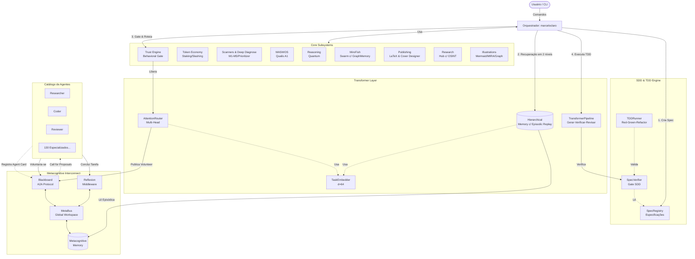

<div align="center">

# 🌌 OpenCode Ecosystem Core
**O "Cérebro" Multiagente que Transforma Ideias em Software, Pesquisa e Arte**

[](LICENSE)
[](https://www.python.org/)
[]()

*Uma arquitetura cognitiva completa que une 134 agentes especializados, Teoria dos Jogos, Raciocínio Quântico e Publicação Científica Automatizada.*

---

### ☕ Apoie este Projeto!
Se o OpenCode Ecosystem ajudou você a acelerar sua pesquisa, desenvolver software ou automatizar sua vida, considere me pagar um café! Seu apoio mantém o ecossistema evoluindo.

<a href="https://buymeacoffee.com/geomaker" target="_blank">
  
</a>


</div>

---

## 🚀 O que é o OpenCode Ecosystem?

### 👨‍💻 Para Leigos: A Empresa de Especialistas na sua Máquina
Imagine que você tem uma empresa inteira de tecnologia e pesquisa científica trabalhando para você, 24 horas por dia, dentro do seu computador. 
- Você tem um **Pesquisador** que lê milhares de artigos na internet e faz resumos.
- Você tem um **Programador** que escreve código e testa tudo.
- Você tem um **Revisor** (um chefe chato) que não deixa o programador entregar código com erro.
- E você tem um **Diretor de Arte** que desenha capas de livros e cria ilustrações didáticas.

Você só precisa dar a ordem: *"Quero um aplicativo que faça X"* ou *"Quero um livro sobre o tema Y"*. O "Cérebro" (nosso Orquestrador) chama os funcionários certos, dá o orçamento (Token Economy), exige qualidade (Trust Engine) e te entrega o produto final pronto.

### 🔬 Para PhDs e Engenheiros: Arquitetura Cognitiva Multiagente
O OpenCode Ecosystem Core é uma implementação *state-of-the-art* de sistemas multiagentes (MAS) inspirada em arquiteturas de redes neurais (Transformers) e neurociência cognitiva (Global Workspace Theory).
- **Roteamento por Atenção:** Não usamos *if/else* para delegar tarefas. Usamos *Multi-Head Attention* para calcular scores de semântica, capacidade e confiança (Trust Ledger) de 134 agentes.
- **MiroFish & Game Theory:** Agentes debatem soluções usando estratégias iteradas (Tit-for-Tat, Nash Equilibrium) e constroem Grafos de Conhecimento lógicos.
- **Pipeline Científico (MASWOS):** Automação completa de revisão sistemática de literatura. Baixa PDFs (Sci-Hub/OpenAlex), converte para Markdown, extrai figuras reais, gera fichamentos (ABNT/APA) e compila o manuscrito em LaTeX (com PDF, DOCX e ODT para Amazon KDP).
- **Metacognição Profunda:** O sistema possui 5 Scanners de diagnóstico (incluindo Engenharia Reversa de código legado) e um Gerador de Sucessores que prevê o próximo salto tecnológico do seu projeto.

---

## ⚡ Instalação: 1-Click no Windows

Se você usa Windows 10/11, nós criamos um instalador mágico que configura **tudo** para você (WSL2, Ubuntu, Ollama, Antigravity CLI e o Ecossistema).

1. Abra o **PowerShell como Administrador**.
2. Cole este comando e aperte Enter:
```powershell
Set-ExecutionPolicy Bypass -Scope Process -Force; irm https://raw.githubusercontent.com/MarceloClaro/opencode-ecosystem-core/main/installer/windows/Install-OpenCodeEcosystem.ps1 | iex
```
3. **Pronto!** Ele criará atalhos na sua Área de Trabalho. Basta clicar em "OpenCode Ecosystem" e começar a usar.

*(Para Linux/macOS, veja o [Guia Manual](ARCHITECTURE.md))*

---

## 🏗️ Arquitetura do Sistema

O ecossistema é dividido em 4 grandes camadas interconectadas:

1. **Camada Metacognitiva (MCI):** O barramento de eventos (Global Workspace) onde os agentes compartilham memória episódica.
2. **Camada Transformer:** O roteador de atenção que delega tarefas e o pipeline iterativo de *Reflexion* (Gerar → Verificar → Revisar).
3. **Módulos Avançados:** Token Economy (Staking/Slashing), Trust Engine (Behavioral Gates) e Diagnóstico Profundo.
4. **Catálogo de Agentes:** 134 agentes especializados em domínios que vão desde Física Quântica até Design de Capas.

### Mapa Geral da Arquitetura



### Detalhamento Técnico das Camadas

#### 1. Metacognitive Interconnect (MCI)
A espinha dorsal do ecossistema. Baseada na **Global Workspace Theory**, o `MetaBus` atua como um quadro negro onde todos os agentes publicam e leem eventos. O protocolo **A2A (Agent-to-Agent)** permite que agentes descubram as capacidades uns dos outros dinamicamente, sem *hardcoding*. O *Reflexion Middleware* garante que toda tarefa concluída gere uma lição aprendida.

#### 2. Transformer Layer
Inspirada na arquitetura de Vaswani (2017) e nos modelos da DeepMind.
- **TaskEmbedder:** Vetoriza tarefas e capacidades usando *feature hashing* determinístico.
- **AttentionRouter:** Substitui o roteamento estático por **Multi-Head Attention**. Calcula scores softmax usando 4 cabeças: Semântica, Capacidade, Confiança e Carga.
- **HierarchicalMemory:** Recuperação de memória em dois níveis (HTM) com *Episodic Replay* para treinamento offline.

#### 3. Core Subsystems (Módulos Avançados)
- **Trust Engine & Token Economy:** Agentes fazem *stake* de tokens para assumir tarefas. Se falharem no TDD, sofrem *slashing*. O *Behavioral Gate* barra agentes com histórico de alucinação.
- **Deep Diagnose:** 5 Scanners (Noológico, Teleológico, Evolutivo, etc.) que fazem engenharia reversa de código, priorização epistemológica e geram "Sucessores Plausíveis" para o seu projeto.
- **MiroFish & Game Theory:** Um enxame preditivo que debate usando o método Delphi e constrói um **Grafo de Conhecimento** em memória para extrair consensos matemáticos.
- **Publishing & Research:** Automação Qualis A1. Busca artigos (Sci-Hub/OpenAlex), converte PDF para Markdown, faz fichamentos ABNT/APA, gera ilustrações didáticas (MIRA) e compila livros inteiros em LaTeX com capas geradas por IA.

---

## ⚖️ Vantagens e Limitações (Transparência)

| ✅ Vantagens (Por que usar?) | ⚠️ Limitações (O que ainda estamos melhorando) |
|---|---|
| **Autonomia Real:** O sistema não apenas gera código, ele testa (TDD), revisa as próprias falhas e tenta de novo. | **Custo Computacional:** Rodar múltiplos agentes debatendo via LLM consome muitos tokens (recomendamos Ollama local para baratear). |
| **Rigor Acadêmico:** Único framework que gera citações ABNT/APA corretas e extrai figuras com metadados reais. | **Velocidade:** A metacognição (pensar sobre o pensar) exige tempo. Um artigo complexo pode levar minutos/horas para ser gerado. |
| **Design Automático:** Estuda paletas de cores e gera capas e ilustrações didáticas (MIRA) sozinho. | **Dependência de APIs:** O download de PDFs depende da estabilidade do Sci-Hub e OpenAlex. |
| **Segurança:** O Trust Engine pune agentes que "alucinam", reduzindo a taxa de erros a longo prazo. | **Setup Inicial Manual:** Fora do Windows, exige familiaridade com terminal e Python. |

---

## 🌍 Potencial de Aplicação e Escalabilidade

O OpenCode Ecosystem não é apenas um script de terminal, é um **Motor de P&D (Pesquisa e Desenvolvimento)** escalável.

- **Fábrica de Software Autônoma:** Pode ser acoplado a um repositório GitHub via CI/CD. Quando um *Issue* é aberto, o ecossistema lê, faz engenharia reversa, cria os testes (TDD), escreve o código e abre um *Pull Request*.
- **Universidade Sintética:** Pesquisadores podem usar o sistema para processar 500 artigos do PubMed em uma noite, extraindo apenas os consensos lógicos (via MiroFish Graph Memory) para acelerar a descoberta de novos medicamentos.
- **Editora Automatizada (KDP):** Escritores podem gerar rascunhos, solicitar ilustrações internas didáticas, diagramação LaTeX e exportação direta para a Amazon Kindle Direct Publishing.
- **Escalabilidade Horizontal:** Como usamos a arquitetura *Blackboard* e o protocolo A2A, você pode plugar este ecossistema em clusters Kubernetes, distribuindo os 134 agentes em diferentes nós de processamento.

---
<div align="center">
  <i>Construído com rigor metodológico, inspirado pela Teoria dos Jogos e desenhado para o futuro.</i><br>
  <b>Apoie o projeto: <a href="https://buymeacoffee.com/geomaker">buymeacoffee.com/geomaker</a></b>
</div>
