<div align="center">

# OpenCode Ecosystem Core
**Arquitetura Cognitiva Multiagente — Pipeline Científico Integral + CI/CD**

[](LICENSE)
[](https://www.python.org/)
[]()
[](CHANGELOG.md)
[](tests/)
[](evolution/cycles.json)
[](synthetic_university/mcp_server.py)
[](synthetic_university/api_gateway.py)
[](agents/catalog/)
[](.github/workflows/ci.yml)

*Uma arquitetura cognitiva completa que integra 160+ agentes especializados, Pipeline Científico Agentivo (EvoSci + Deep Research + Peer Review + Revision + Paper Composer), Scientific RAG adaptativo, Evolutionary Memory, MCP Security, GitHub Actions CI/CD e a Universidade Sintética Transversal com 65 ciclos de evolução contínua.*

<sub>Ver [`CORRIGENDUM.md`](CORRIGENDUM.md) para ressalvas sobre "160+ agentes" (agent cards elegíveis, não processos de IA sempre ativos) e sobre "Qualis A1" (padrão de rubrica interno, não certificação obtida).</sub>

</div>

---

##  O que é o OpenCode Ecosystem?

### Para Leigos: A Universidade de Pesquisadores na sua Máquina

Imagine uma universidade de pesquisa inteira — reitor, orientadores, pesquisadores, revisores, editores, uma secretaria de TI e até um porteiro que confere quem pode entrar — rodando dentro do seu computador, 24 horas por dia, coordenada por um único reitor: o orquestrador **marceloclaro**.

**Quem faz o quê, em termos simples:**

| Personagem | O que faz de verdade | Onde mora no código |
|---|---|---|
| **O Reitor** (marceloclaro) | Recebe seu pedido, decide quem vai trabalhar nele, acompanha se deu certo e nunca esquece uma lição aprendida. | `marceloclaro/orchestrator.py` |
| **O Quadro de Avisos** (Blackboard) | Onde as tarefas ficam penduradas até um especialista se candidatar — como um mural de vagas de emprego interno. | `mci/blackboard.py` |
| **A Memória Coletiva** (MetaBus) | A "memória da faculdade inteira" — o que já foi tentado, o que deu certo, quem é confiável em quê. | `mci/metabus.py` |
| **O Pesquisador-Chefe** (EvoSci) | Gera hipóteses de pesquisa e as evolui geração após geração, como uma seleção natural de ideias. | `agentic_science_v2/orchestrator.py` |
| **O Explorador de Bibliotecas** (Deep Research) | Vasculha 11 fontes acadêmicas reais (arXiv, PubMed, OpenAlex, bioRxiv...) e monta um mapa de evidências. | `agentic_science_v2/deep_research.py` |
| **A Banca de Revisores** (Peer Review) | Avalia o trabalho em 8 dimensões, com revisão às cegas de verdade (nomes de autor escondidos). | `agentic_science_v2/review_agent.py` |
| **O Copidesque** (Revision) | Aplica as correções pedidas pela banca — e se alguma correção estragar o texto, desfaz sozinho. | `agentic_science_v2/revision_agent.py` |
| **O Diagramador** (Paper Composer) | Formata o artigo final em ABNT, APA ou IEEE, com verificação de que tudo bate entre si. | `agentic_science_v2/paper_composer.py` |
| **O Segurança da Faculdade** (Trust Engine) | Detecta quando um especialista está "desviando do combinado" e reduz a confiança nele. | `trust/trust_engine.py` |
| **A Central de Suporte** (Doctor + Helpdesk) | Confere a saúde de tudo em segundos e sugere exatamente o que fazer quando algo está errado. | `marceloclaro/doctor.py`, `helpdesk.py` |

Você dá uma ordem como *"Pesquise o impacto de ética quântica em IA"* e o ecossistema orquestra dezenas de agentes especializados, testa rigorosamente (TDD), audita a qualidade (SDD gates) e entrega um artigo completo com revisão por pares embutida — e para agora, se algo falhar no meio do caminho, em vez de fingir que deu certo.

**Quer instalar e usar sem entender nada de código?** Veja [`MANUAL.md`](MANUAL.md) — o manual em linguagem simples, com um mapa interativo (leia mais abaixo).

### Para PhDs e Engenheiros: Ecossistema Multiagente com Pipeline Científico Fechado

O OpenCode Ecosystem Core é uma implementação modular de sistemas multiagentes (MAS) com **metacognição real, governança científica, pipeline acadêmico fechado, loop engineering formal e infraestrutura de qualidade profissional**. O orquestrador `MarceloClaroOrchestrator` (`marceloclaro/orchestrator.py`) é o ponto de fusão único de todas as camadas abaixo — não um roteador superficial, mas o agente `primary` do `opencode.json`, com métodos que atravessam MCI, Trust, SDD/TDD e o pipeline científico completo.

**Diferenciais arquiteturais:**

- **Pipeline Científico Fechado, fundido nativamente (R101→R105, R108, R109):** EvoSci (descoberta) → Deep Research (evidência, 11 fontes) → Peer Review (avaliação + revisão às cegas real, R115) → Revision (correção com rollback automático) → Paper Composer (publicação). Desde o R108, isso roda **dentro** do orquestrador via `scientific_discovery_pipeline()`, com **gate real de exportação** (não mais continuação cega quando a revisão reprova) e **calibração de confiança** (Brier Score/ECE). Desde o R109, é um **loop real** (`run_scientific_discovery_loop()`) com 5 estados terminais nomeados (`success`/`no_op`/`blocked`/`stalled`/`exhausted`/`error`) e detecção de estagnação.
- **MCI — Metacognitive Interconnect:** MetaBus (Global Workspace), Blackboard (protocolo A2A), Reflexion, `ConfidenceCalibrator` (Brier/ECE), `MetacognitiveEvaluator` (SPEC-920) — que nunca declara um tier "verified" sem `external_validation=True` explícito.
- **Loop Engineering formal (R109):** `sdd/loop_spec.py::LoopSpecification` formaliza trigger, verificação em escada de 5 níveis, arquitetura, estados terminais e detecção de estagnação — checklist de boa-formação automático inspirado em Macedo (2026).
- **Trust Engine com detecção de desvio de objetivo (R112):** `GoalDriftDetector` real, por sobreposição lexical em janela deslizante, além do `BehavioralGate` e `NaturalForgetting` já existentes.
- **Raciocínio formal ampliado:** 12 motores (Z3, SymPy, Kanren, Bayesian, Causal...) + `ARCHE RLT` (R114, árvore lógica auditável nos 6 tipos de inferência de Peirce, SPEC-057) + detector de 15 falácias lógicas e 4 vieses cognitivos (R113).
- **Evolutionary Memory (R97) + Evidence Graph (R102):** memória persistente de ideias/experimentos/estagnação; grafo epistemológico de entidades, relações e evidências com proveniência.
- **MCP Security (R100) + CI/CD (R106):** guard model, audit trail, vetting de comandos, rate limiting; GitHub Actions com lint, matrix test e package build.
- **Instalação multiplataforma de primeira classe (R116):** Windows (WSL 1-clique + ícone próprio), Linux nativo, macOS best-effort — as 3 CLIs externas (OpenCode, Antigravity, **Claude Code**) instaladas e verificadas por `doctor()`.
- **Autoauditoria contínua:** `marceloclaro/doctor.py` + `helpdesk.py` (R110) + `CORRIGENDUM.md` — uma prática pública de correção de alegações que a própria documentação já usou em si mesma (ver seção de ressalvas acima).

---

##  Mapa da Arquitetura — para PhD e para Leigos

Este ecossistema tem dezenas de subsistemas reais. Para não virar um emaranhado ilegível, organizamos tudo em **6 camadas arquiteturais** ao redor do orquestrador central, cada uma com um registro de leitura simples (Leigo) e um técnico (PhD).

** [Abrir o mapa interativo 3D](docs/architecture_map.html)** — arraste o mouse pela cena para girar a "mesa de desenho", clique em qualquer camada para ver todos os nós internos, alterne entre os registros Leigo/PhD no topo. Funciona offline, abrindo o arquivo direto no navegador.

### Legenda das 6 camadas

| Camada | Cor no mapa | O que agrupa (Leigo) | O que agrupa (PhD) |
|---|---|---|---|
| **1. Interface & Instalação** | azul-claro | As portas de entrada: terminal, painel visual, instaladores | CLI marceloclaro, Dashboard Streamlit, OpenCode/Antigravity/Claude Code CLI, `installer/` (R116) |
| **2. Orquestração & Confiança** | âmbar | As regras do jogo: quem é confiável, o que precisa ser testado antes de entregar | Trust Engine (+GoalDriftDetector R112), Token Economy, SDD/TDD Engine, Loop Engineering (R109), Doctor/Helpdesk/Corrigendum (R110) |
| **3. MCI — Sistema Nervoso** | ciano | A memória e os instintos compartilhados de tudo | MetaBus, Blackboard, Reflexion, ConfidenceCalibrator, MetacognitiveEvaluator (SPEC-920), OQS/VSEE/EGS |
| **4. Pipeline Científico** | coral | A linha de produção de um artigo científico, do zero à publicação | EvoSci→DeepRes→PeerReview(+BlindReview R115)→Revision→Composer, fundidos e em loop real (R108/R109) |
| **5. Raciocínio & Descoberta** | lilás | As diferentes formas de "pensar" do sistema | 12 motores + ARCHE RLT (R114) + Detector de Falácias (R113), Game Theory, MiroFish, MASWOS, Legal, RAG, Synthetic University |
| **6. Produção, Segurança & Evolução** | verde | Onde o trabalho vira produto, e onde tudo fica registrado para sempre | Publishing, Research Hub (+PubMed/bioRxiv/CORE R111, CLI `pesquisa` R120), Illustrations, MCP Security, CI/CD, Evolution Registry (77 ciclos), 35 Specs SDD |

### Instruções de leitura

1. **Comece pelo hub central** (`marceloclaro`) — todo fluxo de dados entra e sai por ele; nenhuma camada se comunica diretamente com outra sem passar pela memória compartilhada (MCI) ou pelo orquestrador.
2. **Linhas tracejadas** = vetores de delegação/reflexão (o orquestrador manda trabalho, a camada devolve uma reflexão que vira memória).
3. **Setas cheias** dentro do Pipeline Científico = a ordem real de execução (EvoSci → Deep Research → Peer Review → Revision → Composer); reprovar o gate do Peer Review interrompe a cadeia antes da Revision (R108).
4. Para o diagrama técnico completo (todos os IDs de nó, todas as arestas, formato Mermaid nativo do GitHub) veja [`ARCHITECTURE.md`](ARCHITECTURE.md#diagrama-de-arquitetura-completo).
5. Para instalar cada camada de interface, veja [`installer/README.md`](installer/README.md). Para usar o CLI do orquestrador no dia a dia, veja [`MANUAL.md`](MANUAL.md).

---

##  Instalação: 1-Click no Windows

Se você usa Windows 10/11, o instalador configura WSL2, Ubuntu, OpenCode CLI, Antigravity CLI, Claude Code CLI, Ollama e o ecossistema — com ícone próprio e atalhos na Área de Trabalho:

```powershell
Set-ExecutionPolicy Bypass -Scope Process -Force; irm https://raw.githubusercontent.com/MarceloClaro/opencode-ecosystem-core/main/installer/windows/Install-OpenCodeEcosystem.ps1 | iex
```

*(Para Linux nativo e macOS, veja o [Guia de Instalação](installer/README.md). Manual de uso: [`MANUAL.md`](MANUAL.md).)*

---

##  Arquitetura do Sistema (v3.0)

O ecossistema é organizado em **6 camadas interconectadas**:

### 1. Camada Metacognitiva (MCI)
Barramento de eventos (Global Workspace) onde agentes compartilham memória, confiança calibrada e reflexões pós-execução. Inclui MetaBus (pub/sub), Blackboard (protocolo A2A), memória hierárquica e Reflexion middleware.

### 2. Pipeline Acadêmico Agentivo (NOVO v3.0)
Pipeline fechado de 5 estágios que transforma um problema em artigo publicado:

```
[Problema]
    ↓
┌─ R101: AGENTIC SCIENCE V2 (EvoSci) ─────────────────┐
│ MentorAgent → PrimeResearcherAgent → ReviewerAgent  │
│ → EvolutionManagerAgent → Evolutionary Engine       │
│ (Selection → Crossover → Mutation → Inheritance)    │
└──────────────────────────────────────────────────────┘
    ↓
┌─ R102: DEEP RESEARCH AGENT ─────────────────────────┐
│ EvidenceGraph (Entity/Relation/Evidence)             │
│ BFRSAgent (exploração larga)                         │
│ DFRSAgent (cadeias multi-hop)                        │
│ OrchestratorAgent (planejamento + gate + síntese)    │
└──────────────────────────────────────────────────────┘
    ↓
┌─ R103: AGENTIC PEER REVIEW ─────────────────────────┐
│ RubricEngine (8 meta-dimensões)                      │
│ ReviewLedger (claim-evidence-risk)                   │
│ AuditGraph (integrado R102)                          │
│ MultiCriticReviewer (4 especialistas)                │
└──────────────────────────────────────────────────────┘
    ↓
┌─ R104d: AGENTIC MANUSCRIPT REVISION ────────────────┐
│ ReviewAnalyzer → SectionMapper → ProposalGenerator   │
│ DiffEngine (com rollback) → RebuttalLetter           │
└──────────────────────────────────────────────────────┘
    ↓
┌─ R105: AGENTIC PAPER COMPOSER ──────────────────────┐
│ StructurePlanner (ABNT/APA/IEEE)                     │
│ SectionWriter (6 seções)                             │
│ CitationFormatter (3 estilos)                        │
│ CrossConsistencyVerifier (5 verificações)            │
└──────────────────────────────────────────────────────┘
    ↓
[Artigo Completo + MCP Tools + Skills Exportáveis]
```

Cada estágio possui **spec formal (SDD)**, **testes TDD**, **gate de qualidade** e **registro no EvolutionRegistry**.

### 3. Motor Científico com Governance (v2.x legado)
Pipeline científico com governança ética: `OQS → HypothesisEngine → ExperimentDesigner → StatisticalValidator → AdversarialReviewer → ConfidenceCalibrator → VSEE → EGS → EvidenceGraph`. Inclui Scientific RAG com grounding, citações auditáveis e abstenção.

### 4. Camada Transformer
Roteador de atenção (Multi-Head Attention com 4 cabeças: semântica, capacidade, confiança, carga), pipeline iterativo Gerar→Verificar→Revisar e memória hierárquica com Episodic Replay.

### 5. Módulos Avançados
- **Token Economy:** Staking/slashing para agentes
- **Trust Engine:** Behavioral gates com confidence ledger
- **SDD/TDD:** SpecRegistry, SpecVerifier, TDDRunner
- **MCP Security (R100):** MCPGuard, AuditLogger, ToolVetter, RateLimiter
- **CI/CD (R106):** GitHub Actions, quality report, coverage gate

### 6. Catálogo de Agentes
160+ agentes especializados: Researcher, Coder, Reviewer, Academic Writer, 32 agentes MASWOS, Deep Research, Peer Review, Revision, Paper Composer, e especialistas jurídicos, de design e quânticos.

### Diagrama de Arquitetura

```mermaid
graph TD
    %% Atores e Orquestrador
    User([Usuário / CLI]) -->|Comandos| Orchestrator[Orquestrador: marceloclaro]
    WebUI([Webapp Streamlit<br>Dashboard + Jurídico]) -->|Painel visual| Orchestrator

    %% Interface & Instalação (R116)
    subgraph IF ["Interface & Instalação (R116)"]
        OCCLI["OpenCode CLI<br>165 agentes · 8 comandos"]
        AGCLI["Antigravity CLI<br>ponte agy"]
        CCCLI["Claude Code CLI<br>CLAUDE.md+AGENTS.md"]
        Inst["Instaladores<br>Windows/Linux/macOS<br>+ Desinstaladores"]
    end
    Inst -.->|Provisiona| OCCLI
    Inst -.->|Provisiona| AGCLI
    Inst -.->|Provisiona| CCCLI
    OCCLI --> Orchestrator
    AGCLI --> Orchestrator
    CCCLI --> Orchestrator

    %% Camada SDD/TDD
    subgraph SDD [SDD & TDD Engine]
        Spec[SpecRegistry<br>Especificações]
        Ver[SpecVerifier<br>Gate SDD]
        TDD[TDDRunner<br>Red-Green-Refactor]
        LoopSpec["Loop Engineering R109<br>5 Estados Terminais"]

        TDD -.->|Valida| Ver
        Ver -.->|Lê| Spec
        LoopSpec -.->|Formaliza| Spec
    end

    %% Camada Transformer
    subgraph TF [Transformer Layer]
        Attn[AttentionRouter<br>Multi-Head]
        Pipe[TransformerPipeline<br>Gerar-Verificar-Revisar]
        HTM[(Hierarchical<br>Memory HTM)]
        Emb[TaskEmbedder<br>d=64]
        
        Attn -.->|Usa| Emb
        HTM -.->|Usa| Emb
    end
    
    %% Pipeline Academico Agentivo
    subgraph Acad [Pipeline Academico Agentivo v3.0]
        EvoSci["R101: EvoSci<br>MentorAgent+ResearcherAgent<br>ReviewerAgent+EvoEngine"]
        DeepRes["R102: Deep Research<br>EvidenceGraph+BFRS+DFRS"]
        PReview["R103: Peer Review<br>8-dim Rubric+AuditGraph<br>Revisão às Cegas Real (R115)"]
        Revision["R104d: Manuscript Revision<br>DiffEngine+Rebuttal"]
        Composer["R105: Paper Composer<br>ABNT/APA/IEEE"]
        
        EvoSci --> DeepRes
        DeepRes --> PReview
        PReview --> Revision
        Revision --> Composer
    end

    %% Fusao real no orquestrador (R108/R109)
    FusionLoop["scientific_discovery_pipeline (R108)<br>+ loop real com estagnação (R109)"]
    Orchestrator -->|Funde nativamente| FusionLoop
    FusionLoop -->|Executa em cadeia| EvoSci
    Composer -->|Retorna ao loop| FusionLoop

    %% Camada Core (Subsistemas)
    subgraph Core [Core Subsystems]
        Trust["Trust Engine<br>Behavioral Gate<br>GoalDriftDetector (R112)"]
        Eco[Token Economy<br>Staking/Slashing]
        Scan[Scanners<br>Diagnóstico]
        AcadLegacy[MASWOS<br>Qualis A1 - meta interna, ver Corrigendum]
        Reason["Reasoning<br>12 Engines + Quantum<br>ARCHE RLT (R114) + Falácias (R113)"]
        Legal[Legal Reasoning + AuxJuris<br>SPEC-921/922/923/924/925/926/927/928/931]
        LegalBench[Legal Benchmarks<br>SPEC-928]
        SynthUniv[Synthetic University<br>SPEC-935 · 11 Faculdades]
        RAG[Scientific RAG<br>Grounding + Citations]
        Bench[Superhuman Readiness<br>Benchmarks]
        MetaEval[Metacognitive Eval<br>SPEC-920]
        Discovery[Continuous Discovery<br>R95 · Loop Automático]
        EvoMem[Evolutionary Memory<br>R97 · Memória Persistente]
        Novelty[Novelty V2<br>R98 · Contribution Points]
        RAGEvolved[RAG Evolved<br>R99 · Adaptive+CitationGraph]
        ResearchHub["Research Hub<br>11 fontes: +PubMed/bioRxiv/CORE (R111)<br>CLI: marceloclaro pesquisa (R120)<br>Download: OA direto + Sci-Hub fallback"]
    end

    %% Seguranca e Qualidade
    subgraph SQC [Seguranca & Qualidade]
        MCPSec[MCP Security R100<br>Guard+Audit+Vetter+Limiter]
        CICD[CI/CD Pipeline R106<br>GitHub Actions+Quality Gates]
        Skills[Skills Exportaveis R104a<br>4 Skills]
        PipPkg[Pip Packages R104b<br>3 Pacotes]
        DoctorNode["Doctor + Helpdesk (R110)<br>+ CORRIGENDUM.md público"]
    end
    DoctorNode -.->|Diagnostica| Orchestrator

    %% MCP + API Gateway
    subgraph Protocols [Protocolos de Integração]
        MCPServer[MCP Server · R94+R100<br>14 Ferramentas via stdio]
        APIGateway[API Gateway · R96<br>10+ Endpoints FastAPI REST]
        MCP_Sci[su_agentic_science]
        MCP_Deep[su_deep_research]
        MCP_Review2[su_peer_review_v2]
        MCP_Revision[su_manuscript_revision]
        MCP_Composer[su_paper_composer]
        MCP_Novelty2[su_novelty_v2]
        MCP_Sec[su_mcp_security]
        MCP_Classic[su_generate/evaluate/enrich/visual/peer-review/submission/novelty/dashboard]
    end

    %% Camada MCI
    subgraph MCI [Metacognitive Interconnect]
        MB[MetaBus<br>Global Workspace]
        BB[Blackboard<br>A2A Protocol]
        Mem[(Metacognitive<br>Memory)]
        Ref[Reflexion<br>Middleware]
        
        MB <--> Mem
        BB <--> MB
        Ref <--> MB
    end
    
    %% Orquestrador integra as camadas
    Orchestrator -->|1. Cria Spec| Spec
    Orchestrator -->|2. Recuperação em 2 níveis| HTM
    HTM -->|Lê Episódica| Mem
    Orchestrator -->|3. Gate & Roteia| Trust
    Trust -->|Libera| Attn
    Attn -->|Publica Volunteer| BB
    Orchestrator -->|4. Executa TDD| Pipe
    Pipe -->|Verifica| Ver
    Orchestrator <-->|Usa| Core
    
    %% Pipeline academico
    Orchestrator -->|5. Pipeline Academico| EvoSci
    EvoSci -->|Alimenta| DeepRes
    DeepRes -->|Produz evidencia| PReview
    PReview -->|Gera revisao| Revision
    Revision -->|Manuscrito revisado| Composer
    Composer -->|Artigo final| Orchestrator
    
    %% Conexões de suporte
    AcadLegacy -->|Consulta evidências| RAG
    Reason -->|Grounding científico| RAG
    RAG -->|Métricas| Bench
    RAGEvolved -->|Citacoes em grafo| DeepRes
    EvoMem -->|Memoria de direcoes| EvoSci
    Novelty -->|Analise de novidade| EvoSci
    MB -->|Traços e reflexões| MetaEval
    Trust -->|Outcomes e confiança| MetaEval
    
    %% Jurídico
    Orchestrator -->|6. Raciocínio Jurídico| Legal
    Legal -->|Subsunção + Ponderação| Reason
    Legal -->|Interpretação Constitucional| MetaEval
    Legal -->|RAG jurídico + Datajud| RAG
    Legal -->|Agentes jurídicos A2A| BB
    Legal -->|Especialização por 7 ramos| LegalBench
    LegalBench -->|tiers conservadores| MetaEval
    
    %% SynthUniv
    SynthUniv -->|Gera teses| Discovery
    Discovery -->|Enriquece + Avalia| SynthUniv
    
    %% Seguranca e qualidade
    MCPSec -.->|Protege| MCPServer
    CICD -.->|Valida| Pipe
    Skills -.->|Exporta| BB
    PipPkg -.->|Distribui| External
    
    %% Integração MCP / API
    SynthUniv -.->|Registra handlers| MCPServer
    MCPServer --> MCP_Classic
    MCPServer --> MCP_Sci
    MCPServer --> MCP_Deep
    MCPServer --> MCP_Review2
    MCPServer --> MCP_Revision
    MCPServer --> MCP_Composer
    MCPServer --> MCP_Novelty2
    MCPServer -->|stdio JSON-RPC| External
    APIGateway -->|Reusa handlers| MCPServer
    APIGateway -->|HTTP REST| External
    
    %% Agentes
    subgraph Agents [Catálogo de Agentes 160+]
        A1[Researcher]
        A2[Coder]
        A3[Reviewer]
        A4[Academic Writer]
        A5[EvoSci Agent]
        A6[Deep Research]
        A7[Peer Review]
        A8[Paper Composer]
        A9[Revision Agent]
        A10[32 MASWOS Agents]
    end
    
    %% Fluxo de Agentes
    Agents -.->|Registra Agent Card| BB
    BB -.->|Call for Proposals| Agents
    Agents -->|Voluntaria-se| BB
    Agents -->|Conclui Tarefa| Ref
    
    %% MCP
    MCP_Node[MCP JSON-RPC] -->|Expõe API| MCI
    External[External Tools / LLMs] -->|stdio ou HTTP| MCPServer
    External -->|HTTP REST| APIGateway
```



---

### Legenda da Arquitetura

#### Notação Visual

| Símbolo | Significado |
|---|---|
| `[Texto]` | **Componente** interno do sistema (ex: `[SpecRegistry]`) |
| `([Texto])` | **Ator externo** — usuário, CLI, ferramenta fora do ecossistema |
| `{Texto}` | **Módulo de armazenamento** — banco de dados, cache, memória persistente |
| `>"Texto"]` | **Entrada/Saída** — subprocesso, pipeline de dados |
| `subgraph NOME [...] ... end` | **Agrupamento lógico** — uma camada ou subsistema |
| `A --> B` | **Fluxo direto** — A chama/envia dados para B |
| `A -.-> B` | **Fluxo indireto** — A influencia ou registra em B (ex: registro de handler, proteção) |
| `A <--> B` | **Fluxo bidirecional** — troca contínua de dados entre A e B |
| `A -->\|Rótulo\| B` | **Fluxo com descrição** — o que está sendo passado (comando, dados, controle) |
| `A[\"<br>Texto\"]` | **Componente com múltiplas linhas** — detalhamento interno |

#### Subgraphs (Camadas)

| Camada | Função |
|---|---|
| **Interface & Instalação (R116)** | Portas de entrada externas: OpenCode CLI, Antigravity CLI, Claude Code CLI, e os instaladores das 3 plataformas (com desinstaladores). |
| **SDD & TDD Engine** | Motor de especificação e testes. Toda entrega nasce como spec (SDD) e só é aceita após testes verdes (TDD). Inclui o Loop Engineering formal (R109). |
| **Transformer Layer** | Roteador por atenção multi-cabeça. Substitui if/else estático por scores softmax de semântica, capacidade, confiança e carga. |
| **Pipeline Academico v3.0** | O coração do sistema. 5 estágios sequenciais que transformam um problema em artigo completo revisado e formatado. |
| **Core Subsystems** | Subsistemas auxiliares: trust engine, economia de tokens, motores de raciocínio, RAG científico, Universidade Sintética, memória evolutiva. |
| **Segurança & Qualidade** | Proteção MCP (guard/audit/vetter/limiter), CI/CD (GitHub Actions + quality gates), skills exportáveis e pacotes pip. |
| **Protocolos de Integração** | Interfaces de comunicação: MCP Server (stdio JSON-RPC) e API Gateway (FastAPI REST). 14 ferramentas expostas. |
| **Metacognitive Interconnect** | Barramento neural central. MetaBus (pub/sub global), Blackboard (protocolo A2A), memória metacognitiva e middleware de reflexão. |
| **Catálogo de Agentes** | 160+ agentes especializados que se registram no Blackboard e competem por tarefas via Call for Proposals. |

#### Legenda de Cores (conceitual)

| Cor | Significado |
|---|---|
| Azul | Camada de **orquestração e controle** (Orquestrador, SDD, Transformer) |
| Verde | **Pipeline acadêmico** — a cadeia de valor principal R101→R105 |
| Laranja | **Subsistemas de suporte** — engines, RAG, memória, benchmark |
| Vermelho | **Segurança e qualidade** — proteção, validação, CI/CD |
| Roxo | **Protocolos de integração** — MCP, API Gateway |
| Cinza | **Metacognição** — barramento neural, memória, reflexão |

---

### Como Funciona a Orquestração

A orquestração é o ciclo de vida de uma tarefa pelos 7 passos do protocolo **marceloclaro**: **Perceber → Especificar → Delegar → Executar → Verificar → Refletir → Registrar**. Abaixo, cada passo é detalhado com o fluxo real no diagrama.

---

#### Passo 1: Perceber (Recepção da Tarefa)

```
User([Usuário]) -->|"Comandos"| Orchestrator
```

O ciclo começa quando o usuário dá um comando. O **Orquestrador `marceloclaro`** recebe a requisição — seja via CLI, webapp Streamlit ou chamada MCP.

**O que acontece internamente:**
1. O orquestrador valida a entrada (formato, segurança básica)
2. Identifica o tipo de tarefa: pesquisa, código, artigo acadêmico, revisão, diagnóstico
3. Consulta a **memória metacognitiva** (`Mem[(Metacognitive Memory)]`) via `HTM[(Hierarchical Memory)]` para saber se já executou tarefa similar antes e quais lições foram aprendidas
4. Define o escopo: o que precisa ser entregue, quais critérios de sucesso

**Exemplo prático:** Usuário diz: *"Produza um artigo científico sobre ética quântica em IA, no formato ABNT"*.
O orquestrador identifica: tarefa do tipo `academic_pipeline`, formato ABNT, tópico "quantum ethics in AI".

---

#### Passo 2: Especificar (SDD — Spec-Driven Development)

```
Orchestrator -->|"1. Cria Spec"| Spec[SpecRegistry]
```

Antes de qualquer execução, o orquestrador cria uma **Especificação Formal (SDD)** no `SpecRegistry`.

**O que contém uma spec:**
- **Objetivo:** descrição do que será entregue
- **Critérios de Aceitação (CA):** lista verificável de condições que a entrega deve satisfazer
- **Recursos necessários:** agentes, ferramentas, orçamento de tokens
- **Prazo estimado:** número de ciclos TDD

**Exemplo (spec para o artigo de ética quântica):**
```
CA1: O artigo deve ter no mínimo 5 seções (abstract, intro, methods, results, conclusion)
CA2: Deve conter no mínimo 3 citações formatadas em ABNT
CA3: A revisão por pares deve atribuir score ≥ 7/10 em todas as 8 dimensões
CA4: O manuscrito deve passar pelo DiffEngine sem erros de integridade
```

A spec fica registrada e auditável para sempre. Nada é executado sem uma spec aprovada.

---

#### Passo 3: Delegar (Roteamento por Atenção + Blackboard)

```
Orchestrator -->|"2. Recuperação em 2 níveis"| HTM
HTM -->|"Lê Episódica"| Mem
Orchestrator -->|"3. Gate & Roteia"| Trust[Trust Engine]
Trust -->|"Libera"| Attn[AttentionRouter Multi-Head]
Attn -->|"Publica Volunteer"| BB[Blackboard A2A]
```

Este é o passo mais sofisticado da arquitetura. Ele substitui um simples `if/else` por um sistema de **atenção multi-cabeça** inspirado em Transformers.

**Sub-passo 3.1: Recuperação de Memória**
O orquestrador consulta a **Hierarchical Memory (HTM)** em dois níveis:
1. **Atenção grossa:** busca sumários de chunks de memória similares à tarefa atual
2. **Atenção fina:** sobre os eventos dos melhores chunks, recupera detalhes de execuções anteriores, lições aprendidas e scores de confiança

**Sub-passo 3.2: Gate Comportamental**
O **Trust Engine** avalia:
- O agente que executou tarefa similar anteriormente tem confiança suficiente? (confidence ledger)
- A tarefa envolve risco alto? (ex: execução de código externo, acesso a dados sensíveis)
- O orçamento de tokens está disponível?

Se o gate falhar, a tarefa é bloqueada ou redirecionada para um agente com supervisão.

**Sub-passo 3.3: Atenção Multi-Head**
O **AttentionRouter** calcula scores softmax com 4 cabeças:

| Cabeça | O que mede | Peso |
|---|---|---|
| **Semântica** | Similaridade entre a tarefa e as capacidades do agente (via TaskEmbedder d=64) | 35% |
| **Capacidade** | O agente tem as ferramentas necessárias? (ex: acesso a RAG, motores de raciocínio) | 30% |
| **Confiança** | Qual o histórico de acertos do agente? (Trust Ledger) | 25% |
| **Carga** | O agente está disponível ou já ocupado? | 10% |

O agente com maior score composto vence a disputa.

**Sub-passo 3.4: Publicação no Blackboard**
O orquestrador publica um **Call for Proposals (CFP)** no `Blackboard (A2A Protocol)`:
- `BB -.->|"Call for Proposals"| Agents`
- Agentes elegíveis se voluntariam: `Agents -->|"Voluntaria-se"| BB`
- O AttentionRouter seleciona o melhor

**Exemplo prático:** Para o artigo de ética quântica:
1. HTM recupera memórias de artigos anteriores sobre ética em IA
2. Trust Engine libera com confidence score 0.85
3. AttentionRouter calcula: EvoSci Agent=0.91, Academic Writer=0.78, Researcher=0.65
4. **EvoSci Agent é selecionado**

---

#### Passo 4: Executar (Pipeline Acadêmico 5 Estágios)

```
Orchestrator -->|"5. Pipeline Academico"| EvoSci
EvoSci -->|"Alimenta"| DeepRes
DeepRes -->|"Produz evidencia"| PReview
PReview -->|"Gera revisao"| Revision
Revision -->|"Manuscrito revisado"| Composer
Composer -->|"Artigo final"| Orchestrator
```

O coração do ecossistema: 5 estágios em série, cada um alimentando o próximo.

**Estágio 1 — R101: EvoSci (Descoberta Científica)**
- **MentorAgent:** constrói o espaço do problema, divide em subproblemas
- **PrimeResearcherAgent:** gera soluções candidatas para cada subproblema
- **ReviewerAgent:** avalia cada solução em múltiplas dimensões (novidade, viabilidade, impacto)
- **EvolutionManagerAgent:** mantém memórias de ideação e experimentação
- **EvoEngine:** executa ciclo evolutivo: **Selection** → **Crossover** → **Mutation** → **Inheritance**
  - *Selection:* as melhores soluções são selecionadas por fitness
  - *Crossover:* combina características de duas soluções promissoras
  - *Mutation:* introduz variação aleatória para explorar o espaço
  - *Inheritance:* passa características adaptativas para a próxima geração
- **Detecção de estagnação:** se o fitness não melhora por N gerações, o sistema faz **pivot**

**Saída:** Uma hipótese refinada + direções de pesquisa + trajetória evolutiva

**Estágio 2 — R102: Deep Research (Pesquisa Profunda)**
- **KnowledgeBaseRegistry:** carrega fontes de conhecimento (PubMed, arXiv, OpenAlex simulados)
- **BFRSAgent (Breadth-First Research Search):** explora conexões imediatas em largura
  - Para cada entidade, encontra relações diretas
  - Constrói um grafo de primeiro nível
- **DFRSAgent (Depth-First Research Search):** constrói cadeias multi-hop
  - Segue relações em profundidade (configurável até max_depth)
  - Descobre conexões não óbvias entre conceitos distantes
- **EvidenceGraph:** acumula entidades, relações e evidências com proveniência completa
  - Cada `Evidence` registra: entidade origem, entidade destino, relação, timestamp, fonte
  - Suporta `find_paths(start, end, max_depth)` via BFS
  - Suporta `subgraph_query(entities)` para contextos focados
- **OrchestratorAgent:** planeja a estratégia de busca, roteia entre BFRS e DFRS, aplica **gate de suficiência** (número mínimo de entidades e relações) e sintetiza o resultado

**Conexões de suporte ativas:**
- `RAGEvolved -->|"Citacoes em grafo"| DeepRes` — o RAG Evolved (R99) alimenta o grafo com citações
- `EvoMem -->|"Memoria de direcoes"| EvoSci` — a memória evolutiva (R97) evita re-explorar direções falhadas
- `Novelty -->|"Analise de novidade"| EvoSci` — o analisador de novidade (R98) pontua contribuições

**Saída:** Um relatório de pesquisa com evidências, grafo de conhecimento e gate de suficiência

**Estágio 3 — R103: Peer Review (Revisão por Pares Agentiva)**
- **RubricEngine:** instancia 8 meta-dimensões de avaliação:

| Dimensão | O que avalia | Polaridade |
|---|---|---|
| Originalidade | O trabalho é novo? | Positiva |
| Metodologia | Os métodos são sólidos? | Positiva |
| Resultados | Os resultados são convincentes? | Positiva |
| Reprodutibilidade | Dá para reproduzir? | Positiva |
| Clareza | A escrita é clara? | Positiva |
| Ética | Há preocupações éticas? | Negativa (score reverso) |
| Literature Review | A revisão de literatura é adequada? | Positiva |
| Impacto | Qual o impacto potencial? | Positiva |

- **ReviewLedger:** rastreia **claims** (afirmações do paper), **evidências** (suporte para cada claim) e **riscos** (nível de incerteza)
  - Cada claim recebe um status: `verified`, `unsupported`, `contradicted`, `uncertain`
  - Claims de alto risco geram automaticamente uma **verification agenda**
- **AuditGraph:** integrado ao EvidenceGraph do R102, ancora cada evidência no grafo epistemológico
- **MultiCriticReviewer:** 4 críticos executando em paralelo:

| Crítico | Foco |
|---|---|
| **Methodology Critic** | Design experimental, viés, power analysis |
| **Results Critic** | Significância estatística, efeito, robustez |
| **Literature Critic** | Cobertura da revisão, citações ausentes |
| **Ethics Critic** | Conformidade ética, consentimento, privacidade |

- **OrchestratorReviewer:** pipeline completo:
  1. **Drafting:** gera rascunho da revisão
  2. **Ledgering:** constrói o ReviewLedger
  3. **Grounding:** ancora evidências no AuditGraph
  4. **Auditing:** executa gate de auditoria
  5. **Synthesis:** consolida em meta-review + repair plan priorizado (critical > major > minor)

**Saída:** Revisão completa com scores (0-10), repair plan, verification agenda e meta-review

**Estágio 4 — R104d: Manuscript Revision (Revisão de Manuscrito)**
- **ReviewAnalyzer:** extrai do pacote R103:
  - Claims a serem corrigidos
  - Riscos identificados
  - Ações recomendadas
- **SectionMapper:** mapeia cada claim para a seção correspondente do manuscrito (ex: "metodologia fraca" → seção "Methods")
- **ProposalGenerator:** para cada issue, gera:
  - Proposta principal (recomendada)
  - Alternativas (quando aplicável)
  - Justificativa da mudança
- **DiffEngine:** coração do sistema de revisão:
  - Aplica diffs controlados no manuscrito
  - Mantém **histórico de versões** para rollback
  - Verifica **integridade** após cada diff (estrutura do documento preservada?)
- **OrchestratorRevision:** pipeline:
  1. **Analyze:** processa a revisão recebida
  2. **Map:** mapeia claims para seções
  3. **Propose:** gera propostas de correção
  4. **Apply:** aplica diffs (com rollback se algo falhar)
  5. **Verify:** verifica integridade do manuscrito revisado
  6. **Report:** gera relatório de mudanças + **carta de rebuttal ponto-a-ponto** automática

**Saída:** Manuscrito revisado + carta de rebuttal + diff stats

**Estágio 5 — R105: Paper Composer (Composição Final)**
- **StructurePlanner:** gera outline baseado no venue:
  - **ABNT:** artigo científico brasileiro (NBR 6023/10520)
  - **APA:** American Psychological Association 7th ed.
  - **IEEE:** Institute of Electrical and Electronics Engineers
- **SectionWriter:** escreve 6 seções com fallback para inputs vazios:
  1. **Abstract:** resumo com palavras-chave
  2. **Introduction:** contexto, problema, objetivos
  3. **Methods:** metodologia, design, procedimentos
  4. **Results:** resultados, tabelas, figuras
  5. **Discussion:** interpretação, limitações, trabalhos futuros
  6. **Conclusion:** conclusão, contribuições
- **CitationFormatter:** formata referências em 3 estilos:
  - ABNT NBR 6023:2018 (autor-data, alfabética)
  - APA 7th (autor-data, ordem alfabética)
  - IEEE (numérica, ordem de aparecimento)
- **CrossConsistencyVerifier:** 5 verificações automáticas:
  1. Abstract cobre todas as seções? 
  2. Citações no texto têm referências?
  3. Terminologia consistente entre seções?
  4. Metodologia → Resultados → Discussão coerentes?
  5. Palavras-chave aparecem no texto?
- **OrchestratorComposer:** pipeline:
  1. **Plan:** gera estrutura
  2. **Write:** escreve cada seção
  3. **Format:** aplica formatação do venue
  4. **Verify:** executa verificações de consistência
  5. **Export:** gera saída final

**Saída:** Artigo completo formatado + referências + relatório de consistência

---

#### Passo 5: Verificar (Gates de Qualidade)

```
Pipe[TransformerPipeline] -->|"Verifica"| Ver[SpecVerifier]
```

Após a execução, dois gates são aplicados em paralelo:

**Gate 1 — SpecVerifier (Gate SDD):**
- Compara a entrega contra cada Critério de Aceitação da spec
- Se algum CA falhar, a entrega é **rejeitada** e volta para TDD (Refactor)
- Exige 100% de aprovação

**Gate 2 — CI/CD Quality Gates (R106):**
- Executa a suite completa de testes: `CICD -.->|"Valida"| Pipe`
- Gera relatório de qualidade: `scripts/quality_report.py`
- Verifica cobertura: `scripts/check_coverage.py` (threshold ≥ 80%)
- Se falhar, o agente sofre **slashing** na Token Economy

**Conexões ativas:**
- `MCPSec -.->|"Protege"| MCPServer` — MCP Security monitora tentativas de injeção
- `Trust -->|"Outcomes e confianca"| MetaEval` — o resultado atualiza o confidence ledger

---

#### Passo 6: Refletir (Reflexion — Metacognição)

```
Agents -->|"Conclui Tarefa"| Ref[Reflexion Middleware]
Ref <--> MB[MetaBus Global Workspace]
```

O **Reflexion Middleware** intercepta a tarefa concluída e executa:

1. **Auto-reflexão:** o sistema gera um relatório de:
   - O que funcionou bem?
   - O que poderia ter sido melhor?
   - Quais decisões foram tomadas e por quê?
   - Houve surpresas ou desvios do plano?
2. **Atualização do Confidence Ledger:**
   - Se a entrega passou nos gates → confiança do agente aumenta
   - Se falhou → confiança diminui (slashing)
3. **Registro na Memória Metacognitiva:**
   - A experiência é persistida em `Mem[(Metacognitive Memory)]`
   - Fica disponível para consultas futuras do HTM
4. **Publicação no MetaBus:**
   - O evento de conclusão é transmitido para todos os subsistemas
   - `MB -->|"Traços e reflexoes"| MetaEval` — a avaliação metacognitiva é atualizada
   - `Bench[Superhuman Readiness]` pode reavaliar o readiness score

---

#### Passo 7: Registrar (Evolution Registry)

```
Orchestrator -->|Registra| evolution/cycles.json
```

Cada ciclo completo de execução é registrado como um **evento evolutivo** no `evolution/cycles.json`:

```json
{
  "round_id": "R106",
  "objective": "CI/CD Pipeline + Quality Gates",
  "changes": ["Criado .github/workflows/ci.yml", "Criado scripts/quality_report.py"],
  "score": 9.2,
  "lessons": ["quality_report.py leva >30s; flag --quick agiliza"],
  "timestamp": 1783564500.0
}
```

Atualmente o ecossistema possui **65 ciclos registrados** (R47 a R107), cada um com score, lições e timestamp.

---

#### Fluxo Completo — Visão Temporal

Aqui está o ciclo completo de uma tarefa típica (artigo acadêmico):

```
Tempo 00:00 — Usuário envia comando "Produza artigo sobre ética quântica em ABNT"
Tempo 00:01 — Orquestrador recebe, consulta memória, define escopo
Tempo 00:02 — SDD: spec criada com 6 critérios de aceitação
Tempo 00:03 — HTM recupera 3 memórias de artigos similares
Tempo 00:04 — Trust Engine libera (confidence 0.85)
Tempo 00:05 — AttentionRouter seleciona EvoSci Agent (score 0.91)
Tempo 00:06 — Blackboard publica CFP, EvoSci Agent voluntaria
Tempo 00:10 — R101 EvoSci: Mentor constrói espaço, Researcher gera hipóteses
                EvoEngine executa 5 gerações: Selection→Crossover→Mutation→Inheritance
Tempo 00:45 — R101 concluído. Melhor hipótese selecionada. Score: 8.7
Tempo 00:46 — R102 Deep Research: EvidenceGraph construído
                BFRS explora conexões imediatas (23 entidades)
                DFRS constrói 4 cadeias multi-hop
                Gate de suficiência: aprovado (18 entidades ≥ 15 threshold)
Tempo 01:30 — R102 concluído. Relatório com 18 fontes, grafo de evidência
Tempo 01:31 — R103 Peer Review: RubricEngine instancia 8 dimensões
                MultiCriticReviewer executa 4 críticos em paralelo
                ReviewLedger: 12 claims identificados
                AuditGraph ancora 15 evidências
Tempo 02:00 — R103 concluído. Meta-review. Repair plan: 3 critical, 2 major, 1 minor
Tempo 02:01 — R104d Revision: ReviewAnalyzer processa repair plan
                SectionMapper: intro(1), methods(2), results(1), discussion(2)
                DiffEngine aplica 6 diffs com rollback de segurança
                Carta de rebuttal gerada automaticamente
Tempo 02:20 — R104d concluído. Manuscrito revisado. 6 diffs aplicados.
Tempo 02:21 — R105 Composer: StructurePlanner gera outline ABNT
                SectionWriter escreve 6 seções
                CitationFormatter: 15 referências em ABNT
                CrossConsistencyVerifier: 5/5 verificações aprovadas
Tempo 02:40 — R105 concluído. Artigo completo exportado.
Tempo 02:41 — SpecVerifier: 6/6 critérios de aceitação satisfeitos ✅
Tempo 02:42 — CI/CD Gate: quality report score 8.9/10, coverage 86% ✅
Tempo 02:43 — Reflexion: 4 lições registradas, confidence atualizado
Tempo 02:44 — EvolutionRegistry: ciclo registrado como novo evento evolutivo
Tempo 02:45 — ENTREGA: artigo ABNT completo + carta de rebuttal + relatório de qualidade
```

---

### Orquestração em Uma Linha

> **"O usuário dá um comando → o orquestrador cria uma spec → consulta a memória → aplica gate de confiança → roteia por atenção multi-cabeça → delega via Blackboard A2A → executa o pipeline acadêmico de 5 estágios (EvoSci → Deep Research → Peer Review → Revision → Paper Composer) → verifica contra os critérios da spec e gates de qualidade → reflete sobre a execução → registra no evolution registry → entrega o resultado final."**

---


##  Pipeline Acadêmico Agentivo (R101–R105)

### R101: Agentic Science V2 / EvoSci
Framework bio-inspirado multiagente para descoberta científica autônoma baseado em EvoSci (ACL 2026), EvoScientist (arXiv 2026) e EurekAgent (arXiv 2026).

```python
from agentic_science_v2.orchestrator import AgenticScienceV2

agentic_science = AgenticScienceV2()
result = agentic_science.run(seed_domain="quantum ethics in AI", max_rounds=5)
print(result["best_solution"]["content"])      # Melhor hipotese/claim
print(result["evolutionary_trajectory"])        # Trajetoria completa
print(result["convergence_analysis"])           # Analise de convergencia
```

**67 testes TDD** | Score evolutivo: 9.7/10

### R102: Deep Research Agent
Sistema hierárquico de pesquisa profunda com Evidence Graph, busca em largura (BFRS) e profundidade (DFRS), e síntese multi-fontes. Inspirado em DeepEvidence (Nature MI 2026).

```python
from agentic_science_v2.deep_research import OrchestratorAgent

orchestrator = OrchestratorAgent()
report = orchestrator.run(
    question="What is the relationship between quantum coherence and ethical AI?",
    max_depth=3
)
print(report["answer"])                   # Resposta sintetizada
print(report["evidence_subgraph"])         # Subgrafo de evidencias
print(report["sufficiency_gate"])          # Gate de suficiencia
```

**48 testes TDD** | Score: 9.6/10

### R103: Agentic Peer Review
Revisão por pares agentiva com rubrica de 8 dimensões, ledger de claim-evidence-risk, grafo de auditoria integrado ao R102, e 4 críticos especialistas (Methodology, Results, Literature, Ethics). Inspirado em REVIEWGROUNDER (ACL 2026) e DeepReviewer 2.0 (arXiv 2026).

```python
from agentic_science_v2.review_agent import OrchestratorReviewer

reviewer = OrchestratorReviewer()
review = reviewer.run(
    title="Quantum Ethics: A Framework for Moral AI",
    abstract="...",
    sections={"introduction": "...", "methods": "...", ...}
)
print(review["meta_review"])              # Revisao consolidada
print(review["scores"])                   # Scores por dimensao
print(review["repair_plan"])              # Plano de correcoes priorizado
```

**44 testes TDD** | Score: 9.6/10

### R104d: Agentic Manuscript Revision
Sistema agentivo de revisão de manuscritos pós-peer-review. Analisa a revisão recebida (R103), mapeia claims para seções, gera propostas de correção e aplica diffs controlados com rollback. Gera carta de rebuttal ponto-a-ponto automaticamente.

```python
from agentic_science_v2.revision_agent import OrchestratorRevision

revision = OrchestratorRevision()
result = revision.run(review_package=review, manuscript=my_manuscript)
print(result["revised_manuscript"])        # Manuscrito revisado
print(result["rebuttal_letter"])           # Carta de rebuttal
print(result["diff_stats"])               # Estatisticas do diff
```

**28 testes TDD** | Score: 9.6/10

### R105: Agentic Paper Composer
Sistema agentivo de composição de manuscritos acadêmicos. Planeja estrutura por venue (ABNT, APA, IEEE), escreve 6 seções (abstract, intro, methods, results, discussion, conclusion), formata citações em 3 estilos, verifica consistência cruzada e exporta.

```python
from agentic_science_v2.paper_composer import OrchestratorComposer

composer = OrchestratorComposer()
paper = composer.run(
    title="Quantum Ethics in AI",
    sections_content={...},
    venue="abnt",              # abnt | apa | ieee
    citations=[...]
)
print(paper["full_text"])                 # Texto completo formatado
print(paper["citations_formatted"])       # Referencias formatadas
print(paper["consistency_report"])        # Relatorio de consistencia
```

**30 testes TDD** | Score: 9.5/10

---

##  Evolutionary Memory (R97)

Memória persistente para o pipeline de descoberta contínua. Quatro componentes:

| Componente | Função |
|---|---|
| `IdeationMemory` | Registra direções de pesquisa, scores e estratégias |
| `ExperimentationMemory` | Armazena outcomes de experimentos, recursos gastos |
| `HeartbeatReflection` | Reflexão periódica a cada N ciclos |
| `StagnationDetector` | Detecta platôs de score e sugere pivot |

```python
from synthetic_university.evolutionary_memory import EvolutionaryMemorySubstrate

memory = EvolutionaryMemorySubstrate()
memory.record_ideation(direction="Quantum Ethics", score=0.85, strategy="explore")
memory.record_experiment(direction="Quantum Ethics", outcome="promising", resources=0.7)
reflection = memory.reflect()
print(reflection["stagnation_status"])  # "stable" | "plateau_detected"
```

**42 testes TDD** | Score: 9.5/10

---

##  MCP Security (R100)

Camada de segurança para o servidor MCP com quatro componentes:

| Componente | Função |
|---|---|
| `MCPGuard` | Valida argumentos contra JSON Schema + wrap de handlers |
| `AuditLogger` | Registro estruturado com timestamp, ferramenta, args, duração |
| `ToolVetter` | Detecção de prompt injection (11 patterns), command injection, path traversal, SQLi |
| `RateLimiter` | Token bucket por caller com configuração de max_calls/window |

**23 testes TDD** | Score: 9.5/10

---

##  CI/CD Pipeline & Quality Gates (R106)

Infraestrutura de qualidade profissional com GitHub Actions:

### GitHub Actions (`.github/workflows/ci.yml`)
3 jobs em pipeline:
1. **Lint** — Ruff check + format check (Python 3.12)
2. **Test** — Matrix Python 3.10–3.14, pytest full suite, quality report
3. **Package** — Build & verify imports de 3 pacotes pip

### Scripts de Qualidade
- **`scripts/quality_report.py`** — Relatório consolidado com score 0–10, análise de cobertura por módulo, lint e recomendações
- **`scripts/check_coverage.py`** — Quality gate: verifica testes passando, cobertura estimada ≥ 80%, lint ok
- **`scripts/run_full_suite.sh`** — Script bash orquestrador com modo `--ci` e `--json`

```bash
# Executar suite completa localmente
./scripts/run_full_suite.sh

# Modo CI (para no primeiro erro)
./scripts/run_full_suite.sh --ci

# Apenas quality report rapido
python3 scripts/quality_report.py --quick
```

**18 testes TDD** | Score: 9.2/10

---

##  Integration Skills & Pip Packages (R104)

### Skills Exportáveis
4 skills no formato SKILL.md + skill.py para uso em outros ecossistemas:

| Skill | Comandos |
|---|---|
| `skills/evo-science/` | `evol` — ciclo evolutivo, `evol_agent` — agente específico |
| `skills/deep-research/` | `deep` — pesquisa profunda, `evidence` — grafo de evidência |
| `skills/peer-review-v2/` | `review` — revisão agentiva, `meta` — meta-revisão |
| `skills/mcp-security/` | `guard` — validar argumento, `audit` — log de auditoria |

### Pacotes Pip
3 pacotes instaláveis para integração em outros projetos:

```bash
pip install packages/opencode-evosci/
pip install packages/opencode-deep-research/
pip install packages/opencode-peer-review/
```

```python
from opencode_evosci import run_evosci_cycle
from opencode_deep_research import run_deep_research
from opencode_peer_review import run_peer_review_v2
```

---

##  MCP Server & API Gateway

### MCP Server (14 ferramentas)
`/synthetic_university/mcp_server.py` — Servidor MCP via stdio JSON-RPC:

| Ferramenta | Função | Ciclo |
|---|---|---|
| `su_generate` | Gera pares de conceitos | R94 |
| `su_evaluate` | Avalia tese interdisciplinar | R94 |
| `su_enrich` | Enriquece tese com busca web | R89/R94 |
| `su_visual_abstract` | Gera abstract visual SVG | R90/R94 |
| `su_peer_review` | Revisão cega multi-LLM | R91/R94 |
| `su_submission` | Pacote de submissão Qualis A1 | R92/R94 |
| `su_novelty` | Análise de novidade clássica | R93/R94 |
| `su_novelty_v2` | Análise V2 com contribution points | R98/R99a |
| `su_dashboard` | Dashboard HTML interativo | R94 |
| `su_agentic_science` | Ciclo EvoSci completo | R101 |
| `su_deep_research` | Pesquisa profunda multi-fontes | R102 |
| `su_peer_review_v2` | Revisão agentiva com auditagem | R103 |
| `su_manuscript_revision` | Revisão de manuscrito com diff | R104d |
| `su_paper_composer` | Composição de paper ABNT/APA/IEEE | R105 |

### API Gateway (FastAPI)
`/synthetic_university/api_gateway.py` — Gateway REST com 12+ endpoints HTTP.

---

##  Scientific RAG Evolved (R99)

O módulo `rag/evolved.py` implementa um sistema RAG científico adaptativo:

| Componente | Função |
|---|---|
| `AdaptiveRetriever` | Análise de complexidade da query, 3 estratégias de retrieval |
| `CitationGraph` | Grafo direcionado de citações com BFS até max_depth |
| `OutlineSynthesizer` | Geração de outline com templates temáticos |
| `RAGEvolved` | Roteamento automático (simple vs. structured) |

```python
from rag.evolved import RAGEvolved

rag = RAGEvolved()
answer = rag.answer("Explain the relationship between quantum decoherence and ethical AI frameworks")
print(answer["strategy_used"])         # "simple" | "structured"
print(answer["sections"])              # Secoes do outline (se structured)
print(answer["citations"])             # Citacoes do grafo
```

**25 testes TDD** | Score: 9.5/10

---

##  Universidade Sintética Transversal (SPEC-935)

Simulação de instituição acadêmica completa com:
- **11 faculdades** (Filosofia, Física, Biologia, Computação, Direito, Economia, Medicina, Engenharia, Artes, Educação, Psicologia)
- **40+ professores especialistas** sintéticos com h-index, faculdade e área de pesquisa
- **Motor combinatorial** testa 10.000+ combinações de conceitos interdisciplinares via MiroFish
- **10.000+ teses** geradas com ranqueamento por score empírico
- **Validação empírica calibrada** (R82) com convergência e endosso
- **Dashboard interativo** HTML com Chart.js (R87)
- **Abstracts visuais SVG** automáticos (R90)

```python
from synthetic_university.core import SyntheticUniversity

uni = SyntheticUniversity()
result = uni.run_discovery_cycle(n_pairs=5)
print(result["theses"][0])             # Melhor tese do ciclo
print(result["novelty_scores"])        # Scores de novidade
```

**Ciclos de evolução: 65** (R47–R107) | **1062 testes** | Score médio: 9.4/10

> "Score médio" é autoavaliação interna por ciclo, não benchmark externo — ver [`CORRIGENDUM.md`](CORRIGENDUM.md#3-score-médio-94-10-e-ciclos-de-evolução-65-readmemd-architecturemd).

---

##  Comparative de Maturidade Técnica

> ⚠️ As notas abaixo são auto-atribuídas pelo próprio projeto, sem
> metodologia de benchmark nem execução comparativa dos frameworks
> citados — ver [`CORRIGENDUM.md`](CORRIGENDUM.md#1-tabela-comparativa-vs-frameworks-externos-readmemd-linhas-991-1000)
> antes de tratar esta tabela como avaliação objetiva.

| Critério | OpenCode v3.0 | LangGraph | CrewAI | AutoGen | MetaGPT |
|---|---|---|---|---|---|
| **Pipeline Científico Fechado** | ⭐⭐⭐⭐⭐ EvoSci→DeepRes→Review→Paper | ⭐⭐ | ⭐⭐ | ⭐ | ⭐ |
| **Roteamento por Atenção** | ⭐⭐⭐⭐⭐ Multi-Head (4 cabeças) | ⭐⭐⭐⭐ Grafos DAG | ⭐⭐⭐ Role-based | ⭐⭐⭐ Conversacional | ⭐⭐ Sequencial |
| **Metacognição e Memória** | ⭐⭐⭐⭐⭐ Evolution Memory + Reflexion | ⭐⭐⭐⭐ State checkpoint | ⭐⭐⭐ Short/Long term | ⭐⭐ Chat history | ⭐⭐ PRD-based |
| **Garantia de Qualidade TDD** | ⭐⭐⭐⭐⭐ SDD Gate + TDD + CI/CD | ⭐⭐⭐ Human-in-loop | ⭐⭐ Delegation only | ⭐⭐ Sandbox exec | ⭐⭐ QA agent |
| **Economia de Tokens** | ⭐⭐⭐⭐⭐ Staking/Slashing | ⭐⭐ | ⭐⭐ | ⭐ | ⭐ |
| **Segurança MCP** | ⭐⭐⭐⭐⭐ Guard+Audit+Vetter+Limiter | ⭐ | ⭐ | ⭐⭐ | ⭐ |
| **Produção Científica** | ⭐⭐⭐⭐⭐ ABNT/APA/IEEE + Revisão | ⭐⭐ | ⭐⭐ | ⭐ | ⭐ |
| **CI/CD Nativo** | ⭐⭐⭐⭐⭐ GitHub Actions + Quality Gates | ⭐ | ⭐ | ⭐ | ⭐ |

---

##  Estrutura do Repositório

```text
opencode-ecosystem-core/
├── agentic_science_v2/      # Pipeline academico agentivo (R101-R105)
│   ├── agents.py            # MentorAgent, PrimeResearcherAgent, ReviewerAgent, EvolutionManager
│   ├── evolutionary_engine.py # Selection → Crossover → Mutation → Inheritance
│   ├── environment.py       # Permissions, Artifacts, Budget, HITL
│   ├── evidence_graph.py    # Entity, Relation, Evidence, path-finding BFS
│   ├── deep_research.py     # KBRegistry, BFRS, DFRS, OrchestratorAgent
│   ├── review_agent.py      # RubricEngine, ReviewLedger, AuditGraph, MultiCritic
│   ├── revision_agent.py    # ReviewAnalyzer, SectionMapper, ProposalGenerator, DiffEngine
│   ├── paper_composer.py    # StructurePlanner, SectionWriter, CitationFormatter, CrossVerifier
│   └── orchestrator.py      # AgenticScienceV2 orchestrator
├── synthetic_university/    # SPEC-935 · 11 Faculdades · 65 ciclos
│   ├── mcp_server.py        # MCP Server · 14 ferramentas stdio
│   ├── api_gateway.py       # FastAPI REST · 12+ endpoints
│   ├── mcp_security.py      # MCPGuard, AuditLogger, ToolVetter, RateLimiter (R100)
│   ├── evolutionary_memory.py # IdeationMemory, ExperimentationMemory (R97)
│   ├── novelty_v2.py        # ContributionPointExtractor, PointwiseNoveltyScorer (R98)
│   └── ...                  # core, combinatorial_engine, empirical_validation, etc.
├── rag/
│   ├── evolved.py           # AdaptiveRetriever, CitationGraph, OutlineSynthesizer (R99)
│   └── scientific.py        # Scientific RAG classico (SPEC-919)
├── scripts/
│   ├── quality_report.py    # Score 0-10, cobertura, lint, recomendacoes
│   ├── check_coverage.py    # Quality gate com threshold 80%
│   └── run_full_suite.sh    # Suite completa bash
├── .github/workflows/
│   └── ci.yml               # GitHub Actions: lint, test (matrix), package
├── skills/                  # Skills exportaveis (R104a)
│   ├── evo-science/
│   ├── deep-research/
│   ├── peer-review-v2/
│   └── mcp-security/
├── packages/                # Pacotes pip (R104b)
│   ├── opencode-evosci/
│   ├── opencode-deep-research/
│   └── opencode-peer-review/
├── specs/                   # Especificacoes SDD (R97-R107)
├── evolution/               # Cycles registry (65 ciclos)
├── tests/                   # 1062 testes automatizados
├── mci/                     # Metacognitive Interconnect
├── marceloclaro/            # Orquestrador
├── agents/catalog/          # 160+ agent cards
├── sdd/                     # SpecRegistry, SpecVerifier, TDDRunner
├── trust/                   # Trust Engine
├── economy/                 # Token Economy
├── transformers/            # AttentionRouter, HierarchicalMemory
├── benchmarks/              # Benchmarks cientificos
├── publishing/              # LaTeX, KDP, Cover Designer
├── research/                # Research Hub
└── webapp/                  # Streamlit interface
```

---

##  Executar os Testes

```bash
# Suite completa (1062 testes)
python3 -m pytest tests/ -v

# Pipeline academico agentivo (R101-R105)
python3 -m pytest tests/test_r101_agentic_science_v2.py tests/test_r102_deep_research.py tests/test_r103_peer_review.py tests/test_r104d_agentic_revision.py tests/test_r105_paper_composer.py -v

# Evolutionary Memory + Novelty V2 + RAG Evolved (R97-R99)
python3 -m pytest tests/test_r97_evolutionary_memory.py tests/test_r98_novelty_v2.py tests/test_r99_rag_evolved.py -v

# MCP Security (R100)
python3 -m pytest tests/test_r100_mcp_security.py -v

# Integration Skills + Pip Packages (R104a-b)
python3 -m pytest tests/test_r104a_integration_skills.py tests/test_r104b_pip_packages.py -v

# CI/CD Pipeline (R106)
python3 -m pytest tests/test_r106_cicd.py -v

# Quality Report
python3 scripts/quality_report.py --quick

# Quality Gate
python3 scripts/check_coverage.py --threshold 80 --verbose

# Full Suite Script
./scripts/run_full_suite.sh
```

---

##  Comparativo com Ecossistema Externo

O ecossistema possui compatibilidade documentada com o fork `timpara/opencode-academic-research` ([docs/COMPATIBILITY_ANALYSIS.md](docs/COMPATIBILITY_ANALYSIS.md)):

| Nosso Core | Fork Externo |
|---|---|
| Pipeline academico fechado R101-R105 | Skills avulsas para academic-writing |
| Evolutionary Memory + Evidence Graph | Não possui |
| MCP Security (Guard+Audit+Vetter+Limiter) | MCP basico sem seguranca |
| CI/CD Quality Gates (R106) | Sem CI/CD |
| 65 ciclos de evolucao | Sem evolution registry |
| Peer Review agentivo 8-dimensoes | Revisao textual basica |
| Paper Composer ABNT/APA/IEEE | Templates LaTeX fixos |

---

<div align="center">
  <i>65 ciclos evolutivos · 1062 testes · 0 regressoes · Score medio 9.4/10</i><br>
  <b>v3.0.0 — Pipeline Academico Agentivo | MCP Security | CI/CD Quality Gates</b><br>
  <a href="https://buymeacoffee.com/geomaker">Apoie o projeto</a>
</div>
