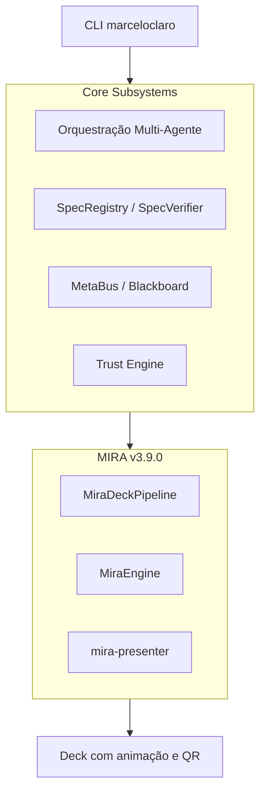
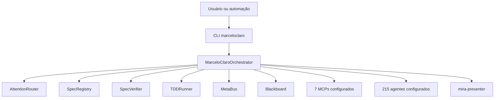
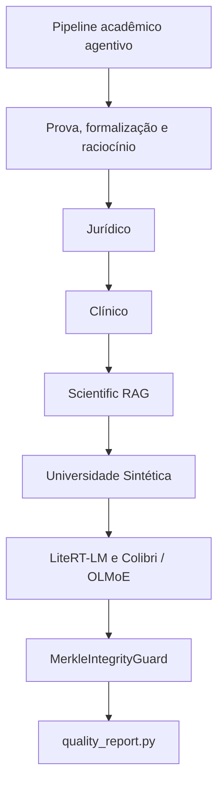
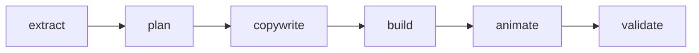
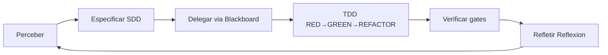
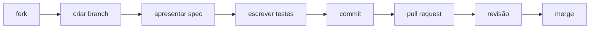

<div align="center">

<a href="https://github.com/MarceloClaro">
  
</a>

# 🧠 OpenCode Ecosystem Core

### Ecossistema de Orquestração Multi‑Agente para Pesquisa Científica, Automação e Metacognição

**Transformando dados em conhecimento, e conhecimento em ferramentas para a educação e a ciência aberta.**

[](https://github.com/MarceloClaro/opencode-ecosystem-core)
[](LICENSE)
[](https://www.python.org/)
[](ARCHITECTURE.md)
[](opencode.json)

**215 agentes** · **157 auto‑registrados no Blackboard (R596)** · **7 MCP servers** · **426+ ciclos de evolução** · **53 lições semânticas** · **7+ skills**

---

</div>

## 📑 Índice

- [Visão geral](#visão-geral)
- [Capacidades principais](#capacidades-principais)
- [Início rápido local](#início-rápido-local)
- [Instalação segura e procedência](#instalação-segura-e-procedência)
- [Uso básico](#uso-básico)
- [Arquitetura resumida](#arquitetura-resumida)
  - [Mapa da Arquitetura Completa (v3.9.0)](#mapa-da-arquitetura-completa-v390)
  - [Diagrama Operacional Atual](#diagrama-operacional-atual)
  - [Fluxos multiárea do checkout atual](#fluxos-multiárea-do-checkout-atual)
- [MIRA e apresentações](#apresentações-mira)
- [Limites de segurança e operação](#limites-de-segurança-e-operação)
- [Validação, contribuição e release](#validação-contribuição-e-release)
- [Documentação e licença](#documentação-e-licença)

---

## Visão geral

O **OpenCode Ecosystem Core** é um ecossistema de orquestração multi‑agente onde o orquestrador primário `marceloclaro` coordena **215 agentes especialistas** via **Blackboard (protocolo A2A)** com **memória metacognitiva compartilhada (MetaBus)**, **gates SDD/TDD estritos**, **economia de tokens** (stake/slashing · Trust Engine) e **7 MCP servers**.

Regra de ouro: **toda entrega nasce de uma especificação formal** (`specs/SPEC-*.md`) **e só é concluída com testes verdes e prova física** — jamais "parece que funciona".

## Capacidades principais

| Área | O que entrega |
|---|---|
| 🔬 **Pesquisa open science** | OpenAlex, Crossref, EuropePMC e arXiv (`open_science_only`), failover auditável e recibos |
| 🏭 **Fábrica de pesquisa** | `research_factory/`: pesquisar → revisar → analisar → agendar, com Reflexion |
| 🧮 **Raciocínio formal** | Z3, SymPy, Kanren, verificadores Lean 4 / E‑Graph / AlphaGeometry |
| 🎓 **Pipeline acadêmico** | Dissertações/artigos com rigor MASWOS, banca emulada (Reviewers 1–3), ABNT |
| 📽️ **MIRA** | Apresentações e slides com animação, QR codes e validação de terços |
| 🗣️ **Simulação social** | MiroFish‑Offline no Core: perfis determinísticos, rounds de opinião, sentimento e banca editorial — anti‑overclaim R110 |
| ⚖️🩺 **Jurídico & Clínico** | Apoio computacional auditável em domínios sensíveis; Médico Virtual Supremo v3.0 com `audit.status` fail‑closed e revisão humana obrigatória |
| 📚 **Produção editorial** | Trilogia de alfabetização (5 volumes + VolumeProfissional + CadernoMotor, R200‑R211) com fontes licenciadas e rastreio integrado de progressão |
| 🏆 **Estudo de raciocínio** | Benchmark pareado IMO 9×3 (R500‑R506), réplicas auditáveis e artigos ABNT/arXiv/arXiv‑PT |
| 📁 **Evidência de pesquisa** | Pesquisa real R522 (IA Generativa no Direito): manuscritos v20→v49, execução (OpenAlex + PDFs) e pacote de depósito OSF/Zenodo |
| 🌐 **Deploy estático** | GitHub Pages com verificação física (GET+Range, 404 real, marcador de conteúdo) |
| 🕸️ **Blackboard A2A vivo** | 157 Agent Cards do catálogo registrados automaticamente no boot (R596) — matching de capacidades real para CFP e roteamento |

---

## Início rápido local

```bash
git clone https://github.com/MarceloClaro/opencode-ecosystem-core.git
cd opencode-ecosystem-core
python3 -m venv .venv
.venv/bin/python -m pip install -r requirements.txt

# 1. Saúde do ambiente (specs, registro, memória)
.venv/bin/python -m marceloclaro.cli doctor

# 2. Ajuda guiada
.venv/bin/python -m marceloclaro.cli helpdesk

# 3. Pesquisa científica
.venv/bin/python -m marceloclaro.cli pesquisa "seu tema"

# 4. Eficiência por operação (mediana/p90 dos guards e tools MCP)
.venv/bin/python -m integrations.op_timing report      # ou /efficiency
```

---

## Instalação segura e procedência

> Instalação **local e revisável** — nada é executado por pipe de rede. A
> procedência combina versão imutável, commit Git e SHA-256 conferível.

Obtenha de um manifesto de versão revisado (independente do canal de download)
os valores a seguir, sem rótulos móveis:

| Dado | Formato exigido |
|---|---|
| `ECOSYSTEM_VERSION` | Tag ou identificador de versão imutável (ex.: `vX.Y.Z`). |
| `ECOSYSTEM_REF` | Commit Git completo com 40 caracteres hexadecimais. |
| `ECOSYSTEM_SOURCE_SHA256` | SHA-256 com 64 caracteres hexadecimais do TAR de origem. |
| `ProvisionSha256` | SHA-256 publicado do `provision.sh` do Windows/WSL. |
| `CommonInstallerSha256` | SHA-256 publicado de `installer/common/install_clis.sh`. |

```bash
export ECOSYSTEM_VERSION='<versao-imutavel>'
export ECOSYSTEM_REF='<commit-git-completo-com-40-caracteres>'
export ECOSYSTEM_SOURCE_SHA256='<sha-256-publicado-com-64-caracteres>'

git clone https://github.com/MarceloClaro/opencode-ecosystem-core.git opencode-ecosystem-core
cd opencode-ecosystem-core
git checkout --detach "$ECOSYSTEM_REF"
test "$(git rev-parse HEAD)" = "$ECOSYSTEM_REF"
test "$(git describe --tags --exact-match HEAD)" = "$ECOSYSTEM_VERSION"

git archive --format=tar "$ECOSYSTEM_REF" -o ../opencode-ecosystem-source.tar
printf '%s  %s\n' "$ECOSYSTEM_SOURCE_SHA256" "../opencode-ecosystem-source.tar" > ../opencode-ecosystem-source.tar.sha256
sha256sum -c ../opencode-ecosystem-source.tar.sha256
```

No macOS (Homebrew), use a variante `shasum -a 256 -c
../opencode-ecosystem-source.tar.sha256`. Sempre confira a versão com
`git describe --tags --exact-match HEAD` antes de instalar.

Após instalar, use **sempre** o interpretador do venv recém-criado:

```bash
source ~/opencode-ecosystem-core/.venv/bin/activate
python3 -m marceloclaro.cli helpdesk   # ou .venv/bin/python -m marceloclaro.cli doctor
```

**WSL2** (Windows 10/11): siga [installer/windows/README.md](installer/windows/README.md).
Detalhes, requisitos e solução de problemas: [installer/README.md](installer/README.md).

---

## Uso básico

| Comando | O que faz |
|---|---|
| `.venv/bin/python -m marceloclaro.cli` | Menu interativo principal |
| `.venv/bin/python -m marceloclaro.cli doctor` | Diagnóstico estrutural (20 checks) |
| `.venv/bin/python -m marceloclaro.cli helpdesk` | Ajuda guiada |
| `.venv/bin/python -m marceloclaro.cli pesquisa "tema"` | Pesquisa científica |
| `.venv/bin/python -m marceloclaro.cli agent-register` | Auto‑registro dos agentes no Blackboard (A2A) |
| `.venv/bin/python -m integrations.op_timing report` | Eficiência por operação |
| `.venv/bin/python -m integrations.opencode_cli --check` | Consistência da configuração |

Manual completo em linguagem simples: [MANUAL.md](MANUAL.md) · Guia do agente:
[CLAUDE.md](CLAUDE.md) · Primeiros passos: [quickstart.md](quickstart.md).

---

## Arquitetura resumida

Esta seção dá uma **visão resumida** do ecossistema: primeiro um **snapshot
histórico** (para preservar a documentação legada) e depois o **diagrama
operacional atual** do runtime observável no checkout. O snapshot histórico é
exatamente isso — um snapshot documental, **não é um inventário do checkout**.

### Mapa da Arquitetura Completa (v3.9.0)

> Snapshot histórico da arquitetura (v3.9.0), preservado como registro da
> evolução. É um **snapshot histórico / documental de uma época passada** e
> **não é um inventário do checkout** atual. A faixa documentada **R47–R127**
> registrou 85 ciclos de evolução (com o surgimento de `MiraDeckPipeline` e do
> agente `mira-presenter`).


```mermaid
flowchart TB
    subgraph Core [Core Subsystems]
        ORCH[Orquestração Multi‑Agente]
        SPEC[SpecRegistry / SpecVerifier]
        META[MetaBus / Blackboard]
        TRUST[Trust Engine]
    end
    subgraph MIRA[MIRA v3.9.0]
        PIPELINE[MiraDeckPipeline]
        ENGINE[MiraEngine]
        AGENT[mira-presenter]
    end
    CLI[CLI marceloclaro] --> Core
    Core --> MIRA
    MIRA --> DECK[Deck com animação e QR]
```

### Diagrama Operacional Atual

> Diagrama do runtime observável no checkout atual. Concentra-se nos
> componentes estruturalmente auditados; não lista todos os arquivos, classes
> auxiliares ou serviços opcionais do ecossistema.


```mermaid
flowchart TB
    Usuario2[Usuário ou automação] --> CLI2[CLI marceloclaro]
    CLI2 --> Orq2[MarceloClaroOrchestrator]
    Orq2 --> Router[AttentionRouter]
    Orq2 --> SpecRegistry2[SpecRegistry]
    Orq2 --> SpecVerifier2[SpecVerifier]
    Orq2 --> TDDRunner2[TDDRunner]
    Orq2 --> MetaBus2[MetaBus]
    Orq2 --> Blackboard2[Blackboard]
    Orq2 --> MCP2[7 MCPs configurados]
    Orq2 --> Agents2[215 agentes configurados]
    Orq2 --> Mira2[mira-presenter]
```

### Fluxos multiárea do checkout atual

| Área | Principais referências observáveis |
|---|---|
| Pipeline acadêmico agentivo | `agentic_science_v2/orchestrator.py`, `deep_research.py`, `review_agent.py`, `revision_agent.py`, `paper_composer.py` |
| Prova, formalização e raciocínio | `integrations/deepmind/formal_verifier.py`, `alphaproof_engine.py`, `aletheia_scaffold.py`, `deep_think_engine.py`, `autoformalizer.py`, `geometry_engine.py`, `lean4_verifier.py`, `egraph_rewriter.py`, `erdos_hirzebruch_solver.py` |
| Jurídico | `legal/integration.py`, `specializations.py`, `knowledge_base.py`, `precedents.py`, `datajud_client.py`, `benchmarks.py` |
| Clínico | `integrations/medical/clinical_game_theory.py`, `clinical_verifier.py`, `evidence_grounding.py`, `clinical_orchestrator_bridge.py` |
| Scientific RAG | `rag/scientific.py`, `rag/evolved.py`, `rag/enhanced_search_rag.py` |
| Universidade Sintética | `synthetic_university/core.py`, `combinatorial_engine.py`, `evolutionary_memory.py`, `mcp_server.py`, `api_gateway.py` |
| Runtime local | `integrations/litert_lm.py`, `litert_lm_provider.py`, `litert_lm_supervisor.py`, `integrations/colibri_provider.py` (LiteRT‑LM on‑device e Colibri / OLMoE) |
| Integridade e quality gates | `benchmarks/merkle_integrity_guard.py` (`MerkleIntegrityGuard`), `scripts/quality_report.py`, `installer/`, `benchmarks/scientific_reasoning/` |


```mermaid
flowchart TB
    ACAD[Pipeline acadêmico agentivo] --> PROVA[Prova, formalização e raciocínio]
    PROVA --> JUR[Jurídico]
    JUR --> CLIN[Clínico]
    CLIN --> RAG[Scientific RAG]
    RAG --> UNIV[Universidade Sintética]
    UNIV --> RT[LiteRT-LM e Colibri / OLMoE]
    RT --> INT[MerkleIntegrityGuard]
    INT --> QR[quality_report.py]
```

---

## Apresentações MIRA

> A documentação de ***MIRA*** é feita em **dupla leitura**: uma visão para o
> **leigo** (o que o subsistema entrega, em linguagem simples) e outra para o
> **PhD** (arquitetura e contratos técnicos). O subsistema é composto por
> `MiraDeckPipeline` (orquestra os estágios), `MiraEngine` (produz os artefatos
> visuais) e o agente delegável `mira-presenter` (SPEC-935-R126/R127).

**Visão leigo:** o MIRA transforma uma pasta com `manuscrito.md` em uma
apresentação navegável, com animações, QR codes e checagem dos terços.

**Visão PhD:** o pipeline é determinístico e auditável, com estágios explícitos
e um validador de conformidade do artefato final.

### Como funciona a apresentação MIRA

O processo percorre **6 estágios**:

1. **extract** — extrai estrutura e conteúdo do `manuscrito.md`;
2. **plan** — planeja a sequência de slides do deck;
3. **copywrite** — refina textos e mensagens visuais;
4. **build** — monta o deck em cards e seções navegáveis;
5. **animate** — gera as animações centrais de cada slide;
6. **validate** — valida conformidade e consistência final do deck.


```mermaid
flowchart LR
    A[extract] --> B[plan]
    B --> C[copywrite]
    C --> D[build]
    D --> E[animate]
    E --> F[validate]
```

A etapa final registra conformidade segundo regras internas; não avalia
externamente o mérito científico do manuscrito.

### Presentation On Storytelling — Act I — A Ilha de Agentes

O storytelling dos decks MIRA segue uma trilha de apresentação em atos. O
**Act I — A Ilha de Agentes** apresenta o ecossistema como um território
habitado por agentes especialistas que cooperam pelo Blackboard.

**Fluxograma Intuitivo:** um diagrama simples orienta o público leigo pelas
trocas entre orquestrador, agentes e memória metacognitiva, sem jargão.

**Arquitetura Técnica Multilateral:** para a plateia técnica, o mesmo fluxo é
desenhado com todas as camadas — entrada, orquestração, SDD/TDD, memória,
integrações e apresentação.

### Ciclo de Vida SDD / TDD

O ciclo de desenvolvimento é fechado (ver também a seção de validação):


```mermaid
flowchart LR
    P[Perceber] --> S[Especificar SDD]
    S --> D[Delegar via Blackboard]
    D --> T[TDD RED→GREEN→REFACTOR]
    T --> V[Verificar gates]
    V --> R[Refletir Reflexion]
    R --> P
```

- **SDD**: nenhuma entrega sem `specs/SPEC-*.md` com critérios de aceitação.
- **TDD**: testes primeiro (RED), implementação (GREEN), refatoração só com verde.
- **Gates**: `SpecVerifier` + Trust Engine; entrega reprovada gera slashing de stake.
- **Reflexion**: cada falha vira reflexão registrada **e lição semântica** no MetaBus.
- **Evolução**: cada ciclo relevante é ancorado no `EvolutionRegistry` (ada de custódia, hash e cadeia HMAC).

---

## Limites de segurança e operação

- **Acesso padrão `open_science_only`**: fontes OpenAlex, Crossref, EuropePMC e arXiv; serviços externos opcionais e auditáveis.
- **Sem pipe de rede**: instalação local e verificável; credenciais nunca em recibos/sandboxes.
- **Segredos protegidos**: o `credential_guard.sh` valida o token **sem imprimi‑lo**; `~/.git-credentials` nunca é commitado.
- **Resolvedores restritos** (ex.: sci‑hub) desabilitados por omissão; exigem autorização humana e base legal.
- **Domínios sensíveis** (clínico, jurídico, científico): agentes são **apoio computacional**, não decisores; os resultados **não substituem revisão humana**.
- **Anti‑overclaim estrutural**: alegações vedadas e **sem validação externa** ("Qualis A1", "verificado") **não são admitidas**; histórico em [CORRIGENDUM.md](CORRIGENDUM.md).
- **Métricas internas** (score de evolução, média móvel do score, contagens do doctor) **não gate** de mérito externo; são instrumentos de gestão do repositório.
- **Não é certificação**: métricas internas e auto‑score são observadas **localmente**, **não constituem certificação externa** e não atestam mérito editorial, científico ou de segurança para terceiros.
- Conforme [SECURITY.md](SECURITY.md): use Security Advisories para vulnerabilidades.

---

## Validação, contribuição e release

### Validação observada

> Os números abaixo são **fotografia da execução local** (SPEC-935-R448 e
> sucessoras) e **não constituem certificação externa**. Eles descrevem o que
> foi observado **na sua máquina** usando este checkout e o que ficou
> **disponíveis na sua máquina.** Uma nova revisão deve executar seus próprios
> gates. **O git não transforma as fontes encontradas em evidência já revisada.**

- Contratos documentais: `tests/test_r448_documentation_reconciliation.py`,
  `tests/test_r449_readme_release.py`, `tests/test_r455_readme_historico_operacional.py`.
- Recibo de validação local registrado em [VALIDATION_R448.md](VALIDATION_R448.md),
  incluindo **quatro subtestes aprovados.** e o gate **SPEC-935-R448**.
- Estado observado no último baseline completo (Linux WSL2, Python 3.14.4):
  `doctor` **18/20 checks** (0 falhas, 2 avisos de executores opcionais) e
  suíte **4.539 passed, 67 skipped**.
- Dependências de desenvolvimento: `.venv/bin/python -m pip install -r requirements-dev.txt`.

```bash
.venv/bin/python -m pip install -r requirements-dev.txt
.venv/bin/python -m pytest tests/ -q --tb=short --timeout=120
.venv/bin/python -m marceloclaro.cli doctor
```

### Contribuindo

Veja [CONTRIBUTING.md](CONTRIBUTING.md) para o fluxo completo (spec → testes →
PR, com `git diff --check` e `pytest`). O fluxo visual é:


```mermaid
flowchart LR
    fork[fork] --> branch[criar branch]
    branch --> spec[apresentar spec]
    spec --> test[escrever testes]
    test --> commit[commit]
    commit --> pr[pull request]
    pr --> review[revisão]
    review --> merge[merge]
```

Recibo de release exigido: `git describe --tags --exact-match HEAD` +
checksums publicados (`sha256sum -c` / `shasum -a 256 -c`).

### Vulnerabilidades

Consulte [SECURITY.md](SECURITY.md): use o canal privado de **Security
Advisories** e **não abra issue pública** para vulnerabilidades.

---

## Documentação e licença

| Documento | Para quem | Descrição |
|---|---|---|
| [QUICKSTART.md](quickstart.md) | Iniciantes | Primeiros passos rápidos |
| [MANUAL.md](MANUAL.md) | Todos | Uso completo da CLI, linguagem simples |
| [ARCHITECTURE.md](ARCHITECTURE.md) | Desenvolvedores | Arquitetura técnica, camadas, fluxos |
| [CLAUDE.md](CLAUDE.md) | Agentes | Manual de operação para agentes |
| [CONTRIBUTING.md](CONTRIBUTING.md) | Contribuidores | Como participar (spec → testes → PR) |
| [SECURITY.md](SECURITY.md) | Segurança | Vulnerabilidades e política |
| [CORRIGENDUM.md](CORRIGENDUM.md) | Histórico | Correções de alegações passadas |
| [CHANGELOG.md](CHANGELOG.md) | Mudanças | Versões anteriores |
| [VALIDATION_R448.md](VALIDATION_R448.md) | Auditoria | Recibo de validação local R448 |
| [LICENSE](LICENSE) | Legal | Licença MIT |
| [installer/README.md](installer/README.md) | Instalação | Procedimento Linux/macOS/WSL |
| [installer/windows/README.md](installer/windows/README.md) | Instalação | Procedimento Windows/WSL |

### Frentes de produção e conteúdo versionado

| Caminho | O que contém |
|---|---|
| [`livro-alfabetizacao/`](livro-alfabetizacao/) | Trilogia de alfabetização R200‑R211: volume1..5, VolumeProfissional, CadernoMotor, fontes escolares (licenças em `fontes/readme-fontes.md`), `dados_volumes.py`/`expandir_volume.py`/`rastreio_integrado.py` e `compilar.sh` |
| [`research/imo_study/`](research/imo_study/) | Estudo de raciocínio: benchmark pareado IMO 9×3, réplicas R500/R503/R504/R506, scripts e artigos em `artigo_abnt/`, `artigo_arxiv/`, `artigo_arxiv_pt/` (PDFs de build ignorados) |
| [`manuscrito_porescrito799_R522/`](manuscrito_porescrito799_R522/) | Pesquisa *IA generativa no Direito* (R522): manuscritos v20→v49 (docx/md), formulário de submissão, execução real (txt extraídos, JSONs OpenAlex, scripts) e pacote público de depósito OSF/Zenodo |
| [`pesquisa-artigo-qualis-a1/producao/ia-direito-educacao/`](pesquisa-artigo-qualis-a1/producao/ia-direito-educacao/) | Produção do artigo IA Direito & Educação: diagnóstico/gap (m0‑m1), protocolo de revisão (m2‑m3), manuscrito rascunho (m5) e auditoria de fontes (m7) |
| [`medicos/`](medicos/) | Plugin exportado Médico Virtual Supremo v0.4.0 (fonte da skill R‑205.v3): `plugin.json`, skill.md v3.0 "conselho‑longitudinal", referências e assets |
| [`banca_mestrado_educacao_campo.*`](banca_mestrado_educacao_campo.tex) | Banca simulada de mestrado em educação do campo (LaTeX + bib) e [`auditoria_referencias_tcc.md`](AUDITORIA_REFERENCIAS_TCC.md), auditoria de referências ABNT |
| [`landscape/`](landscape/) | Relatório e manifesto da paisagem "awesome‑llm‑apps" (curadoria SPEC R482/R521) |
| [`reversa_feynman/`](reversa_feynman/) | Gates de evidência, ledger, avaliação offline e calibração de router (método Feynman) |
| [`hermes_bridge/`](hermes_bridge/) | Bridge de memória e governança de skills: firewall de memória, contratos, trajetórias e adaptador de evidências |
| [`integrations/code_executor.py`](integrations/code_executor.py) | Execução de código para pipelines de agentes |
| [`integrations/free_model_catalog.py`](integrations/free_model_catalog.py) | Catálogo de modelos livres e provedores OpenCode |
| [`scripts/preprocess_docx.py`](scripts/preprocess_docx.py) | Normalização de docx → markdown (estrutura, cabeçalhos, tabelas) |

Links: [GitHub](https://github.com/MarceloClaro/opencode-ecosystem-core) ·
[HuggingFace Core](https://huggingface.co/datasets/marceloclaro/opencode-ecosystem-core) ·
[HuggingFace Research](https://huggingface.co/datasets/marceloclaro/opencode-research)

### Licença

Distribuído sob a [licença MIT](LICENSE).

---

<div align="center">

### Feito com carinho por [Marcelo Claro Laranjeira](https://github.com/MarceloClaro)

[](https://github.com/MarceloClaro)
[](https://orcid.org/0000-0001-8996-2887)
[](https://huggingface.co/datasets/marceloclaro/opencode-ecosystem-core)
[](LICENSE)

**[⬆ voltar ao topo](#-opencode-ecosystem-core)**

</div>