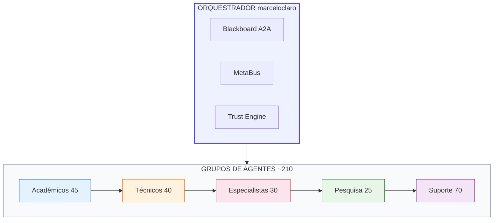

<div align="center">

<a href="https://github.com/MarceloClaro">
  
</a>

# 🧠 OpenCode Ecosystem Core

### Ecossistema de Orquestração Multi‑Agente para Pesquisa Científica, Automação e Metacognição

**Transformando dados em conhecimento, e conhecimento em ferramentas para a educação e a ciência aberta.**

[](https://github.com/MarceloClaro/opencode-ecosystem-core)
[](LICENSE)
[](https://www.python.org/)
[](ARCHITECTURE.md)
[](opencode.json)

**210 agentes** · **7 MCP servers** · **406 ciclos de evolução** · **51 lições semânticas** · **2 skills novas (frente R581–R582)**

---

</div>

## 📑 Índice

- [O que é](#-o-que-é)
- [🚀 Novidades — frentes R581/R582, R-976 e R-205.v3](#-novidades--frentes-r581r582-r-976-e-r-205v3)
- [⚡ Início rápido](#-início-rápido)
- [🏗️ Camadas do ecossistema](#️-camadas-do-ecossistema)
  - [1. Agentes e orquestração](#1-agentes-e-orquestração)
  - [2. Conectores MCP](#2-conectores-mcp)
  - [3. Skills](#3-skills)
  - [4. Hooks e guards](#4-hooks-e-guards)
  - [5. Plugins](#5-plugins)
- [🔁 Ciclo de vida SDD/TDD + Reflexion](#-ciclo-de-vida-sddtdd--reflexion)
- [📊 Observabilidade e eficiência](#-observabilidade-e-eficiência)
- [🧠 Memória e metacognição](#-memória-e-metacognição)
- [🔐 Segurança e limites](#-segurança-e-limites)
- [📦 Instalação](#-instalação)
- [📖 Documentação](#-documentação)
  - [Frentes de produção e conteúdo versionado](#frentes-de-produção-e-conteúdo-versionado)
- [🤝 Contribuindo](#-contribuindo)
- [📜 Licença](#-licença)

---

## 🧭 O que é

O **OpenCode Ecosystem Core** é um ecossistema de orquestração multi‑agente onde o orquestrador primário `marceloclaro` coordena **210 agentes especialistas** via **Blackboard (protocolo A2A)** com **memória metacognitiva compartilhada (MetaBus)**, **gates SDD/TDD estritos**, **economia de tokens** (stake/slashing · Trust Engine) e **7 MCP servers**.

Regra de ouro: **toda entrega nasce de uma especificação formal** (`specs/SPEC-*.md`) **e só é concluída com testes verdes e prova física** — jamais "parece que funciona".

### Capacidades principais

| Área | O que entrega |
|---|---|
| 🔬 **Pesquisa open science** | OpenAlex, Crossref, EuropePMC e arXiv (`open_science_only`), failover auditável e recibos |
| 🏭 **Fábrica de pesquisa** | `research_factory/`: pesquisar → revisar → analisar → agendar, com Reflexion |
| 🧮 **Raciocínio formal** | Z3, SymPy, Kanren, verificadores Lean 4 / E‑Graph / AlphaGeometry |
| 🎓 **Pipeline acadêmico** | Dissertações/artigos com rigor MASWOS, banca emulada (Reviewers 1–3), ABNT |
| 📽️ **MIRA** | Apresentações e slides com animação, QR codes e validação de terços |
| 🗣️ **Simulação social** | MiroFish‑Offline no Core: perfis determinísticos, rounds de opinião, sentimento e banca editorial — anti‑overclaim R110 |
| ⚖️🩺 **Jurídico & Clínico** | Apoio computacional auditável em domínios sensíveis; Médico Virtual Supremo v3.0 com `audit.status` fail‑closed e revisão humana obrigatória |
| 📚 **Produção editorial** | Trilogia de alfabetização (5 volumes + VolumeProfissional + CadernoMotor, R200‑R211) com fontes licenciadas e rastreio integrado de progressão |
| 🏆 **Estudo de raciocínio** | Benchmark pareado IMO 9×3 (R500‑R506), réplicas auditáveis e artigos ABNT/arXiv/arXiv‑PT |
| 📁 **Evidência de pesquisa** | Pesquisa real R522 (IA Generativa no Direito): manuscritos v20→v49, execução (OpenAlex + PDFs) e pacote de depósito OSF/Zenodo |
| 🌐 **Deploy estático** | GitHub Pages com verificação física (GET+Range, 404 real, marcador de conteúdo) |

---

## 🚀 Novidades — frentes R581/R582, R-976 e R-205.v3

> Lançadas nas frentes **SPEC-974** (ecossistema integrado e autônomo), **SPEC-975** (eficiência mensurável), **SPEC-976** (MiroFish‑Offline no Core) e **SPEC-935‑R205** (Médico Virtual Supremo).

| Entrega | O que mudou |
|---|---|
| 🪝 **Hooks de guarda** (`.opencode/hooks/`) | `credential_guard.sh` (token sem imprimir segredo), `js_smoke_dom.sh` (stub de DOM em Node — pega a classe de bug R580 que `node --check` não pega), `budget_guard.sh` (1 GB / 25 MiB por arquivo) — **fail‑closed** |
| 🧩 **Plugin `deploy-guards.ts`** | Gates automáticos em `edit`/`write` de `.html` e em `git push/commit` do site (dispara os hooks) |
| 🛰️ **MCP `web-deploy-mcp`** | `pages_status`, `probe_url` (GET+Range, nunca HEAD), `site_weight`, `validate_feed`, `assert_gone` — padrão fail‑closed SPEC‑970/971/972 |
| 📚 **Skills novas** | `deploy-estatico-github-pages`, `smoke-test-dom-js`, `mirofish-offline` (SPEC-976) e `medico-virtual-supremo` (v3.0) |
| 🗣️ **MiroFish‑Offline integrado** | `mirofish_simulate`, `banca_simulate` e cliente HTTP do backend AGPL canônico (`127.0.0.1:5001`) com health, autenticação e retry |
| 🏷️ **Normalização de aliases** | `normalize_institution_alias()`/`resolve_institution_name()` na banca: nomes como `educação/pucrs`, `rbe/anped` e `seqüência (ufsc)` resolvem sem perfil `?` (60 testes, R-976.22) |
| 🩺 **Médico Virtual Supremo v3.0** | Skill "conselho‑longitudinal" do plugin exportado (`medicos/`, gpt‑6ceee9… v0.4.0): 7 referências instrucionais, `list_references()`/`load_reference()` fail‑closed e `audit.status` em toda resposta (23 testes, R-205.v3) |
| 🧠 **Metacognição preenchida** | 51+ lições semânticas consultáveis no MetaBus (deploy/media/verification/registry/clinical) |
| 🔧 **Fix crítico** | `EvolutionRegistry._load` tolerante por entrada: 1 entrada malformada não zera mais os **419 ciclos** |
| 📦 **Produções versionadas** | 14 commits temáticos de conteúdo: trilogia de alfabetização (R200‑R211), estudo IMO (R500‑R506), evidência R522 com depósito OSF/Zenodo, plugin `medicos/` v0.4.0, hermes‑bridge, reversa‑feynman, landscape, integrações e scripts (ver *Documentação → Frentes de produção*) |
| ⏱️ **Eficiência mensurável** | `/efficiency` com mediana/p90 por operação — linha de base R582 medida |

---

## ⚡ Início rápido

```bash
git clone https://github.com/MarceloClaro/opencode-ecosystem-core.git
cd opencode-ecosystem-core

# 1. Saúde do ambiente (specs, registro de evolução, memória)
python3 -m marceloclaro.cli doctor

# 2. Ajuda guiada
python3 -m marceloclaro.cli helpdesk

# 3. Pesquisa científica
python3 -m marceloclaro.cli pesquisa "seu tema"

# 4. Eficiência por operação (mediana/p90 dos guards e tools MCP)
python3 -m integrations.op_timing report      # ou /efficiency
```

---

## 🏗️ Camadas do ecossistema

### 1. Agentes e orquestração


```mermaid
flowchart TB
    subgraph ORCH[ORQUESTRADOR marceloclaro]
        OR1[Blackboard A2A]
        OR2[MetaBus]
        OR3[Trust Engine]
    end

    subgraph GROUPS[GRUPOS DE AGENTES ~210]
        AC[Acadêmicos 45]
        TE[Técnicos 40]
        ES[Especialistas 30]
        RS[Pesquisa 25]
        SU[Suporte 70]
    end

    ORCH --> GROUPS
    AC --> TE --> ES --> RS --> SU

    style ORCH fill:#eef2ff,stroke:#4f46e5,stroke-width:2px
    style GROUPS fill:#f8fafc,stroke:#94a3b8,stroke-width:1px
    style AC fill:#e3f2fd,stroke:#1565c0
    style TE fill:#fff3e0,stroke:#ef6c00
    style ES fill:#fce4ec,stroke:#c62828
    style RS fill:#e8f5e9,stroke:#2e7d32
    style SU fill:#f3e5f5,stroke:#7b1fa2
```

Catálogo completo: [`agents/catalog/`](agents/catalog/) · Mapa detalhado: [`ARCHITECTURE.md`](ARCHITECTURE.md)

### 2. Conectores MCP

| Servidor | Ferramentas | Para quê |
|---|---|---|
| `litert-lm` | chat, models, status | Modelos on‑device (Gemma 4 / Qwen3) via LiteRT‑LM |
| `metacognitive-interconnect` | blackboard, memory, tasks | Memória compartilhada, postagem de tarefas A2A |
| `antigravity-bridge` | browser, search, image, RAG | Google DeepMind no pipeline |
| `pypi-search` | search, recommend, lookup | Curadoria de bibliotecas Python |
| `colibri-mcp` | generate, status | Geração local Colibri OLMoE |
| `scanners-mcp` | literary, scientific, rigor | 8 scanners de auditoria e Excelência (EXS) |
| **`web-deploy-mcp`** 🆕 | pages_status, probe_url, site_weight, validate_feed, assert_gone | Deploy/verificação GitHub Pages com prova física |

### 3. Skills

| Skill | Quando usar |
|---|---|
| `nano-orchestration` | Manuscritos de 30–500 laudas com modelos LiteRT‑LM on‑device |
| `pesquisa-artigo-qualis-a1` | TCC, dissertação, artigo, defesa — rigor metodológico e referências ativas |
| `pesquisador-universal-marcelo-claro` | Revisão sistemática, Evidence Graph, meta‑análise, GRADE |
| `deploy-estatico-github-pages` 🆕 | Publicar/verificar site estático no GitHub Pages (receita R569–R580) |
| `smoke-test-dom-js` 🆕 | Detectar bug de runtime JS inline (classe R580: `'num'` vs `'.num'`) |
| `mirofish-offline` 🆕 | Simulação de opinião pública multi‑agente (SPEC-976) e integração do backend AGPL por composição |
| `medico-virtual-supremo` 🆕 | Apoio clínico auditável v3.0 — invocação explícita obrigatória (alto risco, fail‑closed) |

### 4. Hooks e guards

> Fail‑closed: se o guard falhar, a operação **não** acontece — e o motivo é claro.

| Hook | Gatilho | Custo médio (baseline R582) |
|---|---|---|
| `credential_guard.sh` | commit/push no repo do site | **38,5 ms** |
| `budget_guard.sh` | push (peso 1 GB / 25 MiB) | **87,1 ms** |
| `js_smoke_dom.sh` | edição de `.html`/`.js` inline | **108,7 ms** |

### 5. Plugins

| Plugin | Papel |
|---|---|
| `litert-lm-provider.ts` | Registra `litert-lm` como provider nativo do OpenCode |
| `deploy-guards.ts` 🆕 | Conecta os hooks ao ciclo de vida (`tool.execute.before`, gates de `git push`) |

---

## 🔁 Ciclo de vida SDD/TDD + Reflexion


```mermaid
flowchart LR
    P[Perceber] --> S[Especificar SDD]
    S --> D[Delegar via Blackboard]
    D --> T[TDD RED→GREEN→REFACTOR]
    T --> V[Verificar gates]
    V --> R[Refletir Reflexion]
    R --> P

    style P fill:#eef2ff,stroke:#4f46e5
    style S fill:#e3f2fd,stroke:#1565c0
    style D fill:#fff3e0,stroke:#ef6c00
    style T fill:#e8f5e9,stroke:#2e7d32
    style V fill:#fce4ec,stroke:#c62828
    style R fill:#f3e5f5,stroke:#7b1fa2
```

- **SDD**: nenhuma entrega sem `specs/SPEC-*.md` com critérios de aceitação.
- **TDD**: testes primeiro (RED), implementação (GREEN), refatoração só com verde.
- **Gates**: `SpecVerifier` + Trust Engine; entrega reprovada gera slashing de stake.
- **Reflexion**: cada falha vira reflexão registrada **e lição semântica** no MetaBus.
- **Evolução**: cada ciclo relevante é ancorado no `EvolutionRegistry` (ada de custódia, hash e cadeia HMAC).

---

## 📊 Observabilidade e eficiência

| Recurso | Comando | O que mostra |
|---|---|---|
| Saúde do ecossistema | `python3 -m marceloclaro.cli doctor` | 20 checks (specs, registro, memória, gates) |
| Eficiência por operação | `python3 -m integrations.op_timing report` | mediana/p90 por op (`.mci_state/op_times.jsonl`) |
| Estado do registro | `python3 -m integrations.opencode_cli --check` | consistência do `opencode.json` (agentes/MCP/comandos) |

```bash
# exemplo de saída (baseline R582)
$ python3 -m integrations.op_timing report
op_timing: 9 medições, 0 falhas
  budget         n=3  mediana=   87.1 ms  p90=   87.1 ms
  credential     n=3  mediana=   38.5 ms  p90=   38.5 ms
  smoke          n=3  mediana=  108.7 ms  p90=  108.7 ms
```

---

## 🧠 Memória e metacognição

- **MetaBus** (`.mci_state/shared_memory.json`): reflexões episódicas + **lições semânticas consultáveis por tópico** (`mci_get_memory(topic=...)`).
- **Confidence Ledger**: EMA por domínio/tópico (calibração de confiança).
- **Anti‑overclaim estrutural**: alegações ("Qualis A1", "verificado") exigem validação externa; histórico em [`CORRIGENDUM.md`](CORRIGENDUM.md).
- Consulta direta:

```bash
python3 -c "
import sys; sys.path.insert(0,'.')
from mci.metabus import MetacognitiveMemory
m = MetacognitiveMemory()
print(m.extract_lessons('deploy'))   # lições da frente GitHub Pages
"
```

---

## 🔐 Segurança e limites

- **Acesso padrão `open_science_only`**: fontes OpenAlex, Crossref, EuropePMC e arXiv; serviços externos opcionais e auditáveis.
- **Sem pipe de rede**: instalação local e verificável; credenciais nunca em recibos/sandboxes.
- **Segredos protegidos**: o `credential_guard.sh` valida o token **sem imprimi‑lo**; `~/.git-credentials` nunca é commitado.
- **Resolvedores restritos** (ex.: sci‑hub) desabilitados por omissão; exigem autorização humana e base legal.
- **Domínios sensíveis** (clínico, jurídico, científico): agentes são **apoio computacional**, não decisores.
- **Não é certificação**: métricas internas e auto‑score são observadas no checkout, não validação externa.
- Conforme [`SECURITY.md`](SECURITY.md): use Security Advisories para vulnerabilidades.

---

## 📦 Instalação

> Instalação local e revisável — nada é executado por pipe de rede. Verifique sempre a integridade (`ECOSYSTEM_SOURCE_SHA256`).

```bash
# Windows (PowerShell como Administrador) → WSL
wsl --install -d Ubuntu

# Linux / macOS / WSL Ubuntu
curl -fsSL -o setup.sh https://raw.githubusercontent.com/MarceloClaro/opencode-ecosystem-core/main/setup.sh
bash setup.sh          # confira ECOSYSTEM_SOURCE_SHA256 publicada antes
```

Após instalar:

```bash
source ~/opencode-ecosystem-core/.venv/bin/activate
python3 -m marceloclaro.cli helpdesk
```

Detalhes, requisitos e solução de problemas: [`installer/README.md`](installer/README.md) · [`installer/windows/README.md`](installer/windows/README.md). Desinstalação completa no README do instalador.

---

## 📖 Documentação

| Documento | Para quem | Descrição |
|---|---|---|
| [`QUICKSTART.md`](QUICKSTART.md) | Iniciantes | Primeiros passos |
| [`MANUAL.md`](MANUAL.md) | Todos | Uso completo da CLI, linguagem simples |
| [`ARCHITECTURE.md`](ARCHITECTURE.md) | Desenvolvedores | Arquitetura técnica, camadas, fluxos |
| [`CLAUDE.md`](CLAUDE.md) | Agentes | Manual de operação para agentes |
| [`CONTRIBUTING.md`](CONTRIBUTING.md) | Contribuidores | Como participar (SPEC → testes → PR) |
| [`SECURITY.md`](SECURITY.md) | Segurança | Vulnerabilidades |
| [`CORRIGENDUM.md`](CORRIGENDUM.md) | Histórico | Correções de alegações passadas |
| [`CHANGELOG.md`](CHANGELOG.md) | Mudanças | Versões anteriores |

### Frentes de produção e conteúdo versionado

| Caminho | O que contém |
|---|---|
| [`livro-alfabetizacao/`](livro-alfabetizacao/) | Trilogia de alfabetização R200‑R211: Volume1..5, VolumeProfissional, CadernoMotor, fontes escolares (licenças em `fontes/README-FONTES.md`), `dados_volumes.py`/`expandir_volume.py`/`rastreio_integrado.py` e `compilar.sh` |
| [`research/imo_study/`](research/imo_study/) | Estudo de raciocínio: benchmark pareado IMO 9×3, réplicas R500/R503/R504/R506, scripts e artigos em `artigo_abnt/`, `artigo_arxiv/`, `artigo_arxiv_pt/` (PDFs de build ignorados) |
| [`manuscrito_porescrito799_R522/`](manuscrito_porescrito799_R522/) | Pesquisa *IA Generativa no Direito* (R522): manuscritos v20→v49 (DOCX/MD), formulário de submissão, execução real (txt extraídos, JSONs OpenAlex, scripts) e pacote público de depósito OSF/Zenodo |
| [`pesquisa-artigo-qualis-a1/producao/ia-direito-educacao/`](pesquisa-artigo-qualis-a1/producao/ia-direito-educacao/) | Produção do artigo IA Direito & Educação: diagnóstico/gap (M0‑M1), protocolo de revisão (M2‑M3), manuscrito rascunho (M5) e auditoria de fontes (M7) |
| [`medicos/`](medicos/) | Plugin exportado Médico Virtual Supremo v0.4.0 (fonte da skill R‑205.v3): `plugin.json`, SKILL.md v3.0 "conselho‑longitudinal", referências e assets |
| [`banca_mestrado_educacao_campo.*`](banca_mestrado_educacao_campo.tex) | Banca simulada de mestrado em Educação do Campo (LaTeX + bib) e [`AUDITORIA_REFERENCIAS_TCC.md`](AUDITORIA_REFERENCIAS_TCC.md), auditoria de referências ABNT |
| [`landscape/`](landscape/) | Relatório e manifesto da paisagem "awesome‑llm‑apps" (curadoria SPEC R482/R521) |
| [`reversa_feynman/`](reversa_feynman/) | Gates de evidência, ledger, avaliação offline e calibração de router (método Feynman) |
| [`hermes_bridge/`](hermes_bridge/) | Bridge de memória e governança de skills: firewall de memória, contratos, trajetórias e adaptador de evidências |
| [`integrations/code_executor.py`](integrations/code_executor.py) · `code_prompt.py` | Execução de código e templates de prompt para pipelines de agentes |
| [`integrations/free_model_catalog.py`](integrations/free_model_catalog.py) · `opencode_provider_models.json` | Catálogo de modelos livres e provedores OpenCode |
| [`scripts/preprocess_docx.py`](scripts/preprocess_docx.py) | Normalização de DOCX → markdown (estrutura, cabeçalhos, tabelas) |

Comandos úteis:

| Comando | O que faz |
|---|---|
| `python3 -m marceloclaro.cli` | Menu interativo principal |
| `python3 -m marceloclaro.cli doctor` | Diagnóstico do sistema |
| `python3 -m marceloclaro.cli helpdesk` | Ajuda guiada |
| `python3 -m marceloclaro.cli pesquisa "tema"` | Pesquisa científica |
| `python3 -m integrations.op_timing report` | Eficiência por operação |
| `python3 -m integrations.opencode_cli --check` | Consistência da config |

Dados da pesquisa (propostas e catálogo de datasets):

```bash
python3 -c "
import json
with open('data/research_proposals.json') as f:
    data = json.load(f)
for domain, info in data.items():
    print(f'{domain}: {len(info[\"proposals\"])} propostas')
"

python3 -c "
import json
with open('data/scientific_datasets_catalog.json') as f:
    data = json.load(f)
print(f'Total: {data[\"total_datasets\"]} datasets')
"
```

Links: [GitHub](https://github.com/MarceloClaro/opencode-ecosystem-core) · [HuggingFace Core](https://huggingface.co/datasets/marceloclaro/opencode-ecosystem-core) · [HuggingFace Research](https://huggingface.co/datasets/marceloclaro/opencode-research)

---

## 🤝 Contribuindo


```mermaid
flowchart LR
    FORK[Fork] --> BRANCH[Criar Branch]
    BRANCH --> SPEC[Apresentar SPEC]
    SPEC --> TEST[Escrever Testes]
    TEST --> COMMIT[Commit]
    COMMIT --> PR[Pull Request]
    PR --> REVIEW[Revisão]
    REVIEW --> MERGE[Merge]

    style FORK fill:#e3f2fd,stroke:#1565c0
    style BRANCH fill:#f3e5f5,stroke:#7b1fa2
    style SPEC fill:#e8f5e9,stroke:#2e7d32
    style TEST fill:#fff3e0,stroke:#ef6c00
    style COMMIT fill:#fce4ec,stroke:#c62828
    style PR fill:#e0f7fa,stroke:#00838f
    style REVIEW fill:#f1f8e9,stroke:#558b2f
    style MERGE fill:#e8f5e9,stroke:#2e7d32,stroke-width:3px
```

Validação da suíte:

```bash
.venv/bin/python -m pip install -r requirements-dev.txt
.venv/bin/python -m pytest tests/ -q --tb=short --timeout=120
.venv/bin/python -m marceloclaro.cli doctor
```

> Os números de validação são fotografia da execução local, **não certificação externa**. Recibo de release: `git describe --tags --exact-match HEAD` + checksums publicados.

---

## 📜 Licença

Distribuído sob a [Licença MIT](LICENSE).

---

<div align="center">

### Feito com carinho por [Marcelo Claro Laranjeira](https://github.com/MarceloClaro)

[](https://github.com/MarceloClaro)
[](https://orcid.org/0000-0001-8996-2887)
[](https://huggingface.co/datasets/marceloclaro/opencode-ecosystem-core)
[](LICENSE)

**[⬆ Voltar ao topo](#-opencode-ecosystem-core)**

</div>