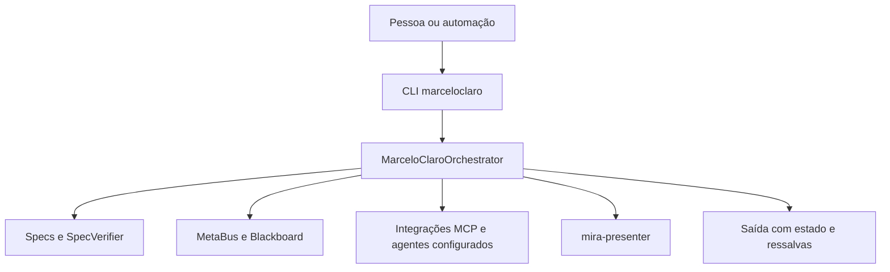
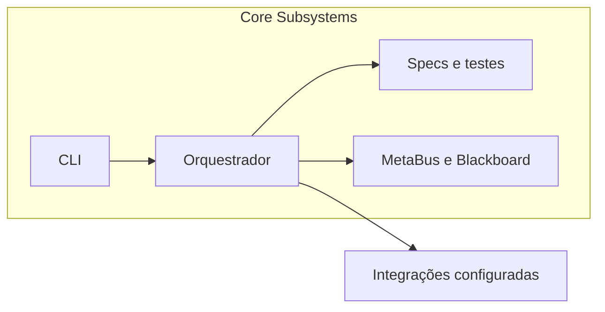
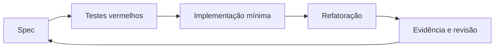
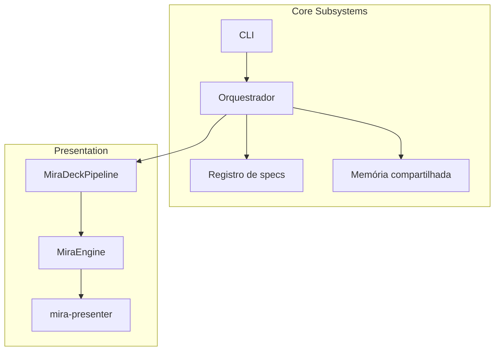

# OpenCode Ecosystem Core

Ecossistema Python para orquestração de tarefas, memória metacognitiva,
especificações SDD/TDD, integrações MCP e fluxos de pesquisa, produção e
apresentação. A entrada principal é a CLI `marceloclaro`.

> Este repositório descreve controles e resultados internos observados no
> checkout. Testes, hashes, diagnósticos e saídas de modelos não constituem
> certificação externa, garantia de resultado ou substituto para revisão humana
> em usos técnicos, científicos, clínicos ou jurídicos. Consulte também o
> [CORRIGENDUM.md](CORRIGENDUM.md).

## Visão geral

O núcleo organiza o ciclo **perceber → especificar → delegar → executar →
verificar → refletir**. Ele combina uma interface de linha de comando, um
registro de especificações, testes vinculados, memória compartilhada e
integrações locais configuradas em `opencode.json`.

| Pergunta | Caminho de consulta |
|---|---|
| Como usar a CLI? | [MANUAL.md](MANUAL.md) |
| Como as camadas se relacionam? | [ARCHITECTURE.md](ARCHITECTURE.md) |
| Como instalar com procedência? | [installer/README.md](installer/README.md) |
| Como instalar no Windows/WSL? | [installer/windows/README.md](installer/windows/README.md) |
| Quais ressalvas históricas existem? | [CORRIGENDUM.md](CORRIGENDUM.md) |

## Capacidades principais

| Capacidade | Função observável | Referência |
|---|---|---|
| Orquestração | Coordena tarefas, agentes, evidências e reflexões. | `marceloclaro/orchestrator.py` |
| SDD/TDD | Carrega specs e verifica critérios vinculados a testes. | `sdd/spec_engine.py`, `sdd/tdd_runner.py` |
| Memória e A2A | Mantém MetaBus, Blackboard e registros de reflexão. | `mci/` |
| CLI | Expõe diagnóstico, pesquisa, apresentação e comandos especializados. | `marceloclaro/cli.py` |
| Integrações | Declara servidores MCP e agentes no arquivo de configuração. | `opencode.json`, `integrations/` |
| Apresentações | Constrói decks MIRA a partir de uma pasta de produção. | `illustrations/` |
| Instalação | Oferece scripts locais com verificações de revisão, versão e hash. | `installer/` |

Em **2026-08-23**, a configuração consultada registrava **19 checks** no
`doctor`, **6 MCPs** e **209 agentes** em `opencode.json`. São contagens de
configuração, não agentes ativos, métricas de qualidade ou disponibilidade de
serviços. Confirme o estado no seu checkout:

```bash
python3 -m marceloclaro.cli doctor
python3 -c "import json; c=json.load(open('opencode.json', encoding='utf-8')); print({'mcps': len(c.get('mcp', {})), 'agentes': len(c.get('agent', {}))})"
```

Os MCPs declarados são `litert-lm`, `metacognitive-interconnect`,
`antigravity-bridge`, `pypi-search`, `colibri-mcp` e `scanners-mcp`. A presença
da configuração não assegura que dependências, modelos ou CLIs externas estejam
disponíveis na sua máquina.

## Início rápido local

Use uma virtualenv e o interpretador dela para evitar misturar dependências do
sistema com as do checkout:

```bash
git clone https://github.com/MarceloClaro/opencode-ecosystem-core.git
cd opencode-ecosystem-core
python3 -m venv .venv
.venv/bin/python -m pip install -r requirements.txt
.venv/bin/python -m marceloclaro.cli doctor
.venv/bin/python -m marceloclaro.cli helpdesk
```

O resultado `degraded` do `doctor` representa avisos encontrados no ambiente;
leia cada item antes de alterar instalações ou configurações. A matriz de CI
configurada em [`.github/workflows/ci.yml`](.github/workflows/ci.yml) executa
testes em Python 3.10 a 3.14; ela não substitui a conferência local de
compatibilidade do seu ambiente.

## Instalação segura e procedência

Não execute conteúdo obtido da rede diretamente em um interpretador. Antes de
instalar uma versão distribuída, obtenha de um manifesto revisado e independente
do canal de download:

1. `ECOSYSTEM_VERSION`: identificador de versão imutável;
2. `ECOSYSTEM_REF`: commit Git completo com 40 caracteres hexadecimais;
3. `ECOSYSTEM_SOURCE_SHA256`: hash SHA-256 publicado para o artefato a conferir.

Os marcadores abaixo **não são valores válidos de instalação**. Substitua-os
somente pelos dados publicados e revisados para a versão escolhida:

> Este checkout de desenvolvimento não publica por si só um manifesto, uma tag
> de release ou valores de integridade. Sem um manifesto assinado ou revisado
> pelo mantenedor para a versão escolhida, interrompa o procedimento em vez de
> transformar os marcadores em valores supostos.

```bash
export ECOSYSTEM_VERSION='<versao-imutavel>'
export ECOSYSTEM_REF='<commit-git-completo-com-40-caracteres>'
export ECOSYSTEM_SOURCE_SHA256='<sha-256-publicado-com-64-caracteres>'

git checkout --detach "$ECOSYSTEM_REF"
test "$(git rev-parse HEAD)" = "$ECOSYSTEM_REF"
test "$(git describe --tags --exact-match HEAD)" = "$ECOSYSTEM_VERSION"
git archive --format=tar "$ECOSYSTEM_REF" -o ../opencode-ecosystem-source.tar
printf '%s  %s\n' "$ECOSYSTEM_SOURCE_SHA256" "../opencode-ecosystem-source.tar" > ../opencode-ecosystem-source.tar.sha256
sha256sum -c ../opencode-ecosystem-source.tar.sha256
```

O comando `sha256sum` é o caminho usual em Linux. No macOS, se o manifesto foi
preparado com o formato aceito pela ferramenta local, use
`shasum -a 256 -c ../opencode-ecosystem-source.tar.sha256` ou siga o formato
publicado para o artefato selecionado.

Confira o procedimento integral em [installer/README.md](installer/README.md).
Os scripts de Linux e macOS devem ser chamados a partir do checkout local já
conferido. O caminho macOS depende de Homebrew e é best-effort; examine o log e
o `doctor` local após a execução.

### Windows e WSL2

O fluxo Windows requer WSL2, checkout local, uma revisão imutável e hashes
publicados para `installer/windows/provision.sh` e
`installer/common/install_clis.sh`. O wrapper PowerShell exige
`ProvisionSha256`, `CommonInstallerSha256` e `PathSafetySha256`; não invente
nem reutilize hashes de outra versão. Leia
[installer/windows/README.md](installer/windows/README.md) antes de abrir o
PowerShell como administrador.

Os scripts verificam bytes e propagam falhas, mas esta documentação não anuncia
uma execução E2E Windows elevada para cada ambiente. Confirme o resultado no
WSL e revise os arquivos locais antes de aceitar operações de instalação ou
remoção.

## Uso básico

Depois de instalar as dependências, prefira os comandos abaixo:

```bash
.venv/bin/python -m marceloclaro.cli
.venv/bin/python -m marceloclaro.cli status
.venv/bin/python -m marceloclaro.cli doctor
.venv/bin/python -m marceloclaro.cli helpdesk
.venv/bin/python -m marceloclaro.cli pesquisa "governança de IA" --max-papers 5 --no-download
.venv/bin/python -m marceloclaro.cli apresentacao caminho/da/producao
```

O menu interativo lista agentes, tarefas do Blackboard, memória, diagnóstico e
pesquisa. Para a lista de comandos, aliases, parâmetros e exemplos
especializados, use [MANUAL.md](MANUAL.md). O modo `--no-download` evita a
tentativa de baixar PDFs durante a pesquisa, mas não transforma as fontes
encontradas em evidência já revisada.

## Arquitetura resumida

### Fluxograma Intuitivo


```mermaid
flowchart TD
    U[Pessoa ou automação] --> C[CLI marceloclaro]
    C --> O[MarceloClaroOrchestrator]
    O --> S[Specs e SpecVerifier]
    O --> M[MetaBus e Blackboard]
    O --> I[Integrações MCP e agentes configurados]
    O --> MP[mira-presenter]
    O --> P[Saída com estado e ressalvas]
```

1. a entrada chega pela CLI ou integração;
2. o orquestrador recupera contexto e seleciona o fluxo aplicável;
3. uma spec pode vincular critérios a testes reais;
4. a execução produz estado, evidência e, quando aplicável, reflexão;
5. a pessoa responsável interpreta o resultado dentro dos limites do domínio.

Consulte [ARCHITECTURE.md](ARCHITECTURE.md) para responsabilidades de cada
camada, e `specs/` para contratos formais. `MerkleIntegrityGuard`, hashes e
testes ajudam a inspecionar artefatos específicos; não demonstram correção ou
segurança geral do repositório.

### Arquitetura Técnica Multilateral


```mermaid
flowchart LR
    subgraph Core [Core Subsystems]
        CLI[CLI]
        ORQ[Orquestrador]
        SDD[Specs e testes]
        MEM[MetaBus e Blackboard]
    end
    CLI --> ORQ
    ORQ --> SDD
    ORQ --> MEM
    ORQ --> EXT[Integrações configuradas]
```

### Ciclo de Vida SDD / TDD


```mermaid
flowchart LR
    SPEC[Spec] --> RED[Testes vermelhos]
    RED --> GREEN[Implementação mínima]
    GREEN --> REFACTOR[Refatoração]
    REFACTOR --> EVID[Evidência e revisão]
    EVID --> SPEC
```

### Mapa da Arquitetura Completa (v3.9.0)

Este mapa é um **snapshot histórico** de nomenclatura documental; não é um
inventário do checkout, dos agentes ativos ou de serviços disponíveis hoje.


```mermaid
flowchart TB
    subgraph Core [Core Subsystems]
        CLI2[CLI]
        ORQ2[Orquestrador]
        REG[Registro de specs]
        MEM2[Memória compartilhada]
    end
    subgraph Presentation [Presentation]
        PIPE[MiraDeckPipeline]
        ENGINE[MiraEngine]
        PRES[mira-presenter]
    end
    CLI2 --> ORQ2
    ORQ2 --> REG
    ORQ2 --> MEM2
    ORQ2 --> PIPE
    PIPE --> ENGINE
    ENGINE --> PRES
```

## Apresentações MIRA

O subsistema de apresentação transforma uma pasta de produção em um deck
navegável. Ele é uma rota de geração e revisão de artefatos, não uma garantia
de persuasão, acessibilidade ou correção do conteúdo inserido.

| Elemento | Registro para leigo | Registro PhD |
|---|---|---|
| `MiraDeckPipeline` | Organiza as etapas que transformam materiais em slides. | Coordena o pipeline de extração, planejamento, construção e validação de um deck. |
| `MiraEngine` | Reúne as ferramentas que montam a apresentação. | Expõe a camada de execução e composição dos artefatos MIRA. |
| `mira-presenter` | Ajuda a apresentar a sequência construída. | Representa o agente de apresentação registrado na arquitetura documental. |

### Como funciona a apresentação MIRA

1. **extract** reúne o briefing e fontes disponíveis na pasta informada;
2. **plan** organiza a sequência de slides e a mensagem principal;
3. **copywrite** revisa textos para leitura na interface;
4. **build** gera a estrutura visual do deck;
5. **animate** acrescenta animações quando configuradas;
6. **validate** verifica a consistência definida pelo pipeline antes de entrega.

Esses estágios descrevem o fluxo documentado; entradas, modelos e serviços
externos ainda podem falhar e exigem revisão humana do resultado.

### Presentation On Storytelling

#### Act I — A Ilha de Agentes

Este título preserva uma rota narrativa introduzida na documentação de
storytelling. Ele ilustra como agentes e ferramentas podem ser apresentados em
uma sequência compreensível, sem converter a metáfora em alegação de autonomia,
qualidade ou capacidade factual do sistema.

#### Notas históricas de navegação

O recorte **R47–R127** registrava **85** ciclos na documentação daquele
período. É um dado histórico, não a contagem atual do registro de evolução.
Também houve documentação que chamou `average_score` de **média móvel**; a
implementação deve ser consultada para a semântica vigente, e a métrica interna
é **não gate** de qualidade, aprovação ou certificação.

## Limites de segurança e operação

- **Modelos e agentes:** saídas podem estar incompletas, erradas ou depender de
  provedores indisponíveis. Revise-as antes de decidir ou publicar.
- **Provas formais:** resultados de AlphaProof, Aletheia e verificadores devem
  ser lidos pelo status retornado. Um fallback não provado ou pendente não é
  uma demonstração matemática geral.
- **Instaladores:** hashes e revisões diminuem o risco de bytes inesperados,
  mas não substituem revisão humana do script, do manifesto e do ambiente.
- **Domínios sensíveis:** os componentes clínicos, jurídicos e científicos são
  apoio computacional; não substituem profissional habilitado, dados primários
  ou revisão independente.
- **Serviços externos:** MCPs, modelos locais, binários e redes podem falhar,
  exigir configuração ou estar ausentes. O `doctor` relata o que foi detectado.

## Validação, contribuição e release

A `SPEC-935-R448` foi registrada como verde após o gate SDD com **18/18**
critérios e uma execução local vinculada à suíte. A execução R448 registrada
obteve **3.488 passed**, **70 skipped**, um aviso
e quatro subtestes aprovados. Esse resultado é reproduzível somente sob o
checkout, ambiente e dependências usados; não é certificação externa. O recibo
de escopo e comando está em [VALIDATION_R448.md](VALIDATION_R448.md).

As `SPEC-935-R450` a `SPEC-935-R452` também receberam evidência runtime local
para a suíte vinculada: **7/7**, **5/5** e **6/6** critérios, respectivamente.
O recibo separado preserva o ambiente, os comandos e as limitações da execução;
ele não transforma testes locais em certificação externa:
[VALIDATION_R452.md](VALIDATION_R452.md).

A `SPEC-935-R453` recebeu gate runtime local com **9/9** critérios após fechar
o scanner do índice, preflights de instaladores e limites SDD. A evidência
vinculada registrou **3.529 passed**, **70 skipped**, um aviso e quatro
subtestes aprovados. O recibo informa a correção de timeout e os riscos
residuais, sem alegar validação externa: [VALIDATION_R453.md](VALIDATION_R453.md).

Em `SPEC-935-R454`, as specs `SPEC-935-R447` a `SPEC-935-R453` foram migradas
para `criterion-runtime-v1`, vinculando cada critério a `pytest nodeids`
explícitos. A revalidação local observou **6/6**, **18/18**, **8/8**, **7/7**,
**5/5**, **6/6** e **9/9** critérios, sustentados por **6**, **34**, **9**,
**10**, **8**, **11** e **20 nodeids** aprovados, respectivamente. O recibo da
migração está em [VALIDATION_R454.md](VALIDATION_R454.md).

Execute os gates relevantes antes de propor uma mudança:

```bash
.venv/bin/python -m pip install -r requirements-dev.txt
.venv/bin/python -m pytest tests/ -q --tb=short --timeout=120
.venv/bin/python -m ruff check --select E4,E7,E9,F \
  sdd/spec_engine.py sdd/tdd_runner.py \
  integrations/deepmind/formal_verifier.py \
  integrations/deepmind/formal_safety_predicates.py \
  integrations/deepmind/alphaproof_engine.py \
  marceloclaro/orchestrator.py mci/self_correction.py publishing/production.py \
  tests/test_r448_hardening.py tests/test_r448_installer_security.py \
  tests/test_r448_sdd_contracts.py tests/test_r448_documentation_reconciliation.py
.venv/bin/python scripts/quality_report.py
git diff --check
```

A CI também valida a sintaxe dos instaladores e usa o manifesto de dependências
de desenvolvimento pinado. O relatório de qualidade é informativo; leia seu
escopo e seus achados, inclusive verificações de lint fora da superfície crítica
da CI.

Para contribuir, siga [CONTRIBUTING.md](CONTRIBUTING.md): associe a mudança a
uma spec, escreva ou atualize testes, preserve dados não relacionados e revise
o diff. Após a revisão humana e a aprovação dos checks aplicáveis, um
mantenedor pode criar um commit atômico e enviar a branch revisada ao remoto
configurado.
Para vulnerabilidades, siga [SECURITY.md](SECURITY.md) e não abra issue pública.

## Documentação e licença

| Documento | Finalidade |
|---|---|
| [MANUAL.md](MANUAL.md) | Uso da CLI, comandos e solução de problemas. |
| [ARCHITECTURE.md](ARCHITECTURE.md) | Camadas, responsabilidades e fontes técnicas. |
| [installer/README.md](installer/README.md) | Instalação local, Linux e macOS. |
| [installer/windows/README.md](installer/windows/README.md) | Procedimento Windows/WSL2. |
| [CONTRIBUTING.md](CONTRIBUTING.md) | Processo de contribuição e revisão. |
| [SECURITY.md](SECURITY.md) | Comunicação responsável de vulnerabilidades. |
| [CORRIGENDUM.md](CORRIGENDUM.md) | Correções e limites de alegações históricas. |
| [CHANGELOG.md](CHANGELOG.md) | Histórico de mudanças; métricas antigas não são estado atual. |
| [VALIDATION_R448.md](VALIDATION_R448.md) | Recibo local de validação R448 e seu escopo. |
| [VALIDATION_R452.md](VALIDATION_R452.md) | Recibo local de validação R450–R452 e seus limites. |
| [VALIDATION_R453.md](VALIDATION_R453.md) | Recibo local de validação R453 e riscos residuais. |
| [LICENSE](LICENSE) | Licença MIT. |

O código é distribuído sob a [licença MIT](LICENSE), sem garantias conforme o
texto da licença.
