<div align="center">


# MARCELO CLARO LARANJEIRA

### Professor de Geografia - Pedagogo - Desenvolvedor Cientifico

**55 seguidores - 66 seguindo - 310 contribuicoes**

[](https://github.com/MarceloClaro)
[](https://orcid.org/0000-0001-8996-2887)
[](https://bit.ly/geomaker)
[](https://maps.google.com/?q=Crateus+CE+Brasil)

---

**"Transformando dados em conhecimento, e conhecimento em ferramentas para a educacao e a ciencia aberta."**

</div>

---

# OpenCode Ecosystem Core

<div align="center">

### Ecossistema de Orquestracao Multi-Agente para Pesquisa Cientifica e Automacao


---

**205 Agentes** - **303 Specs** - **160 Propostas de Pesquisa** - **Auto-Score 97/100**

</div>

---

## Navegacao Completa do Ecossistema

### Primeiros Passos

| Secao | Descricao |
|---|---|
| [Instalacao One-Click](#instalacao-one-click) | Instale tudo com um unico comando |
| [Desinstalacao](#desinstalacao-total) | Remova tudo com um clique |
| [Primeiros Passos](#primeiros-passos) | Comece a usar agora |

### Arquitetura e Estrutura

| Secao | Descricao |
|---|---|
| [Visao Geral da Arquitetura](#visao-geral-da-arquitetura) | Como tudo se conecta |
| [Camadas Tecnicas](#camadas-tecnicas) | Estrutura interna do sistema |
| [Ciclo de Vida Completo](#ciclo-de-vida-completo) | Fluxo de uma tarefa do inicio ao fim |

### Fluxos de Trabalho

| Secao | Descricao |
|---|---|
| [Fluxo Principal](#fluxo-principal) | Perceber - Especificar - Delegar - Executar - Verificar - Refletir |
| [Decisao de Roteamento](#decisao-de-roteamento) | Como o sistema escolhe o agente certo |
| [Fluxo de uma Tarefa](#fluxo-de-uma-tarefa) | Passo a passo detalhado |

### Memoria e Conhecimento

| Secao | Descricao |
|---|---|
| [Sistema de Memoria](#sistema-de-memoria) | MetaBus, Blackboard e armazenamento |
| [Fluxo de Conhecimento](#fluxo-de-conhecimento) | Como informacoes fluem pelo sistema |
| [Aprendizado Continuo](#aprendizado-continuo) | Como o sistema evolui |

### SDD/TDD e Qualidade

| Secao | Descricao |
|---|---|
| [Ciclo SDD/TDD](#ciclo-sddtdd) | Desenvolvimento orientado por especificacao |
| [Quality Gates](#quality-gates) | Portoes de validacao |
| [Auditoria e Validacao](#auditoria-e-validacao) | Como garantimos qualidade |

### Pipeline Academico

| Secao | Descricao |
|---|---|
| [Pipeline Academico](#pipeline-academico) | Da ideia ao artigo publicado |
| [Busca de Literatura](#busca-de-literatura) | Como encontramos fontes |
| [Analise de Dados](#analise-de-dados) | Processamento e validacao |

### Agentes e Integracoes

| Secao | Descricao |
|---|---|
| [Mapa de Agentes](#mapa-de-agentes) | 205 especialistas organizados |
| [Integracoes MCP](#integracoes-mcp) | Conexoes externas |
| [Trust Engine](#trust-engine) | Sistema de confianca |

### Dados e Relatorios

| Secao | Descricao |
|---|---|
| [Dados Cientificos](#dados-cientificos) | 160 propostas e 243 datasets |
| [Metricas e Relatorios](#metricas-e-relatorios) | Como medimos sucesso |

---

## Instalacao One-Click

<div align="center">

### Windows

**Um unico comando no PowerShell (como Administrador):**

```powershell
wsl --install -d Ubuntu
```

Apos reiniciar, abra o **Ubuntu** e cole:

```bash
curl -sSL https://raw.githubusercontent.com/MarceloClaro/opencode-ecosystem-core/main/setup.sh | bash
```

### Linux / macOS

```bash
curl -sSL https://raw.githubusercontent.com/MarceloClaro/opencode-ecosystem-core/main/setup.sh | bash
```

### Apos a instalacao

```bash
source ~/opencode-ecosystem-core/.venv/bin/activate
python3 -m marceloclaro.cli helpdesk
```

</div>

---

## Desinstalacao Total

<div align="center">

### Remover apenas o ecossistema

```bash
curl -sSL https://raw.githubusercontent.com/MarceloClaro/opencode-ecosystem-core/main/uninstall.sh | bash
```

### Remover WSL do Windows (Tudo)

**PowerShell como Administrador:**

```powershell
wsl --unregister Ubuntu
dism.exe /online /disable-feature /featurename:Microsoft-Windows-Subsystem-Linux
dism.exe /online /disable-feature /featurename:VirtualMachinePlatform
```

</div>

---

## Primeiros Passos

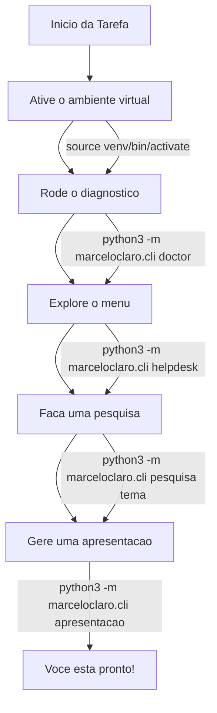
```mermaid
flowchart TD
    START["Inicio da Tarefa"] --> A1["Ative o ambiente virtual"]
    A1 --> A2["Rode o diagnostico"]
    A2 --> A3["Explore o menu"]
    A3 --> A4["Faca uma pesquisa"]
    A4 --> A5["Gere uma apresentacao"]

    A1 -->|"source venv/bin/activate"| A2
    A2 -->|"python3 -m marceloclaro.cli doctor"| A3
    A3 -->|"python3 -m marceloclaro.cli helpdesk"| A4
    A4 -->|"python3 -m marceloclaro.cli pesquisa tema"| A5
    A5 -->|"python3 -m marceloclaro.cli apresentacao"| DONE

    DONE["Voce esta pronto!"]
```

---

# Visao Geral da Arquitetura

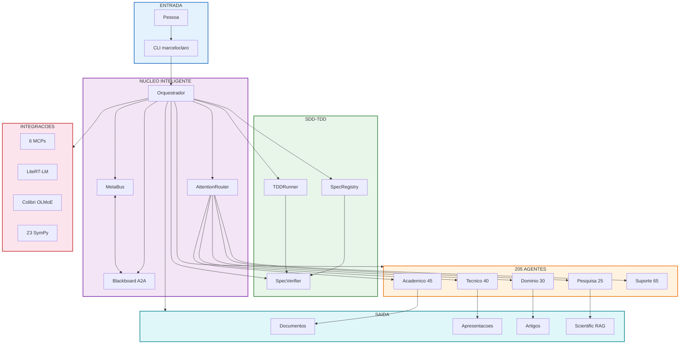
```mermaid
flowchart TB
    subgraph ENTRADA ["ENTRADA"]
        USER["Pessoa"]
        CLI["CLI marceloclaro"]
    end

    subgraph NUCLEO ["NUCLEO INTELIGENTE"]
        ORQ["Orquestrador"]
        ATT["AttentionRouter"]
        META["MetaBus"]
        BB["Blackboard A2A"]
    end

    subgraph SDDTDD ["SDD-TDD"]
        SPEC["SpecRegistry"]
        VER["SpecVerifier"]
        TDD["TDDRunner"]
    end

    subgraph AGENTES ["205 AGENTES"]
        ACAD["Academico 45"]
        TECH["Tecnico 40"]
        DOMAIN["Dominio 30"]
        RESEARCH["Pesquisa 25"]
        SUPPORT["Suporte 65"]
    end

    subgraph INTEGRACOES ["INTEGRACOES"]
        MCP["6 MCPs"]
        LITERT["LiteRT-LM"]
        COLIBRI["Colibri OLMoE"]
        Z3["Z3 SymPy"]
    end

    subgraph SAIDA ["SAIDA"]
        DOC["Documentos"]
        PRES["Apresentacoes"]
        PAPER["Artigos"]
        RAG["Scientific RAG"]
    end

    USER --> CLI
    CLI --> ORQ
    ORQ --> ATT
    ORQ --> META
    ORQ --> BB
    ORQ --> SPEC
    ORQ --> VER
    ORQ --> TDD
    ORQ --> AGENTES
    ORQ --> INTEGRACOES
    ORQ --> SAIDA

    META <--> BB
    SPEC --> VER
    TDD --> VER

    ATT --> ACAD
    ATT --> TECH
    ATT --> DOMAIN
    ATT --> RESEARCH
    ATT --> SUPPORT

    ACAD --> DOC
    TECH --> PRES
    DOMAIN --> PAPER
    RESEARCH --> RAG

    style ENTRADA fill:#e3f2fd,stroke:#1565c0,stroke-width:2px
    style NUCLEO fill:#f3e5f5,stroke:#7b1fa2,stroke-width:2px
    style SDDTDD fill:#e8f5e9,stroke:#2e7d32,stroke-width:2px
    style AGENTES fill:#fff3e0,stroke:#ef6c00,stroke-width:2px
    style INTEGRACOES fill:#fce4ec,stroke:#c62828,stroke-width:2px
    style SAIDA fill:#e0f7fa,stroke:#00838f,stroke-width:2px
```

---

## Camadas Tecnicas

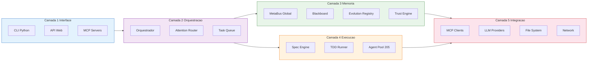
```mermaid
flowchart LR
    subgraph L1 ["Camada 1 Interface"]
        CLI2["CLI Python"]
        WEB["API Web"]
        MCP2["MCP Servers"]
    end

    subgraph L2 ["Camada 2 Orquestracao"]
        ORQ2["Orquestrador"]
        ROUTE["Attention Router"]
        QUEUE["Task Queue"]
    end

    subgraph L3 ["Camada 3 Memoria"]
        MB["MetaBus Global"]
        BB2["Blackboard"]
        EVO["Evolution Registry"]
        TRUST["Trust Engine"]
    end

    subgraph L4 ["Camada 4 Execucao"]
        SDD2["Spec Engine"]
        TDD2["TDD Runner"]
        AG2["Agent Pool 205"]
    end

    subgraph L5 ["Camada 5 Integracao"]
        MCP3["MCP Clients"]
        LLM["LLM Providers"]
        FS["File System"]
        NET["Network"]
    end

    L1 --> L2
    L2 --> L3
    L2 --> L4
    L3 --> L5
    L4 --> L5

    style L1 fill:#e3f2fd,stroke:#1565c0
    style L2 fill:#f3e5f5,stroke:#7b1fa2
    style L3 fill:#e8f5e9,stroke:#2e7d32
    style L4 fill:#fff3e0,stroke:#ef6c00
    style L5 fill:#fce4ec,stroke:#c62828
```

---

## Ciclo de Vida Completo

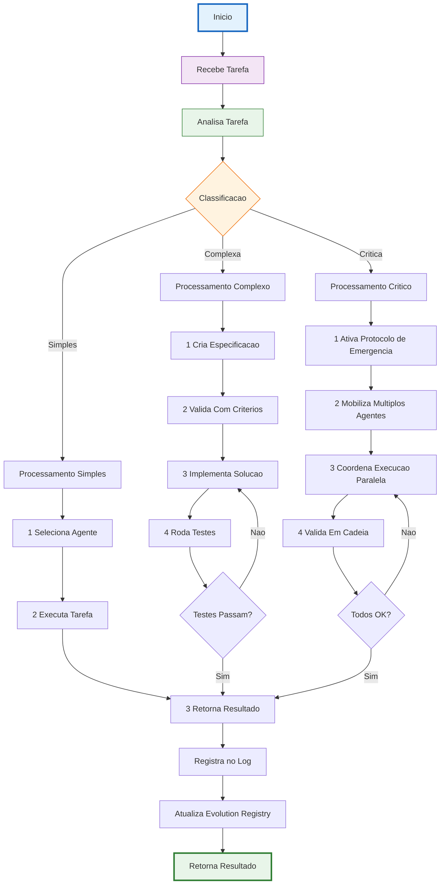
```mermaid
flowchart TD
    START2["Inicio"] --> REC["Recebe Tarefa"]
    REC --> PARSE["Analisa Tarefa"]
    PARSE --> CLASS{"Classificacao"}

    CLASS -->|"Simples"| SIMPLE["Processamento Simples"]
    CLASS -->|"Complexa"| COMPLEX["Processamento Complexo"]
    CLASS -->|"Critica"| CRITICAL["Processamento Critico"]

    SIMPLE --> S1["1 Seleciona Agente"]
    COMPLEX --> C1["1 Cria Especificacao"]
    CRITICAL --> CR1["1 Ativa Protocolo de Emergencia"]

    S1 --> S2["2 Executa Tarefa"]
    C1 --> C2["2 Valida Com Criterios"]
    CR1 --> CR2["2 Mobiliza Multiplos Agentes"]

    S2 --> S3["3 Retorna Resultado"]
    C2 --> C3["3 Implementa Solucao"]
    CR2 --> CR3["3 Coordena Execucao Paralela"]

    C3 --> C4["4 Roda Testes"]
    CR3 --> CR4["4 Valida Em Cadeia"]

    C4 --> C5{"Testes Passam?"}
    CR4 --> CR5{"Todos OK?"}

    C5 -->|Sim| S3
    C5 -->|Nao| C3

    CR5 -->|Sim| S3
    CR5 -->|Nao| CR3

    S3 --> LOG["Registra no Log"]
    LOG --> EVO2["Atualiza Evolution Registry"]
    EVO2 --> RETURN2["Retorna Resultado"]

    style START2 fill:#e3f2fd,stroke:#1565c0,stroke-width:3px
    style REC fill:#f3e5f5,stroke:#7b1fa2
    style PARSE fill:#e8f5e9,stroke:#2e7d32
    style CLASS fill:#fff3e0,stroke:#ef6c00
    style RETURN2 fill:#e8f5e9,stroke:#2e7d32,stroke-width:3px
```

---

# Fluxos de Trabalho

## Fluxo Principal

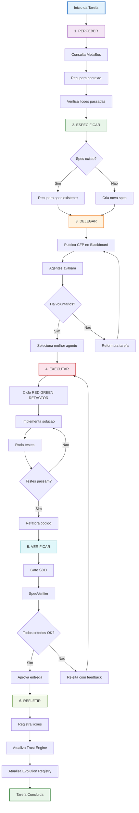
```mermaid
flowchart TD
    START3["Inicio da Tarefa"] --> P["1. PERCEBER"]

    P --> P1["Consulta MetaBus"]
    P1 --> P2["Recupera contexto"]
    P2 --> P3["Verifica licoes passadas"]
    P3 --> E["2. ESPECIFICAR"]

    E --> E1{"Spec existe?"}
    E1 -->|Sim| E2["Recupera spec existente"]
    E1 -->|Nao| E3["Cria nova spec"]
    E2 --> D["3. DELEGAR"]
    E3 --> D

    D --> D1["Publica CFP no Blackboard"]
    D1 --> D2["Agentes avaliam"]
    D2 --> D3{"Ha voluntarios?"}
    D3 -->|Sim| D4["Seleciona melhor agente"]
    D3 -->|Nao| D5["Reformula tarefa"]
    D5 --> D1

    D4 --> EX["4. EXECUTAR"]

    EX --> EX1["Ciclo RED GREEN REFACTOR"]
    EX1 --> EX2["Implementa solucao"]
    EX2 --> EX3["Roda testes"]
    EX3 --> EX4{"Testes passam?"}
    EX4 -->|Sim| EX5["Refatora codigo"]
    EX4 -->|Nao| EX2
    EX5 --> V["5. VERIFICAR"]

    V --> V1["Gate SDD"]
    V1 --> V2["SpecVerifier"]
    V2 --> V3{"Todos criterios OK?"}
    V3 -->|Sim| V4["Aprova entrega"]
    V3 -->|Nao| V5["Rejeita com feedback"]
    V5 --> EX

    V4 --> R["6. REFLETIR"]

    R --> R1["Registra licoes"]
    R1 --> R2["Atualiza Trust Engine"]
    R2 --> R3["Atualiza Evolution Registry"]
    R3 --> DONE3["Tarefa Concluida"]

    style START3 fill:#e3f2fd,stroke:#1565c0,stroke-width:3px
    style P fill:#f3e5f5,stroke:#7b1fa2
    style E fill:#e8f5e9,stroke:#2e7d32
    style D fill:#fff3e0,stroke:#ef6c00
    style EX fill:#fce4ec,stroke:#c62828
    style V fill:#e0f7fa,stroke:#00838f
    style R fill:#f1f8e9,stroke:#558b2f
    style DONE3 fill:#e8f5e9,stroke:#2e7d32,stroke-width:3px
```

---

## Decisao de Roteamento


```mermaid
flowchart TD
    TASK["Nova Tarefa"] --> CLASS2{"Classificacao"}

    CLASS2 -->|"Pesquisa cientifica"| ACAD2["Pipeline Academico"]
    CLASS2 -->|"Codigo programacao"| TECH2["Agente Tecnico"]
    CLASS2 -->|"Dominio especifico"| DOM2["Especialista"]
    CLASS2 -->|"Apresentacao"| PRES2["MIRA"]
    CLASS2 -->|"Formal matematico"| FORM2["Formal Verifier"]
    CLASS2 -->|"Documento texto"| TEXT2["Escritor"]
    CLASS2 -->|"Dados analise"| DATA2["Analista"]

    ACAD2 --> A21["Busca literatura"]
    ACAD2 --> A22["Coleta evidencias"]
    ACAD2 --> A23["Revisao por pares"]
    ACAD2 --> A24["Redacao do artigo"]

    TECH2 --> T21["Analisa codigo"]
    TECH2 --> T22["Implementa solucao"]
    TECH2 --> T23["Testa e valida"]
    TECH2 --> T24["Documenta"]

    DOM2 --> D21["Consulta especialista"]
    DOM2 --> D22["Aplica conhecimento"]
    DOM2 --> D23["Gera relatorio"]

    PRES2 --> P21["Extrai conteudo"]
    PRES2 --> P22["Planeja slides"]
    PRES2 --> P23["Constroi deck"]
    PRES2 --> P24["Valida consistencia"]

    FORM2 --> F21["Formaliza problema"]
    FORM2 --> F22["Gera prova"]
    FORM2 --> F23["Verifica com Z3"]

    TEXT2 --> TX21["Analisa audiencia"]
    TEXT2 --> TX22["Estrutura texto"]
    TEXT2 --> TX23["Revisa gramatica"]

    DATA2 --> DA21["Coleta dados"]
    DATA2 --> DA22["Analise estatistica"]
    DATA2 --> DA23["Gera visualizacoes"]

    style TASK fill:#e3f2fd,stroke:#1565c0,stroke-width:3px
    style CLASS2 fill:#f3e5f5,stroke:#7b1fa2
    style ACAD2 fill:#e8f5e9,stroke:#2e7d32
    style TECH2 fill:#fff3e0,stroke:#ef6c00
    style DOM2 fill:#fce4ec,stroke:#c62828
    style PRES2 fill:#e0f7fa,stroke:#00838f
    style FORM2 fill:#f1f8e9,stroke:#558b2f
    style TEXT2 fill:#f3e5f5,stroke:#7b1fa2
    style DATA2 fill:#e3f2fd,stroke:#1565c0
```

---

## Fluxo de uma Tarefa

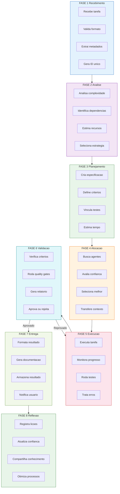
```mermaid
flowchart TD
    subgraph F1 ["FASE 1 Recebimento"]
        R1["Recebe tarefa"]
        R2["Valida formato"]
        R3["Extrai metadados"]
        R4["Gera ID unico"]
    end

    subgraph F2 ["FASE 2 Analise"]
        A1["Analisa complexidade"]
        A2["Identifica dependencias"]
        A3["Estima recursos"]
        A4["Seleciona estrategia"]
    end

    subgraph F3 ["FASE 3 Planejamento"]
        P1["Cria especificacao"]
        P2["Define criterios"]
        P3["Vincula testes"]
        P4["Estima tempo"]
    end

    subgraph F4 ["FASE 4 Alocacao"]
        AL1["Busca agentes"]
        AL2["Avalia confianca"]
        AL3["Seleciona melhor"]
        AL4["Transfere contexto"]
    end

    subgraph F5 ["FASE 5 Execucao"]
        E1["Executa tarefa"]
        E2["Monitora progresso"]
        E3["Roda testes"]
        E4["Trata erros"]
    end

    subgraph F6 ["FASE 6 Validacao"]
        V1["Verifica criterios"]
        V2["Roda quality gates"]
        V3["Gera relatorio"]
        V4["Aprova ou rejeita"]
    end

    subgraph F7 ["FASE 7 Entrega"]
        D1["Formata resultado"]
        D2["Gera documentacao"]
        D3["Armazena resultado"]
        D4["Notifica usuario"]
    end

    subgraph F8 ["FASE 8 Reflexao"]
        RE1["Registra licoes"]
        RE2["Atualiza confianca"]
        RE3["Compartilha conhecimento"]
        RE4["Otimiza processos"]
    end

    F1 --> F2
    F2 --> F3
    F3 --> F4
    F4 --> F5
    F5 --> F6
    F6 -->|"Aprovado"| F7
    F6 -->|"Reprovado"| F5
    F7 --> F8

    style F1 fill:#e3f2fd,stroke:#1565c0
    style F2 fill:#f3e5f5,stroke:#7b1fa2
    style F3 fill:#e8f5e9,stroke:#2e7d32
    style F4 fill:#fff3e0,stroke:#ef6c00
    style F5 fill:#fce4ec,stroke:#c62828
    style F6 fill:#e0f7fa,stroke:#00838f
    style F7 fill:#f1f8e9,stroke:#558b2f
    style F8 fill:#e8f5e9,stroke:#2e7d32
```

---

# Sistema de Memoria

## Visao Geral da Memoria

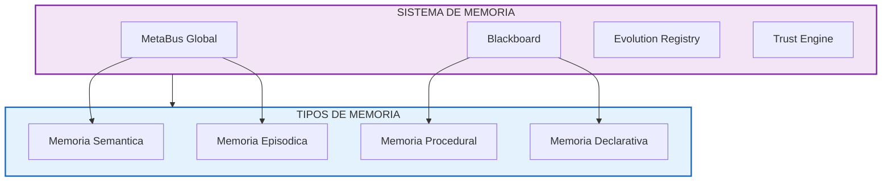
```mermaid
flowchart TB
    subgraph MEMORY ["SISTEMA DE MEMORIA"]
        MB2["MetaBus Global"]
        BB3["Blackboard"]
        EVO3["Evolution Registry"]
        TRUST2["Trust Engine"]
    end

    subgraph TIPOS ["TIPOS DE MEMORIA"]
        SEMANTIC["Memoria Semantica"]
        EPISODIC["Memoria Episodica"]
        PROCEDURAL["Memoria Procedural"]
        DECLARATIVE["Memoria Declarativa"]
    end

    MEMORY --> TIPOS

    MB2 --> SEMANTIC
    MB2 --> EPISODIC
    BB3 --> PROCEDURAL
    BB3 --> DECLARATIVE

    style MEMORY fill:#f3e5f5,stroke:#7b1fa2,stroke-width:2px
    style TIPOS fill:#e3f2fd,stroke:#1565c0,stroke-width:2px
```

---

## Fluxo de Conhecimento


```mermaid
flowchart TD
    subgraph INPUT ["ENTRADA"]
        USER2["Usuario"]
        AGENT["Agente"]
        EXT["Externo"]
    end

    subgraph PROCESS ["PROCESSAMENTO"]
        CAPTURE["Captura"]
        VALIDATE["Validacao"]
        ENRICH["Enriquecimento"]
        INDEX["Indexacao"]
    end

    subgraph STORE ["ARMAZENAMENTO"]
        MB3["MetaBus"]
        BB4["Blackboard"]
        VECTOR["Vector Store"]
        GRAPH["Knowledge Graph"]
    end

    subgraph RETRIEVE ["RECUPERACAO"]
        SEARCH["Busca Semantica"]
        RANK["Ranqueamento"]
        FILTER["Filtro"]
        CONTEXT["Contexto"]
    end

    subgraph OUTPUT ["SAIDA"]
        ANSWER["Resposta"]
        INSIGHT["Insight"]
        RECOMMEND["Recomendacao"]
        ACTION["Acao"]
    end

    INPUT --> PROCESS
    PROCESS --> STORE
    STORE --> RETRIEVE
    RETRIEVE --> OUTPUT

    USER2 --> CAPTURE
    AGENT --> CAPTURE
    EXT --> CAPTURE

    CAPTURE --> VALIDATE --> ENRICH --> INDEX
    INDEX --> MB3
    INDEX --> BB4
    INDEX --> VECTOR
    INDEX --> GRAPH

    MB3 --> SEARCH
    BB4 --> SEARCH
    VECTOR --> SEARCH
    GRAPH --> SEARCH

    SEARCH --> RANK --> FILTER --> CONTEXT
    CONTEXT --> ANSWER
    CONTEXT --> INSIGHT
    CONTEXT --> RECOMMEND
    CONTEXT --> ACTION

    style INPUT fill:#e3f2fd,stroke:#1565c0
    style PROCESS fill:#f3e5f5,stroke:#7b1fa2
    style STORE fill:#e8f5e9,stroke:#2e7d32
    style RETRIEVE fill:#fff3e0,stroke:#ef6c00
    style OUTPUT fill:#e0f7fa,stroke:#00838f
```

---

## Aprendizado Continuo

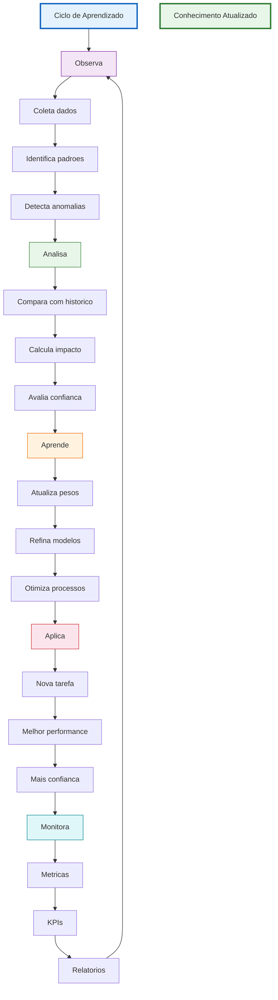
```mermaid
flowchart TD
    START4["Ciclo de Aprendizado"] --> OBSERVE["Observa"]

    OBSERVE --> O1["Coleta dados"]
    O1 --> O2["Identifica padroes"]
    O2 --> O3["Detecta anomalias"]
    O3 --> ANALYZE["Analisa"]

    ANALYZE --> A1["Compara com historico"]
    A1 --> A2["Calcula impacto"]
    A2 --> A3["Avalia confianca"]
    A3 --> LEARN["Aprende"]

    LEARN --> L1["Atualiza pesos"]
    L1 --> L2["Refina modelos"]
    L2 --> L3["Otimiza processos"]
    L3 --> APPLY["Aplica"]

    APPLY --> AP1["Nova tarefa"]
    AP1 --> AP2["Melhor performance"]
    AP2 --> AP3["Mais confianca"]
    AP3 --> MONITOR["Monitora"]

    MONITOR --> M1["Metricas"]
    M1 --> M2["KPIs"]
    M2 --> M3["Relatorios"]
    M3 --> OBSERVE

    DONE4["Conhecimento Atualizado"]

    style START4 fill:#e3f2fd,stroke:#1565c0,stroke-width:3px
    style OBSERVE fill:#f3e5f5,stroke:#7b1fa2
    style ANALYZE fill:#e8f5e9,stroke:#2e7d32
    style LEARN fill:#fff3e0,stroke:#ef6c00
    style APPLY fill:#fce4ec,stroke:#c62828
    style MONITOR fill:#e0f7fa,stroke:#00838f
    style DONE4 fill:#e8f5e9,stroke:#2e7d32,stroke-width:3px
```

---

# SDD/TDD e Qualidade

## Ciclo SDD/TDD

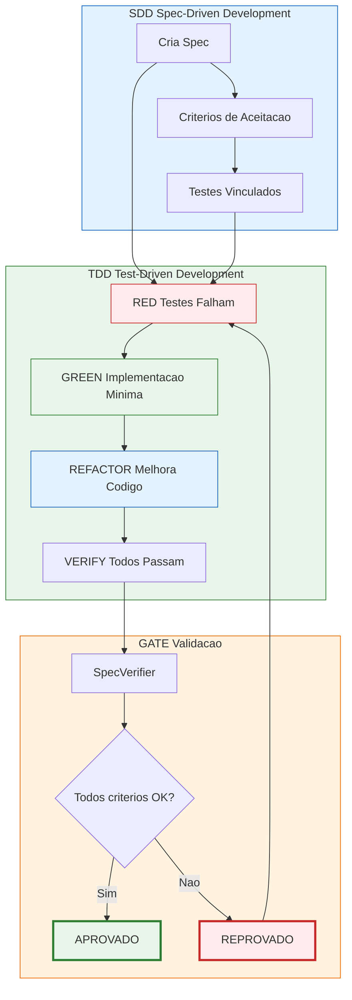
```mermaid
flowchart TD
    subgraph SDD ["SDD Spec-Driven Development"]
        SPEC1["Cria Spec"]
        SPEC1 --> CRIT["Criterios de Aceitacao"]
        CRIT --> TESTS["Testes Vinculados"]
    end

    subgraph TDD ["TDD Test-Driven Development"]
        RED["RED Testes Falham"]
        RED --> GREEN["GREEN Implementacao Minima"]
        GREEN --> REFACTOR["REFACTOR Melhora Codigo"]
        REFACTOR --> VERIFY["VERIFY Todos Passam"]
    end

    subgraph GATE ["GATE Validacao"]
        GATE1["SpecVerifier"]
        GATE1 --> CHECK{"Todos criterios OK?"}
        CHECK -->|Sim| APPROVE["APROVADO"]
        CHECK -->|Nao| REJECT["REPROVADO"]
        REJECT --> RED
    end

    SPEC1 --> RED
    TESTS --> RED
    VERIFY --> GATE1

    style SDD fill:#e3f2fd,stroke:#1565c0
    style TDD fill:#e8f5e9,stroke:#2e7d32
    style GATE fill:#fff3e0,stroke:#ef6c00
    style RED fill:#ffebee,stroke:#c62828
    style GREEN fill:#e8f5e9,stroke:#2e7d32
    style REFACTOR fill:#e3f2fd,stroke:#1565c0
    style APPROVE fill:#e8f5e9,stroke:#2e7d32,stroke-width:3px
    style REJECT fill:#ffebee,stroke:#c62828,stroke-width:3px
```

---

## Quality Gates

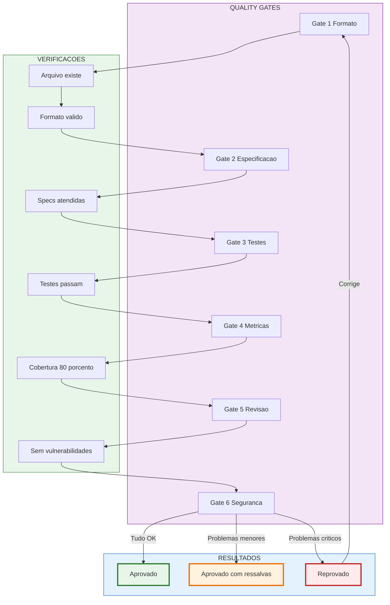
```mermaid
flowchart TD
    subgraph GATES ["QUALITY GATES"]
        G1["Gate 1 Formato"]
        G2["Gate 2 Especificacao"]
        G3["Gate 3 Testes"]
        G4["Gate 4 Metricas"]
        G5["Gate 5 Revisao"]
        G6["Gate 6 Seguranca"]
    end

    subgraph CHECKS ["VERIFICACOES"]
        C1["Arquivo existe"]
        C2["Formato valido"]
        C3["Specs atendidas"]
        C4["Testes passam"]
        C5["Cobertura 80 porcento"]
        C6["Sem vulnerabilidades"]
    end

    subgraph RESULTS ["RESULTADOS"]
        R1["Aprovado"]
        R2["Aprovado com ressalvas"]
        R3["Reprovado"]
    end

    G1 --> C1
    C1 --> C2
    C2 --> G2
    G2 --> C3
    C3 --> G3
    G3 --> C4
    C4 --> G4
    G4 --> C5
    C5 --> G5
    G5 --> C6
    C6 --> G6

    G6 -->|"Tudo OK"| R1
    G6 -->|"Problemas menores"| R2
    G6 -->|"Problemas criticos"| R3

    R3 -->|"Corrige"| G1

    style GATES fill:#f3e5f5,stroke:#7b1fa2
    style CHECKS fill:#e8f5e9,stroke:#2e7d32
    style RESULTS fill:#e3f2fd,stroke:#1565c0
    style R1 fill:#e8f5e9,stroke:#2e7d32,stroke-width:3px
    style R2 fill:#fff3e0,stroke:#ef6c00,stroke-width:3px
    style R3 fill:#ffebee,stroke:#c62828,stroke-width:3px
```

---

## Auditoria e Validacao

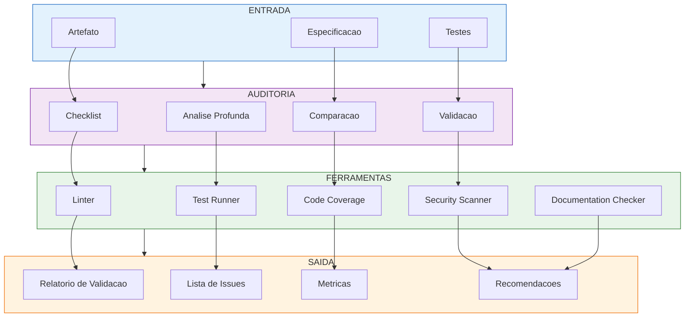
```mermaid
flowchart TD
    subgraph INPUT2 ["ENTRADA"]
        ARTIFACT["Artefato"]
        SPEC2["Especificacao"]
        TEST2["Testes"]
    end

    subgraph AUDIT ["AUDITORIA"]
        A1["Checklist"]
        A2["Analise Profunda"]
        A3["Comparacao"]
        A4["Validacao"]
    end

    subgraph TOOLS ["FERRAMENTAS"]
        T1["Linter"]
        T2["Test Runner"]
        T3["Code Coverage"]
        T4["Security Scanner"]
        T5["Documentation Checker"]
    end

    subgraph OUTPUT2 ["SAIDA"]
        O1["Relatorio de Validacao"]
        O2["Lista de Issues"]
        O3["Metricas"]
        O4["Recomendacoes"]
    end

    INPUT2 --> AUDIT
    AUDIT --> TOOLS
    TOOLS --> OUTPUT2

    ARTIFACT --> A1
    SPEC2 --> A3
    TEST2 --> A4

    A1 --> T1
    A2 --> T2
    A3 --> T3
    A4 --> T4

    T1 --> O1
    T2 --> O2
    T3 --> O3
    T4 --> O4
    T5 --> O4

    style INPUT2 fill:#e3f2fd,stroke:#1565c0
    style AUDIT fill:#f3e5f5,stroke:#7b1fa2
    style TOOLS fill:#e8f5e9,stroke:#2e7d32
    style OUTPUT2 fill:#fff3e0,stroke:#ef6c00
```

---

# Pipeline Academico

## Visao Geral do Pipeline


```mermaid
flowchart LR
    subgraph F1 ["Fase 1 Descoberta"]
        I["Ideia"]
        G["Gap de Pesquisa"]
        P["Proposta"]
    end

    subgraph F2 ["Fase 2 Pesquisa"]
        L["Revisao Literaria"]
        E["Coleta Dados"]
        M["Metodologia"]
    end

    subgraph F3 ["Fase 3 Analise"]
        A["Analise Estatistica"]
        V["Validacao"]
        R["Resultados"]
    end

    subgraph F4 ["Fase 4 Escrita"]
        D["Rascunho"]
        REV["Revisao"]
        F["Final"]
    end

    subgraph F5 ["Fase 5 Publicacao"]
        SUB["Submissao"]
        PR["Peer Review"]
        PUB["Publicacao"]
    end

    I --> G --> P
    P --> L --> E --> M
    M --> A --> V --> R
    R --> D --> REV --> F
    F --> SUB --> PR --> PUB

    style F1 fill:#e3f2fd,stroke:#1565c0
    style F2 fill:#f3e5f5,stroke:#7b1fa2
    style F3 fill:#e8f5e9,stroke:#2e7d32
    style F4 fill:#fff3e0,stroke:#ef6c00
    style F5 fill:#fce4ec,stroke:#c62828
```

---

## Busca de Literatura

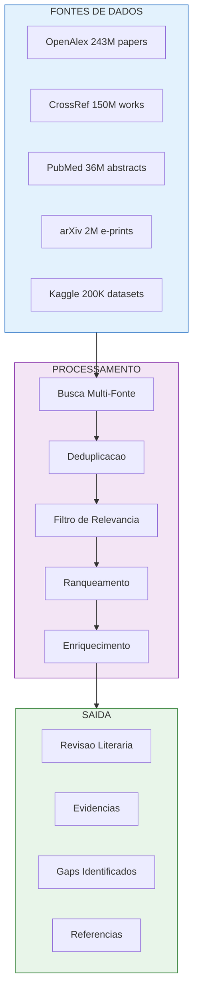
```mermaid
flowchart TD
    subgraph SOURCES ["FONTES DE DADOS"]
        OA["OpenAlex 243M papers"]
        CR["CrossRef 150M works"]
        PM["PubMed 36M abstracts"]
        AR["arXiv 2M e-prints"]
        KG["Kaggle 200K datasets"]
    end

    subgraph PROCESS ["PROCESSAMENTO"]
        SEARCH2["Busca Multi-Fonte"]
        DEDUP["Deduplicacao"]
        FILTER2["Filtro de Relevancia"]
        RANK2["Ranqueamento"]
        ENRICH2["Enriquecimento"]
    end

    subgraph OUTPUT3 ["SAIDA"]
        LIT["Revisao Literaria"]
        EVID["Evidencias"]
        GAP2["Gaps Identificados"]
        REF["Referencias"]
    end

    SOURCES --> SEARCH2
    SEARCH2 --> DEDUP
    DEDUP --> FILTER2
    FILTER2 --> RANK2
    RANK2 --> ENRICH2
    ENRICH2 --> OUTPUT3

    style SOURCES fill:#e3f2fd,stroke:#1565c0
    style PROCESS fill:#f3e5f5,stroke:#7b1fa2
    style OUTPUT3 fill:#e8f5e9,stroke:#2e7d32
```

---

## Analise de Dados

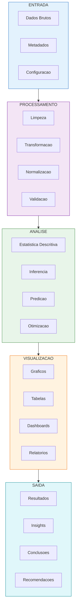
```mermaid
flowchart TD
    subgraph INPUT3 ["ENTRADA"]
        RAW["Dados Brutos"]
        META2["Metadados"]
        CONFIG["Configuracao"]
    end

    subgraph PROCESS2 ["PROCESSAMENTO"]
        CLEAN["Limpeza"]
        TRANSFORM["Transformacao"]
        NORMALIZE["Normalizacao"]
        VALIDATE2["Validacao"]
    end

    subgraph ANALYSIS ["ANALISE"]
        DESC["Estatistica Descritiva"]
        INFER["Inferencia"]
        PREDICT["Predicao"]
        OPTIMIZE["Otimizacao"]
    end

    subgraph VISUALIZATION ["VISUALIZACAO"]
        CHART["Graficos"]
        TABLE2["Tabelas"]
        DASHBOARD["Dashboards"]
        REPORT2["Relatorios"]
    end

    subgraph OUTPUT4 ["SAIDA"]
        RESULT["Resultados"]
        INSIGHT2["Insights"]
        CONCLUSION["Conclusoes"]
        RECOMMEND2["Recomendacoes"]
    end

    INPUT3 --> PROCESS2
    PROCESS2 --> ANALYSIS
    ANALYSIS --> VISUALIZATION
    VISUALIZATION --> OUTPUT4

    style INPUT3 fill:#e3f2fd,stroke:#1565c0
    style PROCESS2 fill:#f3e5f5,stroke:#7b1fa2
    style ANALYSIS fill:#e8f5e9,stroke:#2e7d32
    style VISUALIZATION fill:#fff3e0,stroke:#ef6c00
    style OUTPUT4 fill:#e0f7fa,stroke:#00838f
```

---

# Agentes e Integracoes

## Mapa de Agentes


```mermaid
flowchart TB
    subgraph ACADEMIC ["AGENTES ACADEMICOS 45"]
        A1["A00 Editor-Chefe PhD"]
        A2["A01 Escopo"]
        A3["A02 Busca"]
        A4["A03 Evidencias"]
        A5["A04 Estrutura"]
        A6["A05 Revisao"]
        A7["A06 Metodologia"]
        A8["A07 Estatistica"]
        A9["A08 Visualizacao"]
        A10["A09 Resultados"]
    end

    subgraph TECH ["AGENTES TECNICOS 40"]
        T1["C Coder"]
        T2["R Researcher"]
        T3["W Writer"]
        T4["V Reviewer"]
        T5["D Debugger"]
        T6["O Optimizer"]
        T7["A Architect"]
    end

    subgraph DOMAIN ["ESPECIALISTAS DE DOMINIO 30"]
        D1["Cardiologista"]
        D2["Neurologista"]
        D3["Radiologista"]
        D4["Educador"]
        D5["Juridico"]
        D6["Economista"]
    end

    subgraph RESEARCH ["AGENTES DE PESQUISA 25"]
        RE1["Literatura"]
        RE2["Dados"]
        RE3["Analise"]
        RE4["Redacao"]
        RE5["Validacao"]
    end

    subgraph SUPPORT ["AGENTES DE SUPORTE 65"]
        S1["Documentacao"]
        S2["Testes"]
        S3["Seguranca"]
        S4["Metricas"]
        S5["Deploy"]
        S6["Debug"]
    end

    ACADEMIC --> TECH
    TECH --> DOMAIN
    DOMAIN --> RESEARCH
    RESEARCH --> SUPPORT

    style ACADEMIC fill:#e3f2fd,stroke:#1565c0,stroke-width:2px
    style TECH fill:#fff3e0,stroke:#ef6c00,stroke-width:2px
    style DOMAIN fill:#fce4ec,stroke:#c62828,stroke-width:2px
    style RESEARCH fill:#e8f5e9,stroke:#2e7d32,stroke-width:2px
    style SUPPORT fill:#f3e5f5,stroke:#7b1fa2,stroke-width:2px
```

---

## Integracoes MCP

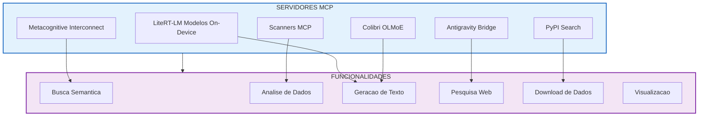
```mermaid
flowchart TB
    subgraph MCP_SERVERS ["SERVIDORES MCP"]
        LITERT2["LiteRT-LM Modelos On-Device"]
        META3["Metacognitive Interconnect"]
        ANTI["Antigravity Bridge"]
        PYPI["PyPI Search"]
        COLIBRI2["Colibri OLMoE"]
        SCANNER["Scanners MCP"]
    end

    subgraph FEATURES ["FUNCIONALIDADES"]
        F1["Busca Semantica"]
        F2["Analise de Dados"]
        F3["Geracao de Texto"]
        F4["Pesquisa Web"]
        F5["Download de Dados"]
        F6["Visualizacao"]
    end

    MCP_SERVERS --> FEATURES

    LITERT2 --> F3
    META3 --> F1
    ANTI --> F4
    PYPI --> F5
    COLIBRI2 --> F3
    SCANNER --> F2

    style MCP_SERVERS fill:#e3f2fd,stroke:#1565c0,stroke-width:2px
    style FEATURES fill:#f3e5f5,stroke:#7b1fa2,stroke-width:2px
```

---

## Trust Engine

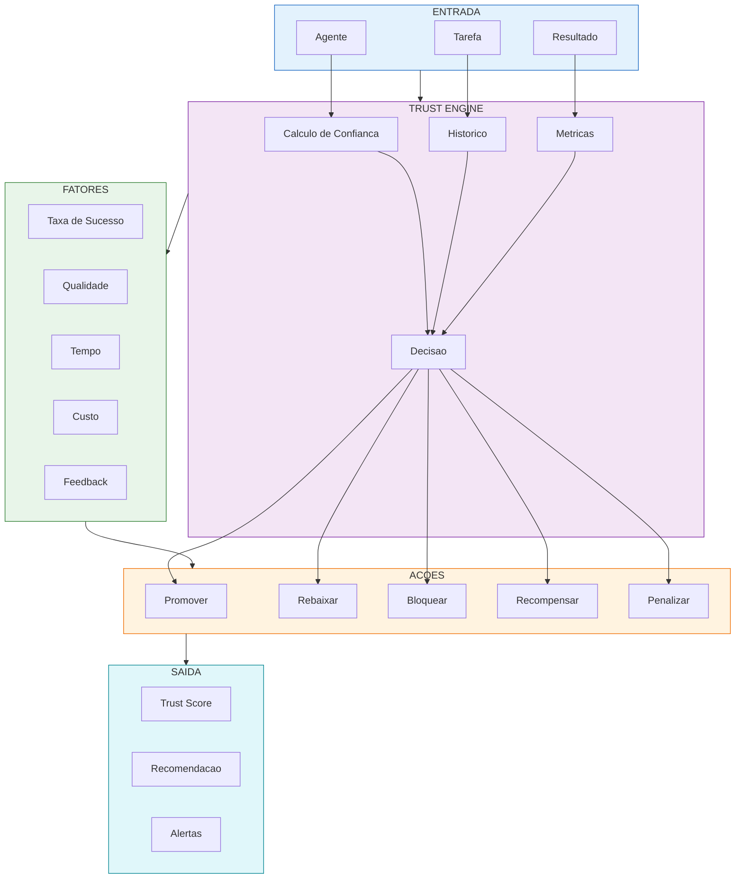
```mermaid
flowchart TD
    subgraph INPUT5 ["ENTRADA"]
        AGENT2["Agente"]
        TASK2["Tarefa"]
        RESULT2["Resultado"]
    end

    subgraph TRUST_ENGINE ["TRUST ENGINE"]
        CALC["Calculo de Confianca"]
        HISTORY["Historico"]
        METRICS2["Metricas"]
        DECISION["Decisao"]
    end

    subgraph FACTORS ["FATORES"]
        SUCESSO["Taxa de Sucesso"]
        QUALIDADE["Qualidade"]
        TEMPO["Tempo"]
        CUSTO["Custo"]
        FEEDBACK["Feedback"]
    end

    subgraph ACTIONS ["ACOES"]
        PROMOTE["Promover"]
        DEMOTE["Rebaixar"]
        BLOCK["Bloquear"]
        REWARD["Recompensar"]
        PENALIZE["Penalizar"]
    end

    subgraph OUTPUT5 ["SAIDA"]
        TRUST_SCORE["Trust Score"]
        RECOMMEND3["Recomendacao"]
        ALERT["Alertas"]
    end

    INPUT5 --> TRUST_ENGINE
    TRUST_ENGINE --> FACTORS
    FACTORS --> ACTIONS
    ACTIONS --> OUTPUT5

    AGENT2 --> CALC
    TASK2 --> HISTORY
    RESULT2 --> METRICS2

    CALC --> DECISION
    HISTORY --> DECISION
    METRICS2 --> DECISION

    DECISION --> PROMOTE
    DECISION --> DEMOTE
    DECISION --> BLOCK
    DECISION --> REWARD
    DECISION --> PENALIZE

    style INPUT5 fill:#e3f2fd,stroke:#1565c0
    style TRUST_ENGINE fill:#f3e5f5,stroke:#7b1fa2
    style FACTORS fill:#e8f5e9,stroke:#2e7d32
    style ACTIONS fill:#fff3e0,stroke:#ef6c00
    style OUTPUT5 fill:#e0f7fa,stroke:#00838f
```

---

# Dados e Metricas

## Dados Cientificos

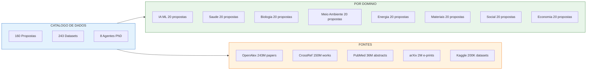
```mermaid
flowchart LR
    subgraph CATALOG ["CATALOGO DE DADOS"]
        PROP["160 Propostas"]
        DS["243 Datasets"]
        AG["8 Agentes PhD"]
    end

    subgraph DOMAINS ["POR DOMINIO"]
        AI["IA ML 20 propostas"]
        HEALTH["Saude 20 propostas"]
        BIO["Biologia 20 propostas"]
        ENV["Meio Ambiente 20 propostas"]
        ENERGY["Energia 20 propostas"]
        MATERIAL["Materiais 20 propostas"]
        SOCIAL["Social 20 propostas"]
        ECON["Economia 20 propostas"]
    end

    subgraph SOURCES2 ["FONTES"]
        OA2["OpenAlex 243M papers"]
        CR2["CrossRef 150M works"]
        PM2["PubMed 36M abstracts"]
        AR2["arXiv 2M e-prints"]
        KG2["Kaggle 200K datasets"]
    end

    CATALOG --> DOMAINS
    CATALOG --> SOURCES2

    style CATALOG fill:#e3f2fd,stroke:#1565c0
    style DOMAINS fill:#e8f5e9,stroke:#2e7d32
    style SOURCES2 fill:#fff3e0,stroke:#ef6c00
```

---

## Metricas e Relatorios

```mermaid
flowchart TD
    subgraph COLLECT ["COLETA"]
        C1["Logs"]
        C2["Timestamps"]
        C3["Sucessos"]
        C4["Falhas"]
        C5["Feedback"]
    end

    subgraph PROCESS3 ["PROCESSAMENTO"]
        P1["Agregacao"]
        P2["Analise"]
        P3["Deteccao de Padroes"]
        P4["Identificacao de Anomalias"]
    end

    subgraph VISUALIZE ["VISUALIZACAO"]
        V1["Graficos"]
        V2["Tabelas"]
        V3["Dashboards"]
        V4["Relatorios"]
    end

    subgraph INSIGHTS ["INSIGHTS"]
        I1["Tendencias"]
        I2["Alertas"]
        I3["Recomendacoes"]
        I4["Acoes"]
    end

    COLLECT --> PROCESS3
    PROCESS3 --> VISUALIZE
    VISUALIZE --> INSIGHTS

    style COLLECT fill:#e3f2fd,stroke:#1565c0
    style PROCESS3 fill:#f3e5f5,stroke:#7b1fa2
    style VISUALIZE fill:#e8f5e9,stroke:#2e7d32
    style INSIGHTS fill:#fff3e0,stroke:#ef6c00
```

---

## Comandos Uteis

<div align="center">

| Comando | O que faz | Nivel |
|---|---|---|
| `python3 -m marceloclaro.cli` | Menu interativo principal | Iniciante |
| `python3 -m marceloclaro.cli doctor` | Diagnostico do sistema | Iniciante |
| `python3 -m marceloclaro.cli helpdesk` | Ajuda guiada | Iniciante |
| `python3 -m marceloclaro.cli status` | Status do ecossistema | Intermediario |
| `python3 -m marceloclaro.cli pesquisa "tema"` | Pesquisa cientifica | Intermediario |
| `python3 -m marceloclaro.cli apresentacao /caminho` | Gerar apresentacao | Avancado |

</div>

---

## Documentacao

<div align="center">

| Documento | Para quem | Descricao |
|---|---|---|
| [QUICKSTART.md](QUICKSTART.md) | Iniciantes | Primeiros passos |
| [MANUAL.md](MANUAL.md) | Todos | Uso completo da CLI |
| [ARCHITECTURE.md](ARCHITECTURE.md) | Desenvolvedores | Arquitetura tecnica |
| [CONTRIBUTING.md](CONTRIBUTING.md) | Contribuidores | Como participar |
| [SECURITY.md](SECURITY.md) | Seguranca | Vulnerabilidades |
| [CORRIGENDUM.md](CORRIGENDUM.md) | Historico | Correcoes passadas |
| [CHANGELOG.md](CHANGELOG.md) | Mudancas | Versoes anteriores |

</div>

---

## Links Importantes

<div align="center">

| Recurso | URL |
|---|---|
| GitHub | [github.com/MarceloClaro/opencode-ecosystem-core](https://github.com/MarceloClaro/opencode-ecosystem-core) |
| HuggingFace Core | [huggingface.co/datasets/marceloclaro/opencode-ecosystem-core](https://huggingface.co/datasets/marceloclaro/opencode-ecosystem-core) |
| HuggingFace Research | [huggingface.co/datasets/marceloclaro/opencode-research](https://huggingface.co/datasets/marceloclaro/opencode-research) |
| Licenca MIT | [LICENSE](LICENSE) |

</div>

---

## Limites Importantes

<div align="center">

| Limite | Descricao |
|---|---|
| Nao e certificacao | Resultados sao observados no checkout, nao validados externamente |
| Revisao humana | Agentes sao ferramentas, nao decisores autonomos |
| Dominios sensiveis | Clinico, juridico e cientifico sao apoio computacional |
| Servicos externos | MCPs e modelos podem falhar ou estar indisponiveis |
| Metricas internas | Auto-score e interno, nao certificacao externa |

</div>

---

## Contribuindo

```mermaid
flowchart LR
    FORK["Fork"] --> BRANCH["Criar Branch"]
    BRANCH --> CODE["Escrever Codigo"]
    CODE --> TEST["Rodar Testes"]
    TEST --> COMMIT["Commit"]
    COMMIT --> PR["Pull Request"]
    PR --> REVIEW["Revisao"]
    REVIEW --> MERGE["Merge"]

    style FORK fill:#e3f2fd,stroke:#1565c0
    style BRANCH fill:#f3e5f5,stroke:#7b1fa2
    style CODE fill:#e8f5e9,stroke:#2e7d32
    style TEST fill:#fff3e0,stroke:#ef6c00
    style COMMIT fill:#fce4ec,stroke:#c62828
    style PR fill:#e0f7fa,stroke:#00838f
    style REVIEW fill:#f1f8e9,stroke:#558b2f
    style MERGE fill:#e8f5e9,stroke:#2e7d32,stroke-width:3px
```

---

## Licenca

Este projeto e licenciado sob a [Licenca MIT](LICENSE).

---

<div align="center">

### Feito com carinho por [Marcelo Claro Laranjeira](https://github.com/MarceloClaro)

[](https://github.com/MarceloClaro)
[](https://huggingface.co/datasets/marceloclaro/opencode-ecosystem-core)
[](LICENSE)

**[Voltar ao topo](#-opencode-ecosystem-core)**

</div>
