<div align="center">


# MARCELO CLARO LARANJEIRA

### Professor de Geografia · Pedagogo · Desenvolvedor Científico

**55 seguidores · 66 seguindo · 310 contribuições**

[](https://github.com/MarceloClaro)
[](https://orcid.org/0000-0001-8996-2887)
[](https://bit.ly/geomaker)
[](https://maps.google.com/?q=Crate%C3%BAs+CE+Brasil)

---

**"Transformando dados em conhecimento, e conhecimento em ferramentas para a educação e a ciência aberta."**

</div>

---

# 🧠 OpenCode Ecosystem Core

<div align="center">

### Ecossistema de Orquestração Multi-Agente para Pesquisa Científica e Automação


---

**205 Agentes** · **303 Specs** · **160 Propostas de Pesquisa** · **Auto-Score 97/100**

</div>

---

## 📑 Navegação Completa do Ecossistema

<div align="center">

### 🚀 Primeiros Passos
| Seção | Descrição |
|---|---|
| [🚀 Instalação One-Click](#-instalação-one-click) | Instale tudo com um único comando |
| [🗑️ Desinstalação](#-desinstalação-total) | Remova tudo com um clique |
| [⚡ Primeiros Passos](#-primeiros-passos) | Comece a usar agora |

### 🏗️ Arquitetura e Estrutura
| Seção | Descrição |
|---|---|
| [🏗️ Visão Geral da Arquitetura](#-visão-geral-da-arquitetura) | Como tudo se conecta |
| [🧱 Camadas Técnicas](#-camadas-técnicas) | Estrutura interna do sistema |
| [🔄 Ciclo de Vida Completo](#-ciclo-de-vida-completo) | Fluxo de uma tarefa do início ao fim |

### ⚡ Fluxos de Trabalho
| Seção | Descrição |
|---|---|
| [⚡ Fluxo Principal](#-fluxo-principal) | Perceber → Especificar → Delegar → Executar → Verificar → Refletir |
| [🎯 Decisão de Roteamento](#-decisão-de-roteamento) | Como o sistema escolhe o agente certo |
| [📋 Fluxo de uma Tarefa](#-fluxo-de-uma-tarefa) | Passo a passo detalhado |

### 🧠 Memória e Conhecimento
| Seção | Descrição |
|---|---|
| [🧠 Sistema de Memória](#-sistema-de-memória) | MetaBus, Blackboard e armazenamento |
| [📚 Fluxo de Conhecimento](#-fluxo-de-conhecimento) | Como informações fluem pelo sistema |
| [🔄 Aprendizado Contínuo](#-aprendizado-contínuo) | Como o sistema evolui |

### 📝 SDD/TDD e Qualidade
| Seção | Descrição |
|---|---|
| [📝 Ciclo SDD/TDD](#-ciclo-sddtdd) | Desenvolvimento orientado por especificação |
| [✅ Quality Gates](#-quality-gates) | Portões de validação |
| [🔍 Auditoria e Validação](#-auditoria-e-validação) | Como garantimos qualidade |

### 🔬 Pipeline Acadêmico
| Seção | Descrição |
|---|---|
| [🔬 Pipeline Acadêmico](#-pipeline-acadêmico) | Da ideia ao artigo publicado |
| [📚 Busca de Literatura](#-busca-de-literatura) | Como encontramos fontes |
| [📊 Análise de Dados](#-análise-de-dados) | Processamento e validação |

### 🤖 Agentes e Integrações
| Seção | Descrição |
|---|---|
| [🤖 Mapa de Agentes](#-mapa-de-agentes) | 205 especialistas organizados |
| [🔌 Integrações MCP](#-integrações-mcp) | Conexões externas |
| [🛡️ Trust Engine](#-trust-engine) | Sistema de confiança |

### 📊 Dados e Relatórios
| Seção | Descrição |
|---|---|
| [📊 Dados Científicos](#-dados-científicos) | 160 propostas e 243 datasets |
| [📈 Métricas e Relatórios](#-métricas-e-relatórios) | Como medimos sucesso |

</div>

---

## 🚀 Instalação One-Click

<div align="center">

### 🪟 Windows

**Um único comando no PowerShell (como Administrador):**

```powershell
wsl --install -d Ubuntu
```

Após reiniciar, abra o **Ubuntu** e cole:

```bash
curl -sSL https://raw.githubusercontent.com/MarceloClaro/opencode-ecosystem-core/main/setup.sh | bash
```

### 🐧 Linux / 🍎 macOS

```bash
curl -sSL https://raw.githubusercontent.com/MarceloClaro/opencode-ecosystem-core/main/setup.sh | bash
```

### ✅ Após a instalação

```bash
source ~/opencode-ecosystem-core/.venv/bin/activate
python3 -m marceloclaro.cli helpdesk
```

</div>

---

## 🗑️ Desinstalação Total

<div align="center">

### Remover apenas o ecossistema

```bash
curl -sSL https://raw.githubusercontent.com/MarceloClaro/opencode-ecosystem-core/main/uninstall.sh | bash
```

### Remover WSL do Windows (Tudo)

**PowerShell como Administrador:**

```powershell
wsl --unregister Ubuntu
dism.exe /online /disable-feature /featurename:Microsoft-Windows-Subsystem-Linux
dism.exe /online /disable-feature /featurename:VirtualMachinePlatform
```

</div>

---

## ⚡ Primeiros Passos

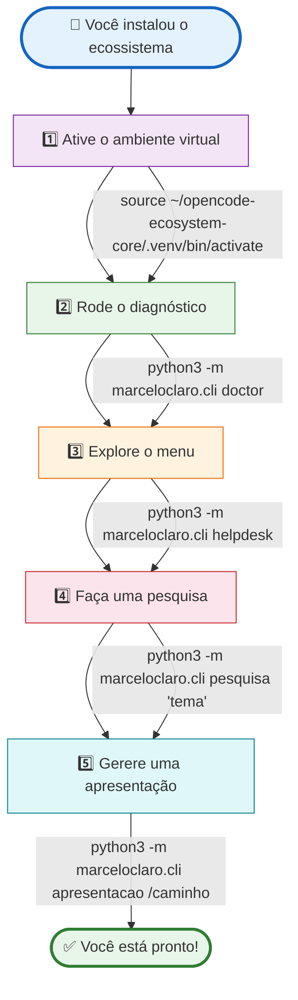
```mermaid
flowchart TD
    START(["🚀 Você instalou o ecossistema"]) --> A1["1️⃣ Ative o ambiente virtual"]
    A1 --> A2["2️⃣ Rode o diagnóstico"]
    A2 --> A3["3️⃣ Explore o menu"]
    A3 --> A4["4️⃣ Faça uma pesquisa"]
    A4 --> A5["5️⃣ Gerere uma apresentação"]

    A1 -->|"source ~/opencode-ecosystem-core/.venv/bin/activate"| A2
    A2 -->|"python3 -m marceloclaro.cli doctor"| A3
    A3 -->|"python3 -m marceloclaro.cli helpdesk"| A4
    A4 -->|"python3 -m marceloclaro.cli pesquisa 'tema'"| A5
    A5 -->|"python3 -m marceloclaro.cli apresentacao /caminho"| DONE

    DONE(["✅ Você está pronto!"])

    style START fill:#e3f2fd,stroke:#1565c0,stroke-width:3px
    style A1 fill:#f3e5f5,stroke:#7b1fa2
    style A2 fill:#e8f5e9,stroke:#2e7d32
    style A3 fill:#fff3e0,stroke:#ef6c00
    style A4 fill:#fce4ec,stroke:#c62828
    style A5 fill:#e0f7fa,stroke:#00838f
    style DONE fill:#e8f5e9,stroke:#2e7d32,stroke-width:3px
```

---

# 🏗️ Arquitetura do Ecossistema

## 🌐 Visão Geral da Arquitetura

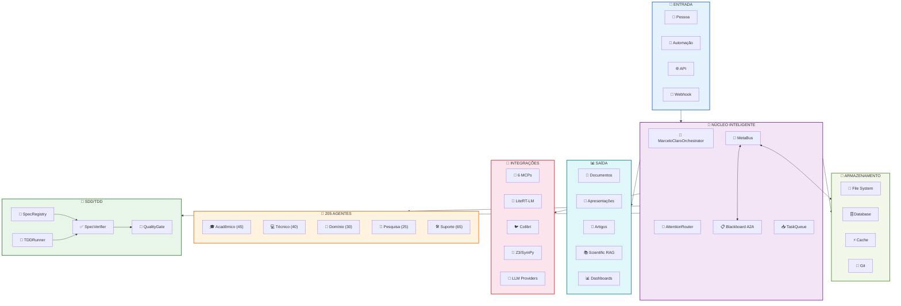
```mermaid
flowchart TB
    subgraph ENTRADA ["🎯 ENTRADA"]
        direction LR
        USER["👤 Pessoa"]
        AUTO["🤖 Automação"]
        API["🌐 API"]
        WEBHOOK["📡 Webhook"]
    end

    subgraph NUCLEO ["🧠 NÚCLEO INTELIGENTE"]
        direction TB
        ORQ["🤖 MarceloClaroOrchestrator"]
        ATT["🎯 AttentionRouter"]
        META["🧠 MetaBus"]
        BB["📋 Blackboard A2A"]
        QUEUE["📥 TaskQueue"]
    end

    subgraph SDD ["📝 SDD/TDD"]
        direction LR
        SPEC["📄 SpecRegistry"]
        VER["✅ SpecVerifier"]
        TDD["🔄 TDDRunner"]
        GATE["🚪 QualityGate"]
    end

    subgraph AGENTES ["👥 205 AGENTES"]
        direction TB
        ACAD["🎓 Acadêmico (45)"]
        TECH["💻 Técnico (40)"]
        DOMAIN["🏥 Domínio (30)"]
        RESEARCH["🔬 Pesquisa (25)"]
        SUPPORT["🛠️ Suporte (65)"]
    end

    subgraph INTEGRACOES ["🔌 INTEGRAÇÕES"]
        direction LR
        MCP["📡 6 MCPs"]
        LITERT["📱 LiteRT-LM"]
        COLIBRI["🐦 Colibri"]
        Z3["🔢 Z3/SymPy"]
        LLM["🤖 LLM Providers"]
    end

    subgraph SAIDA ["📊 SAÍDA"]
        direction LR
        DOC["📄 Documentos"]
        PRES["🎯 Apresentações"]
        PAPER["📝 Artigos"]
        RAG["📚 Scientific RAG"]
        DASHBOARD["📊 Dashboards"]
    end

    subgraph ARMAZENAMENTO ["💾 ARMAZENAMENTO"]
        direction LR
        FS["📁 File System"]
        DB["🗄️ Database"]
        CACHE["⚡ Cache"]
        GIT["🔀 Git"]
    end

    ENTRADA --> NUCLEO
    NUCLEO --> SDD
    NUCLEO --> AGENTES
    NUCLEO --> INTEGRACOES
    NUCLEO --> SAIDA
    NUCLEO --> ARMAZENAMENTO

    META <--> BB
    META <--> ARMAZENAMENTO
    SPEC --> VER
    TDD --> VER
    VER --> GATE

    style ENTRADA fill:#e3f2fd,stroke:#1565c0,stroke-width:2px
    style NUCLEO fill:#f3e5f5,stroke:#7b1fa2,stroke-width:2px
    style SDD fill:#e8f5e9,stroke:#2e7d32,stroke-width:2px
    style AGENTES fill:#fff3e0,stroke:#ef6c00,stroke-width:2px
    style INTEGRACOES fill:#fce4ec,stroke:#c62828,stroke-width:2px
    style SAIDA fill:#e0f7fa,stroke:#00838f,stroke-width:2px
    style ARMAZENAMENTO fill:#f1f8e9,stroke:#558b2f,stroke-width:2px
```

---

## 🧱 Camadas Técnicas

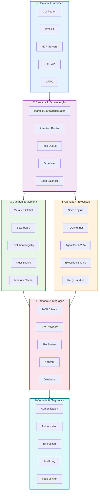
```mermaid
flowchart TB
    subgraph L1 ["📱 Camada 1: Interface"]
        direction LR
        CLI["CLI Python"]
        WEBUI["Web UI"]
        MCPSERVER["MCP Servers"]
        REST["REST API"]
        GRPC["gRPC"]
    end

    subgraph L2 ["🎯 Camada 2: Orquestração"]
        direction LR
        ORQ2["MarceloClaroOrchestrator"]
        ROUTE["Attention Router"]
        QUEUE2["Task Queue"]
        SCHED["Scheduler"]
        BAL["Load Balancer"]
    end

    subgraph L3 ["🧠 Camada 3: Memória"]
        direction LR
        MB["MetaBus Global"]
        BB2["Blackboard"]
        EVO["Evolution Registry"]
        TRUST["Trust Engine"]
        CACHE2["Memory Cache"]
    end

    subgraph L4 ["⚙️ Camada 4: Execução"]
        direction LR
        SDD2["Spec Engine"]
        TDD2["TDD Runner"]
        AG2["Agent Pool (205)"]
        EXEC["Execution Engine"]
        RETRY["Retry Handler"]
    end

    subgraph L5 ["🔌 Camada 5: Integração"]
        direction LR
        MCP3["MCP Clients"]
        LLM2["LLM Providers"]
        FS2["File System"]
        NET2["Network"]
        DB2["Database"]
    end

    subgraph L6 ["🔒 Camada 6: Segurança"]
        direction LR
        AUTH["Authentication"]
        PERM["Authorization"]
        ENC["Encryption"]
        AUDIT["Audit Log"]
        RATE["Rate Limiter"]
    end

    L1 --> L2
    L2 --> L3
    L2 --> L4
    L3 --> L5
    L4 --> L5
    L5 --> L6

    style L1 fill:#e3f2fd,stroke:#1565c0,stroke-width:2px
    style L2 fill:#f3e5f5,stroke:#7b1fa2,stroke-width:2px
    style L3 fill:#e8f5e9,stroke:#2e7d32,stroke-width:2px
    style L4 fill:#fff3e0,stroke:#ef6c00,stroke-width:2px
    style L5 fill:#fce4ec,stroke:#c62828,stroke-width:2px
    style L6 fill:#e0f7fa,stroke:#00838f,stroke-width:2px
```

---

## 🔄 Ciclo de Vida Completo

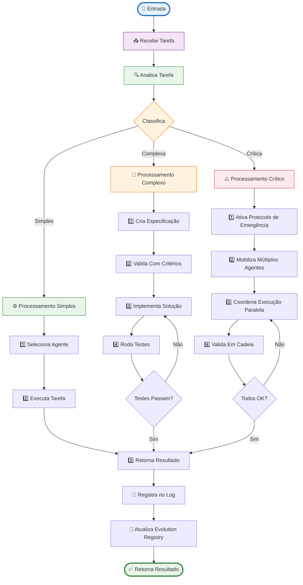
```mermaid
flowchart TD
    START(["🚀 Entrada"]) --> REC["📥 Recebe Tarefa"]
    REC --> PARSE["🔍 Analisa Tarefa"]
    PARSE --> CLASS{"Classifica"}

    CLASS -->|"Simples"| SIMPLE["⚙️ Processamento Simples"]
    CLASS -->|"Complexa"| COMPLEX["🧩 Processamento Complexo"]
    CLASS -->|"Crítica"| CRITICAL["⚠️ Processamento Crítico"]

    SIMPLE --> S1["1️⃣ Seleciona Agente"]
    COMPLEX --> C1["1️⃣ Cria Especificação"]
    CRITICAL --> CR1["1️⃣ Ativa Protocolo de Emergência"]

    S1 --> S2["2️⃣ Executa Tarefa"]
    C1 --> C2["2️⃣ Valida Com Critérios"]
    CR1 --> CR2["2️⃣ Mobiliza Múltiplos Agentes"]

    S2 --> S3["3️⃣ Retorna Resultado"]
    C2 --> C3["3️⃣ Implementa Solução"]
    CR2 --> CR3["3️⃣ Coordena Execução Paralela"]

    C3 --> C4["4️⃣ Roda Testes"]
    CR3 --> CR4["4️⃣ Valida Em Cadeia"]

    C4 --> C5{"Testes Passam?"}
    CR4 --> CR5{"Todos OK?"}

    C5 -->|Sim| S3
    C5 -->|Não| C3

    CR5 -->|Sim| S3
    CR5 -->|Não| CR3

    S3 --> LOG["📝 Registra no Log"]
    LOG --> EVO["🔄 Atualiza Evolution Registry"]
    EVO --> RETURN(["✅ Retorna Resultado"])

    style START fill:#e3f2fd,stroke:#1565c0,stroke-width:3px
    style REC fill:#f3e5f5,stroke:#7b1fa2
    style PARSE fill:#e8f5e9,stroke:#2e7d32
    style CLASS fill:#fff3e0,stroke:#ef6c00
    style SIMPLE fill:#e8f5e9,stroke:#2e7d32
    style COMPLEX fill:#fff3e0,stroke:#ef6c00
    style CRITICAL fill:#ffebee,stroke:#c62828
    style RETURN fill:#e8f5e9,stroke:#2e7d32,stroke-width:3px
```

---

# ⚡ Fluxos de Trabalho

## 🔄 Fluxo Principal


```mermaid
flowchart TD
    START(["🚀 Início da Tarefa"]) --> P["👁️ 1. PERCEBER"]
    
    P --> P1["Consulta MetaBus"]
    P1 --> P2["Recupera contexto"]
    P2 --> P3["Verifica lições passadas"]
    P3 --> P4["Identifica domínio"]
    P4 --> E["📝 2. ESPECIFICAR"]

    E --> E1{"Spec existe?"}
    E1 -->|Sim| E2["Recupera spec existente"]
    E1 -->|Não| E3["Cria nova spec"]
    
    E2 --> E4["Verifica critérios"]
    E3 --> E4
    E4 --> E5["Vincula testes"]
    E5 --> D["👥 3. DELEGAR"]

    D --> D1["Publica CFP no Blackboard"]
    D1 --> D2["Agentes avaliam"]
    D2 --> D3{"Há voluntários?"}
    D3 -->|Sim| D4["Seleciona melhor agente"]
    D3 -->|Não| D5["Reformula tarefa"]
    D5 --> D1
    
    D4 --> D6["Transfere contexto"]
    D6 --> EX["⚙️ 4. EXECUTAR"]

    EX --> EX1["Ciclo RED-GREEN-REFACTOR"]
    EX1 --> EX2["Implementa solução"]
    EX2 --> EX3["Roda testes"]
    EX3 --> EX4{"Testes passam?"}
    EX4 -->|Sim| EX5["Refatora código"]
    EX4 -->|Não| EX2
    EX5 --> V["✅ 5. VERIFICAR"]

    V --> V1["Gate SDD"]
    V1 --> V2["SpecVerifier"]
    V2 --> V3{"Todos critérios OK?"}
    V3 -->|Sim| V4["Aprova entrega"]
    V3 -->|Não| V5["Rejeita com feedback"]
    V5 --> EX
    
    V4 --> R["🔄 6. REFLETIR"]

    R --> R1["Registra lições"]
    R1 --> R2["Atualiza Trust Engine"]
    R2 --> R3["Atualiza Evolution Registry"]
    R3 --> R4["Compartilha com Blackboard"]
    R4 --> DONE(["✅ Tarefa Concluída"])

    style START fill:#e3f2fd,stroke:#1565c0,stroke-width:3px
    style P fill:#f3e5f5,stroke:#7b1fa2
    style E fill:#e8f5e9,stroke:#2e7d32
    style D fill:#fff3e0,stroke:#ef6c00
    style EX fill:#fce4ec,stroke:#c62828
    style V fill:#e0f7fa,stroke:#00838f
    style R fill:#f1f8e9,stroke:#558b2f
    style DONE fill:#e8f5e9,stroke:#2e7d32,stroke-width:3px
```

---

## 🎯 Decisão de Roteamento


```mermaid
flowchart TD
    TASK["📋 Nova Tarefa"] --> ANALS["🔍 Análise Inicial"]
    
    ANALS --> A1["Extrai palavras-chave"]
    A1 --> A2["Identifica domínio"]
    A2 --> A3["Calcula complexidade"]
    A3 --> A4["Estima tempo"]
    A4 --> CLASS{"Classificação"}

    CLASS -->|"Pesquisa científica"| ACAD["🎓 Pipeline Acadêmico"]
    CLASS -->|"Código/programação"| TECH["💻 Agente Técnico"]
    CLASS -->|"Domínio específico"| DOM["🏥 Especialista"]
    CLASS -->|"Apresentação"| PRES["🎯 MIRA"]
    CLASS -->|"Formal/matémático"| FORM["🔢 Formal Verifier"]
    CLASS -->|"Documento/texto"| TEXT["📝 Escritor"]
    CLASS -->|"Dados/análise"| DATA["📊 Analista"]

    ACAD --> A21["Busca literatura"]
    ACAD --> A22["Coleta evidências"]
    ACAD --> A23["Revisão por pares"]
    ACAD --> A24["Redação do artigo"]
    ACAD --> A25["Formatação ABNT/APA"]

    TECH --> T21["Analisa código"]
    TECH --> T22["Implementa solução"]
    TECH --> T23["Testa e valida"]
    TECH --> T24["Documenta API"]
    TECH --> T25["Otimiza performance"]

    DOM --> D21["Consulta especialista"]
    DOM --> D22["Aplica conhecimento"]
    DOM --> D23["Gera relatório"]
    DOM --> D24["Recomenda ações"]

    PRES --> P21["Extrai conteúdo"]
    PRES --> P22["Planeja slides"]
    PRES --> P23["Constrói deck"]
    PRES --> P24["Adiciona animações"]
    PRES --> P25["Valida consistência"]

    FORM --> F21["Formaliza problema"]
    FORM --> F22["Gera prova"]
    FORM --> F23["Verifica com Z3"]
    FORM --> F24["Gera certificado"]

    TEXT --> TX21["Analisa audiência"]
    TEXT --> TX22["Estrutura texto"]
    TEXT --> TX23["Revisa gramática"]
    TEXT --> TX24["Adapta tom"]

    DATA --> DA21["Coleta dados"]
    DATA --> DA22["Limpa e processa"]
    DATA --> DA23["Análise estatística"]
    DATA --> DA24["Gera visualizações"]

    style TASK fill:#e3f2fd,stroke:#1565c0,stroke-width:3px
    style ANALS fill:#f3e5f5,stroke:#7b1fa2
    style ACAD fill:#e8f5e9,stroke:#2e7d32
    style TECH fill:#fff3e0,stroke:#ef6c00
    style DOM fill:#fce4ec,stroke:#c62828
    style PRES fill:#e0f7fa,stroke:#00838f
    style FORM fill:#f1f8e9,stroke:#558b2f
    style TEXT fill:#f3e5f5,stroke:#7b1fa2
    style DATA fill:#e3f2fd,stroke:#1565c0
```

---

## 📋 Fluxo de uma Tarefa Detalhado

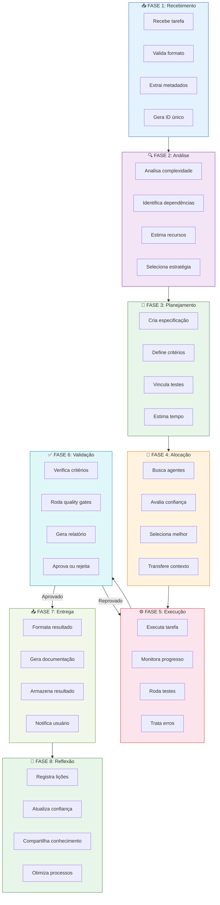
```mermaid
flowchart TD
    subgraph FASE1 ["📥 FASE 1: Recebimento"]
        R1["Recebe tarefa"]
        R2["Valida formato"]
        R3["Extrai metadados"]
        R4["Gera ID único"]
    end

    subgraph FASE2 ["🔍 FASE 2: Análise"]
        A1["Analisa complexidade"]
        A2["Identifica dependências"]
        A3["Estima recursos"]
        A4["Seleciona estratégia"]
    end

    subgraph FASE3 ["📝 FASE 3: Planejamento"]
        P1["Cria especificação"]
        P2["Define critérios"]
        P3["Vincula testes"]
        P4["Estima tempo"]
    end

    subgraph FASE4 ["👥 FASE 4: Alocação"]
        AL1["Busca agentes"]
        AL2["Avalia confiança"]
        AL3["Seleciona melhor"]
        AL4["Transfere contexto"]
    end

    subgraph FASE5 ["⚙️ FASE 5: Execução"]
        E1["Executa tarefa"]
        E2["Monitora progresso"]
        E3["Roda testes"]
        E4["Trata erros"]
    end

    subgraph FASE6 ["✅ FASE 6: Validação"]
        V1["Verifica critérios"]
        V2["Roda quality gates"]
        V3["Gera relatório"]
        V4["Aprova ou rejeita"]
    end

    subgraph FASE7 ["📤 FASE 7: Entrega"]
        D1["Formata resultado"]
        D2["Gera documentação"]
        D3["Armazena resultado"]
        D4["Notifica usuário"]
    end

    subgraph FASE8 ["🔄 FASE 8: Reflexão"]
        RE1["Registra lições"]
        RE2["Atualiza confiança"]
        RE3["Compartilha conhecimento"]
        RE4["Otimiza processos"]
    end

    FASE1 --> FASE2
    FASE2 --> FASE3
    FASE3 --> FASE4
    FASE4 --> FASE5
    FASE5 --> FASE6
    FASE6 -->|"Aprovado"| FASE7
    FASE6 -->|"Reprovado"| FASE5
    FASE7 --> FASE8

    style FASE1 fill:#e3f2fd,stroke:#1565c0
    style FASE2 fill:#f3e5f5,stroke:#7b1fa2
    style FASE3 fill:#e8f5e9,stroke:#2e7d32
    style FASE4 fill:#fff3e0,stroke:#ef6c00
    style FASE5 fill:#fce4ec,stroke:#c62828
    style FASE6 fill:#e0f7fa,stroke:#00838f
    style FASE7 fill:#f1f8e9,stroke:#558b2f
    style FASE8 fill:#e8f5e9,stroke:#2e7d32
```

---

# 🧠 Sistema de Memória

## 🧠 Visão Geral da Memória

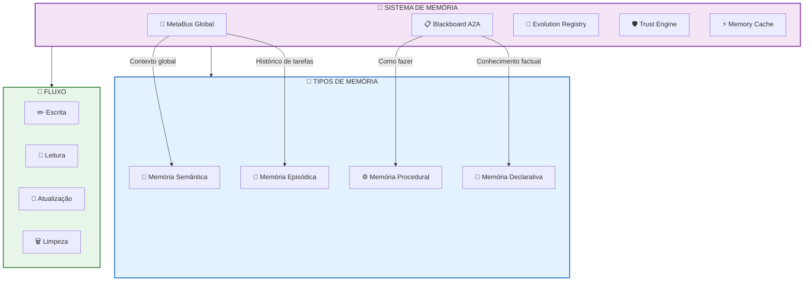
```mermaid
flowchart TB
    subgraph MEMORY ["🧠 SISTEMA DE MEMÓRIA"]
        direction TB
        MB["🧠 MetaBus Global"]
        BB["📋 Blackboard A2A"]
        EVO["🔄 Evolution Registry"]
        TRUST["🛡️ Trust Engine"]
        CACHE["⚡ Memory Cache"]
    end

    subgraph TIPOS ["📝 TIPOS DE MEMÓRIA"]
        direction LR
        SEMANTIC["🧠 Memória Semântica"]
        EPISODIC["📅 Memória Episódica"]
        PROCEDURAL["⚙️ Memória Procedural"]
        DECLARATIVE["📄 Memória Declarativa"]
    end

    subgraph FLUXO ["🔄 FLUXO"]
        direction LR
        WRITE["✏️ Escrita"]
        READ["📖 Leitura"]
        UPDATE["🔄 Atualização"]
        DELETE["🗑️ Limpeza"]
    end

    MEMORY --> TIPOS
    MEMORY --> FLUXO

    MB -->|"Contexto global"| SEMANTIC
    MB -->|"Histórico de tarefas"| EPISODIC
    BB -->|"Como fazer"| PROCEDURAL
    BB -->|"Conhecimento factual"| DECLARATIVE

    style MEMORY fill:#f3e5f5,stroke:#7b1fa2,stroke-width:2px
    style TIPOS fill:#e3f2fd,stroke:#1565c0,stroke-width:2px
    style FLUXO fill:#e8f5e9,stroke:#2e7d32,stroke-width:2px
```

---

## 🔄 Fluxo de Conhecimento

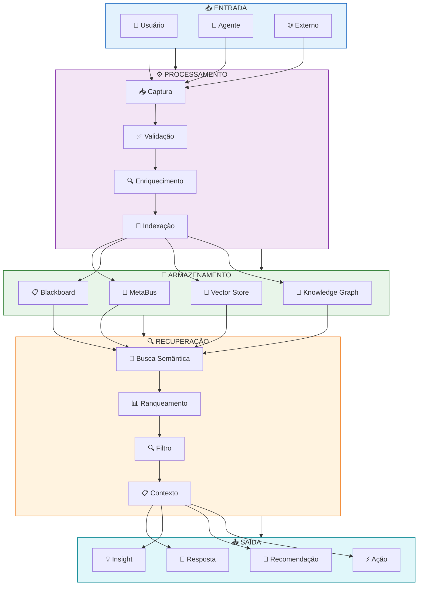
```mermaid
flowchart TD
    subgraph INPUT ["📥 ENTRADA"]
        USER2["👤 Usuário"]
        AGENT2["🤖 Agente"]
        EXT["🌐 Externo"]
    end

    subgraph PROCESS ["⚙️ PROCESSAMENTO"]
        CAPTURE["📥 Captura"]
        VALIDATE["✅ Validação"]
        ENRICH["🔍 Enriquecimento"]
        INDEX["📇 Indexação"]
    end

    subgraph STORE ["💾 ARMAZENAMENTO"]
        MB2["🧠 MetaBus"]
        BB3["📋 Blackboard"]
        VECTOR["🔢 Vector Store"]
        GRAPH["🔗 Knowledge Graph"]
    end

    subgraph RETRIEVE ["🔍 RECUPERAÇÃO"]
        SEARCH2["🔎 Busca Semântica"]
        RANK["📊 Ranqueamento"]
        FILTER["🔍 Filtro"]
        CONTEXT["📋 Contexto"]
    end

    subgraph OUTPUT2 ["📤 SAÍDA"]
        ANSWER["💬 Resposta"]
        INSIGHT["💡 Insight"]
        RECOMMEND["🎯 Recomendação"]
        ACTION["⚡ Ação"]
    end

    INPUT --> PROCESS
    PROCESS --> STORE
    STORE --> RETRIEVE
    RETRIEVE --> OUTPUT2

    USER2 --> CAPTURE
    AGENT2 --> CAPTURE
    EXT --> CAPTURE

    CAPTURE --> VALIDATE --> ENRICH --> INDEX
    INDEX --> MB2
    INDEX --> BB3
    INDEX --> VECTOR
    INDEX --> GRAPH

    MB2 --> SEARCH2
    BB3 --> SEARCH2
    VECTOR --> SEARCH2
    GRAPH --> SEARCH2

    SEARCH2 --> RANK --> FILTER --> CONTEXT
    CONTEXT --> ANSWER
    CONTEXT --> INSIGHT
    CONTEXT --> RECOMMEND
    CONTEXT --> ACTION

    style INPUT fill:#e3f2fd,stroke:#1565c0
    style PROCESS fill:#f3e5f5,stroke:#7b1fa2
    style STORE fill:#e8f5e9,stroke:#2e7d32
    style RETRIEVE fill:#fff3e0,stroke:#ef6c00
    style OUTPUT2 fill:#e0f7fa,stroke:#00838f
```

---

## 🔄 Aprendizado Contínuo

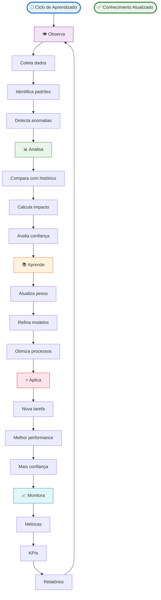
```mermaid
flowchart TD
    START2(["🔄 Ciclo de Aprendizado"]) --> OBSERVE["👁️ Observa"]
    
    OBSERVE --> O1["Coleta dados"]
    O1 --> O2["Identifica padrões"]
    O2 --> O3["Detecta anomalias"]
    O3 --> ANALYZE["📊 Analisa"]

    ANALYZE --> A1["Compara com histórico"]
    A1 --> A2["Calcula impacto"]
    A2 --> A3["Avalia confiança"]
    A3 --> LEARN["📚 Aprende"]

    LEARN --> L1["Atualiza pesos"]
    L1 --> L2["Refina modelos"]
    L2 --> L3["Otimiza processos"]
    L3 --> APPLY["⚡ Aplica"]

    APPLY --> AP1["Nova tarefa"]
    AP1 --> AP2["Melhor performance"]
    AP2 --> AP3["Mais confiança"]
    AP3 --> MONITOR["📈 Monitora"]

    MONITOR --> M1["Métricas"]
    M1 --> M2["KPIs"]
    M2 --> M3["Relatórios"]
    M3 --> OBSERVE

    DONE2(["✅ Conhecimento Atualizado"])

    style START2 fill:#e3f2fd,stroke:#1565c0,stroke-width:3px
    style OBSERVE fill:#f3e5f5,stroke:#7b1fa2
    style ANALYZE fill:#e8f5e9,stroke:#2e7d32
    style LEARN fill:#fff3e0,stroke:#ef6c00
    style APPLY fill:#fce4ec,stroke:#c62828
    style MONITOR fill:#e0f7fa,stroke:#00838f
    style DONE2 fill:#e8f5e9,stroke:#2e7d32,stroke-width:3px
```

---

# 📝 SDD/TDD e Qualidade

## 📝 Ciclo SDD/TDD

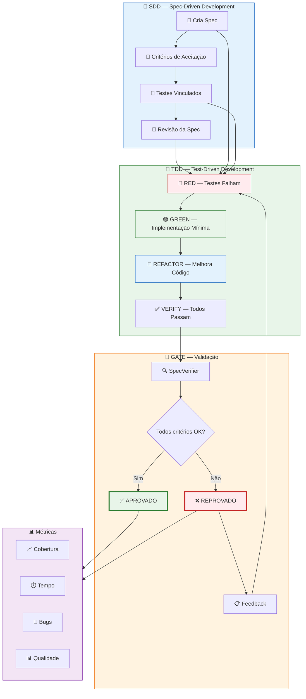
```mermaid
flowchart TD
    subgraph SDD ["📝 SDD — Spec-Driven Development"]
        SPEC1["📄 Cria Spec"]
        SPEC1 --> CRIT["🎯 Critérios de Aceitação"]
        CRIT --> TESTS["🧪 Testes Vinculados"]
        TESTS --> REVIEW["👀 Revisão da Spec"]
    end

    subgraph TDD ["🔄 TDD — Test-Driven Development"]
        RED["🔴 RED — Testes Falham"]
        RED --> GREEN["🟢 GREEN — Implementação Mínima"]
        GREEN --> REFACTOR["🔵 REFACTOR — Melhora Código"]
        REFACTOR --> VERIFY["✅ VERIFY — Todos Passam"]
    end

    subgraph GATE ["🚪 GATE — Validação"]
        GATE1["🔍 SpecVerifier"]
        GATE1 --> CHECK{"Todos critérios OK?"}
        CHECK -->|Sim| APPROVE["✅ APROVADO"]
        CHECK -->|Não| REJECT["❌ REPROVADO"]
        REJECT --> FEEDBACK["📋 Feedback"]
        FEEDBACK --> RED
    end

    subgraph METRICS ["📊 Métricas"]
        M1["📈 Cobertura"]
        M2["⏱️ Tempo"]
        M3["🐛 Bugs"]
        M4["📊 Qualidade"]
    end

    REVIEW --> RED
    SPEC1 --> RED
    TESTS --> RED
    VERIFY --> GATE1

    APPROVE --> METRICS
    REJECT --> METRICS

    style SDD fill:#e3f2fd,stroke:#1565c0
    style TDD fill:#e8f5e9,stroke:#2e7d32
    style GATE fill:#fff3e0,stroke:#ef6c00
    style METRICS fill:#f3e5f5,stroke:#7b1fa2
    style RED fill:#ffebee,stroke:#c62828
    style GREEN fill:#e8f5e9,stroke:#2e7d32
    style REFACTOR fill:#e3f2fd,stroke:#1565c0
    style APPROVE fill:#e8f5e9,stroke:#2e7d32,stroke-width:3px
    style REJECT fill:#ffebee,stroke:#c62828,stroke-width:3px
```

---

## ✅ Quality Gates

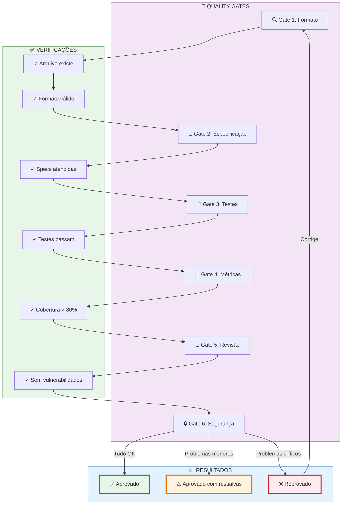
```mermaid
flowchart TD
    subgraph GATES ["🚪 QUALITY GATES"]
        G1["🔍 Gate 1: Formato"]
        G2["📝 Gate 2: Especificação"]
        G3["🧪 Gate 3: Testes"]
        G4["📊 Gate 4: Métricas"]
        G5["👀 Gate 5: Revisão"]
        G6["🔒 Gate 6: Segurança"]
    end

    subgraph CHECKS ["✅ VERIFICAÇÕES"]
        C1["✓ Arquivo existe"]
        C2["✓ Formato válido"]
        C3["✓ Specs atendidas"]
        C4["✓ Testes passam"]
        C5["✓ Cobertura > 80%"]
        C6["✓ Sem vulnerabilidades"]
    end

    subgraph RESULTS ["📊 RESULTADOS"]
        R1["✅ Aprovado"]
        R2["⚠️ Aprovado com ressalvas"]
        R3["❌ Reprovado"]
    end

    G1 --> C1
    C1 --> C2
    C2 --> G2
    G2 --> C3
    C3 --> G3
    G3 --> C4
    C4 --> G4
    G4 --> C5
    C5 --> G5
    G5 --> C6
    C6 --> G6

    G6 -->|"Tudo OK"| R1
    G6 -->|"Problemas menores"| R2
    G6 -->|"Problemas críticos"| R3

    R3 -->|"Corrige"| G1

    style GATES fill:#f3e5f5,stroke:#7b1fa2
    style CHECKS fill:#e8f5e9,stroke:#2e7d32
    style RESULTS fill:#e3f2fd,stroke:#1565c0
    style R1 fill:#e8f5e9,stroke:#2e7d32,stroke-width:3px
    style R2 fill:#fff3e0,stroke:#ef6c00,stroke-width:3px
    style R3 fill:#ffebee,stroke:#c62828,stroke-width:3px
```

---

## 🔍 Auditoria e Validação

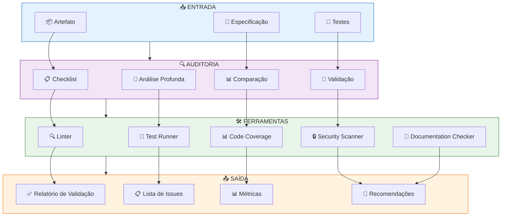
```mermaid
flowchart TD
    subgraph INPUT3 ["📥 ENTRADA"]
        ARTIFACT["📦 Artefato"]
        SPEC2["📄 Especificação"]
        TEST2["🧪 Testes"]
    end

    subgraph AUDIT ["🔍 AUDITORIA"]
        A1["📋 Checklist"]
        A2["🔬 Análise Profunda"]
        A3["📊 Comparação"]
        A4["🎯 Validação"]
    end

    subgraph TOOLS ["🛠️ FERRAMENTAS"]
        T1["🔍 Linter"]
        T2["🧪 Test Runner"]
        T3["📊 Code Coverage"]
        T4["🔒 Security Scanner"]
        T5["📝 Documentation Checker"]
    end

    subgraph OUTPUT3 ["📤 SAÍDA"]
        O1["✅ Relatório de Validação"]
        O2["📋 Lista de Issues"]
        O3["📊 Métricas"]
        O4["🎯 Recomendações"]
    end

    INPUT3 --> AUDIT
    AUDIT --> TOOLS
    TOOLS --> OUTPUT3

    ARTIFACT --> A1
    SPEC2 --> A3
    TEST2 --> A4

    A1 --> T1
    A2 --> T2
    A3 --> T3
    A4 --> T4

    T1 --> O1
    T2 --> O2
    T3 --> O3
    T4 --> O4
    T5 --> O4

    style INPUT3 fill:#e3f2fd,stroke:#1565c0
    style AUDIT fill:#f3e5f5,stroke:#7b1fa2
    style TOOLS fill:#e8f5e9,stroke:#2e7d32
    style OUTPUT3 fill:#fff3e0,stroke:#ef6c00
```

---

# 🔬 Pipeline Acadêmico

## 🔬 Visão Geral do Pipeline


```mermaid
flowchart LR
    subgraph FASE1 ["Fase 1: Descoberta"]
        I["💡 Ideia"]
        G["🎯 Gap de Pesquisa"]
        P["📋 Proposta"]
    end

    subgraph FASE2 ["Fase 2: Pesquisa"]
        L["📚 Revisão Literária"]
        E["📊 Coleta Dados"]
        M["⚙️ Metodologia"]
    end

    subgraph FASE3 ["Fase 3: Análise"]
        A["📈 Análise Estatística"]
        V["🔍 Validação"]
        R["📊 Resultados"]
    end

    subgraph FASE4 ["Fase 4: Escrita"]
        D["📝 Rascunho"]
        REV["🔄 Revisão"]
        F["📄 Final"]
    end

    subgraph FASE5 ["Fase 5: Publicação"]
        SUB["📤 Submissão"]
        PR["👥 Peer Review"]
        PUB["🎉 Publicação"]
    end

    I --> G --> P
    P --> L --> E --> M
    M --> A --> V --> R
    R --> D --> REV --> F
    F --> SUB --> PR --> PUB

    style FASE1 fill:#e3f2fd,stroke:#1565c0
    style FASE2 fill:#f3e5f5,stroke:#7b1fa2
    style FASE3 fill:#e8f5e9,stroke:#2e7d32
    style FASE4 fill:#fff3e0,stroke:#ef6c00
    style FASE5 fill:#fce4ec,stroke:#c62828
```

---

## 📚 Busca de Literatura

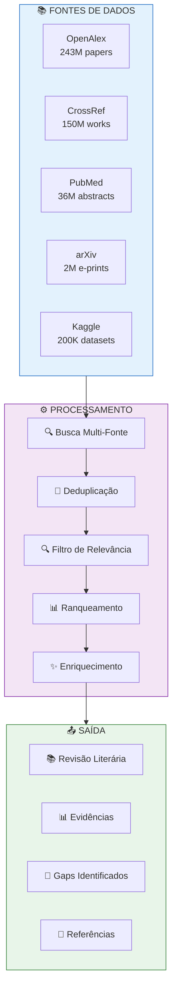
```mermaid
flowchart TD
    subgraph SOURCES ["📚 FONTES DE DADOS"]
        direction LR
        OA3["OpenAlex\n243M papers"]
        CR3["CrossRef\n150M works"]
        PM3["PubMed\n36M abstracts"]
        AR3["arXiv\n2M e-prints"]
        KG3["Kaggle\n200K datasets"]
    end

    subgraph PROCESS3 ["⚙️ PROCESSAMENTO"]
        direction TB
        SEARCH3["🔍 Busca Multi-Fonte"]
        DEDUP2["🔄 Deduplicação"]
        FILTER2["🔍 Filtro de Relevância"]
        RANK2["📊 Ranqueamento"]
        ENRICH2["✨ Enriquecimento"]
    end

    subgraph OUTPUT4 ["📤 SAÍDA"]
        direction LR
        LIT["📚 Revisão Literária"]
        EVID["📊 Evidências"]
        GAP3["🎯 Gaps Identificados"]
        REF["📖 Referências"]
    end

    SOURCES --> SEARCH3
    SEARCH3 --> DEDUP2
    DEDUP2 --> FILTER2
    FILTER2 --> RANK2
    RANK2 --> ENRICH2
    ENRICH2 --> OUTPUT4

    style SOURCES fill:#e3f2fd,stroke:#1565c0
    style PROCESS3 fill:#f3e5f5,stroke:#7b1fa2
    style OUTPUT4 fill:#e8f5e9,stroke:#2e7d32
```

---

## 📊 Análise de Dados

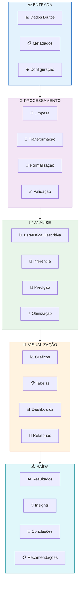
```mermaid
flowchart TD
    subgraph INPUT4 ["📥 ENTRADA"]
        RAW["📊 Dados Brutos"]
        META3["📋 Metadados"]
        CONFIG["⚙️ Configuração"]
    end

    subgraph PROCESS4 ["⚙️ PROCESSAMENTO"]
        CLEAN["🧹 Limpeza"]
        TRANSFORM["🔄 Transformação"]
        NORMALIZE["📐 Normalização"]
        VALIDATE2["✅ Validação"]
    end

    subgraph ANALYSIS ["📈 ANÁLISE"]
        DESC["📊 Estatística Descritiva"]
        INFER["🔬 Inferência"]
        PREDICT["🔮 Predição"]
        OPTIMIZE["⚡ Otimização"]
    end

    subgraph VISUALIZATION ["📊 VISUALIZAÇÃO"]
        CHART["📈 Gráficos"]
        TABLE["📋 Tabelas"]
        DASHBOARD2["📊 Dashboards"]
        REPORT2["📄 Relatórios"]
    end

    subgraph OUTPUT5 ["📤 SAÍDA"]
        RESULT["📊 Resultados"]
        INSIGHT2["💡 Insights"]
        CONCLUSION["🎯 Conclusões"]
        RECOMMEND2["📋 Recomendações"]
    end

    INPUT4 --> PROCESS4
    PROCESS4 --> ANALYSIS
    ANALYSIS --> VISUALIZATION
    VISUALIZATION --> OUTPUT5

    style INPUT4 fill:#e3f2fd,stroke:#1565c0
    style PROCESS4 fill:#f3e5f5,stroke:#7b1fa2
    style ANALYSIS fill:#e8f5e9,stroke:#2e7d32
    style VISUALIZATION fill:#fff3e0,stroke:#ef6c00
    style OUTPUT5 fill:#e0f7fa,stroke:#00838f
```

---

# 🤖 Agentes e Integrações

## 🤖 Mapa de Agentes


```mermaid
flowchart TB
    subgraph ACADEMIC ["🎓 Agentes Acadêmicos (45)"]
        direction LR
        A1["A00 — Editor-Chefe PhD"]
        A2["A01 — Escopo"]
        A3["A02 — Busca"]
        A4["A03 — Evidências"]
        A5["A04 — Estrutura"]
        A6["A05 — Revisão"]
        A7["A06 — Metodologia"]
        A8["A07 — Estatística"]
        A9["A08 — Visualização"]
        A10["A09 — Resultados"]
        A11["A10 — Discussão"]
        A12["A11 — Conclusão"]
        A13["A12 — Bibliografia"]
        A14["A13 — QA Qualis"]
        A15["A14 — Consistência"]
        A16["A15 — Resumo"]
        A17["A16 — Integração"]
        A18["A17 — Framework"]
        A19["A18 — Dados"]
        A20["A19 — Auditoria"]
    end

    subgraph TECH ["💻 Agentes Técnicos (40)"]
        direction LR
        T1["C — Coder"]
        T2["R — Researcher"]
        T3["W — Writer"]
        T4["V — Reviewer"]
        T5["D — Debugger"]
        T6["O — Optimizer"]
        T7["A — Architect"]
        T8["T — Tester"]
        T9["M — Maintainer"]
        T10["S — Security"]
    end

    subgraph DOMAIN ["🏥 Especialistas de Domínio (30)"]
        direction LR
        D1["🫀 Cardiologista"]
        D2["🧠 Neurologista"]
        D3["🦴 Radiologista"]
        D4["📚 Educador"]
        D5["⚖️ Jurídico"]
        D6["💰 Economista"]
        D7["🌾 Agrônomo"]
        D8["🔬 Bioquímico"]
    end

    subgraph RESEARCH ["🔬 Agentes de Pesquisa (25)"]
        direction LR
        RE1["📚 Literatura"]
        RE2["📊 Dados"]
        RE3["📈 Análise"]
        RE4["📝 Redação"]
        RE5["🔍 Validação"]
    end

    subgraph SUPPORT ["🛠️ Agentes de Suporte (65)"]
        direction LR
        S1["📝 Documentação"]
        S2["🧪 Testes"]
        S3["🔒 Segurança"]
        S4["📊 Métricas"]
        S5["🚀 Deploy"]
        S6["🐛 Debug"]
        S7["📈 Performance"]
        S8["🔄 CI/CD"]
    end

    ACADEMIC --> TECH
    TECH --> DOMAIN
    DOMAIN --> RESEARCH
    RESEARCH --> SUPPORT

    style ACADEMIC fill:#e3f2fd,stroke:#1565c0,stroke-width:2px
    style TECH fill:#fff3e0,stroke:#ef6c00,stroke-width:2px
    style DOMAIN fill:#fce4ec,stroke:#c62828,stroke-width:2px
    style RESEARCH fill:#e8f5e9,stroke:#2e7d32,stroke-width:2px
    style SUPPORT fill:#f3e5f5,stroke:#7b1fa2,stroke-width:2px
```

---

## 🔌 Integrações MCP

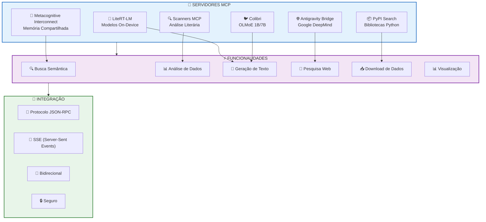
```mermaid
flowchart TB
    subgraph MCP_SERVERS ["📡 SERVIDORES MCP"]
        direction LR
        LITERT2["📱 LiteRT-LM\nModelos On-Device"]
        META3["🧠 Metacognitive Interconnect\nMemória Compartilhada"]
        ANTI["🌐 Antigravity Bridge\nGoogle DeepMind"]
        PYPI["📦 PyPI Search\nBibliotecas Python"]
        COLIBRI2["🐦 Colibri\nOLMoE 1B/7B"]
        SCANNER["🔍 Scanners MCP\nAnálise Literária"]
    end

    subgraph FEATURES ["⚡ FUNCIONALIDADES"]
        direction LR
        F1["🔍 Busca Semântica"]
        F2["📊 Análise de Dados"]
        F3["🤖 Geração de Texto"]
        F4["🔎 Pesquisa Web"]
        F5["📥 Download de Dados"]
        F6["📊 Visualização"]
    end

    subgraph INTEGRATION ["🔗 INTEGRAÇÃO"]
        direction LR
        I1["🔌 Protocolo JSON-RPC"]
        I2["📡 SSE (Server-Sent Events)"]
        I3["🔄 Bidirecional"]
        I4["🔒 Seguro"]
    end

    MCP_SERVERS --> FEATURES
    FEATURES --> INTEGRATION

    LITERT2 --> F3
    META3 --> F1
    ANTI --> F4
    PYPI --> F5
    COLIBRI2 --> F3
    SCANNER --> F2

    style MCP_SERVERS fill:#e3f2fd,stroke:#1565c0,stroke-width:2px
    style FEATURES fill:#f3e5f5,stroke:#7b1fa2,stroke-width:2px
    style INTEGRATION fill:#e8f5e9,stroke:#2e7d32,stroke-width:2px
```

---

## 🛡️ Trust Engine


```mermaid
flowchart TD
    subgraph INPUT5 ["📥 ENTRADA"]
        AGENT3["🤖 Agente"]
        TASK2["📋 Tarefa"]
        RESULT3["📊 Resultado"]
    end

    subgraph TRUST_ENGINE ["🛡️ TRUST ENGINE"]
        CALC["📊 Cálculo de Confiança"]
        HISTORY["📅 Histórico"]
        METRICS2["📈 Métricas"]
        DECISION["🎯 Decisão"]
    end

    subgraph FACTORS ["📊 FATORES"]
        direction LR
        SUCESSO["✅ Taxa de Sucesso"]
        QUALIDADE["⭐ Qualidade"]
        TEMPO["⏱️ Tempo"]
        CUSTO["💰 Custo"]
        FEEDBACK2["💬 Feedback"]
    end

    subgraph ACTIONS ["⚡ AÇÕES"]
        direction LR
        PROMOTE["⬆️ Promover"]
        DEMOTE["⬇️ Rebaixar"]
        BLOCK["🚫 Bloquear"]
        REWARD["🎁 Recompensar"]
        PENALIZE["⚠️ Penalizar"]
    end

    subgraph OUTPUT6 ["📤 SAÍDA"]
        TRUST_SCORE["📊 Trust Score"]
        RECOMMEND3["🎯 Recomendação"]
        ALERT["⚠️ Alertas"]
    end

    INPUT5 --> TRUST_ENGINE
    TRUST_ENGINE --> FACTORS
    FACTORS --> ACTIONS
    ACTIONS --> OUTPUT6

    AGENT3 --> CALC
    TASK2 --> HISTORY
    RESULT3 --> METRICS2

    CALC --> DECISION
    HISTORY --> DECISION
    METRICS2 --> DECISION

    DECISION --> PROMOTE
    DECISION --> DEMOTE
    DECISION --> BLOCK
    DECISION --> REWARD
    DECISION --> PENALIZE

    style INPUT5 fill:#e3f2fd,stroke:#1565c0
    style TRUST_ENGINE fill:#f3e5f5,stroke:#7b1fa2
    style FACTORS fill:#e8f5e9,stroke:#2e7d32
    style ACTIONS fill:#fff3e0,stroke:#ef6c00
    style OUTPUT6 fill:#e0f7fa,stroke:#00838f
```

---

# 📊 Dados e Métricas

## 📊 Dados Científicos

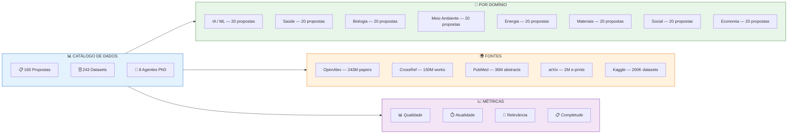
```mermaid
flowchart LR
    subgraph CATALOG ["📊 CATÁLOGO DE DADOS"]
        PROP2["📋 160 Propostas"]
        DS2["🗄️ 243 Datasets"]
        AG2["🤖 8 Agentes PhD"]
    end

    subgraph DOMAINS2 ["🎯 POR DOMÍNIO"]
        direction TB
        AI2["IA / ML — 20 propostas"]
        HEALTH2["Saúde — 20 propostas"]
        BIO2["Biologia — 20 propostas"]
        ENV2["Meio Ambiente — 20 propostas"]
        ENERGY2["Energia — 20 propostas"]
        MATERIAL2["Materiais — 20 propostas"]
        SOCIAL2["Social — 20 propostas"]
        ECON2["Economia — 20 propostas"]
    end

    subgraph SOURCES2 ["🌍 FONTES"]
        direction TB
        OA4["OpenAlex — 243M papers"]
        CR4["CrossRef — 150M works"]
        PM4["PubMed — 36M abstracts"]
        AR4["arXiv — 2M e-prints"]
        KG4["Kaggle — 200K datasets"]
    end

    subgraph METRICS3 ["📈 MÉTRICAS"]
        direction TB
        M2["📊 Qualidade"]
        M3["⏱️ Atualidade"]
        M4["🎯 Relevância"]
        M5["📋 Completude"]
    end

    CATALOG --> DOMAINS2
    CATALOG --> SOURCES2
    CATALOG --> METRICS3

    style CATALOG fill:#e3f2fd,stroke:#1565c0
    style DOMAINS2 fill:#e8f5e9,stroke:#2e7d32
    style SOURCES2 fill:#fff3e0,stroke:#ef6c00
    style METRICS3 fill:#f3e5f5,stroke:#7b1fa2
```

---

## 📈 Métricas e Relatórios

```mermaid
flowchart TD
    subgraph COLLECT ["📥 COLETA"]
        C1["📊 Logs"]
        C2["⏱️ Timestamps"]
        C3["✅ Sucessos"]
        C4["❌ Falhas"]
        C5["💬 Feedback"]
    end

    subgraph PROCESS5 ["⚙️ PROCESSAMENTO"]
        P1["📊 Agregação"]
        P2["📈 Análise"]
        P3["🔍 Detecção de Padrões"]
        P4["🎯 Identificação de Anomalias"]
    end

    subgraph VISUALIZE ["📊 VISUALIZAÇÃO"]
        V1["📈 Gráficos"]
        V2["📋 Tabelas"]
        V3["📊 Dashboards"]
        V4["📄 Relatórios"]
    end

    subgraph INSIGHTS ["💡 INSIGHTS"]
        I1["📊 Tendências"]
        I2["⚠️ Alertas"]
        I3["🎯 Recomendações"]
        I4["📋 Ações"]
    end

    COLLECT --> PROCESS5
    PROCESS5 --> VISUALIZE
    VISUALIZE --> INSIGHTS

    style COLLECT fill:#e3f2fd,stroke:#1565c0
    style PROCESS5 fill:#f3e5f5,stroke:#7b1fa2
    style VISUALIZE fill:#e8f5e9,stroke:#2e7d32
    style INSIGHTS fill:#fff3e0,stroke:#ef6c00
```

---

## 🛠️ Comandos Úteis

<div align="center">

| Comando | O que faz | Nível |
|---|---|---|
| `python3 -m marceloclaro.cli` | 🎯 Menu interativo principal | Iniciante |
| `python3 -m marceloclaro.cli doctor` | 🩺 Diagnóstico do sistema | Iniciante |
| `python3 -m marceloclaro.cli helpdesk` | 💡 Ajuda guiada | Iniciante |
| `python3 -m marceloclaro.cli status` | 📊 Status do ecossistema | Intermediário |
| `python3 -m marceloclaro.cli pesquisa "tema"` | 🔍 Pesquisa científica | Intermediário |
| `python3 -m marceloclaro.cli apresentacao /caminho` | 🎨 Gerar apresentação | Avançado |

</div>

---

## 📚 Documentação

<div align="center">

| Documento | Para quem | Descrição |
|---|---|---|
| [QUICKSTART.md](QUICKSTART.md) | 🟢 Iniciantes | Primeiros passos |
| [MANUAL.md](MANUAL.md) | 🟡 Todos | Uso completo da CLI |
| [ARCHITECTURE.md](ARCHITECTURE.md) | 🟠 Desenvolvedores | Arquitetura técnica |
| [CONTRIBUTING.md](CONTRIBUTING.md) | 🟠 Contribuidores | Como participar |
| [SECURITY.md](SECURITY.md) | 🔴 Segurança | Vulnerabilidades |
| [CORRIGENDUM.md](CORRIGENDUM.md) | 📜 Histórico | Correções passadas |
| [CHANGELOG.md](CHANGELOG.md) | 📋 Mudanças | Versões anteriores |

</div>

---

## 🔗 Links Importantes

<div align="center">

| Recurso | URL |
|---|---|
| 🏠 **GitHub** | [github.com/MarceloClaro/opencode-ecosystem-core](https://github.com/MarceloClaro/opencode-ecosystem-core) |
| 🤗 **HuggingFace Core** | [huggingface.co/datasets/marceloclaro/opencode-ecosystem-core](https://huggingface.co/datasets/marceloclaro/opencode-ecosystem-core) |
| 🔬 **HuggingFace Research** | [huggingface.co/datasets/marceloclaro/opencode-research](https://huggingface.co/datasets/marceloclaro/opencode-research) |
| 📄 **Licença MIT** | [LICENSE](LICENSE) |

</div>

---

## ⚠️ Limites Importantes

<div align="center">

| Limite | Descrição |
|---|---|
| 🔍 **Não é certificação** | Resultados são observados no checkout, não validados externamente |
| 👤 **Revisão humana** | Agentes são ferramentas, não decisores autônomos |
| 🏥 **Domínios sensíveis** | Clínico, jurídico e científico são apoio computacional |
| 🌐 **Serviços externos** | MCPs e modelos podem falhar ou estar indisponíveis |
| 📊 **Métricas internas** | Auto-score é interno, não certificação externa |

</div>

---

## 🤝 Contribuindo

```mermaid
flowchart LR
    FORK["🍴 Fork"] --> BRANCH["🌿 Criar Branch"]
    BRANCH --> CODE["💻 Escrever Código"]
    CODE --> TEST["🧪 Rodar Testes"]
    TEST --> COMMIT["📝 Commit"]
    COMMIT --> PR["📤 Pull Request"]
    PR --> REVIEW["👀 Revisão"]
    REVIEW --> MERGE["✅ Merge"]

    style FORK fill:#e3f2fd,stroke:#1565c0
    style BRANCH fill:#f3e5f5,stroke:#7b1fa2
    style CODE fill:#e8f5e9,stroke:#2e7d32
    style TEST fill:#fff3e0,stroke:#ef6c00
    style COMMIT fill:#fce4ec,stroke:#c62828
    style PR fill:#e0f7fa,stroke:#00838f
    style REVIEW fill:#f1f8e9,stroke:#558b2f
    style MERGE fill:#e8f5e9,stroke:#2e7d32,stroke-width:3px
```

---

## 👤 Sobre o Autor

<div align="center">


### **MARCELO CLARO LARANJEIRA**

**Professor de Geografia · Pedagogo · Desenvolvedor Científico**

---

[](https://github.com/MarceloClaro)
[](https://orcid.org/0000-0001-8996-2887)
[](https://bit.ly/geomaker)
[](https://maps.google.com/?q=Crate%C3%BAs+CE+Brasil)

---

**📍 Localização:** Crateús, Ceará, Brasil

**🔗 Links:**
- [GitHub](https://github.com/MarceloClaro)
- [ORCID](https://orcid.org/0000-0001-8996-2887)
- [Website Pessoal](https://bit.ly/geomaker)
- [Google Scholar](https://scholar.google.com/citations?user=marceloclaro)

**🎯 Áreas de Atuação:**
- Geografia e Geotecnologias
- Educação a Distância (EAD)
- Ciência Aberta e Dados Abertos
- Inteligência Artificial Aplicada à Educação
- Sistemas de Informação Geográfica (SIG)

**📊 Estatísticas GitHub:**
- **310** contribuições no último ano
- **55** seguidores
- **66** seguindo
- **Projetos** open source

---

**"A tecnologia é uma ferramenta poderosa, mas é o conhecimento humano que a transforma em soluções para a sociedade."**

</div>

---

## 📄 Licença

Este projeto é licenciado sob a [Licença MIT](LICENSE).

---

<div align="center">

### Feito com ❤️ por [Marcelo Claro Laranjeira](https://github.com/MarceloClaro)

[](https://github.com/MarceloClaro)
[](https://huggingface.co/datasets/marceloclaro/opencode-ecosystem-core)
[](LICENSE)

**[Voltar ao topo](#-opencode-ecosystem-core)**

</div>
