<div align="center">


# MARCELO CLARO LARANJEIRA

### Professor de Geografia - Pedagogo - Desenvolvedor Cientifico

**55 seguidores - 66 seguindo - 310 contribuicoes**

[](https://github.com/MarceloClaro)
[](https://orcid.org/0000-0001-8996-2887)
[](https://bit.ly/geomaker)
[](https://maps.google.com/?q=Crateus+CE+Brasil)

---

**"Transformando dados em conhecimento, e conhecimento em ferramentas para a educacao e a ciencia aberta."**

</div>

---

# OpenCode Ecosystem Core

<div align="center">

### Ecossistema de Orquestracao Multi-Agente para Pesquisa Cientifica e Automacao


---

**205 Agentes** - **303 Specs** - **160 Propostas de Pesquisa** - **Auto-Score 97/100**

</div>

---

## Navegacao Completa do Ecossistema

### Primeiros Passos

| Secao | Descricao |
|---|---|
| [Instalacao One-Click](#instalacao-one-click) | Instale tudo com um unico comando |
| [Desinstalacao](#desinstalacao-total) | Remova tudo com um clique |
| [Primeiros Passos](#primeiros-passos) | Comece a usar agora |

### Arquitetura e Estrutura

| Secao | Descricao |
|---|---|
| [Visao Geral da Arquitetura](#visao-geral-da-arquitetura) | Como tudo se conecta |
| [Camadas Tecnicas](#camadas-tecnicas) | Estrutura interna do sistema |
| [Ciclo de Vida Completo](#ciclo-de-vida-completo) | Fluxo de uma tarefa do inicio ao fim |

### Fluxos de Trabalho

| Secao | Descricao |
|---|---|
| [Fluxo Principal](#fluxo-principal) | Perceber - Especificar - Delegar - Executar - Verificar - Refletir |
| [Decisao de Roteamento](#decisao-de-roteamento) | Como o sistema escolhe o agente certo |
| [Fluxo de uma Tarefa](#fluxo-de-uma-tarefa) | Passo a passo detalhado |

### Memoria e Conhecimento

| Secao | Descricao |
|---|---|
| [Sistema de Memoria](#sistema-de-memoria) | MetaBus, Blackboard e armazenamento |
| [Fluxo de Conhecimento](#fluxo-de-conhecimento) | Como informacoes fluem pelo sistema |
| [Aprendizado Continuo](#aprendizado-continuo) | Como o sistema evolui |

### SDD/TDD e Qualidade

| Secao | Descricao |
|---|---|
| [Ciclo SDD/TDD](#ciclo-sddtdd) | Desenvolvimento orientado por especificacao |
| [Quality Gates](#quality-gates) | Portoes de validacao |
| [Auditoria e Validacao](#auditoria-e-validacao) | Como garantimos qualidade |

### Pipeline Academico

| Secao | Descricao |
|---|---|
| [Pipeline Academico](#pipeline-academico) | Da ideia ao artigo publicado |
| [Busca de Literatura](#busca-de-literatura) | Como encontramos fontes |
| [Analise de Dados](#analise-de-dados) | Processamento e validacao |

### Agentes e Integracoes

| Secao | Descricao |
|---|---|
| [Mapa de Agentes](#mapa-de-agentes) | 205 especialistas organizados |
| [Integracoes MCP](#integracoes-mcp) | Conexoes externas |
| [Trust Engine](#trust-engine) | Sistema de confianca |

### Dados e Relatorios

| Secao | Descricao |
|---|---|
| [Dados Cientificos](#dados-cientificos) | 160 propostas e 243 datasets |
| [Tabela Detalhada de Dados](#tabela-detalhada-do-repositorio-de-dados) | Temas, referencias e acessos |
| [Metricas e Relatorios](#metricas-e-relatorios) | Como medimos sucesso |

---

## Instalacao One-Click

<div align="center">

### Windows

**Um unico comando no PowerShell (como Administrador):**

```powershell
wsl --install -d Ubuntu
```

Apos reiniciar, abra o **Ubuntu** e cole:

```bash
curl -sSL https://raw.githubusercontent.com/MarceloClaro/opencode-ecosystem-core/main/setup.sh | bash
```

### Linux / macOS

```bash
curl -sSL https://raw.githubusercontent.com/MarceloClaro/opencode-ecosystem-core/main/setup.sh | bash
```

### Apos a instalacao

```bash
source ~/opencode-ecosystem-core/.venv/bin/activate
python3 -m marceloclaro.cli helpdesk
```

</div>

---

## Desinstalacao Total

<div align="center">

### Remover apenas o ecossistema

```bash
curl -sSL https://raw.githubusercontent.com/MarceloClaro/opencode-ecosystem-core/main/uninstall.sh | bash
```

### Remover WSL do Windows (Tudo)

**PowerShell como Administrador:**

```powershell
wsl --unregister Ubuntu
dism.exe /online /disable-feature /featurename:Microsoft-Windows-Subsystem-Linux
dism.exe /online /disable-feature /featurename:VirtualMachinePlatform
```

</div>

---

## Primeiros Passos

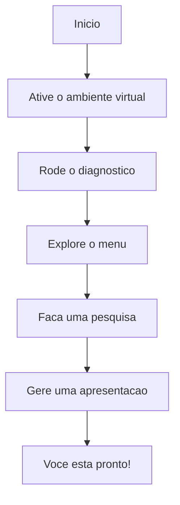
```mermaid
flowchart TD
    START[Inicio] --> A1[Ative o ambiente virtual]
    A1 --> A2[Rode o diagnostico]
    A2 --> A3[Explore o menu]
    A3 --> A4[Faca uma pesquisa]
    A4 --> A5[Gere uma apresentacao]
    A5 --> DONE[Voce esta pronto!]
```

---

# Visao Geral da Arquitetura

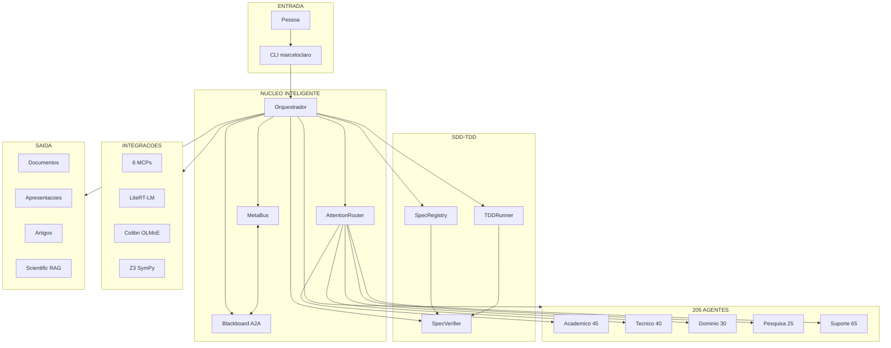
```mermaid
flowchart TB
    subgraph E[ENTRADA]
        USER[Pessoa]
        CLI[CLI marceloclaro]
    end

    subgraph N[NUCLEO INTELIGENTE]
        ORQ[Orquestrador]
        ATT[AttentionRouter]
        META[MetaBus]
        BB[Blackboard A2A]
    end

    subgraph S[SDD-TDD]
        SPEC[SpecRegistry]
        VER[SpecVerifier]
        TDD[TDDRunner]
    end

    subgraph A[205 AGENTES]
        ACAD[Academico 45]
        TECH[Tecnico 40]
        DOM[Dominio 30]
        RES[Pesquisa 25]
        SUP[Suporte 65]
    end

    subgraph I[INTEGRACOES]
        MCP[6 MCPs]
        LIT[LiteRT-LM]
        COL[Colibri OLMoE]
        Z3[Z3 SymPy]
    end

    subgraph O[SAIDA]
        DOC[Documentos]
        PRES[Apresentacoes]
        PAPER[Artigos]
        RAG[Scientific RAG]
    end

    USER --> CLI
    CLI --> ORQ
    ORQ --> ATT
    ORQ --> META
    ORQ --> BB
    ORQ --> SPEC
    ORQ --> VER
    ORQ --> TDD
    ORQ --> A
    ORQ --> I
    ORQ --> O
    META <--> BB
    SPEC --> VER
    TDD --> VER
    ATT --> ACAD
    ATT --> TECH
    ATT --> DOM
    ATT --> RES
    ATT --> SUP
```

---

## Camadas Tecnicas

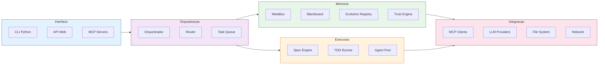
```mermaid
flowchart LR
    subgraph C1[Interface]
        CLI2[CLI Python]
        WEB[API Web]
        MCP2[MCP Servers]
    end

    subgraph C2[Orquestracao]
        ORQ2[Orquestrador]
        ROUTE[Router]
        QUEUE[Task Queue]
    end

    subgraph C3[Memoria]
        MB[MetaBus]
        BB2[Blackboard]
        EVO[Evolution Registry]
        TRUST[Trust Engine]
    end

    subgraph C4[Execucao]
        SDD2[Spec Engine]
        TDD2[TDD Runner]
        AG2[Agent Pool]
    end

    subgraph C5[Integracao]
        MCP3[MCP Clients]
        LLM[LLM Providers]
        FS[File System]
        NET[Network]
    end

    C1 --> C2
    C2 --> C3
    C2 --> C4
    C3 --> C5
    C4 --> C5

    style C1 fill:#e3f2fd,stroke:#1565c0
    style C2 fill:#f3e5f5,stroke:#7b1fa2
    style C3 fill:#e8f5e9,stroke:#2e7d32
    style C4 fill:#fff3e0,stroke:#ef6c00
    style C5 fill:#fce4ec,stroke:#c62828
```

---

## Ciclo de Vida Completo

```mermaid
flowchart TD
    START2[Inicio] --> REC[Recebe Tarefa]
    REC --> PARSE[Analisa Tarefa]
    PARSE --> CLASS{Classificacao}

    CLASS --> "Simples" SIMPLE[Processamento Simples]
    CLASS --> "Complexa" COMPLEX[Processamento Complexo]
    CLASS --> "Critica" CRITICAL[Processamento Critico]

    SIMPLE --> S1[Seleciona Agente]
    COMPLEX --> C1[Cria Especificacao]
    CRITICAL --> CR1[Ativa Protocolo]

    S1 --> S2[Executa Tarefa]
    C1 --> C2[Valida Com Criterios]
    CR1 --> CR2[Mobiliza Agentes]

    S2 --> S3[Retorna Resultado]
    C2 --> C3[Implementa Solucao]
    CR2 --> CR3[Coordena Paralela]

    C3 --> C4[Roda Testes]
    CR3 --> CR4[Valida Cadeia]

    C4 --> C5{Testes OK?}
    CR4 --> CR5{Todos OK?}

    C5 --> "Sim" S3
    C5 --> "Nao" C3
    CR5 --> "Sim" S3
    CR5 --> "Nao" CR3

    S3 --> LOG[Registra Log]
    LOG --> EVO2[Atualiza Registry]
    EVO2 --> RETURN2[Retorna Resultado]

    style START2 fill:#e3f2fd,stroke:#1565c0,stroke-width:3px
    style REC fill:#f3e5f5,stroke:#7b1fa2
    style PARSE fill:#e8f5e9,stroke:#2e7d32
    style CLASS fill:#fff3e0,stroke:#ef6c00
    style RETURN2 fill:#e8f5e9,stroke:#2e7d32,stroke-width:3px
```

---

# Fluxos de Trabalho

## Fluxo Principal

```mermaid
flowchart TD
    START3[Inicio] --> P[PERCEBER]
    P --> P1[Consulta MetaBus]
    P1 --> P2[Recupera contexto]
    P2 --> P3[Verifica licoes]
    P3 --> E[ESPECIFICAR]
    E --> E1{Spec existe?}
    E1 --> "Sim" E2[Recupera spec]
    E1 --> "Nao" E3[Cria nova spec]
    E2 --> D[DELEGAR]
    E3 --> D
    D --> D1[Publica CFP]
    D1 --> D2[Agentes avaliam]
    D2 --> D3{Ha voluntarios?}
    D3 --> "Sim" D4[Seleciona agente]
    D3 --> "Nao" D5[Reformula tarefa]
    D5 --> D1
    D4 --> EX[EXECUTAR]
    EX --> EX1[Ciclo RED-GREEN]
    EX1 --> EX2[Implementa solucao]
    EX2 --> EX3[Roda testes]
    EX3 --> EX4{Testes OK?}
    EX4 --> "Sim" EX5[Refatora codigo]
    EX4 --> "Nao" EX2
    EX5 --> V[VERIFICAR]
    V --> V1[Gate SDD]
    V1 --> V2[SpecVerifier]
    V2 --> V3{Criterios OK?}
    V3 --> "Sim" V4[Aprova entrega]
    V3 --> "Nao" V5[Rejeita com feedback]
    V5 --> EX
    V4 --> R[REFLETIR]
    R --> R1[Registra licoes]
    R1 --> R2[Atualiza Trust]
    R2 --> R3[Atualiza Registry]
    R3 --> DONE3[Tarefa Concluida]

    style START3 fill:#e3f2fd,stroke:#1565c0,stroke-width:3px
    style P fill:#f3e5f5,stroke:#7b1fa2
    style E fill:#e8f5e9,stroke:#2e7d32
    style D fill:#fff3e0,stroke:#ef6c00
    style EX fill:#fce4ec,stroke:#c62828
    style V fill:#e0f7fa,stroke:#00838f
    style R fill:#f1f8e9,stroke:#558b2f
    style DONE3 fill:#e8f5e9,stroke:#2e7d32,stroke-width:3px
```

---

## Decisao de Roteamento

```mermaid
flowchart TD
    TASK[Nova Tarefa] --> CLASS2{Classificacao}

    CLASS2 --> "Pesquisa" ACAD2[Pipeline Academico]
    CLASS2 --> "Codigo" TECH2[Agente Tecnico]
    CLASS2 --> "Dominio" DOM2[Especialista]
    CLASS2 --> "Apresentacao" PRES2[MIRA]
    CLASS2 --> "Formal" FORM2[Formal Verifier]
    CLASS2 --> "Texto" TEXT2[Escritor]
    CLASS2 --> "Dados" DATA2[Analista]

    ACAD2 --> A21[Busca literatura]
    ACAD2 --> A22[Coleta evidencias]
    ACAD2 --> A23[Revisao pares]
    ACAD2 --> A24[Redacao artigo]

    TECH2 --> T21[Analisa codigo]
    TECH2 --> T22[Implementa solucao]
    TECH2 --> T23[Testa e valida]
    TECH2 --> T24[Documenta]

    DOM2 --> D21[Consulta especialista]
    DOM2 --> D22[Aplica conhecimento]
    DOM2 --> D23[Gera relatorio]

    PRES2 --> P21[Extrai conteudo]
    PRES2 --> P22[Planeja slides]
    PRES2 --> P23[Constroi deck]
    PRES2 --> P24[Valida consistencia]

    FORM2 --> F21[Formaliza problema]
    FORM2 --> F22[Gera prova]
    FORM2 --> F23[Verifica Z3]

    TEXT2 --> TX21[Analisa audiencia]
    TEXT2 --> TX22[Estrutura texto]
    TEXT2 --> TX23[Revisa gramatica]

    DATA2 --> DA21[Coleta dados]
    DATA2 --> DA22[Analise estatistica]
    DATA2 --> DA23[Visualizacoes]

    style TASK fill:#e3f2fd,stroke:#1565c0,stroke-width:3px
    style CLASS2 fill:#f3e5f5,stroke:#7b1fa2
    style ACAD2 fill:#e8f5e9,stroke:#2e7d32
    style TECH2 fill:#fff3e0,stroke:#ef6c00
    style DOM2 fill:#fce4ec,stroke:#c62828
    style PRES2 fill:#e0f7fa,stroke:#00838f
    style FORM2 fill:#f1f8e9,stroke:#558b2f
    style TEXT2 fill:#f3e5f5,stroke:#7b1fa2
    style DATA2 fill:#e3f2fd,stroke:#1565c0
```

---

## Fluxo de uma Tarefa

```mermaid
flowchart TD
    subgraph F1[Fase 1 Recebimento]
        R1[Recebe tarefa]
        R2[Valida formato]
        R3[Extrai metadados]
        R4[Gera ID unico]
    end

    subgraph F2[Fase 2 Analise]
        A1[Analisa complexidade]
        A2[Identifica dependencias]
        A3[Estima recursos]
        A4[Seleciona estrategia]
    end

    subgraph F3[Fase 3 Planejamento]
        P1[Cria especificacao]
        P2[Define criterios]
        P3[Vincula testes]
        P4[Estima tempo]
    end

    subgraph F4[Fase 4 Alocacao]
        AL1[Busca agentes]
        AL2[Avalia confianca]
        AL3[Seleciona melhor]
        AL4[Transfere contexto]
    end

    subgraph F5[Fase 5 Execucao]
        E1[Executa tarefa]
        E2[Monitora progresso]
        E3[Roda testes]
        E4[Trata erros]
    end

    subgraph F6[Fase 6 Validacao]
        V1[Verifica criterios]
        V2[Roda quality gates]
        V3[Gera relatorio]
        V4[Aprova ou rejeita]
    end

    subgraph F7[Fase 7 Entrega]
        D1[Formata resultado]
        D2[Gera documentacao]
        D3[Armazena resultado]
        D4[Notifica usuario]
    end

    subgraph F8[Fase 8 Reflexao]
        RE1[Registra licoes]
        RE2[Atualiza confianca]
        RE3[Compartilha conhecimento]
        RE4[Otimiza processos]
    end

    F1 --> F2
    F2 --> F3
    F3 --> F4
    F4 --> F5
    F5 --> F6
    F6 --> "Aprovado" F7
    F6 --> "Reprovado" F5
    F7 --> F8

    style F1 fill:#e3f2fd,stroke:#1565c0
    style F2 fill:#f3e5f5,stroke:#7b1fa2
    style F3 fill:#e8f5e9,stroke:#2e7d32
    style F4 fill:#fff3e0,stroke:#ef6c00
    style F5 fill:#fce4ec,stroke:#c62828
    style F6 fill:#e0f7fa,stroke:#00838f
    style F7 fill:#f1f8e9,stroke:#558b2f
    style F8 fill:#e8f5e9,stroke:#2e7d32
```

---

# Sistema de Memoria

## Visao Geral da Memoria

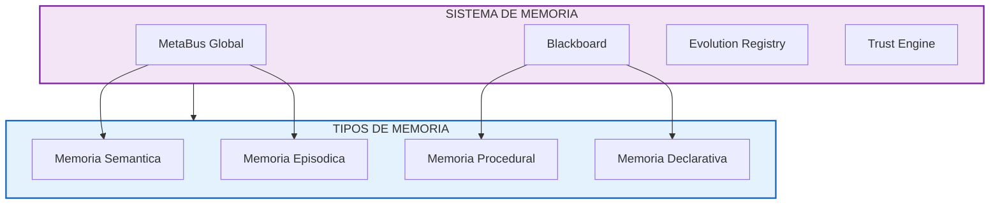
```mermaid
flowchart TB
    subgraph MEM[SISTEMA DE MEMORIA]
        MB2[MetaBus Global]
        BB3[Blackboard]
        EVO3[Evolution Registry]
        TRUST2[Trust Engine]
    end

    subgraph TIP[TIPOS DE MEMORIA]
        SEM[Memoria Semantica]
        EPI[Memoria Episodica]
        PROC[Memoria Procedural]
        DECL[Memoria Declarativa]
    end

    MEM --> TIP
    MB2 --> SEM
    MB2 --> EPI
    BB3 --> PROC
    BB3 --> DECL

    style MEM fill:#f3e5f5,stroke:#7b1fa2,stroke-width:2px
    style TIP fill:#e3f2fd,stroke:#1565c0,stroke-width:2px
```

---

## Fluxo de Conhecimento


```mermaid
flowchart TD
    subgraph IN[ENTRADA]
        USER2[Usuario]
        AGENT[Agente]
        EXT[Externo]
    end

    subgraph PR[PROCESSAMENTO]
        CAPTURE[Captura]
        VALIDATE[Validacao]
        ENRICH[Enriquecimento]
        INDEX[Indexacao]
    end

    subgraph ST[ARMAZENAMENTO]
        MB3[MetaBus]
        BB4[Blackboard]
        VECTOR[Vector Store]
        GRAPH[Knowledge Graph]
    end

    subgraph RE[RECUPERACAO]
        SEARCH[Busca Semantica]
        RANK[Ranqueamento]
        FILTER[Filtro]
        CONTEXT[Contexto]
    end

    subgraph OUT[SAIDA]
        ANSWER[Resposta]
        INSIGHT[Insight]
        RECOMMEND[Recomendacao]
        ACTION[Acao]
    end

    IN --> PR
    PR --> ST
    ST --> RE
    RE --> OUT

    USER2 --> CAPTURE
    AGENT --> CAPTURE
    EXT --> CAPTURE
    CAPTURE --> VALIDATE --> ENRICH --> INDEX
    INDEX --> MB3
    INDEX --> BB4
    INDEX --> VECTOR
    INDEX --> GRAPH
    MB3 --> SEARCH
    BB4 --> SEARCH
    VECTOR --> SEARCH
    GRAPH --> SEARCH
    SEARCH --> RANK --> FILTER --> CONTEXT
    CONTEXT --> ANSWER
    CONTEXT --> INSIGHT
    CONTEXT --> RECOMMEND
    CONTEXT --> ACTION

    style IN fill:#e3f2fd,stroke:#1565c0
    style PR fill:#f3e5f5,stroke:#7b1fa2
    style ST fill:#e8f5e9,stroke:#2e7d32
    style RE fill:#fff3e0,stroke:#ef6c00
    style OUT fill:#e0f7fa,stroke:#00838f
```

---

## Aprendizado Continuo

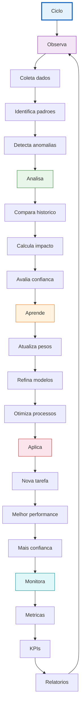
```mermaid
flowchart TD
    START4[Ciclo] --> OBS[Observa]
    OBS --> O1[Coleta dados]
    O1 --> O2[Identifica padroes]
    O2 --> O3[Detecta anomalias]
    O3 --> ANA[Analisa]
    ANA --> A1[Compara historico]
    A1 --> A2[Calcula impacto]
    A2 --> A3[Avalia confianca]
    A3 --> LEARN[Aprende]
    LEARN --> L1[Atualiza pesos]
    L1 --> L2[Refina modelos]
    L2 --> L3[Otimiza processos]
    L3 --> APPL[Aplica]
    APPL --> AP1[Nova tarefa]
    AP1 --> AP2[Melhor performance]
    AP2 --> AP3[Mais confianca]
    AP3 --> MON[Monitora]
    MON --> M1[Metricas]
    M1 --> M2[KPIs]
    M2 --> M3[Relatorios]
    M3 --> OBS

    style START4 fill:#e3f2fd,stroke:#1565c0,stroke-width:3px
    style OBS fill:#f3e5f5,stroke:#7b1fa2
    style ANA fill:#e8f5e9,stroke:#2e7d32
    style LEARN fill:#fff3e0,stroke:#ef6c00
    style APPL fill:#fce4ec,stroke:#c62828
    style MON fill:#e0f7fa,stroke:#00838f
```

---

# SDD/TDD e Qualidade

## Ciclo SDD/TDD

```mermaid
flowchart TD
    subgraph SDD[SDD Spec Driven]
        SPEC1[Cria Spec]
        SPEC1 --> CRIT[Criterios]
        CRIT --> TESTS[Testes]
    end

    subgraph TDD[TDD Test Driven]
        RED[RED Testes Falham]
        RED --> GREEN[GREEN Implementacao]
        GREEN --> REFACTOR[REFACTOR Melhora]
        REFACTOR --> VERIFY[VERIFY Passam]
    end

    subgraph GATE[GATE Validacao]
        GATE1[SpecVerifier]
        GATE1 --> CHECK{Criterios OK?}
    CHECK --> "Sim" APPROVE[APROVADO]
    CHECK --> "Nao" REJECT[REPROVADO]
        REJECT --> RED
    end

    SPEC1 --> RED
    TESTS --> RED
    VERIFY --> GATE1

    style SDD fill:#e3f2fd,stroke:#1565c0
    style TDD fill:#e8f5e9,stroke:#2e7d32
    style GATE fill:#fff3e0,stroke:#ef6c00
    style RED fill:#ffebee,stroke:#c62828
    style GREEN fill:#e8f5e9,stroke:#2e7d32
    style REFACTOR fill:#e3f2fd,stroke:#1565c0
    style APPROVE fill:#e8f5e9,stroke:#2e7d32,stroke-width:3px
    style REJECT fill:#ffebee,stroke:#c62828,stroke-width:3px
```

---

## Quality Gates

```mermaid
flowchart TD
    subgraph GATES[QUALITY GATES]
        G1[Gate 1 Formato]
        G2[Gate 2 Especificacao]
        G3[Gate 3 Testes]
        G4[Gate 4 Metricas]
        G5[Gate 5 Revisao]
        G6[Gate 6 Seguranca]
    end

    subgraph CHECKS[VERIFICACOES]
        C1[Arquivo existe]
        C2[Formato valido]
        C3[Specs atendidas]
        C4[Testes passam]
        C5[Cobertura 80%]
        C6[Sem vulnerabilidades]
    end

    subgraph RESULTS[RESULTADOS]
        R1[Aprovado]
        R2[Aprovado com ressalvas]
        R3[Reprovado]
    end

    G1 --> C1 --> C2 --> G2 --> C3 --> G3 --> C4 --> G4 --> C5 --> G5 --> C6 --> G6
    G6 --> "Tudo OK" R1
    G6 --> "Problemas menores" R2
    G6 --> "Problemas criticos" R3
    R3 --> "Corrige" G1

    style GATES fill:#f3e5f5,stroke:#7b1fa2
    style CHECKS fill:#e8f5e9,stroke:#2e7d32
    style RESULTS fill:#e3f2fd,stroke:#1565c0
    style R1 fill:#e8f5e9,stroke:#2e7d32,stroke-width:3px
    style R2 fill:#fff3e0,stroke:#ef6c00,stroke-width:3px
    style R3 fill:#ffebee,stroke:#c62828,stroke-width:3px
```

---

## Auditoria e Validacao

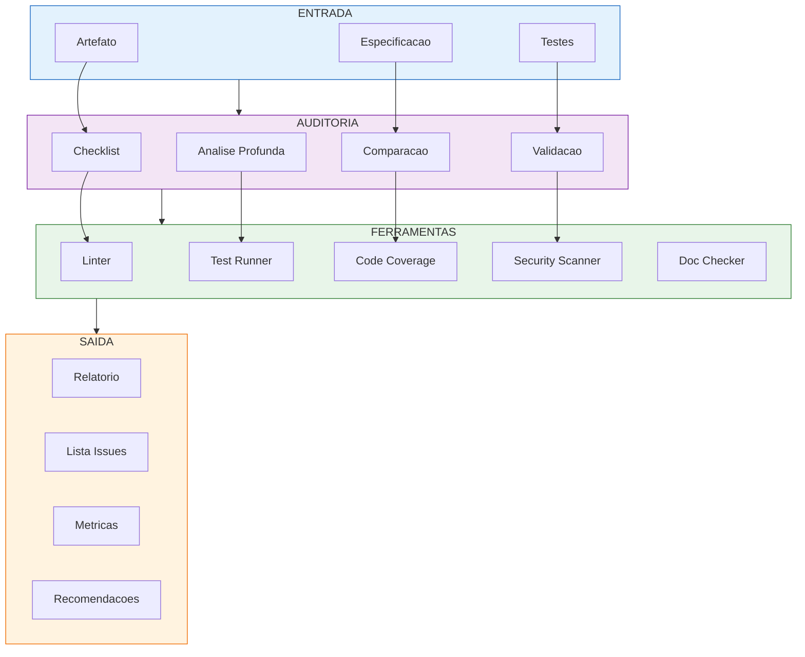
```mermaid
flowchart TD
    subgraph IN2[ENTRADA]
        ARTIFACT[Artefato]
        SPEC2[Especificacao]
        TEST2[Testes]
    end

    subgraph AUD[AUDITORIA]
        A1[Checklist]
        A2[Analise Profunda]
        A3[Comparacao]
        A4[Validacao]
    end

    subgraph TOOLS[FERRAMENTAS]
        T1[Linter]
        T2[Test Runner]
        T3[Code Coverage]
        T4[Security Scanner]
        T5[Doc Checker]
    end

    subgraph OUT2[SAIDA]
        O1[Relatorio]
        O2[Lista Issues]
        O3[Metricas]
        O4[Recomendacoes]
    end

    IN2 --> AUD
    AUD --> TOOLS
    TOOLS --> OUT2

    ARTIFACT --> A1
    SPEC2 --> A3
    TEST2 --> A4
    A1 --> T1
    A2 --> T2
    A3 --> T3
    A4 --> T4

    style IN2 fill:#e3f2fd,stroke:#1565c0
    style AUD fill:#f3e5f5,stroke:#7b1fa2
    style TOOLS fill:#e8f5e9,stroke:#2e7d32
    style OUT2 fill:#fff3e0,stroke:#ef6c00
```

---

# Pipeline Academico

## Visao Geral do Pipeline


```mermaid
flowchart LR
    subgraph F1[Fase 1 Descoberta]
        I[Ideia]
        G[Gap Pesquisa]
        P[Proposta]
    end

    subgraph F2[Fase 2 Pesquisa]
        L[Revisao Literaria]
        E[Coleta Dados]
        M[Metodologia]
    end

    subgraph F3[Fase 3 Analise]
        A[Analise Estatistica]
        V[Validacao]
        R[Resultados]
    end

    subgraph F4[Fase 4 Escrita]
        D[Rascunho]
        REV[Revisao]
        F[Final]
    end

    subgraph F5[Fase 5 Publicacao]
        SUB[Submissao]
        PR[Peer Review]
        PUB[Publicacao]
    end

    I --> G --> P
    P --> L --> E --> M
    M --> A --> V --> R
    R --> D --> REV --> F
    F --> SUB --> PR --> PUB

    style F1 fill:#e3f2fd,stroke:#1565c0
    style F2 fill:#f3e5f5,stroke:#7b1fa2
    style F3 fill:#e8f5e9,stroke:#2e7d32
    style F4 fill:#fff3e0,stroke:#ef6c00
    style F5 fill:#fce4ec,stroke:#c62828
```

---

## Busca de Literatura

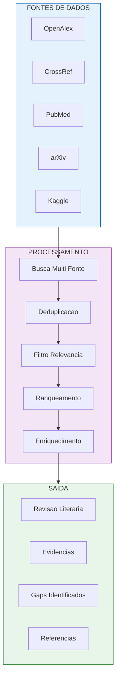
```mermaid
flowchart TD
    subgraph SRC[FONTES DE DADOS]
        OA[OpenAlex]
        CR[CrossRef]
        PM[PubMed]
        AR[arXiv]
        KG[Kaggle]
    end

    subgraph PROC[PROCESSAMENTO]
        SEARCH2[Busca Multi Fonte]
        DEDUP[Deduplicacao]
        FILTER2[Filtro Relevancia]
        RANK2[Ranqueamento]
        ENRICH2[Enriquecimento]
    end

    subgraph OUT3[SAIDA]
        LIT[Revisao Literaria]
        EVID[Evidencias]
        GAP2[Gaps Identificados]
        REF[Referencias]
    end

    SRC --> SEARCH2
    SEARCH2 --> DEDUP --> FILTER2 --> RANK2 --> ENRICH2 --> OUT3

    style SRC fill:#e3f2fd,stroke:#1565c0
    style PROC fill:#f3e5f5,stroke:#7b1fa2
    style OUT3 fill:#e8f5e9,stroke:#2e7d32
```

---

## Analise de Dados

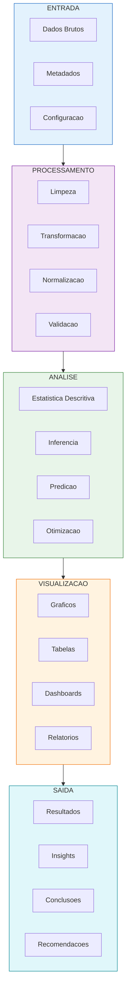
```mermaid
flowchart TD
    subgraph IN3[ENTRADA]
        RAW[Dados Brutos]
        META2[Metadados]
        CONFIG[Configuracao]
    end

    subgraph PR2[PROCESSAMENTO]
        CLEAN[Limpeza]
        TRANSFORM[Transformacao]
        NORMALIZE[Normalizacao]
        VALIDATE2[Validacao]
    end

    subgraph AN[ANALISE]
        DESC[Estatistica Descritiva]
        INFER[Inferencia]
        PREDICT[Predicao]
        OPTIMIZE[Otimizacao]
    end

    subgraph VIS[VISUALIZACAO]
        CHART[Graficos]
        TABLE2[Tabelas]
        DASHBOARD[Dashboards]
        REPORT2[Relatorios]
    end

    subgraph OUT4[SAIDA]
        RESULT[Resultados]
        INSIGHT2[Insights]
        CONCLUSION[Conclusoes]
        RECOMMEND2[Recomendacoes]
    end

    IN3 --> PR2 --> AN --> VIS --> OUT4

    style IN3 fill:#e3f2fd,stroke:#1565c0
    style PR2 fill:#f3e5f5,stroke:#7b1fa2
    style AN fill:#e8f5e9,stroke:#2e7d32
    style VIS fill:#fff3e0,stroke:#ef6c00
    style OUT4 fill:#e0f7fa,stroke:#00838f
```

---

# Agentes e Integracoes

## Mapa de Agentes


```mermaid
flowchart TB
    subgraph ACADEMIC[AGENTES ACADEMICOS 45]
        AC1[Editor Chefe]
        AC2[Escopo]
        AC3[Busca]
        AC4[Evidencias]
        AC5[Estrutura]
        AC6[Revisao]
        AC7[Metodologia]
        AC8[Estatistica]
        AC9[Visualizacao]
        AC10[Resultados]
    end

    subgraph TECH[AGENTES TECNICOS 40]
        TC1[Coder]
        TC2[Researcher]
        TC3[Writer]
        TC4[Reviewer]
        TC5[Debugger]
        TC6[Optimizer]
        TC7[Architect]
    end

    subgraph DOMAIN[ESPECIALISTAS 30]
        DM1[Cardiologista]
        DM2[Neurologista]
        DM3[Radiologista]
        DM4[Educador]
        DM5[Juridico]
        DM6[Economista]
    end

    subgraph RESEARCH[AGENTES PESQUISA 25]
        RS1[Literatura]
        RS2[Dados]
        RS3[Analise]
        RS4[Redacao]
        RS5[Validacao]
    end

    subgraph SUP[AGENTES SUPORTE 65]
        SP1[Documentacao]
        SP2[Testes]
        SP3[Seguranca]
        SP4[Metricas]
        SP5[Deploy]
        SP6[Debug]
    end

    ACADEMIC --> TECH --> DOMAIN --> RESEARCH --> SUP

    style ACADEMIC fill:#e3f2fd,stroke:#1565c0,stroke-width:2px
    style TECH fill:#fff3e0,stroke:#ef6c00,stroke-width:2px
    style DOMAIN fill:#fce4ec,stroke:#c62828,stroke-width:2px
    style RESEARCH fill:#e8f5e9,stroke:#2e7d32,stroke-width:2px
    style SUP fill:#f3e5f5,stroke:#7b1fa2,stroke-width:2px
```

---

## Integracoes MCP

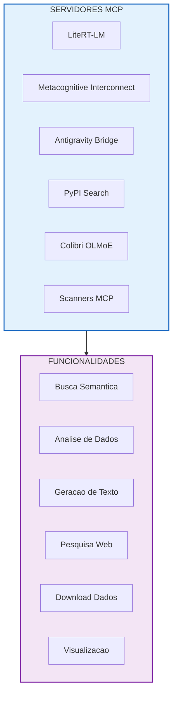
```mermaid
flowchart TB
    subgraph MCP_SERVERS[SERVIDORES MCP]
        LITERT2[LiteRT-LM]
        META3[Metacognitive Interconnect]
        ANTI[Antigravity Bridge]
        PYPI[PyPI Search]
        COLIBRI2[Colibri OLMoE]
        SCANNER[Scanners MCP]
    end

    subgraph FEATURES[FUNCIONALIDADES]
        F1[Busca Semantica]
        F2[Analise de Dados]
        F3[Geracao de Texto]
        F4[Pesquisa Web]
        F5[Download Dados]
        F6[Visualizacao]
    end

    MCP_SERVERS --> FEATURES

    style MCP_SERVERS fill:#e3f2fd,stroke:#1565c0,stroke-width:2px
    style FEATURES fill:#f3e5f5,stroke:#7b1fa2,stroke-width:2px
```

---

## Trust Engine

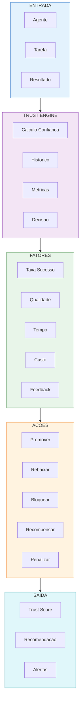
```mermaid
flowchart TD
    subgraph IN5[ENTRADA]
        AGENT2[Agente]
        TASK2[Tarefa]
        RESULT2[Resultado]
    end

    subgraph TRUST_ENGINE[TRUST ENGINE]
        CALC[Calculo Confianca]
        HISTORY[Historico]
        METRICS2[Metricas]
        DECISION[Decisao]
    end

    subgraph FAC[FATORES]
        SUCESSO[Taxa Sucesso]
        QUALIDADE[Qualidade]
        TEMPO[Tempo]
        CUSTO[Custo]
        FEEDBACK[Feedback]
    end

    subgraph ACT[ACOES]
        PROMOTE[Promover]
        DEMOTE[Rebaixar]
        BLOCK[Bloquear]
        REWARD[Recompensar]
        PENALIZE[Penalizar]
    end

    subgraph OUT5[SAIDA]
        TRUST_SCORE[Trust Score]
        RECOMMEND3[Recomendacao]
        ALERT[Alertas]
    end

    IN5 --> TRUST_ENGINE --> FAC --> ACT --> OUT5

    style IN5 fill:#e3f2fd,stroke:#1565c0
    style TRUST_ENGINE fill:#f3e5f5,stroke:#7b1fa2
    style FAC fill:#e8f5e9,stroke:#2e7d32
    style ACT fill:#fff3e0,stroke:#ef6c00
    style OUT5 fill:#e0f7fa,stroke:#00838f
```

---

# Dados e Metricas

## Dados Cientificos

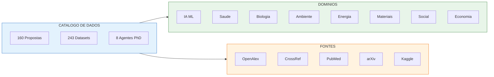
```mermaid
flowchart LR
    subgraph CATALOG[CATALOGO DE DADOS]
        PROP[160 Propostas]
        DS[243 Datasets]
        AG[8 Agentes PhD]
    end

    subgraph DOM[DOMINIOS]
        AI[IA ML]
        HEALTH[Saude]
        BIO[Biologia]
        ENV[Ambiente]
        ENERGY[Energia]
        MAT[Materiais]
        SOC[Social]
        ECON[Economia]
    end

    subgraph SRC2[FONTES]
        OA2[OpenAlex]
        CR2[CrossRef]
        PM2[PubMed]
        AR2[arXiv]
        KG2[Kaggle]
    end

    CATALOG --> DOM
    CATALOG --> SRC2

    style CATALOG fill:#e3f2fd,stroke:#1565c0
    style DOM fill:#e8f5e9,stroke:#2e7d32
    style SRC2 fill:#fff3e0,stroke:#ef6c00
```

---

## Tabela Detalhada do Repositorio de Dados

### 160 Propostas de Pesquisa por Dominio

| Dominio | Agente | Propostas | Temas Principais |
|---|---|---|---|
| **Healthcare** | Dr. Healthcare ML PhD | 20 | Interpretabilidade IA, Sesgo Algoritmico, Fusao Multimodal, LLMs Clinicas, Aprendizado Federado, Privacidade Diferencial, Transfer Learning, Deteccao Anomalias, Equidade Algoritmica, Knowledge Graphs |
| **Environment** | Dr. Environmental AI PhD | 20 | Predicao Climatica, Monitoramento Desmatamento, Qualidade Ar IoT, Gestao Hidrica, Predicao Secas, Biodiversidade, Oceanos, Energia Renovavel |
| **Social Sciences** | Dr. Social Computing PhD | 20 | Fake News, Sentimento Redes Sociais, Polarizacao Politica, Desigualdade Social, Mobilidade Urbana, Educacao, Emprego, Migracao, Pobreza, Criminalidade |
| **Computer Science** | Dr. ML Systems PhD | 20 | Deteccao Fraude GNN, Otimizacao Redes Neurais, Recomendacao, Seguranca Cibernetica, Compiladores, NLP, Classificacao Imagens |
| **Engineering** | Dr. Engineering AI PhD | 20 | Manutencao Preditiva, Otimizacao Industrial, Materiais Inteligentes, Robotica, Energia Inteligencia, Saude Estrutural, Manufatura |
| **Biology** | Dr. Computational Biology PhD | 20 | Estrutura Proteica LLMs, Genomica Single-Cell, Descoberta Drogas, Evolucao Molecular, Biodiversidade, Ecologia, Microbioma |
| **Finance** | Dr. Financial AI PhD | 20 | Volatilidade GNN, Lavagem Dinheiro, Credito Inteligente, Mercados RL, Risco Sistêmico, Criptomoedas, Indicadores Economicos, Seguros |
| **Agriculture** | Dr. AgriTech AI PhD | 20 | Pragas Drone+IA, Agricultura Precisao, Qualidade Solo, Genomica Plantas, Cadeia Produtiva, Produtividade Agricola, Seguranca Alimentar, Irrigacao |
| **TOTAL** | **8 Agentes PhD** | **160** | **43 temas unicos** |

### 243 Datasets por Fonte e Dominio

| Fonte | Quantidade | Formato | Acesso |
|---|---|---|---|
| **Kaggle** | 122 | CSV, JSON | Publico |
| **HuggingFace** | 121 | Parquet, JSON, CSV | Publico |
| **TOTAL** | **243** | Multi-formato | **100% Open Access** |

### 243 Datasets por Dominio

| Dominio | Datasets | Downloads | Temas |
|---|---|---|---|
| **Meio Ambiente** | 35 | 1.2M+ | Qualidade do Ar, Biodiversidade, Mudanca Climatica, Desmatamento, Oceanos, Energia Renovavel |
| **Ciencias Sociais** | 34 | 980K+ | Criminalidade, Educacao, Emprego, Desigualdade, Migracao, Pobreza |
| **Saude** | 32 | 1.5M+ | Diabetes, Cancer, Doencas Cardiacas, COVID-19, Descoberta Drogas, Saude Mental |
| **Financas** | 30 | 850K+ | Risco Credito, Criptomoedas, Indicadores Economicos, Seguros, Bolsa Valores |
| **Ciencia Computacao** | 29 | 1.1M+ | Deteccao Fraude, Classificacao Imagens, Seguranca Redes, Sistemas Recomendacao |
| **Biologia** | 29 | 720K+ | Ecologia, Genomica, Microbioma, Estrutura Proteica, Identificacao Especies |
| **Engenharia** | 27 | 680K+ | Consumo Energia, Manufatura, Ciencia Materiais, Robotica, Saude Estrutural |
| **Agricultura** | 27 | 540K+ | Produtividade Agricola, Seguranca Alimentar, Irrigacao, Deteccao Pragas, Qualidade Solo |
| **TOTAL** | **243** | **7.6M+** | **43 temas unicos** |

### Exemplos de Datasets por Dominio

| Dominio | Dataset Original | Dataset em Portugues | Fonte | Downloads |
|---|---|---|---|---|
| **Saude** | Diabetes | Diabetes | Kaggle | 12,620 |
| **Saude** | Heart Disease | Doencas Cardiacas | Kaggle | 8,450 |
| **Saude** | Cancer | Cancer | Kaggle | 6,230 |
| **Saude** | COVID-19 | COVID-19 | Kaggle | 15,800 |
| **Saude** | Mental Health | Saude Mental | HuggingFace | 3,450 |
| **Saude** | Drug Discovery | Descoberta de Drogas | HuggingFace | 2,120 |
| **Ambiente** | Climate Change | Mudanca Climatica | Kaggle | 5,230 |
| **Ambiente** | Air Quality | Qualidade do Ar | Kaggle | 4,560 |
| **Ambiente** | Deforestation | Desmatamento | HuggingFace | 3,890 |
| **Ambiente** | Biodiversity | Biodiversidade | HuggingFace | 2,340 |
| **Ambiente** | Ocean | Oceano | Kaggle | 1,890 |
| **Ambiente** | Renewable Energy | Energia Renovavel | HuggingFace | 2,560 |
| **Social** | Crime | Criminalidade | Kaggle | 4,120 |
| **Social** | Education | Educacao | Kaggle | 3,890 |
| **Social** | Employment | Emprego | HuggingFace | 2,560 |
| **Social** | Inequality | Desigualdade | Kaggle | 3,210 |
| **Social** | Migration | Migracao | HuggingFace | 2,890 |
| **Social** | Poverty | Pobreza | Kaggle | 2,340 |
| **Financas** | Credit Risk | Risco de Credito | Kaggle | 5,670 |
| **Financas** | Cryptocurrency | Criptomoeda | Kaggle | 8,900 |
| **Financas** | Stock Market | Bolsa de Valores | HuggingFace | 15,800 |
| **Financas** | Insurance | Seguro | Kaggle | 3,450 |
| **Financas** | Economic Indicators | Indicadores Economicos | HuggingFace | 2,780 |
| **Computacao** | Fraud Detection | Deteccao de Fraude | Kaggle | 6,780 |
| **Computacao** | Image Classification | Classificacao de Imagens | HuggingFace | 45,200 |
| **Computacao** | Network Security | Seguranca de Redes | Kaggle | 3,890 |
| **Computacao** | Recommendation System | Sistema de Recomendacao | HuggingFace | 5,670 |
| **Biologia** | Genomics | Genomica | Kaggle | 3,120 |
| **Biologia** | Protein Structure | Estrutura Proteica | HuggingFace | 2,560 |
| **Biologia** | Ecology | Ecologia | Kaggle | 2,890 |
| **Biologia** | Microbiome | Microbioma | HuggingFace | 1,890 |
| **Biologia** | Species Identification | Identificacao de Especies | Kaggle | 2,340 |
| **Engenharia** | Energy Consumption | Consumo de Energia | Kaggle | 4,560 |
| **Engenharia** | Manufacturing | Manufatura | HuggingFace | 3,210 |
| **Engenharia** | Material Science | Ciencia de Materiais | Kaggle | 2,890 |
| **Engenharia** | Robotics | Robotica | HuggingFace | 3,450 |
| **Engenharia** | Structural Health | Saude Estrutural | Kaggle | 2,120 |
| **Agricultura** | Crop Yield | Produtividade Agricola | HuggingFace | 2,890 |
| **Agricultura** | Food Security | Seguranca Alimentar | Kaggle | 2,340 |
| **Agricultura** | Irrigation | Irrigacao | HuggingFace | 1,890 |
| **Agricultura** | Pest Detection | Deteccao de Pragas | Kaggle | 2,560 |
| **Agricultura** | Soil Quality | Qualidade do Solo | HuggingFace | 2,120 |

### Acesso aos Dados

| Recurso | URL |
|---|---|
| **GitHub (codigo)** | `data/research_proposals.json` |
| **GitHub (catalogo)** | `data/scientific_datasets_catalog.json` |
| **HuggingFace** | `huggingface.co/datasets/marceloclaro/opencode-research` |
| **Kaggle** | `kaggle.com/marceloclaro` |
| **API** | `python3 -m marceloclaro.cli pesquisa "tema"` |

### Como Usar os Dados

```bash
# Carregar propostas de pesquisa
python3 -c "
import json
with open('data/research_proposals.json') as f:
    data = json.load(f)
for domain, info in data.items():
    print(f'{domain}: {len(info[\"proposals\"])} propostas')
"

# Carregar catalogo de datasets
python3 -c "
import json
with open('data/scientific_datasets_catalog.json') as f:
    data = json.load(f)
print(f'Total: {data[\"total_datasets\"]} datasets')
for ds in data['datasets'][:5]:
    print(f'  - {ds[\"name\"]} ({ds[\"domain\"]})')
"

# Buscar dataset especifico
python3 -m marceloclaro.cli pesquisa "diabetes" --max-papers 5
```

---

## Metricas e Relatorios

```mermaid
flowchart TD
    subgraph COL[COLETA]
        C1[Logs]
        C2[Timestamps]
        C3[Sucessos]
        C4[Falhas]
        C5[Feedback]
    end

    subgraph PR3[PROCESSAMENTO]
        P1[Agregacao]
        P2[Analise]
        P3[Padroes]
        P4[Anomalias]
    end

    subgraph VIS2[VISUALIZACAO]
        V1[Graficos]
        V2[Tabelas]
        V3[Dashboards]
        V4[Relatorios]
    end

    subgraph INS[INSIGHTS]
        I1[Tendencias]
        I2[Alertas]
        I3[Recomendacoes]
        I4[Acoes]
    end

    COL --> PR3 --> VIS2 --> INS

    style COL fill:#e3f2fd,stroke:#1565c0
    style PR3 fill:#f3e5f5,stroke:#7b1fa2
    style VIS2 fill:#e8f5e9,stroke:#2e7d32
    style INS fill:#fff3e0,stroke:#ef6c00
```

---

## Comandos Uteis

<div align="center">

| Comando | O que faz | Nivel |
|---|---|---|
| `python3 -m marceloclaro.cli` | Menu interativo principal | Iniciante |
| `python3 -m marceloclaro.cli doctor` | Diagnostico do sistema | Iniciante |
| `python3 -m marceloclaro.cli helpdesk` | Ajuda guiada | Iniciante |
| `python3 -m marceloclaro.cli status` | Status do ecossistema | Intermediario |
| `python3 -m marceloclaro.cli pesquisa "tema"` | Pesquisa cientifica | Intermediario |
| `python3 -m marceloclaro.cli apresentacao /caminho` | Gerar apresentacao | Avancado |

</div>

---

## Documentacao

<div align="center">

| Documento | Para quem | Descricao |
|---|---|---|
| [QUICKSTART.md](QUICKSTART.md) | Iniciantes | Primeiros passos |
| [MANUAL.md](MANUAL.md) | Todos | Uso completo da CLI |
| [ARCHITECTURE.md](ARCHITECTURE.md) | Desenvolvedores | Arquitetura tecnica |
| [CONTRIBUTING.md](CONTRIBUTING.md) | Contribuidores | Como participar |
| [SECURITY.md](SECURITY.md) | Seguranca | Vulnerabilidades |
| [CORRIGENDUM.md](CORRIGENDUM.md) | Historico | Correcoes passadas |
| [CHANGELOG.md](CHANGELOG.md) | Mudancas | Versoes anteriores |

</div>

---

## Links Importantes

<div align="center">

| Recurso | URL |
|---|---|
| GitHub | [github.com/MarceloClaro/opencode-ecosystem-core](https://github.com/MarceloClaro/opencode-ecosystem-core) |
| HuggingFace Core | [huggingface.co/datasets/marceloclaro/opencode-ecosystem-core](https://huggingface.co/datasets/marceloclaro/opencode-ecosystem-core) |
| HuggingFace Research | [huggingface.co/datasets/marceloclaro/opencode-research](https://huggingface.co/datasets/marceloclaro/opencode-research) |
| Licenca MIT | [LICENSE](LICENSE) |

</div>

---

## Limites Importantes

<div align="center">

| Limite | Descricao |
|---|---|
| Nao e certificacao | Resultados sao observados no checkout, nao validados externamente |
| Revisao humana | Agentes sao ferramentas, nao decisores autonomos |
| Dominios sensiveis | Clinico, juridico e cientifico sao apoio computacional |
| Servicos externos | MCPs e modelos podem falhar ou estar indisponiveis |
| Metricas internas | Auto-score e interno, nao certificacao externa |

</div>

---

## Contribuindo

```mermaid
flowchart LR
    FORK[Fork] --> BRANCH[Criar Branch]
    BRANCH --> CODE[Escrever Codigo]
    CODE --> TEST[Rodar Testes]
    TEST --> COMMIT[Commit]
    COMMIT --> PR[Pull Request]
    PR --> REVIEW[Revisao]
    REVIEW --> MERGE[Merge]

    style FORK fill:#e3f2fd,stroke:#1565c0
    style BRANCH fill:#f3e5f5,stroke:#7b1fa2
    style CODE fill:#e8f5e9,stroke:#2e7d32
    style TEST fill:#fff3e0,stroke:#ef6c00
    style COMMIT fill:#fce4ec,stroke:#c62828
    style PR fill:#e0f7fa,stroke:#00838f
    style REVIEW fill:#f1f8e9,stroke:#558b2f
    style MERGE fill:#e8f5e9,stroke:#2e7d32,stroke-width:3px
```

---

## Licenca

Este projeto e licenciado sob a [Licenca MIT](LICENSE).

---

<div align="center">

### Feito com carinho por [Marcelo Claro Laranjeira](https://github.com/MarceloClaro)

[](https://github.com/MarceloClaro)
[](https://huggingface.co/datasets/marceloclaro/opencode-ecosystem-core)
[](LICENSE)

**[Voltar ao topo](#-opencode-ecosystem-core)**

</div>
