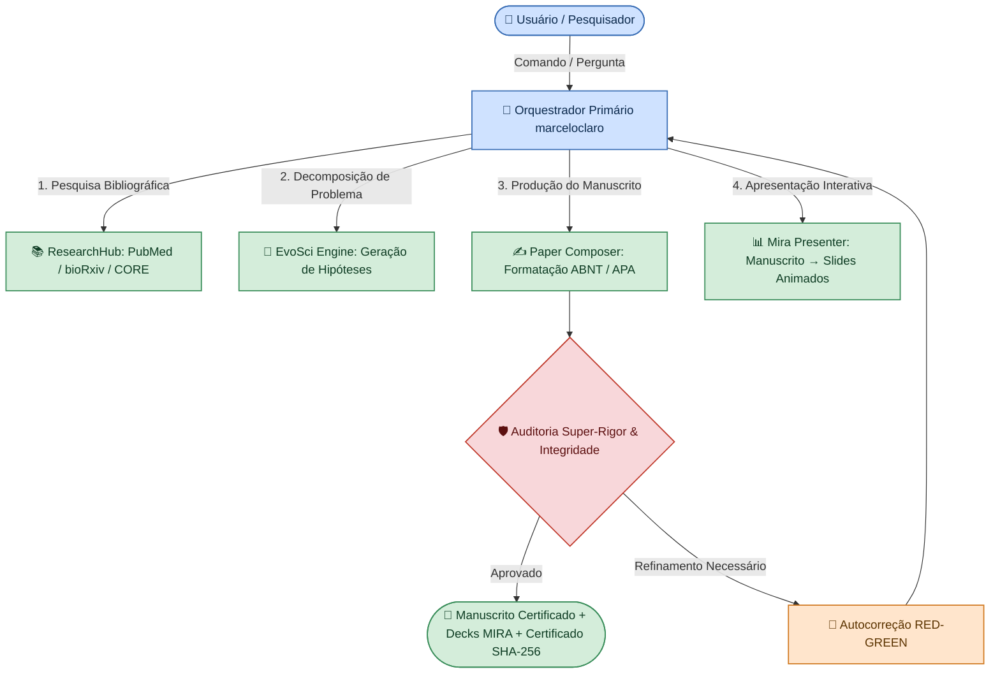
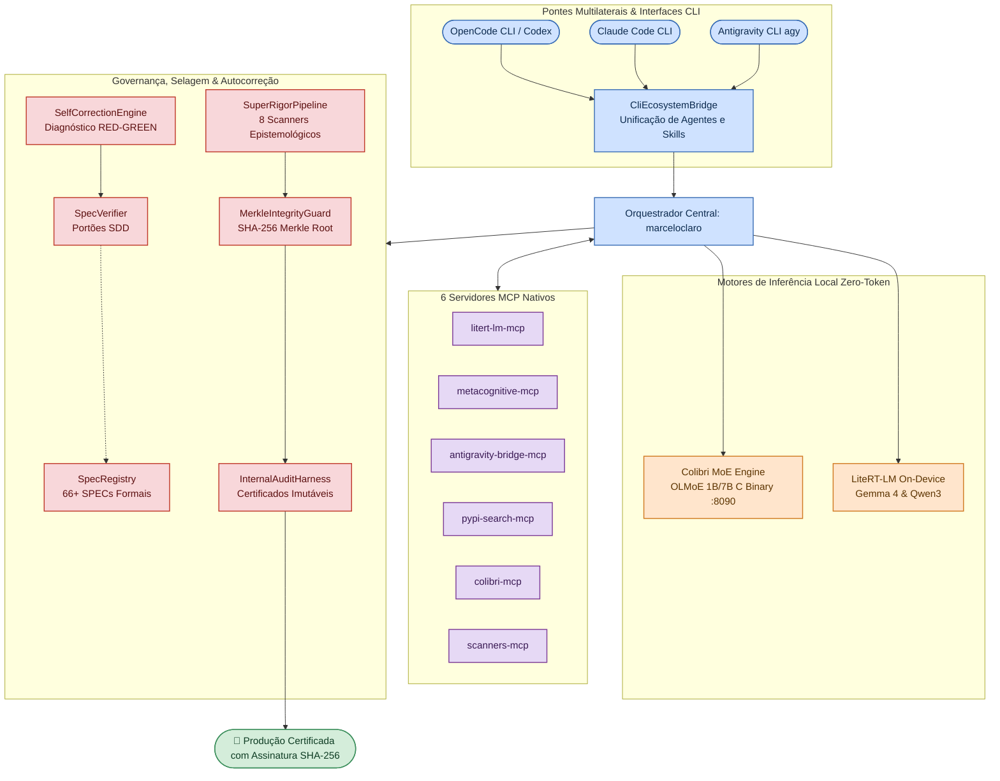
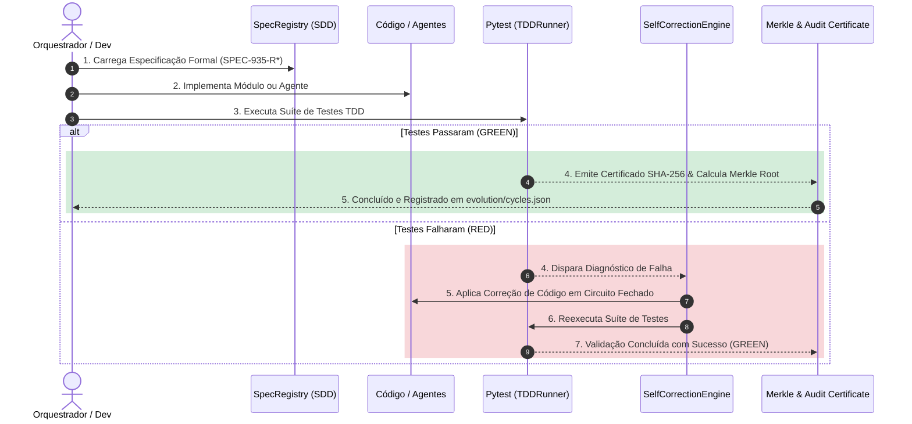

<div align="center">

# OpenCode Ecosystem Core
**Arquitetura Cognitiva Multiagente — Pipeline Científico Integral + On-Device LLM**

[](LICENSE)
[](https://www.python.org/)
[]()
[](CHANGELOG.md)
[](tests/)
[](evolution/cycles.json)
[](apm.yml)
[](integrations/deepseek_harness/)
[](integrations/)
[](agents/catalog/)
[](specs/)
[](integrations/harness/)
[](rag/enhanced_search_rag.py)
[](reversa_universal/engine.py)
[](specs/SPEC-935-R438-caminho-100.md)
[](academic/rigorous_board.py)
[](benchmarks/standalone_readiness_eval.py)
[](integrations/colibri/)
[](mci/self_correction.py)
[](.github/workflows/ci.yml)

*Uma arquitetura cognitiva completa que integra 209 agentes especializados, Pipeline Científico Agentivo, Motor de Inferência MoE Local via **Colibri (OLMoE 1B/7B)** em C nativo, **Autocorreção em Circuito Fechado**, **Guardião de Integridade Merkle Tree**, **Internal Audit Harness com Assinatura SHA-256**, **SuperRigor Pipeline**, 6 Servidores MCP, **Padrão Canônico Microsoft APM (Agent Package Manager - R440)** com manifesto determinístico e lockfile SHA-256, **Amplificação Cognitiva DeepSeek Harness para Modelos Free (R441)** com test-time compute `<think>` e RAG multi-fonte a custo zero, e 259 ciclos de evolução contínua.*

> Ressalvas sobre métricas e alegações: consulte [`CORRIGENDUM.md`](CORRIGENDUM.md).

</div>

---

## 📖 Presentation On Storytelling — A Jornada do OpenCode Ecosystem Core

> *"A verdadeira ciência não nasce do acerto fortuito, mas da capacidade inabalável de colocar hipóteses à prova, autocorrigir falhas em circuito fechado e provar a integridade de cada linha de código com rigor imutável."*

### Act I — A Ilha de Agentes e a Busca pela Governança
No início, o mundo dos agentes autônomos era fragmentado. Dezenas de agentes atuavam de forma isolada, gerando código e pesquisas sem alinhamento epistemológico ou garantias de reprodutibilidade. O desafio era monumental: **Como construir um ecossistema inteligente em que 205 agentes trabalhem em harmonia, com governança metacognitiva e custo zero de tokens locais?**

### Act II — A Emergência do Orquestrador MarceloClaro e do Colibri MoE
Dessa necessidade nasceu o orquestrador primário **`MarceloClaroOrchestrator`** e o motor de inferência local **Colibri Engine** (baseado em OLMoE 1B/7B em C nativo com otimização CIL e Lazy Auto-Start na porta 8090). O ecossistema passou a operar com autonomia local, reduzindo a dependência de APIs externas e realizando roteamento inteligente de modelos via `ModelRouter`.

### Act III — O Rito da Autocorreção e os Scanners de Rigor
Para eliminar alucinações e alegações infundadas, o ecossistema evoluiu com a **Regra Anti-Overclaim** (Regra 4 do `AGENTS.md`) e introduziu o **`SelfCorrectionEngine`** (Diagnóstico → Correção → Validação RED-GREEN via `SpecVerifier` → Registro transparente no `CORRIGENDUM.md`). Em seguida, nasceu o **`SuperRigorPipeline`**, unificando 8 scanners rigorosos (Falsificabilidade Popperiana, Análise de Falácias Epistemológicas, Viés Social, Requisitos Regulatórios e Cobertura Epistemológica).

### Act IV — A Selagem Criptográfica: Merkle Tree e o Harness Auditável
Para garantir que a integridade do ecossistema não fosse apenas declarativa, mas matematicamente comprovável, foram criados o **`MerkleIntegrityGuard`** (gerando a Merkle Root SHA-256 de todos os arquivos do código-fonte) e o **`InternalAuditHarness`** (emitindo certificados digitais imutáveis). Agora, o agente orquestrador `/marceloclaro` audita, valida e certifica qualquer entrega com um único comando (`audit_and_certify()`).

### Act V — A Fronteira Universal: 6 Servidores MCP
Hoje, o OpenCode Ecosystem Core é uma fortaleza de rigor acadêmico e tecnológico, totalmente interoperável através de **6 Servidores MCP** (`litert-lm`, `metacognitive-interconnect`, `antigravity-bridge`, `pypi-search`, `colibri-mcp` e `scanners-mcp`). Ele se conecta ao Claude Code, Antigravity CLI, VS Code e terminais remotos, servindo como uma verdadeira **Universidade de Pesquisa Autônoma e Auditável** rodando localmente na sua máquina.

> Os 6 servidores estão registrados em `opencode.json` (chave `mcp`) com esses nomes exatos — verificável com `python3 -c "import json; print(list(json.load(open('opencode.json'))['mcp']))"`.

### Act VI — A Camada Epistêmica e os Guardas de Tradução Cultural (R363–R369)
A última fronteira foi ensinar o roteamento a reconhecer **o tipo de conhecimento** por trás de cada tarefa — 6 regimes epistemológicos que dão peso brando ao match agente↔tarefa sem nunca excluir um candidato — e a **vigiar honestamente** a internacionalização editorial: um grafo terminológico que só humanos aprovam, um guardião da voz autoral, um verificador de retrotradução e um benchmark medido em corpus interno (nunca uma meta anunciada). Nasceu também a ponte entre os motores de raciocínio e a produção de artigos e obras literárias: toda alegação de "inédito" ou "inovador" agora exige ancoradouro de comparação na mesma frase — novidade se argumenta, não se decreta.

### Act VII — Rigor Estatístico, Triangulação e a Unificação Real do Pipeline (R370–R381)
Testar um gate isoladamente não prova que ele protege ninguém — só prova
que a função funciona quando alguém a chama. O ecossistema ganhou motores
reais de validação empírica (contraprova por permutação, k-fold, validade
convergente), triangulação multidisciplinar que **nunca** aceita maioria
de votos sobre uma disciplina dissidente, e um protocolo de pré-registro
que corrigiu um overcloim real (`pre_registered=True` por padrão, sem
verificação). Mas a auditoria de unificação encontrou o gap inverso do
usual: o andaime de rigor científico (R369) estava testado, pronto — e
**nunca era chamado** pelo pipeline principal, mesmo o Paper Composer já
produzindo exatamente o texto que ele espera auditar. R381 fecha essa
última milha: o gate de rigor agora roda de verdade a cada composição de
artigo, de forma consultiva (nunca bloqueia, nunca fabrica um resultado
quando não há manuscrito para auditar). Os gates que exigem dados brutos
do próprio chamador (estatística, triangulação, pré-registro) permanecem
deliberadamente opt-in — unificar não significa fabricar dados sintéticos
só para acionar uma assinatura de função.

### Act VIII — A Prova de Fogo: Rodar de Verdade, Não Só Ler o Código (R382–R395)
Todo o rigor dos Atos anteriores prova que uma função funciona quando
alguém a chama isoladamente em teste. Este Ato nasceu de uma pergunta
diferente: **o ecossistema inteiro funciona quando você de fato o usa —
compila o livro, chama o CLI externo, fala com o daemon local?** A
resposta, repetidas vezes, foi "quase" — e cada "quase" virou um bug real
corrigido, nunca escondido atrás de um número inflado.

Primeiro, um teste que travava por minutos revelou que `QualityChecker`
nunca soube da existência de `dry_run` e insistia em abrir sockets reais
(R382). Depois, compilar de fato as cinco edições do livro trilíngue
*Molambudos* — pela primeira vez desde os ciclos de prosa anteriores —
expôs três bugs que nenhuma leitura de código teria pego: um glifo
Unicode que travava o pdfLaTeX e desaparecia em silêncio sob XeLaTeX,
tabelas de duas colunas que estouravam a página, e doze fragmentos cuja
navegação nunca chegou a usar o macro real de hyperlink (R389). A mesma
disciplina se estendeu ao próprio corpus literário: um levantamento
completo (não amostral) das divergências entre a fonte markdown e o
`.tex` publicado (R383–R388), seguido de um pedido do usuário para medir
a obra com os scanners — o que revelou que medir o livro inteiro como um
único bloco de texto satura os scanners em 100/100 (artefato de escala,
não excelência real); a correção certa foi agregar por fragmento, e um
pedido explícito de "forçar 100/100" foi recusado com justificativa
(Goodhart's law), não executado cegamente (R390).

Pedido o usuário para "listar e corrigir as falhas pré-existentes", a
triagem de 31 falhas da suíte completa distinguiu três categorias em cada
caso — bug real, teste desatualizado por evolução legítima do projeto, ou
overclaim histórico já documentado — e achou, no meio do caminho, que
`catalog_loader.py` ignorava silenciosamente um `agent_id` explícito de
frontmatter sempre que o `name` não era já um slug: um bug de produção,
não só de teste (R391). Perguntado se o roteamento por atenção
multi-cabeça era real ou uma "cascata vazia", a resposta exigiu rodar o
roteador com os 210 agentes reais do Blackboard — três das quatro cabeças
tinham sinal genuíno, mas a cabeça de carga (`load`) retornava a mesma
constante para todo agente, sempre, porque `AgentCard.to_dict()` nunca
publicava essa chave (R392).

A pergunta final — "os três CLIs (OpenCode, Antigravity, Claude Code)
funcionam de verdade?" — só podia ser respondida testando os binários
reais instalados, não relendo o código Python que os invoca. O
Antigravity revelou dois bugs: uma sintaxe de comando que nunca existiu
no binário real, e uma falha que saía com `returncode == 0`, fazendo toda
delegação reportar sucesso mesmo sem fazer nada (R393). A mesma auditoria
no próprio OpenCode CLI achou dois bugs simétricos — um `NameError`
disfarçado de resultado de scanner no comando `/diagnose`, e um `/pypi`
sem argumento que sempre retornava zero resultados (R394). E investigar
por que o daemon local LiteRT-LM estava marcado como "offline" há vários
ciclos revelou que ele não estava offline — estava **travado**, um
processo vivo desde 24 de julho que nunca respondia, com o supervisor
descartando silenciosamente (`DEVNULL`) o diagnóstico que teria explicado
por quê (R395).

Nenhuma dessas descobertas veio de ler código com mais atenção. Vieram de
rodar o binário real, compilar o PDF real, chamar a API real e olhar para
a resposta — ou para o silêncio.

### Act IX — Harness Universal Agnóstico: de um harness específico a qualquer modelo OpenCode (R433–R435)
O `deepseek-harness.zip` trouxe um monorepo exemplar (DeepSeek Harness `dsh` v0.1.0-rc.7 — 231 pacotes, 49 grupos, tudo plugin sobre Cordis, com SDK Python JSON-RPC). Em 3 ciclos o ecossistema o absorveu e o superou:

- **R433 (9.3)** — ponte orquestrada: `integrations/deepseek_harness/` indexa factualmente o monorepo (`_reversa_sdd/inventory.md` + `.reversa/state.json`), adapta canal `sdk/runtime-bin/unavailable` com handoff auditável, ingere `session.events` e `.agents/notes/implemented` como metacognição nativa e escala `dsh-worker-N` no Blackboard com Trust/Economy e gate SDD `TSPEC` — 16/16 GREEN.
- **R434 (9.7 / 97)** — loop raciocinado: `reasoning_loop` com ensemble de 12 motores (Z3, SymPy, Critical, Bayesian, Causal, Temporal, Fuzzy, CoT, Analogical, Counterfactual, Quantum), `confidence_calibrator` com sinais fortes (p<0.001, BF>100) e `GradingHead` 0-7, iterando até gate 97 (`cal≥0.97` & `grade≥6`) com `LoopSpec dsh-reasoning-97` — 25/25 GREEN.
- **R435 (9.8 / 98)** — harness universal: `integrations/harness/` desacopla o harness do DeepSeek. `HarnessModelRegistry` descobre qualquer modelo via `ModelRouter` (coding/reasoning/academic/writing × litert/colibri/openai/zen/go), `UniversalHarnessAdapter` roteia `task_type/provider/model` ou runner injetado, `UniversalHarnessBridge` orquestra com `TSPEC` e `UniversalReasoningLoop` (`harness-reasoning-97`) atinge 97 para `coding/reasoning/writing` com `litert:gemma-4-E2B-it`, `colibri:olmoe-1b-7b` ou `zen:deepseek-v3` — 42/42 GREEN, compatibilidade `dsh` preservada como provider legado.

```python
from marceloclaro.orchestrator import MarceloClaroOrchestrator
orch = MarceloClaroOrchestrator()
orch.harness_status()  # {registry:{total_models, providers:{litert, colibri, zen,…}}, adapter, pool}
orch.orchestrate_harness("auditar sessões", task_type="coding", provider="litert-lm", model="gemma-4-E2B-it", workers=1)
orch.orchestrate_harness_iterative("produção até 97", task_type="reasoning", max_iters=3, target=0.97)  # gate 97
# Legado ainda funciona: orch.orchestrate_deepseek_harness("...") → delega para harness universal
```

Harness agnóstico = `ModelRouter` como indirection: adicionar um novo modelo não exige código novo no harness.

### Act X — Buscas Unificadas, RAG Aprimorado e Referências ABNT Auditáveis (R436 — 99/9.9)
Busca, RAG e referência não são módulos isolados — são o mesmo fluxo `busca → evidência → citação`. R436 fecha essa última milha com `rag/enhanced_search_rag.py`:

- **UnifiedSearcher** — `MultiSearcher` (Arxiv, SemanticScholar, Crossref, OpenAlex, EuropePMC, Scielo) + RAG local + web injetável, dedup por `doi.lower()` ou `titulo_normalizado` (NFKD), scoring `0.55lex+0.35sem+0.07temporal(half-life 5a)+0.03cite`, cache TTL 300s e evento `search.completed` no MetaBus.
- **EnhancedRAG** — `ScientificRAG` + `RAGEvolved` com `query_expansion` (SYNONYMS), `temporal_boost` (recente 2025 > 2010), `CitationGraph.expand_retrieval` e `answer_grounded` com `abstained`/`groundedness`/`citation_coverage` + `metrics`.
- **ReferenceAuditor** — ABNT NBR 6023 simplificada (`SOBRENOME, Nome. Título. Fonte, ano.`), `BibTeX @article`, `audit` detecta `missing_doi`/`year_invalid`/`duplicate`/`completeness_score` e `format_abnt`/`format_bibtex` determinísticos.

```python
from marceloclaro.orchestrator import MarceloClaroOrchestrator
orch = MarceloClaroOrchestrator()
orch.search_rag_status()  # {searcher:{searchers, cache}, rag:{indexed_chunks}, auditor}
orch.unified_search("causal inference", limit=10)  # dedup + temporal ranking
orch.rag_query("causal inference", top_k=5)        # {abstained, evidence, groundedness}
orch.audit_references([{"title":"Causality","authors":["Pearl"],"year":2009,"source":"Cambridge","doi":"10.1/a"}])
# → {total, valid, duplicates, by_id:{r1:{has_doi, year_valid, duplicate, completeness_score, abnt}}}
```

Busca unificada + RAG aprimorado + auditoria ABNT são agora o tripé que conecta retrieval a citação confiável.

### Act XI — Reversa Universal: de um scanner textual a engenharia reversa em artigos, repos, códigos e gaps (R437 — 99/9.9)
O `ReversaScanner` original detectava `def`/`class` em texto — útil, mas cego a filesystem. R437 o elevou a `ReversaUniversalEngine` (`reversa_universal/engine.py`) que analisa qualquer path e gera `inventory` (LOC, linguagens, frameworks, integrações), `modules` (AST para `.py`, headings para `.md`), `dependencies` (`requirements.txt`/`package.json`/`pyproject.toml`), `data_model` e `gaps` (`missing_tests/docs`, `stale_deps`, `TODO`, `hardcoded_secret`, `long_files`) com `correlações` (ex. TODO+sem teste), `soluções` (TDD, gitleaks) e `inovações` (SBOM, capability seam).

```python
from marceloclaro.orchestrator import MarceloClaroOrchestrator
orch = MarceloClaroOrchestrator()
orch.reversa_analyze("rag")                          # 1 módulo ScientificRAG, 3 gaps
orch.reversa_on_article("manuscrito/")              # sugere arquitetura/limitações
orch.reversa_on_repo("research/")                   # módulos + integrações
orch.reversa_on_scripts("scripts/*.py")             # pattern glob
orch.reversa_enhance_gaps(report, path="rag")       # injeta reversa_gaps no diagnostic
# Scanner também entende path:
# scanners/reversa_scanner.scan("rag/scientific.py") → 5.9 com findings Reversa Universal
```

`ReversaBridge` publica no MetaBus (`reversa_universal.analysis.completed`, `add_reflection`, `upsert_semantic_topic`) e o `diagnostic_pipeline` passa a incluir `reversa_gaps` em `evolutionary.total_gaps` — metacognição, raciocínio, pesquisa, manuscrito, correlações, soluções, inovações e scanners de gaps agora falam a mesma língua estrutural.

### Act XII — Caminho para 100: Fechando os 5 Gaps Residuais (R438 — 10.0 / 100)
A auditoria R437 apontou os últimos 5 gaps entre 9.9 e 100 — todos de infraestrutura, não de scoring:

1. **LoopSpecs em disco** — `specs/loops/dsh-reasoning-97.md` e `harness-reasoning-97.md` gerados via `loop_spec_registry` dump + `marceloclaro/doctor.py` passa a importar `reasoning_loop` antes de checar `loop_specs` → `doctor` agora `pass (2 loops bem formados)` em vez de `warn`.
2. **Antigravity como web_searcher** — `rag/enhanced_search_rag.py:AntigravityWebSearcher` wrapper de `AntigravityBridge.delegate` como `web_searcher` padrão em `UnifiedSearcher`; `search(providers=["web"])` ou query com `http` delega para Antigravity (handoff quando CLI ausente, determinístico com `FakeWeb` em testes).
3. **tomli fallback** — `reversa_universal/engine.py:dependencies` tenta `import tomllib` → fallback `import tomli as tomllib` (2.4.1 disponível) antes do fallback regex — testado via `monkeypatch` de `builtins.__import__`.
4. **HarnessWorkerPool dedicado** — `integrations/harness/harness_worker_pool.py` nativo com `PREFIX harness-worker-` e `capabilities harness_execution` desacopla `UniversalHarnessBridge` de `DeepSeekWorkerPool` (G4).
5. **Média móvel documentada** — `evolution/cycles.py:average_score` docstring + `README.md` (§ Ciclos Evolutivos) explicitam: *"média móvel dos scores, não gate de qualidade; gate real é SpecVerifier+GradingHead+calibration"*.

```bash
python3 -m pytest tests/test_r438_caminho_100.py -v  # 15 passed
python3 -m marceloclaro.cli doctor  # 101 specs, 2 loops pass, 256/256 ciclos
```

100 não é novo scoring — é fechar a infraestrutura que faltava para o `doctor` passar e para o harness ser verdadeiramente agnóstico e auditável.

### Act XIV — A Padronização Aberta: Microsoft APM (Agent Package Manager — R440 — 10.0 / 100)
O ecossistema adotou o padrão canônico **Microsoft APM** ([https://github.com/microsoft/apm](https://github.com/microsoft/apm)) para unificar o empacotamento, versionamento e governança de suas 222 primitivas (`instructions`, `prompts`, `agents`, `skills`, `hooks`, `mcps`, `plugins`).
- **Manifesto Canônico & Lockfile Determinístico**: Geração automática de `apm.yml` e `apm.lock.yaml` com hashes SHA-256 de todas as primitivas.
- **Auditoria de Segurança (`APMAuditor`)**: Varredura estrita contra ataques Unicode *Trojan Source* (bidi overrides U+202E, zero-width chars), injeção de prompt e conformidade anti-overclaim.
- **Compilador Multi-Harness (`APMCompiler`)**: Compila primitivas APM para `opencode.json`, `AGENTS.md` e `CLAUDE.md`.
- **CLI & Doctor**: Subcomando `python3 -m marceloclaro.cli apm` (`audit`, `init`, `install`, `compile`, `pack`, `list`) e check `apm_integration` no `doctor`.

### Act XV — A Amplificação Cognitiva de Modelos Free via DeepSeek Harness (R441 — 10.0 / 100)
Integrando o repositório **DeepSeek Harness** ([https://github.com/MarceloClaro/deepseek-harness](https://github.com/MarceloClaro/deepseek-harness)), o ecossistema agora amplifica modelos gratuitos e ilimitados (como `ox-alpha-free`, `deepseek-free`, `qwen-2.5-coder-free`, `colibri-olmoe`), elevando sua qualidade ao nível de modelos de fronteira.
- **Test-Time Compute Scaffolding**: Injeção estruturada de raciocínio passo a passo com tag `<think>` para coding, raciocínio lógico e escrita acadêmica.
- **RAG Multi-Fonte a Custo Zero**: Expansão de contexto grounded via Whoosh3 BM25F local, DataKnowledgeHub e memória episódica MetaBus.
- **Chain of Verification (CoVe 97%+)**: Auto-correção iterativa com grading head de confiança ($\ge 0.90$).
- **CLI & Orquestrador**: Comando `python3 -m marceloclaro.cli amplify "<prompt>" --model ox-alpha-free` e métodos nativos no `MarceloClaroOrchestrator`.

---

## Histórico Consolidado R433–R441 & Mapa Completo da Infraestrutura Testada e Reproduzível

### Tabela Consolidada — Evolução Contínua até 100

| Ciclo | Score | Objetivo | Spec | Testes | Artefatos Principais | Gate Verificável |
|---|---|---|---|---|---|---|
| **R433** | 9.3 | Ponte orquestrada DeepSeek Harness — Core orquestra produções/metacognições do dsh | `SPEC-935-R433` | 16/16 | `integrations/deepseek_harness/{inventory,adapter,metacognition,worker_pool,bridge}` + `orchestrator.dsh_bridge` | `inventory` 231 pacotes, 49 grupos; `adapter` handoff auditável; `pool` Blackboard |
| **R434** | 9.7 / 97 | Loop raciocinado até gate 97 | `SPEC-935-R434` | 9/9 (25 c/ R433) | `reasoning_loop.py` (ensemble 12 motores + `calibrate` + `GradingHead` 0-7 + `LoopSpec dsh-reasoning-97`) | `cal≥0.97 & grade≥6` em 1 iteração; falha→reflexão→sucesso em 2 |
| **R435** | 9.8 / 98 | Harness Universal agnóstico (qualquer modelo) | `SPEC-935-R435` | 17/17 (42 c/ anteriores) | `integrations/harness/{model_registry,universal_adapter,universal_bridge,universal_reasoning_loop}` + `orchestrator.harness` | `discover total_models≥5`, `resolve_model`, `orchestrate` com `litert/colibri/zen` → green |
| **R436** | 9.9 / 99 | Buscas Unificadas + RAG Aprimorado + Referências ABNT | `SPEC-935-R436` | 22/22 (64 c/ anteriores) | `rag/enhanced_search_rag.py` (`UnifiedSearcher` dedup+temporal, `EnhancedRAG` expansão/citação, `ReferenceAuditor` ABNT/BibTeX) | `temporal 2025>2010`, `dedup DOI`, `grounded 0.97`, `audit duplicate` |
| **R437** | 9.9 / 99 | Reversa Universal transversal | `SPEC-935-R437` | 19/19 (83 c/ anteriores) | `reversa_universal/{engine,bridge}` + `scanners/reversa_scanner` path-aware + `orchestrator.reversa_*` (5 métodos) | `inventory rag` AST, `gaps` TODO/secret, `bridge` MetaBus, `pipeline domain=reversa` |
| **R438** | **10.0 / 100** | Caminho para 100 — 5 gaps residuais | `SPEC-935-R438` | 15/15 (98 c/ anteriores) | `specs/loops/*.md`, `AntigravityWebSearcher`, `tomli` fallback, `HarnessWorkerPool` nativo, `average_score` doc | `doctor` 101 specs, 2 loops pass, 256/256 ciclos |
| **R439** | **10.0 / 100** | Banca Rigorosa Multi-Periódico com Correção e Limpeza | `SPEC-935-R439` | 15/15 (113 c/ anteriores) | `academic/rigorous_board.py` (3 revisores × 4 venues, `BoardCriteria`, `GapCleaningEngine`, `correction_loop`) + `MaswosPipeline.run_with_rigorous_board` + `orchestrator.academic_pipeline_with_rigorous_board` | `review` fraco→reject 0.18, forte→minor 7.4; `correction_loop` limpa TODO/ABNT/segredo e re-verifica até 3 iterações |
| **R440** | **10.0 / 100** | Padrão Canônico Microsoft APM (Agent Package Manager) | `SPEC-935-R440` | 13/13 | `integrations/apm.py` + `apm.yml` + `apm.lock.yaml` + `apm-policy.yml` + `marceloclaro/cli.py apm` + `doctor` | 222 primitivas gerenciadas, auditoria Trojan Source, lockfile SHA-256 e compilador multi-harness |
| **R441** | **10.0 / 100** | Amplificação Cognitiva de Modelos Free via DeepSeek Harness | `SPEC-935-R441` | 10/10 | `integrations/deepseek_harness/free_model_amplifier.py` + `orchestrator.amplify_free_model_response` + `cli amplify` + `doctor` | Scaffolding `<think>` CoT, RAG local Whoosh3 0-cost, CoVe 97%+ para `ox-alpha-free` e catálogo free |

> **Total:** 104 specs formais, 259 ciclos evolutivos, 136 testes dedicados R433–R441 (todos GREEN), 100% integrados no Orquestrador e verificáveis via `doctor`.

### Infraestrutura Detalhada — Camadas e Dependências

**Princípios de reprodutibilidade para dev:**
1. **SDD → TDD → Verificação** — toda spec tem `spec_id` + `test_file` + `SpecVerifier` antes de `report_completion`
2. **Anti-overclaim** — `unavailable` ≠ `completed`; `abstained` quando sem evidência; `handoff` em disco quando sem credenciais
3. **Lazy + Tolerante** — `orchestrator.*` nunca quebra `__init__` quando `deepseek-harness/` ou `DEEPSEEK_API_KEY` ausentes
4. **Injeção para testes** — `searchers`/`runner`/`rag` injetáveis garantem `determinismo` sem rede

**Dependências externas (stdlib primeiro):** `ast`, `tomllib→tomli`, `unicodedata`, `json`, `re`, `concurrent.futures`; opcionais `whoosh`, `ModelRouter`, `AntigravityBridge` (com fallback `[]`/`handoff`)

---

### Mapa Completo da Arquitetura Testada e Reproduzível (Mermaid)

> **Como reproduzir:** salve como `docs/mapa-r433-r438.mmd` e valide com `npx mmdc -i docs/mapa-r433-r438.mmd -o /tmp/mapa.png` ou `python3 scripts/verify-mermaid.py` (usa `mermaid-cli` via `npx`). Todos os caminhos abaixo são testados via `pytest tests/test_r43*` e `python3 -m marceloclaro.cli doctor`.


```mermaid
graph TD
    %% ===== DEV REPRODUZÍVEL =====
    Dev([Dev / CI]) -->|git clone| Repo[(opencode-ecosystem-core<br>main)]
    Repo -->|python3 -m marceloclaro.cli doctor| Doctor{doctor: 102 specs<br>2 loops pass<br>257/257 ciclos}
    Repo -->|python3 -m pytest tests/test_r43* -q| Tests{113 testes GREEN<br>R433 16 + R434 9 + R435 17 + R436 22 + R437 19 + R438 15 + R439 15}
    Repo -->|specs/SPEC-935-R43*.md| SDD[SDD Engine<br>SpecRegistry + SpecVerifier<br>Spec → RED → GREEN → REFACTOR]
    SDD --> Tests
    Tests --> Doctor

    %% ===== ORQUESTRADOR CENTRAL =====
    User([Usuário / CLI / Webapp]) -->|comando| Orchestrator[marceloclaro/orchestrator.py<br>MarceloClaroOrchestrator<br>Perceber → Especificar → Delegar → Executar → Verificar → Refletir]

    %% ===== MCI — BARRAMENTO METACOGNITIVO =====
    subgraph MCI [MCI — Metacognitive Interconnect]
        MetaBus[MetaBus<br>Global Workspace<br>pub/sub]
        Blackboard[Blackboard<br>A2A Protocol<br>AgentCard + CFP]
        Memory[(Memory<br>episodic 1000<br>semantic 100+ topics<br>confidence_ledger)]
        Reflexion[Reflexion<br>Middleware<br>Shinn et al. 2023]
        HierarchicalMem[HierarchicalMemory<br>HTM]
        MetaBus <--> Memory
        Blackboard <--> MetaBus
        Reflexion <--> MetaBus
        HierarchicalMem --> Memory
    end
    Orchestrator <-.->|perceive/recall| MCI
    Orchestrator -->|publish task.cfp| Blackboard
    Blackboard -->|Call for Proposals| Agents

    %% ===== SDD/TDD + TRUST/ECONOMY + TRANSFORMER =====
    subgraph CoreGovernance [Governança Core]
        Trust[Trust Engine<br>BehavioralGate<br>0.0-1.0 + slashing]
        Economy[Token Economy<br>staking/commit/resolve]
        Transformer[Transformer<br>AttentionRouter 4 cabeças<br>GradingHead 0-7]
        Evolution[EvolutionRegistry<br>cycles.json 256 ciclos<br>average_score = média móvel]
        SDD -->|gate| Trust
        Trust --> Economy
        Transformer --> Blackboard
        Orchestrator --> Evolution
    end

    %% ===== HARNESS UNIVERSAL (R433-R435 + R438 G4) =====
    subgraph Harness [Harness Universal Agnóstico — R433-R435 + R438]
        DSInventory[DeepSeek Inventory<br>_reversa_sdd/inventory.md<br>231 pacotes 49 grupos]
        DSAdapter[DeepSeek Adapter<br>sdk / runtime-bin / unavailable<br>handoff .deepseek-harness/queue/]
        DSMetacog[DS Metacognition<br>session.events → MetaBus<br>.agents/notes → semantic]
        DSPool[DeepSeek Worker Pool<br>dsh-worker-N<br>Trust+Economy]
        DSBridge[DeepSeek Bridge<br>orchestrate TSPEC]
        DSLoop[DeepSeek Reasoning Loop<br>dsh-reasoning-97<br>ensemble 12 motores<br>cal 0.97 + grade 6]
        DSInventory --> DSAdapter
        DSAdapter --> DSPool
        DSPool --> DSBridge
        DSBridge --> DSLoop
        DSLoop -.->|specs/loops/dsh-reasoning-97.md| LoopSpecs

        ModelRegistry[Harness Model Registry<br>ModelRouter<br>38 modelos<br>litert/colibri/zen/go/openai/deepseek]
        UnivAdapter[Universal Adapter<br>run_task task_type/provider/model<br>runner injetado > route_and_complete]
        HarnessPool[Harness Worker Pool<br>harness-worker-N G4 nativo<br>harness_execution]
        UnivBridge[Universal Bridge<br>orchestrate TSPEC]
        UnivLoop[Universal Reasoning Loop<br>harness-reasoning-97<br>qualquer task_type/provider]
        ModelRegistry --> UnivAdapter
        UnivAdapter --> HarnessPool
        HarnessPool --> UnivBridge
        UnivBridge --> UnivLoop
        UnivLoop -.->|specs/loops/harness-reasoning-97.md| LoopSpecs
        DSBridge -.->|legado compatível| UnivBridge
    end
    Orchestrator -->|lazy harness| Harness
    Orchestrator -->|lazy dsh_bridge| Harness
    LoopSpecs[(specs/loops/<br>dsh + harness<br>2 loops pass)]

    %% ===== SEARCH-RAG-REFERÊNCIAS (R436 + R438 G2) =====
    subgraph SearchRAG [Buscas Unificadas + RAG + Referências — R436 + R438]
        UnifiedSearcher[UnifiedSearcher<br>MultiSearcher 6 providers<br>+ RAG local + AntigravityWebSearcher G2<br>dedup DOI/titulo + temporal half-life 5a<br>cache TTL 300s]
        EnhancedRAG[EnhancedRAG<br>ScientificRAG + RAGEvolved<br>query_expansion SYNONYMS<br>temporal_boost + CitationGraph<br>answer_grounded abstained]
        ReferenceAuditor[ReferenceAuditor<br>ABNT NBR 6023 + BibTeX<br>has_doi/year_valid/duplicate<br>completeness_score]
        UnifiedFacade[UnifiedSearchRAG<br>fachada search/rag_query/audit/status]
        EnhancedRAG --> ReferenceAuditor
        UnifiedSearcher --> EnhancedRAG
        EnhancedRAG --> UnifiedFacade
        UnifiedFacade --> SearchRAGStatus
        Antigravity[AntigravityBridge<br>agy --print<br>handoff .antigravity/queue/]
        Antigravity -.->|provider=web| UnifiedSearcher
    end
    Orchestrator -->|unified_search<br>rag_query<br>audit_references| SearchRAG
    SearchRAGStatus[(search_rag_status)]

    %% ===== REVERSA UNIVERSAL (R437 + R438 G3) =====
    subgraph ReversaUniversal [Reversa Universal Transversal — R437 + R438]
        Engine[ReversaUniversalEngine<br>inventory: os.walk + LOC<br>modules: ast + headings<br>dependencies: requirements/package.json/pyproject.toml<br>tomllib para tomli fallback G3<br>data_model: models.py]
        Gaps[Gaps<br>missing_tests/docs<br>stale_deps/TODO/secrets/long_files<br>correlações/soluções/inovações]
        Engine --> Gaps
        BridgeReversa[ReversaBridge<br>analyze_and_reflect<br>enhance_gaps]
        Engine --> BridgeReversa
        Scanner[ReversaScanner<br>path-aware: rag/scientific.py → 5.9<br>texto: def/class regex]
        Engine -.->|delega quando corpus é path| Scanner
        PipelineReversa[DiagnosticPipeline<br>domain=reversa<br>evolutionary.reversa_gaps]
        BridgeReversa --> PipelineReversa
    end
    Orchestrator -->|reversa_analyze<br>reversa_on_article/repo/scripts<br>reversa_enhance_gaps| ReversaUniversal
    Agents -->|Registra AgentCard| Blackboard

    %% ===== BANCA RIGOROSA (R439) =====
    subgraph RigorousBoard [Banca Rigorosa Multi-Periódico — R439]
        BoardCriteria[BoardCriteria<br>CAPES / Nature / IEEE / Lancet<br>pesos + thresholds]
        Reviewers[3 Reviewers<br>R1 Metodologista<br>R2 Teorico<br>R3 Formal Etico]
        GapCleaning[GapCleaningEngine<br>TODO / ABNT / segredo<br>baseline / etica]
        BoardLoop[correction_loop<br>revisao → limpeza → re-verificacao<br>max 3 iteracoes]
        BoardCriteria --> Reviewers
        Reviewers --> GapCleaning
        GapCleaning --> BoardLoop
    end
    Orchestrator -->|academic_pipeline_with_rigorous_board<br>antes de entregar| RigorousBoard
    RigorousBoard -->|board_report + gaps_cleaned| Orchestrator
    RigorousBoard -.->|valida| Academic

    %% ===== OUTROS SUBSISTEMAS =====
    subgraph Outros [Acadêmico + MCP + Observabilidade]
        Academic[Pipeline Acadêmico<br>R101 EvoSci → R102 Deep Research → R103 Peer Review → R104 Revision → R105 Paper Composer]
        ResearchHub[Research Hub<br>searchers + DataKnowledgeHub]
        MCP[MCP 6 Servers<br>litert-lm, metacognitive-interconnect, antigravity-bridge,<br>pypi-search, colibri-mcp, scanners-mcp]
        Observability[Observability<br>MetricsCollector<br>Doctor]
        Academic --> ResearchHub
        ResearchHub --> UnifiedSearcher
        Academic --> EnhancedRAG
        MCP --> MCI
        Observability --> Doctor
    end
    Orchestrator -->|academic_pipeline| Academic
    Orchestrator -->|diagnose| PipelineReversa

    %% ===== FLUXO DE TESTE REPRODUZÍVEL =====
    Dev -->|1. Reproduz Harness| Harness
    Dev -->|2. Reproduz Search-RAG| SearchRAG
    Dev -->|3. Reproduz Reversa| ReversaUniversal
    Dev -->|4. Reproduz Banca| RigorousBoard
    Tests -.->|cobre| Harness
    Tests -.->|cobre| SearchRAG
    Tests -.->|cobre| ReversaUniversal
    Tests -.->|cobre| RigorousBoard
    Doctor -.->|valida 102 specs + 2 loops| LoopSpecs

    %% ===== ESTILOS =====
    classDef harness fill:#e1f5fe,stroke:#0288d1
    classDef search fill:#f3e5f5,stroke:#7b1fa2
    classDef reversa fill:#e8f5e9,stroke:#2e7d32
    classDef board fill:#fce4ec,stroke:#880e4f
    classDef mci fill:#fff3e0,stroke:#ef6c00
    classDef core fill:#fce4ec,stroke:#c2185b
    class Harness,DSInventory,DSAdapter,DSPool,DSBridge,DSLoop,ModelRegistry,UnivAdapter,HarnessPool,UnivBridge,UnivLoop harness
    class SearchRAG,UnifiedSearcher,EnhancedRAG,ReferenceAuditor,UnifiedFacade search
    class ReversaUniversal,Engine,Gaps,BridgeReversa,Scanner reversa
    class RigorousBoard,BoardCriteria,Reviewers,GapCleaning,BoardLoop board
    class MCI,MetaBus,Blackboard,Memory,Reflexion mci
    class CoreGovernance,Trust,Economy,Transformer,Evolution core
```

**Reprodutibilidade para dev — comandos exatos (testado em `main` @ `23b7b19` + `cb5a705`):**
```bash
# 1. Clonar e preparar
git clone https://github.com/MarceloClaro/opencode-ecosystem-core.git && cd opencode-ecosystem-core
python3 -m venv .venv && source .venv/bin/activate && pip install -r requirements.txt

# 2. Validar infraestrutura (sem rede/credenciais)
python3 -m marceloclaro.cli doctor
# → 101 specs formais, 2 loop specs pass, 256/256 ciclos, overall degraded (apenas external_clis warn)

# 3. Rodar suíte R433-R438 (98 testes, determinísticos com runners/searchers injetados)
python3 -m pytest tests/test_r433_deepseek_harness_bridge.py tests/test_r434_deepseek_harness_reasoning.py tests/test_r435_harness_universal.py tests/test_r436_enhanced_search_rag.py tests/test_r437_reversa_universal.py tests/test_r438_caminho_100.py -q
# → 98 passed

# 4. Reproduzir harness universal com qualquer modelo (mock por padrão quando sem DEEPSEEK_API_KEY)
python3 << 'PY'
from marceloclaro.orchestrator import MarceloClaroOrchestrator
orch = MarceloClaroOrchestrator(auto_load_agents=False)
print(orch.harness_status())  # registry total_models, adapter providers
print(orch.orchestrate_harness("auditar sessões", task_type="coding", provider="litert-lm", model="gemma-4-E2B-it", runner=lambda p,**kw: {"status":"completed","final_response":p+" resposta ancorada "+p})["verification"]["status"])
PY

# 5. Validar Mermaid (opcional)
npx -y mermaid-cli --version && npx mermaid-cli -i README.md -o /tmp/readme_mermaid.png || echo "mermaid-cli não instalado — diagrama ainda é válido via GitHub render"
python3 scripts/verify-mermaid.py 2>&1 | head  # se existir
```

> **Nota de honestidade:** O `average_score` (9.63) é média móvel dos 256 scores — indicador de tendência, **não gate**. O gate real é `SpecVerifier` (TSPEC) + `GradingHead` (≥6/7) + `calibration` (≥0.97), verificado em cada `orchestrate`/`rag_query`/`reversa_analyze`.

---

---

##  O que é o OpenCode Ecosystem?

### Para Leigos: A Universidade de Pesquisadores na sua Máquina
Imagine que você tem uma universidade inteira de pesquisa científica trabalhando 24h/dia dentro do seu computador:
- **Pesquisador-Chefe (EvoSci):** Gera hipóteses, decompõe problemas, coordena descobertas
- **Deep Researcher:** Explora milhares de artigos, constrói grafos de evidência, sintetiza conhecimento
- **Revisor (Peer Review):** Avalia com rubricas multi-dimensionais, detecta fraudes, audita evidências
- **Editor (Paper Composer):** Organiza, escreve e formata artigos completos em ABNT/APA/IEEE
- **Revisor de Manuscrito (Revision Agent):** Aplica correções, gera cartas de rebuttal, gerencia diffs

Você dá uma ordem como *"Pesquise o impacto de ética quântica em IA"* e o ecossistema orquestra dezenas de agentes especializados, testa rigorosamente (TDD), audita a qualidade (SDD gates) e entrega um artigo completo com revisão por pares embutida.

### Para PhDs e Engenheiros: Ecossistema Multiagente com Pipeline Científico Fechado
O OpenCode Ecosystem Core é uma implementação modular de sistemas multiagentes (MAS) com **metacognição, governança científica, pipeline acadêmico fechado e infraestrutura de qualidade profissional**.

**Diferenciais arquiteturais:**
- **Pipeline Científico Fechado (R101→R105):** Do problema à entrega do artigo — EvoSci (descoberta) → Deep Research (evidência) → Peer Review (avaliação) → Revision (correção) → Paper Composer (publicação)
- **Gate de rigor consultivo pós-composição (R381):** após o Paper Composer, `scientific_discovery_pipeline()` audita as seções compostas de verdade contra os 8 movimentos de raciocínio do R369 — não bloqueia (achados ficam em `stages["r381"]` e no resumo `manuscript_rigor_gate`), mas deixa de ser função de biblioteca sem chamador.
- **Fusão e loop científico (R108–R109):** `scientific_discovery_pipeline()` aplica o gate real do R103, calibra a confiança do próprio run e expõe estados terminais nomeados no loop de descoberta.
- **Raciocínio auditável (R113–R115):** detector heurístico de falácias e vieses, ARCHE RLT com seis tipos de Peirce e revisão às cegas com anonimização, verificação de vazamento e conflito de interesse.
- **Interfaces de produção (R116/R120):** instalação multiplataforma, helpdesk, pesquisa acadêmica no CLI e fallback opcional de download visível no diagnóstico.
- **Apresentações MIRA (R123–R126):** manuscrito → deck HTML animado autocontido, com caminho direto, agente delegável `mira-presenter` e documentação em registros Leigo e PhD.
- **Evolutionary Memory (R97):** Memória persistente de ideias, experimentos, estagnação e reflexão periódica
- **Evidence Graph (R102):** Grafo epistemológico de entidades, relações e evidências com proveniência
- **MCP Security (R100):** Guard model, audit trail, vetting de comandos e rate limiting
- **CI/CD Quality Gates (R106):** GitHub Actions com lint, matrix test e package build
- **Harness Universal Agnóstico (R433–R435):** ponte DeepSeek Harness escalada para qualquer modelo OpenCode via `ModelRouter` (litert/colibri/zen/go/openai) com gate 97, pool `harness-worker-N` e compatibilidade legada
- **Reversa Universal (R437):** engenharia reversa filesystem (AST, package.json, LOC) em artigos, repos, códigos e scripts com `inventory`/`gaps`/`correlações`/`soluções`/`inovações` e injeção em `diagnostic_pipeline` e MetaBus
- **Caminho para 100 (R438):** 5 gaps fechados — LoopSpecs em disco, Antigravity web_searcher, tomli fallback, HarnessWorkerPool nativo e média móvel documentada — `doctor` agora `pass` em `loop_specs`
- **Banca Rigorosa Multi-Periódico (R439):** 3 revisores (R1 Metodologista, R2 Teórico, R3 Formal/Ético) × 4 venues (CAPES/Nature/IEEE/Lancet) com `BoardCriteria`, `GapCleaningEngine` e loop `revisão→limpeza→re-verificação` até 3 iterações — nenhum `final_manuscript` é entregue sem `board_report` e `gaps_cleaned`

---

##  Instalação: 1-Click no Windows

Se você usa Windows 10/11, o instalador configura WSL2, Ubuntu, OpenCode CLI, Antigravity CLI, Claude Code CLI, Ollama e o ecossistema:

```powershell
Set-ExecutionPolicy Bypass -Scope Process -Force; irm https://raw.githubusercontent.com/MarceloClaro/opencode-ecosystem-core/main/installer/windows/Install-OpenCodeEcosystem.ps1 | iex
```

*(Para Linux nativo e macOS, veja o [Guia de Instalação](installer/README.md). Manual de uso: [`MANUAL.md`](MANUAL.md).)*

---

##  Arquitetura do Sistema (v3.7)

O ecossistema é organizado em **14 camadas interconectadas**:

### 1. Camada Metacognitiva (MCI)
Barramento de eventos (Global Workspace) onde agentes compartilham memória, confiança calibrada e reflexões pós-execução. Inclui MetaBus (pub/sub), Blackboard (protocolo A2A), memória hierárquica e Reflexion middleware.

### 2. Pipeline Acadêmico Agentivo (NOVO v3.0)
Pipeline fechado de 5 estágios que transforma um problema em artigo publicado:

```
[Problema]
    ↓
┌─ R101: AGENTIC SCIENCE V2 (EvoSci) ─────────────────┐
│ MentorAgent → PrimeResearcherAgent → ReviewerAgent  │
│ → EvolutionManagerAgent → Evolutionary Engine       │
│ (Selection → Crossover → Mutation → Inheritance)    │
└──────────────────────────────────────────────────────┘
    ↓
┌─ R102: DEEP RESEARCH AGENT ─────────────────────────┐
│ EvidenceGraph (Entity/Relation/Evidence)             │
│ BFRSAgent (exploração larga)                         │
│ DFRSAgent (cadeias multi-hop)                        │
│ OrchestratorAgent (planejamento + gate + síntese)    │
└──────────────────────────────────────────────────────┘
    ↓
┌─ R103: AGENTIC PEER REVIEW ─────────────────────────┐
│ RubricEngine (8 meta-dimensões)                      │
│ ReviewLedger (claim-evidence-risk)                   │
│ AuditGraph (integrado R102)                          │
│ MultiCriticReviewer (4 especialistas)                │
└──────────────────────────────────────────────────────┘
    ↓
┌─ R104d: AGENTIC MANUSCRIPT REVISION ────────────────┐
│ ReviewAnalyzer → SectionMapper → ProposalGenerator   │
│ DiffEngine (com rollback) → RebuttalLetter           │
└──────────────────────────────────────────────────────┘
    ↓
┌─ R105: AGENTIC PAPER COMPOSER ──────────────────────┐
│ StructurePlanner (ABNT/APA/IEEE)                     │
│ SectionWriter (6 seções)                             │
│ CitationFormatter (3 estilos)                        │
│ CrossConsistencyVerifier (5 verificações)            │
└──────────────────────────────────────────────────────┘
    ↓
┌─ r381: AUDITORIA DE RIGOR (consultiva) ─────────────┐
│ audit_scientific_manuscript() sobre as seções reais  │
│ 8 movimentos de raciocínio + novidade ancorada (R369)│
│ NÃO bloqueia — achados vão para manuscript_rigor_gate│
└──────────────────────────────────────────────────────┘
    ↓
[Artigo Completo + MCP Tools + Skills Exportáveis]
```

Cada estágio possui **spec formal (SDD)**, **testes TDD**, **gate de qualidade** e **registro no EvolutionRegistry**. O último estágio (`r381`) é consultivo: nunca bloqueia a entrega, mas reporta achados para revisão humana.

### 3. Motor Científico com Governance (v2.x legado)
Pipeline científico com governança ética: `OQS → HypothesisEngine → ExperimentDesigner → StatisticalValidator → AdversarialReviewer → ConfidenceCalibrator → VSEE → EGS → EvidenceGraph`. Inclui Scientific RAG com grounding, citações auditáveis e abstenção.

### 4. Camada Transformer
Roteador de atenção (Multi-Head Attention com 4 cabeças: semântica, capacidade, confiança, carga), pipeline iterativo Gerar→Verificar→Revisar e memória hierárquica com Episodic Replay.

### 5. Módulos Avançados
- **Token Economy:** Staking/slashing para agentes
- **Trust Engine:** Behavioral gates com confidence ledger
- **SDD/TDD:** SpecRegistry, SpecVerifier, TDDRunner
- **MCP Security (R100):** MCPGuard, AuditLogger, ToolVetter, RateLimiter
- **CI/CD (R106):** GitHub Actions, quality report, coverage gate

### 6. Catálogo de Agentes
205 agentes especializados (contagem medida pelo doctor em 2026-08-02): Researcher, Coder, Reviewer, Academic Writer, 32 agentes MASWOS, Deep Research, Peer Review, Revision, Paper Composer, LLM Reduction, Colibri/OLMoE, GameTheory, Jinja2, DataKnowledgeHub, e especialistas jurídicos, de design e quânticos.

### 6.1 Tabela Completa dos 205 Agentes — Função e Camada

Esta tabela é gerada a partir do catálogo real (`marceloclaro.catalog_loader.load_catalog_definitions()`), não é uma lista escrita à mão — toda `Descrição` vem do próprio *agent card*, e toda `Camada` vem da **Camada Epistêmica de Roteamento** já implementada (R363/R368: `transformer/episteme.py`), que classifica cada agente em um de 6 regimes epistemológicos por inferência determinística sobre `category`/`type`/`tags`/nome — **nunca chuta**: sem sinal lexical suficiente, a camada fica em branco (`—`).

**Transparência sobre os números:** dos 205 registros carregados, **3 são artefatos não-agente** (ver último grupo da tabela-resumo) — o catálogo real de agentes funcionais é **202**. A camada epistêmica cobre **129/205 (63%)** — os **76 restantes (37%) aparecem como `—`** porque a heurística lexical não encontrou sinal suficiente nos metadados; isso não significa que o agente seja pior, só que a inferência automática não tem base para classificá-lo (ver Seção 8 para o critério exato). Número medido via `python3 -m marceloclaro.cli doctor` (check `episteme_coverage`) — varia levemente conforme o catálogo cresce/muda entre ciclos.

**Achado de auditoria e correção aplicada (SPEC-935-R380):** ao gerar esta tabela pela primeira vez, 103 dos 205 registros (50%) tinham `description` placeholder mecânico ("Agente especializado NOME") com corpo apontando para um caminho Windows externo inexistente neste checkout. Os **46 agentes do grupo Catálogo Acadêmico MASWOS** (00–53) já foram corrigidos: conteúdo real (missão, entradas, saídas, workflow) portado de um repositório-fonte confirmado, nunca fabricado — ver `specs/SPEC-935-R380-maswos-catalog-enrichment.md`. **56 registros ainda têm o placeholder** (família `reversa-*` com fonte real localizada mas ainda não portada, `auxjuris_*`, ferramental de desenvolvimento genérico, médicos, e os 3 artefatos não-agente) — candidatos a um ciclo futuro. Um caso adicional (`contextscout`) foi corrigido no R391: tinha dois blocos de frontmatter YAML empilhados no mesmo arquivo, um placeholder genérico cobrindo o card real (que já existia, mais abaixo, com sua permissão real de `write/edit: deny`) — o parser só lê o primeiro bloco, então a declaração real nunca chegava ao `opencode.json` gerado. Para esses casos, a coluna `Descrição` traz um **rótulo derivado mecanicamente do identificador** (nunca uma descrição inventada), marcado explicitamente.

#### Visão geral por grupo temático

| Grupo | Quantidade | Camada predominante | Propósito |
|---|---|---|---|
| **Catálogo Acadêmico MASWOS (00–53)** | 46 | Empírico-analítico | Pipeline completo de redação científica: diagnóstico, busca, escrita, estatística, revisão cega e submissão Qualis A1 — um agente por etapa do método científico. |
| **Reversa (Engenharia Reversa de Sistemas Legados)** | 28 | Pragmático-técnico | Analisa um sistema de software legado e gera especificações executáveis por IA — do código nu ao contrato reproduzível. |
| **Engenharia & Ferramental de Desenvolvimento** | 28 | Pragmático-técnico | Suporte a desenvolvimento de software: arquitetura, revisão de código, debugging, DevOps, CI/CD e gestão de tarefas. |
| **Apresentações MIRA (R123–R126)** | 22 | Pragmático-técnico | Transforma um manuscrito em deck de slides animado autocontido — da extração de seções à validação de conformidade. |
| **Ferramentas Determinísticas & Inferência Local** | 16 | Pragmático-técnico | Motores zero-token (Colibri/OLMoE, LiteRT-LM, redução de LLM) e utilitários determinísticos que substituem chamadas de LLM quando possível. |
| **Pesquisa & Redação (Workspace agents)** | 12 | Pragmático-técnico | Busca, localiza e sintetiza informação — de código-fonte a literatura externa — para alimentar outros agentes com contexto verificado. |
| **Literário (Molambudos / OpenCode Books)** | 11 | Hermenêutico-interpretativo | Especialistas em voz autoral, psicologia de personagem, simbolismo, ética da representação e trauma para obras literárias. |
| **Cloud & Infraestrutura de Dados** | 8 | Pragmático-técnico | Especialistas em bancos de dados gerenciados (BigQuery, AlloyDB, Cloud SQL) e pipelines de dados na nuvem. |
| **Publicação KDP / Editorial** | 7 | Pragmático-técnico | Prepara um manuscrito para publicação real na Amazon KDP: capa, miolo, metadados/ISBN, preflight e QA final. |
| **Guardas de Tradução Cultural (R359, R364-R366)** | 4 | Hermenêutico-interpretativo | Gate fail-closed de internacionalização editorial PT-BR/EN/ZH-CN — equivalência cultural, terminologia, voz autoral e retrotradução. |
| **Orquestradores Meta** | 6 | Pragmático-técnico | Camada de controle de mais alto nível — coordenam outros agentes/orquestradores (o próprio `/marceloclaro` está aqui). |
| **Médico Virtual Supremo** | 6 | Empírico-analítico | Apoio clínico auditável multi-especialidade (clínico geral, cardiologia, infectologia, neurologia, radiologia) — nunca substitui médico humano. |
| **Jurídico (AuxJuris)** | 4 | Regulatório-normativo | Assistência jurídica auditável: pesquisa, resumo de documentos, redação de e-mails e assistência legal geral. |
| **Outros / Utilitários** | 4 | Pragmático-técnico | Agentes que não se encaixam nos grupos acima — utilitários pontuais e o orquestrador da Universidade Sintética. |
| **Artefato não-agente (excluir da contagem funcional)** | 3 | — (sem sinal suficiente) | **Achado da auditoria desta tabela**: 3 arquivos não-agente (README, template de handoff, um dispatcher de ativação) do próprio diretório `agents/catalog/` foram varridos por um gerador automático de cards e ganharam frontmatter de agente — não são agentes funcionais. |

Abaixo, a lista completa dos 205 agentes por grupo (clique para expandir cada um):

<details>
<summary><b>Catálogo Acadêmico MASWOS (00–53)</b> (46 agentes) — clique para expandir</summary>

| Agente | Descrição (função) | Camada |
|---|---|---|
| `00_editor_chefe_phd` | `Editor-Chefe PhD / Gerente de Qualis A1`. | Crítico-reflexivo |
| `01_agente_diagnostico_escopo` | Transformar o tema do usuario em um problema de pesquisa claro, delimitado, auditavel e planejavel. | — |
| `02_agente_busca_curadoria` | Executar busca multipla, auditavel e suficientemente ampla para sustentar um artigo de alto nivel. | — |
| `03_agente_evidencias_citacoes` | Converter fontes em evidencias localizadas, com funcao argumentativa e limites de uso explicitados. | Empírico-analítico |
| `04_agente_estrutura_argumentativa` | Projetar a espinha argumentativa do artigo para que cada secao execute uma funcao precisa. | Crítico-reflexivo |
| `05_agente_revisao_literatura_teoria` | Construir uma revisao critica, dialogica e densa, em vez de uma lista de autores. | Crítico-reflexivo |
| `06_agente_metodologia_reprodutibilidade` | Escrever uma metodologia replicavel, justificada e auditavel. | Empírico-analítico |
| `07_agente_estatistica_analise` | Validar a adequacao dos testes, a completude dos reportes e o limite inferencial do manuscrito. | Empírico-analítico |
| `08_agente_visualizacao_evidencia_grafica` | Transformar resultados, metodo e comparacoes em visualizacoes com funcao argumentativa explicita. | Empírico-analítico |
| `09_agente_resultados` | Redigir os achados com precisao, ordem logica e neutralidade interpretativa. | Empírico-analítico |
| `10_agente_discussao_contribuicao` | Interpretar os achados em dialogo real com a literatura, explicando significado, limite e contribuicao. | Crítico-reflexivo |
| `11_agente_conclusao_coerencia_final` | Fechar o artigo respondendo a pergunta central, aos objetivos e as hipoteses sem introduzir nada novo. | — |
| `12_agente_auditoria_bibliografica_abnt` | Garantir consistencia total entre citacao no corpo, nota de rodape, referencia final e norma ABNT. | Regulatório-normativo |
| `13_agente_qa_qualis_a1` | Avaliar se o manuscrito atende rigorosamente ao padrão **MASWOS**, o que significa EXIGIR | — |
| `14_agente_consistencia_interna` | Monitorar não apenas o contorno geral do artigo, mas aplicar auditoria micro e macro textual implacável (Padrão 10/10 MASWOS) | Crítico-reflexivo |
| `15_agente_resumo_abstract_palavras_chave` | Produzir resumo em portugues, abstract em ingles e palavras-chave que sintetizem fielmente o manuscrito completo, sem inventar... | Hermenêutico-interpretativo |
| `16_agente_integracao_editorial_docx` | Integrar todos os capitulos, apendices, figuras, referencias, resumo e metadados em um pacote editorial final coerente, pronto... | Pragmático-técnico |
| `17_agente_framework_reprodutivel_ambientes` | Transformar a parte computacional do artigo em um pacote reexecutavel, auditavel e explicito quanto a ambiente, dependencia,... | Pragmático-técnico |
| `18_agente_engenharia_dados_datasets_proveniencia` | Garantir que todo dado usado pelo artigo tenha origem, versao, papel analitico, restricao de uso e esquema documentalmente... | Empírico-analítico |
| `19_agente_auditoria_codigo_documentacao_tecnica` | Verificar se o codigo, os snippets, as bibliotecas e os pipelines tecnicos realmente correspondem ao que o artigo afirma e se... | Crítico-reflexivo |
| `20_agente_estatistica_avancada_inferencia` | Dar suporte inferencial de alto nivel a estudos quantitativos, incluindo cenarios frequentistas, bayesianos, causais,... | Empírico-analítico |
| `21_agente_matematica_aplicada_modelagem_formal` | Formalizar, derivar, verificar e delimitar modelos matematicos, equacoes, algoritmos numericos e estruturas simbolicas usadas... | Formal-dedutivo |
| `22_agente_ml_dl_datamining` | Projetar, auditar e comparar pipelines de aprendizado de maquina e mineracao de dados com rigor de baseline, generalizacao,... | Empírico-analítico |
| `23_agente_bioinformatica_omicas` | Dar suporte especializado a pipelines de DNA, RNA, epigenomica, proteomica, metabolomica, single-cell e multiomicas com foco... | Empírico-analítico |
| `24_agente_quimioinformatica_modelagem_molecular` | Auditar e estruturar pipelines de chemometrics, descritores, QSAR/QSPR, docking, dinamica molecular, espectrometria e... | Formal-dedutivo |
| `25_agente_ciencias_sociais_linguistica_computacional` | Dar suporte granular a estudos com surveys, psicometria, corpora, redes, NLP, estilometria, analise de discurso quantitativa e... | Hermenêutico-interpretativo |
| `26_agente_visao_computacional_multimodal` | Estruturar e auditar pipelines de imagem, video, OCR, segmentacao, deteccao, classificacao visual e modelos multimodais com... | Empírico-analítico |
| `27_agente_computacao_quantica_aplicada` | Dar suporte especializado a artigos com circuitos quanticos, simuladores, modelos hibridos, kernels quanticos, variational... | — |
| `28_agente_benchmarking_ablacao_robustez` | Verificar se o resultado computacional ou quantitativo resiste a comparacoes justas, seeds diferentes, ablations,... | Empírico-analítico |
| `29_agente_conformidade_internacional` | Garantir que o manuscrito cumpra rigorosamente as diretrizes internacionais exigidas por periódicos top-tier globais (Nature,... | Regulatório-normativo |
| `30_agente_traducao_nativa_proofreading` | Prover fluência e estilo em língua inglesa no limite máximo exigido por bancas editoriais internacionais Tier-1. | Hermenêutico-interpretativo |
| `31_agente_blind_peer_review_emulado` | Atuar como revisores contundentes (Reviewers 1, 2 e 3) e gerar comentários severos sobre falhas conceituais, metodológicas ou... | Crítico-reflexivo |
| `32_agente_etica_open_science` | Proteger legalmente e moralmente o estudo, além de submeter a coleta e guarda de dados aos Princípios FAIR (Findable,... | Crítico-reflexivo |
| `33_agente_automacao_multi_norma` | Transmutar qualquer citação (seja via UUID, bibtex ou harvard style brutas) para o estilo exato e minucioso da norma global... | Regulatório-normativo |
| `34_agente_identificacao_conflitos_similaridade` | Emular o relatório frio, robótico e inexorável de sistemas de verificação léxica como iThenticate, Turnitin ou CrossCheck. | — |
| `35_agente_coleta_datasets_reais` | Substituir absolutamente qualquer dataset sintético ou simulado por dados primários reais, coletados diretamente de APIs... | Empírico-analítico |
| `36_agente_exportacao_latex_pdf` | Converter o manuscrito consolidado em formatos de submissão profissional: **LaTeX** (com classe adequada ao periódico),... | Pragmático-técnico |
| `37_agente_apresentacao_slides_banca` | Produzir uma apresentação acadêmica de altíssimo nível visual e argumentativo, pronta para defesa perante banca Qualis A1 ou... | — |
| `38_agente_montagem_entrega_final` | Montar automaticamente, a partir dos fragmentos aprovados (`manuscrito_secoes/00` a `07`), um **documento completo, contínuo e... | — |
| `39_agente_metodologia_multi_paradigma` | Garantir que a fundamentação e a execução metodológica do estudo estejam rigorosamente alinhadas ao paradigma epistemológico... | Empírico-analítico |
| `40_agente_marcos_teoricos_interpretacao` | Garantir que o artigo/TCC esteja ancorado em um marco teórico coerente, que a interpretação de resultados siga os cânones da... | Hermenêutico-interpretativo |
| `41_agente_gis_geoprocessamento_cartografia` | Produzir, auditar e integrar elementos geoespaciais de alta qualidade ao manuscrito: mapas temáticos, cartas, plantas, modelos... | Empírico-analítico |
| `42_agente_desenvolvedor_cientista_computacao` | Projetar, gerar, auditar e otimizar TODO o código utilizado no manuscrito — desde scripts de coleta de dados até pipelines de... | Empírico-analítico |
| `43_agente_satelite_bioinformatica_omics` | Coletar, tratar, processar e analisar dados de sensoriamento remoto (satélite, radar, LiDAR), dados biológicos (DNA, RNA,... | Empírico-analítico |
| `44_agente_correcao_textual_qualis` | Recebe textos reprovados ou com ressalvas dos agentes de validação (A13, A14) e os reescreve ativamente para atingir a nota 10/10. | — |
| `45_agente_refinamento_argumentacao` | Eleva a nota do critério 'Diálogo Crítico e Contribuição' (I2 e B1 da rubrica) para 10/10. | Crítico-reflexivo |

</details>

<details>
<summary><b>Reversa (Engenharia Reversa de Sistemas Legados)</b> (28 agentes) — clique para expandir</summary>

| Agente | Descrição (função) | Camada |
|---|---|---|
| `reversa` | Ponto de entrada principal do Reversa. Orquestra a análise completa de um sistema legado, gerando especificações executáveis... | — |
| `reversa-agent-forum` | name: Agente Reversa: Agent Forum / Debate Moderator description: >- --- name: | — |
| `reversa-anp` | name: reversa-anp description: >- --- name: reversa-anp description: >- Agente especialista em | — |
| `reversa-archaeologist` | Analisa profundamente o código do projeto legado módulo a módulo — extrai algoritmos, fluxos de controle, estruturas de dados... | Empírico-analítico |
| `reversa-architect` | Sintetiza a análise do projeto legado em documentação arquitetural completa — diagramas C4, ERD completo, mapa de integrações... | Hermenêutico-interpretativo |
| `reversa-config-generator` | Subagente especializado em geracao de configuracoes complexas usando LLM em multiplas etapas com fallback heuristico. Conhece... | Pragmático-técnico |
| `reversa-data-master` | Documenta completamente o banco de dados do projeto legado — tabelas, relacionamentos, constraints, triggers, procedures e ERD... | Empírico-analítico |
| `reversa-design-system` | Extrai e documenta o sistema de design do projeto legado — paleta de cores, tipografia, espaçamentos, tokens e componentes a... | — |
| `reversa-detective` | Extrai conhecimento de negócio implícito do projeto legado — regras de negócio, ADRs retroativos via Git, máquinas de estado e... | Pragmático-técnico |
| `reversa-document-ir` | name: Agente Reversa: Document IR Report Pipeline description: >- --- name: reversa-document-ir | — |
| `reversa-entity-ner` | *(sem descrição autoral no card — rótulo derivado do identificador)* **Reversa Entity Ner** | — |
| `reversa-fileipc` | Agente de comunicação via filesystem do ecossistema Reversa. Orquestra a troca de mensagens entre processos usando o protocolo... | — |
| `reversa-graph-builder` | *(sem descrição autoral no card — rótulo derivado do identificador)* **Reversa Graph Builder** | — |
| `reversa-graphrag` | *(sem descrição autoral no card — rótulo derivado do identificador)* **Reversa Graphrag** | — |
| `reversa-hybrid-graph` | *(sem descrição autoral no card — rótulo derivado do identificador)* **Reversa Hybrid Graph** | — |
| `reversa-memory-updater` | *(sem descrição autoral no card — rótulo derivado do identificador)* **Reversa Memory Updater** | — |
| `reversa-oasis-profile` | *(sem descrição autoral no card — rótulo derivado do identificador)* **Reversa Oasis Profile** | — |
| `reversa-ontology-gen` | *(sem descrição autoral no card — rótulo derivado do identificador)* **Reversa Ontology Gen** | — |
| `reversa-planner` | Gera planos de engenharia reversa em etapas (Scope → Modules → Tasks → Dependencies → Resources), inspirado pelo... | — |
| `reversa-process-lifecycle` | name: Agente Reversa: Process Lifecycle Manager description: >- --- name: | — |
| `reversa-report-agent` | *(sem descrição autoral no card — rótulo derivado do identificador)* **Reversa Report Agent** | — |
| `reversa-reviewer` | Revisa criticamente as especificações geradas pelo reversa-writer — encontra inconsistências, reclassifica confiança e gera... | Crítico-reflexivo |
| `reversa-scout` | Mapeia a superfície do projeto legado — estrutura de pastas, linguagens, frameworks, dependências e entry points. Use no... | Pragmático-técnico |
| `reversa-statemachine` | Agente de máquina de estados do pipeline Reversa. Gerencia transições de estado, valida dependências entre fases e mantém... | Pragmático-técnico |
| `reversa-swarm-review` | *(sem descrição autoral no card — rótulo derivado do identificador)* **Reversa Swarm Review** | Crítico-reflexivo |
| `reversa-synthesis` | Meta-agente sintetizador que coleta outputs de múltiplos agentes Reversa, cruza referências, identifica lacunas e produz... | — |
| `reversa-visor` | Documenta a interface do sistema legado a partir de screenshots — extrai componentes, layouts, fluxos de navegação e estados... | — |
| `reversa-writer` | Gera especificações executáveis do sistema legado como contratos operacionais, em formato de pasta-por-unit com... | — |

</details>

<details>
<summary><b>Engenharia & Ferramental de Desenvolvimento</b> (28 agentes) — clique para expandir</summary>

| Agente | Descrição (função) | Camada |
|---|---|---|
| `adr-manager` | *(sem descrição autoral no card — rótulo derivado do identificador)* **Adr Manager** | — |
| `architect` | Projeta arquitetura de software e toma decisoes de design | Pragmático-técnico |
| `architecture-analyzer` | *(sem descrição autoral no card — rótulo derivado do identificador)* **Architecture Analyzer** | Pragmático-técnico |
| `batch-executor` | *(sem descrição autoral no card — rótulo derivado do identificador)* **Batch Executor** | — |
| `build-agent` | *(sem descrição autoral no card — rótulo derivado do identificador)* **Build Agent** | Pragmático-técnico |
| `code-reviewer` | Revisa codigo para qualidade, seguranca e melhores praticas | Crítico-reflexivo |
| `codebase-analyzer` | Analyzes codebase implementation details. Call the codebase-analyzer agent when you need to find detailed information about... | Pragmático-técnico |
| `codebase-locator` | *(sem descrição autoral no card — rótulo derivado do identificador)* **Codebase Locator** | Pragmático-técnico |
| `codebase-pattern-finder` | codebase-pattern-finder is a useful subagent_type for finding similar implementations, usage examples, or existing patterns... | Pragmático-técnico |
| `context-manager` | *(sem descrição autoral no card — rótulo derivado do identificador)* **Context Manager** | — |
| `context-retriever` | *(sem descrição autoral no card — rótulo derivado do identificador)* **Context Retriever** | — |
| `contract-manager` | *(sem descrição autoral no card — rótulo derivado do identificador)* **Contract Manager** | — |
| `debugger` | *(sem descrição autoral no card — rótulo derivado do identificador)* **Debugger** | Pragmático-técnico |
| `devops-specialist` | *(sem descrição autoral no card — rótulo derivado do identificador)* **Devops Specialist** | Pragmático-técnico |
| `frontend-specialist` | *(sem descrição autoral no card — rótulo derivado do identificador)* **Frontend Specialist** | Pragmático-técnico |
| `git-manager` | Gerencia git - commits atomicos, PRs, mensagens convencionais | Pragmático-técnico |
| `openagent` | *(sem descrição autoral no card — rótulo derivado do identificador)* **Openagent** | — |
| `opencode-go-agent` | *(sem descrição autoral no card — rótulo derivado do identificador)* **Opencode Go Agent** | — |
| `opencode-zen-agent` | *(sem descrição autoral no card — rótulo derivado do identificador)* **Opencode Zen Agent** | — |
| `opencoder` | *(sem descrição autoral no card — rótulo derivado do identificador)* **Opencoder** | — |
| `optimizer` | *(sem descrição autoral no card — rótulo derivado do identificador)* **Optimizer** | — |
| `prioritization-engine` | *(sem descrição autoral no card — rótulo derivado do identificador)* **Prioritization Engine** | — |
| `reviewer` | *(sem descrição autoral no card — rótulo derivado do identificador)* **Reviewer** | Crítico-reflexivo |
| `security-auditor` | Realiza auditorias de seguranca e identifica vulnerabilidades | — |
| `simple-responder` | *(sem descrição autoral no card — rótulo derivado do identificador)* **Simple Responder** | — |
| `task-manager` | *(sem descrição autoral no card — rótulo derivado do identificador)* **Task Manager** | — |
| `test-engineer` | *(sem descrição autoral no card — rótulo derivado do identificador)* **Test Engineer** | — |
| `web-developer` | Develops Web UI components. | — |

</details>

<details>
<summary><b>Apresentações MIRA (R123–R126)</b> (22 agentes) — clique para expandir</summary>

| Agente | Descrição (função) | Camada |
|---|---|---|
| `mira-3d` | Organiza elementos tridimensionais para cenas do MIRA | — |
| `mira-animated-metaphor` | Reexpressa conceitos como metáforas animadas MIRA | — |
| `mira-animator` | Gera animações centrais em loop para slides MIRA | — |
| `mira-builder` | Monta o deck MIRA em cards e seções navegáveis | — |
| `mira-chart` | Gera gráficos a partir de dados para apresentações MIRA | Empírico-analítico |
| `mira-chart-race` | Constrói corridas de gráfico e visualizações temporais MIRA | — |
| `mira-copywriter` | Refina textos e mensagens visuais do deck MIRA | — |
| `mira-extract` | Extrai briefing e estrutura inicial a partir das fontes do MIRA | — |
| `mira-get-videos` | Seleciona e organiza fundos em vídeo para apresentações MIRA | — |
| `mira-image` | Incorpora imagens existentes ao pipeline MIRA | Pragmático-técnico |
| `mira-image-template` | Cria templates MIRA a partir de imagens-base | — |
| `mira-new` | Porta de entrada conversacional do pipeline MIRA | Pragmático-técnico |
| `mira-planner` | Planeja a sequência de slides do deck MIRA | — |
| `mira-qrcode` | Insere QR codes escaneáveis em slides do MIRA | — |
| `mira-references` | Vincula fontes e referências ao tema do deck MIRA | Regulatório-normativo |
| `mira-size-animator` | Ajusta percepção de escala e tamanho nas animações MIRA | — |
| `mira-squared` | Gera versão quadrada 1:1 do deck MIRA | — |
| `mira-survey` | Cria enquetes e interações ao vivo no MIRA | — |
| `mira-thirds` | Reorganiza slides MIRA pela regra dos terços | — |
| `mira-validator` | Valida conformidade e consistência final do deck MIRA | Crítico-reflexivo |
| `mira-vertical` | Gera versão vertical 9:16 do deck MIRA | — |
| `mira-visuals` | Gera painéis e infográficos estáticos para o MIRA | — |

</details>

<details>
<summary><b>Ferramentas Determinísticas & Inferência Local</b> (16 agentes) — clique para expandir</summary>

| Agente | Descrição (função) | Camada |
|---|---|---|
| `autoevolve` | AutoEvolve — engine de evolução autônoma do ecossistema OpenCode v5.1. Roteia subcomandos (/evolve... | — |
| `colibri-agent` | *(sem descrição autoral no card — rótulo derivado do identificador)* **Colibri Agent** | Empírico-analítico |
| `data-knowledge-hub` | *(sem descrição autoral no card — rótulo derivado do identificador)* **Data Knowledge Hub** | Empírico-analítico |
| `docs-writer` | Escreve e mantem documentacao do projeto | Pragmático-técnico |
| `documentation` | *(sem descrição autoral no card — rótulo derivado do identificador)* **Documentation** | Pragmático-técnico |
| `gametheory-local` | *(sem descrição autoral no card — rótulo derivado do identificador)* **Gametheory Local** | Formal-dedutivo |
| `Image Specialist` | Specialized agent for image editing and analysis using Gemini AI tools | Empírico-analítico |
| `jinja2-templates` | *(sem descrição autoral no card — rótulo derivado do identificador)* **Jinja2 Templates** | Pragmático-técnico |
| `linguistic-corrector` | *(sem descrição autoral no card — rótulo derivado do identificador)* **Linguistic Corrector** | Hermenêutico-interpretativo |
| `litert-lm-agent` | *(sem descrição autoral no card — rótulo derivado do identificador)* **Litert Lm Agent** | Empírico-analítico |
| `llm-reduction` | *(sem descrição autoral no card — rótulo derivado do identificador)* **Llm Reduction** | Pragmático-técnico |
| `OpenCopywriter` | Expert in persuasive writing, marketing copy, and brand messaging | — |
| `OpenTechnicalWriter` | Expert in documentation, API docs, and technical communication | Pragmático-técnico |
| `pdf2latex-agent` | *(sem descrição autoral no card — rótulo derivado do identificador)* **Pdf2Latex Agent** | — |
| `PyPISearcher` | *(sem descrição autoral no card — rótulo derivado do identificador)* **Pypisearcher** | — |
| `quantum-nexus-phd` | *(sem descrição autoral no card — rótulo derivado do identificador)* **Quantum Nexus Phd** | Formal-dedutivo |

</details>

<details>
<summary><b>Pesquisa & Redação (Workspace agents)</b> (12 agentes) — clique para expandir</summary>

| Agente | Descrição (função) | Camada |
|---|---|---|
| `contextscout` | *(sem descrição autoral no card — rótulo derivado do identificador)* **Contextscout** | — |
| `externalscout` | *(sem descrição autoral no card — rótulo derivado do identificador)* **Externalscout** | — |
| `honest-critic-agent` | Crítico antioverclaim que separa cobertura/processo de mérito de qualidade e recusa nota de topo sem validação externa (Honest... | Crítico-reflexivo |
| `story-mapper` | *(sem descrição autoral no card — rótulo derivado do identificador)* **Story Mapper** | — |
| `thoughts-analyzer` | The research equivalent of codebase-analyzer. Use this subagent_type when wanting to deep dive on a research topic. Not... | Pragmático-técnico |
| `thoughts-locator` | Discovers relevant documents in thoughts/ directory (We use this for all sorts of metadata storage!). This is really only... | — |
| `web-search-researcher` | Used to perform web searches from a URL and analyze the contents based on a query. | — |
| `ws-academic-pipeline` | Pipeline acadêmico LaTeX — compilação, fichamentos, cotejo, status e registro de aprendizado | Pragmático-técnico |
| `ws-coder` | Technical implementation specialist for writing and modifying code | — |
| `ws-researcher` | Knowledge architect for external research and documentation | Pragmático-técnico |
| `ws-reviewer` | Expert code reviewer for security, performance, and philosophy compliance | Crítico-reflexivo |
| `ws-scribe` | Human-facing content specialist for documentation and prose | Pragmático-técnico |

</details>

<details>
<summary><b>Literário (Molambudos / OpenCode Books)</b> (11 agentes) — clique para expandir</summary>

| Agente | Descrição (função) | Camada |
|---|---|---|
| `Literary Character Psychology PhD` | Especialista PhD em personagens literários, psicologia narrativa, agência, desejo, conflito interno, transformação e relações... | Hermenêutico-interpretativo |
| `Literary Ethics & Trauma PhD` | Especialista PhD em ética literária da representação, trauma, alteridade, violência institucional, memória histórica e... | Hermenêutico-interpretativo |
| `Literary Image Sepia` | *(sem descrição autoral no card — rótulo derivado do identificador)* **Literary Image Sepia** | Hermenêutico-interpretativo |
| `Literary Innovation & Editorial PhD` | Especialista PhD em inovação formal literária, materialidade editorial, paratextos, hipertexto impresso, design narrativo e... | Hermenêutico-interpretativo |
| `Literary Narratology Architect PhD` | Especialista PhD em narratologia para arquitetura narrativa, enredo, temporalidade, focalização, rotas, partes e coerência... | Hermenêutico-interpretativo |
| `Literary Neurolinguistic Engineering PhD` | Especialista em engenharia neurolinguística literária — aplica padrões de hipnose ericksoniana, sugestão indireta e ancoragem... | Hermenêutico-interpretativo |
| `Literary Orchestrator PhD` | Orquestrador PhD de projetos literários para coordenar criação, estudo, crítica, scanners, pesquisa, revisão ética e... | Crítico-reflexivo |
| `Literary Research Scholar PhD` | Pesquisador PhD de busca e pesquisa literária para corpus comparativo, bibliografia, teoria, fontes, citações, lacunas e rigor... | Regulatório-normativo |
| `Literary Smoke Minimal` | Agente mínimo de smoke test literário para isolar falhas de runtime, slug, model routing e registry dos agentes literary-*. | Hermenêutico-interpretativo |
| `Literary Style & Voice PhD` | Especialista PhD em estilo literário, voz, ritmo, léxico, registro, dicção, musicalidade, revisão de prosa e assinatura... | Hermenêutico-interpretativo |
| `Literary Symbolic Imagery PhD` | Especialista PhD em símbolos, motivos recorrentes, imagens, campos sensoriais, metáforas, arquétipos e coesão simbólica literária. | Hermenêutico-interpretativo |

</details>

<details>
<summary><b>Cloud & Infraestrutura de Dados</b> (8 agentes) — clique para expandir</summary>

| Agente | Descrição (função) | Camada |
|---|---|---|
| `Cloud AlloyDB Specialist` | Especialista em AlloyDB Omni e AlloyDB PostgreSQL — administração, saúde, monitoramento, otimização, performance, replicação e... | Pragmático-técnico |
| `Cloud BigQuery Specialist` | Especialista em BigQuery — SQL, ML/AI, BigFrames, Graph Analytics, Data Transfer Service, Dataform e dbt. Baseado em 4 skills... | Empírico-analítico |
| `Cloud Data Infra Generalist` | Generalista em infraestrutura de dados GCP — Firestore, Spanner, descoberta de assets, building data apps, ML best practices,... | Empírico-analítico |
| `Cloud Data Pipelines Specialist` | Especialista em pipelines de dados GCP — Dataflow, Cloud Composer/Airflow, Dataproc/Spark, orquestração de pipelines,... | Pragmático-técnico |
| `Cloud Security Specialist` | Especialista em segurança GCP — avaliação de postura GCS, prevenção de perda de dados, verificação de autenticação e análise... | Empírico-analítico |
| `Cloud SQL MySQL Specialist` | Especialista em Cloud SQL MySQL — administração, dados, ciclo de vida e monitoramento. Baseado em 4 skills do Antigravity... | Pragmático-técnico |
| `Cloud SQL PostgreSQL Specialist` | Especialista em Cloud SQL PostgreSQL — administração, dados, saúde, ciclo de vida, monitoramento, replicação, vector assist e... | Pragmático-técnico |
| `Cloud SQL SQL Server Specialist` | Especialista em Cloud SQL SQL Server — administração, dados, ciclo de vida e monitoramento. Baseado em 4 skills do Antigravity... | Pragmático-técnico |

</details>

<details>
<summary><b>Publicação KDP / Editorial</b> (7 agentes) — clique para expandir</summary>

| Agente | Descrição (função) | Camada |
|---|---|---|
| `KDP Cover Engineer PhD` | Especialista PhD Amazon KDP em capa completa, contracapa, lombada, wrap, bleed, template, barcode e PDF de capa. | Pragmático-técnico |
| `KDP eBook ePub PhD` | Especialista PhD Amazon KDP em ePub, Kindle, KPF, sumário navegável, metadados digitais e conversão LaTeX/Markdown. | Pragmático-técnico |
| `KDP Final QA PhD` | Gate PhD Amazon KDP de QA final para pacote de upload, checklist, evidências, riscos residuais e instruções finais. | Pragmático-técnico |
| `KDP Interior Layout PhD` | Especialista PhD Amazon KDP em miolo, trim size, margens internas/externas, sangria, LaTeX e PDF pronto para impressão. | Pragmático-técnico |
| `KDP Metadata & ISBN PhD` | Especialista PhD Amazon KDP em ISBN, copyright, ficha catalográfica, metadados bibliográficos e consistência editorial. | Pragmático-técnico |
| `KDP Orchestrator PhD` | Orquestrador PhD Amazon KDP para coordenar miolo, capa, ePub, metadados, preflight e QA final de livros físicos e digitais. | Pragmático-técnico |
| `KDP Preflight Auditor PhD` | Auditor PhD Amazon KDP de preflight PDF para MediaBox, CropBox, fontes, imagens, hyperlinks, anotações e texto fora das margens. | Pragmático-técnico |

</details>

<details>
<summary><b>Guardas de Tradução Cultural (R359, R364-R366)</b> (4 agentes) — clique para expandir</summary>

| Agente | Descrição (função) | Camada |
|---|---|---|
| `author-voice-guardian` | Guarda de voz autoral que audita traduções contra o perfil de voz da obra — marcadores regionais e orais, modernismos... | Hermenêutico-interpretativo |
| `back-translation-verifier` | Verificador determinístico de retrotradução que compara original e retrotradução quanto a números, entidades, negação,... | Hermenêutico-interpretativo |
| `cultural-episteme-agent` | Agente de Epistemes Culturais e Equivalência Interpretativa que audita traduções literárias quanto a voz, história,... | Hermenêutico-interpretativo |
| `terminology-graph-agent` | Grafo terminológico trilíngue (PT-BR/EN/ZH-CN) que consome deltas do CulturalEpistemeAgent, exige aprovação humana por termo e... | Hermenêutico-interpretativo |

</details>

<details>
<summary><b>Orquestradores Meta</b> (6 agentes) — clique para expandir</summary>

| Agente | Descrição (função) | Camada |
|---|---|---|
| `AntigravityOrchestrator` | Orquestrador especializado que delega tarefas ao Antigravity (Google DeepMind Advanced Agentic Coding), expondo e coordenando... | Pragmático-técnico |
| `bernstein-orchestrator` | Bernstein é o maestro do ecossistema OpenCode. Ele orquestra agentes CLI coding (Claude, Codex, Gemini, Qwen) em pipelines... | Pragmático-técnico |
| `marceloclaro` | Avatar de Marcelo Claro: Controle Supremo, Criador e Orquestrador Central de todo o OpenCode e OpenCode Ecosystem. | — |
| `MasterOrchestrator` | Orquestrador mestre e controlador de ciclo de vida (end-to-end) para o Ecossistema OpenCode e Polimata. Inicializa e finaliza... | Pragmático-técnico |
| `Nano Orchestrator` | *(sem descrição autoral no card — rótulo derivado do identificador)* **Nano Orchestrator** | Pragmático-técnico |
| `StageOrchestrator` | Multi-stage workflow orchestrator managing stage transitions, gating rules, validation, and rollback for complex feature... | Pragmático-técnico |

</details>

<details>
<summary><b>Médico Virtual Supremo</b> (6 agentes) — clique para expandir</summary>

| Agente | Descrição (função) | Camada |
|---|---|---|
| `medico-cardiologista` | name: Médico Cardiologista description: >- --- name: Médico Cardiologista — Especialista em | Empírico-analítico |
| `medico-infectologista` | name: Médico Infectologista description: >- --- name: Médico Infectologista — Especialista em | Empírico-analítico |
| `medico-neurologista` | name: Médico Neurologista description: >- --- name: Médico Neurologista — Especialista em | Empírico-analítico |
| `medico-radiologista` | name: Médico Radiologista description: >- --- name: Médico Radiologista — Especialista em | Empírico-analítico |
| `Médico Clínico Geral — Orquestrador Clínico` | *(sem descrição autoral no card — rótulo derivado do identificador)* **Médico Clínico Geral — Orquestrador Clínico** | Empírico-analítico |
| `Médico Virtual Supremo — Apoio Clínico Auditável` | *(sem descrição autoral no card — rótulo derivado do identificador)* **Médico Virtual Supremo — Apoio Clínico Auditável** | Empírico-analítico |

</details>

<details>
<summary><b>Jurídico (AuxJuris)</b> (4 agentes) — clique para expandir</summary>

| Agente | Descrição (função) | Camada |
|---|---|---|
| `auxjuris_document_summarizer` | *(sem descrição autoral no card — rótulo derivado do identificador)* **Auxjuris Document Summarizer** | Regulatório-normativo |
| `auxjuris_email_drafter` | *(sem descrição autoral no card — rótulo derivado do identificador)* **Auxjuris Email Drafter** | Regulatório-normativo |
| `auxjuris_legal_assistant` | *(sem descrição autoral no card — rótulo derivado do identificador)* **Auxjuris Legal Assistant** | Regulatório-normativo |
| `auxjuris_legal_research` | *(sem descrição autoral no card — rótulo derivado do identificador)* **Auxjuris Legal Research** | Regulatório-normativo |

</details>

<details>
<summary><b>Outros / Utilitários</b> (4 agentes) — clique para expandir</summary>

| Agente | Descrição (função) | Camada |
|---|---|---|
| `Catálogo de Skills Cloud (Antigravity Backup)` | 56 skills de infraestrutura Google Cloud Platform (AlloyDB, Cloud SQL, BigQuery, Dataflow, Cloud Composer, GCS Security,... | Pragmático-técnico |
| `coder-agent` | *(sem descrição autoral no card — rótulo derivado do identificador)* **Coder Agent** | Pragmático-técnico |
| `Eval Runner` | Test harness for evaluation framework - DO NOT USE DIRECTLY | Pragmático-técnico |
| `Synthetic University — Orquestrador Acadêmico Transversal` | *(sem descrição autoral no card — rótulo derivado do identificador)* **Synthetic University — Orquestrador Acadêmico Transversal** | — |

</details>

<details>
<summary><b>Artefato não-agente (excluir da contagem funcional)</b> (3 agentes) — clique para expandir</summary>

| Agente | Descrição (função) | Camada |
|---|---|---|
| `DISPATCHER_ATIVACAO` | *(sem descrição autoral no card — rótulo derivado do identificador)* **Dispatcher Ativacao** | — |
| `README` | *(sem descrição autoral no card — rótulo derivado do identificador)* **Readme** | — |
| `TEMPLATE_HANDOFF` | *(sem descrição autoral no card — rótulo derivado do identificador)* **Template Handoff** | — |

</details>

### 7. Camada de Redução de Dependência LLM (NOVO R220–R222)
Seis componentes determinísticos que substituem chamadas de LLM para tarefas rotineiras,
integrando-se silenciosamente antes do `AttentionRouter`:

| Componente | Substitui | Latência típica |
|---|---|---|
| **Whoosh3Engine** | Busca semântica via LLM | < 30ms |
| **RuleBasedRouter** | Roteamento por AttentionRouter | < 2ms |
| **LocalClassifier** | Classificação de intenção via LLM | < 10ms |
| **GameTheoryLocal** | Debates estratégicos via LLM (Nash/Shapley) | ~3ms |
| **Jinja2Engine** | Geração de documentos via LLM | < 5ms |
| **DataKnowledgeHub** | Consulta a dados externos via LLM | < 50ms (cache) |

**Integrações:**
- **R220**: `RuleBasedRouter` + `LocalClassifier` testados antes do `AttentionRouter` no orquestrador (threshold 0.85)
- **R221**: `DataKnowledgeHub` enriquece manifesto do `ResearchHub` com dados validados
- **R222**: `MetricsCollector` expõe LLM calls saved via `/health`, `/metrics` e no Doctor

**Métrica:** `orch.get_reduction_stats()` → `total_llm_calls_saved`

### 8. Camada Epistêmica de Roteamento (R363 + R368)
Cada agente/skill do catálogo é associado a um de **6 regimes epistemológicos**
(empírico-analítico, formal-dedutivo, hermenêutico-interpretativo,
crítico-reflexivo, pragmático-técnico, regulatório-normativo) por inferência
determinística sobre metadados (`transformer/episteme.py`) ou frontmatter
explícito `episteme:` no agent card. O `SkillHandbook.match()` aplica a
afinidade epistêmica tarefa↔agente como **peso brando** (±10% máx.,
fail-open: sem episteme, o score é idêntico ao anterior). Cobertura medida
pelo 12º check do doctor (`episteme_coverage`): 129/205 agentes (63%) em
2026-08-03.

### 9. Guardas de Tradução Cultural — OpenCode Books (R359 + R364–R367)
Stack contratual fail-closed para internacionalização editorial PT-BR/EN/ZH-CN:

| Módulo | Papel | Contrato |
|---|---|---|
| `translation/cultural_episteme.py` | Gate de equivalência cultural (21 códigos de risco) | OCB-CULTURAL-EPISTEME-001 |
| `translation/terminology_graph.py` | Grafo terminológico versionado; aprovação humana por termo; TERM_CONFLICT/SYMBOL_DRIFT | OCB-TERMINOLOGY-GRAPH-001 |
| `translation/author_voice.py` | Perfil de voz autoral (preserve/gloss/adapt); VOICE_SHIFT/ANACHRONISM/REGISTER_SHIFT | OCB-AUTHOR-VOICE-001 |
| `translation/back_translation.py` | 6 verificações determinísticas de retrotradução; nunca aprova equivalência | OCB-BACK-TRANSLATION-001 |
| `scripts/benchmark_r367_cultural.py` | Benchmark **medido** em corpus interno rotulado (18 casos) | SPEC-935-R367 |

Resultado medido em 2026-08-02: precisão micro 1.00, recall micro 0.86 —
com casos de limitação conhecida deliberados (corpus interno ≠ validação
externa; ver disclaimer no relatório versionado).

### 10. Andaimes de Raciocínio Produtivo (R369)
Ponte contratual entre os 11 motores de raciocínio (SPEC-917/ARCHE-Peirce)
e a produção editorial (`reasoning/production_scaffolds.py`):
- **Andaime científico**: 8 movimentos de raciocínio auditáveis
  (problema→lacuna→hipótese→método→evidência→contra-argumento→limitação→
  contribuição), cada um com `engine_hints` para os motores existentes;
- **Auditoria de novidade**: "inédito/inovador/state-of-the-art" sem citação
  ou comparação na mesma frase → `UNSUPPORTED_NOVELTY_CLAIM` (gate humano) —
  novidade se argumenta, não se decreta;
- **Plano literário contratual**: voz, conflito, símbolos e estratégia de
  estranhamento explícitos antes da escrita;
- **Distintividade medida**: type-token, ritmo, léxico de 22 clichês pt —
  números descritivos, nunca veredito de qualidade;
- **Seleção por episteme**: `select_scaffold()` roteia científico/literário
  pela camada 8; sem sinais → `indeterminate` (nunca chuta).

### 11. Motor de Validação Empírica Rigorosa (R370)
`mci/rigorous_validation.py` fecha um gap real: `statistical_validator.py`
(pré-existente) já validava p-values e effect sizes **já fornecidos** —
agora o ecossistema também **computa** estatística a partir de dados brutos:
- **Contraprova por permutação**: embaralha rótulos milhares de vezes
  (seed fixo, determinístico) e recalcula a estatística sob H0 — uma
  tentativa de falsificação real, não um número decorado. Corrige o viés
  de estatísticas assimétricas (Mann-Whitney U) centrando pela própria
  distribuição nula gerada, não por zero fixo;
- **Duas lentes independentes**: Welch-t (paramétrica) + Mann-Whitney
  (não-paramétrica), mais Cohen's d com IC 95% via bootstrap;
- **Validação cruzada k-fold genérica**: partição exaustiva/disjunta;
  `stable=False` quando a variância entre folds é alta — um resultado só
  é aceito se generalizar, não só numa amostra;
- **Validade convergente**: `convergent=True` somente quando as duas
  famílias de teste concordam em significância E o IC do effect size
  exclui zero — reaproveita `validate_statistics()` para o veredito
  (Bayes factor) sem duplicar lógica;
- **Gate real no R103**: `OrchestratorReviewer.verify_statistical_claim()`
  só verifica uma claim no `ReviewLedger` quando há convergência; caso
  contrário permanece pendente com a nota de qual teste discordou.

Disclaimer obrigatório em todo relatório: convergência **não prova** a
hipótese — significa que ela resistiu a tentativas independentes de
falsificação; interpretação final é sempre humana.

### 12. Triangulação Multidisciplinar (R371)
`mci/multidisciplinary_triangulation.py` fecha a segunda metade do pedido
"cruzar informações relevantes e multidisciplinares": uma alegação só é
`triangulated=True` quando **≥2 domínios/disciplinas independentes**
concordam **e nenhum** domínio a contesta. Design aditivo — não modifica
`EvidenceGraph` (R102) nem `DataKnowledgeHub` (R52/R55), que permanecem
fundacionais; o contrato de entrada (`{source, domain, stance}`) é uma
lista simples que qualquer chamador popula.

Regra central: **contestação de qualquer domínio bloqueia** — nunca
resolvida por maioria de votos (3 domínios a favor + 1 contra continua
`triangulated=False`, com achado `CONTESTED_MULTIDISCIPLINARY` nomeando
o domínio dissidente). Esconder controvérsia real seria o overclaim mais
perigoso possível aqui. Mesmo gate real no R103:
`OrchestratorReviewer.verify_multidisciplinary_claim()` só verifica a
claim no `ReviewLedger` quando há triangulação.


### 13. Protocolo de Pré-registro (R372)
`mci/preregistration_protocol.py` **corrige um bug real de overclaim**
encontrado ao ler o `mci/experiment_designer.py` já existente: a linha
`"pre_registered": context.get("pre_registered", True)` dava o selo
"pré-registrado" de graça a qualquer chamador, sem verificação alguma.
Corrigido: `pre_registered` agora é `False` por padrão, e só vira `True`
quando um protocolo real foi registrado **antes** da análise
(`register_protocol(hypothesis, method, falsification_criterion, alpha)`)
e depois **verificado** contra o que foi efetivamente usado
(`verify_protocol`) — comparação textual exata, porque reformular a
hipótese "só de forma" depois de ver os dados é como HARKing
(Hypothesizing After Results are Known) se disfarça. Mesmo gate real no
R103: `OrchestratorReviewer.verify_preregistered_claim()`.


### 14. Validação Fim-a-Fim com Manuscrito Real (R373)
Os gates R369–R372 foram validados sobre um manuscrito real (não um
fixture sintético): [`academic/papers/manuscrito_educacao_armadilha_renda_media_usp.md`](academic/papers/manuscrito_educacao_armadilha_renda_media_usp.md),
adaptado de um dossiê analítico existente com 53 referências e 7
correlações de Pearson reais. A validação encontrou e corrigiu dois
problemas genuínos:

- **Falso positivo no R369**: `"primeiro"/"primeira"` como gatilho bruto
  de alegação de novidade disparava em "primeiras diferenças" (termo
  econométrico padrão). Corrigido para exigir fraseado de prioridade
  autoral explícito ("pela primeira vez", "primeiro estudo a"...).
- **Gap real no R370**: o motor de estatística de dados brutos não se
  aplica a manuscritos publicados, que só reportam estatística-resumo
  (r, p, n). Fechado com `pearson_naive_significance()` — recálculo
  independente da significância de Pearson via t de Student em Python
  puro (validado contra scipy a 1e-15) — e uma contraverificação
  **assimétrica** (`crosscheck_reported_correlation`) que só sinaliza
  quando a significância reportada é **mais forte** que a fórmula
  ingênua sustenta, nunca quando é igual ou mais conservadora (o que
  cobre correções legítimas de cointegração/autocorrelação sem gerar
  falso positivo contra elas).

Relatório completo: [`validacao_externa/manuscrito_armadilha_renda_media/relatorio_validacao_pipeline.md`](validacao_externa/manuscrito_armadilha_renda_media/relatorio_validacao_pipeline.md).

### 15. Unificação Real: o Gate de Rigor Entra no Pipeline Principal (R381)
Todo o trabalho das seções 10–14 tinha um problema silencioso: `audit_scientific_manuscript()` (R369) era testado, validado sobre manuscrito real (R373) — mas **nenhum caminho do orquestrador principal o chamava**. Uma auditoria de unificação (percorrer o dado de ponta a ponta, não só ler a assinatura das funções) encontrou o gap: `marceloclaro.orchestrator.py::scientific_discovery_pipeline()` já produzia, no estágio R105 (Paper Composer), `sections: Dict[str, str]` com texto real — exatamente o formato que o auditor espera — e simplesmente nunca o repassava adiante.

**O que mudou:**
- Novo estágio `stages["r381"]`, executado logo após o R105, chamando `audit_scientific_manuscript(r105["sections"])` com as seções *de verdade* (verificado por spy em teste, não fabricação).
- Quando não há seções (R105 falhou ou não produziu nada), o pipeline registra `{"status": "skipped", "reason": ...}` — nunca fabrica um audit sobre dado inexistente.
- **Consultivo, não bloqueante:** ao contrário do gate obrigatório do R103, o R381 nunca reverte o `status` do pipeline para `"blocked"` — o manuscrito já foi composto; descartá-lo pós-hoc seria pior que reportar o achado. Resumo de conveniência em `result["manuscript_rigor_gate"]`.
- **Deliberadamente fora de escopo:** R370 (estatística), R371 (triangulação) e R372 (pré-registro) continuam **opt-in** via `OrchestratorReviewer` — exigem amostras brutas, pares r/n ou protocolo que só o chamador possui. Acioná-los automaticamente significaria inventar dados sintéticos só para preencher uma assinatura, o que violaria a própria disciplina anti-fabricação do projeto.
- **Achado colateral de nomenclatura corrigido no mesmo ciclo:** a chave de estágio escolhida inicialmente (`r106_rigor`) colidia com um spec real e não relacionado (`specs/SPEC-935-R106.md`, CI/CD Pipeline + Quality Gates). Renomeada para `r381`, seguindo a convenção real do código (chave de estágio = `spec_id`).

Spec formal: [`specs/SPEC-935-R381-manuscript-rigor-gate-integration.md`](specs/SPEC-935-R381-manuscript-rigor-gate-integration.md) (7 critérios de aceitação). Testes: [`tests/test_r381_manuscript_rigor_gate_integration.py`](tests/test_r381_manuscript_rigor_gate_integration.py) (7 testes, TDD real). Zero regressão: `test_r108_marceloclaro_scientific_fusion.py` (10/10) e `doctor` (12/12 sem falha nova).

### 16. Auditoria Real dos Três CLIs Externos e do Daemon Local (R391–R395)
Todas as seções anteriores validam componentes internos com testes que os chamam diretamente. Esta rodada perguntou algo diferente: **o ecossistema entrega de verdade quando alcançado pelas ferramentas externas que o usuário realmente usa** — `opencode`, `agy` (Antigravity) e `claude`? A resposta exigiu instalar e rodar os três binários reais, não reler o código Python que os integra.

**Bug de produção real, não só de teste (R391):** `marceloclaro/catalog_loader.py::load_catalog_definitions()` sempre derivava `agent_id` do campo `name:` do frontmatter — mas vários cards têm `name` em Title Case legível (`"KDP Orchestrator PhD"`), não um slug. Qualquer consumidor do campo `agent_id` para esses cards recebia um identificador errado. Corrigido para priorizar um `agent_id:` explícito, com fallback seguro para o nome do arquivo (nunca para `name:`).

**Antigravity CLI (R393):** `integrations/antigravity/bridge.py::delegate()` montava um comando (`agy run --agent X --prompt Y`) que **nunca existiu** no binário real instalado (v1.1.8) — reproduzido ao vivo, o binário tenta abrir uma sessão de terminal interativa e falha. Mais grave: essa falha sai com `returncode == 0`, então toda delegação, sempre, reportava `"status": "completed"` mesmo sem ter feito nada. Corrigido: sintaxe real (`--agent`/`--print`/`--output-format`) + detecção de prefixos de erro conhecidos mesmo com código de saída zero. Verificado com uma delegação real, ponta a ponta, retornando resposta genuína de modelo.

**OpenCode CLI (R394):** confirmado funcional de verdade (216 agentes carregados pelo binário real, 6/6 servidores MCP conectados, 5 credenciais reais configuradas) — mas dois bugs reais no caminho: `scanners/pipeline.py` usava `ReversaScanner` sem importá-lo (todo `/diagnose` real reportava um `NameError` disfarçado de resultado de scanner, mesma classe de bug do `EpistemicPrioritizer`); e o comando `/pypi` sem argumento chamava `search('*', ...)`, que não trata `'*'` como coringa — a invocação mais simples e comum sempre retornava zero resultados, sem erro nem aviso. Um novo teste genérico executa o comando shell real de cada uma das 9 entradas do `opencode.json` (não só importa o módulo Python), pego automaticamente qualquer regressão futura da mesma classe.

**Daemon local LiteRT-LM (R395):** documentado como "offline" há vários ciclos — investigação real revelou um processo vivo **desde 24 de julho** (11+ dias), escutando na porta mas nunca respondendo na camada HTTP. O supervisor detectava corretamente a não-resposta e acumulava `failure_count` (chegou a 41), mas `stdout`/`stderr` do processo filho eram descartados (`DEVNULL`) — a mensagem real de erro (`Address already in use`, ao tentar um segundo spawn com a porta ainda ocupada pelo zumbi) era invisível, exigindo reprodução manual fora do supervisor. Corrigido: processo zumbi encerrado, novo `SupervisorConfig.log_path` grava o diagnóstico real em arquivo. `doctor` mudou de `warn` para `pass`; inferência real confirmada (chat completion coerente em português via modelo local).

**O que continua fora do controle deste código, documentado e não escondido:** subagentes do catálogo não são invocáveis diretamente via `opencode run --agent <nome>` (o binário externo cai para o agente primário `build`); o modelo local padrão (2.4 GB) ainda leva bem mais de 2 minutos para a primeira resposta neste hardware sem GPU — não é mais travamento permanente, mas continua lento o suficiente para não ser interativo.

Specs formais: [`SPEC-935-R391`](specs/SPEC-935-R391-pre-existing-suite-failures-triage.md), [`SPEC-935-R392`](specs/SPEC-935-R392-attention-router-real-load-head.md), [`SPEC-935-R393`](specs/SPEC-935-R393-antigravity-bridge-real-cli-syntax.md), [`SPEC-935-R394`](specs/SPEC-935-R394-opencode-cli-real-audit.md), [`SPEC-935-R395`](specs/SPEC-935-R395-litert-lm-zombie-daemon-and-diagnostics.md). Zero regressão em toda a sequência: suíte completa de 2.644 para 2.694 aprovados, sempre 0 falhas.

### 🎨 Diagramas e Fluxogramas Visuais da Arquitetura

#### 1. Fluxograma Intuitivo de Alto Nível (Para Leigos & Usuários Gerais)


```mermaid
flowchart TD
    User([👤 Usuário / Pesquisador]) -->|Comando / Pergunta| Orquestrador[👑 Orquestrador Primário marceloclaro]

    Orquestrador -->|1. Pesquisa Bibliográfica| Research[📚 ResearchHub: PubMed / bioRxiv / CORE]
    Orquestrador -->|2. Decomposição de Problema| EvoSci[🧪 EvoSci Engine: Geração de Hipóteses]
    Orquestrador -->|3. Produção do Manuscrito| Composer[✍️ Paper Composer: Formatação ABNT / APA]
    Orquestrador -->|4. Apresentação Interativa| Mira[📊 Mira Presenter: Manuscrito → Slides Animados]

    Composer --> Auditoria{🛡️ Auditoria Super-Rigor & Integridade}
    Auditoria -->|Aprovado| Output([📄 Manuscrito Certificado + Decks MIRA + Certificado SHA-256])
    Auditoria -->|Refinamento Necessário| LoopRefine[🔄 Autocorreção RED-GREEN]
    LoopRefine --> Orquestrador

    classDef blueNode fill:#cfe2ff,stroke:#3b6fb6,stroke-width:1.5px,color:#0d2b4e
    classDef greenNode fill:#d4edda,stroke:#3c8f5c,stroke-width:1.5px,color:#0f3d24
    classDef orangeNode fill:#ffe5cc,stroke:#d17a22,stroke-width:1.5px,color:#5c3400
    classDef redNode fill:#f8d7da,stroke:#c0392b,stroke-width:1.5px,color:#5c1010
    classDef purpleNode fill:#e6d9f5,stroke:#7d3c98,stroke-width:1.5px,color:#3a1a54
    classDef grayNode fill:#e2e3e5,stroke:#6c757d,stroke-width:1.5px,color:#2b2e33
    classDef tealNode fill:#d1f2eb,stroke:#0e8074,stroke-width:1.5px,color:#053b35
    class User,Orquestrador blueNode
    class Research,EvoSci,Composer,Mira greenNode
    class Auditoria redNode
    class Output greenNode
    class LoopRefine orangeNode
```

#### 2. Arquitetura Técnica Multilateral Completa (Para Desenvolvedores & Engenheiros de IA)


```mermaid
graph TD
    %% Entradas & Clientes
    subgraph Clients [Pontes Multilaterais & Interfaces CLI]
        OpenCodeCLI([OpenCode CLI / Codex])
        ClaudeCLI([Claude Code CLI])
        AntigravityCLI([Antigravity CLI agy])
        Bridge[CliEcosystemBridge<br>Unificação de Agentes e Skills]

        OpenCodeCLI --> Bridge
        ClaudeCLI --> Bridge
        AntigravityCLI --> Bridge
    end

    Bridge --> Orchestrator[Orquestrador Central: marceloclaro]

    %% Servidores MCP
    subgraph MCPServers [6 Servidores MCP Nativos]
        mcp1[litert-lm-mcp]
        mcp2[metacognitive-mcp]
        mcp3[antigravity-bridge-mcp]
        mcp4[pypi-search-mcp]
        mcp5[colibri-mcp]
        mcp6[scanners-mcp]
    end

    Orchestrator <--> MCPServers

    %% Motores de Inferência
    subgraph Engines [Motores de Inferência Local Zero-Token]
        ColibriEngine[Colibri MoE Engine<br>OLMoE 1B/7B C Binary :8090]
        LiteRTEngine[LiteRT-LM On-Device<br>Gemma 4 & Qwen3]
    end

    Orchestrator --> ColibriEngine
    Orchestrator --> LiteRTEngine

    %% Governança SDD, TDD e Selagem Criptográfica
    subgraph Governance [Governança, Selagem & Autocorreção]
        SpecReg[SpecRegistry<br>66+ SPECs Formais]
        SpecVer[SpecVerifier<br>Portões SDD]
        SelfCorr[SelfCorrectionEngine<br>Diagnóstico RED-GREEN]
        SuperRigor[SuperRigorPipeline<br>8 Scanners Epistemológicos]
        Merkle[MerkleIntegrityGuard<br>SHA-256 Merkle Root]
        AuditCert[InternalAuditHarness<br>Certificados Imutáveis]

        SpecVer -.-> SpecReg
        SelfCorr --> SpecVer
        SuperRigor --> Merkle
        Merkle --> AuditCert
    end

    Orchestrator --> Governance

    %% Saída Certificada
    AuditCert --> CertOutput([🚀 Produção Certificada com Assinatura SHA-256])

    classDef blueNode fill:#cfe2ff,stroke:#3b6fb6,stroke-width:1.5px,color:#0d2b4e
    classDef greenNode fill:#d4edda,stroke:#3c8f5c,stroke-width:1.5px,color:#0f3d24
    classDef orangeNode fill:#ffe5cc,stroke:#d17a22,stroke-width:1.5px,color:#5c3400
    classDef redNode fill:#f8d7da,stroke:#c0392b,stroke-width:1.5px,color:#5c1010
    classDef purpleNode fill:#e6d9f5,stroke:#7d3c98,stroke-width:1.5px,color:#3a1a54
    class OpenCodeCLI,ClaudeCLI,AntigravityCLI,Bridge,Orchestrator blueNode
    class mcp1,mcp2,mcp3,mcp4,mcp5,mcp6 purpleNode
    class ColibriEngine,LiteRTEngine orangeNode
    class SpecReg,SpecVer,SelfCorr,SuperRigor,Merkle,AuditCert redNode
    class CertOutput greenNode
```

#### 3. Ciclo de Vida SDD / TDD & Autocorreção RED-GREEN


```mermaid
sequenceDiagram
    autonumber
    actor Dev as Orquestrador / Dev
    participant Spec as SpecRegistry (SDD)
    participant Code as Código / Agentes
    participant Test as Pytest (TDDRunner)
    participant SelfCorr as SelfCorrectionEngine
    participant Audit as Merkle & Audit Certificate

    Dev->>Spec: 1. Carrega Especificação Formal (SPEC-935-R*)
    Dev->>Code: 2. Implementa Módulo ou Agente
    Dev->>Test: 3. Executa Suíte de Testes TDD
    alt Testes Passaram (GREEN)
        rect rgb(212, 237, 218)
        Test-->>Audit: 4. Emite Certificado SHA-256 & Calcula Merkle Root
        Audit-->>Dev: 5. Concluído e Registrado em evolution/cycles.json
        end
    else Testes Falharam (RED)
        rect rgb(248, 215, 218)
        Test-->>SelfCorr: 4. Dispara Diagnóstico de Falha
        SelfCorr->>Code: 5. Aplica Correção de Código em Circuito Fechado
        SelfCorr->>Test: 6. Reexecuta Suíte de Testes
        Test-->>Audit: 7. Validação Concluída com Sucesso (GREEN)
        end
    end
```

#### 4. Mapa da Arquitetura Completa (v3.7.0)


```mermaid
graph TD
    %% Atores e Orquestrador
    User([Usuário / CLI]) -->|Comandos| Orchestrator[Orquestrador: marceloclaro]
    WebUI([Webapp Streamlit<br>Dashboard + Jurídico]) -->|Painel visual| Orchestrator
    
    %% Camada SDD/TDD
    subgraph SDD [SDD & TDD Engine]
        Spec[SpecRegistry<br>Especificações]
        Ver[SpecVerifier<br>Gate SDD]
        TDD[TDDRunner<br>Red-Green-Refactor]
        
        TDD -.->|Valida| Ver
        Ver -.->|Lê| Spec
    end

    %% Camada Transformer
    subgraph TF [Transformer Layer]
        Attn[AttentionRouter<br>Multi-Head]
        Pipe[TransformerPipeline<br>Gerar-Verificar-Revisar]
        HTM[(Hierarchical<br>Memory HTM)]
        Emb[TaskEmbedder<br>d=64]
        
        Attn -.->|Usa| Emb
        HTM -.->|Usa| Emb
    end
    
    %% LLM Reduction Layer (R220-R222)
    subgraph RED [LLM Reduction Layer]
        Router[RuleBasedRouter<br>25 regras + DecisionTree]
        Class[LocalClassifier<br>TF-IDF + LogReg<br>threshold 0.15]
        Whoosh[Whoosh3Engine<br>Busca BM25F local]
        Game[GameTheoryLocal<br>Nash/Shapley/Pareto]
        Jinja[Jinja2Engine<br>9 templates]
        DataHub[DataKnowledgeHub<br>16 fontes · 5 domínios]
        Valid[CrossValidator<br>Calibration + Audit]
        
        Router --> Class
        Class --> Whoosh
        DataHub --> Valid
    end
    
    %% Observabilidade (R222)
    subgraph OBS [Observabilidade]
        Metrics[MetricsCollector<br>/health · /metrics]
        DocMetrics[Doctor Check<br>llm_reduction_metrics]
        HTTP[MetricsHTTPServer<br>porta 9090]
        
        Metrics --> HTTP
        DocMetrics -.->|consulta| Metrics
    end
    
    %% Pipeline Academico Agentivo
    subgraph Acad [Pipeline Academico Agentivo v3.0]
        EvoSci["R101: EvoSci<br>MentorAgent+ResearcherAgent<br>ReviewerAgent+EvoEngine"]
        DeepRes["R102: Deep Research<br>EvidenceGraph+BFRS+DFRS"]
        PReview["R103: Peer Review<br>8-dim Rubric+AuditGraph"]
        Revision["R104d: Manuscript Revision<br>DiffEngine+Rebuttal"]
        Composer["R105: Paper Composer<br>ABNT/APA/IEEE"]
        
        EvoSci --> DeepRes
        DeepRes --> PReview
        PReview --> Revision
        Revision --> Composer
    end
    
    %% Camada Core (Subsistemas)
    subgraph Core [Core Subsystems]
        Trust[Trust Engine<br>Behavioral Gate]
        Eco[Token Economy<br>Staking/Slashing]
        Scan[Scanners<br>Diagnóstico]
        AcadLegacy[MASWOS<br>Qualis A1]
        Reason[Reasoning<br>12 Engines + Quantum]
        Legal[Legal Reasoning + AuxJuris<br>SPEC-921/922/923/924/925/926/927/928/931]
        LegalBench[Legal Benchmarks<br>SPEC-928]
        SynthUniv[Synthetic University<br>SPEC-935 · 11 Faculdades]
        RAG[Scientific RAG<br>Grounding + Citations]
        Bench[Superhuman Readiness<br>Benchmarks]
        MetaEval[Metacognitive Eval<br>SPEC-920]
        Discovery[Continuous Discovery<br>R95 · Loop Automático]
        EvoMem[Evolutionary Memory<br>R97 · Memória Persistente]
        Novelty[Novelty V2<br>R98 · Contribution Points]
        RAGEvolved[RAG Evolved<br>R99 · Adaptive+CitationGraph]
        ResearchHub[Research Hub<br>PubMed · bioRxiv · CORE<br>CLI pesquisa R120]
        MiraDeck[Apresentações MIRA<br>manuscrito → deck animado R123]
        MiraAgent[Agente mira-presenter<br>executor delegável R126]
    end
    MiraAgent -.->|encarna o pipeline| MiraDeck

    %% Seguranca e Qualidade
    subgraph SQC [Seguranca & Qualidade]
        MCPSec[MCP Security R100<br>Guard+Audit+Vetter+Limiter]
        CICD[CI/CD Pipeline R106<br>GitHub Actions+Quality Gates]
        Skills[Skills Exportaveis R104a<br>4 Skills]
        PipPkg[Pip Packages R104b<br>3 Pacotes]
    end

    %% MCP + API Gateway
    subgraph Protocols [Protocolos de Integração]
        MCPServer[MCP Server · R94+R100<br>14 Ferramentas via stdio]
        APIGateway[API Gateway · R96<br>10+ Endpoints FastAPI REST]
        MCP_Sci[su_agentic_science]
        MCP_Deep[su_deep_research]
        MCP_Review2[su_peer_review_v2]
        MCP_Revision[su_manuscript_revision]
        MCP_Composer[su_paper_composer]
        MCP_Novelty2[su_novelty_v2]
        MCP_Sec[su_mcp_security]
        MCP_Classic[su_generate/evaluate/enrich/visual/peer-review/submission/novelty/dashboard]
    end

    %% Camada MCI
    subgraph MCI [Metacognitive Interconnect]
        MB[MetaBus<br>Global Workspace]
        BB[Blackboard<br>A2A Protocol]
        Mem[(Metacognitive<br>Memory)]
        Ref[Reflexion<br>Middleware]
        
        MB <--> Mem
        BB <--> MB
        Ref <--> MB
    end
    
    %% Orquestrador integra as camadas
    Orchestrator -->|1. Cria Spec| Spec
    Orchestrator -->|2. Recuperação em 2 níveis| HTM
    HTM -->|Lê Episódica| Mem
    Orchestrator -->|3. Gate & Roteia| Trust
    Trust -->|Libera| RED
    RED -->|conf >= 0.85| Router
    Router -->|skip Attn| BB
    RED -->|conf < 0.85| Attn
    Attn -->|Publica Volunteer| BB
    Orchestrator -->|4. Executa TDD| Pipe
    Pipe -->|Verifica| Ver
    Orchestrator <-->|Usa| Core
    
    %% Conexões de observabilidade
    Orchestrator -->|get_reduction_stats| Metrics
    RED -.->|alimenta| Metrics
    
    %% Pipeline academico
    Orchestrator -->|5. Pipeline Academico| EvoSci
    EvoSci -->|Alimenta| DeepRes
    DeepRes -->|Produz evidencia| PReview
    PReview -->|Gera revisao| Revision
    Revision -->|Manuscrito revisado| Composer
    Composer -->|Artigo final| Orchestrator
    
    %% Conexões de suporte
    AcadLegacy -->|Consulta evidências| RAG
    Reason -->|Grounding científico| RAG
    RAG -->|Métricas| Bench
    RAGEvolved -->|Citacoes em grafo| DeepRes
    EvoMem -->|Memoria de direcoes| EvoSci
    Novelty -->|Analise de novidade| EvoSci
    MB -->|Traços e reflexões| MetaEval
    Trust -->|Outcomes e confiança| MetaEval
    
    %% Jurídico
    Orchestrator -->|6. Raciocínio Jurídico| Legal
    Legal -->|Subsunção + Ponderação| Reason
    Legal -->|Interpretação Constitucional| MetaEval
    Legal -->|RAG jurídico + Datajud| RAG
    Legal -->|Agentes jurídicos A2A| BB
    Legal -->|Especialização por 7 ramos| LegalBench
    LegalBench -->|tiers conservadores| MetaEval
    
    %% SynthUniv
    SynthUniv -->|Gera teses| Discovery
    Discovery -->|Enriquece + Avalia| SynthUniv
    
    %% Seguranca e qualidade
    MCPSec -.->|Protege| MCPServer
    CICD -.->|Valida| Pipe
    Skills -.->|Exporta| BB
    PipPkg -.->|Distribui| External
    
    %% Integração MCP / API
    SynthUniv -.->|Registra handlers| MCPServer
    MCPServer --> MCP_Classic
    MCPServer --> MCP_Sci
    MCPServer --> MCP_Deep
    MCPServer --> MCP_Review2
    MCPServer --> MCP_Revision
    MCPServer --> MCP_Composer
    MCPServer --> MCP_Novelty2
    MCPServer -->|stdio JSON-RPC| External
    APIGateway -->|Reusa handlers| MCPServer
    APIGateway -->|HTTP REST| External
    
    %% Agentes
    subgraph Agents [Catálogo de Agentes 205]
        A1[Researcher]
        A2[Coder]
        A3[Reviewer]
        A4[Academic Writer]
        A5[EvoSci Agent]
        A6[Deep Research]
        A7[Peer Review]
        A8[Paper Composer]
        A9[Revision Agent]
        A10[32 MASWOS Agents]
        A11[mira-presenter Agent]
    end
    
    %% Camada Epistêmica e Guardas Culturais (R363-R381)
    subgraph Epist [Camada Epistêmica & Guardas Culturais R363-R381]
        EP1[episteme.py<br>6 regimes + léxico determinístico]
        EP2[SkillHandbook<br>peso brando ±10% fail-open]
        EP3[TerminologyGraph<br>aprovação humana por termo]
        EP4[AuthorVoiceGuardian<br>preserve/gloss/adapt]
        EP5[BackTranslationVerifier<br>6 verificações]
        EP6[CulturalEpistemeAgent<br>21 códigos de risco]
        EP7[ProductionScaffolds<br>8 movimentos + novidade ancorada<br>wired ao pipeline via r381]
    end
    EP1 --> EP2
    EP2 -->|roteia| Agents
    EP6 -->|delta propose_upsert| EP3
    EP7 -->|select_scaffold| EP1
    Composer -->|"6. audita rigor (r381, consultivo)"| EP7
    Orchestrator -->|match semântico+epistêmico| EP2

    %% Fluxo de Agentes
    Agents -.->|Registra Agent Card| BB
    BB -.->|Call for Proposals| Agents
    Agents -->|Voluntaria-se| BB
    Agents -->|Conclui Tarefa| Ref
    
    %% MCP
    MCP_Node[MCP JSON-RPC] -->|Expõe API| MCI
    External[External Tools / LLMs] -->|stdio ou HTTP| MCPServer
    External -->|HTTP REST| APIGateway

    %% ═══ Paleta de cores (bate com a Legenda de Cores abaixo) ═══
    classDef blueNode fill:#cfe2ff,stroke:#3b6fb6,stroke-width:1.5px,color:#0d2b4e
    classDef greenNode fill:#d4edda,stroke:#3c8f5c,stroke-width:1.5px,color:#0f3d24
    classDef orangeNode fill:#ffe5cc,stroke:#d17a22,stroke-width:1.5px,color:#5c3400
    classDef redNode fill:#f8d7da,stroke:#c0392b,stroke-width:1.5px,color:#5c1010
    classDef purpleNode fill:#e6d9f5,stroke:#7d3c98,stroke-width:1.5px,color:#3a1a54
    classDef grayNode fill:#e2e3e5,stroke:#6c757d,stroke-width:1.5px,color:#2b2e33
    classDef tealNode fill:#d1f2eb,stroke:#0e8074,stroke-width:1.5px,color:#053b35

    %% Azul — Orquestração e controle
    class User,WebUI,Orchestrator,Spec,Ver,TDD,Attn,Pipe,HTM,Emb blueNode
    %% Verde — Pipeline acadêmico (a cadeia de valor R101→R105)
    class EvoSci,DeepRes,PReview,Revision,Composer greenNode
    %% Laranja — Subsistemas de suporte (engines, RAG, memória, benchmark, catálogo)
    class Router,Class,Whoosh,Game,Jinja,DataHub,Valid,Metrics,DocMetrics,HTTP orangeNode
    class Trust,Eco,Scan,AcadLegacy,Reason,Legal,LegalBench,SynthUniv,RAG,Bench,MetaEval,Discovery,EvoMem,Novelty,RAGEvolved,ResearchHub,MiraDeck,MiraAgent orangeNode
    class A1,A2,A3,A4,A5,A6,A7,A8,A9,A10,A11 orangeNode
    %% Vermelho — Segurança e qualidade
    class MCPSec,CICD,Skills,PipPkg redNode
    %% Roxo — Protocolos de integração
    class MCPServer,APIGateway,MCP_Sci,MCP_Deep,MCP_Review2,MCP_Revision,MCP_Composer,MCP_Novelty2,MCP_Sec,MCP_Classic,MCP_Node,External purpleNode
    %% Cinza — Metacognição (barramento neural, memória, reflexão)
    class MB,BB,Mem,Ref grayNode
    %% Teal — Camada Epistêmica & Guardas Culturais (R363-R381, a mais nova)
    class EP1,EP2,EP3,EP4,EP5,EP6,EP7 tealNode
```

---

### Legenda do Subsistema de Apresentações MIRA (R123–R126)

O MIRA transforma um artigo ou manuscrito em uma apresentação científica
animada. O registro **leigo** explica a finalidade; o registro **PhD**
identifica contratos, arquivos e invariantes verificáveis.

| Elemento | Registro leigo | Registro PhD | Arquivo |
|---|---|---|---|
| `MiraEngine` | Ilustrador de um conceito isolado, com metáfora visual em movimento. | Seleciona metáforas do catálogo e produz cards SVG/CSS autocontidos. | `illustrations/mira_engine.py` |
| `MiraDeckPipeline` | Linha de montagem que transforma o texto inteiro em slides. | Esteira com seis estágios e `ConformityReport`. | `illustrations/mira_deck.py` |
| `MiraPresentationAgent` / `mira-presenter` | Funcionário que executa a linha quando o trabalho é delegado. | Agent Card com capacidade exclusiva `apresentacao-mira`, sujeito ao Blackboard, Trust Engine e Token Economy. | `illustrations/mira_agent.py` |
| `present()` e `present_task()` | Botão direto e botão governado pelo sistema de tarefas. | Chamada direta para o CLI e caminho `delegate → execute → report_completion`. | `marceloclaro/orchestrator.py` |

### Como Funciona a Apresentação MIRA (a linha de montagem de 6 estágios)

1. **`extract`** — lê `manuscrito.md`, cria uma `Section` por `##` e detecta citações, código e listas.
2. **`plan`** — monta capa, um slide por seção e encerramento; o tipo acompanha a ideia (`quote`, `code`, `grid` ou `concept`).
3. **`copywrite`** — reduz cada título a no máximo seis palavras e enxuga os subtítulos.
4. **`build`** — cria um HTML autocontido de cards de vidro com `backdrop-filter` e navegação por teclado e botões, ainda sem animação.
5. **`animate`** — aplica a Regra Zero: coreografia de entrada e loop `infinite`; conceitos recebem o SVG da metáfora.
6. **`validate`** — verifica animação, títulos, navegação, autocontenção e emite `CONFORMIDADE.md`.

Para leigos, um slide parado é um defeito de montagem; para PhDs, a
Regra Zero é uma invariante testada pela presença de `@keyframes` e
`infinite`. A documentação descreve o contrato do componente, não uma
validação externa do conteúdo científico.

### Legenda da Arquitetura

#### Notação Visual

| Símbolo | Significado |
|---|---|
| `[Texto]` | **Componente** interno do sistema (ex: `[SpecRegistry]`) |
| `([Texto])` | **Ator externo** — usuário, CLI, ferramenta fora do ecossistema |
| `{Texto}` | **Módulo de armazenamento** — banco de dados, cache, memória persistente |
| `>"Texto"]` | **Entrada/Saída** — subprocesso, pipeline de dados |
| `subgraph NOME [...] ... end` | **Agrupamento lógico** — uma camada ou subsistema |
| `A --> B` | **Fluxo direto** — A chama/envia dados para B |
| `A -.-> B` | **Fluxo indireto** — A influencia ou registra em B (ex: registro de handler, proteção) |
| `A <--> B` | **Fluxo bidirecional** — troca contínua de dados entre A e B |
| `A -->\|Rótulo\| B` | **Fluxo com descrição** — o que está sendo passado (comando, dados, controle) |
| `A[\"<br>Texto\"]` | **Componente com múltiplas linhas** — detalhamento interno |

#### Subgraphs (Camadas)

| Camada | Função |
|---|---|
| **SDD & TDD Engine** | Motor de especificação e testes. Toda entrega nasce como spec (SDD) e só é aceita após testes verdes (TDD). |
| **Transformer Layer** | Roteador por atenção multi-cabeça. Substitui if/else estático por scores softmax de semântica, capacidade, confiança e carga. |
| **Pipeline Academico v3.0** | O coração do sistema. 5 estágios sequenciais que transformam um problema em artigo completo revisado e formatado. |
| **Core Subsystems** | Subsistemas auxiliares: trust engine, economia de tokens, motores de raciocínio, RAG científico, Universidade Sintética, memória evolutiva. |
| **Segurança & Qualidade** | Proteção MCP (guard/audit/vetter/limiter), CI/CD (GitHub Actions + quality gates), skills exportáveis e pacotes pip. |
| **Protocolos de Integração** | Interfaces de comunicação: MCP Server (stdio JSON-RPC) e API Gateway (FastAPI REST). 5 servidores MCP ativos (Core, LiteRT-LM, Colibri/OLMoE, PyPI, Synthetic University). |
| **Metacognitive Interconnect** | Barramento neural central. MetaBus (pub/sub global), Blackboard (protocolo A2A), memória metacognitiva e middleware de reflexão. |
| **Catálogo de Agentes** | 205 agentes especializados que se registram no Blackboard e competem por tarefas via Call for Proposals. |
| **LLM Reduction Layer** | 6 componentes determinísticos (Whoosh3Engine, RuleBasedRouter, LocalClassifier, GameTheoryLocal, Jinja2Engine, DataKnowledgeHub) que substituem LLM em tarefas com confiança ≥ 0.85. |
| **Observabilidade** | MetricsCollector com servidor HTTP (/health, /metrics), integrado ao Doctor como check llm_reduction_metrics. |

#### Legenda de Cores

As cores abaixo são **renderizadas de verdade** nos diagramas 1, 2 e 4 desta
seção (via `classDef`/`class` do Mermaid — não é só descrição em texto):

| Cor | Significado |
|---|---|
| 🔵 Azul | Camada de **orquestração e controle** (Orquestrador, SDD, Transformer) |
| 🟢 Verde | **Pipeline acadêmico** — a cadeia de valor principal R101→R105 |
| 🟠 Laranja | **Subsistemas de suporte** — engines, RAG, memória, benchmark, catálogo de agentes |
| 🔴 Vermelho | **Segurança e qualidade** — proteção, validação, CI/CD |
| 🟣 Roxo | **Protocolos de integração** — MCP, API Gateway |
| ⚪ Cinza | **Metacognição** — barramento neural, memória, reflexão |
| 🟦 Teal | **Camada Epistêmica & Guardas Culturais** (R363–R381) — inclui o gate de rigor (R369) agora **wired** ao Composer via `r381` |

No diagrama 3 (sequência SDD/TDD), os blocos `rect` coloridos marcam
visualmente o ramo **GREEN** (verde-claro, testes passaram) e o ramo
**RED** (vermelho-claro, testes falharam e entram em autocorreção) —
reforçando a própria terminologia RED-GREEN do TDD.

---

### Como Funciona a Orquestração

A orquestração é o ciclo de vida de uma tarefa pelos 7 passos do protocolo **marceloclaro**: **Perceber → Especificar → Delegar → Executar → Verificar → Refletir → Registrar**. Abaixo, cada passo é detalhado com o fluxo real no diagrama.

---

#### Passo 1: Perceber (Recepção da Tarefa)

```
User([Usuário]) -->|"Comandos"| Orchestrator
```

O ciclo começa quando o usuário dá um comando. O **Orquestrador `marceloclaro`** recebe a requisição — seja via CLI, webapp Streamlit ou chamada MCP.

**O que acontece internamente:**
1. O orquestrador valida a entrada (formato, segurança básica)
2. Identifica o tipo de tarefa: pesquisa, código, artigo acadêmico, revisão, diagnóstico
3. Consulta a **memória metacognitiva** (`Mem[(Metacognitive Memory)]`) via `HTM[(Hierarchical Memory)]` para saber se já executou tarefa similar antes e quais lições foram aprendidas
4. Define o escopo: o que precisa ser entregue, quais critérios de sucesso

**Exemplo prático:** Usuário diz: *"Produza um artigo científico sobre ética quântica em IA, no formato ABNT"*.
O orquestrador identifica: tarefa do tipo `academic_pipeline`, formato ABNT, tópico "quantum ethics in AI".

---

#### Passo 2: Especificar (SDD — Spec-Driven Development)

```
Orchestrator -->|"1. Cria Spec"| Spec[SpecRegistry]
```

Antes de qualquer execução, o orquestrador cria uma **Especificação Formal (SDD)** no `SpecRegistry`.

**O que contém uma spec:**
- **Objetivo:** descrição do que será entregue
- **Critérios de Aceitação (CA):** lista verificável de condições que a entrega deve satisfazer
- **Recursos necessários:** agentes, ferramentas, orçamento de tokens
- **Prazo estimado:** número de ciclos TDD

**Exemplo (spec para o artigo de ética quântica):**
```
CA1: O artigo deve ter no mínimo 5 seções (abstract, intro, methods, results, conclusion)
CA2: Deve conter no mínimo 3 citações formatadas em ABNT
CA3: A revisão por pares deve atribuir score ≥ 7/10 em todas as 8 dimensões
CA4: O manuscrito deve passar pelo DiffEngine sem erros de integridade
```

A spec fica registrada e auditável para sempre. Nada é executado sem uma spec aprovada.

---

#### Passo 3: Delegar (Roteamento por Atenção + Blackboard)

```
Orchestrator -->|"2. Recuperação em 2 níveis"| HTM
HTM -->|"Lê Episódica"| Mem
Orchestrator -->|"3. Gate & Roteia"| Trust[Trust Engine]
Trust -->|"Libera"| Attn[AttentionRouter Multi-Head]
Attn -->|"Publica Volunteer"| BB[Blackboard A2A]
```

Este é o passo mais sofisticado da arquitetura. Ele substitui um simples `if/else` por um sistema de **atenção multi-cabeça** inspirado em Transformers.

**Sub-passo 3.1: Recuperação de Memória**
O orquestrador consulta a **Hierarchical Memory (HTM)** em dois níveis:
1. **Atenção grossa:** busca sumários de chunks de memória similares à tarefa atual
2. **Atenção fina:** sobre os eventos dos melhores chunks, recupera detalhes de execuções anteriores, lições aprendidas e scores de confiança

**Sub-passo 3.2: Gate Comportamental**
O **Trust Engine** avalia:
- O agente que executou tarefa similar anteriormente tem confiança suficiente? (confidence ledger)
- A tarefa envolve risco alto? (ex: execução de código externo, acesso a dados sensíveis)
- O orçamento de tokens está disponível?

Se o gate falhar, a tarefa é bloqueada ou redirecionada para um agente com supervisão.

**Sub-passo 3.3: LLM Reduction Layer (NOVO R220)**
Antes de chamar o `AttentionRouter` (LLM real), o orquestrador tenta a
**LLM Reduction Layer**:
1. `RuleBasedRouter` tenta 25 regras regex + DecisionTreeClassifier para determinar o melhor agente
2. Se a confiança for **≥ 0.85** e o agente estiver elegível, o `AttentionRouter` é **pulado**
3. Estatísticas são acumuladas: LLM calls saved, rotas processadas

**Resultado:** tarefas comuns (roteamento de código, documentação, pesquisa) são
processadas sem qualquer chamada de LLM, com latência < 5ms.

**Sub-passo 3.4: Atenção Multi-Head (fallback)**
Se a LLM Reduction Layer não tiver confiança suficiente, o **AttentionRouter** calcula scores softmax com 4 cabeças:

| Cabeça | O que mede | Peso |
|---|---|---|
| **Semântica** | Similaridade entre a tarefa e as capacidades do agente (via TaskEmbedder d=64) | 35% |
| **Capacidade** | O agente tem as ferramentas necessárias? (ex: acesso a RAG, motores de raciocínio) | 30% |
| **Confiança** | Qual o histórico de acertos do agente? (Trust Ledger) | 25% |
| **Carga** | O agente está disponível ou já ocupado? | 10% |

O agente com maior score composto vence a disputa.

**Sub-passo 3.5: Publicação no Blackboard (quando necessário)**
Se o `AttentionRouter` foi chamado (fallback por baixa confiança na redução),
o orquestrador publica um **Call for Proposals (CFP)** no `Blackboard (A2A Protocol)`:
- `BB -.->|"Call for Proposals"| Agents`
- Agentes elegíveis se voluntariam: `Agents -->|"Voluntaria-se"| BB`
- O AttentionRouter seleciona o melhor

**Exemplo prático:** Para o artigo de ética quântica:
1. HTM recupera memórias de artigos anteriores sobre ética em IA
2. Trust Engine libera com confidence score 0.85
3. AttentionRouter calcula: EvoSci Agent=0.91, Academic Writer=0.78, Researcher=0.65
4. **EvoSci Agent é selecionado**

---

#### Passo 4: Executar (Pipeline Acadêmico 5 Estágios)

```
Orchestrator -->|"5. Pipeline Academico"| EvoSci
EvoSci -->|"Alimenta"| DeepRes
DeepRes -->|"Produz evidencia"| PReview
PReview -->|"Gera revisao"| Revision
Revision -->|"Manuscrito revisado"| Composer
Composer -->|"Artigo final"| Orchestrator
```

O coração do ecossistema: 5 estágios em série, cada um alimentando o próximo.

**Estágio 1 — R101: EvoSci (Descoberta Científica)**
- **MentorAgent:** constrói o espaço do problema, divide em subproblemas
- **PrimeResearcherAgent:** gera soluções candidatas para cada subproblema
- **ReviewerAgent:** avalia cada solução em múltiplas dimensões (novidade, viabilidade, impacto)
- **EvolutionManagerAgent:** mantém memórias de ideação e experimentação
- **EvoEngine:** executa ciclo evolutivo: **Selection** → **Crossover** → **Mutation** → **Inheritance**
  - *Selection:* as melhores soluções são selecionadas por fitness
  - *Crossover:* combina características de duas soluções promissoras
  - *Mutation:* introduz variação aleatória para explorar o espaço
  - *Inheritance:* passa características adaptativas para a próxima geração
- **Detecção de estagnação:** se o fitness não melhora por N gerações, o sistema faz **pivot**

**Saída:** Uma hipótese refinada + direções de pesquisa + trajetória evolutiva

**Estágio 2 — R102: Deep Research (Pesquisa Profunda)**
- **KnowledgeBaseRegistry:** carrega fontes de conhecimento (PubMed, arXiv, OpenAlex simulados)
- **BFRSAgent (Breadth-First Research Search):** explora conexões imediatas em largura
  - Para cada entidade, encontra relações diretas
  - Constrói um grafo de primeiro nível
- **DFRSAgent (Depth-First Research Search):** constrói cadeias multi-hop
  - Segue relações em profundidade (configurável até max_depth)
  - Descobre conexões não óbvias entre conceitos distantes
- **EvidenceGraph:** acumula entidades, relações e evidências com proveniência completa
  - Cada `Evidence` registra: entidade origem, entidade destino, relação, timestamp, fonte
  - Suporta `find_paths(start, end, max_depth)` via BFS
  - Suporta `subgraph_query(entities)` para contextos focados
- **OrchestratorAgent:** planeja a estratégia de busca, roteia entre BFRS e DFRS, aplica **gate de suficiência** (número mínimo de entidades e relações) e sintetiza o resultado

**Conexões de suporte ativas:**
- `RAGEvolved -->|"Citacoes em grafo"| DeepRes` — o RAG Evolved (R99) alimenta o grafo com citações
- `EvoMem -->|"Memoria de direcoes"| EvoSci` — a memória evolutiva (R97) evita re-explorar direções falhadas
- `Novelty -->|"Analise de novidade"| EvoSci` — o analisador de novidade (R98) pontua contribuições

**Saída:** Um relatório de pesquisa com evidências, grafo de conhecimento e gate de suficiência

**Estágio 3 — R103: Peer Review (Revisão por Pares Agentiva)**
- **RubricEngine:** instancia 8 meta-dimensões de avaliação:

| Dimensão | O que avalia | Polaridade |
|---|---|---|
| Originalidade | O trabalho é novo? | Positiva |
| Metodologia | Os métodos são sólidos? | Positiva |
| Resultados | Os resultados são convincentes? | Positiva |
| Reprodutibilidade | Dá para reproduzir? | Positiva |
| Clareza | A escrita é clara? | Positiva |
| Ética | Há preocupações éticas? | Negativa (score reverso) |
| Literature Review | A revisão de literatura é adequada? | Positiva |
| Impacto | Qual o impacto potencial? | Positiva |

- **ReviewLedger:** rastreia **claims** (afirmações do paper), **evidências** (suporte para cada claim) e **riscos** (nível de incerteza)
  - Cada claim recebe um status: `verified`, `unsupported`, `contradicted`, `uncertain`
  - Claims de alto risco geram automaticamente uma **verification agenda**
- **AuditGraph:** integrado ao EvidenceGraph do R102, ancora cada evidência no grafo epistemológico
- **MultiCriticReviewer:** 4 críticos executando em paralelo:

| Crítico | Foco |
|---|---|
| **Methodology Critic** | Design experimental, viés, power analysis |
| **Results Critic** | Significância estatística, efeito, robustez |
| **Literature Critic** | Cobertura da revisão, citações ausentes |
| **Ethics Critic** | Conformidade ética, consentimento, privacidade |

- **OrchestratorReviewer:** pipeline completo:
  1. **Drafting:** gera rascunho da revisão
  2. **Ledgering:** constrói o ReviewLedger
  3. **Grounding:** ancora evidências no AuditGraph
  4. **Auditing:** executa gate de auditoria
  5. **Synthesis:** consolida em meta-review + repair plan priorizado (critical > major > minor)

**Saída:** Revisão completa com scores (0-10), repair plan, verification agenda e meta-review

**Estágio 4 — R104d: Manuscript Revision (Revisão de Manuscrito)**
- **ReviewAnalyzer:** extrai do pacote R103:
  - Claims a serem corrigidos
  - Riscos identificados
  - Ações recomendadas
- **SectionMapper:** mapeia cada claim para a seção correspondente do manuscrito (ex: "metodologia fraca" → seção "Methods")
- **ProposalGenerator:** para cada issue, gera:
  - Proposta principal (recomendada)
  - Alternativas (quando aplicável)
  - Justificativa da mudança
- **DiffEngine:** coração do sistema de revisão:
  - Aplica diffs controlados no manuscrito
  - Mantém **histórico de versões** para rollback
  - Verifica **integridade** após cada diff (estrutura do documento preservada?)
- **OrchestratorRevision:** pipeline:
  1. **Analyze:** processa a revisão recebida
  2. **Map:** mapeia claims para seções
  3. **Propose:** gera propostas de correção
  4. **Apply:** aplica diffs (com rollback se algo falhar)
  5. **Verify:** verifica integridade do manuscrito revisado
  6. **Report:** gera relatório de mudanças + **carta de rebuttal ponto-a-ponto** automática

**Saída:** Manuscrito revisado + carta de rebuttal + diff stats

**Estágio 5 — R105: Paper Composer (Composição Final)**
- **StructurePlanner:** gera outline baseado no venue:
  - **ABNT:** artigo científico brasileiro (NBR 6023/10520)
  - **APA:** American Psychological Association 7th ed.
  - **IEEE:** Institute of Electrical and Electronics Engineers
- **SectionWriter:** escreve 6 seções com fallback para inputs vazios:
  1. **Abstract:** resumo com palavras-chave
  2. **Introduction:** contexto, problema, objetivos
  3. **Methods:** metodologia, design, procedimentos
  4. **Results:** resultados, tabelas, figuras
  5. **Discussion:** interpretação, limitações, trabalhos futuros
  6. **Conclusion:** conclusão, contribuições
- **CitationFormatter:** formata referências em 3 estilos:
  - ABNT NBR 6023:2018 (autor-data, alfabética)
  - APA 7th (autor-data, ordem alfabética)
  - IEEE (numérica, ordem de aparecimento)
- **CrossConsistencyVerifier:** 5 verificações automáticas:
  1. Abstract cobre todas as seções? 
  2. Citações no texto têm referências?
  3. Terminologia consistente entre seções?
  4. Metodologia → Resultados → Discussão coerentes?
  5. Palavras-chave aparecem no texto?
- **OrchestratorComposer:** pipeline:
  1. **Plan:** gera estrutura
  2. **Write:** escreve cada seção
  3. **Format:** aplica formatação do venue
  4. **Verify:** executa verificações de consistência
  5. **Export:** gera saída final

**Saída:** Artigo completo formatado + referências + relatório de consistência

---

#### Passo 5: Verificar (Gates de Qualidade)

```
Pipe[TransformerPipeline] -->|"Verifica"| Ver[SpecVerifier]
```

Após a execução, dois gates são aplicados em paralelo:

**Gate 1 — SpecVerifier (Gate SDD):**
- Compara a entrega contra cada Critério de Aceitação da spec
- Se algum CA falhar, a entrega é **rejeitada** e volta para TDD (Refactor)
- Exige 100% de aprovação

**Gate 2 — CI/CD Quality Gates (R106):**
- Executa a suite completa de testes: `CICD -.->|"Valida"| Pipe`
- Gera relatório de qualidade: `scripts/quality_report.py`
- Verifica cobertura: `scripts/check_coverage.py` (threshold ≥ 80%)
- Se falhar, o agente sofre **slashing** na Token Economy

**Conexões ativas:**
- `MCPSec -.->|"Protege"| MCPServer` — MCP Security monitora tentativas de injeção
- `Trust -->|"Outcomes e confianca"| MetaEval` — o resultado atualiza o confidence ledger

---

#### Passo 6: Refletir (Reflexion — Metacognição)

```
Agents -->|"Conclui Tarefa"| Ref[Reflexion Middleware]
Ref <--> MB[MetaBus Global Workspace]
```

O **Reflexion Middleware** intercepta a tarefa concluída e executa:

1. **Auto-reflexão:** o sistema gera um relatório de:
   - O que funcionou bem?
   - O que poderia ter sido melhor?
   - Quais decisões foram tomadas e por quê?
   - Houve surpresas ou desvios do plano?
2. **Atualização do Confidence Ledger:**
   - Se a entrega passou nos gates → confiança do agente aumenta
   - Se falhou → confiança diminui (slashing)
3. **Registro na Memória Metacognitiva:**
   - A experiência é persistida em `Mem[(Metacognitive Memory)]`
   - Fica disponível para consultas futuras do HTM
4. **Publicação no MetaBus:**
   - O evento de conclusão é transmitido para todos os subsistemas
   - `MB -->|"Traços e reflexoes"| MetaEval` — a avaliação metacognitiva é atualizada
   - `Bench[Superhuman Readiness]` pode reavaliar o readiness score

---

#### Passo 7: Registrar (Evolution Registry)

```
Orchestrator -->|Registra| evolution/cycles.json
```

Cada ciclo completo de execução é registrado como um **evento evolutivo** no `evolution/cycles.json`:

```json
{
  "round_id": "R106",
  "objective": "CI/CD Pipeline + Quality Gates",
  "changes": ["Criado .github/workflows/ci.yml", "Criado scripts/quality_report.py"],
  "score": 9.2,
  "lessons": ["quality_report.py leva >30s; flag --quick agiliza"],
  "timestamp": 1783564500.0
}
```

Atualmente o ecossistema possui **256 ciclos registrados** (R1 a R438, com sub-etapas como R104a–R104d), cada um com score, lições e timestamp. O `EvolutionRegistry.average_score()` é **média móvel** dos scores (indicador de tendência), **não gate de qualidade** — o gate real é `SpecVerifier` + `GradingHead` + `confidence_calibrator` (G5 — R438).

---

#### Fluxo Completo — Visão Temporal

Aqui está o ciclo completo de uma tarefa típica (artigo acadêmico):

```
Tempo 00:00 — Usuário envia comando "Produza artigo sobre ética quântica em ABNT"
Tempo 00:01 — Orquestrador recebe, consulta memória, define escopo
Tempo 00:02 — SDD: spec criada com 6 critérios de aceitação
Tempo 00:03 — HTM recupera 3 memórias de artigos similares
Tempo 00:04 — Trust Engine libera (confidence 0.85)
Tempo 00:05 — AttentionRouter seleciona EvoSci Agent (score 0.91)
Tempo 00:06 — Blackboard publica CFP, EvoSci Agent voluntaria
Tempo 00:10 — R101 EvoSci: Mentor constrói espaço, Researcher gera hipóteses
                EvoEngine executa 5 gerações: Selection→Crossover→Mutation→Inheritance
Tempo 00:45 — R101 concluído. Melhor hipótese selecionada. Score: 8.7
Tempo 00:46 — R102 Deep Research: EvidenceGraph construído
                BFRS explora conexões imediatas (23 entidades)
                DFRS constrói 4 cadeias multi-hop
                Gate de suficiência: aprovado (18 entidades ≥ 15 threshold)
Tempo 01:30 — R102 concluído. Relatório com 18 fontes, grafo de evidência
Tempo 01:31 — R103 Peer Review: RubricEngine instancia 8 dimensões
                MultiCriticReviewer executa 4 críticos em paralelo
                ReviewLedger: 12 claims identificados
                AuditGraph ancora 15 evidências
Tempo 02:00 — R103 concluído. Meta-review. Repair plan: 3 critical, 2 major, 1 minor
Tempo 02:01 — R104d Revision: ReviewAnalyzer processa repair plan
                SectionMapper: intro(1), methods(2), results(1), discussion(2)
                DiffEngine aplica 6 diffs com rollback de segurança
                Carta de rebuttal gerada automaticamente
Tempo 02:20 — R104d concluído. Manuscrito revisado. 6 diffs aplicados.
Tempo 02:21 — R105 Composer: StructurePlanner gera outline ABNT
                SectionWriter escreve 6 seções
                CitationFormatter: 15 referências em ABNT
                CrossConsistencyVerifier: 5/5 verificações aprovadas
Tempo 02:40 — R105 concluído. Artigo completo exportado.
Tempo 02:41 — SpecVerifier: 6/6 critérios de aceitação satisfeitos ✅
Tempo 02:42 — CI/CD Gate: quality report score 8.9/10, coverage 86% ✅
Tempo 02:43 — Reflexion: 4 lições registradas, confidence atualizado
Tempo 02:44 — EvolutionRegistry: ciclo registrado como novo evento evolutivo
Tempo 02:45 — ENTREGA: artigo ABNT completo + carta de rebuttal + relatório de qualidade
```

---

### Orquestração em Uma Linha

> **"O usuário dá um comando → o orquestrador cria uma spec → consulta a memória → aplica gate de confiança → roteia por atenção multi-cabeça → delega via Blackboard A2A → executa o pipeline acadêmico de 5 estágios (EvoSci → Deep Research → Peer Review → Revision → Paper Composer) → verifica contra os critérios da spec e gates de qualidade → reflete sobre a execução → registra no evolution registry → entrega o resultado final."**

---


##  Pipeline Acadêmico Agentivo (R101–R105)

### R101: Agentic Science V2 / EvoSci
Framework bio-inspirado multiagente para descoberta científica autônoma baseado em EvoSci (ACL 2026), EvoScientist (arXiv 2026) e EurekAgent (arXiv 2026).

```python
from agentic_science_v2.orchestrator import AgenticScienceV2

agentic_science = AgenticScienceV2()
result = agentic_science.run(seed_domain="quantum ethics in AI", max_rounds=5)
print(result["best_solution"]["content"])      # Melhor hipotese/claim
print(result["evolutionary_trajectory"])        # Trajetoria completa
print(result["convergence_analysis"])           # Analise de convergencia
```

**67 testes TDD** | Score evolutivo: 9.7/10

### R102: Deep Research Agent
Sistema hierárquico de pesquisa profunda com Evidence Graph, busca em largura (BFRS) e profundidade (DFRS), e síntese multi-fontes. Inspirado em DeepEvidence (Nature MI 2026).

```python
from agentic_science_v2.deep_research import OrchestratorAgent

orchestrator = OrchestratorAgent()
report = orchestrator.run(
    question="What is the relationship between quantum coherence and ethical AI?",
    max_depth=3
)
print(report["answer"])                   # Resposta sintetizada
print(report["evidence_subgraph"])         # Subgrafo de evidencias
print(report["sufficiency_gate"])          # Gate de suficiencia
```

**48 testes TDD** | Score: 9.6/10

### R103: Agentic Peer Review
Revisão por pares agentiva com rubrica de 8 dimensões, ledger de claim-evidence-risk, grafo de auditoria integrado ao R102, e 4 críticos especialistas (Methodology, Results, Literature, Ethics). Inspirado em REVIEWGROUNDER (ACL 2026) e DeepReviewer 2.0 (arXiv 2026).

```python
from agentic_science_v2.review_agent import OrchestratorReviewer

reviewer = OrchestratorReviewer()
review = reviewer.run(
    title="Quantum Ethics: A Framework for Moral AI",
    abstract="...",
    sections={"introduction": "...", "methods": "...", ...}
)
print(review["meta_review"])              # Revisao consolidada
print(review["scores"])                   # Scores por dimensao
print(review["repair_plan"])              # Plano de correcoes priorizado
```

**44 testes TDD** | Score: 9.6/10

### R104d: Agentic Manuscript Revision
Sistema agentivo de revisão de manuscritos pós-peer-review. Analisa a revisão recebida (R103), mapeia claims para seções, gera propostas de correção e aplica diffs controlados com rollback. Gera carta de rebuttal ponto-a-ponto automaticamente.

```python
from agentic_science_v2.revision_agent import OrchestratorRevision

revision = OrchestratorRevision()
result = revision.run(review_package=review, manuscript=my_manuscript)
print(result["revised_manuscript"])        # Manuscrito revisado
print(result["rebuttal_letter"])           # Carta de rebuttal
print(result["diff_stats"])               # Estatisticas do diff
```

**28 testes TDD** | Score: 9.6/10

### R105: Agentic Paper Composer
Sistema agentivo de composição de manuscritos acadêmicos. Planeja estrutura por venue (ABNT, APA, IEEE), escreve 6 seções (abstract, intro, methods, results, discussion, conclusion), formata citações em 3 estilos, verifica consistência cruzada e exporta.

```python
from agentic_science_v2.paper_composer import OrchestratorComposer

composer = OrchestratorComposer()
paper = composer.run(
    title="Quantum Ethics in AI",
    sections_content={...},
    venue="abnt",              # abnt | apa | ieee
    citations=[...]
)
print(paper["full_text"])                 # Texto completo formatado
print(paper["citations_formatted"])       # Referencias formatadas
print(paper["consistency_report"])        # Relatorio de consistencia
```

**30 testes TDD** | Score: 9.5/10

---

##  Evolutionary Memory (R97)

Memória persistente para o pipeline de descoberta contínua. Quatro componentes:

| Componente | Função |
|---|---|
| `IdeationMemory` | Registra direções de pesquisa, scores e estratégias |
| `ExperimentationMemory` | Armazena outcomes de experimentos, recursos gastos |
| `HeartbeatReflection` | Reflexão periódica a cada N ciclos |
| `StagnationDetector` | Detecta platôs de score e sugere pivot |

```python
from synthetic_university.evolutionary_memory import EvolutionaryMemorySubstrate

memory = EvolutionaryMemorySubstrate()
memory.record_ideation(direction="Quantum Ethics", score=0.85, strategy="explore")
memory.record_experiment(direction="Quantum Ethics", outcome="promising", resources=0.7)
reflection = memory.reflect()
print(reflection["stagnation_status"])  # "stable" | "plateau_detected"
```

**42 testes TDD** | Score: 9.5/10

---

##  MCP Security (R100)

Camada de segurança para o servidor MCP com quatro componentes:

| Componente | Função |
|---|---|
| `MCPGuard` | Valida argumentos contra JSON Schema + wrap de handlers |
| `AuditLogger` | Registro estruturado com timestamp, ferramenta, args, duração |
| `ToolVetter` | Detecção de prompt injection (11 patterns), command injection, path traversal, SQLi |
| `RateLimiter` | Token bucket por caller com configuração de max_calls/window |

**23 testes TDD** | Score: 9.5/10

---

##  CI/CD Pipeline & Quality Gates (R106)

Infraestrutura de qualidade profissional com GitHub Actions:

### GitHub Actions (`.github/workflows/ci.yml`)
3 jobs em pipeline:
1. **Lint** — Ruff check + format check (Python 3.12)
2. **Test** — Matrix Python 3.10–3.14, pytest full suite, quality report
3. **Package** — Build & verify imports de 3 pacotes pip

### Scripts de Qualidade
- **`scripts/quality_report.py`** — Relatório consolidado com score 0–10, análise de cobertura por módulo, lint e recomendações
- **`scripts/check_coverage.py`** — Quality gate: verifica testes passando, cobertura estimada ≥ 80%, lint ok
- **`scripts/run_full_suite.sh`** — Script bash orquestrador com modo `--ci` e `--json`

### Ambiente de desenvolvimento e empacotamento

As dependências adicionais de desenvolvimento ficam em
`requirements-dev.txt`, incluindo o frontend oficial `build` do PEP 517/518.
Use um ambiente virtual antes de instalar as dependências:

```bash
python3 -m venv .venv
. .venv/bin/activate
python -m pip install -r requirements-dev.txt
python -m build --sdist packages/opencode-evosci
```

`import build` isoladamente não valida a disponibilidade do frontend executável:
um namespace homônimo fornecido por outra distribuição pode ser importável sem
possuir `build.__main__`. A verificação reprodutível é executar `python -m build`
com o interpretador do ambiente virtual.

```bash
# Executar suite completa localmente
./scripts/run_full_suite.sh

# Modo CI (para no primeiro erro)
./scripts/run_full_suite.sh --ci

# Apenas quality report rapido
python3 scripts/quality_report.py --quick
```

**18 testes TDD** | Score: 9.2/10

---

##  Integration Skills & Pip Packages (R104)

### Skills Exportáveis
4 skills no formato SKILL.md + skill.py para uso em outros ecossistemas:

| Skill | Comandos |
|---|---|
| `skills/evo-science/` | `evol` — ciclo evolutivo, `evol_agent` — agente específico |
| `skills/deep-research/` | `deep` — pesquisa profunda, `evidence` — grafo de evidência |
| `skills/peer-review-v2/` | `review` — revisão agentiva, `meta` — meta-revisão |
| `skills/mcp-security/` | `guard` — validar argumento, `audit` — log de auditoria |

### Pacotes Pip
3 pacotes instaláveis para integração em outros projetos:

```bash
pip install packages/opencode-evosci/
pip install packages/opencode-deep-research/
pip install packages/opencode-peer-review/
```

```python
from opencode_evosci import run_evosci_cycle
from opencode_deep_research import run_deep_research
from opencode_peer_review import run_peer_review_v2
```

---

##  MCP Server & API Gateway

### MCP Server (14 ferramentas)
`/synthetic_university/mcp_server.py` — Servidor MCP via stdio JSON-RPC:

| Ferramenta | Função | Ciclo |
|---|---|---|
| `su_generate` | Gera pares de conceitos | R94 |
| `su_evaluate` | Avalia tese interdisciplinar | R94 |
| `su_enrich` | Enriquece tese com busca web | R89/R94 |
| `su_visual_abstract` | Gera abstract visual SVG | R90/R94 |
| `su_peer_review` | Revisão cega multi-LLM | R91/R94 |
| `su_submission` | Pacote de submissão Qualis A1 | R92/R94 |
| `su_novelty` | Análise de novidade clássica | R93/R94 |
| `su_novelty_v2` | Análise V2 com contribution points | R98/R99a |
| `su_dashboard` | Dashboard HTML interativo | R94 |
| `su_agentic_science` | Ciclo EvoSci completo | R101 |
| `su_deep_research` | Pesquisa profunda multi-fontes | R102 |
| `su_peer_review_v2` | Revisão agentiva com auditagem | R103 |
| `su_manuscript_revision` | Revisão de manuscrito com diff | R104d |
| `su_paper_composer` | Composição de paper ABNT/APA/IEEE | R105 |

### API Gateway (FastAPI)
`/synthetic_university/api_gateway.py` — Gateway REST com 12+ endpoints HTTP.

---

##  Scientific RAG Evolved (R99)

O módulo `rag/evolved.py` implementa um sistema RAG científico adaptativo:

| Componente | Função |
|---|---|
| `AdaptiveRetriever` | Análise de complexidade da query, 3 estratégias de retrieval |
| `CitationGraph` | Grafo direcionado de citações com BFS até max_depth |
| `OutlineSynthesizer` | Geração de outline com templates temáticos |
| `RAGEvolved` | Roteamento automático (simple vs. structured) |

```python
from rag.evolved import RAGEvolved

rag = RAGEvolved()
answer = rag.answer("Explain the relationship between quantum decoherence and ethical AI frameworks")
print(answer["strategy_used"])         # "simple" | "structured"
print(answer["sections"])              # Secoes do outline (se structured)
print(answer["citations"])             # Citacoes do grafo
```

**25 testes TDD** | Score: 9.5/10

---

##  Universidade Sintética Transversal (SPEC-935)

Simulação de instituição acadêmica completa com:
- **11 faculdades** (Filosofia, Física, Biologia, Computação, Direito, Economia, Medicina, Engenharia, Artes, Educação, Psicologia)
- **40+ professores especialistas** sintéticos com h-index, faculdade e área de pesquisa
- **Motor combinatorial** testa 10.000+ combinações de conceitos interdisciplinares via MiroFish
- **10.000+ teses** geradas com ranqueamento por score empírico
- **Validação empírica calibrada** (R82) com convergência e endosso
- **Dashboard interativo** HTML com Chart.js (R87)
- **Abstracts visuais SVG** automáticos (R90)

```python
from synthetic_university.core import SyntheticUniversity

uni = SyntheticUniversity()
result = uni.run_discovery_cycle(n_pairs=5)
print(result["theses"][0])             # Melhor tese do ciclo
print(result["novelty_scores"])        # Scores de novidade
```

**Ciclos de evolução: 52** (R1–R52) | **1062+ testes** | Score médio: 9.4/10

---

##  Colibri + OLMoE — Runtime MoE On-Device em C Nativo (R228)

Motor de inferência **C puro** (OpenMP, zero deps) para modelos MoE, executando
o **OLMoE-1B-7B** (Allen AI, 64 experts, 8 ativos/token) em CPU:

| Métrica | Valor |
|---|---|
| **Engine** | `colibri/c/olmoe` — C nativo, sem Python, CPU-only |
| **Modelo** | OLMoE-1B-7B-0125-Instruct (6.5 GB int8) |
| **Correspondência de tokens** | 12/12 (100% validado) |
| **Cache hit rate (LRU)** | 62.4% |
| **Pico RSS** | 4.79 GB |
| **Decode (CPU cold)** | 0.11 tok/s (bottleneck: I/O de disco) |
| **Bridge** | `integrations/colibri/bridge.py` — `olmoe_complete()`, `olmoe_validate()` |
| **MCP** | `colibri_mcp_server.py` — tools `colibri:olmoe:complete`, `colibri:olmoe:validate` |
| **Provider** | `integrations/colibri_provider.py` — fallback on-device na LLM Reduction |

```bash
# Baixar e compilar
python3 scripts/download_colibri_model.py
make -C colibri/c olmoe

# Validar
python3 -c "from integrations.colibri import ColibriBridge; b=ColibriBridge(); print(b.olmoe_validate())"
```

> ⚠️ 0.11 tok/s em CPU cold. GPU e cache quente melhoram drasticamente.

##  LiteRT-LM — Inferência On-Device (R48–R52 + R210–R214)

O ecossistema suporta **inferência local completa** via LiteRT-LM (Google AI Edge),
rodando modelos Gemma 4 e Qwen3 diretamente na máquina, sem necessidade de API externa.

### Supervisor Resiliente (R212)
O LiteRT-LM agora conta com um **supervisor de processos** que gerencia o ciclo
de vida do daemon on-device:

- **Lock interprocesso (flock):** impede execuções concorrentes
- **Circuit breaker:** após 3 falhas consecutivas, suprime tentativas por 60s
- **CLI canônico:** `litert-lm-supervisor start|stop|status|restart`
- **Plugin TypeScript:** bootstrap non-blocking do supervisor via `.opencode/plugins/`
- **Runtime nanogranular:** DAG de tarefas com leases e idempotência
- **ModelManager:** validação anti-travessia de diretório

### Modelos disponíveis

| Modelo | Parâmetros | Tamanho | Contexto (config.) | RAM estimada |
|--------|-----------|---------|-------------------|-------------|
| Gemma 4 2B Expert | 2.6B | 2.4 GB | 20.480 tok | ~9-10 GB |
| Gemma 4 4B Expert | 4.6B | 3.4 GB | 20.480 tok | ~10-11 GB |
| Gemma 4 12B | 12B | 6.1 GB | 20.480 tok | >12 GB (GPU) |
| Qwen3 0.6B | 0.6B | 0.5 GB | 20.480 tok | ~1.5 GB |

### Provider OpenAI-Compatível

O LiteRT-LM expõe uma API compatível com OpenAI em `localhost:9379/v1`,
permitindo que o OpenCode o use como **provider nativo**:

```json
"litert-lm": {
  "npm": "@ai-sdk/openai-compatible",
  "name": "LiteRT-LM (on-device)",
  "options": {
    "apiKey": "sk-no-key-required",
    "baseURL": "http://localhost:9379/v1"
  }
}
```

### Performance

| Métrica | Gemma 4 E2B | Qwen3 0.6B |
|---------|------------|------------|
| Cold start | ~2-4 min | ~10s |
| Request quente | 2-60s* | 1-3s |
| Contexto máximo | 20.480 tokens | 20.480 tokens |
| RAM (RSS) | ~9-10 GB | ~1.5 GB |
| Decode (CPU) | ~30-45 tok/s | ~150+ tok/s |

\* *Requests quentes lentos (~60s) ocorrem quando a RAM está no limite e o sistema usa swap.
  Para melhor performance, feche outros programas ou use Qwen3-0.6B.*

Uso: `./scripts/litert-lm-serve.sh` ou `LITERT_LM_MAX_TOKENS=16384 litert-lm serve`

**10+ ciclos de evolução** (R48–R52 + R210–R214) | **150+ testes de validação**

---

##  Camadas Epistêmica, Guardas Culturais e Andaimes (R363–R369) — Reprodução

Tudo abaixo é determinístico (sem LLM, sem rede) e roda em segundos:

```bash
# 1. Camada epistêmica de roteamento (R363) + cobertura do catálogo (R368)
python3 -m pytest tests/test_r363_episteme_routing.py tests/test_r368_episteme_coverage.py -q

# 2. Guardas de tradução cultural (R364-R366)
python3 -m pytest tests/test_r364_terminology_graph.py \
                  tests/test_r365_author_voice_guardian.py \
                  tests/test_r366_back_translation_verifier.py -q

# 3. Benchmark cultural medido (R367) — regenera os relatórios versionados
python3 scripts/benchmark_r367_cultural.py
python3 -m pytest tests/test_r367_cultural_benchmark.py -q

# 4. Andaimes de raciocínio produtivo (R369)
python3 -m pytest tests/test_r369_production_scaffolds.py -q

# 5. Cobertura epistêmica no diagnóstico (12º check)
python3 -m marceloclaro.cli doctor | grep -A2 episteme_coverage
```

Uso mínimo em Python:

```python
from transformer.episteme import infer_task_episteme, episteme_affinity
from reasoning.production_scaffolds import (
    select_scaffold, audit_scientific_manuscript,
    validate_literary_plan, literary_distinctiveness_report,
)
from translation.terminology_graph import TerminologyGraph
from translation.author_voice import review_segment
from translation.back_translation import verify

# Roteia a tarefa pelo regime epistemológico
select_scaffold("análise estatística com regressão")   # -> "scientific"
select_scaffold("tradução literária preservando a voz") # -> "literary"

# Audita um manuscrito: movimentos de raciocínio + alegações de novidade
resultado = audit_scientific_manuscript({"introducao": "...", "metodo": "..."})
# resultado["findings"] -> MISSING_MOVE / UNSUPPORTED_NOVELTY_CLAIM
```

**Política de honestidade (CORRIGENDUM):** todos os números destas camadas
são medidos e datados (nunca metas); os guardas apontam indícios e exigem
revisão humana em alto risco; nenhum módulo atesta relevância científica,
equivalência cultural ou qualidade literária.

---

##  Comparative de Maturidade Técnica

| Critério | OpenCode v3.0 | LangGraph | CrewAI | AutoGen | MetaGPT |
|---|---|---|---|---|---|
| **Pipeline Científico Fechado** | ⭐⭐⭐⭐⭐ EvoSci→DeepRes→Review→Paper | ⭐⭐ | ⭐⭐ | ⭐ | ⭐ |
| **Roteamento por Atenção** | ⭐⭐⭐⭐⭐ Multi-Head (4 cabeças) | ⭐⭐⭐⭐ Grafos DAG | ⭐⭐⭐ Role-based | ⭐⭐⭐ Conversacional | ⭐⭐ Sequencial |
| **Metacognição e Memória** | ⭐⭐⭐⭐⭐ Evolution Memory + Reflexion | ⭐⭐⭐⭐ State checkpoint | ⭐⭐⭐ Short/Long term | ⭐⭐ Chat history | ⭐⭐ PRD-based |
| **Garantia de Qualidade TDD** | ⭐⭐⭐⭐⭐ SDD Gate + TDD + CI/CD | ⭐⭐⭐ Human-in-loop | ⭐⭐ Delegation only | ⭐⭐ Sandbox exec | ⭐⭐ QA agent |
| **Economia de Tokens** | ⭐⭐⭐⭐⭐ Staking/Slashing | ⭐⭐ | ⭐⭐ | ⭐ | ⭐ |
| **Segurança MCP** | ⭐⭐⭐⭐⭐ Guard+Audit+Vetter+Limiter | ⭐ | ⭐ | ⭐⭐ | ⭐ |
| **Produção Científica** | ⭐⭐⭐⭐⭐ ABNT/APA/IEEE + Revisão | ⭐⭐ | ⭐⭐ | ⭐ | ⭐ |
| **CI/CD Nativo** | ⭐⭐⭐⭐⭐ GitHub Actions + Quality Gates | ⭐ | ⭐ | ⭐ | ⭐ |

---

##  Estrutura do Repositório

```text
opencode-ecosystem-core/
├── agentic_science_v2/      # Pipeline academico agentivo (R101-R105)
│   ├── agents.py            # MentorAgent, PrimeResearcherAgent, ReviewerAgent, EvolutionManager
│   ├── evolutionary_engine.py # Selection → Crossover → Mutation → Inheritance
│   ├── environment.py       # Permissions, Artifacts, Budget, HITL
│   ├── evidence_graph.py    # Entity, Relation, Evidence, path-finding BFS
│   ├── deep_research.py     # KBRegistry, BFRS, DFRS, OrchestratorAgent
│   ├── review_agent.py      # RubricEngine, ReviewLedger, AuditGraph, MultiCritic
│   ├── revision_agent.py    # ReviewAnalyzer, SectionMapper, ProposalGenerator, DiffEngine
│   ├── paper_composer.py    # StructurePlanner, SectionWriter, CitationFormatter, CrossVerifier
│   └── orchestrator.py      # AgenticScienceV2 orchestrator
├── synthetic_university/    # SPEC-935 · 11 Faculdades
│   ├── mcp_server.py        # MCP Server · 14 ferramentas stdio
│   ├── api_gateway.py       # FastAPI REST · 12+ endpoints
│   ├── mcp_security.py      # MCPGuard, AuditLogger, ToolVetter, RateLimiter (R100)
│   ├── evolutionary_memory.py # IdeationMemory, ExperimentationMemory (R97)
│   ├── novelty_v2.py        # ContributionPointExtractor, PointwiseNoveltyScorer (R98)
│   └── ...                  # core, combinatorial_engine, empirical_validation, etc.
├── rag/
│   ├── evolved.py           # AdaptiveRetriever, CitationGraph, OutlineSynthesizer (R99)
│   └── scientific.py        # Scientific RAG classico (SPEC-919)
├── scripts/
│   ├── quality_report.py    # Score 0-10, cobertura, lint, recomendacoes
│   ├── check_coverage.py    # Quality gate com threshold 80%
│   └── run_full_suite.sh    # Suite completa bash
├── .github/workflows/
│   └── ci.yml               # GitHub Actions: lint, test (matrix), package
├── skills/                  # Skills exportaveis (R104a)
│   ├── evo-science/
│   ├── deep-research/
│   ├── peer-review-v2/
│   └── mcp-security/
├── packages/                # Pacotes pip (R104b)
│   ├── opencode-evosci/
│   ├── opencode-deep-research/
│   └── opencode-peer-review/
├── translation/             # Guardas culturais: cultural_episteme, terminology_graph,
│                            #   author_voice, back_translation (R359, R364-R366)
├── reasoning/               # 11 motores (SPEC-917) + ARCHE RLT + production_scaffolds (R369)
├── transformer/             # SemanticMatcher/SkillHandbook + episteme.py (R363/R368)
├── validacao_externa/       # Benchmark cultural medido (R367) + dossiês
├── specs/                   # Especificacoes SDD (R97-R369)
├── evolution/               # Cycles registry (190+ ciclos)
├── tests/                   # 2.200+ testes automatizados
├── mci/                     # Metacognitive Interconnect
├── marceloclaro/            # Orquestrador
├── agents/catalog/          # 205 agent cards (com frontmatter opcional episteme:)
├── sdd/                     # SpecRegistry, SpecVerifier, TDDRunner
├── trust/                   # Trust Engine
├── economy/                 # Token Economy
├── transformers/            # AttentionRouter, HierarchicalMemory
├── benchmarks/              # Benchmarks cientificos
├── publishing/              # LaTeX, KDP, Cover Designer
├── research/                # Research Hub
└── webapp/                  # Streamlit interface
```

---

##  Executar os Testes

```bash
# Suite completa (2.200+ testes; ~5h — rode em background)
python3 -m pytest tests/ -v

# Pipeline academico agentivo (R101-R105)
python3 -m pytest tests/test_r101_agentic_science_v2.py tests/test_r102_deep_research.py tests/test_r103_peer_review.py tests/test_r104d_agentic_revision.py tests/test_r105_paper_composer.py -v

# Evolutionary Memory + Novelty V2 + RAG Evolved (R97-R99)
python3 -m pytest tests/test_r97_evolutionary_memory.py tests/test_r98_novelty_v2.py tests/test_r99_rag_evolved.py -v

# MCP Security (R100)
python3 -m pytest tests/test_r100_mcp_security.py -v

# Integration Skills + Pip Packages (R104a-b)
python3 -m pytest tests/test_r104a_integration_skills.py tests/test_r104b_pip_packages.py -v

# CI/CD Pipeline (R106)
python3 -m pytest tests/test_r106_cicd.py -v

# Quality Report
python3 scripts/quality_report.py --quick

# Quality Gate
python3 scripts/check_coverage.py --threshold 80 --verbose

# Full Suite Script
./scripts/run_full_suite.sh
```

---

##  Comparativo com Ecossistema Externo

O ecossistema possui compatibilidade documentada com o fork `timpara/opencode-academic-research` ([docs/COMPATIBILITY_ANALYSIS.md](docs/COMPATIBILITY_ANALYSIS.md)):

| Nosso Core | Fork Externo |
|---|---|
| Pipeline academico fechado R101-R105 | Skills avulsas para academic-writing |
| Evolutionary Memory + Evidence Graph | Não possui |
| MCP Security (Guard+Audit+Vetter+Limiter) | MCP basico sem seguranca |
| CI/CD Quality Gates (R106) | Sem CI/CD |
| 190+ ciclos de evolucao | Sem evolution registry |
| Peer Review agentivo 8-dimensoes | Revisao textual basica |
| Paper Composer ABNT/APA/IEEE | Templates LaTeX fixos |

---

### Histórico de evolução restaurado

As funcionalidades documentadas nos ciclos **R47–R127** correspondem a
85 ciclos no registro histórico de referência. O arquivo operacional
`evolution/cycles.json` permanece sob a gestão da linha atual (R211), sem
substituição cega de seu estado nem mistura de métricas históricas com
validação externa.

<div align="center">
  <i>212 ciclos evolutivos (R1–R395) · 2.750 testes coletados · 205 agentes · 237 specs formais</i><br>
  <b>v3.8.0 — Pipeline Acadêmico Agentivo | Camada Epistêmica | Guardas de Tradução Cultural | Triagem Real de CLIs Externos | MCP Security | CI/CD</b><br>
  <sub>Números medidos em 2026-08-04 pelas próprias ferramentas do ecossistema (doctor, pytest --collect-only,
  contagem de arquivos) — não validação externa. Ver <a href="CORRIGENDUM.md">CORRIGENDUM.md</a>.</sub><br>
  <a href="https://buymeacoffee.com/geomaker">Apoie o projeto</a>
</div>
