<div align="center">

<a href="https://github.com/MarceloClaro">
  
</a>

# 🧠 OpenCode Ecosystem Core

### Agentes, memória, engenharia reversa e pesquisa com contratos de evidência

Coordenação pelo primário **marceloclaro**, via Blackboard e MetaBus, com
especificações, gates de entrega e rastreabilidade local.

[Primeiros passos](#início-rápido-local) ·
[Arquitetura completa R879](#arquitetura-completa-e-fluxogramas-atuais) ·
[Assistente REA](#engenharia-reversa-local-rea) ·
[Prontidão e evidências](docs/PRONTIDAO_LOCAL_CORE_R868.md)

[](https://github.com/MarceloClaro/opencode-ecosystem-core)
[](LICENSE)
[](https://www.python.org/)
[](ARCHITECTURE.md)
[](opencode.json)

<!-- core-state:start -->
**312 agentes** · **16 MCPs** · **33 comandos** · **22 checks**

Inventário derivado de [opencode.json](opencode.json) e do [diagnóstico estrutural](marceloclaro/doctor.py). Contagens de configuração e checks não comprovam disponibilidade, autenticação, inferência ou validação externa.

Para conferir estes blocos, execute na raiz `.venv/bin/python scripts/reconcile_operational_docs.py --check`; para sincronizá-los, execute o mesmo comando sem `--check`.
<!-- core-state:end -->

A revisão publicada nesta etapa está na branch
[`codex/core-prontidao-rea`](https://github.com/MarceloClaro/opencode-ecosystem-core/tree/codex/core-prontidao-rea).
As contagens acima descrevem configuração; o estado de cada executor depende
do ambiente e da operação solicitada.

---

</div>

## 📑 Índice

- [Visão geral](#visão-geral)
- [Agentes, plugins e verificação local](#agentes-plugins-e-verificação-local)
- [Capacidades principais](#capacidades-principais)
- [Início rápido local](#início-rápido-local)
- [Instalação segura e procedência](#instalação-segura-e-procedência)
- [Uso básico](#uso-básico)
- [Engenharia reversa local REA](#engenharia-reversa-local-rea)
- [Memória no terminal e painel](#memória-no-terminal-e-painel)
- [Ciclo metacognitivo integrado](#ciclo-metacognitivo-integrado)
- [Arquitetura completa e fluxogramas atuais](#arquitetura-completa-e-fluxogramas-atuais)
- [Arquitetura resumida](#arquitetura-resumida)
  - [Mapa da Arquitetura Completa (v3.9.0)](#mapa-da-arquitetura-completa-v390)
  - [Diagrama Operacional Atual](#diagrama-operacional-atual)
  - [Fluxos multiárea do checkout atual](#fluxos-multiárea-do-checkout-atual)
- [MIRA e apresentações](#apresentações-mira)
- [Todos os 13 fluxogramas com legenda](#fluxogramas-operacionais-completos)
- [Limites de segurança e operação](#limites-de-segurança-e-operação)
- [Validação, contribuição e release](#validação-contribuição-e-release)
- [Documentação e licença](#documentação-e-licença)

---

## Visão geral

O **OpenCode Ecosystem Core** reúne interfaces CLI, OpenCode, MCP e Streamlit
para coordenação de agentes, consulta de memória, pesquisa e inspeção de
artefatos. O primário `marceloclaro` publica tarefas no **Blackboard (A2A)**,
compartilha contexto pelo **MetaBus** e aplica contratos de entrega **SDD/TDD**.
O roteamento usa componentes inspirados em atenção, com orçamento, prazo,
cancelamento e estado persistido dos executores.

As implementações recentes incluem o primário compartilhado entre as
superfícies MCP, o transporte de prompts pela entrada padrão dos CLIs,
workflows com checkpoints, custódia local RED/GREEN, visualização de memória,
raciocínio por gramáticas restritas e o assistente REA com recibos por hash.
O [guia de arquitetura R879](docs/ARQUITETURA_COMPLETA_CORE_R879.md) documenta
as relações, os caminhos de falha e as fronteiras externas.

Instalação, configuração, autenticação, inferência e análise aceita são estados
distintos. O [relatório de prontidão](docs/PRONTIDAO_LOCAL_CORE_R868.md) registra
os caminhos demonstrados: inspeção REA direta controlada e uma tarefa textual
coordenada pelo Codex. A análise REA autônoma conduzida pelo LLM local permanece
sem entrega aceita nas tentativas registradas. A revisão humana continua
necessária para conclusões científicas, editoriais e de domínio.

A biblioteca local, o Gemini Notebook e os plugins científicos têm seus próprios
contratos: [biblioteca R657](docs/BIBLIOTECA_AI_R657.md),
[Gemini Notebook](docs/GEMINI_NOTEBOOK_CORE.md) e
[integrações científicas](docs/INTEGRACOES_CIENTIFICAS_R667_R671.md).
O [navegador coordenado](docs/NAVEGADOR_REAL.md) utiliza ações explícitas e
origens permitidas; cliques e preenchimentos podem produzir efeitos no site.

Regra de entrega: especificar antes de implementar, executar os testes
registrados e conservar a evidência e os limites do resultado.

## Agentes, plugins e verificação local

A atualização [R894–R897](docs/ORQUESTRACAO_AGENTES_PLUGINS_CI_R894_R897.md)
incorpora **35 perfis de trabalho desta tarefa e 20 perfis de plugins** ao catálogo
orquestrado por MarceloClaro. Novos perfis passam por definição, política,
especificação, testes e hash antes do registro. Ativação preparada e execução
concluída continuam sendo estados distintos.

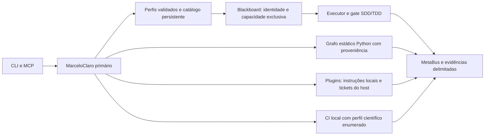
```mermaid
flowchart LR
    U894[CLI e MCP] --> P894[MarceloClaro primário]
    P894 --> A894[Perfis validados e catálogo persistente]
    A894 --> B894[Blackboard: identidade e capacidade exclusiva]
    B894 --> E894[Executor e gate SDD/TDD]
    P894 --> G894[Grafo estático Python com proveniência]
    P894 --> I894[Plugins: instruções locais e tickets do host]
    P894 --> C894[CI local com perfil científico enumerado]
    E894 --> M894[MetaBus e evidências delimitadas]
    G894 --> M894
    I894 --> M894
    C894 --> M894
```

Os comandos `agentes` e `ci-local` possuem entradas CLI e MCP. O backend
`python_graph` fornece três consultas estáticas para Python; as operações
nativas de grafo conhecidas como incorretas continuam bloqueadas. A CI local
executa sem depender da cobrança GitHub, preserva recibos e não cria checks
remotos. Consulte o guia para escopo, limites e comandos completos.

[WolframResearch pode contribuir](docs/AVALIACAO_WOLFRAM_CORE_R895.md) com
AgentTools, cliente Python e notebooks. Uma
[amostra hospedada real](docs/verification-wolfram-host-r895.json) calculou soma,
integral e fatoração pelo contrato existente. Runtime/licença locais requerem
verificação própria. O [ZIP REA fornecido](docs/AVALIACAO_ZIP_REA_PTBR.md) foi
avaliado como referência didática e não substituiu o Core.

## Capacidades principais

| Área | Implementação e caminho de uso | Condição ou limite |
|---|---|---|
| Orquestração | `MarceloClaroOrchestrator`, Blackboard, MetaBus e `ecosystem-network` | CLI instalada não comprova autenticação ou execução |
| Workflows | DAG com dependências, checkpoints e retomada | Execução sequencial; repetição de etapas falhas é explícita |
| SDD/TDD | SpecRegistry, SpecVerifier, TDDRunner e histórico RED/GREEN autenticado | Critérios textuais e entrega de software possuem contratos distintos |
| REA | Inspeção direta, explicação por recibo, camadas e MCP local | Formato, engine, licença e isolamento precisam ser conferidos |
| Memória observável | Terminal animado e aba **Rede de memória** | Projeta registros existentes; não mostra a atenção interna do LLM |
| Conhecimento e RAG | Busca científica, recuperação, referências e EvidenceGraph | Cobertura lexical e grafo não comprovam qualidade da resposta |
| Raciocínio | Gramáticas restritas, SymPy, Z3 e integrações formais opcionais | Entrada recusada ou engine indisponível gera resultado tipado ou fallback |
| Pesquisa e ciência | Fábrica de pesquisa, pipeline acadêmico e análise reproduzível | Proveniência, reexecução e revisão externa são verificações distintas |
| Apresentações | MIRA, slides e artefatos visuais | Conformidade interna não avalia mérito científico |
| Domínios jurídico e clínico | Integrações e contratos específicos | Apoio computacional com revisão humana; sem validação geral de uso |
| Governança e evolução | TrustEngine, economia de tokens, federação e EvolutionRegistry | Registrar um ciclo não equivale a auditá-lo externamente |

---

## Início rápido local

Para obter a revisão publicada nesta etapa, selecione a branch explicitamente.
Python é necessário para o Core; a CI declara versões 3.10–3.14 e a verificação
local documentada utilizou Python 3.14. Modelos, CLIs e engines externos exigem
configuração própria.

```bash
git clone --branch codex/core-prontidao-rea https://github.com/MarceloClaro/opencode-ecosystem-core.git
cd opencode-ecosystem-core
python3 -m venv .venv
.venv/bin/python -m pip install -r requirements.txt

.venv/bin/python -m marceloclaro.cli doctor
.venv/bin/python -m marceloclaro.cli helpdesk
```

O `doctor` informa a sanidade estrutural e as dependências encontradas.
Avisos de componentes opcionais devem ser interpretados por operação;
inferência e autenticação requerem sondagem própria.

Para utilizar as ferramentas TypeScript do OpenCode, use **Node 22** e o lockfile:

```bash
cd .opencode
npm ci
npm run typecheck
cd ..
```

A configuração é compilada por
`.venv/bin/python -m integrations.opencode_cli`; confira sua reprodução com
`.venv/bin/python -m integrations.opencode_cli --check`.
Perfis locais, memória de execução e evidências de alvos são arquivos privados
e não são versionados; consulte [fontes reproduzíveis](docs/REPOSITORIO_REPRODUZIVEL.md).

Para uma release formal, siga os controles de versão imutável e procedência da
seção seguinte. O checkout de uma branch não constitui uma release com tag.

---

## Instalação segura e procedência

> Instalação **local e revisável** — nada é executado por pipe de rede. A
> procedência combina versão imutável, commit Git e SHA-256 conferível.

Os controles abaixo se aplicam a uma **release formal com tag e manifesto
publicado**. Obtenha de um manifesto de versão revisado, independente do canal
de download, os valores a seguir, sem rótulos móveis:

| Dado | Formato exigido |
|---|---|
| `ECOSYSTEM_VERSION` | Tag ou identificador de versão imutável (ex.: `vX.Y.Z`). |
| `ECOSYSTEM_REF` | Commit Git completo com 40 caracteres hexadecimais. |
| `ECOSYSTEM_SOURCE_SHA256` | SHA-256 com 64 caracteres hexadecimais do TAR de origem. |
| `ProvisionSha256` | SHA-256 publicado do `provision.sh` do Windows/WSL. |
| `CommonInstallerSha256` | SHA-256 publicado de `installer/common/install_clis.sh`. |

```bash
export ECOSYSTEM_VERSION='<versao-imutavel>'
export ECOSYSTEM_REF='<commit-git-completo-com-40-caracteres>'
export ECOSYSTEM_SOURCE_SHA256='<sha-256-publicado-com-64-caracteres>'

git clone https://github.com/MarceloClaro/opencode-ecosystem-core.git opencode-ecosystem-core
cd opencode-ecosystem-core
git checkout --detach "$ECOSYSTEM_REF"
test "$(git rev-parse HEAD)" = "$ECOSYSTEM_REF"
test "$(git describe --tags --exact-match HEAD)" = "$ECOSYSTEM_VERSION"

git archive --format=tar "$ECOSYSTEM_REF" -o ../opencode-ecosystem-source.tar
printf '%s  %s\n' "$ECOSYSTEM_SOURCE_SHA256" "../opencode-ecosystem-source.tar" > ../opencode-ecosystem-source.tar.sha256
sha256sum -c ../opencode-ecosystem-source.tar.sha256
```

No macOS (Homebrew), use a variante `shasum -a 256 -c
../opencode-ecosystem-source.tar.sha256`. Sempre confira a versão com
`git describe --tags --exact-match HEAD` antes de instalar.

Após instalar, use **sempre** o interpretador do venv recém-criado:

```bash
source ~/opencode-ecosystem-core/.venv/bin/activate
python3 -m marceloclaro.cli helpdesk   # ou .venv/bin/python -m marceloclaro.cli doctor
```

**WSL2** (Windows 10/11): siga [installer/windows/README.md](installer/windows/README.md).
Detalhes, requisitos e solução de problemas: [installer/README.md](installer/README.md).

---

## Uso básico

Execute os comandos na raiz, com o interpretador do ambiente do projeto.

| Comando | Finalidade |
|---|---|
| `.venv/bin/python -m marceloclaro.cli` | Menu interativo principal |
| `.venv/bin/python -m marceloclaro.cli doctor` | Diagnóstico estrutural |
| `.venv/bin/python -m marceloclaro.cli doctor --live` | Sondas explícitas de HTTP, CLIs e exemplos internos |
| `.venv/bin/python -m marceloclaro.cli network status` | Estado e última execução observada dos executores |
| `.venv/bin/python -m marceloclaro.cli helpdesk` | Ajuda guiada |
| `.venv/bin/python -m marceloclaro.cli pesquisa "tema"` | Pesquisa científica conforme provedores disponíveis |
| `.venv/bin/python -m marceloclaro.cli agent-register` | Registro dos agentes no Blackboard |
| `.venv/bin/python -m integrations.op_timing report` | Tempos locais por operação |
| `.venv/bin/python -m integrations.opencode_cli --check` | Consistência da configuração gerada |

Com o OpenCode CLI instalado e acessível, abra a raiz com `opencode`.
A configuração seleciona `marceloclaro` como primário e oferece comandos como
`/ecosystem`, `/rea` e `/biblioteca`. Instalação e modelo disponível devem ser
conferidos antes de iniciar uma conversa.

Tarefas coordenadas passam pelo primário. Informe uma especificação válida e
respeite o contrato da superfície utilizada. O
[guia de workflows](docs/WORKFLOWS_R644.md) explica orçamento, checkpoints e
retomada. Autenticação e saldo de Claude, Codex ou Antigravity dependem do
ambiente; o identificador `chatgpt` não controla o aplicativo ChatGPT.

Manual: [MANUAL.md](MANUAL.md) · Guia do agente: [CLAUDE.md](CLAUDE.md) ·
Primeiros passos: [quickstart.md](quickstart.md).

## Engenharia reversa local REA

O [assistente REA local](docs/ASSISTENTE_REA_LOCAL.md) permite inspecionar um
artefato e explicar achados estáticos com fontes, digests e limitações.
Configure o runtime e os engines indicados no guia antes de analisar um alvo.

```bash
.venv/bin/python -m marceloclaro.cli rea layers
.venv/bin/python -m marceloclaro.cli rea inspect CAMINHO --kind auto --format text
.venv/bin/python -m marceloclaro.cli rea explain RECIBO --format text
```

Substitua `CAMINHO` e `RECIBO` por arquivos locais. A operação direta `inspect`
aplica namespaces de rede e PID ao worker analítico em Linux/WSL e recusa a
execução quando o isolamento exigido está indisponível. A aplicação alvo não
é executada. Isso não constitui uma sandbox universal de arquivos.

Para configurar o perfil do agente, escolha um modelo já instalado e servido
no endpoint local. O exemplo abaixo exige `llama3.2:latest` disponível no Ollama:

```bash
.venv/bin/python -m marceloclaro.cli rea setup --model llama3.2:latest --model-endpoint http://127.0.0.1:11434/v1
.venv/bin/python -m marceloclaro.cli rea agent --check
.venv/bin/python -m marceloclaro.cli rea site --port 8767
```

`agent --check` verifica configuração; não executa inferência. O cliente possui
supervisão de processos e conserva a rede do host para acessar o modelo. Seu
isolamento é diferente do worker analítico. O fluxo por prompt exige ferramenta
concluída e recibo íntegro antes de publicar uma análise; texto livre não é achado.
O modo interativo é exploratório e seu encerramento não comprova análise aceita.

São **18 camadas declaradas**, com **11 percursos de inspeção pela ponte Core**
no snapshot documentado. `analyze_binary` utiliza Ghidra; IDA, Hopper, JEB e
outras superfícies dependem de runtimes, configuração e licenças próprias.
A ponte legada `rea layer` não herda automaticamente o isolamento de `inspect`.
Veja [camadas e contratos](docs/REA.md) e o
[fluxograma REA](docs/architecture/flows/05-rea-provedores.svg).

## Memória no terminal e painel

```bash
.venv/bin/python -m webapp.memory_network_visualizer
.venv/bin/python -m webapp.memory_network_visualizer --once --json
```

A animação projeta consultas, agentes, memória, contexto, evidências e respostas
registrados no MetaBus, Blackboard e grafos. Disponibilidade de um agente não
significa atividade; `--demo` identifica dados fictícios. O visualizador não
inicia inferência. Consulte [origem dos dados e limites](docs/REDE_MEMORIA_CORE.md).

Para a aba **Rede de memória** no Streamlit:

```bash
.venv/bin/python -m pip install -r requirements-webapp.txt
.venv/bin/python -m streamlit run webapp/app.py --server.address 127.0.0.1
```

---

## Arquitetura resumida

Esta seção dá uma **visão resumida** do ecossistema: primeiro um **snapshot
histórico** (para preservar a documentação legada) e depois o **diagrama
operacional atual** do runtime observável no checkout. O snapshot histórico é
exatamente isso — um snapshot documental, **não é um inventário do checkout**.

### Ciclo metacognitivo integrado

A R886 conecta a memória de resultados à próxima delegação do primário:
recuperação contextual → análise crítica local → Blackboard → executor →
gate SDD/TDD → reflexão contextual → memória. Resultado, erro observado,
próxima ação e referências declaradas permanecem vinculados à tarefa.
Os escores dos motores são heurísticos e não promovem confiança automaticamente.

O [guia do ciclo](docs/METACOGNICA_INTEGRADA_R886.md) explica os contratos,
o tratamento de replay e degradação e o limite entre contexto e expressão formal.
A [avaliação dos cinco repositórios](docs/AVALIACAO_REPOS_METACOGNICA_R886.md)
prioriza Knowl como candidato de memória e Laya como auxílio consultivo;
Awesome LLM Apps, OpenShell e Feynman têm papéis próprios. Esses runtimes
externos não foram instalados ou executados nesta etapa.

As [verificações locais R886](docs/verification-local-r886.json) delimitam o
escopo executado. Para codificação eficiente, o [piloto R887](specs/SPEC-935-R887-code-intelligence-local.md)
usa um único provedor, context-link, subordinado ao primário e à memória canônica.
O [guia de contexto local](docs/CONTEXTO_CODIGO_LOCAL_R887.md) descreve instalação,
consulta, isolamento e limites. O smoke nativo encontrou falhas em relações de
chamadas Python: três consultas de grafo ficam bloqueadas; busca, código e
estrutura permanecem no piloto. Não há ganho de tokens comprovado.
A [avaliação comparativa](docs/AVALIACAO_CODE_INTELLIGENCE_R887.md) registra a
seleção e a [curadoria complementar](docs/CURADORIA_CODIFICACAO_EFICIENTE.md)
contextualiza as alternativas.

A revisão R888 dos [nove repositórios — grupo A](docs/AVALIACAO_REPOS_R888_A.md)
e [grupo B](docs/AVALIACAO_REPOS_R888_B.md) utiliza fontes fixadas e inspeções
REA compatíveis. A [decisão de adaptação](docs/DECISOES_ADAPTACAO_REPOS_R888.md) corrige o benchmark
IMO existente e seu consumidor DeepThink para separar execução, gabarito,
heurística e verificação formal, sem instalar nove runtimes paralelos.

O [aceite integral R889](docs/INDEXACAO_INTEGRAL_R889.md) adiciona auditoria
de arquivos, hashes e relações do banco, com retomada limitada de candidatos
privados. Um processo que termina sem erro continua insuficiente para aceitar
um índice parcial. A recuperação preserva o corpus e os limites de isolamento. A execução local
[R889](docs/verification-local-r889.json) concluiu as 763 fontes selecionadas;
isso não mede cobertura funcional de todo o ecossistema.

A [curadoria dos quinze projetos R890](docs/DECISOES_ADAPTACAO_REPOS_R890.md)
avalia química, materiais acadêmicos, voz, dispositivos, visão e ferramentas MCP.
A adaptação executada corrige a suíte Bell/GHZ/superposição existente: simulação
clássica declarada, métricas amostrais próprias, orçamento validado e proveniência
no MetaBus, sem elevar confiança nem apresentar circuitos fixos como resposta
à consulta. Os [recibos R890](docs/verification-local-r890.json) distinguem os
testes locais das propostas de integração e dos runtimes externos não ativados.

O [aceite científico local R891–R893](docs/ACEITE_CIENTIFICO_LOCAL_R891.md)
conecta artigos e experimentos ao mesmo primário, CLI e MCP: verifica pacotes,
hashes e reexecução por código confiável, propaga falhas sem conclusão fictícia
e preserva a busca Whoosh entre processos. O perfil de regressões é enumerado,
com orçamento e recibos; aceite computacional não equivale a revisão humana,
mérito científico ou escalabilidade multi-host.

## Arquitetura completa e fluxogramas atuais

### Snapshot estrutural atualizado R894–R897

O inventário reproduzível mais recente foi gerado do snapshot Git
[`f930e19`](docs/architecture-r900/README.md), que inclui R894–R897 e sucede
R900. Ele contém 10.033 arquivos versionados, 691 módulos Python de produção,
1.083 importações declaradas, 965 pares de dependências, 6.670 símbolos,
45 pacotes e 18 camadas; o parser AST não registrou erros nesse snapshot.
Templates, vendor e snapshots históricos aparecem no inventário com classes
próprias. Esses números descrevem estrutura estática, não cobertura funcional,
execução, segurança ou prontidão científica.

| Artefato atualizado | Conteúdo |
|---|---|
| [Guia e legenda do mapa](docs/architecture-r900/README.md) | Snapshot, escopo, limites e comandos de reprodução |
| [Visão por subsistema em SVG](docs/architecture-r900/overview.svg) | Interfaces, camadas e domínios do Core |
| [Dependências completas em SVG](docs/architecture-r900/dependencies.svg) | Imports Python declarados entre módulos |
| [Grafo em DOT](docs/architecture-r900/dependencies.dot) | Fonte editável do grafo de dependências |
| [Mapa Mermaid integral](docs/architecture-r900/architecture-complete.mmd) | Módulos, símbolos, camadas, pacotes e relações extraídas |
| [Inventário JSON](docs/architecture-r900/architecture-inventory.json) | Arquivos, hashes, declarações e classificações |
| [Correspondência Mermaid](docs/architecture-r900/mermaid-correspondence.json) | Rastreio das relações serializadas para o Mermaid |

Os fluxogramas operacionais anteriores continuam integralmente reproduzidos
abaixo, com legenda e limites; os novos percursos de agentes, plugins, grafo
Python e CI local estão no [guia R894–R897](docs/ORQUESTRACAO_AGENTES_PLUGINS_CI_R894_R897.md).

[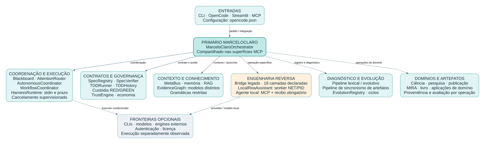](docs/ARQUITETURA_COMPLETA_CORE_R879.md)

A edição **R879** descreve o snapshot de implementação `6380cfa`:
**677 módulos Python próprios**, **935 pares de dependência**, **1.051
importações internas declaradas**, **6.432 símbolos**, **9.672 arquivos
classificados** e **13 fluxogramas com 78 âncoras de código**.

| Artefato | Uso |
|---|---|
| [Mapa navegável](docs/architecture_map.html) | Busca por módulo/símbolo, zoom, fontes e visão por fluxo; abre localmente sem CDN |
| [Guia minucioso](docs/ARQUITETURA_COMPLETA_CORE_R879.md) | Contratos, decisões, fronteiras e instruções de reprodução |
| [Grafo completo SVG](docs/architecture/dependencies.svg) | Todos os módulos incluídos e seus pares internos; imagem vetorial para ampliar |
| [Fonte DOT](docs/architecture/dependencies.dot) | Grafo editável por ferramentas Graphviz |
| [Inventário JSON](docs/architecture/architecture-inventory.json) | Arquivos classificados, hashes, símbolos e imports |
| [Catálogo dos fluxos](docs/architecture/flows.json) | Orquestração, workflows, SDD/TDD, REA, memória, RAG, raciocínio, diagnóstico, ciência e entrega |
| [Recibo R879](docs/architecture/verification-local-r879.json) | Renderização, testes e navegação observados naquela edição |
| [Revisão documental R880](docs/evidencias-readme-r880.json) | README atualizado e correção de nomenclatura MIRA na página do mapa |

As arestas AST são dependências declaradas, não rastreamento de execução.
Testes, templates, vendor, documentos e evidências históricas possuem categorias
próprias. A extração usa blobs Git e não executa o código inventariado.

Para abrir a página por HTTP local, opcionalmente:

```bash
.venv/bin/python -m http.server 8771 --bind 127.0.0.1 --directory docs
```

Acesse `http://127.0.0.1:8771/architecture_map.html`. A página também funciona
como arquivo local. Os [mapas R433–R438](docs/MAPA_ARQUITETURA_R433_R438.md)
permanecem como registro histórico.

### Mapa da Arquitetura Completa (v3.9.0)

> Snapshot histórico da arquitetura (v3.9.0), preservado como registro da
> evolução. É um **snapshot histórico / documental de uma época passada** e
> **não é um inventário do checkout** atual. A faixa documentada **R47–R127**
> registrou 85 ciclos de evolução (com o surgimento de `MiraDeckPipeline` e do
> agente `mira-presenter`).

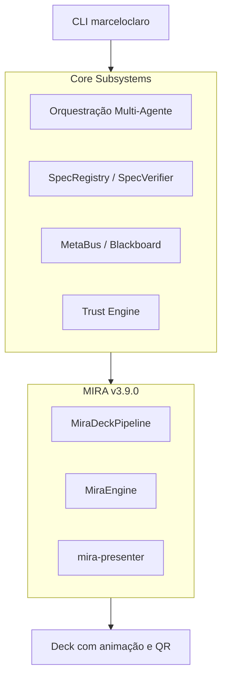
```mermaid
flowchart TB
    subgraph Core [Core Subsystems]
        ORCH[Orquestração Multi‑Agente]
        SPEC[SpecRegistry / SpecVerifier]
        META[MetaBus / Blackboard]
        TRUST[Trust Engine]
    end
    subgraph MIRA[MIRA v3.9.0]
        PIPELINE[MiraDeckPipeline]
        ENGINE[MiraEngine]
        AGENT[mira-presenter]
    end
    CLI[CLI marceloclaro] --> Core
    Core --> MIRA
    MIRA --> DECK[Deck com animação e QR]
```

### Diagrama Operacional Atual

> Diagrama do runtime observável no checkout atual. Concentra-se nos
> componentes estruturalmente auditados; não lista todos os arquivos, classes
> auxiliares ou serviços opcionais do ecossistema.

<!-- core-runtime-diagram:start -->
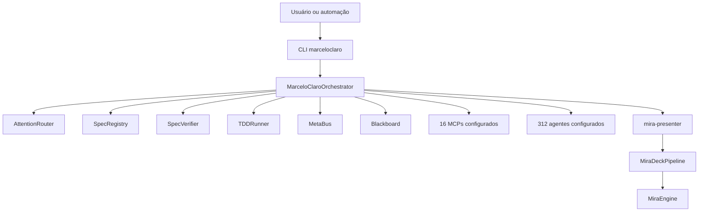
```mermaid
flowchart TB
    Usuario2[Usuário ou automação] --> CLI2[CLI marceloclaro]
    CLI2 --> Orq2[MarceloClaroOrchestrator]
    Orq2 --> Router[AttentionRouter]
    Orq2 --> SpecRegistry2[SpecRegistry]
    Orq2 --> SpecVerifier2[SpecVerifier]
    Orq2 --> TDDRunner2[TDDRunner]
    Orq2 --> MetaBus2[MetaBus]
    Orq2 --> Blackboard2[Blackboard]
    Orq2 --> MCP2[16 MCPs configurados]
    Orq2 --> Agents2[312 agentes configurados]
    Orq2 --> Mira2[mira-presenter]
    Mira2 --> Deck2[MiraDeckPipeline]
    Deck2 --> Engine2[MiraEngine]
```
<!-- core-runtime-diagram:end -->

O MCP `ecosystem-network`, acrescentado na R640, conecta o orquestrador e seu
roteamento Transformer por atenção aos executores de análise e leitura Claude,
Antigravity e Codex disponíveis no ambiente, com registros no Blackboard e na
memória MetaBus. A coordenação limita passos e tempo e exige a conclusão para
reportar sucesso; instalação e autenticação devem ser conferidas localmente.
Transformer descreve roteamento multiagente inspirado em atenção. O
identificador `chatgpt` não controla o aplicativo ChatGPT; selecione `codex`
explicitamente para usar sua CLI.

A R644 acrescenta workflows com dependências, análise seguida de revisão por
outro especialista e checkpoints para retomada. A seleção automática consulta
a saúde persistida dos executores e pausa serviços que falharam recentemente.
Veja o [guia de execução em etapas](docs/WORKFLOWS_R644.md).

Da R711 à R746, o programa do pesquisador polímata curou 21 repositórios por
tipo de raciocínio (dedutivo, causal, bayesiano, síntese, autônomo, auditoria)
com pinagem viva, federação por classes de frescor e decisão humana nominal:
16 federados no escopo polímata em `workbench/rede_polimata` (fora do harness
R621), com painel em `workbench/polymath/DASHBOARD.md`, skill
`pesquisador-polimata-labs`, 3 agentes de catálogo e o MCP `polymath-labs-mcp`.
Nada federado atesta qualidade; todo federado exige supervisão.

### Mapa dinâmico regenerável

`marceloclaro/ecosystem_map.py` também gera um inventário de componentes. Os
arquivos `maps/ecosystem_map_2026-07-06.json` e
`MAPA_ECOSSISTEMA_COMPLETO_2026-07-06.md` são fotografias históricas de julho;
suas contagens não representam a edição R879. Para uma nova coleta, execute:

```bash
.venv/bin/python -c "from marceloclaro.ecosystem_map import save_ecosystem_map_artifacts; save_ecosystem_map_artifacts()"
```

Essa coleta possui escopo diferente do extrator Git/AST R879. Consulte o
manifesto de cada resultado antes de comparar suas contagens.

### Fluxos multiárea do checkout atual

| Área | Principais referências observáveis |
|---|---|
| Pipeline acadêmico agentivo | `agentic_science_v2/orchestrator.py`, `deep_research.py`, `review_agent.py`, `revision_agent.py`, `paper_composer.py` |
| Prova, formalização e raciocínio | `integrations/deepmind/formal_verifier.py`, `alphaproof_engine.py`, `aletheia_scaffold.py`, `deep_think_engine.py`, `autoformalizer.py`, `geometry_engine.py`, `lean4_verifier.py`, `egraph_rewriter.py`, `erdos_hirzebruch_solver.py` |
| Jurídico | `legal/integration.py`, `specializations.py`, `knowledge_base.py`, `precedents.py`, `datajud_client.py`, `benchmarks.py` |
| Clínico | `integrations/medical/clinical_game_theory.py`, `clinical_verifier.py`, `evidence_grounding.py`, `clinical_orchestrator_bridge.py` |
| Scientific RAG | `rag/scientific.py`, `rag/evolved.py`, `rag/enhanced_search_rag.py` |
| Universidade Sintética | `synthetic_university/core.py`, `combinatorial_engine.py`, `evolutionary_memory.py`, `mcp_server.py`, `api_gateway.py` |
| Runtime local | `integrations/litert_lm.py`, `litert_lm_provider.py`, `litert_lm_supervisor.py`, `integrations/colibri_provider.py` (LiteRT‑LM on‑device e Colibri / OLMoE) |
| Integridade e quality gates | `benchmarks/merkle_integrity_guard.py` (`MerkleIntegrityGuard`), `scripts/quality_report.py`, `installer/`, `benchmarks/scientific_reasoning/` |

Visão conceitual de áreas: as setas abaixo não comprovam um pipeline
sequencial executado entre esses domínios.

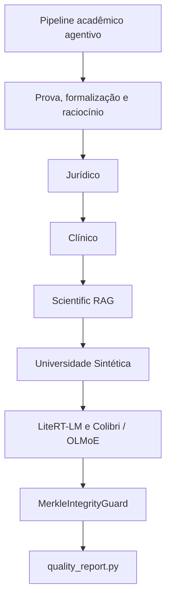
```mermaid
flowchart TB
    ACAD[Pipeline acadêmico agentivo] --> PROVA[Prova, formalização e raciocínio]
    PROVA --> JUR[Jurídico]
    JUR --> CLIN[Clínico]
    CLIN --> RAG[Scientific RAG]
    RAG --> UNIV[Universidade Sintética]
    UNIV --> RT[LiteRT-LM e Colibri / OLMoE]
    RT --> INT[MerkleIntegrityGuard]
    INT --> QR[quality_report.py]
```

---

## Apresentações MIRA

> A documentação de ***MIRA*** é feita em **dupla leitura**: uma visão para o
> **leigo** (o que o subsistema entrega, em linguagem simples) e outra para o
> **PhD** (arquitetura e contratos técnicos). O subsistema é composto por
> `MiraDeckPipeline` (orquestra os estágios), `MiraEngine` (produz os artefatos
> visuais) e o agente delegável `mira-presenter` (SPEC-935-R126/R127).

**Visão leigo:** o MIRA transforma uma pasta com `manuscrito.md` em uma
apresentação navegável, com animações, QR codes e checagem dos terços.

**Visão PhD:** o pipeline é determinístico e auditável, com estágios explícitos
e um validador de conformidade do artefato final.

### Como funciona a apresentação MIRA

O processo percorre **6 estágios**:

1. **extract** — extrai estrutura e conteúdo do `manuscrito.md`;
2. **plan** — planeja a sequência de slides do deck;
3. **copywrite** — refina textos e mensagens visuais;
4. **build** — monta o deck em cards e seções navegáveis;
5. **animate** — gera as animações centrais de cada slide;
6. **validate** — valida conformidade e consistência final do deck.

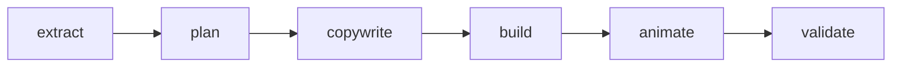
```mermaid
flowchart LR
    A[extract] --> B[plan]
    B --> C[copywrite]
    C --> D[build]
    D --> E[animate]
    E --> F[validate]
```

A etapa final registra conformidade segundo regras internas; não avalia
externamente o mérito científico do manuscrito.

### Presentation On Storytelling — Act I — A Ilha de Agentes

O storytelling dos decks MIRA segue uma trilha de apresentação em atos. O
**Act I — A Ilha de Agentes** apresenta o ecossistema como um território
habitado por agentes especialistas que cooperam pelo Blackboard.

**Fluxograma Intuitivo:** um diagrama simples orienta o público leigo pelas
trocas entre orquestrador, agentes e memória metacognitiva, sem jargão.

**Arquitetura Técnica Multilateral:** para a plateia técnica, o mesmo fluxo é
desenhado com todas as camadas — entrada, orquestração, SDD/TDD, memória,
integrações e apresentação.

### Ciclo de Vida SDD / TDD

O ciclo de desenvolvimento é fechado (ver também a seção de validação):

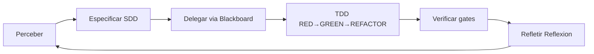
```mermaid
flowchart LR
    P[Perceber] --> S[Especificar SDD]
    S --> D[Delegar via Blackboard]
    D --> T[TDD RED→GREEN→REFACTOR]
    T --> V[Verificar gates]
    V --> R[Refletir Reflexion]
    R --> P
```

- **SDD**: nenhuma entrega sem `specs/SPEC-*.md` com critérios de aceitação.
- **TDD**: testes primeiro (RED), implementação (GREEN), refatoração só com verde.
- **Gates**: `SpecVerifier` aplica o contrato; o primário integra confiança e economia conforme o resultado e a política.
- **Reflexion**: eventos e reflexões registrados no MetaBus sustentam a revisão dos resultados.
- **Evolução**: `EvolutionRegistry` conserva os ciclos; registro, hashes e auditoria externa são operações distintas.

---

<!-- core-flowcharts:start -->
## Fluxogramas operacionais completos

Os fluxogramas abaixo são cópias integrais das mesmas fontes usadas no
[mapa navegável](docs/architecture_map.html). A ordem, as descrições, as fontes
e as limitações seguem o [catálogo de fluxos](docs/architecture/flows.json).
A edição estrutural de referência é o snapshot `6380cfa`; estes desenhos
não representam uma nova execução de todos os componentes.

### Legenda e critérios de leitura

| Elemento | Como interpretar |
|---|---|
| Retângulo | Componente, etapa, dado ou artefato indicado pelo rótulo. |
| Losango | Decisão ou condição; siga o texto de cada saída. |
| Grupo delimitado | Subsistema ou fronteira de responsabilidade. Não implica isolamento de rede. |
| Seta contínua | Direção de controle, dado ou composição conforme o título e o rótulo; não implica chamada direta entre todas as caixas. |
| Seta pontilhada | Caminho condicional, dependência opcional ou relação explicativa; leia o rótulo e os limites do fluxo. |
| Cores | Auxílio visual de agrupamento; nomes e rótulos conservam a informação sem depender da cor. |
| Fonte de código | Âncora de arquivo, símbolo e linha no retrato documentado; não é recibo de execução. |

Instalação, disponibilidade, autenticação, inferência concluída, entrega aceita
e validação externa são estados distintos. Evidências de uma operação local
valem apenas para seu escopo. Referências a agentes ou ferramentas opcionais
não garantem saldo, licença, credenciais, isolamento ou funcionamento atual.

No grafo estrutural integral, a seta tem significado mais restrito:
**módulo importador → dependência Python declarada**. Consulte a
[fonte Mermaid integral](docs/architecture/dependencies.mmd), o
[SVG equivalente](docs/architecture/dependencies-mermaid.svg) e o
[guia da legenda e reprodução](docs/architecture/MERMAID_INTEGRAL.md).

### 01. Panorama completo por camadas

Interfaces, primário, execução, governança, conhecimento e fronteiras externas.


```mermaid
flowchart TB
  U["Operador / solicitação / alvo local"]
  subgraph interfaces["Interfaces e contratos de entrada"]
    CLI["marceloclaro.cli / rea_cli / science_cli"]
    OC["OpenCode: configuração compilada e comandos"]
    MCP["ecosystem-network: MCP stdio"]
    UI["Streamlit: consulta / evidência / memória"]
    SITE["Site local REA: instruções e exemplos"]
  end
  subgraph primary["Coordenação primária e memória compartilhada"]
    MC["MarceloClaroOrchestrator"]
    CAT["Registro idempotente: agentes e catálogo"]
    BB["Blackboard / AgentCard / task.cfp"]
    BUS["MetaBus: eventos e memória metacognitiva"]
    ATT["AttentionRouter: capacidade / semântica / confiança / carga"]
    TRANS["TransformerPipeline + GradingHead: revisão limitada"]
    TASK["TaskRuntime: DAG / lease / orçamento / recuperação"]
    AUTO["AutonomousCoordinator"]
    WF["WorkflowCoordinator + WorkflowStore"]
  end
  subgraph execution["Execução e integrações condicionais"]
    HAR["HarnessRuntime: CLI / stdin / prazo / cancelamento"]
    EXT["Codex / Claude / Antigravity: autenticação e saldo próprios"]
    FED["Federação: artefatos / políticas / integridade / licença"]
    REA["ReaBridge + registro rea_layers"]
    LOCAL["LocalReaAssistant: worker isolado e recibo"]
    BROW["Navegador coordenado / cenários / snapshots"]
    MODEL["Provedores locais opcionais: Ollama / runai / LiteRT"]
  end
  subgraph assurance["Especificação, governança e evidência"]
    SPEC["SpecRegistry / Specification / critérios"]
    HIST["TDDHistory: RED e GREEN autenticados"]
    RUN["TDDRunner: teste e contrato por critério"]
    GATE["SpecVerifier / report_completion: aceite ou recusa"]
    TRUST["Trust Engine / confidence ledger / behavioral gate"]
    ECON["TokenEconomy: staking / release / slash / fee"]
    DIAG["Doctor + DiagnosticPipeline: medições locais"]
    EVO["EvolutionRegistry: ledger / encadeamento / auditoria"]
    CI["pytest / JUnit / quality_report / CI"]
  end
  subgraph knowledge["Conhecimento, raciocínio e pesquisa"]
    RAG["UnifiedSearchRAG: busca / recuperação / abstenção"]
    EG["EvidenceGraph MCI: claims / evidências / replicações"]
    SCI["EvidenceGraph científico: entidades / relações / fontes"]
    REASON["Motores: AST restrita / SMT / simbólico / heurísticas"]
    RESEARCH["Pesquisa: proveniência / execução reprodutível / revisão"]
    PUB["Composer / manuscrito / LaTeX / DOCX / material didático"]
    VIS["Rede de memória: terminal e Streamlit observacionais"]
  end
  U --> CLI
  U --> OC
  U --> MCP
  U --> UI
  U --> SITE
  CLI --> MC
  OC --> MCP
  MCP --> MC
  UI --> MC
  MC --> CAT
  CAT --> BB
  MC --> BUS
  MC --> ATT
  MC --> TRANS
  MC --> TASK
  MCP --> AUTO
  AUTO --> MC
  MCP --> WF
  WF --> AUTO
  AUTO --> HAR
  HAR --> EXT
  AUTO --> FED
  MC --> REA
  MC --> LOCAL
  MC --> BROW
  OC -. "configuração opcional" .-> MODEL
  MC --> SPEC
  SPEC --> HIST
  SPEC --> RUN
  HIST --> GATE
  RUN --> GATE
  MC --> GATE
  GATE --> BB
  GATE --> TRUST
  GATE --> ECON
  GATE --> BUS
  MC --> DIAG
  MC --> EVO
  CI --> RUN
  MC --> RAG
  MC --> REASON
  MC --> RESEARCH
  RESEARCH --> EG
  RESEARCH --> SCI
  RESEARCH --> PUB
  RAG -. "resultados de recuperação" .-> SCI
  BUS --> VIS
  EG --> VIS
  SCI --> VIS
  BB --> VIS
  VIS --> UI
  SITE -. "orienta operação; não executa análise" .-> LOCAL
```

[Fonte Mermaid](docs/architecture/flows/01-panorama.mmd) · [Abrir SVG](docs/architecture/flows/01-panorama.svg)

**Fontes de código:**

- [marceloclaro/orchestrator.py:77](marceloclaro/orchestrator.py#L77) — `MarceloClaroOrchestrator`.
- [integrations/ecosystem_mcp.py:264](integrations/ecosystem_mcp.py#L264) — `get_coordinator`.
- [integrations/opencode_cli.py:378](integrations/opencode_cli.py#L378) — `build_config`.

**Limitações:**

- Relações de composição curadas; a existência do componente não comprova sua execução.

### 02. Orquestração primária e execução CLI

Primário compartilhado, especificação textual, roteamento, Blackboard, executor e aceite autoritativo.

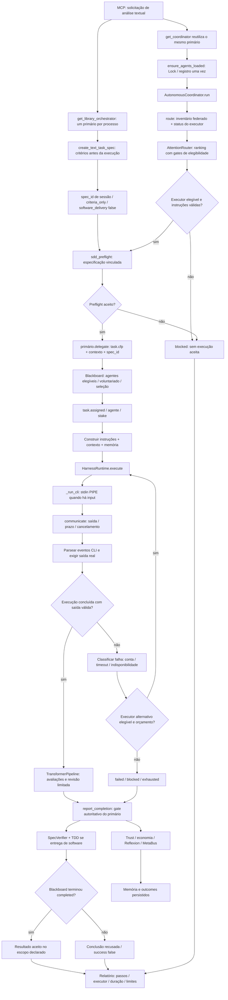
```mermaid
flowchart TB
  IN["MCP: solicitação de análise textual"] --> READ["get_library_orchestrator: um primário por processo"]
  READ --> TEXT["create_text_task_spec: critérios antes da execução"]
  TEXT --> SID["spec_id de sessão / criteria_only / software_delivery false"]
  IN --> GET["get_coordinator reutiliza o mesmo primário"]
  GET --> LOAD["ensure_agents_loaded: Lock / registro uma vez"]
  LOAD --> AC["AutonomousCoordinator.run"]
  SID --> PREF["sdd_preflight: especificação vinculada"]
  AC --> ROUTE["route: inventário federado + status do executor"]
  ROUTE --> AT["AttentionRouter: ranking com gates de elegibilidade"]
  AT --> READY{"Executor elegível e instruções válidas?"}
  READY -->|"não"| BLOCK["blocked: sem execução aceita"]
  READY -->|"sim"| PREF
  PREF --> OK{"Preflight aceito?"}
  OK -->|"não"| BLOCK
  OK -->|"sim"| D["primário.delegate: task.cfp + contexto + spec_id"]
  D --> BB["Blackboard: agentes elegíveis / voluntariado / seleção"]
  BB --> ASSIGN["task.assigned / agente / stake"]
  ASSIGN --> EX["Construir instruções + contexto + memória"]
  EX --> HR["HarnessRuntime.execute"]
  HR --> PROC["_run_cli: stdin PIPE quando há input"]
  PROC --> WAIT["communicate: saída / prazo / cancelamento"]
  WAIT --> PARSE["Parsear eventos CLI e exigir saída real"]
  PARSE --> GOOD{"Execução concluída com saída válida?"}
  GOOD -->|"não"| CLASS["Classificar falha: conta / timeout / indisponibilidade"]
  CLASS --> FALL{"Executor alternativo elegível e orçamento?"}
  FALL -->|"sim"| HR
  FALL -->|"não"| FAIL["failed / blocked / exhausted"]
  GOOD -->|"sim"| PIPE["TransformerPipeline: avaliações e revisão limitada"]
  PIPE --> CP["report_completion: gate autoritativo do primário"]
  FAIL --> CP
  CP --> SV["SpecVerifier + TDD se entrega de software"]
  SV --> ACCEPT{"Blackboard terminou completed?"}
  ACCEPT -->|"não"| REJECT["Conclusão recusada / success false"]
  ACCEPT -->|"sim"| RESULT["Resultado aceito no escopo declarado"]
  CP --> T["Trust / economia / Reflexion / MetaBus"]
  T --> MEM["Memória e outcomes persistidos"]
  RESULT --> REPORT["Relatório: passos / executor / duração / limites"]
  REJECT --> REPORT
  BLOCK --> REPORT
```

[Fonte Mermaid](docs/architecture/flows/02-orquestracao.mmd) · [Abrir SVG](docs/architecture/flows/02-orquestracao.svg)

**Fontes de código:**

- [integrations/ecosystem_mcp.py:33](integrations/ecosystem_mcp.py#L33) — `get_library_orchestrator`.
- [integrations/ecosystem_mcp.py:264](integrations/ecosystem_mcp.py#L264) — `get_coordinator`.
- [marceloclaro/orchestrator.py:233](marceloclaro/orchestrator.py#L233) — `create_text_task_spec`.
- [marceloclaro/autonomous.py:33](marceloclaro/autonomous.py#L33) — `AutonomousCoordinator`.
- [integrations/harness_runtime.py:266](integrations/harness_runtime.py#L266) — `_run_cli`.
- [marceloclaro/orchestrator.py:758](marceloclaro/orchestrator.py#L758) — `report_completion`.

**Limitações:**

- Criteria_only não entrega software.
- Ranking e instalação não comprovam autenticação, saldo ou inferência.

### 03. Workflow DAG e retomada

Definição normalizada, checkpoint durável, orçamento global e repetição explícita de falhas.

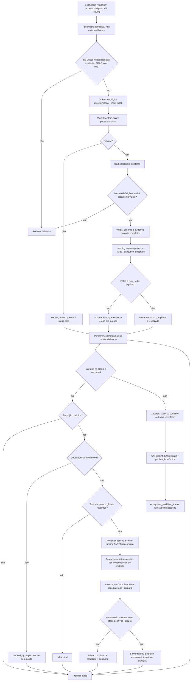
```mermaid
flowchart TB
  IN["ecosystem_workflow: nodes / budgets / id / resume"] --> DEF["_definition: normalizar nós e dependências"]
  DEF --> V{"IDs únicos / dependências existentes / DAG sem ciclo?"}
  V -->|"não"| BAD["Recusar definição"]
  V -->|"sim"| HASH["Ordem topológica determinística + input_hash"]
  HASH --> CLAIM["WorkflowStore.claim: posse exclusiva"]
  CLAIM --> RESUME{"resume?"}
  RESUME -->|"não"| NEW["create_record: queued / steps zero"]
  RESUME -->|"sim"| LOAD["load checkpoint existente"]
  LOAD --> MATCH{"Mesma definição / hash / orçamento válido?"}
  MATCH -->|"não"| BAD
  MATCH -->|"sim"| CHECK["Validar schema e evidência dos nós completed"]
  CHECK --> REC["running interrompido vira failed / execution_uncertain"]
  REC --> RETRY{"Falha e retry_failed explícito?"}
  RETRY -->|"sim"| QUEUE["Guardar history e recolocar etapa em queued"]
  RETRY -->|"não"| KEEP["Preservar falha; completed é reutilizado"]
  NEW --> LOOP["Percorrer ordem topológica sequencialmente"]
  QUEUE --> LOOP
  KEEP --> LOOP
  LOOP --> REMAIN{"Há etapa na ordem a percorrer?"}
  REMAIN -->|"sim"| DONE{"Etapa já concluída?"}
  DONE -->|"sim"| NEXT["Próxima etapa"]
  DONE -->|"não"| DEP{"Dependências completed?"}
  DEP -->|"não"| B["blocked_by: dependências sem aceite"]
  DEP -->|"sim"| BUDGET{"Tempo e passos globais restantes?"}
  BUDGET -->|"não"| E["exhausted"]
  BUDGET -->|"sim"| RES["Reservar passos e salvar running ANTES do executor"]
  RES --> CTX["Acrescentar saídas aceitas das dependências ao contexto"]
  CTX --> AC["AutonomousCoordinator.run: spec da etapa / primário"]
  AC --> R{"completed / success true / steps positivos / prazo?"}
  R -->|"sim"| C["Salvar completed + resultado + consumo"]
  R -->|"não"| F["Salvar failed / blocked / exhausted; incerteza explícita"]
  C --> NEXT
  F --> NEXT
  B --> NEXT
  E --> NEXT
  NEXT --> LOOP
  REMAIN -->|"não"| END["_overall: sucesso somente se todos completed"]
  END --> STORE["Checkpoint durável: save / publicação atômica"]
  STORE --> STATUS["ecosystem_workflow_status: leitura sem execução"]
```

[Fonte Mermaid](docs/architecture/flows/03-workflow-dag.mmd) · [Abrir SVG](docs/architecture/flows/03-workflow-dag.svg)

**Fontes de código:**

- [marceloclaro/workflow.py:42](marceloclaro/workflow.py#L42) — `WorkflowCoordinator`.
- [marceloclaro/workflow.py:84](marceloclaro/workflow.py#L84) — `_definition`.
- [marceloclaro/workflow.py:237](marceloclaro/workflow.py#L237) — `_resume`.
- [marceloclaro/workflow_store.py:17](marceloclaro/workflow_store.py#L17) — `WorkflowStore`.

**Limitações:**

- A execução das etapas é sequencial, apesar das dependências em DAG.
- Etapa interrompida tem resultado incerto; retry_failed precisa ser explícito.

### 04. SDD e histórico RED–GREEN

Especificação, contratos por critério, execução pytest real e recibos autenticados no escopo local.

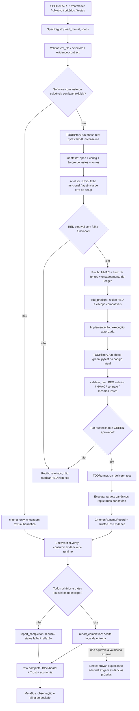
```mermaid
flowchart TB
  SPEC["SPEC-935-R...: frontmatter / objetivo / critérios / testes"] --> REG["SpecRegistry.load_formal_specs"]
  REG --> CONTRACT["Validar test_file / selectors / evidence_contract"]
  CONTRACT --> KIND{"Software com teste ou evidência confiável exigida?"}
  KIND -->|"não"| TEXT["criteria_only: checagem textual heurística"]
  KIND -->|"sim"| RED["TDDHistory.run phase red: pytest REAL no baseline"]
  RED --> CONTEXT["Contexto: spec + config + árvore de testes + fontes"]
  CONTEXT --> ANALYSE["Analisar JUnit / falha funcional / ausência de erro de setup"]
  ANALYSE --> ROK{"RED elegível com falha funcional?"}
  ROK -->|"não"| NO["Recibo rejeitado; não fabricar RED histórico"]
  ROK -->|"sim"| SIGN["Recibo HMAC + hash de fontes + encadeamento do ledger"]
  SIGN --> PREF["sdd_preflight: recibo RED e escopo compatíveis"]
  PREF --> CODE["Implementação / execução autorizada"]
  CODE --> GREEN["TDDHistory.run phase green: pytest no código atual"]
  GREEN --> PAIR["validate_pair: RED anterior / HMAC / contrato / mesmos testes"]
  PAIR --> POK{"Par autenticado e GREEN aprovado?"}
  POK -->|"não"| NO
  POK -->|"sim"| TDD["TDDRunner.run_delivery_test"]
  TDD --> TARGETS["Executar targets canônicos registrados por critério"]
  TARGETS --> RECORD["CriterionRuntimeRecord + TrustedTestEvidence"]
  RECORD --> VERIFY["SpecVerifier.verify: consumir evidência de runtime"]
  TEXT --> VERIFY
  VERIFY --> SUCCESS{"Todos critérios e gates satisfeitos no escopo?"}
  SUCCESS -->|"não"| REJ["report_completion: recusa / status falha / reflexão"]
  SUCCESS -->|"sim"| ACC["report_completion: aceite local da entrega"]
  ACC --> BB["task.complete: Blackboard + Trust + economia"]
  REJ --> BB
  BB --> MEM["MetaBus: observação e trilha de decisão"]
  ACC -. "não equivale a validação externa" .-> LIMIT["Limite: provas e qualidade editorial exigem evidências próprias"]
```

[Fonte Mermaid](docs/architecture/flows/04-sdd-tdd.mmd) · [Abrir SVG](docs/architecture/flows/04-sdd-tdd.svg)

**Fontes de código:**

- [sdd/spec_engine.py:70](sdd/spec_engine.py#L70) — `Specification`.
- [sdd/spec_engine.py:1308](sdd/spec_engine.py#L1308) — `SpecVerifier`.
- [sdd/tdd_history.py:114](sdd/tdd_history.py#L114) — `TDDHistory`.
- [sdd/tdd_history.py:490](sdd/tdd_history.py#L490) — `validate_pair`.
- [sdd/tdd_runner.py:46](sdd/tdd_runner.py#L46) — `TDDRunner`.
- [marceloclaro/orchestrator.py:248](marceloclaro/orchestrator.py#L248) — `sdd_preflight`.

**Limitações:**

- Recibo retrospectivo não pode substituir RED que não foi executado.
- Aceite local não certifica qualidade editorial nem validação externa.

### 05. REA e camadas de provedores

Registro informativo das 18 camadas, sondas estruturais e percursos efetivamente implementados: analyze JavaScript, analyze_binary Ghidra e layer com inspeção definida.

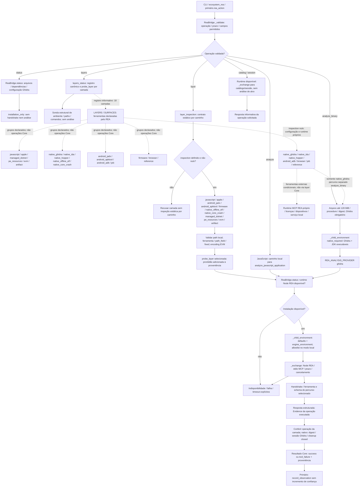
```mermaid
flowchart TB
  IN["CLI / ecosystem_rea / primário.rea_action"] --> VAL["ReaBridge._validate: operação / prazo / campos permitidos"]
  VAL --> OP{"Operação validada?"}
  OP -->|"status"| STATUS["ReaBridge.status: arquivos / dependências / configuração Ghidra"]
  STATUS --> STRUCT["installation_only: sem handshake nem análise"]
  OP -->|"layers"| LAYERS["layers_status: registro canônico e probe_layer por camada"]
  LAYERS --> READY["Sonda estrutural de ambiente / paths / comandos; sem análise"]
  LAYERS -. "registro informativo: 18 camadas" .-> DECL["LAYERS / SURFACES: ferramentas declaradas pelo REA"]
  DECL -. "grupos declarados; não operações Core" .-> DJS["javascript / apple / managed_dotnet / pe_resources / evm / artifact"]
  DECL -. "grupos declarados; não operações Core" .-> DN["native_ghidra / native_ida / native_hopper / native_offline_elf / native_core_crash"]
  DECL -. "grupos declarados; não operações Core" .-> DA["android_jadx / android_apktool / android_adb / jeb"]
  DECL -. "grupos declarados; não operações Core" .-> DO["firmware / browser / reference"]
  OP -->|"layer"| INS["layer_inspection: contrato estático por caminho"]
  INS --> SUPPORTED{"inspection definido e não nulo?"}
  SUPPORTED -->|"não"| REJECT["Recusar camada sem inspeção estática por caminho"]
  SUPPORTED -->|"sim"| STATIC["javascript / apple / android_jadx / android_apktool / firmware / native_offline_elf / native_core_crash / managed_dotnet / pe_resources / evm / artifact"]
  STATIC --> TARGET["Validar path local; ferramenta / path_field / fixed; encoding EVM"]
  TARGET --> PROBE["probe_layer selecionada: prontidão adicionada à proveniência"]
  OP -->|"analyze"| JS["JavaScript: caminho local para analyze_javascript_application"]
  OP -->|"analyze_binary"| GH["Arquivo até 128 MiB / procedure / digest; Ghidra obrigatório"]
  GH --> GENV["_child_environment native_required: Ghidra + JDK executáveis"]
  GENV --> PROVIDER["REA_ANALYSIS_PROVIDER ghidra"]
  PROBE --> INST["ReaBridge.status: runtime Node REA disponível?"]
  JS --> INST
  PROVIDER --> INST
  INST --> AVAILABLE{"Instalação disponível?"}
  AVAILABLE -->|"não"| ERROR["Indisponibilidade / falha / timeout explícitos"]
  AVAILABLE -->|"sim"| ENV["_child_environment: defaults + engine_environment; allowlist no modo local"]
  ENV --> IPC["_exchange: Node REA / stdio MCP / prazo / cancelamento"]
  IPC --> HAND["Handshake / ferramenta e schema do percurso selecionado"]
  HAND --> EVID["Resposta estruturada: Evidence da operação executada"]
  EVID --> CHECK["Conferir operação da camada; nativo: digest / sessão Ghidra / cleanup closed"]
  CHECK --> RESULT["Resultado Core: success ou tool_failure + proveniência"]
  RESULT --> OBS["Primário: record_observation sem incremento de confiança"]
  IPC --> ERROR
  OP -->|"catalog / session"| INFO["Runtime disponível: _exchange para catálogo/sessão, sem análise de alvo"]
  INFO --> RESPONSE["Resposta informativa da operação solicitada"]
  DECL -. "inspection nulo: configuração e runtime próprios" .-> OTHER["native_ghidra / native_ida / native_hopper / android_adb / browser / jeb / reference"]
  OTHER -. "ferramentas externas condicionais; não via layer Core" .-> EXTERNAL["Runtime MCP REA próprio / licenças / dispositivos / serviço local"]
  OTHER -. "somente native_ghidra: percurso separado analyze_binary" .-> GH
```

[Fonte Mermaid](docs/architecture/flows/05-rea-provedores.mmd) · [Abrir SVG](docs/architecture/flows/05-rea-provedores.svg)

**Fontes de código:**

- [integrations/rea_layers.py:445](integrations/rea_layers.py#L445) — `layers_status`.
- [integrations/rea_layers.py:422](integrations/rea_layers.py#L422) — `probe_layer`.
- [integrations/rea_layers.py:465](integrations/rea_layers.py#L465) — `engine_environment`.
- [integrations/rea_bridge.py:40](integrations/rea_bridge.py#L40) — `ReaBridge`.
- [marceloclaro/orchestrator.py:2065](marceloclaro/orchestrator.py#L2065) — `rea_action`.
- [marceloclaro/rea_cli.py:7](marceloclaro/rea_cli.py#L7) — `run_rea_cli`.
- [integrations/rea_bridge.py:174](integrations/rea_bridge.py#L174) — `_validate`.
- [integrations/rea_bridge.py:108](integrations/rea_bridge.py#L108) — `status`.
- [integrations/rea_bridge.py:50](integrations/rea_bridge.py#L50) — `_child_environment`.
- [integrations/rea_bridge.py:479](integrations/rea_bridge.py#L479) — `action`.
- [integrations/rea_layers.py:305](integrations/rea_layers.py#L305) — `layer_inspection`.

**Limitações:**

- O registro declara 18 camadas; layer Core recusa inspection nulo.
- analyze_binary exige Ghidra; não alterna automaticamente para IDA/Hopper.
- IDA, Hopper, adb, browser, JEB e reference possuem runtimes/configuração próprios e não oferecem layer nesta ponte.
- Status e sondas de camada não abrem alvo nem iniciam análise.
- Ferramentas comerciais, dispositivos e engines exigem configuração e licenças próprias.

### 06. REA local direto e evidência

Inspeção estática com rede/PID privados, digest antes/depois, recibo por hash e explicação derivada.

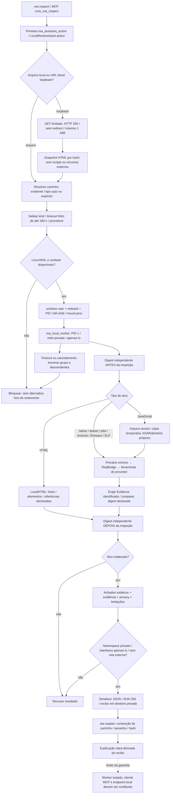
```mermaid
flowchart TB
  IN["rea inspect / MCP core_rea_inspect"] --> LOCAL["Primário.rea_assistant_action / LocalReaAssistant.action"]
  LOCAL --> PATH{"Arquivo local ou URL literal loopback?"}
  PATH -->|"loopback"| HTTP["GET limitado: HTTP 200 / sem redirect / máximo 1 MiB"]
  HTTP --> SNAP["Snapshot HTML por hash; sem scripts ou recursos externos"]
  PATH -->|"arquivo"| RES["Resolver caminho existente / tipo auto ou explícito"]
  SNAP --> RES
  RES --> PARAM["Validar kind / timeout finito de até 180 s / procedure"]
  PARAM --> ISO{"Linux/WSL e unshare disponíveis?"}
  ISO -->|"não"| BLOCK["Bloquear: sem alternativa fora do isolamento"]
  ISO -->|"sim"| NS["unshare user + network + PID / kill-child / mount-proc"]
  NS --> WORKER["rea_local_worker: PID 1 / rede privada / apenas lo"]
  WORKER --> DIGEST["Digest independente ANTES da inspeção"]
  DIGEST --> TYPE{"Tipo de alvo"}
  TYPE -->|"HTML"| PARSER["LocalHTML: título / elementos / referências declaradas"]
  TYPE -->|"JavaScript"| PREP["Arquivo avulso: cópia temporária; ASAR/diretório próprios"]
  TYPE -->|"native / dotnet / plist / Android / firmware / ELF"| PROVIDER["Primário mínimo → ReaBridge → ferramenta de provedor"]
  PREP --> PROVIDER
  PROVIDER --> CHECK["Exigir Evidence identificada / comparar digest declarado"]
  PARSER --> AFTER["Digest independente DEPOIS da inspeção"]
  CHECK --> AFTER
  AFTER --> SAME{"Alvo inalterado?"}
  SAME -->|"não"| REJ["Recusar resultado"]
  SAME -->|"sim"| REPORT["Achados estáticos + evidência + privacy + limitações"]
  REPORT --> PRIV{"Namespace privado / interfaces apenas lo / sem rota externa?"}
  PRIV -->|"não"| REJ
  PRIV -->|"sim"| CAS["Serializar JSON / SHA-256 / recibo em diretório privado"]
  CAS --> EXPLAIN["rea explain: contenção de caminho / tamanho / hash"]
  EXPLAIN --> OUT["Explicação clara derivada do recibo"]
  WORKER --> TIME["Timeout ou cancelamento: encerrar grupo e descendentes"]
  TIME --> BLOCK
  OUT -. "limite da garantia" .-> LIMIT["Worker isolado; cliente MCP e endpoint local devem ser confiáveis"]
```

[Fonte Mermaid](docs/architecture/flows/06-rea-local.mmd) · [Abrir SVG](docs/architecture/flows/06-rea-local.svg)

**Fontes de código:**

- [integrations/rea_assistant.py:625](integrations/rea_assistant.py#L625) — `LocalReaAssistant`.
- [integrations/rea_assistant.py:42](integrations/rea_assistant.py#L42) — `run_isolated_worker`.
- [integrations/rea_assistant.py:603](integrations/rea_assistant.py#L603) — `_snapshot_loopback`.
- [integrations/rea_local_worker.py:40](integrations/rea_local_worker.py#L40) — `main`.
- [integrations/rea_assistant.py:164](integrations/rea_assistant.py#L164) — `explain_report`.

**Limitações:**

- Garantia de rede privada cobre o worker e seus descendentes.
- Aplicação alvo não é executada no percurso estático; .NET pode fornecer apenas metadados.
- Snapshot loopback não executa scripts nem busca recursos externos.

### 07. REA com agente local e gate de recibos

Setup próprio, configuração efetiva, quatro ferramentas, timeout e validação do resultado do cliente.

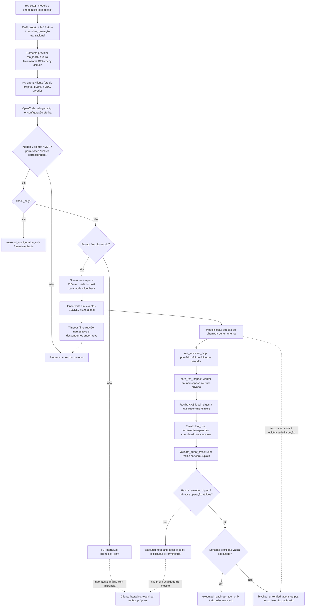
```mermaid
flowchart TB
  SET["rea setup: modelo e endpoint literal loopback"] --> FILES["Perfil próprio + MCP stdio + launcher; gravação transacional"]
  FILES --> PROFILE["Somente provider rea_local / quatro ferramentas REA / deny demais"]
  PROFILE --> RUN["rea agent: cliente fora do projeto / HOME e XDG próprios"]
  RUN --> DEBUG["OpenCode debug config: ler configuração efetiva"]
  DEBUG --> VALID{"Modelo / prompt / MCP / permissões / limites correspondem?"}
  VALID -->|"não"| STOP["Bloquear antes da conversa"]
  VALID -->|"sim"| CHECK{"check_only?"}
  CHECK -->|"sim"| STRUCT["resolved_configuration_only / sem inferência"]
  CHECK -->|"não"| PROMPT{"Prompt finito fornecido?"}
  PROMPT -->|"não"| TUI["TUI interativa: client_exit_only"]
  PROMPT -->|"sim"| NS["Cliente: namespace PID/user; rede do host para modelo loopback"]
  NS --> CLIENT["OpenCode run: eventos JSONL / prazo global"]
  CLIENT --> MODEL["Modelo local: decisão de chamada de ferramenta"]
  MODEL --> MCP["rea_assistant_mcp: primário mínimo único por servidor"]
  MCP --> WORKER["core_rea_inspect: worker em namespace de rede privado"]
  WORKER --> RECEIPT["Recibo CAS local / digest / alvo inalterado / limites"]
  RECEIPT --> TRACE["Evento tool_use: ferramenta esperada / completed / success true"]
  TRACE --> GATE["validate_agent_trace: reler recibo por core explain"]
  GATE --> OK{"Hash / caminho / digest / privacy / operação válidos?"}
  OK -->|"sim"| OUT["executed_tool_and_local_receipt: explicação determinística"]
  OK -->|"não"| STATUS{"Somente prontidão válida executada?"}
  STATUS -->|"sim"| READY["executed_readiness_tool_only / alvo não analisado"]
  STATUS -->|"não"| BAD["blocked_unverified_agent_output: texto livre não publicado"]
  CLIENT --> CANCEL["Timeout / interrupção: namespace e descendentes encerrados"]
  CANCEL --> STOP
  MODEL -. "texto livre nunca é evidência de inspeção" .-> BAD
  TUI -. "não atesta análise nem inferência" .-> LIMIT["Cliente interativo: examinar recibos próprios"]
  OUT -. "não prova qualidade do modelo" .-> LIMIT
```

[Fonte Mermaid](docs/architecture/flows/07-rea-agente.mmd) · [Abrir SVG](docs/architecture/flows/07-rea-agente.svg)

**Fontes de código:**

- [integrations/rea_assistant.py:280](integrations/rea_assistant.py#L280) — `setup_local_agent`.
- [integrations/rea_assistant.py:447](integrations/rea_assistant.py#L447) — `launch_local_agent`.
- [integrations/rea_assistant.py:353](integrations/rea_assistant.py#L353) — `_run_agent_client`.
- [integrations/rea_assistant.py:544](integrations/rea_assistant.py#L544) — `validate_agent_trace`.
- [integrations/rea_assistant_mcp.py:17](integrations/rea_assistant_mcp.py#L17) — `create_mcp_server`.

**Limitações:**

- Cliente OpenCode preserva a rede host para o endpoint loopback; não tem a garantia de rede privada do worker.
- Status, configuração ou saída TUI não comprovam análise autônoma do alvo.
- Análise REA autônoma pelo LLM local não foi comprovada nos recibos de prontidão R868/R869.

### 08. Conhecimento, RAG e grafos de evidência

Recuperação de fontes, abstenção, referências e dois modelos de grafo com responsabilidades distintas.

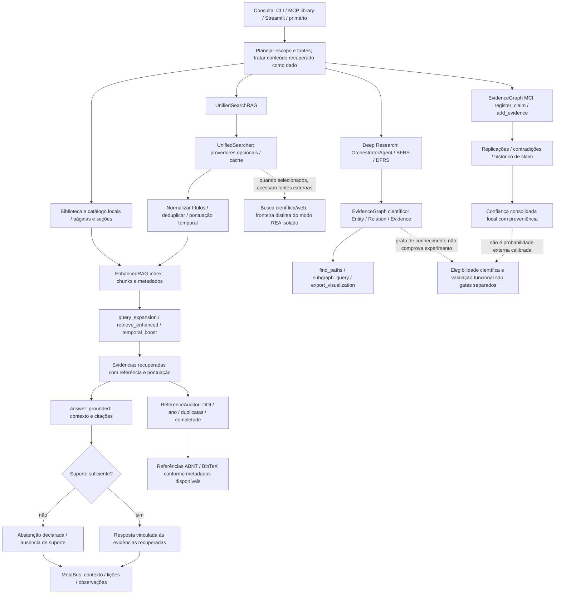
```mermaid
flowchart TB
  IN["Consulta: CLI / MCP library / Streamlit / primário"] --> PLAN["Planejar escopo e fontes; tratar conteúdo recuperado como dado"]
  PLAN --> LOCAL["Biblioteca e catálogo locais / páginas e seções"]
  PLAN --> UR["UnifiedSearchRAG"]
  UR --> SEARCH["UnifiedSearcher: provedores opcionais / cache"]
  SEARCH --> DEDUP["Normalizar títulos / deduplicar / pontuação temporal"]
  DEDUP --> INDEX["EnhancedRAG.index: chunks e metadados"]
  LOCAL --> INDEX
  INDEX --> EXP["query_expansion / retrieve_enhanced / temporal_boost"]
  EXP --> EVID["Evidências recuperadas com referência e pontuação"]
  EVID --> ANSWER["answer_grounded: contexto e citações"]
  ANSWER --> SUFF{"Suporte suficiente?"}
  SUFF -->|"não"| ABSTAIN["Abstenção declarada / ausência de suporte"]
  SUFF -->|"sim"| RESULT["Resposta vinculada às evidências recuperadas"]
  EVID --> AUDIT["ReferenceAuditor: DOI / ano / duplicatas / completude"]
  AUDIT --> BIB["Referências ABNT / BibTeX conforme metadados disponíveis"]
  PLAN --> DEEP["Deep Research: OrchestratorAgent / BFRS / DFRS"]
  DEEP --> SCI["EvidenceGraph científico: Entity / Relation / Evidence"]
  SCI --> QUERY["find_paths / subgraph_query / export_visualization"]
  PLAN --> CLAIM["EvidenceGraph MCI: register_claim / add_evidence"]
  CLAIM --> REPL["Replicações / contradições / histórico de claim"]
  REPL --> CONF["Confiança consolidada local com proveniência"]
  RESULT --> OBS["MetaBus: contexto / lições / observações"]
  ABSTAIN --> OBS
  SEARCH -. "quando selecionados, acessam fontes externas" .-> REMOTE["Busca científica/web: fronteira distinta do modo REA isolado"]
  SCI -. "grafo de conhecimento não comprova experimento" .-> LIMIT["Elegibilidade científica e validação funcional são gates separados"]
  CONF -. "não é probabilidade externa calibrada" .-> LIMIT
```

[Fonte Mermaid](docs/architecture/flows/08-conhecimento-rag.mmd) · [Abrir SVG](docs/architecture/flows/08-conhecimento-rag.svg)

**Fontes de código:**

- [rag/enhanced_search_rag.py:761](rag/enhanced_search_rag.py#L761) — `UnifiedSearchRAG`.
- [rag/enhanced_search_rag.py:312](rag/enhanced_search_rag.py#L312) — `EnhancedRAG`.
- [rag/enhanced_search_rag.py:602](rag/enhanced_search_rag.py#L602) — `ReferenceAuditor`.
- [mci/evidence_graph.py:22](mci/evidence_graph.py#L22) — `EvidenceGraph`.
- [agentic_science_v2/evidence_graph.py:128](agentic_science_v2/evidence_graph.py#L128) — `EvidenceGraph`.
- [agentic_science_v2/deep_research.py:468](agentic_science_v2/deep_research.py#L468) — `OrchestratorAgent`.

**Limitações:**

- Busca externa depende dos provedores escolhidos; não integra a garantia local do REA.
- Grafo de conhecimento e evidência recuperada não comprovam experimento ou probabilidade calibrada.

### 09. Rede de memória observável

Eventos reais, memória persistida, claims, cartões e visualização em terminal/Streamlit.

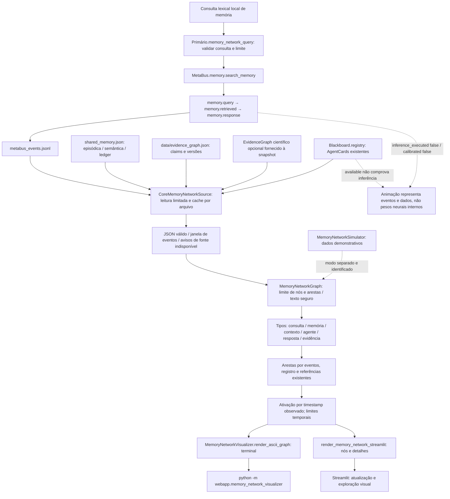
```mermaid
flowchart TB
  USER["Consulta lexical local de memória"] --> Q["Primário.memory_network_query: validar consulta e limite"]
  Q --> SEARCH["MetaBus.memory.search_memory"]
  SEARCH --> EVENTS["memory.query → memory.retrieved → memory.response"]
  EVENTS --> LOG["metabus_events.jsonl"]
  STATE["shared_memory.json: episódica / semântica / ledger"] --> READ["CoreMemoryNetworkSource: leitura limitada e cache por arquivo"]
  LOG --> READ
  CLAIMS["data/evidence_graph.json: claims e versões"] --> READ
  SCI["EvidenceGraph científico opcional fornecido à snapshot"] --> READ
  REG["Blackboard.registry: AgentCards existentes"] --> READ
  READ --> VALID["JSON válido / janela de eventos / avisos de fonte indisponível"]
  VALID --> GRAPH["MemoryNetworkGraph: limite de nós e arestas / texto seguro"]
  GRAPH --> TYPES["Tipos: consulta / memória / contexto / agente / resposta / evidência"]
  TYPES --> EDGE["Arestas por eventos, registro e referências existentes"]
  EDGE --> ACT["Ativação por timestamp observado; limites temporais"]
  ACT --> ASCII["MemoryNetworkVisualizer.render_ascii_graph: terminal"]
  ACT --> STREAM["render_memory_network_streamlit: nós e detalhes"]
  STREAM --> UI["Streamlit: atualização e exploração visual"]
  ASCII --> CLI["python -m webapp.memory_network_visualizer"]
  SIM["MemoryNetworkSimulator: dados demonstrativos"] -. "modo separado e identificado" .-> GRAPH
  EVENTS -. "inference_executed false / calibrated false" .-> LIMIT["Animação representa eventos e dados, não pesos neurais internos"]
  REG -. "available não comprova inferência" .-> LIMIT
```

[Fonte Mermaid](docs/architecture/flows/09-memoria-observavel.mmd) · [Abrir SVG](docs/architecture/flows/09-memoria-observavel.svg)

**Fontes de código:**

- [marceloclaro/orchestrator.py:265](marceloclaro/orchestrator.py#L265) — `memory_network_query`.
- [mci/metabus.py:51](mci/metabus.py#L51) — `MetacognitiveMemory`.
- [webapp/memory_network_visualizer.py:161](webapp/memory_network_visualizer.py#L161) — `CoreMemoryNetworkSource`.
- [webapp/memory_network_visualizer.py:365](webapp/memory_network_visualizer.py#L365) — `MemoryNetworkVisualizer`.
- [webapp/memory_network_streamlit.py:17](webapp/memory_network_streamlit.py#L17) — `render_memory_network_streamlit`.

**Limitações:**

- A animação representa eventos e relações observadas, não ativações internas de uma rede neural.
- Simulação e registro de agente disponível são distintos de inferência executada.

### 10. Raciocínio restrito e fallbacks

AST permitida, tradução SMT integral, cálculo simbólico da entrada e falha sem conclusão inventada.

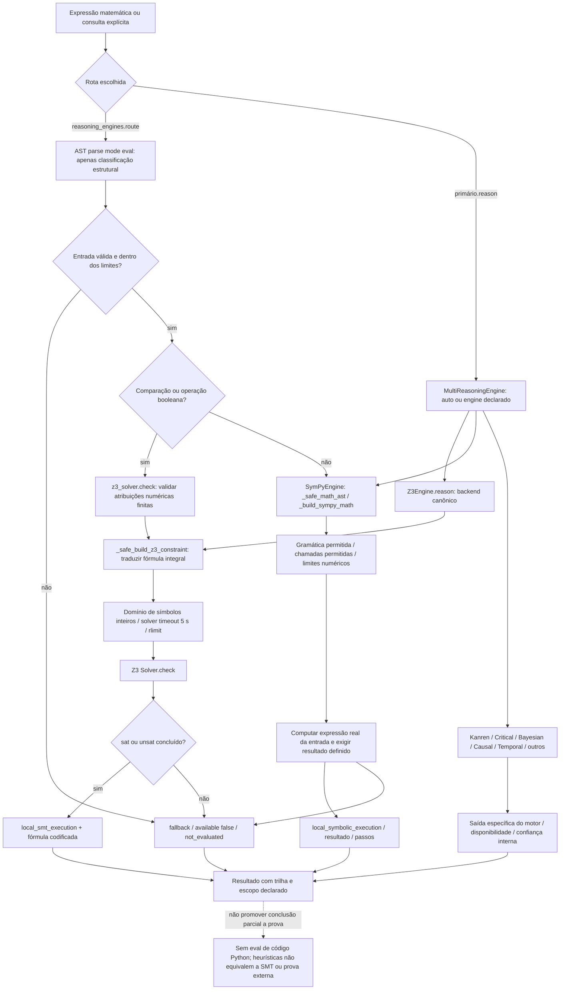
```mermaid
flowchart TB
  IN["Expressão matemática ou consulta explícita"] --> ENTRY{"Rota escolhida"}
  ENTRY -->|"reasoning_engines.route"| PARSE["AST parse mode eval: apenas classificação estrutural"]
  ENTRY -->|"primário.reason"| MULTI["MultiReasoningEngine: auto ou engine declarado"]
  PARSE --> VALID{"Entrada válida e dentro dos limites?"}
  VALID -->|"não"| FALL["fallback / available false / not_evaluated"]
  VALID -->|"sim"| BOOL{"Comparação ou operação booleana?"}
  BOOL -->|"sim"| Z["z3_solver.check: validar atribuições numéricas finitas"]
  Z --> SMT["_safe_build_z3_constraint: traduzir fórmula integral"]
  SMT --> LIMIT["Domínio de símbolos inteiros / solver timeout 5 s / rlimit"]
  LIMIT --> SOLVER["Z3 Solver.check"]
  SOLVER --> VERDICT{"sat ou unsat concluído?"}
  VERDICT -->|"sim"| SAT["local_smt_execution + fórmula codificada"]
  VERDICT -->|"não"| FALL
  BOOL -->|"não"| MATH["SymPyEngine: _safe_math_ast / _build_sympy_math"]
  MATH --> WHITELIST["Gramática permitida / chamadas permitidas / limites numéricos"]
  WHITELIST --> COMPUTE["Computar expressão real da entrada e exigir resultado definido"]
  COMPUTE --> OUT["local_symbolic_execution / resultado / passos"]
  COMPUTE --> FALL
  MULTI --> ZENGINE["Z3Engine.reason: backend canônico"]
  ZENGINE --> SMT
  MULTI --> MATH
  MULTI --> OTHER["Kanren / Critical / Bayesian / Causal / Temporal / outros"]
  OTHER --> HEUR["Saída específica do motor / disponibilidade / confiança interna"]
  SAT --> REPORT["Resultado com trilha e escopo declarado"]
  OUT --> REPORT
  FALL --> REPORT
  HEUR --> REPORT
  REPORT -. "não promover conclusão parcial a prova" .-> BOUND["Sem eval de código Python; heurísticas não equivalem a SMT ou prova externa"]
```

[Fonte Mermaid](docs/architecture/flows/10-raciocinio.mmd) · [Abrir SVG](docs/architecture/flows/10-raciocinio.svg)

**Fontes de código:**

- [reasoning/reasoning_engines.py:7](reasoning/reasoning_engines.py#L7) — `route`.
- [reasoning/z3_solver.py:41](reasoning/z3_solver.py#L41) — `check`.
- [reasoning/engines.py:78](reasoning/engines.py#L78) — `_safe_build_z3_constraint`.
- [reasoning/engines.py:332](reasoning/engines.py#L332) — `_safe_math_ast`.
- [reasoning/engines.py:488](reasoning/engines.py#L488) — `SymPyEngine`.
- [reasoning/engines.py:1446](reasoning/engines.py#L1446) — `MultiReasoningEngine`.

**Limitações:**

- SAT/UNSAT exige conclusão do backend; erro ou indisponibilidade retorna fallback.
- Motores heurísticos e confidence interna não equivalem a prova SMT ou validação externa.

### 11. Diagnóstico, confiança, federação e evolução

Autodescoberta e corpus retido, categorias canônicas, remediação, políticas e ledger de evolução.

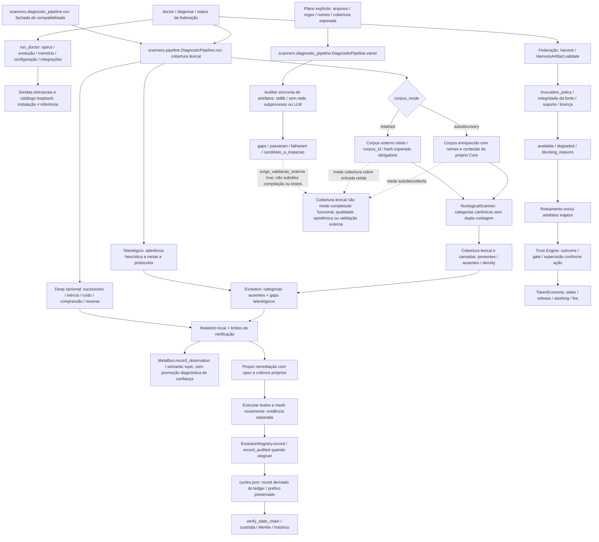
```mermaid
flowchart TB
  IN["doctor / diagnose / status da federação"] --> DOC["run_doctor: specs / evolução / memória / configuração / integrações"]
  DOC --> INST["Sondas estruturais e catálogo loopback: instalação ≠ inferência"]
  IN --> DP["scanners.pipeline.DiagnosticPipeline.run: cobertura lexical"]
  FACADE["scanners.diagnostic_pipeline.run: fachada de compatibilidade"] --> DP
  DP --> MODE{"corpus_mode"}
  MODE -->|"autodiscovery"| SELF["Corpus enriquecido com nomes e conteúdo do próprio Core"]
  MODE -->|"retained"| RET["Corpus externo retido / corpus_id / hash esperado obrigatório"]
  SELF --> NOO["NoologicalScanner: categorias canônicas sem dupla contagem"]
  RET --> NOO
  NOO --> COV["Cobertura lexical e camadas: presentes / ausentes / density"]
  DP --> TELEO["Teleológico: aderência heurística a metas e protocolos"]
  COV --> GAPS["Evolutivo: categorias ausentes + gaps teleológicos"]
  TELEO --> GAPS
  DP --> DEEP["Deep opcional: sucessores / inércia / ruído / compressão / reversa"]
  GAPS --> REPORT["Relatório local + limites de verificação"]
  DEEP --> REPORT
  REPORT --> OBS["MetaBus.record_observation / semantic topic; sem promoção diagnóstica de confiança"]
  IN --> FED["Federação: harvest / HarnessArtifact.validate"]
  FED --> POL["invocation_policy / integridade da fonte / suporte / licença"]
  POL --> STATE["available / degraded / blocking_reasons"]
  STATE --> RANK["Roteamento exclui artefatos inaptos"]
  RANK --> TRUST["Trust Engine: outcome / gate / supervisão conforme ação"]
  TRUST --> ECON["TokenEconomy: stake / release / slashing / fee"]
  REPORT --> PLAN["Propor remediação com spec e critérios próprios"]
  PLAN --> TEST["Executar testes e medir novamente: evidência separada"]
  TEST --> EVO["EvolutionRegistry.record / record_audited quando elegível"]
  EVO --> LEDGER["cycles.json: round derivado do ledger / prefixo preservado"]
  LEDGER --> CHAIN["verify_state_chain / custódia / Merkle / histórico"]
  SELF -. "mede autodescoberta" .-> BOUND["Cobertura lexical não mede completude funcional, qualidade epistêmica ou validação externa"]
  RET -. "mede cobertura sobre entrada retida" .-> BOUND
  PLANART["Plano explícito: arquivos / regex / nomes / cobertura esperada"] --> HERM["scanners.diagnostic_pipeline.DiagnosticPipeline.varrer"]
  HERM --> CHECKART["Auditar sincronia de artefatos: stdlib / sem rede, subprocesso ou LLM"]
  CHECKART --> ARTOUT["gaps / passaram / falharam / candidato_a_inspecao"]
  ARTOUT -. "exige_validacao_externa true; não substitui compilação ou testes" .-> BOUND
```

[Fonte Mermaid](docs/architecture/flows/11-diagnostico-governanca.mmd) · [Abrir SVG](docs/architecture/flows/11-diagnostico-governanca.svg)

**Fontes de código:**

- [marceloclaro/doctor.py:921](marceloclaro/doctor.py#L921) — `run_doctor`.
- [scanners/pipeline.py:96](scanners/pipeline.py#L96) — `DiagnosticPipeline`.
- [scanners/noological_scanner.py:495](scanners/noological_scanner.py#L495) — `NoologicalScanner`.
- [integrations/harness_federation/artifact.py:406](integrations/harness_federation/artifact.py#L406) — `HarnessArtifact`.
- [trust/trust_engine.py:540](trust/trust_engine.py#L540) — `TrustEngine`.
- [economy/token_economy.py:184](economy/token_economy.py#L184) — `TokenEconomy`.
- [evolution/cycles.py:84](evolution/cycles.py#L84) — `EvolutionRegistry`.
- [scanners/diagnostic_pipeline.py:46](scanners/diagnostic_pipeline.py#L46) — `varrer`.
- [scanners/diagnostic_pipeline.py:142](scanners/diagnostic_pipeline.py#L142) — `run`.

**Limitações:**

- Cobertura lexical não mede cobertura funcional ou completude epistêmica.
- Confiança e licença declarada são sinais e políticas locais, não certificações externas.
- scanners.diagnostic_pipeline.varrer é auditoria hermética de sincronia; run desse módulo é fachada do diagnóstico lexical.

### 12. Ciência, proveniência e publicação

Execução científica e descoberta com gates, revisão interna, composição e entrega editorial humana.

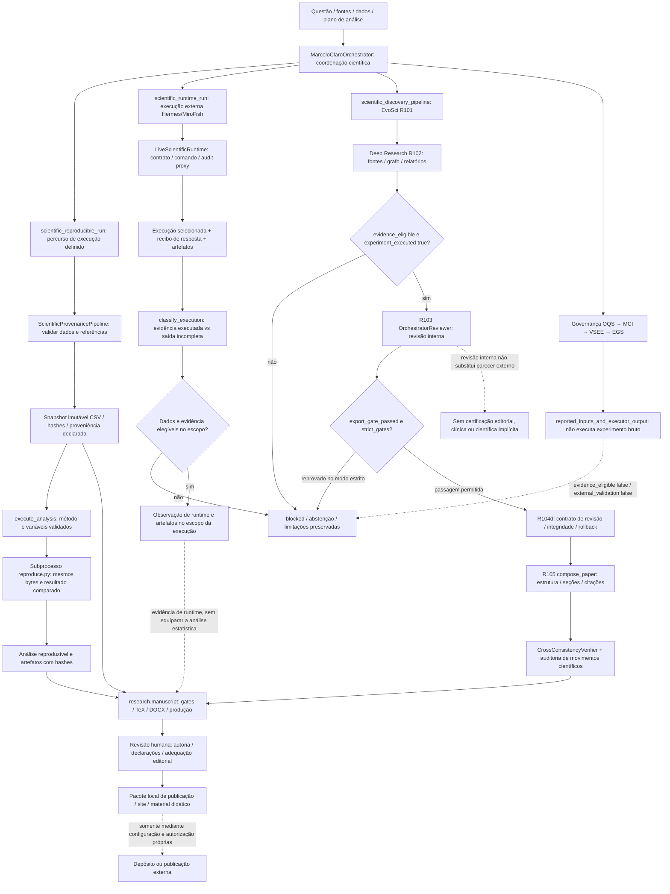
```mermaid
flowchart TB
  U["Questão / fontes / dados / plano de análise"] --> PRIMARY["MarceloClaroOrchestrator: coordenação científica"]
  PRIMARY --> REPRO["scientific_reproducible_run: percurso de execução definido"]
  REPRO --> PROV["ScientificProvenancePipeline: validar dados e referências"]
  PROV --> SNAP["Snapshot imutável CSV / hashes / proveniência declarada"]
  SNAP --> STAT["execute_analysis: método e variáveis validados"]
  STAT --> REP["Subprocesso reproduce.py: mesmos bytes e resultado comparado"]
  REP --> ANALYSIS["Análise reproduzível e artefatos com hashes"]
  PRIMARY --> RUNTIME["scientific_runtime_run: execução externa Hermes/MiroFish"]
  RUNTIME --> LIVE["LiveScientificRuntime: contrato / comando / audit proxy"]
  LIVE --> EXEC["Execução selecionada + recibo de resposta + artefatos"]
  EXEC --> CLASS["classify_execution: evidência executada vs saída incompleta"]
  CLASS --> ELIG{"Dados e evidência elegíveis no escopo?"}
  ELIG -->|"não"| BLOCK["blocked / abstenção / limitações preservadas"]
  ELIG -->|"sim"| OBS["Observação de runtime e artefatos no escopo da execução"]
  PRIMARY --> DISC["scientific_discovery_pipeline: EvoSci R101"]
  DISC --> DEEP["Deep Research R102: fontes / grafo / relatórios"]
  DEEP --> G102{"evidence_eligible e experiment_executed true?"}
  G102 -->|"não"| BLOCK
  G102 -->|"sim"| REVIEW["R103 OrchestratorReviewer: revisão interna"]
  REVIEW --> G103{"export_gate_passed e strict_gates?"}
  G103 -->|"reprovado no modo estrito"| BLOCK
  G103 -->|"passagem permitida"| REV["R104d: contrato de revisão / integridade / rollback"]
  REV --> COMPOSE["R105 compose_paper: estrutura / seções / citações"]
  ANALYSIS --> MAN["research.manuscript: gates / TeX / DOCX / produção"]
  OBS -. "evidência de runtime, sem equiparar a análise estatística" .-> MAN
  SNAP --> MAN
  COMPOSE --> CONSIST["CrossConsistencyVerifier + auditoria de movimentos científicos"]
  CONSIST --> MAN
  MAN --> HUMAN["Revisão humana: autoria / declarações / adequação editorial"]
  HUMAN --> EXPORT["Pacote local de publicação / site / material didático"]
  EXPORT -. "somente mediante configuração e autorização próprias" .-> PUB["Depósito ou publicação externa"]
  PRIMARY --> GOV["Governança OQS → MCI → VSEE → EGS"]
  GOV --> INPUTS["reported_inputs_and_executor_output: não executa experimento bruto"]
  INPUTS -. "evidence_eligible false / external_validation false" .-> BLOCK
  REVIEW -. "revisão interna não substitui parecer externo" .-> LIMIT["Sem certificação editorial, clínica ou científica implícita"]
```

[Fonte Mermaid](docs/architecture/flows/12-ciencia-publicacao.mmd) · [Abrir SVG](docs/architecture/flows/12-ciencia-publicacao.svg)

**Fontes de código:**

- [marceloclaro/orchestrator.py:1904](marceloclaro/orchestrator.py#L1904) — `scientific_reproducible_run`.
- [marceloclaro/orchestrator.py:2263](marceloclaro/orchestrator.py#L2263) — `scientific_discovery_pipeline`.
- [integrations/live_scientific_runtime.py:189](integrations/live_scientific_runtime.py#L189) — `LiveScientificRuntime`.
- [research/provenance_pipeline.py:260](research/provenance_pipeline.py#L260) — `ScientificProvenancePipeline`.
- [agentic_science_v2/paper_composer.py:496](agentic_science_v2/paper_composer.py#L496) — `OrchestratorComposer`.
- [mci/pipeline/scientific_governance_pipeline.py:15](mci/pipeline/scientific_governance_pipeline.py#L15) — `run_scientific_governance_pipeline`.
- [marceloclaro/orchestrator.py:1926](marceloclaro/orchestrator.py#L1926) — `scientific_runtime_run`.
- [research/statistical_methods.py:84](research/statistical_methods.py#L84) — `execute_analysis`.

**Limitações:**

- Deep Research sem evidência elegível bloqueia a descoberta estrita.
- Governança de entradas reportadas não executa experimento sobre dados brutos.
- Composição e revisão internas não constituem parecer editorial ou validação clínica.

### 13. Validação e entrega

Suíte/JUnit, contagens físicas, exportação limpa, manifesto, commit e resultado remoto independente.

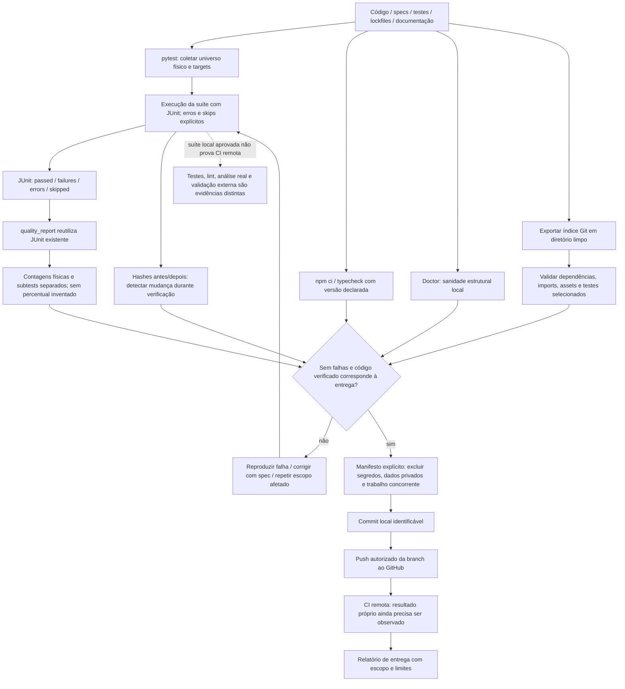
```mermaid
flowchart TB
  SRC["Código / specs / testes / lockfiles / documentação"] --> COLLECT["pytest: coletar universo físico e targets"]
  COLLECT --> RUN["Execução da suíte com JUnit; erros e skips explícitos"]
  RUN --> XML["JUnit: passed / failures / errors / skipped"]
  XML --> QR["quality_report reutiliza JUnit existente"]
  QR --> COUNTS["Contagens físicas e subtests separados; sem percentual inventado"]
  SRC --> NODE["npm ci / typecheck com versão declarada"]
  SRC --> DOC["Doctor: sanidade estrutural local"]
  SRC --> EXPORT["Exportar índice Git em diretório limpo"]
  EXPORT --> CHECK["Validar dependências, imports, assets e testes selecionados"]
  RUN --> HASH["Hashes antes/depois: detectar mudança durante verificação"]
  HASH --> GATE{"Sem falhas e código verificado corresponde à entrega?"}
  COUNTS --> GATE
  NODE --> GATE
  DOC --> GATE
  CHECK --> GATE
  GATE -->|"não"| FIX["Reproduzir falha / corrigir com spec / repetir escopo afetado"]
  FIX --> RUN
  GATE -->|"sim"| MANIFEST["Manifesto explícito: excluir segredos, dados privados e trabalho concorrente"]
  MANIFEST --> COMMIT["Commit local identificável"]
  COMMIT --> PUSH["Push autorizado da branch ao GitHub"]
  PUSH --> REMOTE["CI remota: resultado próprio ainda precisa ser observado"]
  REMOTE --> STATUS["Relatório de entrega com escopo e limites"]
  RUN -. "suíte local aprovada não prova CI remota" .-> LIMIT["Testes, lint, análise real e validação externa são evidências distintas"]
```

[Fonte Mermaid](docs/architecture/flows/13-validacao-entrega.mmd) · [Abrir SVG](docs/architecture/flows/13-validacao-entrega.svg)

**Fontes de código:**

- [scripts/quality_report.py:65](scripts/quality_report.py#L65) — `load_junit_results`.
- [scripts/quality_report.py:211](scripts/quality_report.py#L211) — `generate_report`.
- [sdd/tdd_runner.py:554](sdd/tdd_runner.py#L554) — `run_pytest`.
- [marceloclaro/doctor.py:921](marceloclaro/doctor.py#L921) — `run_doctor`.

**Limitações:**

- Suíte local, lint e CI remota são verificações distintas.
- Diagrama representa o procedimento de entrega; resultado remoto deve ser observado separadamente.

Para atualizar esta seção, execute na raiz
`python3 scripts/sync_readme_flowcharts.py`. Para conferir sem escrever, use
`python3 scripts/sync_readme_flowcharts.py --check`.

<!-- core-flowcharts:end -->

## Limites de segurança e operação

- **Acesso padrão `open_science_only`**: fontes OpenAlex, Crossref, EuropePMC e arXiv; serviços externos opcionais e auditáveis.
- **Sem pipe de rede**: instalação local e verificável; credenciais nunca em recibos/sandboxes.
- **Segredos protegidos**: o `credential_guard.sh` valida o token **sem imprimi‑lo**; `~/.git-credentials` nunca é commitado.
- **Resolvedores restritos** (ex.: sci‑hub) desabilitados por omissão; exigem autorização humana e base legal.
- **Domínios sensíveis** (clínico, jurídico, científico): agentes são **apoio computacional**, não decisores; os resultados **não substituem revisão humana**.
- **Anti‑overclaim estrutural**: alegações vedadas e **sem validação externa** ("Qualis A1", "verificado") **não são admitidas**; histórico em [CORRIGENDUM.md](CORRIGENDUM.md).
- **Métricas internas** (score de evolução, média móvel do score, contagens do doctor) **não gate** de mérito externo; são instrumentos de gestão do repositório.
- **Não é certificação**: métricas internas e auto‑score são observadas **localmente**, **não constituem certificação externa** e não atestam mérito editorial, científico ou de segurança para terceiros.
- Conforme [SECURITY.md](SECURITY.md): use Security Advisories para vulnerabilidades.

---

## Validação, contribuição e release

### Validação observada

Os resultados abaixo são fotografias de **execução local**, com escopos
identificados. Eles não constituem **certificação externa** nem comprovam
execução de todas as integrações disponíveis na sua máquina.

| Registro | Resultado observado | Alcance |
|---|---|---|
| [Core R868/R869](docs/evidencias-r868/verificacao-final.json) | 7.204 casos físicos aprovados, 65 skips, zero falhas/erros | Suíte integral daquela revisão; 34 subtestes agregados separados das aprovações físicas |
| [Arquitetura R879](docs/architecture/verification-local-r879.json) | 58 testes na invocação final, 13 renders Mermaid e 78 âncoras conferidas | Gerador, página, documentação e verificação de segredos; não repete a suíte integral |
| [Orquestração real](docs/evidencias-r868/verificacao-final.json) | Codex retornou `15` para `8 + 7` em 9,303 s | Uma tarefa textual somente com leitura, sem alvo REA |
| [Inspeção REA direta](docs/evidencias-r868/analise-direta-controlada.json) | HTML controlado de 115 bytes, dois achados, alvo intocado | Caminho direto local; não comprova todos os formatos ou engines |

A análise REA autônoma pelo LLM local permanece sem entrega aceita nos registros.
O lint global possui pendências. A CI remota não foi executada nesses recibos;
o workflow principal atual acompanha push em `main`, `master` e `develop`,
além do seu evento de pull request. Um push na branch `codex/*` não prova CI verde.

**Histórico R448:** [VALIDATION_R448.md](VALIDATION_R448.md) conserva o gate
**SPEC-935-R448**, em Linux WSL2/Python 3.14.4: `doctor` **18/20 checks**,
**4.539 passed**, **67 skipped** e **quatro subtestes aprovados.** Esses números
pertencem ao baseline histórico. O git não transforma as fontes encontradas em
evidência já revisada.

Para uma nova conferência, use o ambiente do projeto e registre seu próprio
resultado. A suíte integral inclui integrações e componentes opcionais:

```bash
.venv/bin/python -m pip install -r requirements-dev.txt
.venv/bin/python -m pytest tests/ -q --tb=short --timeout=120
.venv/bin/python -m marceloclaro.cli doctor
```

A CI salva JUnit e o relatório reutiliza o XML, sem repetir a suíte:

```bash
.venv/bin/python scripts/quality_report.py --junit CAMINHO_DO_JUNIT
```

Quick e baterias somente com skips recebem `NOT_RUN`. Pontuação heurística,
contagem de módulos e cobertura de autodescoberta não medem mérito externo.

### Contribuindo

Veja [CONTRIBUTING.md](CONTRIBUTING.md) para o fluxo completo (spec → testes →
PR, com `git diff --check` e `pytest`). O fluxo visual é:

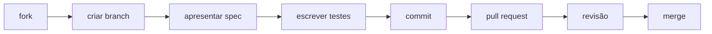
```mermaid
flowchart LR
    fork[fork] --> branch[criar branch]
    branch --> spec[apresentar spec]
    spec --> test[escrever testes]
    test --> commit[commit]
    commit --> pr[pull request]
    pr --> review[revisão]
    review --> merge[merge]
```

Recibo de release exigido: `git describe --tags --exact-match HEAD` +
checksums publicados (`sha256sum -c` / `shasum -a 256 -c`).

### Vulnerabilidades

Consulte [SECURITY.md](SECURITY.md): use o canal privado de **Security
Advisories** e **não abra issue pública** para vulnerabilidades.

---

## Documentação e licença

| Documento | Para quem | Descrição |
|---|---|---|
| [QUICKSTART.md](quickstart.md) | Iniciantes | Primeiros passos rápidos |
| [MANUAL.md](MANUAL.md) | Todos | Uso completo da CLI, linguagem simples |
| [ARCHITECTURE.md](ARCHITECTURE.md) | Desenvolvedores | Arquitetura técnica, camadas, fluxos |
| [Arquitetura R879](docs/ARQUITETURA_COMPLETA_CORE_R879.md) | Operadores e desenvolvedores | Mapa completo, dependências, fluxogramas e fronteiras |
| [Prontidão local](docs/PRONTIDAO_LOCAL_CORE_R868.md) | Operadores | Resultados executados e limitações por operação |
| [Assistente REA](docs/ASSISTENTE_REA_LOCAL.md) | Operadores | Setup, engines, inspeção, MCP e limites de isolamento |
| [Rede de memória](docs/REDE_MEMORIA_CORE.md) | Operadores | Terminal, painel e origem dos dados visualizados |
| [CLAUDE.md](CLAUDE.md) | Agentes | Manual de operação para agentes |
| [CONTRIBUTING.md](CONTRIBUTING.md) | Contribuidores | Como participar (spec → testes → PR) |
| [SECURITY.md](SECURITY.md) | Segurança | Vulnerabilidades e política |
| [CORRIGENDUM.md](CORRIGENDUM.md) | Histórico | Correções de alegações passadas |
| [CHANGELOG.md](CHANGELOG.md) | Mudanças | Versões anteriores |
| [VALIDATION_R448.md](VALIDATION_R448.md) | Auditoria | Recibo de validação local R448 |
| [LICENSE](LICENSE) | Legal | Licença MIT |
| [installer/README.md](installer/README.md) | Instalação | Procedimento Linux/macOS/WSL |
| [installer/windows/README.md](installer/windows/README.md) | Instalação | Procedimento Windows/WSL |

### Frentes de produção e conteúdo versionado

| Caminho | O que contém |
|---|---|
| [`livro-alfabetizacao/`](livro-alfabetizacao/) | Trilogia de alfabetização R200‑R211: volume1..5, VolumeProfissional, CadernoMotor, fontes escolares (licenças em `fontes/readme-fontes.md`), `dados_volumes.py`/`expandir_volume.py`/`rastreio_integrado.py` e `compilar.sh` |
| [`research/imo_study/`](research/imo_study/) | Estudo de raciocínio: benchmark pareado IMO 9×3, réplicas R500/R503/R504/R506, scripts e artigos em `artigo_abnt/`, `artigo_arxiv/`, `artigo_arxiv_pt/` (PDFs de build ignorados) |
| [`manuscrito_porescrito799_R522/`](manuscrito_porescrito799_R522/) | Pesquisa *IA generativa no Direito* (R522): manuscritos v20→v49 (docx/md), formulário de submissão, execução real (txt extraídos, JSONs OpenAlex, scripts) e pacote público de depósito OSF/Zenodo |
| [`pesquisa-artigo-qualis-a1/producao/ia-direito-educacao/`](pesquisa-artigo-qualis-a1/producao/ia-direito-educacao/) | Produção do artigo IA Direito & Educação: diagnóstico/gap (m0‑m1), protocolo de revisão (m2‑m3), manuscrito rascunho (m5) e auditoria de fontes (m7) |
| [`medicos/`](medicos/) | Plugin exportado Médico Virtual Supremo v0.4.0 (fonte da skill R‑205.v3): `plugin.json`, skill.md v3.0 "conselho‑longitudinal", referências e assets |
| [`banca_mestrado_educacao_campo.*`](banca_mestrado_educacao_campo.tex) | Banca simulada de mestrado em educação do campo (LaTeX + bib) e [`auditoria_referencias_tcc.md`](AUDITORIA_REFERENCIAS_TCC.md), auditoria de referências ABNT |
| [`landscape/`](landscape/) | Relatório e manifesto da paisagem "awesome‑llm‑apps" (curadoria SPEC R482/R521) |
| [`reversa_feynman/`](reversa_feynman/) | Gates de evidência, ledger, avaliação offline e calibração de router (método Feynman) |
| [`hermes_bridge/`](hermes_bridge/) | Bridge de memória e governança de skills: firewall de memória, contratos, trajetórias e adaptador de evidências |
| [`integrations/code_executor.py`](integrations/code_executor.py) | Execução de código para pipelines de agentes |
| [`integrations/free_model_catalog.py`](integrations/free_model_catalog.py) | Catálogo de modelos livres e provedores OpenCode |
| [`scripts/preprocess_docx.py`](scripts/preprocess_docx.py) | Normalização de docx → markdown (estrutura, cabeçalhos, tabelas) |

Links: [GitHub](https://github.com/MarceloClaro/opencode-ecosystem-core) ·
[HuggingFace Core](https://huggingface.co/datasets/marceloclaro/opencode-ecosystem-core) ·
[HuggingFace Research](https://huggingface.co/datasets/marceloclaro/opencode-research)

### Licença

Distribuído sob a [licença MIT](LICENSE).

### Livro Core: leitura, prática e consulta

O [livro em LaTeX](livro-core/main.tex) acompanha um mesmo caso de estudo do prefácio à reprodução: problema, ambiente, arquitetura, coordenação, memória, aceite, raciocínio e pesquisa. Mapas mentais, diagramas e fluxogramas explicam mecanismos e limites; o catálogo extenso fica nos apêndices. As ampliações didáticas R903–R906 foram conservadas e revisadas.

A [revisão editorial R901/R907](docs/REVISAO_LIVRO_R907.md) e o [manifesto de verificação local](docs/verification-book-r907.json) separam inventário, teste, compilação e amostragem visual. Para gerar o PDF na pasta `livro-core`, atualize os geradores e o inventário e execute `latexmk -pdf -interaction=nonstopmode -halt-on-error main.tex`. Os testes de estrutura e o PDF compilado não medem eficácia pedagógica nem substituem revisão externa.

A [verificação formal R908](docs/VERIFICACAO_FORMAL_LIVRO_R908.md) acrescenta 158 teoremas aceitos pelo Lean 4.34.1, com Mathlib fixada, auditoria de axiomas e controles negativos. A [matriz de fórmulas](docs/book-math-map-r908.json) distingue 27 famílias matemáticas/modelos de uma família de observações empíricas. O [recibo da execução](docs/verification-book-lean-r908.json) identifica fontes e dependências; as provas não certificam dados experimentais, o runtime Python ou segurança IEEE-754.

### Integridade operacional

O diagnóstico estrutural R868 registrou 22 checks aprovados, com alcance
`installation_only`. Autenticação, inferência e execução de cada operação
exigem seus próprios recibos. Configuração, memória privada, evidências de
alvos e resultados locais completos ficam fora do Git conforme
[as regras de reprodução](docs/REPOSITORIO_REPRODUZIVEL.md).

A licença MIT do Core não atribui automaticamente licença a modelos,
ferramentas comerciais ou artefatos federados. Consulte a procedência de cada
componente. Métricas internas não implicam validação externa.

---

<div align="center">

### Feito com carinho por [Marcelo Claro Laranjeira](https://github.com/MarceloClaro)

[](https://github.com/MarceloClaro)
[](https://orcid.org/0000-0001-8996-2887)
[](https://huggingface.co/datasets/marceloclaro/opencode-ecosystem-core)
[](LICENSE)

**[⬆ voltar ao topo](#-opencode-ecosystem-core)**

</div>
