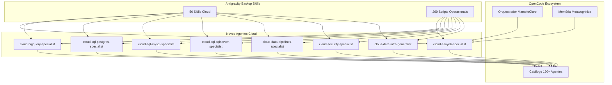

# Catálogo de Skills Cloud (Antigravity Backup)

> **Fonte**: Backup do Antigravity (Google DeepMind Advanced Agentic Coding)
> **Licença**: Apache 2.0 (atribuição ao Google)
> **Data de integração**: 2026-07-11 (SPEC-935-R130)

---

## 1. Categoria: AlloyDB Omni (9 skills, 41 scripts)

Skills para administração e operação do AlloyDB Omni (Google Cloud).

| # | Skill | Descrição | Scripts | Tamanho SKILL.md |
|:-:|:------|:----------|:-------:|:-----------------:|
| 1 | **alloydb-omni-access-control** | Gerenciamento de acesso e usuários | 3 JS | 3.3 KB |
| 2 | **alloydb-omni-container** | Deploy e gestão de contêineres AlloyDB | 0 | 4.9 KB |
| 3 | **alloydb-omni-data** | Operações de dados (CRUD, schemas, indexes, views) | 8 JS | 10.3 KB |
| 4 | **alloydb-omni-health** | Auditoria de saúde, storage bloat, índices quebrados | 6 JS | 4.6 KB |
| 5 | **alloydb-omni-kubernetes** | Operações Kubernetes para AlloyDB | 0 | 18.2 KB |
| 6 | **alloydb-omni-monitor** | Monitoramento de queries, locks, estatísticas | 6 JS | 9.4 KB |
| 7 | **alloydb-omni-optimize** | Otimização de configurações (autovacuum, memória) | 7 JS | 3.1 KB |
| 8 | **alloydb-omni-performance** | Performance tuning, planos de execução, cardinalidade | 7 JS | 11.7 KB |
| 9 | **alloydb-omni-replication** | Replicação, publication tables, replication slots | 4 JS | 3.6 KB |

## 2. Categoria: AlloyDB PostgreSQL (7 skills, 50 scripts)

Skills para AlloyDB com perfil PostgreSQL.

| # | Skill | Descrição | Scripts | Tamanho SKILL.md |
|:-:|:------|:----------|:-------:|:-----------------:|
| 10 | **alloydb-postgres-access-management** | Gerenciamento de roles, usuários, acesso | 6 JS | 4.5 KB |
| 11 | **alloydb-postgres-admin** | Admin de cluster/instância | 8 JS | 6.0 KB |
| 12 | **alloydb-postgres-data** | Dados: schemas, tabelas, views, stored procedures | 8 JS | 6.3 KB |
| 13 | **alloydb-postgres-health** | Saúde: autovacuum, bloat, tablespaces, estatísticas | 8 JS | 4.8 KB |
| 14 | **alloydb-postgres-monitor** | Monitoramento avançado: queries, locks, métricas | 8 JS | 22.8 KB |
| 15 | **alloydb-postgres-optimize** | Otimização: extensões, memória, configurações PG | 6 JS | 2.3 KB |
| 16 | **alloydb-postgres-replication** | Replicação: slots, publications, estatísticas | 6 JS | 3.4 KB |

## 3. Categoria: Cloud SQL PostgreSQL (9 skills, 62 scripts)

Skills para Cloud SQL PostgreSQL.

| # | Skill | Descrição | Scripts | Tamanho SKILL.md |
|:-:|:------|:----------|:-------:|:-----------------:|
| 17 | **cloud-sql-postgres-admin** | Admin de instâncias, databases, usuários | 8 JS | 13.0 KB |
| 18 | **cloud-sql-postgres-data** | Dados: schemas, tabelas, indexes, views, triggers | 8 JS | 10.3 KB |
| 19 | **cloud-sql-postgres-health** | Saúde: autovacuum, bloat, locks, query stats | 8 JS | 27.7 KB |
| 20 | **cloud-sql-postgres-lifecycle** | Ciclo de vida: backups, restore, upgrade check | 7 JS | 10.7 KB |
| 21 | **cloud-sql-postgres-monitor** | Monitoramento: queries, locks, database stats | 8 JS | 27.7 KB |
| 22 | **cloud-sql-postgres-replication** | Replicação: publications, slots, roles | 6 JS | 5.9 KB |
| 23 | **cloud-sql-postgres-vectorassist** | Vector assist: specs, queries, embeddings | 5 JS | 27.4 KB |
| 24 | **cloud-sql-postgres-view-config** | Configuração: extensões, memória, PG settings | 6 JS | 3.6 KB |

## 4. Categoria: Cloud SQL MySQL (4 skills, 24 scripts)

Skills para Cloud SQL MySQL.

| # | Skill | Descrição | Scripts | Tamanho SKILL.md |
|:-:|:------|:----------|:-------:|:-----------------:|
| 25 | **cloud-sql-mysql-admin** | Admin de instâncias, databases, usuários | 7 JS | 10.1 KB |
| 26 | **cloud-sql-mysql-data** | Dados: SQL, query plans, active queries | 4 JS | 4.2 KB |
| 27 | **cloud-sql-mysql-lifecycle** | Ciclo de vida: backups, clone, restore | 6 JS | 11.1 KB |
| 28 | **cloud-sql-mysql-monitor** | Monitoramento: queries, stats, fragmentação | 7 JS | 24.5 KB |

## 5. Categoria: Cloud SQL SQL Server (4 skills, 16 scripts)

Skills para Cloud SQL SQL Server.

| # | Skill | Descrição | Scripts | Tamanho SKILL.md |
|:-:|:------|:----------|:-------:|:-----------------:|
| 29 | **cloud-sql-sqlserver-admin** | Admin de instâncias, databases, usuários | 7 JS | 8.8 KB |
| 30 | **cloud-sql-sqlserver-data** | Dados: SQL, tabelas | 2 JS | 2.4 KB |
| 31 | **cloud-sql-sqlserver-lifecycle** | Ciclo de vida: backups, clone, restore | 6 JS | 11.1 KB |
| 32 | **cloud-sql-sqlserver-monitor** | Monitoramento: métricas do sistema | 1 JS | 10.2 KB |

## 6. Categoria: BigQuery (4 skills, 15+ referências)

Skills para BigQuery.

| # | Skill | Descrição | Scripts | Tamanho SKILL.md |
|:-:|:------|:----------|:-------:|:-----------------:|
| 33 | **bigquery** | SQL, ML/AI, BigFrames, Graph Analytics | 0 (refs: 25) | 3.9 KB |
| 34 | **bigquery-data-transfer-service** | DTS: transferências agendadas de dados | 1 PY | 7.1 KB |
| 35 | **dataform-bigquery** | Dataform: transformações SQL em BigQuery | 0 | 12.3 KB |
| 36 | **dbt-bigquery** | dbt: transformações analíticas em BigQuery | 0 | 11.8 KB |

## 7. Categoria: GCP Data Pipelines (8 skills, 7+ scripts)

Skills para pipelines de dados GCP.

| # | Skill | Descrição | Scripts | Tamanho SKILL.md |
|:-:|:------|:----------|:-------:|:-----------------:|
| 37 | **gcp-dataflow** | Apache Beam, Flex Templates, diagnóstico | 0 (refs: 10) | 21.3 KB |
| 38 | **gcp-composer-troubleshooting** | Troubleshooting Cloud Composer/Airflow | 0 | 9.1 KB |
| 39 | **gcp-spark** | Dataproc, Spark, ML tasks | 0 (refs: 5) | 3.9 KB |
| 40 | **gcp-pipeline-orchestration** | Orquestração de pipelines Cloud | 1 PY | 17.1 KB |
| 41 | **gcp-pipeline-resource-provisioning** | Provisionamento de recursos para pipelines | 0 | 6.5 KB |
| 42 | **gcp-data-pipelines** | Pipelines de dados GCP em geral | 0 | 9.5 KB |
| 43 | **data-autocleaning** | Limpeza automática com Dataplex | 1 PY | 12.1 KB |
| 44 | **federate-lakehouse-catalog** | Federação de catálogo lakehouse | 0 | 10.3 KB |

## 8. Categoria: GCP Security & Auth (3 skills, 9 scripts)

Skills para segurança e autenticação GCP.

| # | Skill | Descrição | Scripts | Tamanho SKILL.md |
|:-:|:------|:----------|:-------:|:-----------------:|
| 45 | **gcs-security-assessment** | Avaliação postura de segurança GCS | 7 PY + refs | 6.8 KB |
| 46 | **gcloud-auth-verification** | Verificação de autenticação gcloud | 0 | 2.0 KB |
| 47 | **accidental-data-loss-prevention** | Prevenção de perda acidental de dados | 0 | 1.3 KB |

## 9. Categoria: Firestore & Spanner (2 skills, 10 scripts)

Skills para bancos NoSQL e NewSQL do GCP.

| # | Skill | Descrição | Scripts | Tamanho SKILL.md |
|:-:|:------|:----------|:-------:|:-----------------:|
| 48 | **firestore-data** | Firestore: CRUD, queries, collections | 6 JS | 8.3 KB |
| 49 | **spanner-data** | Spanner: SQL, DQL, graphs, tables | 4 JS | 2.8 KB |

## 10. Categoria: Ferramentas GCP Gerais (7 skills)

Skills auxiliares para desenvolvimento em GCP.

| # | Skill | Descrição | Tamanho SKILL.md |
|:-:|:------|:----------|:-----------------:|
| 50 | **building-data-apps** | Criação de apps de dados (React, Streamlit, FastAPI) | 6.3 KB |
| 51 | **discovering-gcp-data-assets** | Descoberta de assets de dados GCP | 9.9 KB |
| 52 | **gcp-managed-airflow-migrations** | Migrações de Airflow gerenciado | 11.7 KB |
| 53 | **managing-python-dependencies** | Gerenciamento de dependências Python | 2.8 KB |
| 54 | **ml-best-practices** | Melhores práticas de ML em GCP | 9.8 KB |
| 55 | **notebook-guidance** | Orientações para notebooks (Vertex AI, Colab) | 15.1 KB |
| 56 | **skill-repair** | Reparo de skills do Antigravity | 1.8 KB |

---

## Scripts Operacionais (269)

### JavaScript MCP Tools (majoria)
Scripts para operações de banco de dados via MCP:
- **CRUD**: `execute_sql.js`, `create_user.js`, `add_documents.js`
- **Health**: `database_overview.js`, `list_table_stats.js`, `list_invalid_indexes.js`
- **Monitor**: `list_active_queries.js`, `list_locks.js`, `long_running_transactions.js`
- **Admin**: `create_instance.js`, `clone_instance.js`, `create_backup.js`
- **Replication**: `list_replication_slots.js`, `list_publication_tables.js`
- **Optimize**: `list_memory_configurations.js`, `list_available_extensions.js`

### Python Scripts (ferramentas avançadas)
- `bigquery_dts.py` — Transfer Service agendado
- `dataplex_scanner.py` — Scanner de limpeza automática
- `airflow_trigger.py` — Trigger de pipelines Airflow
- `evaluate_project_security_posture.py` — Auditoria de segurança GCS
- `fetch_bucket_telemetry.py` — Telemetria de buckets
- `cloud_rest_helpers_nodeps.py` — Helpers REST sem dependências

### Referências Técnicas (Markdown)
- BigQuery ML/AI: `ai_forecast.md`, `ai_classify.md`, `vector_search.md`
- Graph: `graph_queries.md`, `semantic_queries.md`
- GCS Security: `saif_risk_factors.md`, `toxic_combinations.md`
- Dataflow: `streaming_job_health.md`, `bottlenecks_and_parallelism_context.md`

---

## Mapa de Integração com o Ecossistema

## Licenciamento

Todas as skills e scripts neste catálogo são licenciados sob **Apache License 2.0**,
conforme especificado nos arquivos SKILL.md originais do Google.
Atribuição: Google Cloud Platform / Google DeepMind (Antigravity).

## Histórico

| Data | Versão | Descrição |
|:-----|:-------|:----------|
| 2026-07-11 | 1.0.0 | Catalogação inicial (SPEC-935-R130) — 56 skills, 269 scripts |
