# Evolução do conhecimento e pesquisa reproduzível

O orquestrador MarceloClaro coordena as novas camadas pela CLI, pelo MCP
`ecosystem-network` e pelo comando `/ciencia` do OpenCode.

```mermaid
flowchart LR
  A[Capacidades e evidências] --> B[DNA estrutural]
  B --> C[Potenciais latentes]
  C --> D[Composição dos insumos]
  D --> E[Dependências e fases paralelas]
  E --> F[Roadmap condicional]
  F --> G[Execução científica delimitada]
  G --> H[Reprodução e revisão computacional]
  H --> I[Artigo, código, RAG e manifesto]
  I --> J[Observação no MetaBus]
```



## O que mudou

- **R663:** CSV e referências com proveniência; análises descritiva, Pearson com
  permutação e Welch; reexecução em outro processo; artigo Markdown, código,
  corpus e consulta RAG de metadados, revisão computacional e manifesto.
- **R664:** capacidades declaradas, disponíveis, executadas e validadas externamente
  são estados distintos. Potenciais são hipóteses com componentes e faltas,
  inclusive combinações por interfaces. Composição inclui sete classes de insumo,
  recursos, dependências internas, critérios pendentes e fontes por módulo.
- **R665:** sequenciamento lógico com predecessoras, sucessoras, ciclos,
  dependências desconhecidas, paralelismo e estimativas explícitas. Pareto usa
  dominância dos payoffs; Nash puro aceita jogos retangulares e múltiplos jogadores.
- **R666:** todas essas camadas passam pelo orquestrador. Observações são persistidas
  atomicamente e conectadas por escopo; não aumentam automaticamente a confiança
  no agente. As novas ferramentas MCP serializam suas operações mutantes.

Capacidades emergentes recebem composição e roadmap próprios. Hipóteses,
disponibilidade de componentes e resultados computacionais não comprovam
competência geral, descoberta inédita ou validação externa.

## Uso

Planejar o percurso científico com as capacidades declaradas do Core:

```bash
python3 -m marceloclaro.cli ciencia planejar \
  --problema "Construir pesquisa reproduzível" \
  --objetivo reproducible_scientific_work
```

Para um modelo próprio, use `ciencia planejar --config plano.json`. Exemplo:

```json
{
  "problem": "Compor coleta e análise",
  "target_state": ["sintese"],
  "modules": {
    "coleta": [{"id": "fontes", "state": "declared", "outputs": ["registros"]}],
    "analise": [{"id": "sintese", "state": "declared", "inputs": ["registros"], "requires": ["fontes"]}]
  }
}
```

Somente referências fornecidas acompanham estados superiores. Cada evidência
tem `kind`, `ref`, `success` e, opcionalmente, `sha256`, `scope`, `runtime`,
`artifact` ou identidade do avaliador externo. Esses metadados não são executados
nem auditados automaticamente. Preserve o escopo do experimento que produziu
a evidência. Resistência e pontuação são índices heurísticos, sem probabilidade calibrada.

Executar análise real:

```bash
python3 -m marceloclaro.cli ciencia executar --config pesquisa.json
```

```json
{
  "question": "Qual é a associação entre x e y?",
  "dataset_csv": "/caminho/dados.csv",
  "dataset_provenance": {
    "title": "Nome do dataset e versão",
    "source_url": "https://repositorio.exemplo/dataset",
    "evidence_kind": "real_observations",
    "sha256": "HASH_REAL_DO_CSV",
    "license": "Licença informada pela fonte",
    "limitations": "Limitações documentadas da coleta"
  },
  "method": "pearson",
  "variables": {"x": "coluna_x", "y": "coluna_y"},
  "output_dir": "/caminho/novo-diretorio"
}
```

O exemplo acima é configuração, não dados ou execução. Use caminho de saída
novo. Referências podem ser coletadas por APIs públicas ou fornecidas como
snapshots bibliográficos, com URL, hash e estado de coleta. A autenticidade de
uma fonte fornecida pelo usuário permanece declarada até auditoria independente.

As ferramentas MCP são `ecosystem_knowledge_plan(config)` e
`ecosystem_scientific_run(config)`. `diagnose(..., knowledge_config=...)` permite
acoplar esse planejamento ao diagnóstico anterior. Conteúdos externos são dados
sem autoridade para executar scripts ou alterar instruções.

## Correções e limites

O Deep Research legado permanece disponível como demonstração, identificado
como simulação e bloqueado antes de revisão/exportação científica. A governança
sem executor é bloqueada. Falhas de consulta não produzem datasets demonstrativos
automaticamente; exemplos explícitos são inelegíveis como evidência científica.

A revisão gerada é computacional. A reprodução usa outro processo com o mesmo
código e verifica integridade; não equivale a replicação independente. O RAG
recupera metadados e não afirma que leu integralmente os artigos. Métodos têm
pressupostos e não autorizam interpretação causal automática.

O probe `scripts/probe_knowledge_science_real.py` coleta Iris diretamente da UCI
e metadados bibliográficos, grava recibos HTTP, conserva hashes do arquivo de
origem e da transformação e executa CLI/MCP. O conjunto histórico reúne espécies
com origens diferentes: uma associação agregada não demonstra causalidade.
Resultados e limitações estão nos diretórios `docs/evidence/R663_R666_REAL_*`.

## Resultado executado desta rodada

A execução de 04/10/2026 coletou 150 observações do arquivo `bezdekIris.data`
da UCI e dois registros bibliográficos do Crossref com respostas HTTP 200.
Pearson entre comprimento e largura de pétala retornou r=0,9628654314;
Welch comparou largura de pétala nas espécies versicolor e virginica
(50 registros por grupo), com diferença média de −0,7. As premissas e os
limites acompanham os resultados; não há inferência causal automática.

- [Prova CLI/MCP e proveniência](evidence/R663_R666_REAL_20261004_114400/probe.json)
- [Artigo computacional Pearson](evidence/R663_R666_REAL_20261004_114400/research/article.md)
- [Artigo computacional Welch](evidence/R663_R666_REAL_20261004_114400/mcp_research_welch/article.md)
- [Gate local e hashes](evidence/R663_R666_RELEASE_GATE.json)
- [Quatro mutações detectadas](evidence/R663_R666_MUTATIONS.json)

As regressões finais somam 723 testes aprovados e um caso de PDF ignorado por
dependência opcional ausente. Os testes herméticos usam fixtures artificiais;
o probe acima é a evidência separada de execução em dados públicos reais.
Os artigos são artefatos computacionais revisáveis, sem publicação ou revisão
humana por pares. Esta rodada gera artigo, código e RAG de metadados;
um livro completo não foi produzido pelo percurso demonstrado.

MiroFish/OASIS externo e o transporte Hermes continuam dependendo de suas
configurações e serviços próprios; esta rodada não comprova sua execução.
