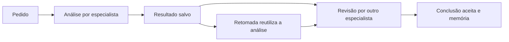

# Coordenação em etapas e retomada

No OpenCode, peça:

```text
/ecosystem analise a arquitetura desta tarefa e depois peça uma revisão independente a outro especialista: ...
```

O orquestrador monta etapas com dependências. Cada especialista recebe a
entrega anterior identificada pela origem, pelo executor e pela tarefa. O
progresso é salvo no projeto e o resultado informa `workflow_id`.



`ecosystem_workflow_status` consulta um workflow sem execução. Para retomar,
envie a mesma definição, seu identificador e `resume=true`. A rede reutiliza
etapas concluídas. Uma execução interrompida fica marcada como incerta;
repetir falhas exige `retry_failed=true` e consome novos passos. Mudar a tarefa
exige um novo workflow para evitar reaproveitar uma entrega incompatível.

## Uso pela CLI no Ubuntu

Exemplo de `etapas.json`:

```json
{
  "nodes": [
    {"id": "analysis", "task": "Resumir a arquitetura proposta",
     "required_capabilities": ["summarize"], "per_node_max_steps": 2},
    {"id": "review", "task": "Revisar a análise e indicar limitações",
     "dependencies": ["analysis"], "required_capabilities": ["review"],
     "per_node_max_steps": 2}
  ]
}
```

```bash
.venv/bin/python -m marceloclaro.cli network workflow etapas.json --max-steps 6 --timeout 180
.venv/bin/python -m marceloclaro.cli network workflow-status ID_INFORMADO
.venv/bin/python -m marceloclaro.cli network workflow etapas.json --workflow-id ID_INFORMADO --resume --max-steps 6
```

Para escolher um serviço, adicione `"ecosystem": "codex"`, `"claude"` ou
`"antigravity"` na etapa. No modo automático, dois passos por etapa permitem
uma alternativa após falha. Passos usados continuam consumidos na retomada;
ampliar `--max-steps` autoriza orçamento adicional, até 24 passos totais.

## Saúde e limites

- Instalação, última execução e elegibilidade automática são estados distintos.
  Falhas de saldo, autenticação, indisponibilidade ou tempo limite aplicam
  pausa automática de 120 segundos. Escolha explícita permite nova tentativa.
- A saúde guarda horários, duração e categoria de erro; não guarda prompts,
  respostas nem credenciais. Alteração do executável invalida evidência antiga.
- Checkpoints guardam tarefas e entregas em `.mci_state/workflows`, área local
  ignorada pelo Git. Publicação atômica e bloqueio por workflow evitam repetir
  etapas por concorrência ou expor um registro parcialmente escrito.
- Cada workflow contém até oito etapas. Elas executam sequencialmente. O prazo
  máximo é 600 segundos por invocação; a pausa entre retomadas não consome esse
  prazo. Passos são contados durante toda a vida do workflow.
- A ponte executa leitura, análise e texto. O OpenCode principal aplica edições
  e testes autorizados com suas ferramentas nativas. A atenção é roteamento
  auditável; não há treinamento de uma rede neural nem execução contínua sem
  tarefa. A avaliação interna de texto é heurística.

## Validação

Os testes R644 cobrem dependências, budgets, contexto, retomada, falhas de
persistência, interrupção, concorrência e saúde. As provas de execução real
e os relatórios do gate ficam em `.backups/r644` e são distinguidos dos testes
com executores simulados na especificação `SPEC-935-R644`.
