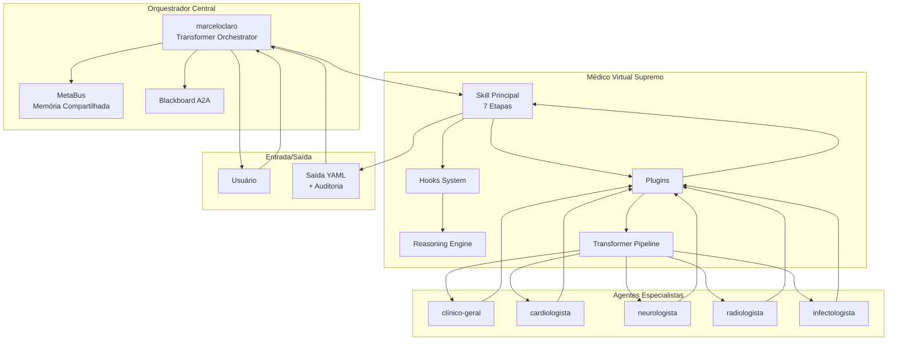

# SPEC-935-R205 — Integração do Médico Virtual Supremo ao Ecossistema OpenCode com Raciocínio Científico, Validação Cruzada e Orquestração Transformer

**Versão**: 1.0.0  
**Status**: Proposta  
**Data**: 2026-07-20  
**Autor**: Marcelo Claro (OpenCode Ecosystem Core)  
**Rótulos**: `medicina`, `clinical-decision-support`, `raciocínio-científico`, `validação-cruzada`, `transformer-orchestration`, `multi-agente`

---

## 1. Visão Geral

Este ciclo especifica a **integração profunda** da skill **Médico Virtual Supremo v2.0** (`skills/medico_virtual_supremo/`) ao ecossistema OpenCode, expandindo suas capacidades com:

1. **Sistema de Hooks Clínicos** — pré/pós-processamento modular para cada etapa do pipeline (normalização, hipóteses, plano, verificação)
2. **Plugins de Validação Cruzada Multi-Agente** — segunda opinião automatizada, validação diferencial, verificação de evidências
3. **Motor de Raciocínio Científico** — medicina baseada em evidências (EBM) com GRADE, PICO, SOAP, raciocínio bayesiano
4. **Agentes Médicos Especialistas** — cardiologia, neurologia, radiologia, infectologia + clínico geral orquestrador
5. **Pipeline Transformer de Orquestração Clínica** — roteamento inteligente de casos clínicos para o especialista adequado
6. **Suíte de Testes TDD** — 25+ cenários de validação

### 1.1 Arquitetura Transformer

A orquestração segue o padrão **Transformer Architecture** do OpenCode (SPEC-004, SPEC-005, SPEC-934):

```
Entrada Clínica
    ↓
[Pré-Hooks] → limpeza, validação, enriquecimento
    ↓
[Encoder Clínico] → representação do problema (síndrome, gravidade, temporalidade)
    ↓
[Roteamento Transformer] → atenção multi-cabeça para seleção de especialistas
    ↓
[Agentes Especialistas] → cardiologista, neurologista, infectologista, radiologista
    ↓
[Validação Cruzada] → consistência entre especialistas, detecção de conflitos
    ↓
[Síntese] → plano integrado para revisão humana
    ↓
[Pós-Hooks] → auditoria, rastreabilidade, formatação da saída
    ↓
Saída Estruturada YAML
```

## 2. Componentes do Sistema

### 2.1 Hooks Clínicos (`skills/medico_virtual_supremo/hooks/`)

| Hook | Disparo | Função |
|:-----|:--------|:-------|
| `pre_normalize` | Antes da Etapa 1 | Validar entrada, sanitizar dados sensíveis |
| `post_normalize` | Após Etapa 1 | Enriquecer dados, detectar padrões |
| `pre_hypothesis` | Antes da Etapa 3 | Carregar histórico do paciente |
| `post_hypothesis` | Após Etapa 3 | Ranquear hipóteses por gravidade |
| `pre_plan` | Antes da Etapa 5 | Verificar interações medicamentosas |
| `post_plan` | Após Etapa 5 | Adaptar linguagem ao público-alvo |
| `pre_verify` | Antes da Etapa 6 | Carregar checklist personalizado |
| `post_verify` | Após Etapa 6 | Gerar sumário de auditoria |

### 2.2 Plugins de Validação Cruzada (`skills/medico_virtual_supremo/plugins/`)

| Plugin | Função |
|:-------|:-------|
| `CrossValidationPlugin` | Coordena segunda opinião entre múltiplos agentes especialistas |
| `DifferentialValidator` | Valida completude das hipóteses diferenciais |
| `EvidenceCrosscheck` | Verifica consistência interna das evidências citadas |

### 2.3 Motor de Raciocínio Científico (`skills/medico_virtual_supremo/reasoning/`)

| Motor | Framework | Aplicação |
|:------|:----------|:-----------|
| `EvidenceBasedReasoning` | GRADE + PICO + SOAP | Classificação de evidência e força de recomendação |
| `DiagnosticReasoning` | Bayes + likelihood ratios | Probabilidade pré/pós-teste |
| `TherapeuticReasoning` | NNT/NNH + benefício/risco | Análise de opções terapêuticas |

### 2.4 Agentes Médicos Especialistas

| ID | Especialidade | Competências |
|:---|:--------------|:-------------|
| `medico-cardiologista` | Cardiologia | ECG, síndromes coronarianas, ICC, arritmias |
| `medico-neurologista` | Neurologia | AVC, cefaleia, epilepsia, demências |
| `medico-radiologista` | Radiologia | Laudo de imagem, achados incidentais |
| `medico-infectologista` | Infectologia | Antibioticoterapia, sepse, doenças tropicais |
| `medico-clinico-geral` | Clínica Geral | Orquestrador, visão integrada, encaminhamentos |

### 2.5 Pipeline Transformer (`skills/medico_virtual_supremo/orchestration/`)

Implementa **roteamento por atenção multi-cabeça**:
- **Query**: Representação do problema clínico
- **Key/Value**: Perfis de competência dos especialistas
- **Atenção**: Similaridade semântica entre caso e especialidade
- **Saída**: Roteamento para top-K especialistas + pesos de confiança

## 3. Critérios de Aceitação (TDD)

### CT-01: Sistema de Hooks
- [ ] Hook `pre_normalize` é executado antes da normalização
- [ ] Hook `post_hypothesis` recebe as hipóteses geradas
- [ ] Hooks podem modificar o fluxo de dados
- [ ] Hooks falham graciosamente sem interromper o pipeline

### CT-02: Validação Cruzada
- [ ] Plugin `CrossValidation` coordena 2+ especialistas
- [ ] Plugin `DifferentialValidator` detecta lacunas em hipóteses
- [ ] Plugin `EvidenceCrosscheck` verifica consistência de fontes
- [ ] Conflitos entre especialistas são reportados

### CT-03: Raciocínio Científico
- [ ] `EvidenceBasedReasoning` classifica evidência por GRADE
- [ ] `DiagnosticReasoning` calcula probabilidade pré/pós-teste
- [ ] `TherapeuticReasoning` estima NNT/NNH
- [ ] Resultados incluem nível de incerteza

### CT-04: Agentes Especialistas
- [ ] Cada agente tem prompt próprio no catálogo
- [ ] Agentes produzem saída no formato YAML padronizado
- [ ] Agentes respeitam os mesmos gates de segurança
- [ ] Agente `medico-clinico-geral` orquestra os demais

### CT-05: Pipeline Transformer
- [ ] Pipeline aceita caso clínico e roteia ao especialista
- [ ] Roteamento considera síndrome, gravidade e urgência
- [ ] Pesos de atenção são exportáveis para auditoria
- [ ] Fallback para clínico geral quando especialista não encontrado

### CT-06: Integração com MarceloClaro
- [ ] Orquestrador `marceloclaro` reconhece o agente `medico-virtual-supremo`
- [ ] Transformer pipeline registra eventos no MetaBus
- [ ] Decisões de roteamento são registradas no Blackboard
- [ ] Ciclo R205 registrado no EvolutionRegistry

## 4. Arquitetura de Integração



## 5. Plano de Implementação

| Fase | Componente | Artefatos | Depende de |
|:-----|:-----------|:----------|:-----------|
| 1 | Hooks System | `hooks/__init__.py`, `hooks/clinical_hooks.py` | — |
| 2 | Plugins | `plugins/__init__.py`, `plugins/cross_validation.py`, `plugins/differential_validator.py` | Fase 1 |
| 3 | Reasoning Engine | `reasoning/__init__.py`, `reasoning/evidence_based_reasoning.py`, `reasoning/diagnostic_reasoning.py` | — |
| 4 | Agentes | `agents/catalog/medico-*.md` (5 arquivos) | — |
| 5 | Transformer Pipeline | `orchestration/__init__.py`, `orchestration/transformer_pipeline.py` | Fases 2, 3, 4 |
| 6 | Integração | Atualização `opencode.json`, hooks no `marceloclaro` | Fase 5 |
| 7 | Testes TDD | `tests/test_r205_*.py` (25+ cenários) | Fases 1-6 |
| 8 | Registro | Ciclo de evolução R205 | Fase 7 |

## 6. Métricas de Sucesso

| Métrica | Alvo | Como medir |
|:--------|:-----|:-----------|
| Precisão do roteamento | >90% | Casos de teste com gold standard |
| Completude de hipóteses | >85% | DifferentialValidator |
| Consistência entre especialistas | <15% conflito | CrossValidation |
| Cobertura de testes TDD | >90% | pytest --cov |
| Tempo de resposta | <5s | Benchmark |

## 7. Riscos e Mitigações

| Risco | Probabilidade | Impacto | Mitigação |
|:------|:-------------|:--------|:----------|
| Agente especialista alucina diagnóstico | Média | Alto | Validação cruzada obrigatória + gate de segurança |
| Roteamento envia caso para especialidade errada | Baixa | Médio | Fallback para clínico geral + revisão explícita |
| Hooks criam dependência circular | Baixa | Médio | Grafo acíclico de hooks + timeout |
| Raciocínio bayesiano com dados insuficientes | Alta | Baixo | Intervalos amplos de incerteza + explicitação |

---

**Referências**: SPEC-004 (Transformer), SPEC-005 (Orquestrador), SPEC-934 (MetaBus Integration), `medicina/medicina.txt` (skill base), `skills/medico_virtual_supremo/skill.py` (implementação atual)
