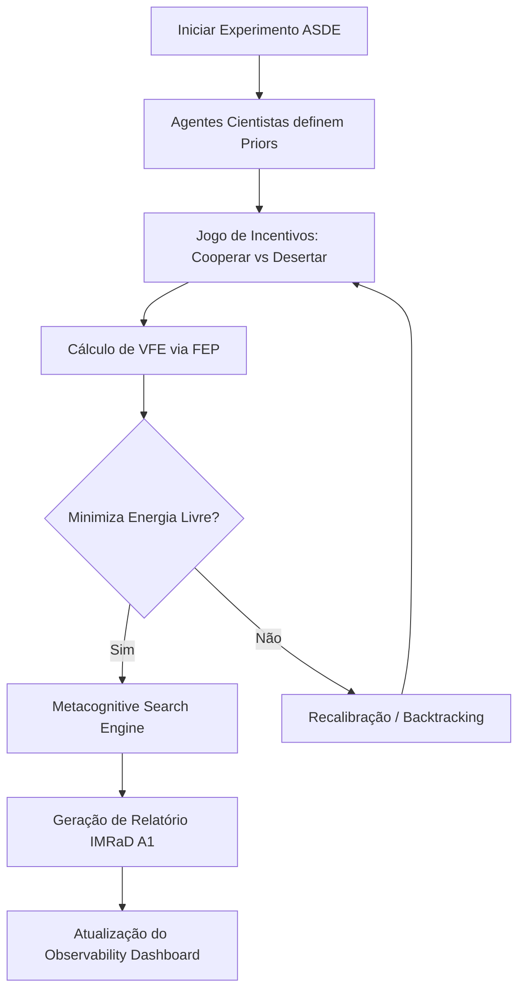

# SPEC-063: Execução de Experimentos Cognitivos no ASDE (Fase E)

## Status: PROPOSED
## Autor: Marcelo Claro (Orquestrador Supremo) & Antigravity pair programmer
## Data: 2026-06-29
## Ciclo: R30

---

## 1. Visão Geral

Esta especificação define o design e a implementação da **Fase E (Execução Real de Experimentos no ASDE)** para o **OpenCode Ecosystem**.

O ASDE (Autonomous Scientific Discovery Engine) será estendido para incorporar as dinâmicas estratégicas (Teoria dos Jogos), a inferência ativa (VFE) e a busca com backtracking (MSE) criadas nas fases anteriores. Células de simulação de agentes cientistas competirão ou colaborarão no desenvolvimento de novas hipóteses de pesquisa, medindo seu progresso cognitivo em tempo real e exportando as atualizações para o Observability Dashboard.

---

## 2. Objetivos e Requisitos

* **O1**: Criar o script de experimento integrado [nexus/scripts/asde_experiment_runner.py](file:///C:/Users/marce/Documents/OpenCode_Ecosystem/nexus/scripts/asde_experiment_runner.py) que:
  * Inicializa múltiplos agentes simulados com prioridades cognitivas distintas.
  * Executa um jogo estratégico (ex: Bens Públicos ou Caça ao Cervo) para decidir a cooperação em pesquisa.
  * Utiliza a inferência ativa (FEP/VFE) para calibrar suas crenças.
  * Executa a busca em árvore metacognitiva (MSE) para consolidar a dedução lógica e causal da descoberta.
  * Salva os logs experimentais em `.evolve/experiment-log.json`.
* **O2**: Desenvolver a suíte de testes TDD com 12+ CTs (`specs/test_asde_experiment.py`) validando a consistência dos experimentos.
* **O3**: Atualizar o painel de observabilidade (`dashboard_server.py`) para exibir os dados e gráficos do último experimento científico do ASDE.
* **O4**: Expor ferramentas MCP associadas no `EcosystemCapabilitiesMCPServer`.

---

## 3. Dinâmica do Experimento

---

## 4. Integração no Servidor MCP

Novas ferramentas de experimento:
* `eco_run_asde_experiment`: Executa o experimento integrado com parâmetros customizados.
* `eco_get_latest_experiment_results`: Retorna as métricas e logs do último experimento concluído.
